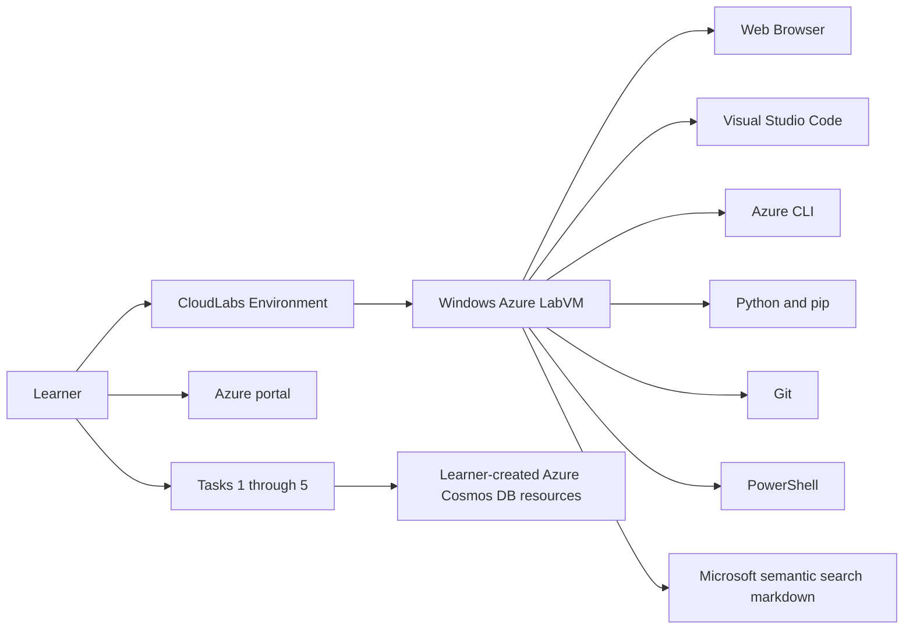

# Getting Started

### Estimated Duration: 15 Minutes

## Scenario

In this lab, you will use a CloudLabs-provided Azure LabVM as your workstation to complete the Microsoft Azure Cosmos DB for NoSQL semantic search lab in `instructions/cosmosdb/02-build-semantic-search.md`. The Microsoft markdown is the source of truth for the lab procedure. This CloudLabs page only helps you access the environment, confirm the required tools are available, and begin the Microsoft-authored task flow without changing the original sequence.

## Lab Overview

You will connect to the LabVM, sign in to Azure, verify the developer tools required by the Microsoft lab, and then open the Microsoft semantic search instructions. After that, you will follow the Microsoft task flow unchanged.

## Objectives

- Access the Azure LabVM environment
- Sign in to Azure with the provided lab credentials
- Confirm Visual Studio Code, Azure CLI, Python, pip, Git, and PowerShell are available
- Open the Microsoft semantic search markdown from the LabVM
- Proceed through the five Microsoft tasks in the original order

## Prerequisites

Before you begin, make sure you have access to the CloudLabs environment and your lab deployment details:

- Azure portal: <https://portal.azure.com>
- Username: <inject key="AzureAdUserEmail"></inject>
- Password: <inject key="AzureAdUserPassword"></inject>
- Subscription: `<inject key="SubscriptionID"></inject>`
- Tenant: `<inject key="TenantID"></inject>`
- Deployment ID: **<inject key="DeploymentID" enableCopy="false"/>**

## Architecture

The CloudLabs deployment provides only the workstation environment needed for the Microsoft lab. Azure Cosmos DB resources and semantic search workload resources are created by you during the Microsoft task flow.



## Components

- **Azure LabVM**: Your Windows-based workstation for the lab.
- **Browser**: Used to access the Azure portal and Microsoft documentation.
- **Visual Studio Code**: Used during the Python and application tasks in the Microsoft lab.
- **Azure CLI**: Used to sign in and run deployment-related commands.
- **Python and pip**: Required for the semantic search sample and package installation steps.
- **Git**: Available as a standard developer tool on the LabVM.
- **PowerShell**: Available for environment verification and command-line work.
- **Microsoft markdown**: The authoritative procedure you must follow for all five tasks.

## Sign in and access the LabVM

1. Connect to the Azure LabVM provided for this lab.
2. On the LabVM, open a browser and go to <https://portal.azure.com>.
3. Sign in with the following credentials:
   - Username: `<inject key="AzureAdUserEmail"></inject>`
   - Password: `<inject key="AzureAdUserPassword"></inject>`
4. If you are prompted to confirm your directory or subscription context, verify that you are using:
   - Subscription: `<inject key="SubscriptionID"></inject>`
   - Tenant: `<inject key="TenantID"></inject>`
5. Note your deployment reference for this lab: **<inject key="DeploymentID" enableCopy="false"/>**.

> [!Note]
> Microsoft Learn guidance for Azure access uses the Azure portal at `portal.azure.com`, and Azure CLI interactive sign-in uses `az login` when you need terminal authentication from the LabVM.

## Verify the LabVM toolset

1. On the LabVM, open **Windows PowerShell**.
2. Run the following commands to confirm the required tools are available:

```powershell
code --version
az --version
python --version
pip --version
git --version
$PSVersionTable.PSVersion
```

3. Confirm that:
   - Visual Studio Code responds to `code --version`
   - Azure CLI responds to `az --version`
   - Python is version 3.12 or later
   - pip is available
   - Git is available
   - PowerShell is working

4. If needed, sign in to Azure CLI from the same PowerShell window:

```powershell
az login
az account show
```

5. Verify that the account context matches subscription `<inject key="SubscriptionID"></inject>`.

<validation step="LabVM readiness and task 1 prerequisites"/>

## Open the Microsoft lab instructions

1. From the LabVM, open the Microsoft semantic search markdown referenced by your lab host:
   - `instructions/cosmosdb/02-build-semantic-search.md`
2. Keep that markdown open for the remainder of the lab.
3. Use this CloudLabs guide only for environment orientation, sign-in details, and validation checkpoints.
4. Do not substitute this page for the Microsoft-authored procedure.

> [!Important]
> The Microsoft markdown remains the source of truth for the full procedure. Follow its wording, task order, commands, and resource creation steps exactly as written.

## Microsoft task sequence you will follow

After your LabVM is ready, continue with the Microsoft markdown and complete these tasks in order:

1. **Task 1:** Download project starter files and configure the deployment script
2. **Task 2:** Deploy an Azure Cosmos DB for NoSQL account with vector search capability
3. **Task 3:** Build Python functions for vector similarity search
4. **Task 4:** Create a container with vector embedding and indexing policies
5. **Task 5:** Test vector search using a Flask web application

## Summary

You have accessed the LabVM, signed in to Azure, verified the required developer tools, and located the Microsoft semantic search markdown that drives the lab. You are now ready to continue with the Microsoft-authored task flow in its original sequence.

## After publishing

> [!Note] These steps run **after** you push the template to CloudLabs — they verify CloudLabs can actually serve this lab guide to candidates.

- **Verify docs-proxy access:** open Templates → your template → **Lab Guide Settings** in <https://admin.cloudlabs.ai> and confirm CloudLabs can reach this repo via the docs proxy. If the repo is private, configure GitHub access at the template level.
- **Verify inline questions and inline validations:** sign in to <https://admin.cloudlabs.ai>, open your template, and walk through one full lab run to confirm every `<question>` and `<validation step="..."/>` renders correctly. Fix any that don't resolve.
