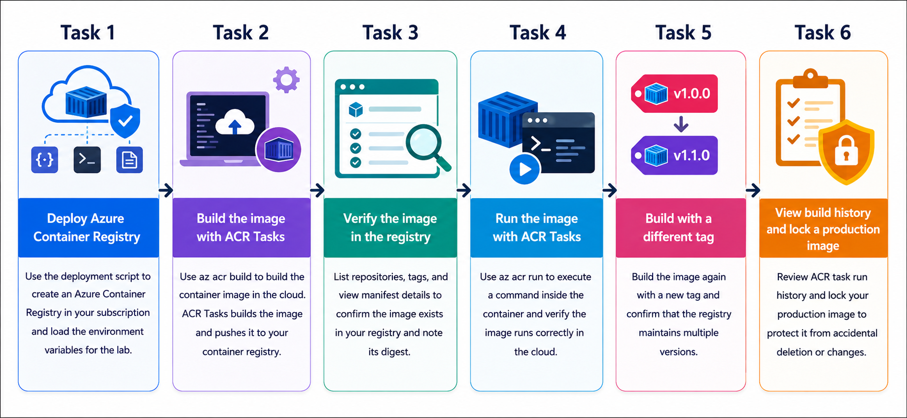
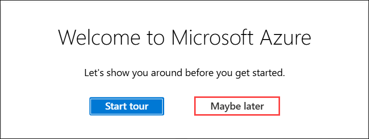

# Getting Started with your AI-200: Develop AI cloud solutions on Azure

Welcome to your AI-200: Develop AI Cloud Solutions on Azure workshop! We’re excited to guide you through hands-on learning with Azure services, containerization, serverless APIs, event-driven architectures, and data solutions to create, deploy, and test intelligent cloud applications.

## Lab 01: Build and run a container image with ACR Tasks

### Overall Estimated Timing: 60 Minutes

## Overview

In this hands-on lab, you will use Azure Container Registry (ACR) Tasks to build and manage container images entirely in the cloud, without requiring a local Docker installation. You will deploy an Azure Container Registry, build an image using ACR Tasks, verify the image in the registry, run the image in Azure, create a second tag, and review build history while locking a production image.

## Objectives

By the end of this lab, you will be able to:

1. **Deploy Azure Container Registry:** Create an Azure Container Registry resource in your subscription using the provided deployment script.

2. **Build container images with ACR Tasks:** Use Azure Container Registry Tasks to build and push container images directly from source without a local Docker setup.

3. **Verify and manage images:** List repositories, inspect tags, review image metadata, and confirm the image exists in the registry.

4. **Run images using ACR Tasks:** Execute a container command in Azure to validate that the built application runs correctly.

5. **Manage image versions and protection:** Create a new image tag, review build history, and lock a production image to prevent accidental changes.

## Pre-requisites

- Basic knowledge of Azure services and Azure resource management.

- Familiarity with container concepts and image tagging.

- Experience using Visual Studio Code, Azure CLI, and terminal commands (PowerShell or Bash).

- Access to an Azure subscription and the provided lab credentials.

## Architecture

The lab architecture demonstrates how Azure Container Registry Tasks can build and manage container images entirely in Azure, enabling developers to automate image builds, verify results, and protect production artifacts without relying on a local Docker environment.

1. **Azure Container Registry:** A central registry that stores container images and related metadata for your application.

2. **Azure Container Registry Tasks:** Azure-managed build jobs that compile and push container images from source code directly in the cloud.

3. **Application Source Code:** The application code and Docker context used by ACR Tasks to build the image.

4. **Azure Portal and Azure CLI:** Tools used to verify the registry, inspect repositories and tags, and manage image lifecycle operations.

## Architecture Diagram

## Explanation of Components

1. **Azure Container Registry:** Stores the built images and provides repositories, tags, and metadata for versioned container deployments.

2. **ACR Tasks:** Automates cloud-based image builds, runs build jobs, and streamlines image publishing without requiring local Docker installation.

3. **Application Source Code:** Contains the app files and build context that ACR Tasks uses to create the container image.

4. **Registry Management Tools:** Azure Portal and Azure CLI help you confirm the deployment, inspect repositories and tags, and manage image protection settings.

## Accessing Your Lab Environment

Once you're ready to dive in, your virtual machine and **Guide** will be right at your fingertips within your web browser.

## Virtual Machine & Lab Guide

Your virtual machine is your workhorse throughout the workshop. The lab guide is your roadmap to success.

## Exploring Your Lab Resources

To get a better understanding of your lab resources and credentials, navigate to the **Environment** tab.

## Managing Your Virtual Machine

Feel free to **Start, Restart, or Stop (2)** your virtual machine as needed from the **Resources (1)** tab. Your experience is in your hands!

## Lab Progress

You can use the **Progress** tab to track your progress while working on the lab. A score will be provided after successful validation.

## Utilizing the Split Window Feature

For convenience, you can open the lab guide in a separate window by selecting the **Split Window** button from the top right corner.

## Lab Guide Zoom In/Zoom Out

To adjust the zoom level for the environment page, click the **A↕: 100%** icon located next to the timer in the lab environment.

## Let's Get Started with Azure Portal

1. On your virtual machine, click on the Azure Portal icon as shown below:

   

1. In the sign-in window, kindly sign in using the provided Azure credentials
   - **Email/Username:** <inject key="AzureAdUserEmail"></inject>

     

   - **Password:** <inject key="AzureAdUserPassword"></inject>

     

1. If prompted to **Stay signed in?**, you can click **No**.

   

1. If a **Welcome to Microsoft Azure** pop-up window appears, simply click **Maybe later** to skip the tour.

   

## Support Contact

The CloudLabs support team is available 24/7, 365 days a year, via email and live chat to ensure seamless assistance at any time. We offer dedicated support channels explicitly tailored for both learners and instructors, ensuring that all your needs are promptly and efficiently addressed.

Learner Support Contacts:

- Email Support: cloudlabs-support@spektrasystems.com
- Live Chat Support: https://cloudlabs.ai/labs-support

Click on **Next** from the lower right corner to move on to the next page.

## Happy Learning !!
