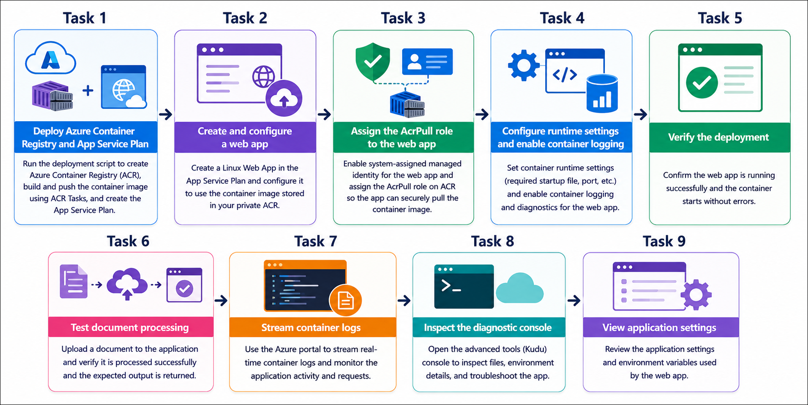

# Getting Started with your AI-200: Develop AI cloud solutions on Azure

Welcome to your AI-200: Develop AI cloud solutions on Azure workshop! We’re excited to guide you through hands-on learning with Azure cloud infrastructure using Azure Container Registry, Azure App Service, managed identity, and diagnostic logging. In this lab, you will build, deploy, and validate a secure containerized application that demonstrates how Azure services work together to host and run modern cloud-native apps.

## Lab 02: Deploy a container to Azure App Service

### Overall Estimated Timing: 60 Minutes

## Overview

In this lab, you will deploy a containerized application to Azure App Service by using a private Azure Container Registry (ACR). You will create an ACR, build and store a container image, and deploy it to a Linux Web App. You will also configure a system-assigned managed identity with the **AcrPull** role to securely access the private registry. Finally, you will configure the application, enable logging, and verify the deployment by testing the application and reviewing its logs.

## Objectives

1. **Deploy Azure Container Registry and App Service infrastructure:** Create and configure an ACR instance and an App Service plan for Linux container hosting.

2. **Configure a secure container deployment:** Create a Web App for Containers, enable a system-assigned managed identity, and assign the **AcrPull** role for secure registry access.

3. **Enable runtime settings and logging:** Configure container app settings, enable container logging, and validate the deployed application using browser and API tests.

4. **Verify deployment and troubleshoot:** Stream container logs, inspect the diagnostic console, and review application settings to confirm the app is running correctly.

## Pre-requisites

- Basic knowledge of Azure services, App Service, and containerization concepts.

- Familiarity with Azure CLI and terminal commands (PowerShell or Bash).

- Access to an Azure subscription and the provided lab credentials.

- Experience using Visual Studio Code and navigating Azure portal resources.

## Architecture

This lab architecture demonstrates a secure container deployment workflow that uses Azure Container Registry, App Service, managed identity, and App Service logging to run a containerized app in Azure.

1. **Azure Container Registry:** Stores the container image that the web app deploys from a private registry.

2. **Azure App Service Plan:** Provides the Linux compute environment for running the web app container.

3. **Web App for Containers:** Hosts the containerized application and pulls the image from the private registry.

4. **Managed Identity + AcrPull:** Enables secure registry authentication without storing credentials in app settings.

## Architecture Diagram

## Explanation of Components

1. **Azure Container Registry:** Holds the built application image and serves it securely to Azure App Service.

2. **App Service Plan:** Supplies the compute resources and scaling tier for the Linux web app.

3. **Web App for Containers:** Runs the container image, exposes the app endpoint, and supports container settings.

4. **Managed Identity with AcrPull:** Grants the web app least-privilege access to pull images from the private ACR.

## Accessing Your Lab Environment

Once you're ready to dive in, your virtual machine and **Guide** will be right at your fingertips within your web browser.

   

## Virtual Machine & Lab Guide

Your virtual machine is your workhorse throughout the workshop. The lab guide is your roadmap to success.

## Exploring Your Lab Resources

To get a better understanding of your lab resources and credentials, navigate to the **Environment** tab.

## Managing Your Virtual Machine

Feel free to **Start, Restart, or Stop (2)** your virtual machine as needed from the **Resources (1)** tab. Your experience is in your hands!

## Lab Progress

You can use the **Progress** tab to track your progress while working on the lab. A score will be provided after successful validation.

## Utilizing the Split Window Feature

For convenience, you can open the lab guide in a separate window by selecting the **Split Window** button from the top right corner.

## Lab Guide Zoom In/Zoom Out

To adjust the zoom level for the environment page, click the **A↕: 100%** icon located next to the timer in the lab environment.

## Let's Get Started with Azure Portal

1. On your virtual machine, click on the Azure Portal icon as shown below:

   

1. In the sign-in window, kindly sign in using the provided Azure credentials
   - **Email/Username:** <inject key="AzureAdUserEmail"></inject>

     

   - **Password:** <inject key="AzureAdUserPassword"></inject>

     

1. If prompted to **Stay signed in?**, you can click **No**.

   

1. If a **Welcome to Microsoft Azure** pop-up window appears, simply click **Maybe later** to skip the tour.

   

## Support Contact

The CloudLabs support team is available 24/7, 365 days a year, via email and live chat to ensure seamless assistance at any time. We offer dedicated support channels explicitly tailored for both learners and instructors, ensuring that all your needs are promptly and efficiently addressed.

Learner Support Contacts:

- Email Support: cloudlabs-support@spektrasystems.com
- Live Chat Support: https://cloudlabs.ai/labs-support

Click on **Next** from the lower right corner to move on to the next page.

## Happy Learning !!
