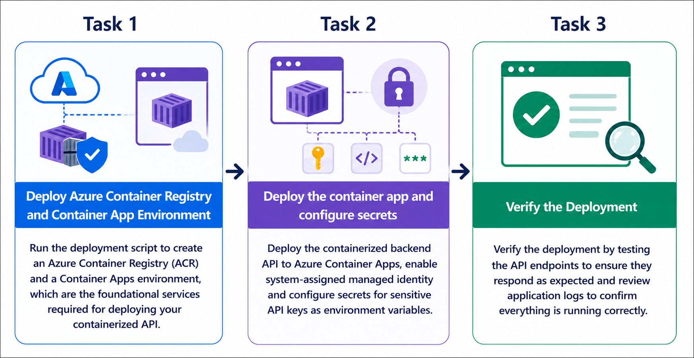
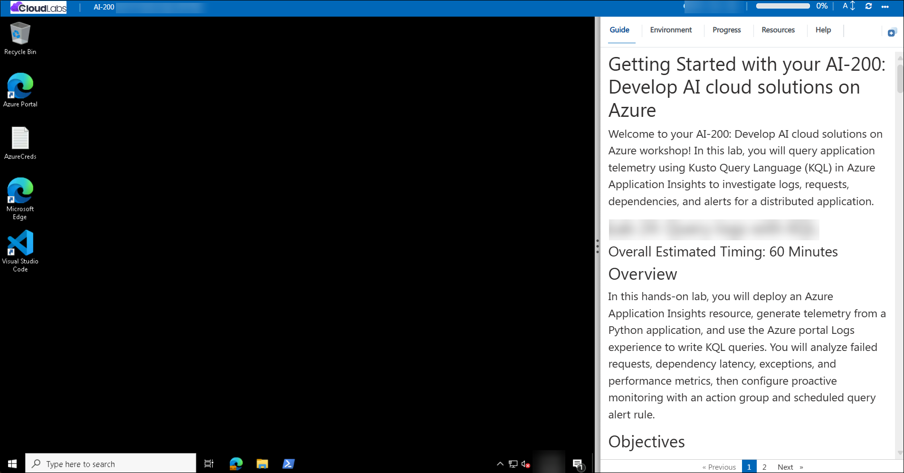
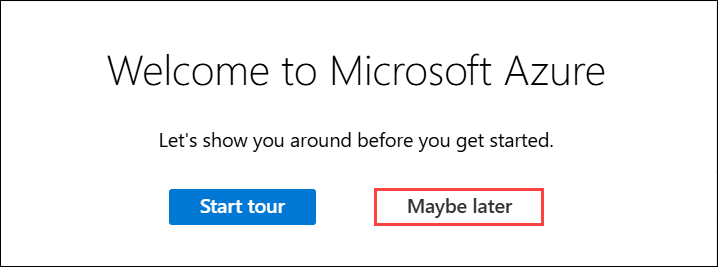

# Getting Started with your AI-200: Develop AI cloud solutions on Azure

Welcome to your AI-200: Develop AI cloud solutions on Azure workshop! In this lab, you will deploy a secure containerized backend API to Azure Container Apps using Azure Container Registry, managed identity, and runtime logging. You will learn how Azure services work together to host a container app with secure registry access, secrets configuration, and application validation.

## Lab 03: Deploy a containerized backend API to Azure Container Apps

### Overall Estimated Timing: 60 Minutes

## Overview

In this hands-on lab, you will deploy a containerized backend API to Azure Container Apps using identity-based authentication and private registry access. You will create an Azure Container Registry, build and publish the app image, provision a Container Apps environment, deploy the container app with a system-assigned managed identity, configure secrets for sensitive values, and verify the running application by testing endpoints and reviewing container logs.

## Objectives

By the end of this lab, you will be able to:

1. **Deploy Azure Container Apps infrastructure:** Create an Azure Container Registry, Container Apps environment, and supporting resources.

2. **Use managed identity for secure registry access:** Deploy the container app with a system-assigned identity and use **AcrPull** authentication for private registry access.

3. **Configure secrets for sensitive values:** Store API keys as Container Apps secrets and reference them from environment variables.

4. **Verify deployment and app health:** Test the health, root, and document processing endpoints to confirm the app is running correctly.

5. **Review application logs and revisions:** Inspect container logs and app revisions to validate the deployment and troubleshoot runtime issues.

## Pre-requisites

- Basic knowledge of Azure services, containers, and application deployment patterns.

- Familiarity with Azure CLI, PowerShell or Bash, and Visual Studio Code.

- Access to an Azure subscription and the provided lab credentials.

- Experience working with Azure Container Registry or container registries is helpful.

## Architecture

The lab architecture shows how Azure Container Apps, Azure Container Registry, and managed identity work together to deploy a secure containerized backend API.

1. **Azure Container Registry:** Stores the container image securely in a private registry for app deployment.

2. **Azure Container Apps environment:** Provides the hosting environment and networking boundary for container apps.

3. **Container App:** Runs the backend API container, exposes external ingress, and uses runtime configuration.

4. **Managed identity + AcrPull:** Enables the Container App to authenticate to the private registry without storing credentials in app settings.

## Architecture Diagram

## Explanation of Components

1. **Azure Container Registry:** Holds the container image and provides secure access to the Container App during deployment.

2. **Container Apps environment:** Hosts the container app and provides the runtime environment, logging integration, and scaling support.

3. **Container App:** Deploys the backend API container with external ingress and secure runtime configuration.

4. **Managed identity with AcrPull:** Grants the container app least-privilege access to pull images from the private registry without using stored credentials.

## Accessing Your Lab Environment

Once you're ready to dive in, your virtual machine and **Guide** will be right at your fingertips within your web browser.

## Virtual Machine & Lab Guide

Your virtual machine is your workhorse throughout the workshop. The lab guide is your roadmap to success.

## Exploring Your Lab Resources

To get a better understanding of your lab resources and credentials, navigate to the **Environment** tab.

## Managing Your Virtual Machine

Feel free to **Start, Restart, or Stop (2)** your virtual machine as needed from the **Resources (1)** tab. Your experience is in your hands!

## Lab Progress

You can use the **Progress** tab to track your progress while working on the lab. A score will be provided after successful validation.

## Utilizing the Split Window Feature

For convenience, you can open the lab guide in a separate window by selecting the **Split Window** button from the top right corner.

## Lab Guide Zoom In/Zoom Out

To adjust the zoom level for the environment page, click the **A↕: 100%** icon located next to the timer in the lab environment.

## Let's Get Started with Azure Portal

1. On your virtual machine, click on the Azure Portal icon as shown below:

   

1. In the sign-in window, kindly sign in using the provided Azure credentials
   - **Email/Username:** <inject key="AzureAdUserEmail"></inject>

     

   - **Password:** <inject key="AzureAdUserPassword"></inject>

     

1. If prompted to **Stay signed in?**, you can click **No**.

   

1. If a **Welcome to Microsoft Azure** pop-up window appears, simply click **Maybe later** to skip the tour.

   

## Support Contact

The CloudLabs support team is available 24/7, 365 days a year, via email and live chat to ensure seamless assistance at any time. We offer dedicated support channels explicitly tailored for both learners and instructors, ensuring that all your needs are promptly and efficiently addressed.

Learner Support Contacts:

- Email Support: cloudlabs-support@spektrasystems.com
- Live Chat Support: https://cloudlabs.ai/labs-support

Click on **Next** from the lower right corner to move on to the next page.

## Happy Learning !!
