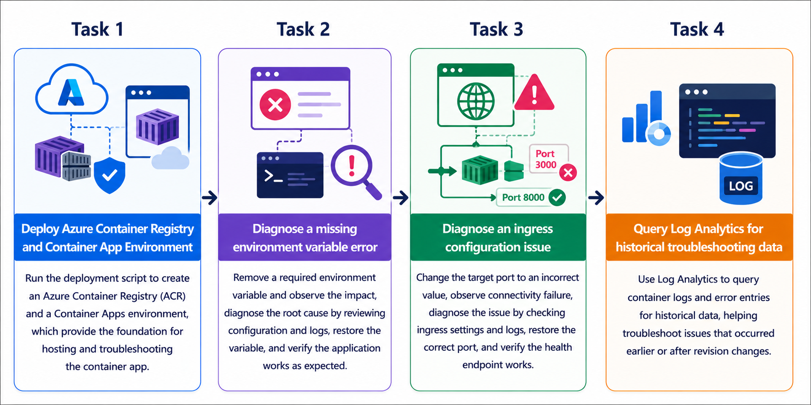
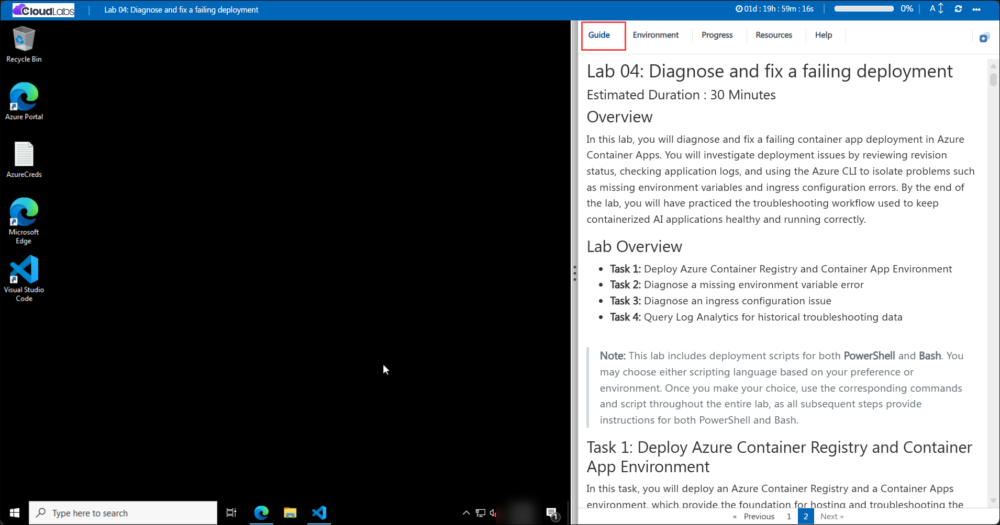

# Getting Started with your AI-200: Develop AI cloud solutions on Azure

Welcome to your AI-200: Develop AI cloud solutions on Azure workshop! In this lab, you will troubleshoot a failing Azure Container Apps deployment and restore a containerized backend API using Azure CLI diagnostics, application logs, and revision inspection.

## Lab 04: Diagnose and fix a failing deployment

### Overall Estimated Timing: 60 Minutes

## Overview

In this hands-on lab, you will investigate a failing Azure Container Apps deployment by reviewing revision status, checking container logs, and validating application configuration. You will diagnose issues caused by missing environment variables and incorrect ingress settings, apply configuration fixes, and verify that the backend API is healthy and responding correctly.

## Objectives

By the end of this lab, you will be able to:

1. **Deploy supporting container infrastructure:** Create an Azure Container Registry and Container Apps environment to host the workload.

2. **Diagnose configuration failures:** Identify missing environment variables and ingress mismatch issues using Azure CLI and API endpoint checks.

3. **Use container logs for root cause analysis:** Review Container Apps logs and revision information to isolate and troubleshoot app failures.

4. **Restore application health:** Apply fixes to the deployment configuration and confirm the app is accessible and working as expected.

5. **Inspect historical troubleshooting data:** Query Log Analytics to investigate past errors and understand issues that occurred before the current app revision.

## Pre-requisites

- Basic knowledge of Azure Container Apps, Azure Container Registry, and container-based application deployment.

- Familiarity with Azure CLI and terminal commands in PowerShell or Bash.

- Access to an Azure subscription and the provided lab credentials.

- Experience using Visual Studio Code and understanding of environment variables and app configuration.

## Architecture

This lab architecture illustrates a containerized backend API deployed to Azure Container Apps with a private Azure Container Registry and diagnostic logging. The app uses environment variables and ingress configuration to control runtime behavior, while Log Analytics stores historical logs for troubleshooting.

1. **Azure Container Registry:** Stores the container image for the backend application in a private registry.

2. **Container Apps environment:** Hosts the Container App and provides the runtime boundary for the deployment.

3. **Container App:** Runs the backend API container, exposes external ingress, and consumes environment variables to configure app behavior.

4. **Log Analytics:** Captures container logs and diagnostic data to help troubleshoot deployment and runtime issues.

## Architecture Diagram

## Explanation of Components

1. **Azure Container Registry:** Holds the built application image and serves it securely to Azure Container Apps.

2. **Container Apps environment:** Provides the hosting environment and networking boundary for the container app.

3. **Container App:** Runs the backend API, exposes the app endpoint, and applies environment variable configuration.

4. **Log Analytics workspace:** Stores logs and telemetry from the container app for historical troubleshooting and diagnostics.

## Accessing Your Lab Environment

Once you're ready to dive in, your virtual machine and **Guide** will be right at your fingertips within your web browser.

## Virtual Machine & Lab Guide

Your virtual machine is your workhorse throughout the workshop. The lab guide is your roadmap to success.

## Exploring Your Lab Resources

To get a better understanding of your lab resources and credentials, navigate to the **Environment** tab.

## Managing Your Virtual Machine

Feel free to **Start, Restart, or Stop (2)** your virtual machine as needed from the **Resources (1)** tab. Your experience is in your hands!

## Lab Progress

You can use the **Progress** tab to track your progress while working on the lab. A score will be provided after successful validation.

## Utilizing the Split Window Feature

For convenience, you can open the lab guide in a separate window by selecting the **Split Window** button from the top right corner.

## Lab Guide Zoom In/Zoom Out

To adjust the zoom level for the environment page, click the **A↕: 100%** icon located next to the timer in the lab environment.

## Let's Get Started with Azure Portal

1. On your virtual machine, click on the Azure Portal icon as shown below:

   

1. In the sign-in window, kindly sign in using the provided Azure credentials
   - **Email/Username:** <inject key="AzureAdUserEmail"></inject>

     

   - **Password:** <inject key="AzureAdUserPassword"></inject>

     

1. If prompted to **Stay signed in?**, you can click **No**.

   

1. If a **Welcome to Microsoft Azure** pop-up window appears, simply click **Maybe later** to skip the tour.

   

## Support Contact

The CloudLabs support team is available 24/7, 365 days a year, via email and live chat to ensure seamless assistance at any time. We offer dedicated support channels explicitly tailored for both learners and instructors, ensuring that all your needs are promptly and efficiently addressed.

Learner Support Contacts:

- Email Support: cloudlabs-support@spektrasystems.com
- Live Chat Support: https://cloudlabs.ai/labs-support

Click on **Next** from the lower right corner to move on to the next page.

## Happy Learning !!
