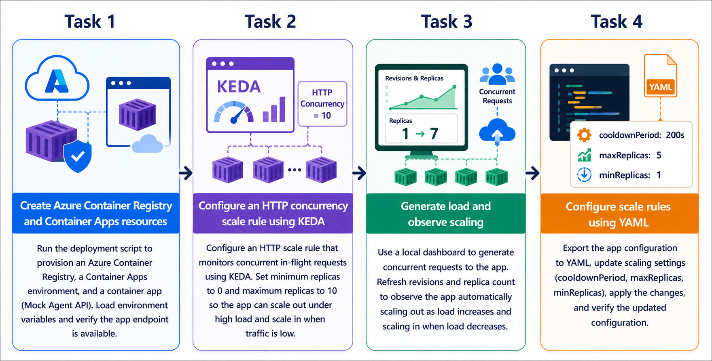
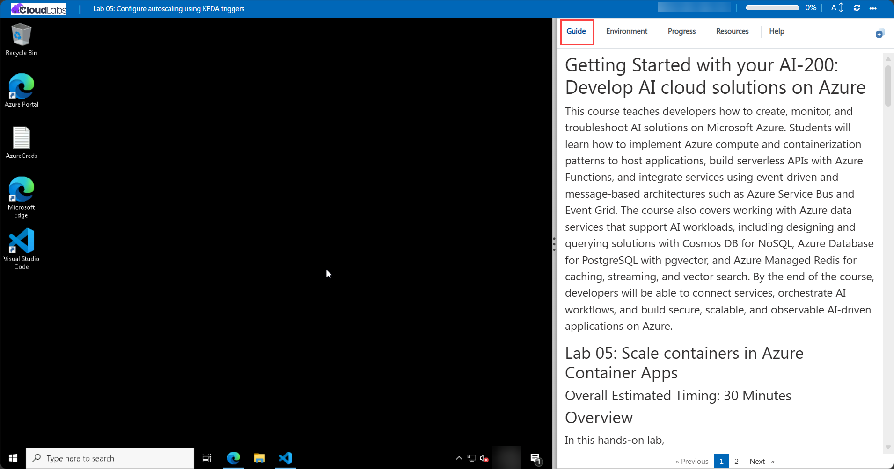

# Getting Started with your AI-200: Develop AI cloud solutions on Azure
 
Welcome to your AI-200: Develop AI cloud solutions on Azure workshop! In this lab, you will learn how to configure autoscaling for a containerized application in Azure Container Apps using KEDA HTTP concurrency triggers, resource scaling rules, and YAML-based configuration management.

## Lab 05: Configure autoscaling using KEDA triggers

### Overall Estimated Timing: 60 Minutes

## Overview

In this hands-on lab, you will create Azure Container Apps infrastructure, deploy a mock backend API, and configure autoscaling rules that allow the app to scale out when demand increases and scale in when traffic decreases. You will also generate load to observe scaling behavior in real time and update the scaling configuration using YAML for more repeatable management.

## Objectives

By the end of this lab, you will be able to:

1. **Deploy Azure Container Apps resources:** Create an Azure Container Registry and Container Apps environment to host the containerized API.

2. **Configure KEDA-based autoscaling:** Apply HTTP concurrency scale rules so the app automatically scales based on incoming request load.

3. **Validate scaling behavior:** Generate traffic to observe replica changes and verify that the app scales correctly.

4. **Use YAML to manage scale configuration:** Export and update the Container App configuration in YAML, then apply the updated policy.

## Pre-requisites

- Basic understanding of Azure Container Apps, scaling concepts, and container deployment.

- Familiarity with Azure CLI commands and terminal usage in PowerShell or Bash.

- Access to an Azure subscription and the provided lab credentials.

- Experience with Visual Studio Code and editing configuration files.

## Architecture

The lab architecture shows a containerized backend API deployed to Azure Container Apps with KEDA-based autoscaling rules and a private Azure Container Registry. The app uses HTTP concurrency rules to scale replicas up and down based on real-time request traffic.

1. **Azure Container Registry:** Stores the container image used by the Container App.

2. **Container Apps environment:** Hosts the Container App and provides networking, ingress, and scaling support.

3. **Container App:** Runs the backend API and is configured with HTTP concurrency-based scale rules.

4. **KEDA scale rules:** Automatically adjust replica count based on app request concurrency and load.

## Architecture Diagram

## Explanation of Components

1. **Azure Container Registry:** Holds the application image and provides secure storage for deployment.

2. **Container Apps environment:** Provides the runtime boundary, ingress, and logging for the containerized app.

3. **Container App:** Runs the backend API container and exposes it through external ingress.

4. **KEDA scale rules:** Monitor HTTP concurrency and scale the app replicas to match traffic demand.

## Accessing Your Lab Environment
 
Once you're ready to dive in, your virtual machine and **Guide** will be right at your fingertips within your web browser.
 

## Virtual Machine & Lab Guide
 
Your virtual machine is your workhorse throughout the workshop. The lab guide is your roadmap to success.

## Exploring Your Lab Resources
 
To get a better understanding of your lab resources and credentials, navigate to the **Environment** tab.
 

## Managing Your Virtual Machine
 
Feel free to **Start, Restart, or Stop (2)** your virtual machine as needed from the **Resources (1)** tab. Your experience is in your hands!
 

## Lab Progress

You can use the **Progress** tab to track your progress while working on the lab. A score will be provided after successful validation.

## Utilizing the Split Window Feature
 
For convenience, you can open the lab guide in a separate window by selecting the **Split Window** button from the top right corner.
 

## Lab Guide Zoom In/Zoom Out
 
To adjust the zoom level for the environment page, click the **A↕: 100%** icon located next to the timer in the lab environment.

## Let's Get Started with Azure Portal
 
1. On your virtual machine, click on the Azure Portal icon as shown below:
 
   

1. In the sign-in window, kindly sign in using the provided Azure credentials

    - **Email/Username:** <inject key="AzureAdUserEmail"></inject>

        

    - **Password:** <inject key="AzureAdUserPassword"></inject>

        

1. If prompted to **Stay signed in?**, you can click **No**.

    

1. If a **Welcome to Microsoft Azure** pop-up window appears, simply click **Maybe later** to skip the tour.

    

## Support Contact
 
The CloudLabs support team is available 24/7, 365 days a year, via email and live chat to ensure seamless assistance at any time. We offer dedicated support channels explicitly tailored for both learners and instructors, ensuring that all your needs are promptly and efficiently addressed.
 
Learner Support Contacts:
 
- Email Support: cloudlabs-support@spektrasystems.com
- Live Chat Support: https://cloudlabs.ai/labs-support

Click on **Next** from the lower right corner to move on to the next page.

   

## Happy Learning !!