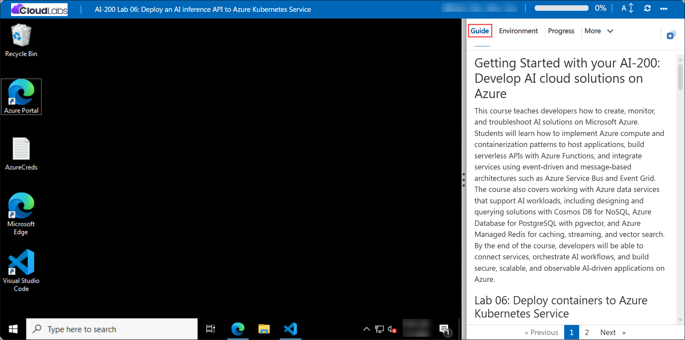

# Getting Started with your AI-200: Develop AI cloud solutions on Azure

Welcome to your AI-200: Develop AI cloud solutions on Azure workshop! In this lab, you will deploy an AI inference API to Azure Kubernetes Service (AKS) using Azure Container Registry, Microsoft Foundry, and Kubernetes manifest configuration.

## Lab 06: Deploy an AI inference API to Azure Kubernetes Service

### Overall Estimated Timing: 60 Minutes

## Overview

In this hands-on lab, you will provision Microsoft Foundry model resources, Azure Container Registry, and an AKS cluster. You will complete Kubernetes deployment and service manifests with container specifications, health probes, resource limits, and load balancing. Finally, you will deploy the API to AKS and validate it using a Python client application that exercises health, readiness, and inference endpoints.

## Objectives

1. **Deploy Azure resources for AI inference:** Provision a Microsoft Foundry model, Azure Container Registry, and Azure Kubernetes Service cluster.

2. **Configure AKS deployment manifests:** Complete and apply Kubernetes deployment and service YAML files that define containers, probes, resources, and load balancing.

3. **Validate containerized AI inference:** Use a Python client app to test health checks, readiness, and AI inference requests against the deployed AKS service.

4. **Use Azure CLI for deployment tasks:** Run the deployment script and CLI commands to build images, configure AKS access, and verify resource deployment.

## Pre-requisites

- Basic knowledge of Azure Kubernetes Service (AKS), container images, and Kubernetes manifests.

- Familiarity with Azure CLI commands and terminal usage in PowerShell or Bash.

- Access to an Azure subscription and the provided lab credentials.

- Experience with Visual Studio Code and editing YAML configuration files.

## Architecture

The lab architecture shows a containerized AI inference API deployed to AKS. The application uses Azure Container Registry to store the image, Microsoft Foundry for AI model inference, and Kubernetes resources to expose the API with health and readiness checks.

1. **Microsoft Foundry model:** Provides the AI inference model used by the deployed API.

2. **Azure Container Registry:** Stores the container image built for the API.

3. **Azure Kubernetes Service:** Hosts the containerized API using Kubernetes deployment and service resources.

4. **Kubernetes manifests:** Define container ports, probes, resource limits, and load balancer configuration for the AKS service.

## Architecture Diagram

## Explanation of Components

1. **Microsoft Foundry model:** Hosts the AI model endpoint used by the API to perform inference.

2. **Azure Container Registry:** Stores and serves the Docker image for the AKS deployment.

3. **AKS Deployment:** Runs the container replicas and defines the runtime environment for the API.

4. **AKS Service:** Exposes the application externally and provides load balancing to route traffic to healthy pods.

## Accessing Your Lab Environment

Once you're ready to dive in, your virtual machine and **Guide** will be right at your fingertips within your web browser.

## Virtual Machine & Lab Guide

Your virtual machine is your workhorse throughout the workshop. The lab guide is your roadmap to success.

## Exploring Your Lab Resources

To get a better understanding of your lab resources and credentials, navigate to the **Environment** tab.

## Managing Your Virtual Machine

Feel free to **Start, Restart, or Stop (2)** your virtual machine as needed from the **Resources (1)** tab. Your experience is in your hands!

## Lab Progress

You can use the **Progress** tab to track your progress while working on the lab. A score will be provided after successful validation.

## Utilizing the Split Window Feature

For convenience, you can open the lab guide in a separate window by selecting the **Split Window** button from the top right corner.

## Lab Guide Zoom In/Zoom Out

To adjust the zoom level for the environment page, click the **A↕: 100%** icon located next to the timer in the lab environment.

## Let's Get Started with Azure Portal

1. On your virtual machine, click on the Azure Portal icon as shown below:

   

1. In the sign-in window, kindly sign in using the provided Azure credentials
   - **Email/Username:** <inject key="AzureAdUserEmail"></inject>

     

   - **Password:** <inject key="AzureAdUserPassword"></inject>

     

1. If prompted to **Stay signed in?**, you can click **No**.

   

1. If a **Welcome to Microsoft Azure** pop-up window appears, simply click **Maybe later** to skip the tour.

   

## Support Contact

The CloudLabs support team is available 24/7, 365 days a year, via email and live chat to ensure seamless assistance at any time. We offer dedicated support channels explicitly tailored for both learners and instructors, ensuring that all your needs are promptly and efficiently addressed.

Learner Support Contacts:

- Email Support: cloudlabs-support@spektrasystems.com
- Live Chat Support: https://cloudlabs.ai/labs-support

Click on **Next** from the lower right corner to move on to the next page.

## Happy Learning !!
