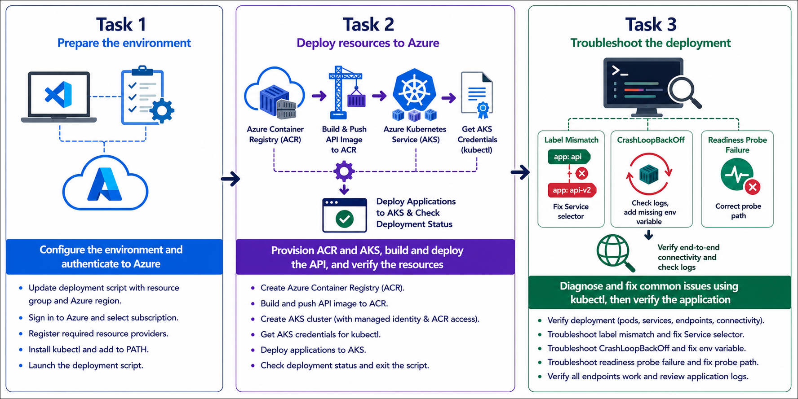
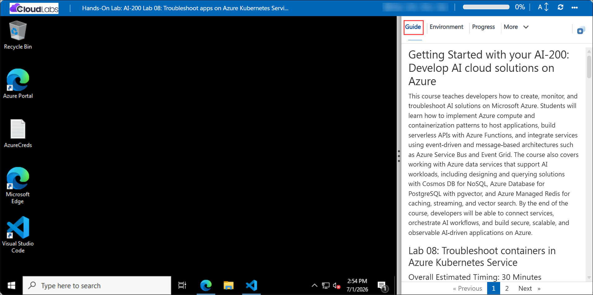

# Getting Started with your AI-200: Develop AI cloud solutions on Azure

Welcome to your AI-200: Develop AI cloud solutions on Azure workshop! In this lab, you will identify and repair common Kubernetes deployment problems in Azure Kubernetes Service by using kubectl and live manifest edits.

## Lab 08: Troubleshoot apps on Azure Kubernetes Service

### Overall Estimated Timing: 60 Minutes

## Overview

In this hands-on lab, you will deploy a containerized API to AKS, verify the running application, and troubleshoot issues such as service selector mismatches, CrashLoopBackOff restarts, and readiness probe failures. You will use kubectl to inspect pods, services, events, and logs, then edit live resources to restore application availability.

## Objectives

1. **Deploy AKS infrastructure and application resources:** Provision Azure Container Registry and AKS resources, then deploy the containerized API using the provided scripts and manifests.

2. **Inspect Kubernetes runtime behavior:** Use kubectl to examine pod status, service endpoints, events, and container logs in the target namespace.

3. **Diagnose and resolve common issues:** Identify and fix configuration problems including Service selector mismatches, CrashLoopBackOff failures, and readiness probe misconfigurations.

## Pre-requisites

- Basic familiarity with Kubernetes concepts such as pods, services, deployments, and namespaces.
- Experience using Azure CLI, kubectl, and Visual Studio Code in PowerShell or Bash.
- Access to an Azure subscription and the provided lab credentials.

## Architecture

The lab architecture shows a containerized API deployed to Azure Kubernetes Service with resources organized in a dedicated troubleshooting namespace. The exercise demonstrates how AKS, ACR, Services, and Deployments work together, and how to diagnose issues using Kubernetes tools.

1. **Azure Container Registry:** Stores the container image used by the AKS deployment.

2. **Azure Kubernetes Service:** Hosts the application pods, manages networking, and runs the troubleshooting scenarios.

3. **Kubernetes Service and Deployment:** Exposes the API and keeps pods running while the cluster is diagnosed.

4. **Troubleshooting manifests:** Introduce misconfigurations that require kubectl inspection and live edits.

## Architecture Diagram

## Explanation of Components

1. **Azure Container Registry:** Holds the API image and makes it available for the AKS deployment.

2. **Azure Kubernetes Service:** Runs the containerized API pods and manages cluster resources.

3. **Kubernetes Service and Deployment:** Exposes the API to internal or external traffic and manages pod rollout and updates.

4. **Troubleshooting manifests:** Provide sample errors and misconfigurations so you can practice debugging and fixing live Kubernetes resources.

## Accessing Your Lab Environment

Once you're ready to dive in, your virtual machine and **Guide** will be right at your fingertips within your web browser.

## Virtual Machine & Lab Guide

Your virtual machine is your workhorse throughout the workshop. The lab guide is your roadmap to success.

## Exploring Your Lab Resources

To get a better understanding of your lab resources and credentials, navigate to the **Environment** tab.

## Managing Your Virtual Machine

Feel free to **Start, Restart, or Stop (2)** your virtual machine as needed from the **Resources (1)** tab. Your experience is in your hands!

## Lab Progress

You can use the **Progress** tab to track your progress while working on the lab. A score will be provided after successful validation.

## Utilizing the Split Window Feature

For convenience, you can open the lab guide in a separate window by selecting the **Split Window** button from the top right corner.

## Lab Guide Zoom In/Zoom Out

To adjust the zoom level for the environment page, click the **A↕: 100%** icon located next to the timer in the lab environment.

## Let's Get Started with Azure Portal

1. On your virtual machine, click on the Azure Portal icon as shown below:

   

1. In the sign-in window, kindly sign in using the provided Azure credentials
   - **Email/Username:** <inject key="AzureAdUserEmail"></inject>

     

   - **Password:** <inject key="AzureAdUserPassword"></inject>

     

1. If prompted to **Stay signed in?**, you can click **No**.

   

1. If a **Welcome to Microsoft Azure** pop-up window appears, simply click **Maybe later** to skip the tour.

   

## Support Contact

The CloudLabs support team is available 24/7, 365 days a year, via email and live chat to ensure seamless assistance at any time. We offer dedicated support channels explicitly tailored for both learners and instructors, ensuring that all your needs are promptly and efficiently addressed.

Learner Support Contacts:

- Email Support: cloudlabs-support@spektrasystems.com
- Live Chat Support: https://cloudlabs.ai/labs-support

Click on **Next** from the lower right corner to move on to the next page.

## Happy Learning !!
