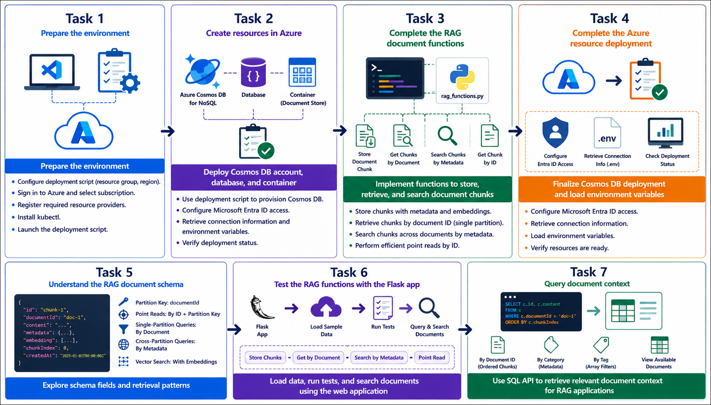
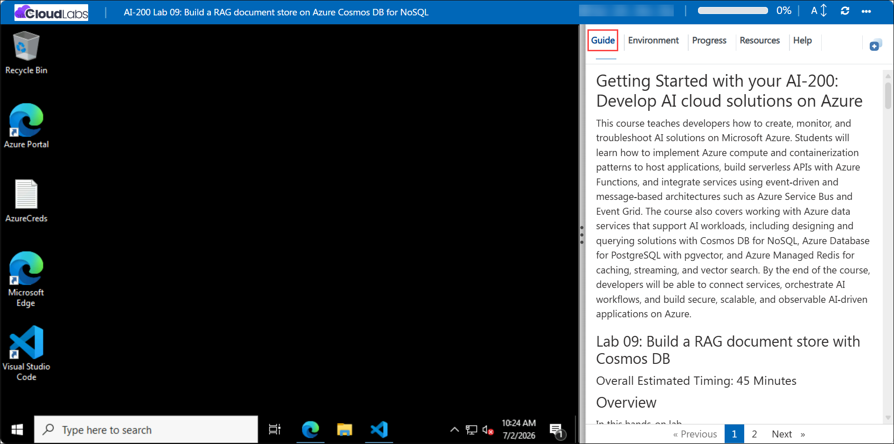

# Getting Started with your AI-200: Develop AI cloud solutions on Azure

Welcome to your AI-200: Develop AI cloud solutions on Azure workshop! In this lab, you will build a RAG document store on Azure Cosmos DB for NoSQL and implement Python functions to store, retrieve, and search chunked document content.

## Lab 09: Build a RAG document store on Azure Cosmos DB for NoSQL 

### Overall Estimated Timing: 60 Minutes

## Overview

In this hands-on lab, you will deploy Azure Cosmos DB for NoSQL, build a document store optimized for RAG scenarios, and implement Python functions to store document chunks, query documents by ID, and search by metadata. You will validate your work using a Flask application and Cosmos DB SQL queries.

## Objectives

1. **Deploy Cosmos DB resources:** Provision Azure Cosmos DB for NoSQL with a database and container designed for chunked document storage.

2. **Implement RAG document functions:** Build Python functions that store document chunks, retrieve chunks, search by metadata, and perform efficient point reads.

3. **Validate the document store:** Use a Flask app and Cosmos DB queries to confirm document ingestion, retrieval, and metadata searches.

## Pre-requisites

- Basic understanding of Azure Cosmos DB, NoSQL data modeling, and document storage concepts.
- Experience using Python, Flask, and Azure CLI in PowerShell or Bash.
- Access to an Azure subscription and provided lab credentials.
- Familiarity with Visual Studio Code and editing Python files.

## Architecture

The lab architecture shows a RAG document store built on Azure Cosmos DB for NoSQL. Documents are split into chunks and stored with metadata, embeddings placeholders, and chunk indices. The Flask app exercises storage, retrieval, and metadata search operations against Cosmos DB.

1. **Azure Cosmos DB for NoSQL:** Hosts the database and container for chunked document storage.

2. **Document schema:** Stores chunk content, metadata, embeddings placeholder, chunk index, and partition keys for efficient retrieval.

3. **Python functions:** Handle storing, querying, and searching chunked documents in Cosmos DB.

4. **Flask app:** Provides a user interface to load sample data, run RAG workflow tests, and execute document queries.

## Architecture Diagram

## Explanation of Components

1. **Azure Cosmos DB for NoSQL:** Provides a globally distributed, low-latency document database for RAG storage.

2. **Database and container:** Organize chunked documents using documentId as the partition key for efficient retrieval.

3. **Python RAG functions:** Implement operations for storing chunks, retrieving chunks, searching metadata, and point reads.

4. **Flask app:** Validates the workflow by loading sample data, executing tests, and displaying query results.

## Accessing Your Lab Environment

Once you're ready to dive in, your virtual machine and **Guide** will be right at your fingertips within your web browser.

## Virtual Machine & Lab Guide

Your virtual machine is your workhorse throughout the workshop. The lab guide is your roadmap to success.

## Exploring Your Lab Resources

To get a better understanding of your lab resources and credentials, navigate to the **Environment** tab.

## Managing Your Virtual Machine

Feel free to **Start, Restart, or Stop (2)** your virtual machine as needed from the **Resources (1)** tab. Your experience is in your hands!

## Lab Progress

You can use the **Progress** tab to track your progress while working on the lab. A score will be provided after successful validation.

## Utilizing the Split Window Feature

For convenience, you can open the lab guide in a separate window by selecting the **Split Window** button from the top right corner.

## Lab Guide Zoom In/Zoom Out

To adjust the zoom level for the environment page, click the **A↕: 100%** icon located next to the timer in the lab environment.

## Let's Get Started with Azure Portal

1. On your virtual machine, click on the Azure Portal icon as shown below:

   

1. In the sign-in window, kindly sign in using the provided Azure credentials
   - **Email/Username:** <inject key="AzureAdUserEmail"></inject>

     

   - **Password:** <inject key="AzureAdUserPassword"></inject>

     

1. If prompted to **Stay signed in?**, you can click **No**.

   

1. If a **Welcome to Microsoft Azure** pop-up window appears, simply click **Maybe later** to skip the tour.

   

## Support Contact

The CloudLabs support team is available 24/7, 365 days a year, via email and live chat to ensure seamless assistance at any time. We offer dedicated support channels explicitly tailored for both learners and instructors, ensuring that all your needs are promptly and efficiently addressed.

Learner Support Contacts:

- Email Support: cloudlabs-support@spektrasystems.com
- Live Chat Support: https://cloudlabs.ai/labs-support

Click on **Next** from the lower right corner to move on to the next page.

## Happy Learning !!
