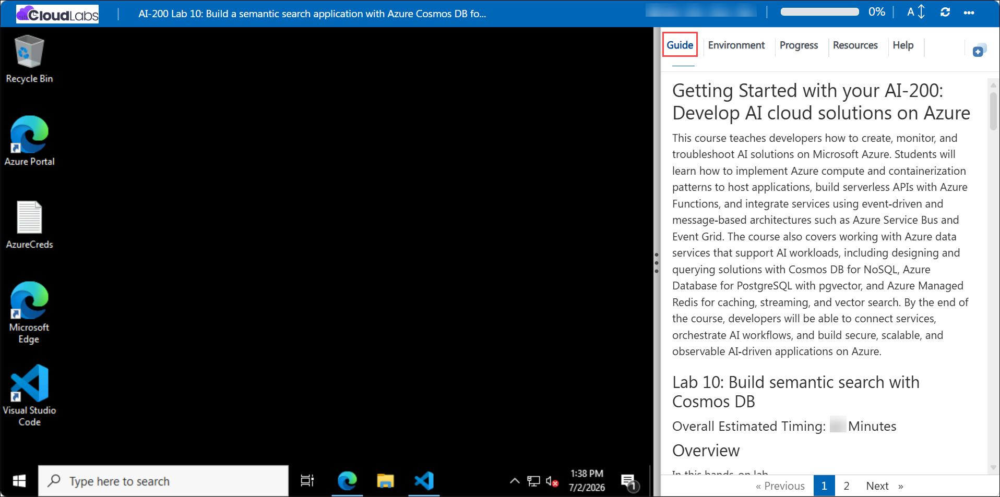
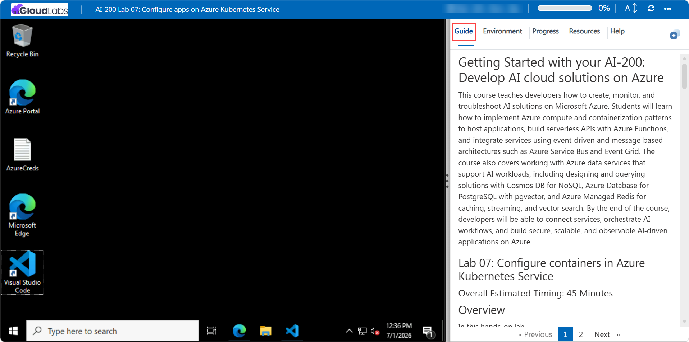

# Getting Started with your AI-200: Develop AI cloud solutions on Azure

Welcome to your AI-200: Develop AI cloud solutions on Azure workshop! In this lab, you will build a semantic search application with Azure Cosmos DB for NoSQL and use vector search to retrieve related support cases based on meaning.

## Lab 10: Build a semantic search application with Azure Cosmos DB for NoSQL

### Overall Estimated Timing: 60 Minutes

## Overview

In this hands-on lab, you will deploy Azure Cosmos DB for NoSQL with vector search capability, create vector-enabled container indexing and embedding policies, and implement Python functions for semantic search. You will validate the solution using a Flask app that stores vector documents, performs similarity searches, and applies metadata filters.

## Objectives

By the end of this lab, you will be able to:

1. **Deploy Cosmos DB with vector search:** Provision a Cosmos DB for NoSQL account with the EnableNoSQLVectorSearch capability and create a vector-enabled container.

2. **Implement semantic search functions:** Build Python functions that store document embeddings, execute vector similarity searches, and combine vector search with metadata filters.

3. **Validate the semantic search app:** Use a Flask application and Cosmos DB queries to confirm that semantic search returns relevant results based on vector similarity.

## Pre-requisites

- Basic understanding of Azure Cosmos DB, vector search, and document databases.
- Experience using Python, Flask, and Azure CLI in PowerShell or Bash.
- Access to an Azure subscription and the provided lab credentials.
- Familiarity with Visual Studio Code and editing Python files.

## Architecture

The lab architecture shows a semantic search application built on Azure Cosmos DB for NoSQL with vector search enabled. The solution stores support tickets as vector-embedded documents and uses Cosmos DB’s VectorDistance function to retrieve semantically similar documents.

1. **Azure Cosmos DB for NoSQL:** Hosts the vector-enabled container for semantic document search.

2. **Vector-enabled container:** Stores support tickets with embeddings and metadata for vector search.

3. **Python semantic search functions:** Implement storage, similarity search, and filtered vector search operations.

4. **Flask app:** Provides a UI to load sample data, execute semantic searches, and display results.

## Architecture Diagram

## Explanation of Components

1. **Azure Cosmos DB for NoSQL:** Provides a scalable low-latency store for vector and metadata documents.

2. **Vector-enabled container:** Uses a vector embedding policy and diskANN index to support semantic search.

3. **VectorDistance queries:** Compare query embeddings with stored document embeddings to rank results by similarity.

4. **Flask application:** Loads sample data, triggers semantic searches, and displays related documents in the browser.

## Accessing Your Lab Environment

Once you're ready to dive in, your virtual machine and **Guide** will be right at your fingertips within your web browser.

## Virtual Machine & Lab Guide

Your virtual machine is your workhorse throughout the workshop. The lab guide is your roadmap to success.

## Exploring Your Lab Resources

To get a better understanding of your lab resources and credentials, navigate to the **Environment** tab.

## Managing Your Virtual Machine

Feel free to **Start, Restart, or Stop (2)** your virtual machine as needed from the **Resources (1)** tab. Your experience is in your hands!

## Lab Progress

You can use the **Progress** tab to track your progress while working on the lab. A score will be provided after successful validation.

## Utilizing the Split Window Feature

For convenience, you can open the lab guide in a separate window by selecting the **Split Window** button from the top right corner.

## Lab Guide Zoom In/Zoom Out

To adjust the zoom level for the environment page, click the **A↕: 100%** icon located next to the timer in the lab environment.

## Let's Get Started with Azure Portal

1. On your virtual machine, click on the Azure Portal icon as shown below:

   

1. In the sign-in window, kindly sign in using the provided Azure credentials
   - **Email/Username:** <inject key="AzureAdUserEmail"></inject>

     

   - **Password:** <inject key="AzureAdUserPassword"></inject>

     

1. If prompted to **Stay signed in?**, you can click **No**.

   

1. If a **Welcome to Microsoft Azure** pop-up window appears, simply click **Maybe later** to skip the tour.

   

## Support Contact

The CloudLabs support team is available 24/7, 365 days a year, via email and live chat to ensure seamless assistance at any time. We offer dedicated support channels explicitly tailored for both learners and instructors, ensuring that all your needs are promptly and efficiently addressed.

Learner Support Contacts:

- Email Support: cloudlabs-support@spektrasystems.com
- Live Chat Support: https://cloudlabs.ai/labs-support

Click on **Next** from the lower right corner to move on to the next page.

## Happy Learning !!
