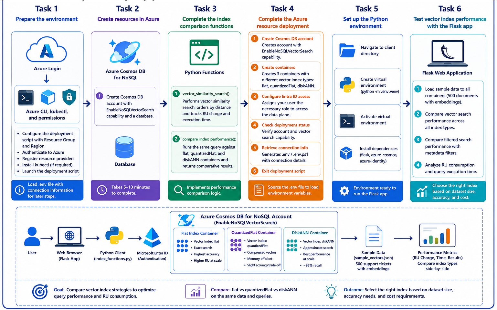
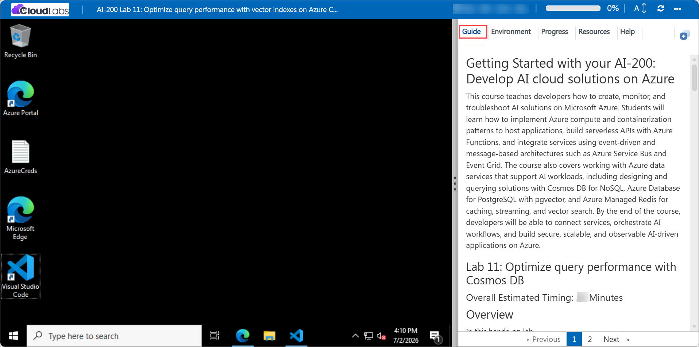

# Getting Started with your AI-200: Develop AI cloud solutions on Azure

Welcome to your AI-200: Develop AI cloud solutions on Azure workshop! In this lab, you will compare vector indexing strategies to optimize semantic search performance in Azure Cosmos DB for NoSQL.

## Lab 11: Optimize query performance with vector indexes on Azure Cosmos DB for NoSQL

### Overall Estimated Timing: 60 Minutes

## Overview

In this hands-on lab, you will deploy a vector-enabled Cosmos DB container, create and compare containers with flat, quantizedFlat, and diskANN indexes, and run semantic search queries to measure Request Unit (RU) consumption and execution latency. This exercise helps you understand the trade-offs between exact and approximate vector indexing strategies.

## Objectives

By the end of this lab, you will be able to:

1. **Deploy Cosmos DB vector containers:** Provision an Azure Cosmos DB for NoSQL account with the EnableNoSQLVectorSearch capability and create containers with different vector index types.

2. **Implement comparative search functions:** Build Python functions that execute the same vector query against flat, quantizedFlat, and diskANN containers while tracking RU usage and execution time.

3. **Analyze index performance:** Compare search results, RU charges, and query latency to choose the right index strategy for semantic search scenarios.

## Pre-requisites

- Basic understanding of Azure Cosmos DB, vector search, and index configuration.
- Experience using Python, Flask, and Azure CLI in PowerShell or Bash.
- Access to an Azure subscription and the provided lab credentials.
- Familiarity with Visual Studio Code and editing Python files.

## Architecture

The lab architecture shows a semantic search solution using Azure Cosmos DB for NoSQL with three vector-enabled containers. Each container uses a different index type to store the same set of vector embeddings, allowing you to compare how index strategy affects search performance and cost.

1. **Azure Cosmos DB for NoSQL:** Hosts the vector-enabled containers and executes semantic search queries.

2. **Vector-enabled containers:** Store identical document embeddings using different index types for performance comparison.

3. **Vector index policies:** Control whether the container uses flat, quantizedFlat, or diskANN indexing for vector search.

4. **Flask application:** Loads sample data, executes comparative searches, and displays RU and timing results.

## Architecture Diagram

## Explanation of Components

1. **Azure Cosmos DB for NoSQL:** Provides the backend document database and vector search capability for semantic queries.

2. **Vector-enabled containers:** Store support ticket documents with embedding vectors and metadata, using different index types for comparison.

3. **Index type comparison:** Flat delivers exact search results, quantizedFlat optimizes memory and cost, and diskANN provides approximate search with the best RU efficiency.

4. **Performance comparison app:** The Flask app loads data, runs the same query on each container, and shows RU consumption and query execution time.

## Accessing Your Lab Environment

Once you're ready to dive in, your virtual machine and **Guide** will be right at your fingertips within your web browser.

## Virtual Machine & Lab Guide

Your virtual machine is your workhorse throughout the workshop. The lab guide is your roadmap to success.

## Exploring Your Lab Resources

To get a better understanding of your lab resources and credentials, navigate to the **Environment** tab.

## Managing Your Virtual Machine

Feel free to **Start, Restart, or Stop (2)** your virtual machine as needed from the **Resources (1)** tab. Your experience is in your hands!

## Lab Progress

You can use the **Progress** tab to track your progress while working on the lab. A score will be provided after successful validation.

## Utilizing the Split Window Feature

For convenience, you can open the lab guide in a separate window by selecting the **Split Window** button from the top right corner.

## Lab Guide Zoom In/Zoom Out

To adjust the zoom level for the environment page, click the **A↕: 100%** icon located next to the timer in the lab environment.

## Let's Get Started with Azure Portal

1. On your virtual machine, click on the Azure Portal icon as shown below:

   

1. In the sign-in window, kindly sign in using the provided Azure credentials
   - **Email/Username:** <inject key="AzureAdUserEmail"></inject>

     

   - **Password:** <inject key="AzureAdUserPassword"></inject>

     

1. If prompted to **Stay signed in?**, you can click **No**.

   

1. If a **Welcome to Microsoft Azure** pop-up window appears, simply click **Maybe later** to skip the tour.

   

## Support Contact

The CloudLabs support team is available 24/7, 365 days a year, via email and live chat to ensure seamless assistance at any time. We offer dedicated support channels explicitly tailored for both learners and instructors, ensuring that all your needs are promptly and efficiently addressed.

Learner Support Contacts:

- Email Support: cloudlabs-support@spektrasystems.com
- Live Chat Support: https://cloudlabs.ai/labs-support

Click on **Next** from the lower right corner to move on to the next page.

## Happy Learning !!
