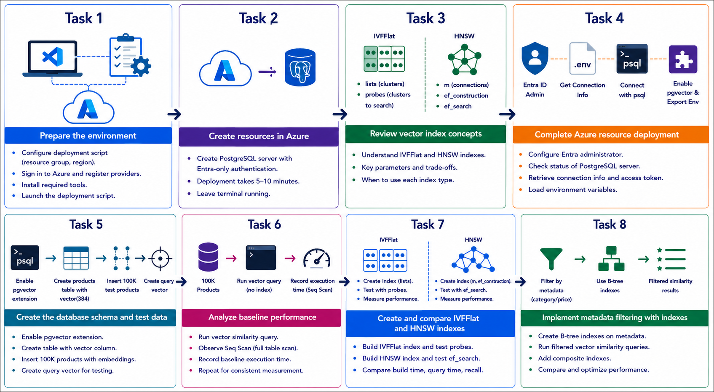

# Getting Started with your AI-200: Develop AI cloud solutions on Azure
 
Welcome to your AI-200: Develop AI cloud solutions on Azure workshop! In this lab, you will optimize vector search performance in Azure Database for PostgreSQL by building large-scale vector datasets, testing baseline query performance, and comparing IVFFlat and HNSW index strategies.

## Lab 14: Optimize vector search with Azure Database for PostgreSQL

### Overall Estimated Timing: 60 Minutes

## Overview

In this hands-on lab, you will deploy an Azure Database for PostgreSQL instance, create vector-enabled tables for test data, and measure similarity search performance. You will test baseline queries without indexes, then create and compare IVFFlat and HNSW indexes, and tune search parameters to find the best balance of speed and accuracy.

## Objectives

1. **Deploy PostgreSQL for vector search:** Provision Azure Database for PostgreSQL and configure Microsoft Entra authentication.

2. **Create vector search schema and test data:** Build tables with vector embeddings and generate a large dataset for performance testing.

3. **Compare vector index strategies:** Create IVFFlat and HNSW indexes, measure query performance, and tune index parameters.

4. **Optimize filtered similarity queries:** Add metadata indexes and evaluate combined vector plus filter queries for production scenarios.

## Pre-requisites

- Basic familiarity with PostgreSQL and relational database concepts.
- Experience using Python, Azure CLI, and Visual Studio Code.
- Access to an Azure subscription and the provided lab credentials.
- Familiarity with running commands in PowerShell or Bash.

## Architecture

The lab architecture shows a vector search workload running on Azure Database for PostgreSQL with pgvector. The backend stores high-dimensional embeddings and uses specialized indexes to optimize semantic search over large datasets.

1. **Azure Database for PostgreSQL:** Hosts the managed relational database and vector extension.

2. **pgvector-enabled tables:** Store product or test embeddings in a vector column for similarity search.

3. **IVFFlat and HNSW indexes:** Provide alternate vector indexing strategies with different performance and recall trade-offs.

4. **Performance testing queries:** Compare baseline scans with indexed searches and tune parameters for production workloads.

## Architecture Diagram

## Explanation of Components

1. **Azure Database for PostgreSQL:** Provides a managed relational database platform for storing high-dimensional vector embeddings and running similarity search queries.

2. **pgvector extension:** Adds native vector data types and similarity operators to PostgreSQL, enabling semantic search over embedding data.

3. **IVFFlat and HNSW indexes:** Offer alternative index strategies for vector search, allowing you to compare trade-offs between build time, query latency, and recall.

4. **Performance testing queries:** Measure baseline search performance, compare index results, and tune parameters such as probes and ef_search for real-world workloads.

## Accessing Your Lab Environment
 
Once you're ready to dive in, your virtual machine and **Guide** will be right at your fingertips within your web browser.
 

## Virtual Machine & Lab Guide
 
Your virtual machine is your workhorse throughout the workshop. The lab guide is your roadmap to success.

## Exploring Your Lab Resources
 
To get a better understanding of your lab resources and credentials, navigate to the **Environment** tab.
 

## Managing Your Virtual Machine
 
Feel free to **Start, Restart, or Stop (2)** your virtual machine as needed from the **Resources (1)** tab. Your experience is in your hands!
 

## Lab Progress

You can use the **Progress** tab to track your progress while working on the lab. A score will be provided after successful validation.

## Utilizing the Split Window Feature
 
For convenience, you can open the lab guide in a separate window by selecting the **Split Window** button from the top right corner.
 

## Lab Guide Zoom In/Zoom Out
 
To adjust the zoom level for the environment page, click the **A↕: 100%** icon located next to the timer in the lab environment.

## Let's Get Started with Azure Portal
 
1. On your virtual machine, click on the Azure Portal icon as shown below:
 
   

1. In the sign-in window, kindly sign in using the provided Azure credentials

    - **Email/Username:** <inject key="AzureAdUserEmail"></inject>

        

    - **Password:** <inject key="AzureAdUserPassword"></inject>

        

1. If prompted to **Stay signed in?**, you can click **No**.

    

1. If a **Welcome to Microsoft Azure** pop-up window appears, simply click **Maybe later** to skip the tour.

    

## Support Contact
 
The CloudLabs support team is available 24/7, 365 days a year, via email and live chat to ensure seamless assistance at any time. We offer dedicated support channels explicitly tailored for both learners and instructors, ensuring that all your needs are promptly and efficiently addressed.
 
Learner Support Contacts:
 
- Email Support: cloudlabs-support@spektrasystems.com
- Live Chat Support: https://cloudlabs.ai/labs-support

Click on **Next** from the lower right corner to move on to the next page.

   

## Happy Learning !!