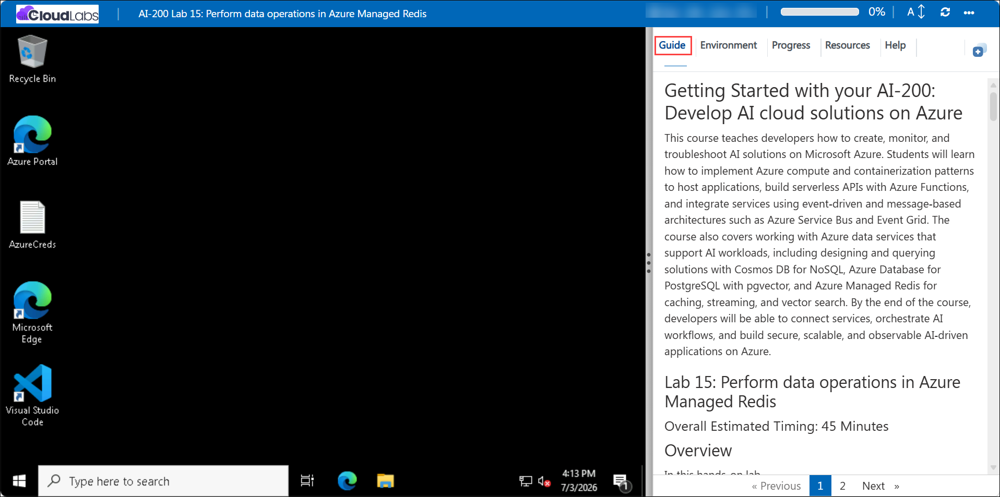

# Getting Started with your AI-200: Develop AI cloud solutions on Azure

Welcome to your AI-200: Develop AI cloud solutions on Azure workshop! In this lab, you will perform Redis data operations using Azure Managed Redis and a Python console application. You will connect to the managed cache, store and retrieve hash data, manage key expiration, and delete cached values.

## Lab 15: Perform data operations in Azure Managed Redis

### Overall Estimated Timing: 60 Minutes

## Overview

In this hands-on lab, you will create an Azure Managed Redis instance, configure the development environment, and update a Python console application to perform Redis data operations. You will validate the solution by storing hash data, retrieving it, setting expiration values, and deleting keys from the cache.

## Objectives

By the end of this lab, you will be able to:

1. **Deploy Azure Managed Redis:** Provision an Azure Managed Redis cache and configure access for your Python application.

2. **Connect securely with redis-py:** Use environment variables and SSL to connect to Azure Managed Redis from Python.

3. **Perform Redis data operations:** Store and retrieve hash data, set TTL values, and delete keys from the cache.

4. **Validate cache behavior:** Verify that stored data is accessible, expires correctly, and can be removed when needed.

## Pre-requisites

- Basic familiarity with Redis concepts and key-value data stores.
- Experience using Python, Visual Studio Code, and Azure CLI.
- Access to an Azure subscription and the provided lab credentials.
- Familiarity with running terminal commands in PowerShell or Bash.

## Architecture

The lab architecture shows a Python application connecting to Azure Managed Redis using secure redis-py connections. Redis stores hash data and TTL settings, and the application performs CRUD operations against the cache.

1. **Azure Managed Redis:** Hosts the managed Redis cache used for fast key-value data operations.

2. **Python console application:** Uses redis-py to connect to Azure Managed Redis securely and execute data operations.

3. **Hash data operations:** Store and retrieve structured hash values in Redis.

4. **TTL and delete operations:** Manage key expiration and remove cached data when it is no longer needed.

## Architecture Diagram

## Explanation of Components

1. **Azure Managed Redis:** A fully managed Redis cache service that provides high-performance key-value storage and supports secure access from applications.

2. **redis-py library:** The Python client library used to connect to Redis, execute commands, and manage cache data.

3. **Hash data storage:** Redis hash structures store multiple related fields under a single key, making it easy to save and retrieve structured data.

4. **TTL and key deletion:** Time-To-Live settings control how long keys remain in the cache, while deletion operations remove keys immediately when no longer needed.

## Accessing Your Lab Environment

Once you're ready to dive in, your virtual machine and **Guide** will be right at your fingertips within your web browser.

## Virtual Machine & Lab Guide

Your virtual machine is your workhorse throughout the workshop. The lab guide is your roadmap to success.

## Exploring Your Lab Resources

To get a better understanding of your lab resources and credentials, navigate to the **Environment** tab.

## Managing Your Virtual Machine

Feel free to **Start, Restart, or Stop (2)** your virtual machine as needed from the **Resources (1)** tab. Your experience is in your hands!

## Lab Progress

You can use the **Progress** tab to track your progress while working on the lab. A score will be provided after successful validation.

## Utilizing the Split Window Feature

For convenience, you can open the lab guide in a separate window by selecting the **Split Window** button from the top right corner.

## Lab Guide Zoom In/Zoom Out

To adjust the zoom level for the environment page, click the **A↕: 100%** icon located next to the timer in the lab environment.

## Let's Get Started with Azure Portal

1. On your virtual machine, click on the Azure Portal icon as shown below:

   

1. In the sign-in window, kindly sign in using the provided Azure credentials
   - **Email/Username:** <inject key="AzureAdUserEmail"></inject>

     

   - **Password:** <inject key="AzureAdUserPassword"></inject>

     

1. If prompted to **Stay signed in?**, you can click **No**.

   

1. If a **Welcome to Microsoft Azure** pop-up window appears, simply click **Maybe later** to skip the tour.

   

## Support Contact

The CloudLabs support team is available 24/7, 365 days a year, via email and live chat to ensure seamless assistance at any time. We offer dedicated support channels explicitly tailored for both learners and instructors, ensuring that all your needs are promptly and efficiently addressed.

Learner Support Contacts:

- Email Support: cloudlabs-support@spektrasystems.com
- Live Chat Support: https://cloudlabs.ai/labs-support

Click on **Next** from the lower right corner to move on to the next page.

## Happy Learning !!
