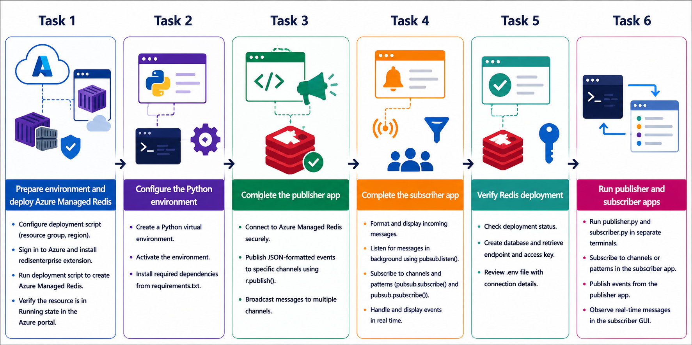
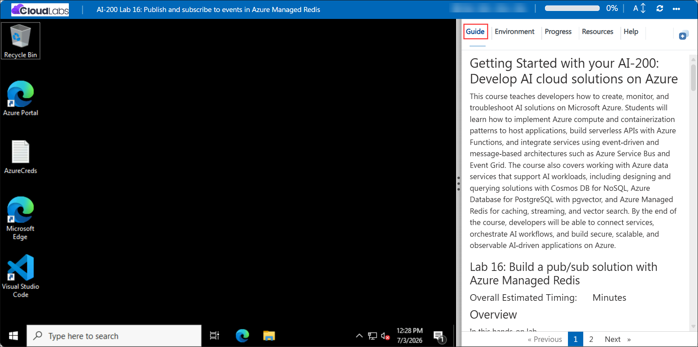

# Getting Started with your AI-200: Develop AI cloud solutions on Azure

Welcome to your AI-200: Develop AI cloud solutions on Azure workshop! In this lab, you will build a pub/sub messaging solution with Azure Managed Redis and Python, using Redis channels and wildcard subscriptions to flow events between a publisher and a subscriber.

## Lab 16: Publish and subscribe to events in Azure Managed Redis 

### Overall Estimated Timing: 60 Minutes

## Overview

In this hands-on lab, you will provision Azure Managed Redis, connect Python applications using redis-py, and implement both publisher and subscriber logic. You will send messages on Redis channels, subscribe to channels and patterns, and validate the end-to-end Pub/Sub workflow with real-time message delivery.

## Objectives

1. **Deploy Azure Managed Redis:** Provision a managed Redis cache and configure secure access for Python clients.

2. **Implement publisher functionality:** Build a Python publisher app that sends JSON event messages to Redis channels.

3. **Implement subscriber functionality:** Build a Python subscriber app that listens on channels and patterns and displays incoming messages.

4. **Validate Pub/Sub communication:** Run both apps together and verify real-time message delivery using Azure Managed Redis.

## Pre-requisites

- Basic familiarity with Redis Pub/Sub concepts and event-driven messaging.
- Experience using Python, Visual Studio Code, and Azure CLI.
- Access to an Azure subscription and the provided lab credentials.
- Familiarity with running terminal commands in PowerShell or Bash.

## Architecture

The lab architecture shows a Redis Pub/Sub solution using Azure Managed Redis. A publisher app sends events to one or more Redis channels, and a subscriber app listens for those events using direct and wildcard pattern subscriptions.

1. **Azure Managed Redis:** Hosts the managed Redis cache used for pub/sub messaging.

2. **Publisher application:** Sends event messages to Redis channels using redis-py.

3. **Subscriber application:** Listens for published messages and displays them in real time.

4. **Redis Pub/Sub messaging:** Demonstrates real-time event delivery across channels and pattern subscriptions.

## Architecture Diagram

## Explanation of Components

1. **Azure Managed Redis:** A managed Redis service that provides pub/sub messaging capabilities and secure client connectivity.

2. **redis-py library:** The Python client used to connect to Redis and execute publish/subscribe commands.

3. **Publisher app:** Sends JSON-formatted event messages to Redis channels.

4. **Subscriber app:** Receives messages from subscribed channels and wildcard patterns, displaying them in real time.

## Accessing Your Lab Environment

Once you're ready to dive in, your virtual machine and **Guide** will be right at your fingertips within your web browser.

## Virtual Machine & Lab Guide

Your virtual machine is your workhorse throughout the workshop. The lab guide is your roadmap to success.

## Exploring Your Lab Resources

To get a better understanding of your lab resources and credentials, navigate to the **Environment** tab.

## Managing Your Virtual Machine

Feel free to **Start, Restart, or Stop (2)** your virtual machine as needed from the **Resources (1)** tab. Your experience is in your hands!

## Lab Progress

You can use the **Progress** tab to track your progress while working on the lab. A score will be provided after successful validation.

## Utilizing the Split Window Feature

For convenience, you can open the lab guide in a separate window by selecting the **Split Window** button from the top right corner.

## Lab Guide Zoom In/Zoom Out

To adjust the zoom level for the environment page, click the **A↕: 100%** icon located next to the timer in the lab environment.

## Let's Get Started with Azure Portal

1. On your virtual machine, click on the Azure Portal icon as shown below:

   

1. In the sign-in window, kindly sign in using the provided Azure credentials
   - **Email/Username:** <inject key="AzureAdUserEmail"></inject>

     

   - **Password:** <inject key="AzureAdUserPassword"></inject>

     

1. If prompted to **Stay signed in?**, you can click **No**.

   

1. If a **Welcome to Microsoft Azure** pop-up window appears, simply click **Maybe later** to skip the tour.

   

## Support Contact

The CloudLabs support team is available 24/7, 365 days a year, via email and live chat to ensure seamless assistance at any time. We offer dedicated support channels explicitly tailored for both learners and instructors, ensuring that all your needs are promptly and efficiently addressed.

Learner Support Contacts:

- Email Support: cloudlabs-support@spektrasystems.com
- Live Chat Support: https://cloudlabs.ai/labs-support

Click on **Next** from the lower right corner to move on to the next page.

## Happy Learning !!
