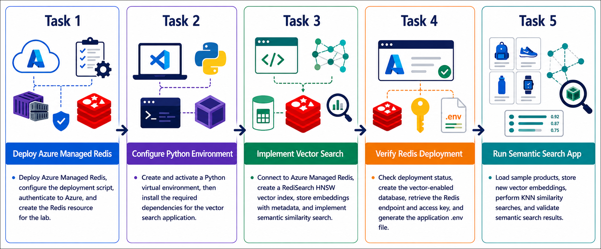
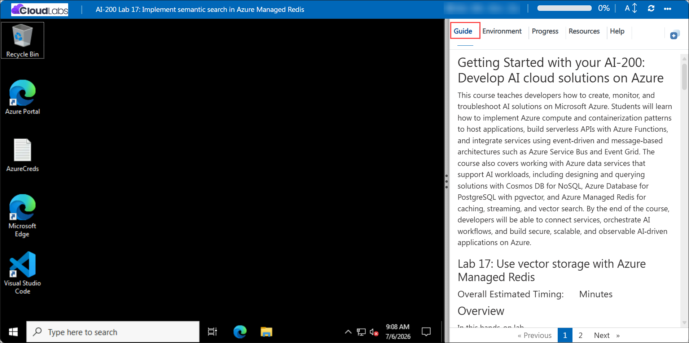

# Getting Started with your AI-200: Develop AI cloud solutions on Azure

Welcome to your AI-200: Develop AI cloud solutions on Azure workshop! In this lab, you will implement semantic search using Azure Managed Redis and vector embeddings, learning how to store and query product data with semantic similarity.

## Lab 17: Implement semantic search in Azure Managed Redis

### Overall Estimated Timing: 60 Minutes

## Overview

In this hands-on lab, you will provision Azure Managed Redis, connect a Python application using redis-py, and implement vector storage and semantic search functionality. You will load sample product data with embeddings, create a RediSearch vector index, and perform similarity searches to find related products based on cosine similarity.

## Objectives

1. **Deploy Azure Managed Redis for vector search:** Provision a managed Redis cache and configure secure access for a Python application.

2. **Store vector embeddings with metadata:** Load product data into Redis and store binary vector embeddings alongside metadata fields.

3. **Create a RediSearch vector index:** Define a vector index for semantic search using HNSW and cosine similarity.

4. **Perform semantic similarity searches:** Query Redis for products that are semantically similar based on vector embeddings.

## Pre-requisites

- Basic familiarity with Redis, vector embeddings, and semantic search concepts.
- Experience using Python, Visual Studio Code, and Azure CLI.
- Access to an Azure subscription and the provided lab credentials.
- Familiarity with running terminal commands in PowerShell or Bash.

## Architecture

The lab architecture shows a Redis vector search solution built on Azure Managed Redis and RediSearch. The Python application stores product embeddings and metadata, then runs similarity searches using a vector index.

1. **Azure Managed Redis:** Hosts the managed Redis cache with RediSearch module support.

2. **Redis vector index:** Uses HNSW and cosine similarity to enable fast semantic searches over embeddings.

3. **Python vector application:** Stores and queries products with embedding vectors and metadata.

4. **Semantic search workflow:** Finds related products based on vector similarity instead of keyword matching.

## Architecture Diagram

## Explanation of Components

1. **Azure Managed Redis:** A managed cache service that supports the RediSearch module and vector search capabilities.

2. **RediSearch vector index:** Adds vector search functionality to Redis, allowing KNN queries over embedding data.

3. **Product metadata and embeddings:** Stores structured product fields with binary vector representations for semantic search.

4. **Python application:** Connects to Redis, loads data, creates the vector index, and executes similarity searches.

## Accessing Your Lab Environment

Once you're ready to dive in, your virtual machine and **Guide** will be right at your fingertips within your web browser.

## Virtual Machine & Lab Guide

Your virtual machine is your workhorse throughout the workshop. The lab guide is your roadmap to success.

## Exploring Your Lab Resources

To get a better understanding of your lab resources and credentials, navigate to the **Environment** tab.

## Managing Your Virtual Machine

Feel free to **Start, Restart, or Stop (2)** your virtual machine as needed from the **Resources (1)** tab. Your experience is in your hands!

## Lab Progress

You can use the **Progress** tab to track your progress while working on the lab. A score will be provided after successful validation.

## Utilizing the Split Window Feature

For convenience, you can open the lab guide in a separate window by selecting the **Split Window** button from the top right corner.

## Lab Guide Zoom In/Zoom Out

To adjust the zoom level for the environment page, click the **A↕: 100%** icon located next to the timer in the lab environment.

## Let's Get Started with Azure Portal

1. On your virtual machine, click on the Azure Portal icon as shown below:

   

1. In the sign-in window, kindly sign in using the provided Azure credentials
   - **Email/Username:** <inject key="AzureAdUserEmail"></inject>

     

   - **Password:** <inject key="AzureAdUserPassword"></inject>

     

1. If prompted to **Stay signed in?**, you can click **No**.

   

1. If a **Welcome to Microsoft Azure** pop-up window appears, simply click **Maybe later** to skip the tour.

   

## Support Contact

The CloudLabs support team is available 24/7, 365 days a year, via email and live chat to ensure seamless assistance at any time. We offer dedicated support channels explicitly tailored for both learners and instructors, ensuring that all your needs are promptly and efficiently addressed.

Learner Support Contacts:

- Email Support: cloudlabs-support@spektrasystems.com
- Live Chat Support: https://cloudlabs.ai/labs-support

Click on **Next** from the lower right corner to move on to the next page.

## Happy Learning !!
