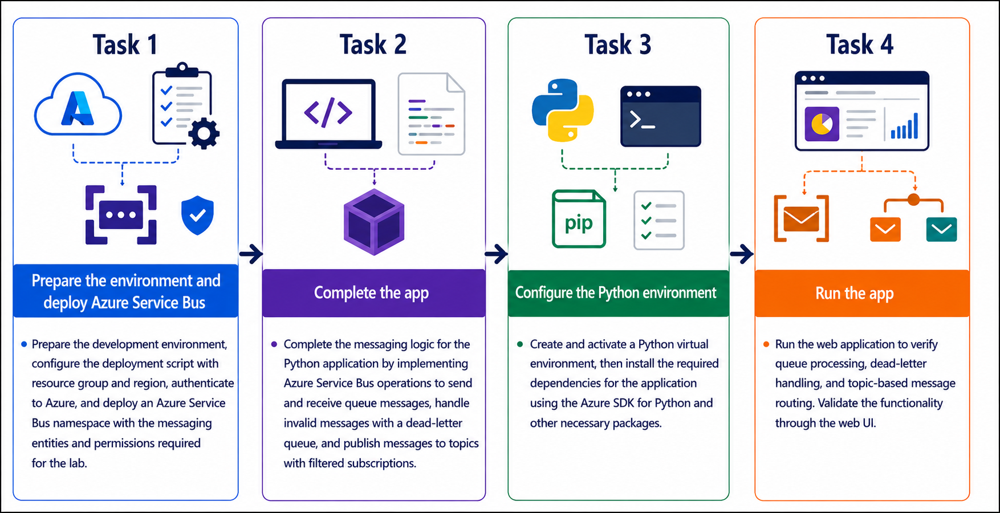
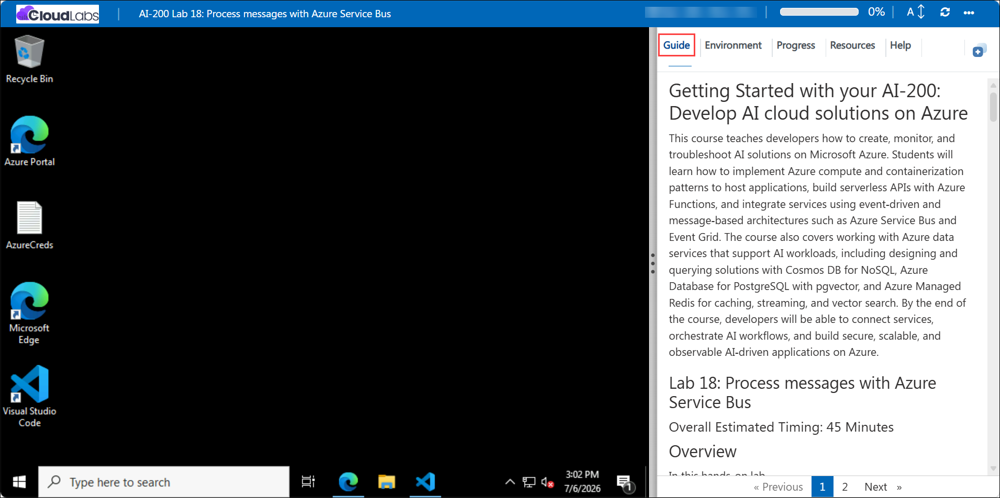

# Getting Started with your AI-200: Develop AI cloud solutions on Azure

Welcome to your AI-200: Develop AI cloud solutions on Azure workshop! In this lab, you will process messages using Azure Service Bus and build reliable messaging workflows with queues, dead-letter handling, and topic-based routing.

## Lab 18: Process messages with Azure Service Bus

### Overall Estimated Timing: 60 Minutes

## Overview

In this hands-on lab, you will provision Azure Service Bus, create the required messaging entities, and complete a Python app that demonstrates queue processing, dead-letter handling, and topic subscription filtering. You will send valid and malformed messages, process them using peek-lock delivery, inspect dead-lettered messages, and verify topic routing with subscription filters.

## Objectives

1. **Deploy Azure Service Bus resources:** Provision a Service Bus namespace, queue, topic, and subscriptions with appropriate role assignment.

2. **Implement queue messaging and dead-letter handling:** Send messages, process them with peek-lock delivery, and move malformed messages to the dead-letter queue.

3. **Implement topic routing with filters:** Publish messages to a Service Bus topic and verify delivery to subscriptions with SQL filters.

4. **Validate messaging workflows:** Run the Python application and confirm message delivery, processing, and dead-letter behavior.

## Pre-requisites

- Basic knowledge of messaging patterns and Azure Service Bus concepts.
- Experience using Python, Visual Studio Code, and Azure CLI.
- Access to an Azure subscription and the provided lab credentials.
- Familiarity with running terminal commands in PowerShell or Bash.

## Architecture

The lab architecture shows an Azure Service Bus messaging solution where a Python app sends messages to a queue and a topic. Queue messages are processed with peek-lock and invalid messages are dead-lettered, while topic messages are delivered to subscriptions based on SQL filters.

1. **Azure Service Bus queue:** Receives messages for processing and dead-letter handling.

2. **Dead-letter queue:** Stores invalid or failed messages for diagnostics and replay.

3. **Azure Service Bus topic and subscriptions:** Routes published messages to subscriptions using filters.

4. **Python messaging app:** Sends messages, processes queue deliveries, inspects dead-lettered entries, and validates topic routing.

## Architecture Diagram

## Explanation of Components

1. **Azure Service Bus namespace:** Provides the messaging backbone for queues, topics, and subscriptions that support reliable asynchronous communication.

2. **Service Bus queue:** Receives messages from the application and supports peek-lock processing for safe, at-least-once delivery.

3. **Dead-letter queue:** Captures messages that cannot be processed successfully so you can inspect failures and handle them separately.

4. **Service Bus topic and subscriptions:** Routes published messages to multiple subscribers and uses SQL filters to deliver only relevant messages to each subscription.

## Accessing Your Lab Environment

Once you're ready to dive in, your virtual machine and **Guide** will be right at your fingertips within your web browser.

## Virtual Machine & Lab Guide

Your virtual machine is your workhorse throughout the workshop. The lab guide is your roadmap to success.

## Exploring Your Lab Resources

To get a better understanding of your lab resources and credentials, navigate to the **Environment** tab.

## Managing Your Virtual Machine

Feel free to **Start, Restart, or Stop (2)** your virtual machine as needed from the **Resources (1)** tab. Your experience is in your hands!

## Lab Progress

You can use the **Progress** tab to track your progress while working on the lab. A score will be provided after successful validation.

## Utilizing the Split Window Feature

For convenience, you can open the lab guide in a separate window by selecting the **Split Window** button from the top right corner.

## Lab Guide Zoom In/Zoom Out

To adjust the zoom level for the environment page, click the **A↕: 100%** icon located next to the timer in the lab environment.

## Let's Get Started with Azure Portal

1. On your virtual machine, click on the Azure Portal icon as shown below:

   

1. In the sign-in window, kindly sign in using the provided Azure credentials
   - **Email/Username:** <inject key="AzureAdUserEmail"></inject>

     

   - **Password:** <inject key="AzureAdUserPassword"></inject>

     

1. If prompted to **Stay signed in?**, you can click **No**.

   

1. If a **Welcome to Microsoft Azure** pop-up window appears, simply click **Maybe later** to skip the tour.

   

## Support Contact

The CloudLabs support team is available 24/7, 365 days a year, via email and live chat to ensure seamless assistance at any time. We offer dedicated support channels explicitly tailored for both learners and instructors, ensuring that all your needs are promptly and efficiently addressed.

Learner Support Contacts:

- Email Support: cloudlabs-support@spektrasystems.com
- Live Chat Support: https://cloudlabs.ai/labs-support

Click on **Next** from the lower right corner to move on to the next page.

## Happy Learning !!
