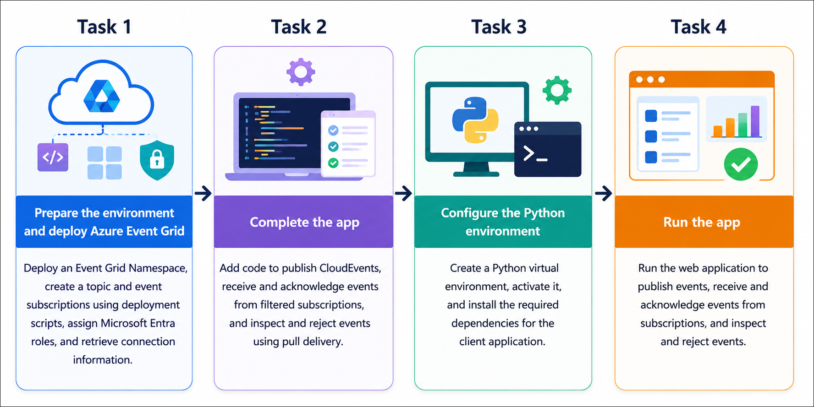
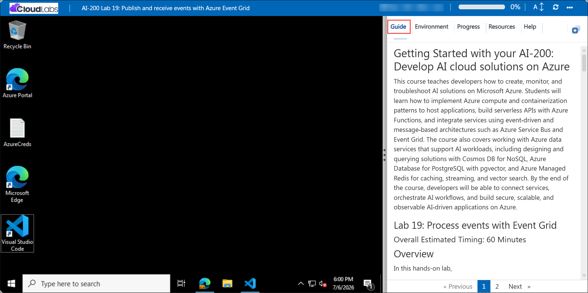

# Getting Started with your AI-200: Develop AI cloud solutions on Azure

Welcome to your AI-200: Develop AI cloud solutions on Azure workshop! In this lab, you will process events using Azure Event Grid and build an event-driven Python application that publishes CloudEvents, receives events with pull delivery, and validates subscription filtering, acknowledgements, and rejection workflows.

## Lab 19: Process events with Event Grid

### Overall Estimated Timing: 60 Minutes

## Overview

In this hands-on lab, you will learn how to build an event-driven application using Azure Event Grid Namespace and the Azure SDK for Python. You will deploy Event Grid resources, including a namespace, topic, and multiple event subscriptions, and implement a Python application that publishes CloudEvents representing AI content moderation results. You will then configure pull delivery to receive events from filtered subscriptions, acknowledge successfully processed events, and reject events that cannot be processed. Finally, you will run a web application to validate event publishing, event routing, subscription filtering, and the complete event lifecycle using Microsoft Entra authentication.

## Objectives

1. **Deploy and configure Azure Event Grid resources:** Create an Event Grid Namespace, namespace topic, and event subscriptions using deployment scripts, and configure Microsoft Entra permissions for event publishing and consumption.

2. **Publish CloudEvents using the Azure SDK for Python:** Implement event publishing logic to send CloudEvents to an Event Grid namespace topic using the CloudEvents v1.0 schema and Microsoft Entra authentication.

3. **Receive and process events with pull delivery:** Configure consumer clients to retrieve events from filtered subscriptions, process the received events, and acknowledge successful deliveries using lock tokens.

4. **Validate event routing with subscription filters:** Verify that Event Grid correctly routes events to different subscriptions based on event type filters while maintaining an audit subscription for all published events.

5. **Inspect and manage the event lifecycle:** Examine CloudEvent metadata and broker properties, reject events that cannot be processed, and understand how acknowledgements, rejection, delivery counts, and pull delivery contribute to reliable event processing.

## Pre-requisites

- Basic knowledge of Azure services and Azure resource management.

- Familiarity with Python programming and creating Python virtual environments.

- Basic understanding of event-driven architecture and messaging concepts.

- Experience using Visual Studio Code, Azure CLI, and terminal commands (PowerShell or Bash).

- Basic knowledge of Microsoft Entra authentication and Azure SDKs for Python.

## Architecture

The lab architecture demonstrates how **Azure Event Grid Namespace** enables reliable event-driven communication using CloudEvents, pull delivery, filtered event subscriptions, and Microsoft Entra authentication:

1. **Azure Event Grid Namespace:** An Event Grid Namespace serves as the central messaging resource that hosts namespace topics and manages event routing, subscriptions, and delivery for the application.

2. **Namespace Topic:** A namespace topic receives CloudEvents published by the Python application. Event Grid evaluates each event against the configured subscription filters and routes matching events to the appropriate subscriptions.

3. **Python Publisher Application:** The application uses the Azure SDK for Python and Microsoft Entra authentication to publish CloudEvents representing AI content moderation results to the Event Grid namespace topic.

4. **Filtered Event Subscriptions:** Multiple pull-delivery subscriptions are configured to receive specific event types. The **Flagged** and **Approved** subscriptions filter events based on their event type, while the **All Events** subscription receives every published event to provide a complete audit trail.

5. **Python Consumer Application:** The application retrieves events from the subscriptions using pull delivery, processes the received CloudEvents, acknowledges successfully processed events, and rejects events that cannot be processed, demonstrating the complete event lifecycle and reliable event handling.

## Architecture Diagram

## Explanation of Components

1. **Azure Event Grid Namespace:** The Event Grid Namespace serves as the central eventing resource that manages namespace topics, event subscriptions, and event delivery. It provides a scalable and secure environment for publishing, routing, and consuming events.

2. **Namespace Topic:** The namespace topic acts as the event ingestion point where CloudEvents are published. Event Grid evaluates each incoming event against the configured subscription filters and routes matching events to the appropriate subscriptions.

3. **Python Publisher Application:** The publisher application uses the Azure SDK for Python together with Microsoft Entra authentication to create and publish CloudEvents that represent AI content moderation results. Each event includes CloudEvent metadata and a payload describing the moderation outcome.

4. **Pull Delivery Event Subscriptions:** The event subscriptions receive events from the namespace topic based on configured filters. The **Flagged** and **Approved** subscriptions deliver only matching event types, while the **All Events** subscription captures every published event to provide a complete audit trail.

5. **Python Consumer Application:** The consumer application connects to Event Grid using pull delivery to retrieve events from each subscription. It processes received events, acknowledges successful processing to remove events from the subscription, and rejects events that cannot be processed, demonstrating reliable event lifecycle management.

## Accessing Your Lab Environment

Once you're ready to dive in, your virtual machine and **Guide** will be right at your fingertips within your web browser.

## Virtual Machine & Lab Guide

Your virtual machine is your workhorse throughout the workshop. The lab guide is your roadmap to success.

## Exploring Your Lab Resources

To get a better understanding of your lab resources and credentials, navigate to the **Environment** tab.

## Managing Your Virtual Machine

Feel free to **Start, Restart, or Stop (2)** your virtual machine as needed from the **Resources (1)** tab. Your experience is in your hands!

## Lab Progress

You can use the **Progress** tab to track your progress while working on the lab. A score will be provided after successful validation.

## Utilizing the Split Window Feature

For convenience, you can open the lab guide in a separate window by selecting the **Split Window** button from the top right corner.

## Lab Guide Zoom In/Zoom Out

To adjust the zoom level for the environment page, click the **A↕: 100%** icon located next to the timer in the lab environment.

## Let's Get Started with Azure Portal

1. On your virtual machine, click on the Azure Portal icon as shown below:

   

1. In the sign-in window, kindly sign in using the provided Azure credentials
   - **Email/Username:** <inject key="AzureAdUserEmail"></inject>

     

   - **Password:** <inject key="AzureAdUserPassword"></inject>

     

1. If prompted to **Stay signed in?**, you can click **No**.

   

1. If a **Welcome to Microsoft Azure** pop-up window appears, simply click **Maybe later** to skip the tour.

   

## Support Contact

The CloudLabs support team is available 24/7, 365 days a year, via email and live chat to ensure seamless assistance at any time. We offer dedicated support channels explicitly tailored for both learners and instructors, ensuring that all your needs are promptly and efficiently addressed.

Learner Support Contacts:

- Email Support: cloudlabs-support@spektrasystems.com
- Live Chat Support: https://cloudlabs.ai/labs-support

Click on **Next** from the lower right corner to move on to the next page.

## Happy Learning !!
