# Getting Started with your AI-200: Develop AI cloud solutions on Azure

Welcome to your AI-200: Develop AI Cloud Solutions on Azure workshop! We’re excited to guide you through hands-on learning with Azure services, containerization, serverless APIs, event-driven architectures, and data solutions to create, deploy, and test intelligent cloud applications.

## Lab 20: Create an MCP server with Azure Functions

### Overall Estimated Timing: 60 Minutes

## Overview

In this hands-on lab, you will build a local Model Context Protocol (MCP) server using Azure Functions and the Azure Functions MCP extension. You will create and configure an Azure Functions Python project, register a local MCP endpoint, implement MCP tool trigger functions for document summarization and classification, verify your Python development environment, and test the MCP server locally using GitHub Copilot in Agent mode.

## Objectives

1. **Create and configure an Azure Functions MCP server:** scaffold a Python Functions project, install required extensions, and configure local MCP server settings.

2. **Implement MCP tool trigger functions:** define MCP tools for text summarization and classification using the Azure Functions MCP extension.

3. **Verify the Python environment and tool registration:** confirm the local Python interpreter, start the Functions runtime, and register the MCP endpoint with Visual Studio Code.

4. **Test the MCP server with GitHub Copilot:** connect GitHub Copilot in Agent mode, discover the registered MCP tools, and invoke them using explicit and natural language prompts.

## Pre-requisites

- Basic knowledge of Python and Visual Studio Code.

- Familiarity with Azure Functions and local development workflows.

- Access to GitHub Copilot with a personal GitHub account.

- Access to the provided lab VM and Azure lab environment.

## Architecture

The lab architecture demonstrates how a local Azure Functions app can act as an MCP server to expose discoverable tools to AI clients. A Python-based Function App hosts MCP tool trigger functions that register with the local MCP endpoint, and GitHub Copilot connects to that endpoint to discover and invoke the tools.

1. **Azure Functions app:** hosts MCP tool trigger functions locally using the Azure Functions runtime.

2. **MCP tool trigger functions:** define the available tools and expose them through the MCP server.

3. **GitHub Copilot Agent mode:** connects to the local MCP endpoint and uses the registered tools for document processing.

## Architecture Diagram

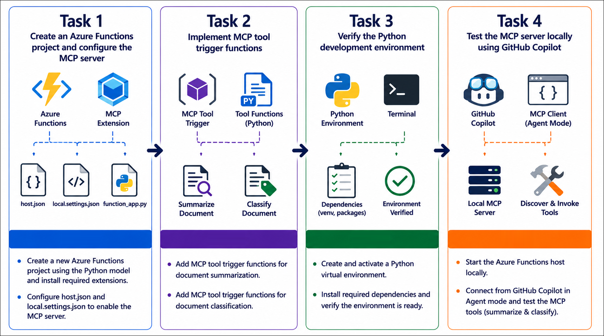

## Explanation of Components

1. **Azure Functions project:** contains the Python app, function definitions, and local configuration required to run the MCP server.

2. **host.json:** configures the Azure Functions runtime to use the MCP extension bundle and registers MCP server metadata such as server name and version.

3. **mcp.json:** registers the local MCP endpoint with Visual Studio Code so GitHub Copilot can discover the available tools.

4. **GitHub Copilot in Agent mode:** connects to the local MCP server, discovers the MCP tools, and invokes them for tasks such as summarization and classification.

## Accessing Your Lab Environment

Once you're ready to dive in, your virtual machine and **Guide** will be right at your fingertips within your web browser.

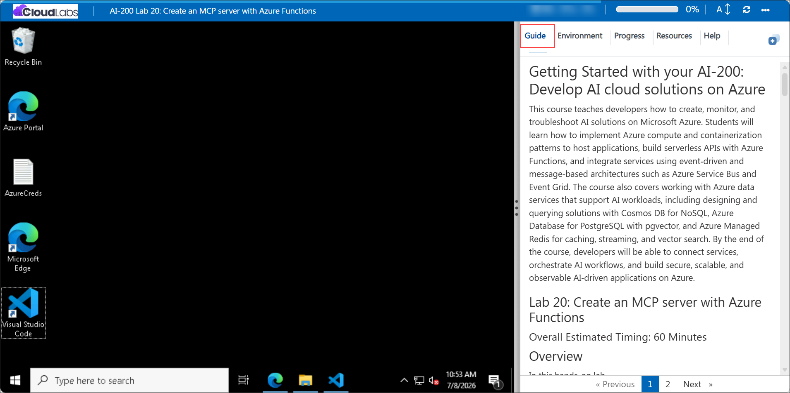

## Virtual Machine & Lab Guide

Your virtual machine is your workhorse throughout the workshop. The lab guide is your roadmap to success.

## Exploring Your Lab Resources

To get a better understanding of your lab resources and credentials, navigate to the **Environment** tab.

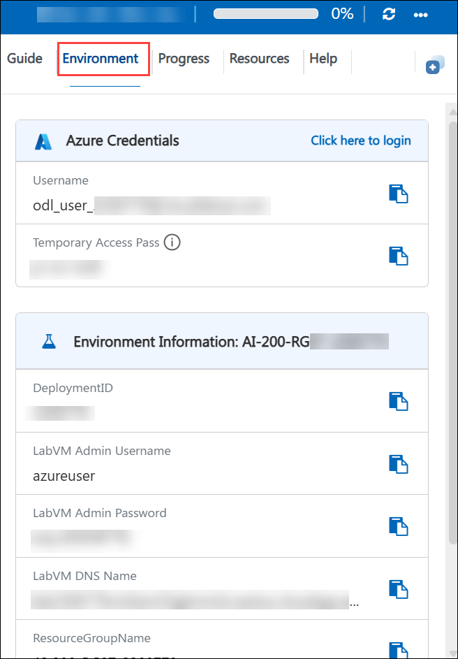

## Managing Your Virtual Machine

Feel free to **Start, Restart, or Stop (2)** your virtual machine as needed from the **Resources (1)** tab. Your experience is in your hands!

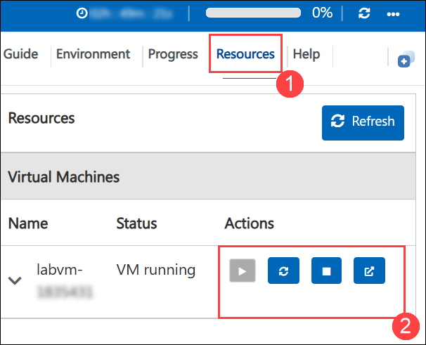

## Lab Progress

You can use the **Progress** tab to track your progress while working on the lab. A score will be provided after successful validation.

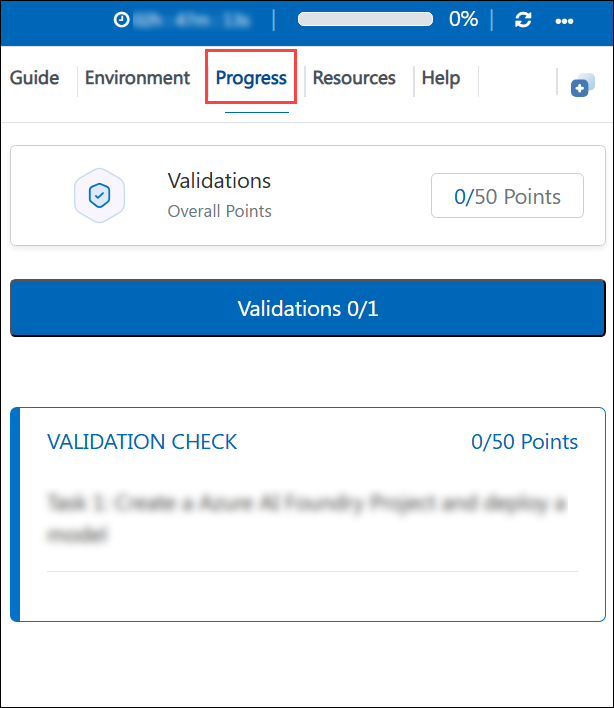

## Utilizing the Split Window Feature

For convenience, you can open the lab guide in a separate window by selecting the **Split Window** button from the top right corner.

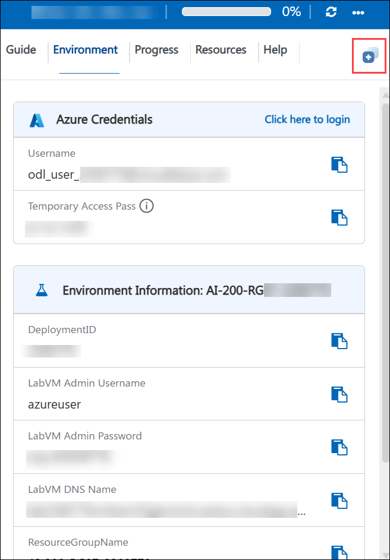

## Lab Guide Zoom In/Zoom Out

To adjust the zoom level for the environment page, click the **A↕: 100%** icon located next to the timer in the lab environment.

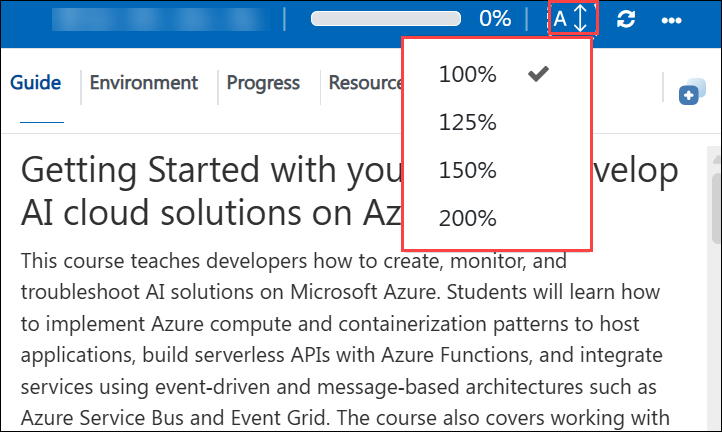

## Let's Get Started with Azure Portal

1. On your virtual machine, click on the Azure Portal icon as shown below:

   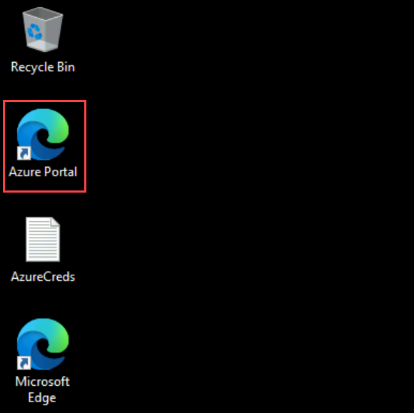

1. In the sign-in window, kindly sign in using the provided Azure credentials
   - **Email/Username:** <inject key="AzureAdUserEmail"></inject>

     

   - **Password:** <inject key="AzureAdUserPassword"></inject>

     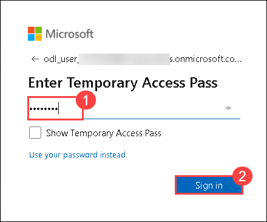

1. If prompted to **Stay signed in?**, you can click **No**.

   

1. If a **Welcome to Microsoft Azure** pop-up window appears, simply click **Maybe later** to skip the tour.

   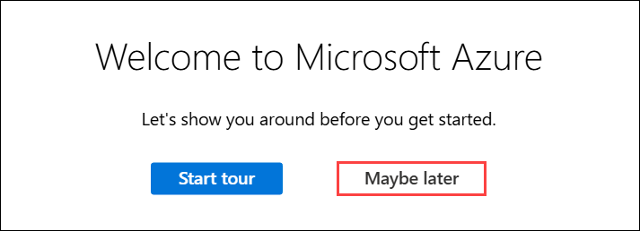

## Support Contact

The CloudLabs support team is available 24/7, 365 days a year, via email and live chat to ensure seamless assistance at any time. We offer dedicated support channels explicitly tailored for both learners and instructors, ensuring that all your needs are promptly and efficiently addressed.

Learner Support Contacts:

- Email Support: cloudlabs-support@spektrasystems.com
- Live Chat Support: https://cloudlabs.ai/labs-support

Click on **Next** from the lower right corner to move on to the next page.

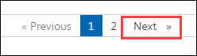

## Happy Learning !!
