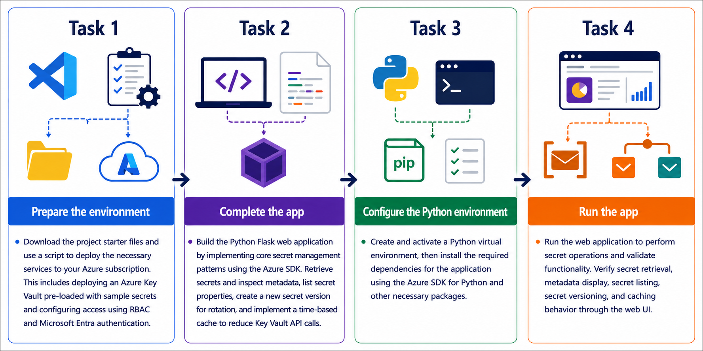

# Getting Started with your AI-200: Develop AI cloud solutions on Azure
 
Welcome to your AI-200: Develop AI cloud solutions on Azure workshop! In this lab, you will manage secrets with Azure Key Vault and build a Python Flask web app that retrieves secrets, lists secret metadata, creates new secret versions, and demonstrates time-based caching.

## Lab 21: Manage secrets with Azure Key Vault 

### Overall Estimated Timing: 60 Minutes

## Overview

In this hands-on lab, you will deploy an Azure Key Vault with RBAC authorization, store sample secrets, and complete a Python application that securely retrieves secrets, lists secret properties, rotates secret versions, and reduces repeated Key Vault access by using a cache.

## Objectives

1. **Deploy Azure Key Vault with RBAC authorization:** Create a vault, assign the Key Vault Secrets Officer role, and store sample secrets for the application.

2. **Retrieve secrets securely using Microsoft Entra:** Access secret values and metadata from the Python app with DefaultAzureCredential.

3. **List secret properties without exposing values:** Query secret metadata for inventory and audit scenarios while keeping secret contents hidden.

4. **Rotate secrets and manage versions:** Create a new secret version to simulate credential rotation and confirm the update.

5. **Implement caching for secret access:** Use a time-based cache to reduce the number of Key Vault API calls and improve application performance.

## Pre-requisites

- Basic knowledge of Azure services and Azure resource management.

- Familiarity with Python programming and creating Python virtual environments.

- Experience using Visual Studio Code, Azure CLI, and terminal commands (PowerShell or Bash).

- Basic understanding of secret management and Microsoft Entra authentication.

- Access to an Azure subscription and the provided lab credentials.

## Architecture

The lab architecture demonstrates how Azure Key Vault provides secure secret storage, RBAC-based access control, and a Python app that retrieves secrets, inspects metadata, rotates versions, and caches values to reduce repeated Key Vault calls.

1. **Azure Key Vault:** Stores secrets securely and manages secret versions over time.

2. **RBAC role assignment:** Grants the application permission to read and manage secrets using Microsoft Entra credentials.

3. **Python Flask application:** Retrieves secrets, lists secret properties, creates new secret versions, and demonstrates cache behavior.

4. **Secret caching layer:** Reduces repeated Key Vault API calls by temporarily storing secret values in memory.

## Architecture Diagram

## Explanation of Components

1. **Azure Key Vault:** A secure service for storing application secrets, connection strings, and other sensitive configuration values.

2. **Key Vault RBAC:** Microsoft Entra-based permissions that allow the app to access secrets without using static keys or connection strings.

3. **Python Flask application:** The web app that interacts with Key Vault to retrieve secrets, list metadata, rotate secret versions, and show cached retrieval behavior.

4. **Secret cache:** An in-memory cache that helps the app reduce repeated Key Vault calls by reusing recently accessed secret values for a short period.

## Accessing Your Lab Environment
 
Once you're ready to dive in, your virtual machine and **Guide** will be right at your fingertips within your web browser.
 

## Virtual Machine & Lab Guide
 
Your virtual machine is your workhorse throughout the workshop. The lab guide is your roadmap to success.

## Exploring Your Lab Resources
 
To get a better understanding of your lab resources and credentials, navigate to the **Environment** tab.
 

## Managing Your Virtual Machine
 
Feel free to **Start, Restart, or Stop (2)** your virtual machine as needed from the **Resources (1)** tab. Your experience is in your hands!
 

## Lab Progress

You can use the **Progress** tab to track your progress while working on the lab. A score will be provided after successful validation.

## Utilizing the Split Window Feature
 
For convenience, you can open the lab guide in a separate window by selecting the **Split Window** button from the top right corner.
 

## Lab Guide Zoom In/Zoom Out
 
To adjust the zoom level for the environment page, click the **A↕: 100%** icon located next to the timer in the lab environment.

## Let's Get Started with Azure Portal
 
1. On your virtual machine, click on the Azure Portal icon as shown below:
 
   

1. In the sign-in window, kindly sign in using the provided Azure credentials

    - **Email/Username:** <inject key="AzureAdUserEmail"></inject>

        

    - **Password:** <inject key="AzureAdUserPassword"></inject>

        

1. If prompted to **Stay signed in?**, you can click **No**.

    

1. If a **Welcome to Microsoft Azure** pop-up window appears, simply click **Maybe later** to skip the tour.

    

## Support Contact
 
The CloudLabs support team is available 24/7, 365 days a year, via email and live chat to ensure seamless assistance at any time. We offer dedicated support channels explicitly tailored for both learners and instructors, ensuring that all your needs are promptly and efficiently addressed.
 
Learner Support Contacts:
 
- Email Support: cloudlabs-support@spektrasystems.com
- Live Chat Support: https://cloudlabs.ai/labs-support

Click on **Next** from the lower right corner to move on to the next page.

   

## Happy Learning !!