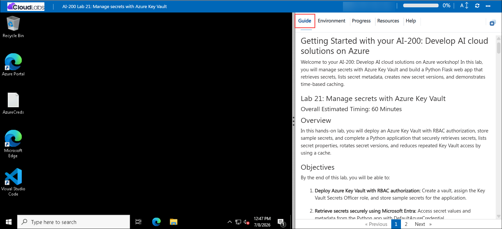

# Getting Started with your AI-200: Develop AI cloud solutions on Azure

Welcome to your AI-200: Develop AI cloud solutions on Azure workshop! In this lab, you will use Azure App Configuration to centralize application settings, resolve Key Vault references for secrets, and build a Python app that demonstrates configuration loading, listing, and dynamic refresh.

## Lab 22: Retrieve settings and secrets from Azure App Configuration 

### Overall Estimated Timing: 60 Minutes

## Overview

In this hands-on lab, you will deploy an Azure App Configuration store and a Key Vault, configure settings with labels and Key Vault references, and complete a Python Flask application that loads configuration values, lists stored settings, and refreshes configuration dynamically using a sentinel key.

## Objectives

By the end of this lab, you will be able to:

1. **Deploy Azure App Configuration and Key Vault:** Create an App Configuration store and a Key Vault, assign roles, and store sample settings and secrets.

2. **Load and resolve configuration settings:** Retrieve application settings with label stacking and automatically resolve Key Vault references in the Python app.

3. **List App Configuration settings metadata:** Inspect setting metadata for audit and inventory purposes without exposing secret values.

4. **Implement dynamic refresh:** Update configuration values and trigger a sentinel-based refresh so the app picks up changes without restarting.

## Pre-requisites

- Basic knowledge of Azure services and Azure resource management.

- Familiarity with Python programming and creating Python virtual environments.

- Experience using Visual Studio Code, Azure CLI, and terminal commands (PowerShell or Bash).

- Basic understanding of configuration management, Key Vault secrets, and Microsoft Entra authentication.

## Architecture

The lab architecture demonstrates how Azure App Configuration centralizes application settings and resolves Key Vault references, while a Python application loads configuration values, lists settings metadata, and refreshes settings dynamically using a sentinel.

1. **Azure App Configuration:** Stores application settings with labels and enables configuration management separate from code.

2. **Azure Key Vault:** Stores sensitive secrets securely and provides referenced values to App Configuration.

3. **Python Flask application:** Loads configuration values, lists setting metadata, and triggers dynamic refresh.

4. **Sentinel-based refresh:** Uses a special sentinel key to detect changes and refresh the app configuration without restarting.

## Architecture Diagram

## Explanation of Components

1. **Azure App Configuration:** A centralized service for storing application settings, labels, and Key Vault references that help manage environment-specific configuration safely.

2. **Azure Key Vault:** Stores sensitive secrets and provides secure references that App Configuration resolves at runtime.

3. **Python Flask application:** Retrieves settings, lists metadata, and demonstrates how configuration values are consumed by an app using Azure SDKs.

4. **Dynamic refresh sentinel:** A configuration key that signals the app to refresh its loaded settings when the sentinel value changes.

## Accessing Your Lab Environment
 
Once you're ready to dive in, your virtual machine and **Guide** will be right at your fingertips within your web browser.
 

## Virtual Machine & Lab Guide
 
Your virtual machine is your workhorse throughout the workshop. The lab guide is your roadmap to success.

## Exploring Your Lab Resources
 
To get a better understanding of your lab resources and credentials, navigate to the **Environment** tab.
 

## Managing Your Virtual Machine
 
Feel free to **Start, Restart, or Stop (2)** your virtual machine as needed from the **Resources (1)** tab. Your experience is in your hands!
 

## Lab Progress

You can use the **Progress** tab to track your progress while working on the lab. A score will be provided after successful validation.

## Utilizing the Split Window Feature
 
For convenience, you can open the lab guide in a separate window by selecting the **Split Window** button from the top right corner.
 

## Lab Guide Zoom In/Zoom Out
 
To adjust the zoom level for the environment page, click the **A↕: 100%** icon located next to the timer in the lab environment.

## Let's Get Started with Azure Portal
 
1. On your virtual machine, click on the Azure Portal icon as shown below:
 
   

1. In the sign-in window, kindly sign in using the provided Azure credentials

    - **Email/Username:** <inject key="AzureAdUserEmail"></inject>

        

    - **Password:** <inject key="AzureAdUserPassword"></inject>

        

1. If prompted to **Stay signed in?**, you can click **No**.

    

1. If a **Welcome to Microsoft Azure** pop-up window appears, simply click **Maybe later** to skip the tour.

    

## Support Contact
 
The CloudLabs support team is available 24/7, 365 days a year, via email and live chat to ensure seamless assistance at any time. We offer dedicated support channels explicitly tailored for both learners and instructors, ensuring that all your needs are promptly and efficiently addressed.
 
Learner Support Contacts:
 
- Email Support: cloudlabs-support@spektrasystems.com
- Live Chat Support: https://cloudlabs.ai/labs-support

Click on **Next** from the lower right corner to move on to the next page.

   

## Happy Learning !!