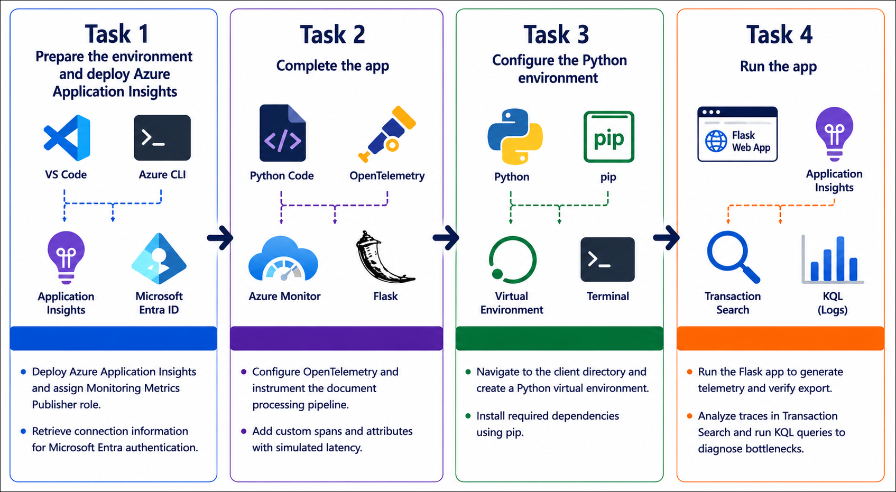
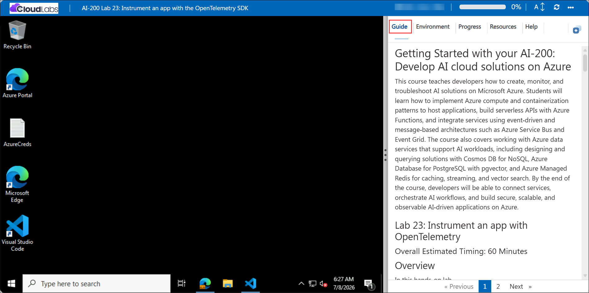

# Getting Started with your AI-200: Develop AI cloud solutions on Azure

Welcome to your AI-200: Develop AI cloud solutions on Azure workshop! In this lab, you will instrument a Python Flask application with OpenTelemetry and publish telemetry to Azure Application Insights to visualize trace data and diagnose application performance.

## Lab 23: Instrument an app with the OpenTelemetry SDK 

### Overall Estimated Timing: 60 Minutes

## Overview

In this hands-on lab, you will deploy an Azure Application Insights resource, configure the Azure Monitor OpenTelemetry Distro for a Python app, and instrument a document processing pipeline with parent and child spans. You will enrich traces with custom attributes, run the application to generate telemetry, and use the Azure portal to analyze requests and diagnose a simulated performance bottleneck.

## Objectives

1. **Deploy Application Insights:** Create an Application Insights resource and assign the required Monitoring Metrics Publisher role for Entra-based telemetry export.

2. **Configure OpenTelemetry tracing:** Use the Azure Monitor OpenTelemetry Distro to instrument a Python Flask app and export telemetry using Microsoft Entra authentication.

3. **Create distributed traces:** Instrument a document processing pipeline with parent and child spans and add custom span attributes for business context.

4. **Generate and inspect telemetry:** Run the application, view end-to-end request traces in Application Insights, and identify slow operations in the trace timeline.

5. **Query telemetry with KQL:** Use Kusto Query Language to analyze trace data and compare performance metrics for different pipeline stages.

## Pre-requisites

- Basic knowledge of Azure services and Azure resource management.

- Familiarity with Python programming and creating Python virtual environments.

- Experience using Visual Studio Code, Azure CLI, and terminal commands (PowerShell or Bash).

- Basic understanding of application observability, distributed tracing, and telemetry analysis.

## Architecture

The lab architecture demonstrates how Azure Application Insights and OpenTelemetry provide observability for a Python Flask application by collecting traces, exporting telemetry, and enabling performance analysis.

1. **Azure Application Insights:** Receives telemetry from the instrumented app and stores request traces, spans, and custom attributes.

2. **Azure Monitor OpenTelemetry Distro:** Configures the OpenTelemetry SDK and exporter so the app sends telemetry using Application Insights connection data and Entra authentication.

3. **Python Flask application:** Generates telemetry for a document processing pipeline, including parent and child spans for validation, enrichment, and storage stages.

4. **Telemetry analysis tools:** Application Insights Transaction Search and Logs provide end-to-end trace visualization and KQL query capabilities.

## Architecture Diagram

## Explanation of Components

1. **Azure Application Insights:** Provides a managed telemetry store and analytics platform for monitoring application performance and diagnosing issues.

2. **OpenTelemetry instrumentation:** Captures distributed traces and span data from the Python app to show how requests flow through the pipeline.

3. **Custom span attributes:** Adds business context and performance metadata to traces so you can filter and understand slow operations.

4. **Python Flask application:** The instrumented web app that triggers telemetry for document processing and demonstrates real-world observability patterns.

## Accessing Your Lab Environment

Once you're ready to dive in, your virtual machine and **Guide** will be right at your fingertips within your web browser.

## Virtual Machine & Lab Guide

Your virtual machine is your workhorse throughout the workshop. The lab guide is your roadmap to success.

## Exploring Your Lab Resources

To get a better understanding of your lab resources and credentials, navigate to the **Environment** tab.

## Managing Your Virtual Machine

Feel free to **Start, Restart, or Stop (2)** your virtual machine as needed from the **Resources (1)** tab. Your experience is in your hands!

## Lab Progress

You can use the **Progress** tab to track your progress while working on the lab. A score will be provided after successful validation.

## Utilizing the Split Window Feature

For convenience, you can open the lab guide in a separate window by selecting the **Split Window** button from the top right corner.

## Lab Guide Zoom In/Zoom Out

To adjust the zoom level for the environment page, click the **A↕: 100%** icon located next to the timer in the lab environment.

## Let's Get Started with Azure Portal

1. On your virtual machine, click on the Azure Portal icon as shown below:

   

1. In the sign-in window, kindly sign in using the provided Azure credentials
   - **Email/Username:** <inject key="AzureAdUserEmail"></inject>

     

   - **Password:** <inject key="AzureAdUserPassword"></inject>

     

1. If prompted to **Stay signed in?**, you can click **No**.

   

1. If a **Welcome to Microsoft Azure** pop-up window appears, simply click **Maybe later** to skip the tour.

   

## Support Contact

The CloudLabs support team is available 24/7, 365 days a year, via email and live chat to ensure seamless assistance at any time. We offer dedicated support channels explicitly tailored for both learners and instructors, ensuring that all your needs are promptly and efficiently addressed.

Learner Support Contacts:

- Email Support: cloudlabs-support@spektrasystems.com
- Live Chat Support: https://cloudlabs.ai/labs-support

Click on **Next** from the lower right corner to move on to the next page.

## Happy Learning !!
