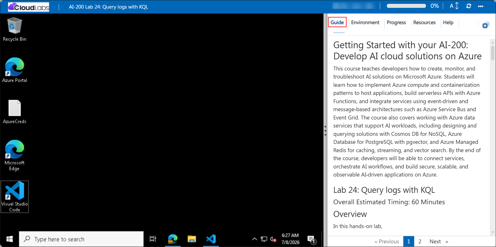

# Getting Started with your AI-200: Develop AI cloud solutions on Azure

Welcome to your AI-200: Develop AI cloud solutions on Azure workshop! In this lab, you will query application telemetry using Kusto Query Language (KQL) in Azure Application Insights to investigate logs, requests, dependencies, and alerts for a distributed application.

## Lab 24: Query logs with KQL

### Overall Estimated Timing: 60 Minutes

## Overview

In this hands-on lab, you will deploy an Azure Application Insights resource, generate telemetry from a Python application, and use the Azure portal Logs experience to write KQL queries. You will analyze failed requests, dependency latency, exceptions, and performance metrics, then configure proactive monitoring with an action group and scheduled query alert rule.

## Objectives

1. **Deploy Application Insights:** Create an Application Insights resource and assign the Monitoring Metrics Publisher role so the app can send telemetry using Microsoft Entra authentication.

2. **Generate telemetry data:** Run a Python application that produces request, dependency, and exception telemetry for analysis.

3. **Query telemetry with KQL:** Write Kusto Query Language queries to analyze failed requests, performance trends, exceptions, and dependency latency.

4. **Correlate telemetry types:** Join request and exception data to identify which operations produced errors.

5. **Create alerts:** Configure an Azure Monitor action group and scheduled query alert rule to notify administrators when failure thresholds are exceeded.

## Pre-requisites

- Basic knowledge of Azure services and Azure resource management.

- Familiarity with Python programming and creating Python virtual environments.

- Experience using Visual Studio Code, Azure CLI, and terminal commands (PowerShell or Bash).

- Basic understanding of application monitoring, log analytics, and alerting.

## Architecture

The lab architecture demonstrates how Azure Application Insights collects telemetry from a Python application, stores it for analysis, and enables proactive monitoring through alerts.

1. **Azure Application Insights:** Collects request, dependency, and exception telemetry from the instrumented application.

2. **Python telemetry generator:** Produces sample application telemetry that mimics real-world service behavior and failures.

3. **Logs and KQL:** Queries telemetry data in Azure Monitor Logs to investigate performance and troubleshoot errors.

4. **Alerting with Azure Monitor:** Uses action groups and scheduled query alerts to notify administrators when a telemetry-based condition is met.

## Architecture Diagram

## Explanation of Components

1. **Azure Application Insights:** A managed observability service that stores and indexes telemetry for monitoring and diagnostics.

2. **Telemetry generator app:** A Python application that creates telemetry events such as requests, dependencies, and exceptions.

3. **Kusto Query Language (KQL):** The query language used to explore and analyze telemetry data in the Azure portal.

4. **Azure Monitor alerting:** A mechanism that triggers notifications when predefined telemetry conditions occur.

## Accessing Your Lab Environment

Once you're ready to dive in, your virtual machine and **Guide** will be right at your fingertips within your web browser.

## Virtual Machine & Lab Guide

Your virtual machine is your workhorse throughout the workshop. The lab guide is your roadmap to success.

## Exploring Your Lab Resources

To get a better understanding of your lab resources and credentials, navigate to the **Environment** tab.

## Managing Your Virtual Machine

Feel free to **Start, Restart, or Stop (2)** your virtual machine as needed from the **Resources (1)** tab. Your experience is in your hands!

## Lab Progress

You can use the **Progress** tab to track your progress while working on the lab. A score will be provided after successful validation.

## Utilizing the Split Window Feature

For convenience, you can open the lab guide in a separate window by selecting the **Split Window** button from the top right corner.

## Lab Guide Zoom In/Zoom Out

To adjust the zoom level for the environment page, click the **A↕: 100%** icon located next to the timer in the lab environment.

## Let's Get Started with Azure Portal

1. On your virtual machine, click on the Azure Portal icon as shown below:

   

1. In the sign-in window, kindly sign in using the provided Azure credentials
   - **Email/Username:** <inject key="AzureAdUserEmail"></inject>

     

   - **Password:** <inject key="AzureAdUserPassword"></inject>

     

1. If prompted to **Stay signed in?**, you can click **No**.

   

1. If a **Welcome to Microsoft Azure** pop-up window appears, simply click **Maybe later** to skip the tour.

   

## Support Contact

The CloudLabs support team is available 24/7, 365 days a year, via email and live chat to ensure seamless assistance at any time. We offer dedicated support channels explicitly tailored for both learners and instructors, ensuring that all your needs are promptly and efficiently addressed.

Learner Support Contacts:

- Email Support: cloudlabs-support@spektrasystems.com
- Live Chat Support: https://cloudlabs.ai/labs-support

Click on **Next** from the lower right corner to move on to the next page.

## Happy Learning !!
