# Lab 21: Manage secrets with Azure Key Vault

### Estimated Duration : 60 Minutes

## Lab Overview

In this hands-on lab, you deploy an Azure Key Vault pre-loaded with sample secrets and build a Python Flask web application that demonstrates core secret management patterns using the Azure SDK. You retrieve secrets and inspect their metadata, list all secret properties without exposing values, create a new secret version to simulate credential rotation, and implement a time-based cache to reduce Key Vault API calls.

## Lab Objectives

In this lab, you'll perform the following tasks:

- **Task 1:** Prepare the environment

- **Task 2:** Complete the app

- **Task 3:** Configure the Python environment

- **Task 4:** Run the app

## Task 1: Prepare the environment

In this task, you'll prepare the development environment, deploy an Azure Key Vault, assign the required RBAC permissions, and store sample secrets for the application.

1. Launch **Visual Studio Code** (VS Code) from desktop.

   

1. Select **File Explorer (1)**, then **Open Folder (2)** from the menu.

   

1. Navigate to **C:\AllFiles (1)** and click **Select Folder (2)**.

   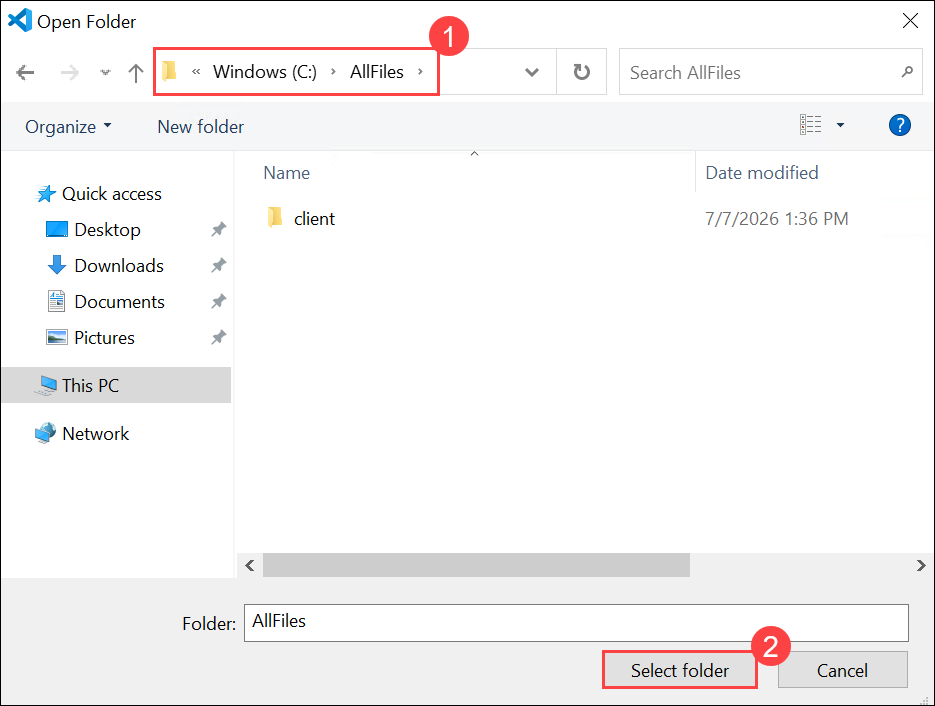

1. If you see the prompt, **Do you trust the authors of the files in this folder?**, click **Yes, I trust the authors**.

   

1. The project contains deployment scripts for both Bash (_azdeploy.sh_) and PowerShell (_azdeploy.ps1_). Open the appropriate file for your environment and change the two values: **Resource group name** as **<inject key="ResourceGroupName" enableCopy="false"/>** and **Azure Region** as **<inject key="Region" enableCopy="false"/>** at the top of the script to meet your needs.

   ```
   "<your-resource-group-name>" # Resource Group name
   "<your-azure-region>" # Azure region for the resources
   ```

   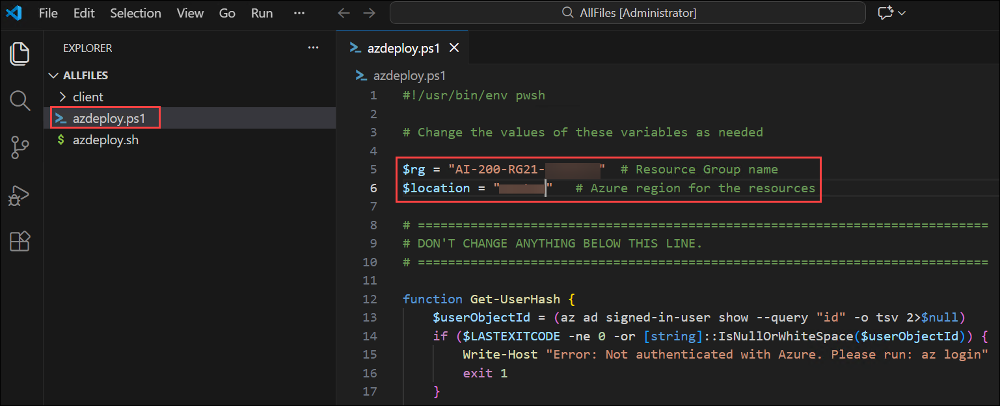

   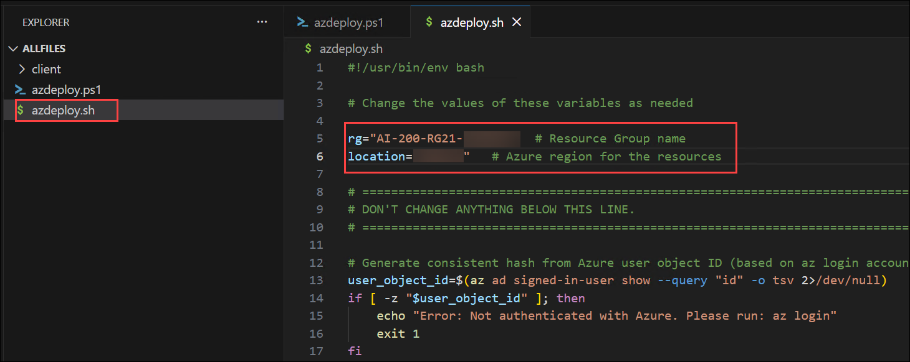

1. In the menu bar, select **File (1)** and select **Save All (2)** from drop-down.

   

1. In the menu bar, select **ellipsis (...) (1)**, then **Terminal (2)**, and then **New Terminal (3)** to open a terminal window in VS Code.

   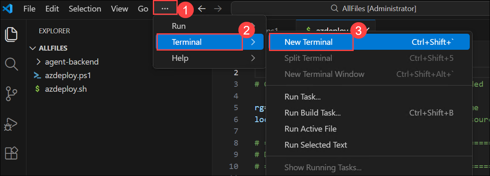

   > **NOTE:** If you are using Bash, after the terminal opens, click on the **+ (1)** icon to open a new terminal and select **Git Bash (2)** from the drop-down. If you are using PowerShell, skip this step.
   
   

1. Run the following command in the terminal to allow PowerShell scripts to run. This command is only required if you are using PowerShell. If you are using Bash, skip this step.

   ```
   Set-ExecutionPolicy -ExecutionPolicy bypass -Force
   ```

   

1. Run the **following command (1)** to login to your Azure account. Next, **minimize the VS Code window (2)** to view the login window opened in background.

   ```
   az login
   ```

   

1. In the login window, select **Work or school account (1)** and click **Continue (2)**.

   

1. In the login window, kindly sign in using the provided **Azure credentials (1)** and click **Next (2)**.
   - **Email/Username:** <inject key="AzureAdUserEmail"></inject>

     

1. Next, enter the provided **Password (1)** and click **Sign in (2)**.
   - **Password:** <inject key="AzureAdUserPassword"></inject>

     

1. Next, select **No, this app only** and navigate back to VS Code to continue.

   

1. Answer the prompts to select your Azure account and subscription for the exercise.

   

   > **NOTE:** To confirm you're logged in to the correct Azure subscription, run **az account show**.

1. Run the appropriate command in the terminal to launch the script.

    **Bash**
    ```bash
    MSYS_NO_PATHCONV=1 bash azdeploy.sh
    ```

    **PowerShell**
    ```powershell
    ./azdeploy.ps1
    ```

    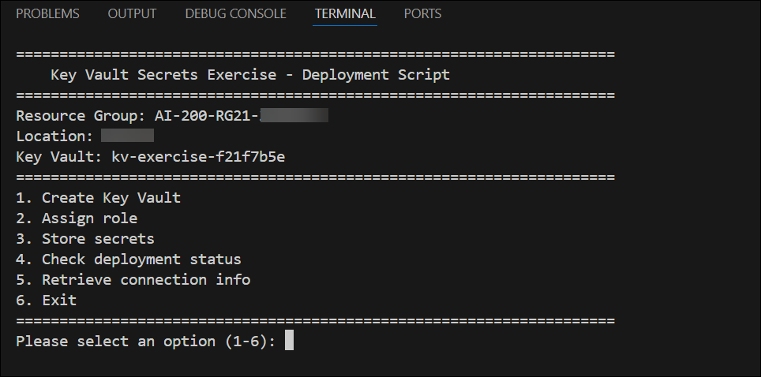

1. When the script is running, enter **1** to launch the **1. Create Key Vault** option.

    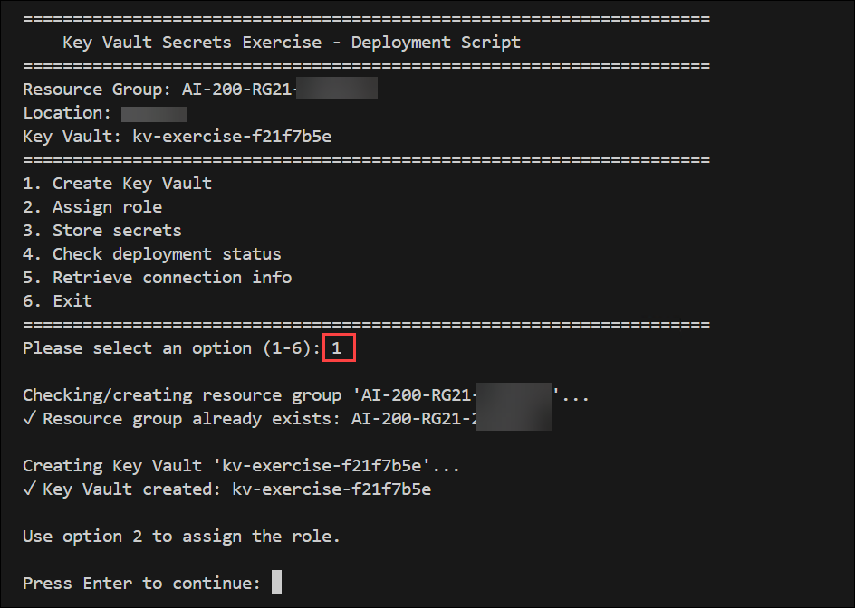

    This option creates the resource group if it doesn't already exist, and deploys an Azure Key Vault with RBAC authorization enabled. RBAC authorization is the recommended model for controlling access to vault secrets instead of legacy access policies.

1. Enter **2** to run the **2. Assign role** option. This assigns the Key Vault Secrets Officer role to your account so you can read, create, update, and delete secrets using Microsoft Entra authentication.

    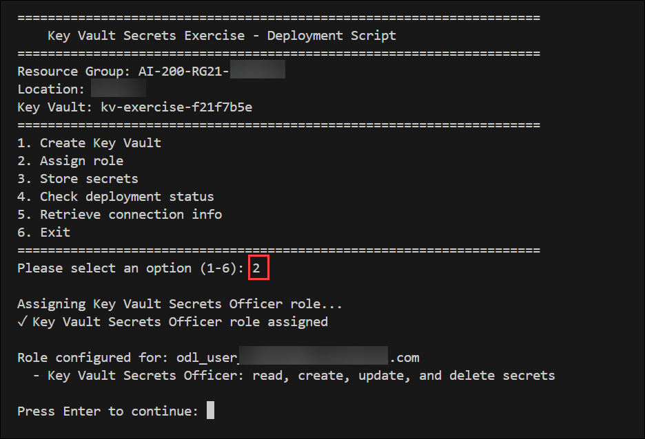

1. Enter **3** to run the **3. Store secrets** option. This stores two sample secrets in the vault: an API key for a model endpoint (**openai-api-key**) and a database connection string (**cosmosdb-connection-string**). Both are tagged with metadata for environment and service identification.

    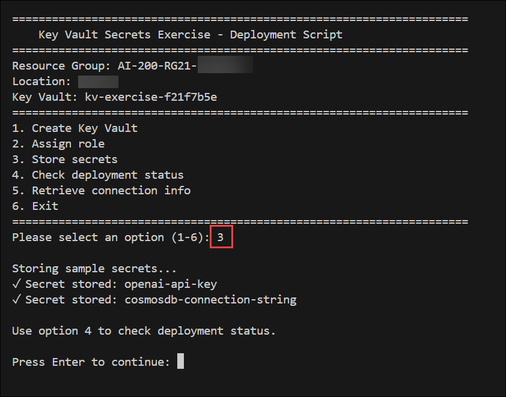

1. Enter **4** to run the **4. Check deployment status** option. Verify the vault status shows **Succeeded**, the role is assigned, and the secrets are stored before continuing. If the vault is still provisioning, wait a moment and try again.

    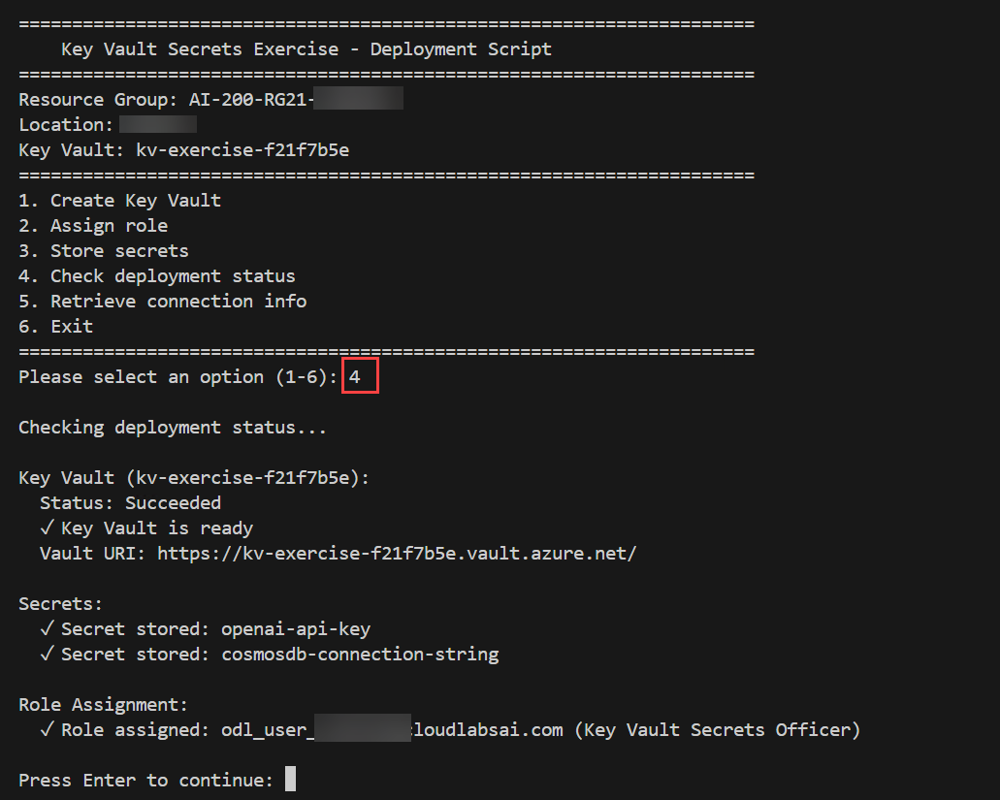

1. Enter **5** to run the **5. Retrieve connection info** option. This creates the environment variable file with the Key Vault URL needed by the app.

    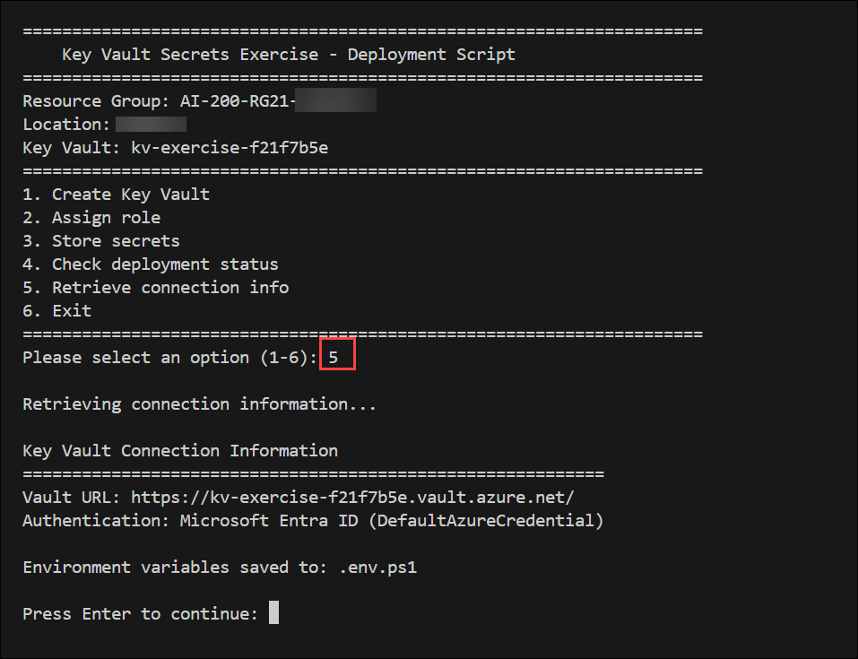

1. Enter **6** to exit the deployment script.

1. Run the appropriate command to load the environment variables into your terminal session from the file created in a previous step.

    **Bash**
    ```bash
    source .env
    ```

    **PowerShell**
    ```powershell
    . .\.env.ps1
    ```

    >**Note:** Keep the terminal open. If you close it and create a new terminal, you need to run this command again to reload the environment variables.

> **Congratulations** on completing the task! Now, it's time to validate it. Here are the steps:
>
> - If you receive a success message, you can proceed to the next task.
> - If not, carefully read the error message and retry the step, following the instructions in the lab guide.
> - If you need any assistance, please contact us at cloudlabs-support@spektrasystems.com. We are available 24/7 to help you out.

<validation step="58767369-d36d-4e7b-bb6f-9532b5977c8a" />

## Task 2: Complete the app

<<<<<<< Updated upstream
In this task, you'll implement the Python code to retrieve and manage Azure Key Vault secrets, create new secret versions, and add a caching mechanism to optimize secret retrieval.
=======
In this task you add code to the *keyvault_functions.py* file to complete the Key Vault secret management functions. The Flask app in *app.py* calls these functions and displays the results in the browser. You run the app later in the exercise.
>>>>>>> Stashed changes

1. Open the **client/keyvault_functions.py** file to begin adding code.

    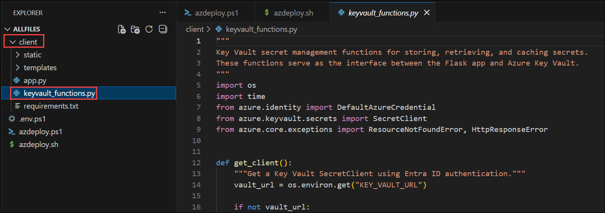

>**Note:** The code blocks you add to the application should align with the comment for that section of the code.

### Task 2.1: Add code to retrieve secrets

<<<<<<< Updated upstream
In this task, you will add code to retrieve two secrets from the vault and return their metadata. The function demonstrates how to access secret values, version identifiers, content types, creation dates, and custom tags.
=======
In this task, you add code to retrieve two secrets from the vault and return their metadata. The function demonstrates how to access secret values, version identifiers, content types, creation dates, and custom tags.
>>>>>>> Stashed changes

The function calls **get_secret()** for each secret name, which returns both the secret value and a properties object containing metadata. It handles **ResourceNotFoundError** for missing secrets and **HttpResponseError** for authorization or network issues. The truncated value prevents full credentials from appearing in the UI while still confirming the secret was retrieved.

1. Locate the **# BEGIN RETRIEVE SECRETS FUNCTION** comment and add the following code under the comment. Be sure to check for proper code alignment.

    ```python
    def retrieve_secrets():
        """Retrieve secrets and display their metadata."""
        client = get_client()
        results = []

        secret_names = ["openai-api-key", "cosmosdb-connection-string"]

        for name in secret_names:
            try:
                # get_secret returns the secret value and its properties,
                # including version, content type, creation date, and tags
                secret = client.get_secret(name)
                results.append({
                    "name": secret.name,
                    "value": secret.value[:20] + "..." if len(secret.value) > 20 else secret.value,
                    "version": secret.properties.version,
                    "content_type": secret.properties.content_type,
                    "created_on": str(secret.properties.created_on),
                    "tags": secret.properties.tags or {},
                    "status": "retrieved"
                })
            except ResourceNotFoundError:
                results.append({
                    "name": name,
                    "value": None,
                    "version": None,
                    "content_type": None,
                    "created_on": None,
                    "tags": {},
                    "status": "not found"
                })
            except HttpResponseError as e:
                results.append({
                    "name": name,
                    "value": None,
                    "version": None,
                    "content_type": None,
                    "created_on": None,
                    "tags": {},
                    "status": f"error: {e.message}"
                })

        return results
    ```

    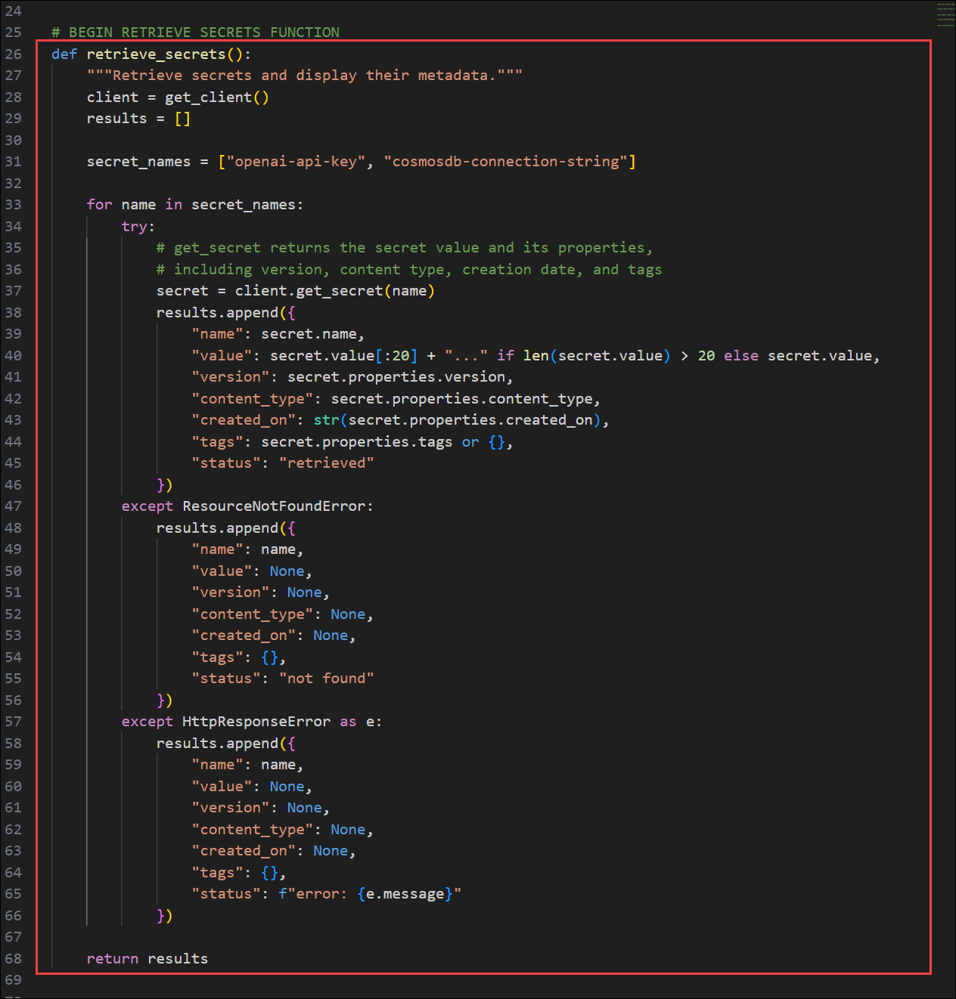

1. Take a few minutes to review the code.

### Task 2.2: Add code to list secret properties

<<<<<<< Updated upstream
In this task, you will add code to list the properties of all secrets in the vault without retrieving their values. This follows the principle of least privilege by exposing only metadata such as name, enabled status, content type, and timestamps.
=======
In this task, you add code to list the properties of all secrets in the vault without retrieving their values. This follows the principle of least privilege by exposing only metadata such as name, enabled status, content type, and timestamps.
>>>>>>> Stashed changes

The function calls **list_properties_of_secrets()**, which returns an iterable of secret property objects. Unlike **get_secret()**, this method does not return secret values, making it safe for inventory and audit operations where you need to know what secrets exist without accessing their contents.

1. Locate the **# BEGIN LIST SECRETS FUNCTION** comment and add the following code under the comment. Be sure to check for proper code alignment.

    ```python
    def list_secret_properties():
        """List all secret properties without retrieving values."""
        client = get_client()
        results = []

        # list_properties_of_secrets returns metadata for every secret
        # in the vault without exposing the secret values, which follows
        # the principle of least privilege
        for prop in client.list_properties_of_secrets():
            results.append({
                "name": prop.name,
                "enabled": prop.enabled,
                "content_type": prop.content_type,
                "created_on": str(prop.created_on),
                "updated_on": str(prop.updated_on)
            })

        return results
    ```

    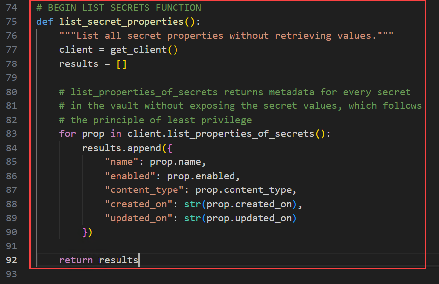

1. Save your changes and take a few minutes to review the code.

### Task 2.3: Add code to create a new secret version

<<<<<<< Updated upstream
In this task, you will add code to create a new version of a secret, simulating a credential rotation. The function retrieves the current version, writes a new value with **set_secret()**, and then confirms the update by retrieving the secret again.
=======
In this task, you add code to create a new version of a secret, simulating a credential rotation. The function retrieves the current version, writes a new value with **set_secret()**, and then confirms the update by retrieving the secret again.
>>>>>>> Stashed changes

The function uses **set_secret()** to write a new value for an existing secret name, which automatically creates a new version while preserving the previous one. Previous versions remain accessible by their version ID, but **get_secret()** without a version parameter always returns the latest. The function also attaches updated tags to the new version for tracking rotation metadata.

1. Locate the **# BEGIN CREATE SECRET VERSION FUNCTION** comment and add the following code under the comment. Be sure to check for proper code alignment.

    ```python
    def create_secret_version(secret_name, new_value):
        """Create a new version of a secret and verify the update."""
        client = get_client()

        # Retrieve the current version before updating
        try:
            current = client.get_secret(secret_name)
            old_version = current.properties.version
            old_value = current.value[:20] + "..." if len(current.value) > 20 else current.value
        except ResourceNotFoundError:
            old_version = None
            old_value = None

        # set_secret creates a new version of the secret. The previous
        # version is preserved and can still be retrieved by version ID.
        client.set_secret(
            secret_name,
            new_value,
            content_type="text/plain",
            tags={"environment": "development", "rotated": "true"}
        )

        # Confirm the update by retrieving the secret again —
        # get_secret always returns the latest version
        confirmed = client.get_secret(secret_name)

        return {
            "name": secret_name,
            "old_version": old_version,
            "old_value": old_value,
            "new_version": confirmed.properties.version,
            "new_value": confirmed.value[:20] + "..." if len(confirmed.value) > 20 else confirmed.value,
            "created_on": str(confirmed.properties.created_on),
            "tags": confirmed.properties.tags or {}
        }
    ```

    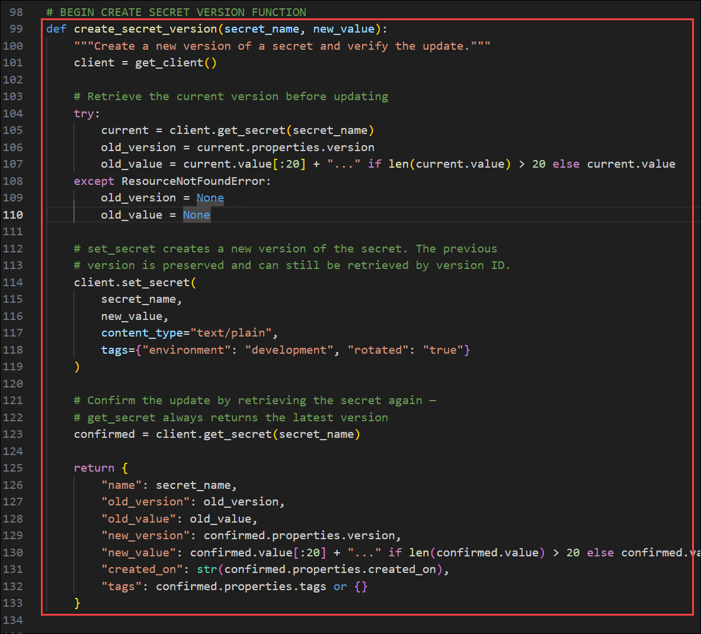

1. Save your changes and take a few minutes to review the code.

### Task 2.4: Add code for cached secret retrieval

<<<<<<< Updated upstream
In this task, you will add code that implements a time-based cache to reduce the number of Key Vault API calls when secrets are accessed frequently. The cache stores secret values in memory with a configurable time-to-live (TTL) and tracks cache hits and misses.
=======
In this task, you add code that implements a time-based cache to reduce the number of Key Vault API calls when secrets are accessed frequently. The cache stores secret values in memory with a configurable time-to-live (TTL) and tracks cache hits and misses.
>>>>>>> Stashed changes

The function creates a dictionary-based cache with a 30-second TTL using **time.monotonic()** for elapsed time tracking. It simulates five rounds of accessing two secrets. The first round produces cache misses because the cache starts empty and has no entries to return, so the code fetches each secret from Key Vault and stores it. Subsequent rounds within the TTL find the cached entries and return them without making API calls. The access log shows each hit or miss, and the summary reports total API calls versus total accesses to demonstrate the efficiency gain.

1. Locate the **# BEGIN CACHED RETRIEVAL FUNCTION** comment and add the following code under the comment. Be sure to check for proper code alignment.

    ```python
    def cached_retrieval():
        """Demonstrate time-based caching to reduce Key Vault API calls."""
        client = get_client()
        cache = {}
        cache_ttl = 30
        vault_calls = 0
        access_log = []

        secret_names = ["openai-api-key", "cosmosdb-connection-string"]

        # Simulate five rounds of secret access. The first round fetches
        # from Key Vault (cache miss), and subsequent rounds return the
        # cached value if the TTL has not expired.
        for i in range(5):
            for name in secret_names:
                cached = cache.get(name)
                now = time.monotonic()

                if cached and (now - cached["timestamp"]) < cache_ttl:
                    access_log.append({
                        "round": i + 1,
                        "secret": name,
                        "result": "cache hit",
                        "value": cached["value"]
                    })
                else:
                    secret = client.get_secret(name)
                    vault_calls += 1
                    truncated = secret.value[:20] + "..." if len(secret.value) > 20 else secret.value
                    cache[name] = {
                        "value": truncated,
                        "timestamp": now
                    }
                    access_log.append({
                        "round": i + 1,
                        "secret": name,
                        "result": "cache miss",
                        "value": truncated
                    })

        return {
            "access_log": access_log,
            "vault_calls": vault_calls,
            "total_accesses": len(access_log),
            "cache_ttl_seconds": cache_ttl
        }
    ```

    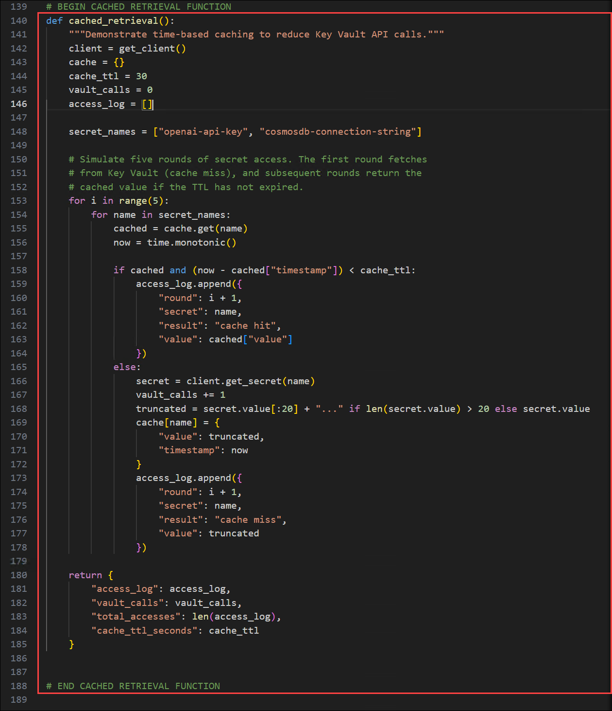

1. Save your changes and take a few minutes to review the code.

## Task 3: Configure the Python environment

<<<<<<< Updated upstream
In this task, you will navigate to the client app directory, create the Python environment, and install the dependencies.
=======
In this task, you navigate to the client app directory, create the Python environment, and install the dependencies.
>>>>>>> Stashed changes

1. Run the following command in the VS Code terminal to navigate to the *client* directory.

    ```
    cd client
    ```

1. Run the following command to create the Python environment.

    ```
    python -m venv .venv
    ```

1. Run the following command to activate the Python environment.

    **Bash**
    ```bash
    source .venv/Scripts/activate
    ```

    **PowerShell**
    ```powershell
    .\.venv\Scripts\Activate.ps1
    ```

    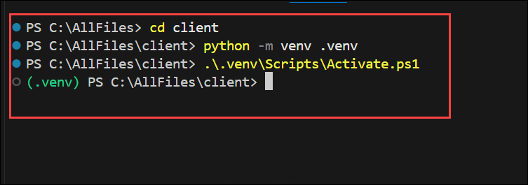

    > **Note:** On Linux/macOS, use the Bash command, use **source .venv/bin/activate**.

1. Run the following command in the VS Code terminal to install the dependencies.

    ```
    pip install -r requirements.txt
    ```

## Task 4: Run the app

<<<<<<< Updated upstream
In this task, you'll run the Flask application and verify secret retrieval, secret versioning, metadata listing, and cached access through the web interface.
=======
In this task, you run the completed Flask application to perform various Key Vault secret management operations. The app provides a web interface that lets you retrieve secrets, list their properties, create new versions, and test cached retrieval.
>>>>>>> Stashed changes

1. Run the following command in the terminal to start the app. Refer to the commands from earlier in the exercise to activate the environment, if needed, before running the command. If you navigated away from the *client* directory, run **cd client** first.

    ```
    python app.py
    ```

    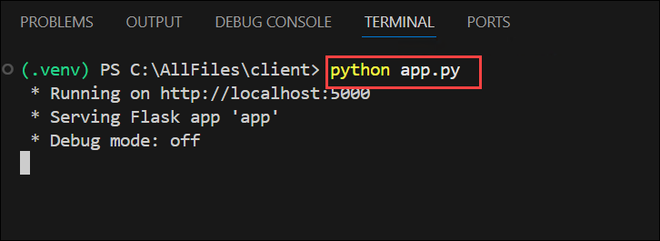

1. Open a browser and navigate to `http://localhost:5000` to access the app.

    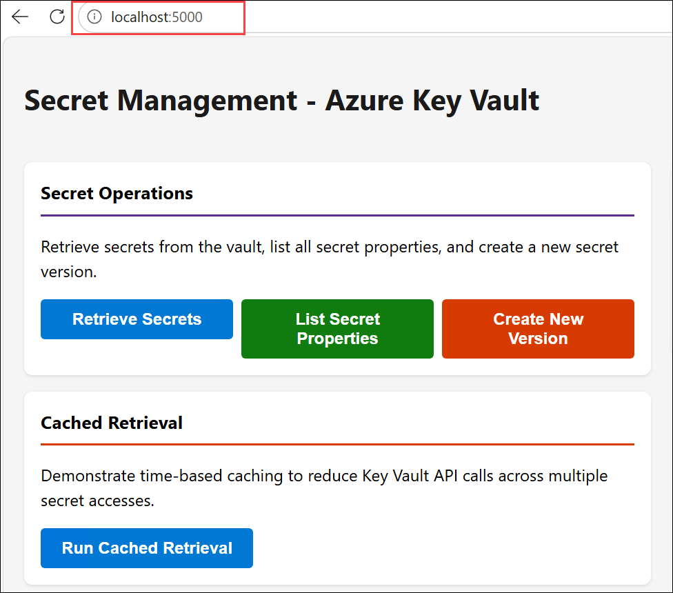

1. Select **Retrieve Secrets (1)** in the left panel. This retrieves the two secrets stored in the vault and displays their metadata in the right panel, including the secret name, a truncated value, version identifier, content type, creation date, and any custom tags. Both secrets should show a status of **retrieved (2)**.

     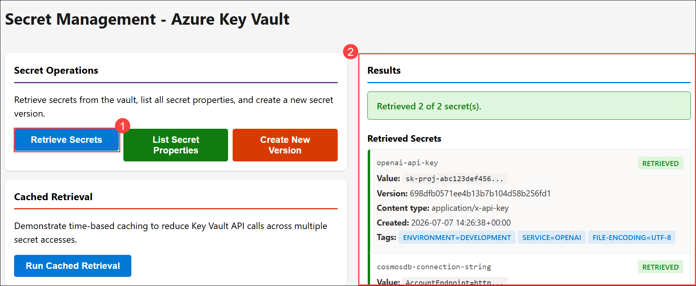

1. Select **List Secret Properties (1)**. This lists the properties of all secrets in the vault without exposing their values. The results show each secret's name, enabled status, content type, creation date, and last updated date **(2)**. This operation is useful for inventory and audit scenarios.

    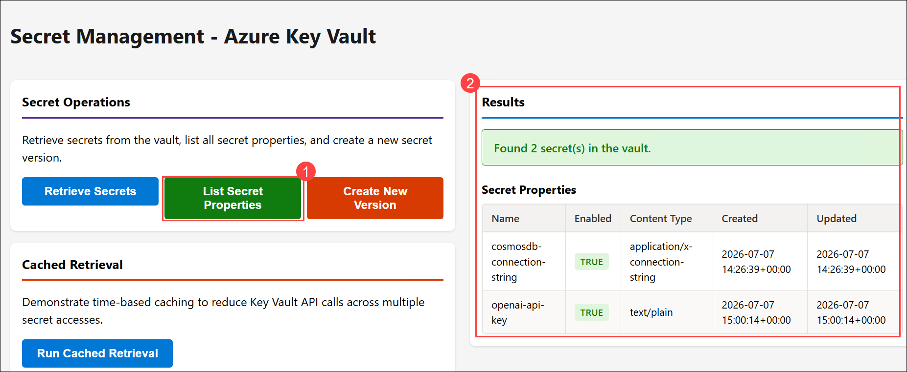

1. Select **Create New Version (1)**. This creates a new version of the **openai-api-key** secret with a randomly generated value, simulating a credential rotation. The results show the previous version and value alongside the new version and value, confirming that **set_secret()** creates a new version while preserving the old one **(2)**.

    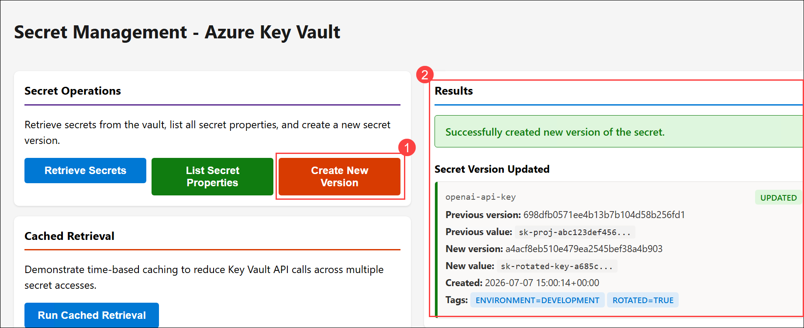

1. Select **Retrieve Secrets** in the left panel to verify the secret was updated.

    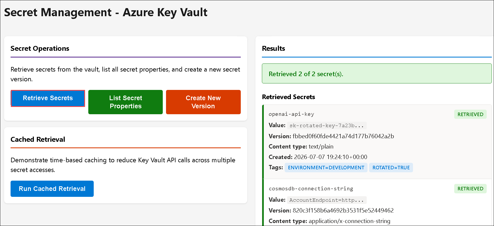

1. Select **Run Cached Retrieval**. This simulates five rounds of accessing both secrets with a 30-second TTL cache. The first round shows two cache misses (one per secret) as the values are fetched from Key Vault. The remaining rounds show cache hits because the TTL has not expired. The summary confirms that only 2 Key Vault API calls were made for 10 total accesses.

    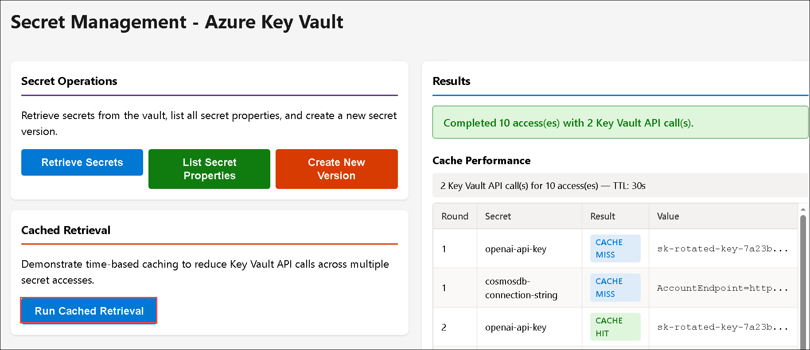

## Summary

<<<<<<< Updated upstream
In this lab, you deployed an Azure Key Vault and built a Python Flask application to demonstrate secure secret management using the Azure SDK. You implemented secret retrieval, metadata inspection, secret versioning, and time-based caching to optimize access. Finally, you configured the Python environment, ran the application, and validated each operation through the web interface.
=======
In this lab, you deployed an Azure Key Vault with RBAC authorization, stored sample secrets, and built a Python Flask application that manages secrets securely using the Azure SDK. You retrieved secret values and metadata, listed secret properties without exposing values, rotated a secret by creating a new version, and implemented a time-based cache to reduce repeated Key Vault API calls.
>>>>>>> Stashed changes

## You have successfully completed the Hands-on Lab!