# Lab 22: Retrieve settings and secrets from Azure App Configuration

### Estimated Duration : 60 Minutes

## Lab Overview 

In this hands-on lab, you deploy an Azure App Configuration store and Key Vault pre-loaded with sample settings and build a Python Flask web application that demonstrates core configuration management patterns using the Azure SDK. You load settings with label stacking and automatic Key Vault reference resolution, list all setting properties and metadata, and trigger a sentinel-based refresh to pick up changes dynamically.

## Lab Overview

In this lab, you'll perform the following tasks:

- **Task 1:** Prepare the environment

- **Task 2:** Complete the app

- **Task 3:** Configure the Python environment

- **Task 4:** Run the app

## Task 1: Prepare the environment

<<<<<<< Updated upstream
In this task, you'll prepare the development environment, deploy Azure App Configuration and Azure Key Vault, assign the required roles, store sample settings and secrets, and configure the application environment.
=======
In this task you download the starter files for the app and use a script to deploy an Azure App Configuration store and Key Vault with sample settings to your subscription.
>>>>>>> Stashed changes

1. Launch **Visual Studio Code** (VS Code) from desktop.

   

1. Select **File Explorer (1)**, then **Open Folder (2)** from the menu.

   

1. Navigate to **C:\AllFiles (1)** and click **Select Folder (2)**.

   

1. If you see the prompt, **Do you trust the authors of the files in this folder?**, click **Yes, I trust the authors**.

   

1. The project contains deployment scripts for both Bash (_azdeploy.sh_) and PowerShell (_azdeploy.ps1_). Open the appropriate file for your environment and change the two values: **Resource group name** as **<inject key="ResourceGroupName" enableCopy="false"/>** and **Azure Region** as **<inject key="Region" enableCopy="false"/>** at the top of the script to meet your needs.

   ```
   "<your-resource-group-name>" # Resource Group name
   "<your-azure-region>" # Azure region for the resources
   ```

   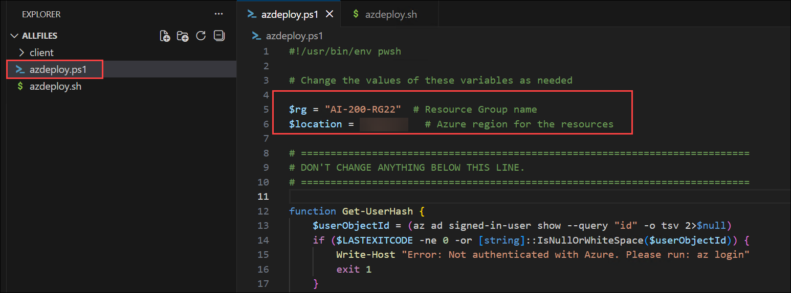

   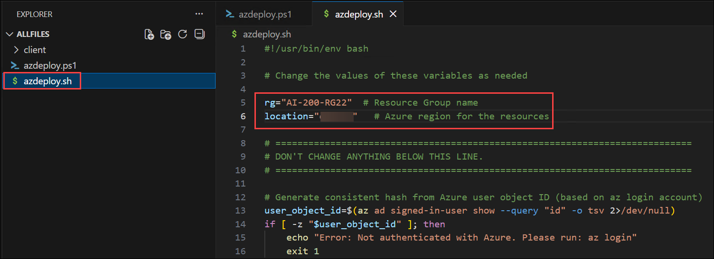

1. In the menu bar, select **File (1)** and select **Save All (2)** from drop-down.

   

1. In the menu bar, select **ellipsis (...) (1)**, then **Terminal (2)**, and then **New Terminal (3)** to open a terminal window in VS Code.

   

   > **NOTE:** If you are using Bash, after the terminal opens, click on the **+ (1)** icon to open a new terminal and select **Git Bash (2)** from the drop-down. If you are using PowerShell, skip this step.
   
   

1. Run the following command in the terminal to allow PowerShell scripts to run. This command is only required if you are using PowerShell. If you are using Bash, skip this step.

   ```
   Set-ExecutionPolicy -ExecutionPolicy bypass -Force
   ```

   

1. Run the **following command (1)** to login to your Azure account. Next, **minimize the VS Code window (2)** to view the login window opened in background.

   ```
   az login
   ```

   

1. In the login window, select **Work or school account (1)** and click **Continue (2)**.

   

1. In the login window, kindly sign in using the provided **Azure credentials (1)** and click **Next (2)**.
   - **Email/Username:** <inject key="AzureAdUserEmail"></inject>

     

1. Next, enter the provided **Password (1)** and click **Sign in (2)**.
   - **Password:** <inject key="AzureAdUserPassword"></inject>

     

1. Next, select **No, this app only** and navigate back to VS Code to continue.

   

1. Answer the prompts to select your Azure account and subscription for the exercise.

   

   > **NOTE:** To confirm you're logged in to the correct Azure subscription, run **az account show**.

1. Run the appropriate command in the terminal to launch the script.

    **Bash**
    ```bash
    MSYS_NO_PATHCONV=1 bash azdeploy.sh
    ```

    **PowerShell**
    ```powershell
    ./azdeploy.ps1
    ```

    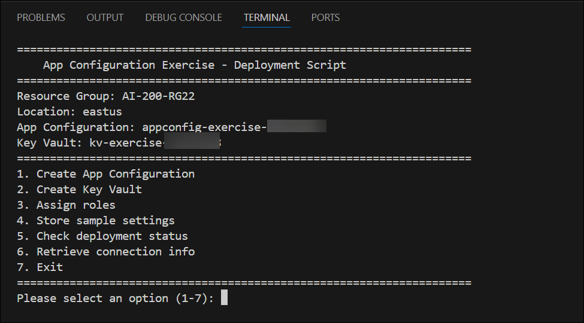

1. When the script is running, enter **1** to launch the **1. Create App Configuration** option.

    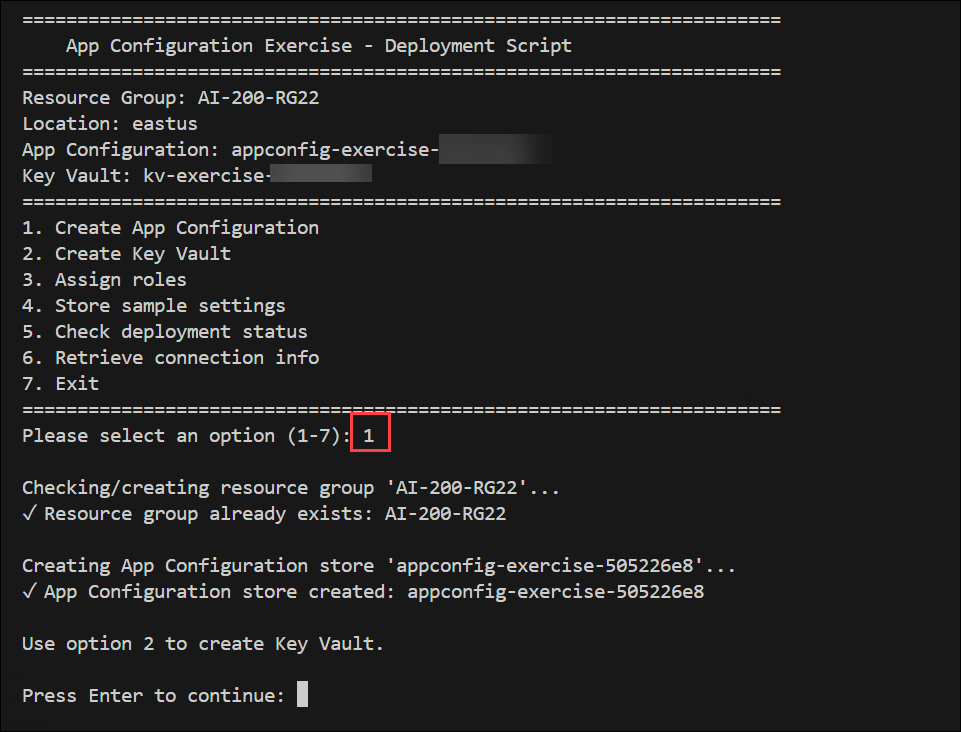

    This option creates the resource group if it doesn't already exist and deploys an Azure App Configuration store. App Configuration provides a centralized service for managing application settings separately from code.

1. Enter **2** to run the **2. Create Key Vault** option. This creates an Azure Key Vault with RBAC authorization enabled. The Key Vault stores sensitive values such as API keys that App Configuration references securely.

     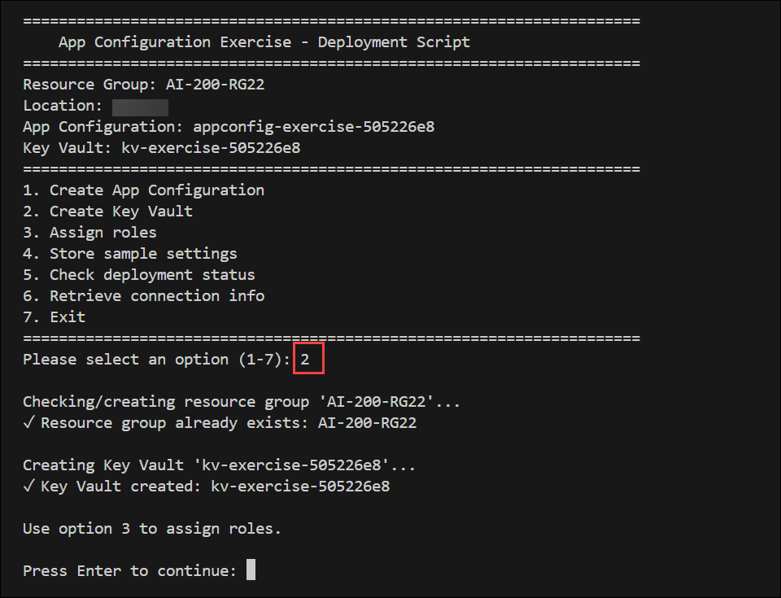

1. Enter **3** to run the **3. Assign roles** option. This assigns the App Configuration Data Owner role and the Key Vault Secrets Officer role to your account so you can read, create, and update settings and secrets using Microsoft Entra authentication.

    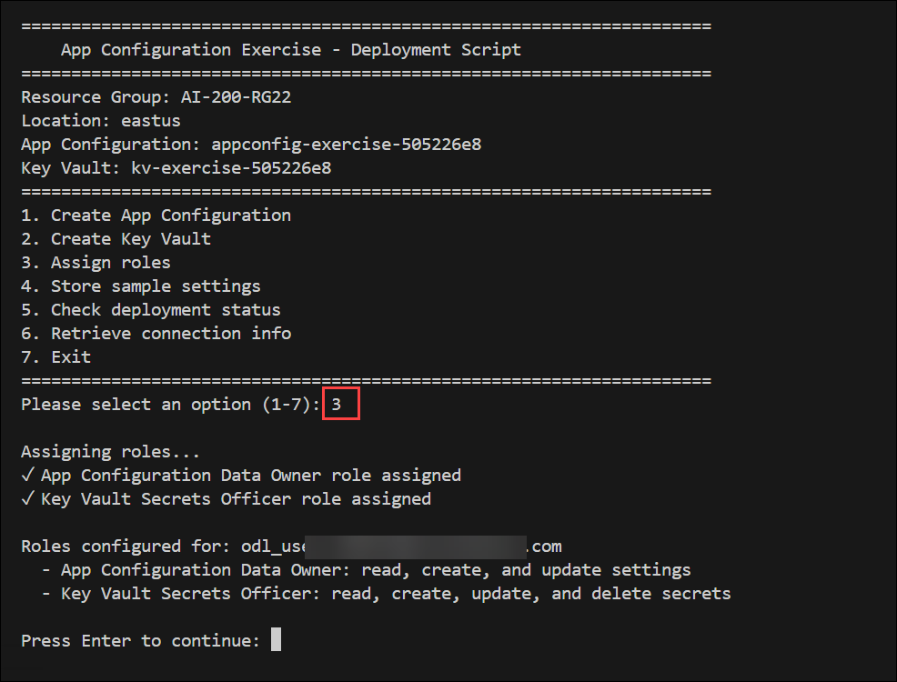

1. Enter **4** to run the **4. Store settings** option. This stores configuration settings in the App Configuration store including default (unlabeled) values and Production-labeled overrides for environment-specific settings. It also stores a secret in Key Vault and creates a Key Vault reference in App Configuration that points to the secret. Finally, it creates a sentinel key used for dynamic refresh.

    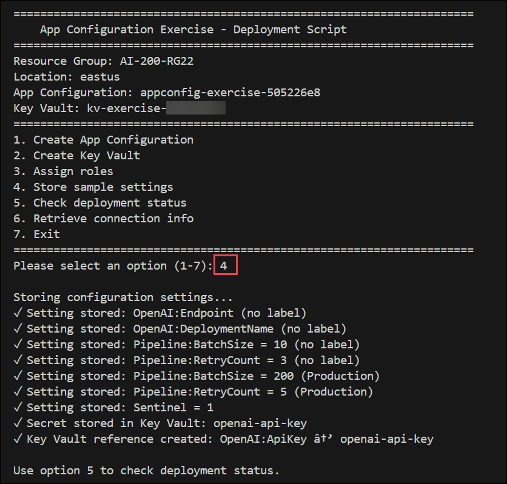

1. Enter **5** to run the **5. Check deployment status** option. Verify the App Configuration store and Key Vault both show **Succeeded**, the roles are assigned, and the settings are stored before continuing. If resources are still provisioning, wait a moment and try again.

    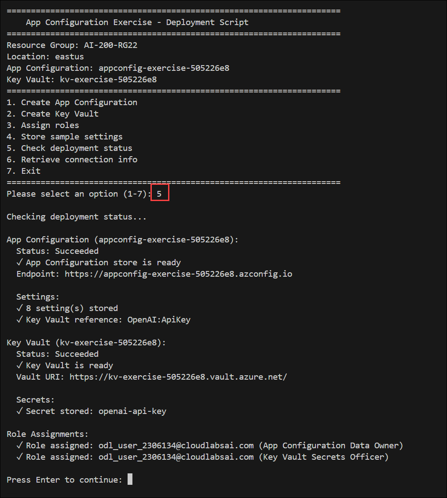

1. Enter **6** to run the **6. Retrieve connection info** option. This creates the environment variable file with the App Configuration endpoint URL needed by the app.

    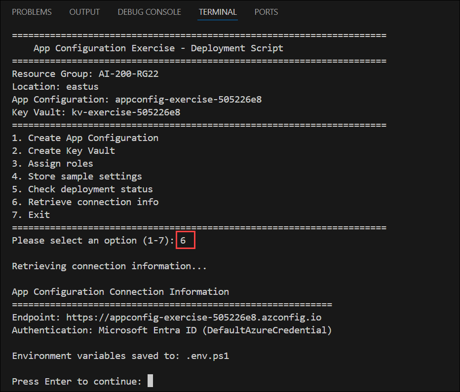

1. Enter **7** to exit the deployment script.

1. Run the appropriate command to load the environment variables into your terminal session from the file created in a previous step.

    **Bash**
    ```bash
    source .env
    ```

    **PowerShell**
    ```powershell
    . .\.env.ps1
    ```

    >**Note:** Keep the terminal open. If you close it and create a new terminal, you need to run this command again to reload the environment variables.

<<<<<<< Updated upstream
> **Congratulations** on completing the task! Now, it's time to validate it. Here are the steps:
>
> - If you receive a success message, you can proceed to the next task.
> - If not, carefully read the error message and retry the step, following the instructions in the lab guide.
> - If you need any assistance, please contact us at cloudlabs-support@spektrasystems.com. We are available 24/7 to help you out.

<validation step="641e5038-efa1-4fc2-b10c-add8651c62f4" />

## Task 2: Complete the app

In this task, you'll implement the Python application to load configuration settings, list setting properties, and perform sentinel-based dynamic configuration refresh using the Azure App Configuration SDK.
=======
## Task 2: Complete the app

In this task you add code to the *appconfig_functions.py* file to complete the App Configuration management functions. The Flask app in *app.py* calls these functions and displays the results in the browser. You run the app later in the exercise.
>>>>>>> Stashed changes

1. Open the *client/appconfig_functions.py* file to begin adding code.

    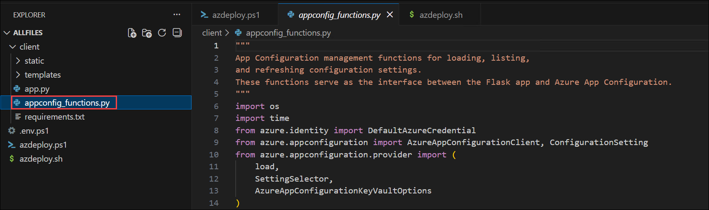

    >**Note:** The code blocks you add to the application should align with the comment for that section of the code.

### Task 2.1: Add code to load settings

<<<<<<< Updated upstream
In this task, you will add code to load all configuration settings from the App Configuration store with label stacking and automatic Key Vault reference resolution. The function creates a provider that merges unlabeled default values with Production-labeled overrides and resolves Key Vault references transparently.
=======
In this task, you add code to load all configuration settings from the App Configuration store with label stacking and automatic Key Vault reference resolution. The function creates a provider that merges unlabeled default values with Production-labeled overrides and resolves Key Vault references transparently.
>>>>>>> Stashed changes

The function calls **load()** with two **SettingSelector** entries: the first selects all unlabeled settings (using the null label filter **\0**), and the second selects all Production-labeled settings. Because the Production selector appears second, its values override the defaults for any matching keys. The **AzureAppConfigurationKeyVaultOptions** parameter tells the provider to resolve Key Vault references automatically using the same credential, so the application receives the actual secret value rather than a reference URI.

1. Locate the **# BEGIN LOAD SETTINGS FUNCTION** comment and add the following code under the comment. Be sure to check for proper code alignment.

    ```python
    def load_settings():
        """Load all settings with label stacking and Key Vault reference resolution."""
        provider = get_provider()
        results = []

        # The provider resolves Key Vault references automatically and
        # applies label stacking: Production-labeled values override
        # unlabeled defaults for matching keys
        known_keys = [
            "OpenAI:Endpoint",
            "OpenAI:DeploymentName",
            "OpenAI:ApiKey",
            "Pipeline:BatchSize",
            "Pipeline:RetryCount",
            "Sentinel"
        ]

        for key in known_keys:
            try:
                value = provider[key]
                is_secret = key == "OpenAI:ApiKey"
                display_value = value[:10] + "..." if is_secret and len(value) > 10 else value
                results.append({
                    "key": key,
                    "value": display_value,
                    "type": "Key Vault reference" if is_secret else "configuration",
                    "status": "loaded"
                })
            except KeyError:
                results.append({
                    "key": key,
                    "value": None,
                    "type": "unknown",
                    "status": "not found"
                })

        return results
    ```

     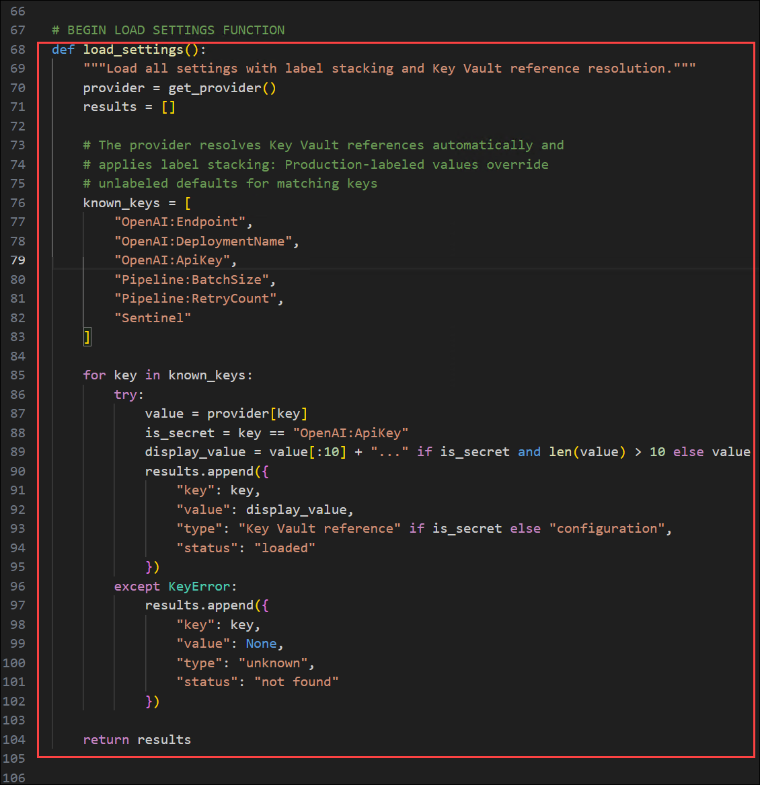

1. Take a few minutes to review the code.

### Task 2.2: Add code to list setting properties

<<<<<<< Updated upstream
In this task, you will add code to list the properties of all settings in the App Configuration store. Unlike the **load()** function which merges labels and resolves Key Vault references, this function shows the raw storage view with every individual setting entry, including all labels and content types.
=======
In this task, you add code to list the properties of all settings in the App Configuration store. Unlike the **load()** function which merges labels and resolves Key Vault references, this function shows the raw storage view with every individual setting entry, including all labels and content types.
>>>>>>> Stashed changes

The function calls **list_configuration_settings()** on the management client, which returns an iterable of setting objects with metadata such as key, label, content type, last modified timestamp, and read-only status. This is useful for inventory and audit operations where you need to see exactly what is stored, including the separate unlabeled and Production-labeled entries.

1. Locate the **# BEGIN LIST SETTINGS FUNCTION** comment and add the following code under the comment. Be sure to check for proper code alignment.

    ```python
    def list_setting_properties():
        """List all setting properties from the App Configuration store."""
        client = get_client()
        results = []

        # list_configuration_settings returns every setting in the store
        # including all labels, showing the raw storage view rather than
        # the merged view that load() provides
        for setting in client.list_configuration_settings():
            results.append({
                "key": setting.key,
                "label": setting.label or "(no label)",
                "content_type": setting.content_type or "—",
                "last_modified": str(setting.last_modified) if setting.last_modified else "—",
                "read_only": setting.read_only
            })

        return results
    ```

    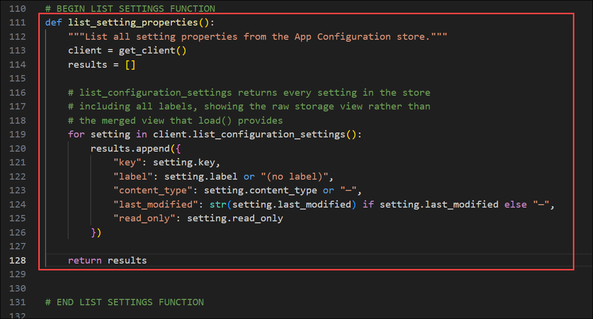

1. Save your changes and take a few minutes to review the code.

### Task 2.3: Add code for dynamic refresh

<<<<<<< Updated upstream
In this task, you will add code that demonstrates sentinel-based dynamic refresh. The function updates a setting and sets a new sentinel value, then calls **refresh()** on the provider to reload configuration without restarting the application.
=======
In this task, you add code that demonstrates sentinel-based dynamic refresh. The function updates a setting and sets a new sentinel value, then calls **refresh()** on the provider to reload configuration without restarting the application.
>>>>>>> Stashed changes

The function captures the current provider values, then uses the management client to update **Pipeline:BatchSize** with a new random value and set the **Sentinel** key to a new timestamp value. The sentinel acts as a change signal: the provider watches it, and when its value changes, a call to **refresh()** triggers a reload of all settings. The function waits briefly for the refresh interval to elapse, then calls **refresh()** and compares the before and after values to confirm the update propagated.

1. Locate the **# BEGIN REFRESH CONFIGURATION FUNCTION** comment and add the following code under the comment. Be sure to check for proper code alignment.

    ```python
    def refresh_configuration():
        """Demonstrate sentinel-based dynamic refresh of configuration settings."""
        provider = get_provider()
        client = get_client()

        # Capture current values before the change
        tracked_keys = ["Pipeline:BatchSize"]
        before = {}
        for key in tracked_keys:
            try:
                before[key] = provider[key]
            except KeyError:
                before[key] = "—"

        # Update Pipeline:BatchSize with a new value to simulate a
        # configuration change, then increment the Sentinel key to
        # signal the provider that settings have changed
        import random
        new_batch = str(random.randint(100, 999))

        setting = ConfigurationSetting(
            key="Pipeline:BatchSize",
            value=new_batch,
            label="Production",
            content_type="text/plain"
        )
        client.set_configuration_setting(setting)

        # Update the Sentinel to signal the provider that settings have changed.
        # Using a timestamp ensures the value is always different from whatever
        # the provider has cached, even if settings were reset externally.
        new_sentinel = str(int(time.time()))

        sentinel_setting = ConfigurationSetting(
            key="Sentinel",
            value=new_sentinel
        )
        client.set_configuration_setting(sentinel_setting)

        # Wait briefly for the refresh interval to elapse, then call
        # refresh() to reload settings from the store
        time.sleep(2)
        provider.refresh()

        # Capture values after the refresh
        after = {}
        for key in tracked_keys:
            try:
                after[key] = provider[key]
            except KeyError:
                after[key] = "—"

        settings = []
        for key in tracked_keys:
            settings.append({
                "key": key,
                "before": before[key],
                "after": after[key],
                "changed": before[key] != after[key]
            })

        return {
            "settings": settings,
            "sentinel_value": new_sentinel,
            "new_batch_size": new_batch,
            "batch_size_updated": after["Pipeline:BatchSize"] == new_batch
        }
    ```

    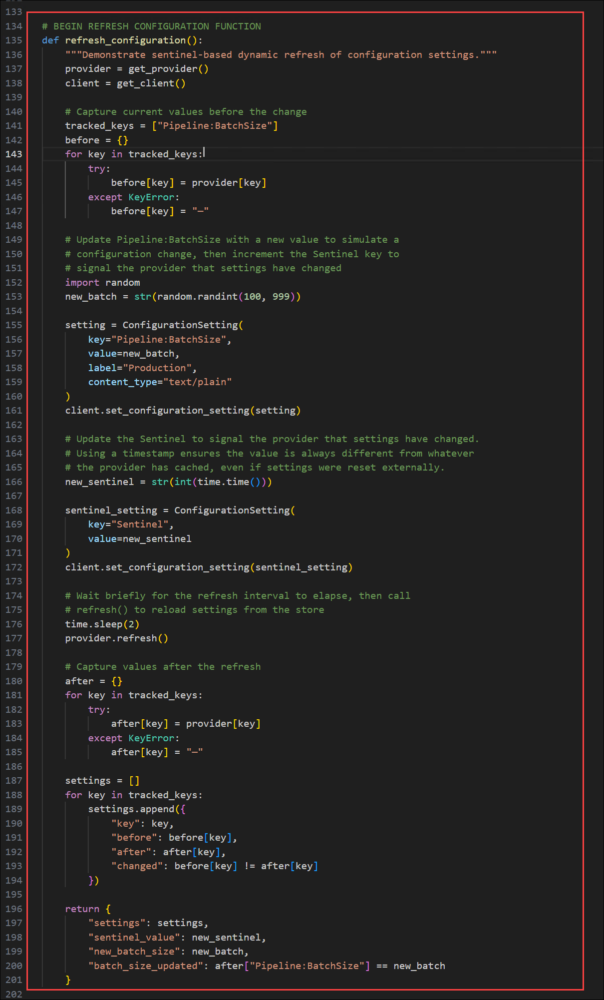

1. Save your changes and take a few minutes to review the code.

## Task 3: Configure the Python environment

<<<<<<< Updated upstream
In this task, you will navigate to the client app directory, create the Python environment, and install the dependencies.
=======
In this task, you navigate to the client app directory, create the Python environment, and install the dependencies.
>>>>>>> Stashed changes

1. Run the following command in the VS Code terminal to navigate to the *client* directory.

    ```
    cd client
    ```

1. Run the following command to create the Python environment.

    ```
    python -m venv .venv
    ```

1. Run the following command to activate the Python environment. 

    **Bash**
    ```bash
    source .venv/Scripts/activate
    ```

    **PowerShell**
    ```powershell
    .\.venv\Scripts\Activate.ps1
    ```

    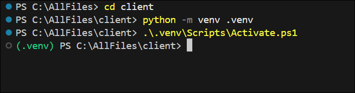

    > **Note:** On Linux/macOS, use the Bash command, use **source .venv/bin/activate**.

1. Run the following command in the VS Code terminal to install the dependencies.

    ```
    pip install -r requirements.txt
    ```

## Task 4: Run the app

<<<<<<< Updated upstream
In this task, you'll run the Flask application and validate configuration loading, metadata retrieval, and dynamic refresh through the web interface.
=======
In this task, you run the completed Flask application to perform various App Configuration management operations. The app provides a web interface that lets you load settings, list their properties, and test dynamic refresh.
>>>>>>> Stashed changes

1. Run the following command in the terminal to start the app. Refer to the commands from earlier in the exercise to activate the environment, if needed, before running the command. If you navigated away from the *client* directory, run **cd client** first.

    ```
    python app.py
    ```

    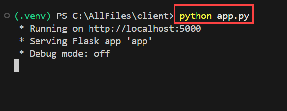

1. Open a browser and navigate to `http://localhost:5000` to access the app.

    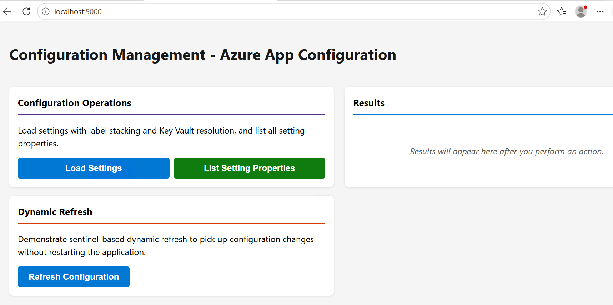

1. Select **Load Settings** in the left panel. This loads all configuration settings with label stacking and Key Vault reference resolution. The results show each setting's key, value, and type. Settings labeled as **configuration** are regular App Configuration values, while **Key Vault reference** indicates the value was resolved from a Key Vault secret.

    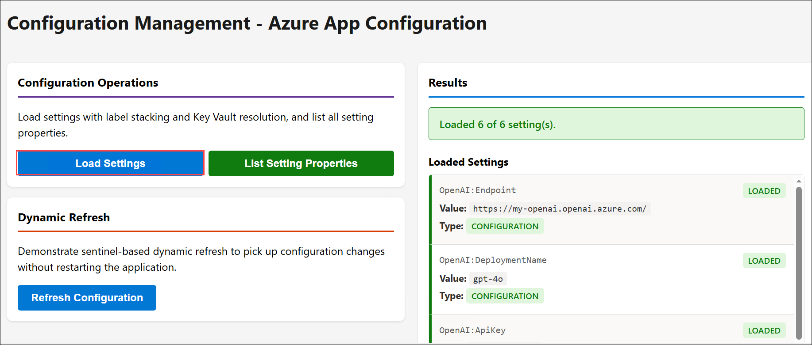

1. Select **List Setting Properties**. This lists every individual setting entry in the store, including both unlabeled defaults and Production-labeled overrides as separate rows. The results show each setting's key, label, content type, last modified timestamp, and read-only status. Notice that **Pipeline:BatchSize** appears twice: once with no label (value 10) and once with the **Production** label (value 200). The **Load Settings** results showed 200 because the Production-labeled override took precedence over the unlabeled default.

    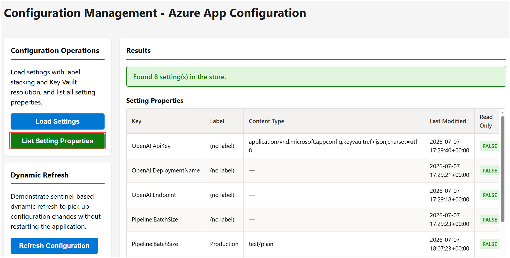

1. Select **Refresh Configuration**. This demonstrates sentinel-based dynamic refresh. The function updates **Pipeline:BatchSize** with a new random value, sets the **Sentinel** key to a new timestamp, waits briefly, and then calls **refresh()** on the provider. The results show the before and after values for tracked settings, confirming that the provider picked up the change without restarting the application.

    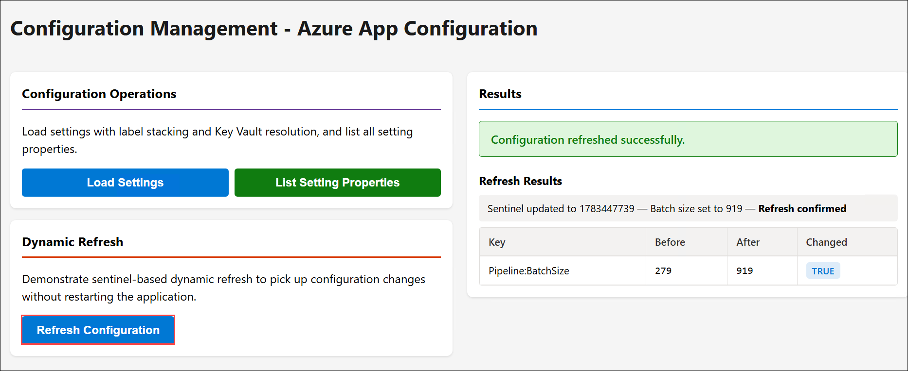

<<<<<<< Updated upstream
### Summary

In this lab, you deployed Azure App Configuration and Azure Key Vault and built a Python Flask application to demonstrate centralized configuration management. You loaded configuration settings with label stacking and automatic Key Vault reference resolution, listed setting metadata, and implemented sentinel-based dynamic refresh to apply configuration changes without restarting the application. Finally, you configured the Python environment, ran the application, and validated each configuration management operation through the web interface.
=======
## Summary

In this lab, you deployed **Azure App Configuration** and **Azure Key Vault**, built a **Python Flask** app to load settings with label stacking and resolve Key Vault references automatically. You also listed **App Configuration** setting metadata and demonstrated sentinel-based dynamic refresh so the application could pick up configuration changes without restarting.
>>>>>>> Stashed changes

## You have successfully completed the Hands-on Lab!
