# Lab 03: Deploy a containerized backend API to Azure Container Apps

### Estimated Duration : 60 Minutes

## Lab Overview

In this hands-on lab, you will deploy a containerized backend API to Azure Container Apps using secure identity-based authentication. You will create a system-assigned managed identity to securely pull images from a private Azure Container Registry, configure secrets for sensitive API keys as environment variables, and verify the deployment by testing the API endpoints and reviewing application logs.

## Lab Objective

In this lab, you'll perform the following tasks:

- **Task 1:** Deploy Azure Container Registry and Container App Environment
- **Task 2:** Deploy the container app and configure secrets
- **Task 3:** Verify the Deployment

> **Note:** This lab includes deployment scripts for both **PowerShell** and **Bash**. You can choose your preferred shell!
>
> Click on the drop-down arrow ▶ for the shell type you want to proceed with. Once you make your choice, use the corresponding commands throughout the entire lab.

## Task 1: Deploy Azure Container Registry and Container App Environment

In this task, you will run the deployment script to create an Azure Container Registry (ACR) and a Container Apps environment, which are the foundational services required for deploying your containerized API.

1. Launch **Visual Studio Code** (VS Code) from desktop.

   

1. Select **File Explorer (1)**, then **Open Folder (2)** from the menu.

   

1. Navigate to **C:\Allfiles (1)** and click **Select Folder (2)**.

   

1. If you see the prompt, **Do you trust the authors of the files in this folder?**, click **Yes, I trust the authors**.

   

1. Once the folder opens in VS Code, select **Explorer (1)** and then **azdeploy.ps1 (2)**.

   

1. Navigate to the Azure portal and search for **Resource groups (1)**. Then select **Resource groups (2)**.

   

1. Note the name of the **Resource group**.

   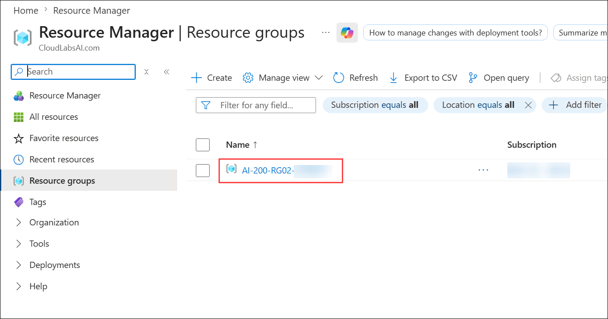

1. The project contains deployment scripts for both Bash (_azdeploy.sh_) and PowerShell (_azdeploy.ps1_). Open the appropriate file for your environment and change the two values: **Resource group name** as **<inject key="ResourceGroupName" enableCopy="false"/>** and **Azure Region** as **<inject key="Region" enableCopy="false"/>** at the top of the script to meet your needs.

   ```
   "<your-resource-group-name>" # Resource Group name
   "<your-azure-region>" # Azure region for the resources
   ```

   

   

   > **Note:** Do not change anything else in the script.

1. Press **Ctrl+S** to save the changes.

1. In the menu bar, select **ellipsis (...) (1)**, then **Terminal (2)**, and then **New Terminal (3)** to open a terminal window in VS Code.

   

   > **Note:** If you are using Bash, after the terminal opens, expand the downward arrow icon **(1)** to open a new terminal and select **Git Bash (2)** from the drop-down list. If you are using PowerShell, skip this step.
   >
   > 

1. Run the following command in the terminal to allow PowerShell scripts to run. This step is required only if you are using PowerShell. If you are using Bash, skip this step.

   <details>
     <summary>PowerShell</summary>

   ```powershell
   Set-ExecutionPolicy -ExecutionPolicy bypass -Force
   ```

   

   </details>

1. Run the command **az login (1)** to sign in to your Azure account. Then **minimize the VS Code window (2)** to view the login window that opens in the background.

   ```
   az login
   ```

   

1. A pop-up window will appear on the desktop. Select **Work and school account (1)** and then click **Continue (2)**.

   

1. In the login window, sign in by using the provided **Azure credentials (1)** and then click **Next (2)**.
   - **Email/Username:** <inject key="AzureAdUserEmail"></inject>

     

1. Enter the temporary access password and click **Sign in**.
   - **Password:** <inject key="AzureAdUserPassword"></inject>

     

1. When prompted with **Sign in to all apps and websites on this device?**, select **No, this app only**.

   

1. Return to the terminal.

1. Choose the subscription by entering **1**.

   

   > **NOTE:** To confirm you're logged in to the correct Azure subscription, run **az account show**.

1. Run the following command to ensure you have the **containerapp** extension for Azure CLI.

   ```azurecli
   az extension add --name containerapp
   ```

   

1. Make sure you are in the root directory of the project and run the appropriate command in the terminal to launch the deployment script. The deployment script will deploy ACR and create a file with environment variables needed.

   <details>
     <summary>Bash</summary>

   ```bash
   bash azdeploy.sh
   ```

   

   </details>

   <details>
     <summary>PowerShell</summary>

   ```powershell
   ./azdeploy.ps1
   ```

   

   </details>

1. When the script is running, enter **1** to launch the **Create Azure Container Registry and build container image** option. This option creates the ACR service and uses ACR Tasks to build and push the image to the registry.

   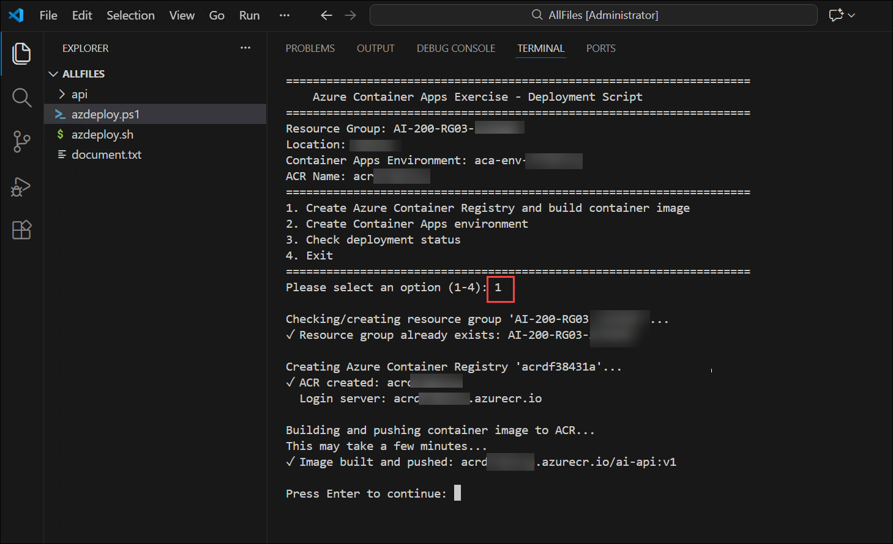

1. To verify that the deployment was successful, navigate to the Azure portal. In the search bar, type **Container registries (1)** and select **Container registries (2)** from the search results.

   

1. You should see one container registry created.

   

1. When the previous operation is finished, enter **2** to launch the **Create Container Apps environment** options. Creating the environment is necessary before deploying the container.

   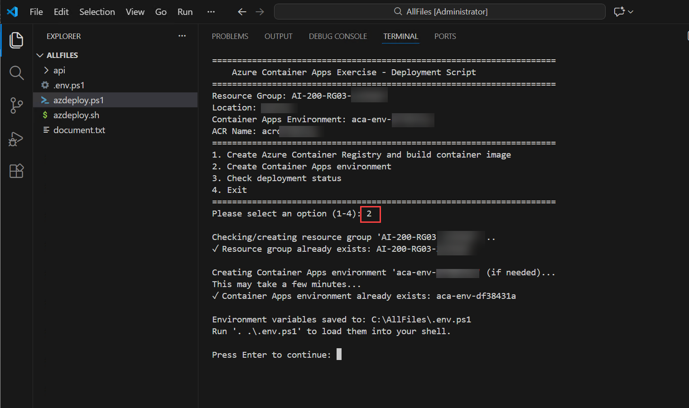

   > **Note:** A file containing environment variables is created after the Container Apps environment is created. You use these variables throughout the exercise.

1. To verify that the deployment was successful, navigate to the Azure portal. In the search bar, type **Container Apps Environments (1)** and select **Container Apps Environments (2)** from the search results.

   

1. You should see the **Container App Environment** you created.

   

1. When the previous operation is finished, enter **4** to exit the deployment script.

   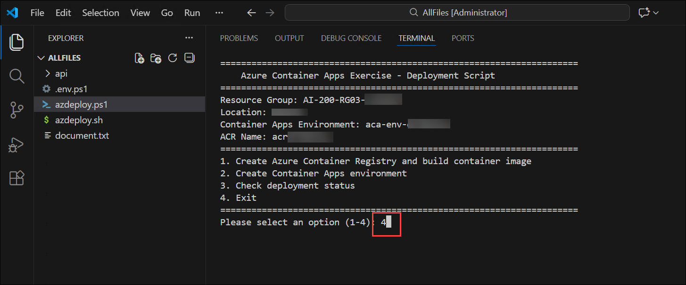

1. Run the appropriate command to load the environment variables into your terminal session from the file created in a previous step.

   <details>
     <summary>Bash</summary>

   ```bash
   source .env
   ```

   

   </details>

   <details>
     <summary>PowerShell</summary>

   ```powershell
   . .\.env.ps1
   ```

   

   </details>

   > **Note:** Keep the terminal open. If you close it and create a new terminal, you might need to run the command to create the environment variable again.

> **Congratulations** on completing the task! Now, it's time to validate it. Here are the steps:
>
> - If you receive a success message, you can proceed to the next task.
> - If not, carefully read the error message and retry the step, following the instructions in the lab guide.
> - If you need any assistance, please contact us at cloudlabs-support@spektrasystems.com. We are available 24/7 to help you out.

<validation step="3380efd1-ce05-4543-8921-9c277854fd9a" />

## Task 2: Deploy the container app and configure secrets

In this task, you will deploy the container API as a container app with external ingress enabled. You will configure a system-assigned managed identity for secure registry authentication and create secrets to store sensitive API keys as environment variables.

1. Create the container app with a system-assigned managed identity and configure registry authentication at create time. The **--registry-identity** flag tells Container Apps to use the app's managed identity to pull images from the specified registry. The CLI automatically assigns the **AcrPull** role when you use this flag with an Azure Container Registry.

   <details>
     <summary>Bash</summary>

   ```azurecli
   az containerapp create \
      --name $CONTAINER_APP_NAME \
      --resource-group $RESOURCE_GROUP \
      --environment $ACA_ENVIRONMENT \
      --image "$ACR_SERVER/$CONTAINER_IMAGE" \
      --ingress external \
      --target-port $TARGET_PORT \
      --env-vars MODEL_NAME=$MODEL_NAME \
      --registry-server "$ACR_SERVER" \
      --registry-identity system
   ```

   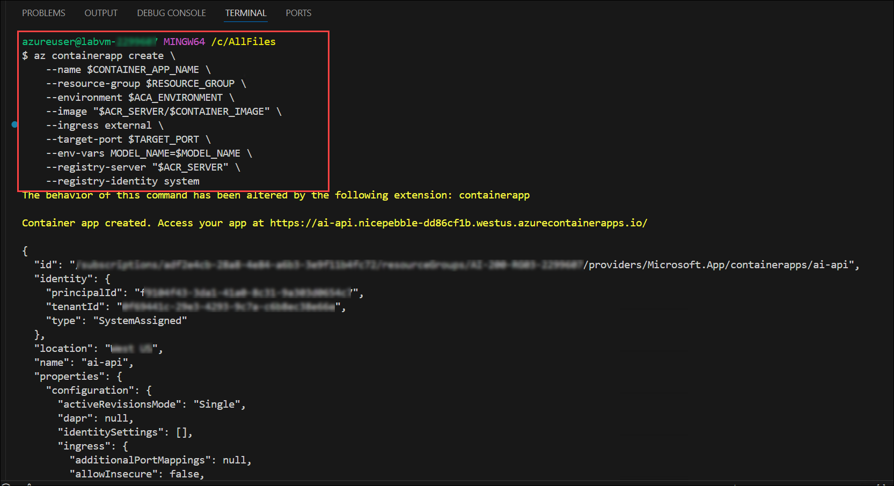

   </details>

   <details>
     <summary>PowerShell</summary>

   ```powershell
   az containerapp create `
      --name $env:CONTAINER_APP_NAME `
      --resource-group $env:RESOURCE_GROUP `
      --environment $env:ACA_ENVIRONMENT `
      --image "$env:ACR_SERVER/$env:CONTAINER_IMAGE" `
      --ingress external `
      --target-port $env:TARGET_PORT `
      --env-vars MODEL_NAME=$env:MODEL_NAME `
      --registry-server "$env:ACR_SERVER" `
      --registry-identity system
   ```

   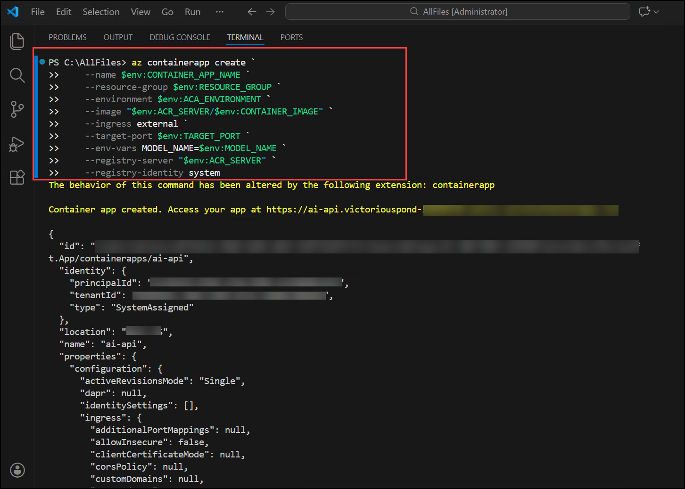

   </details>

1. To verify that the deployment was successful, navigate to the Azure portal. In the search bar, type **Container Apps (1)** and select **Container Apps (2)** from the search results.

   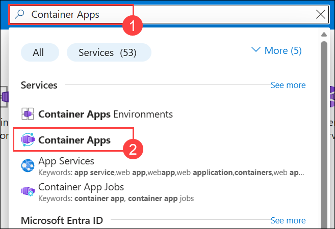

1. You should see the **Container App** is deployed.

   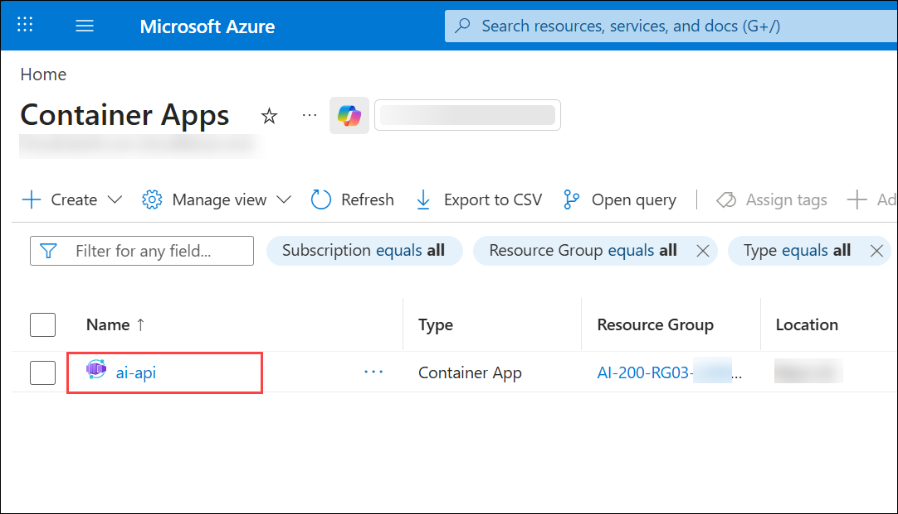

1. Create a secret and reference it from an environment variable.

   <details>
     <summary>Bash</summary>

   ```azurecli
   az containerapp secret set -n $CONTAINER_APP_NAME -g $RESOURCE_GROUP \
      --secrets embeddings-api-key=$EMBEDDINGS_API_KEY
   ```

   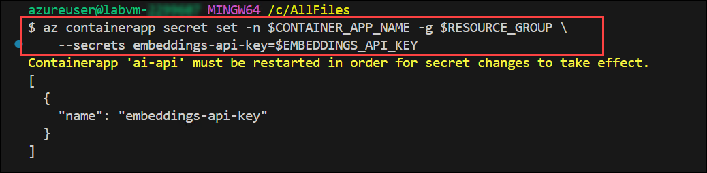

   </details>

   <details>
     <summary>PowerShell</summary>

   ```powershell
   az containerapp secret set -n $env:CONTAINER_APP_NAME -g $env:RESOURCE_GROUP `
      --secrets embeddings-api-key=$env:EMBEDDINGS_API_KEY
   ```

   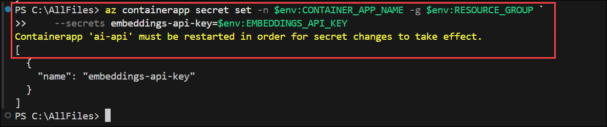

   </details>

1. Reference the secret from an environment variable. This command creates a new revision, which restarts the app so the secret change takes effect.

   <details>
     <summary>Bash</summary>

   ```azurecli
   az containerapp update -n $CONTAINER_APP_NAME -g $RESOURCE_GROUP \
      --set-env-vars EMBEDDINGS_API_KEY=secretref:embeddings-api-key
   ```

   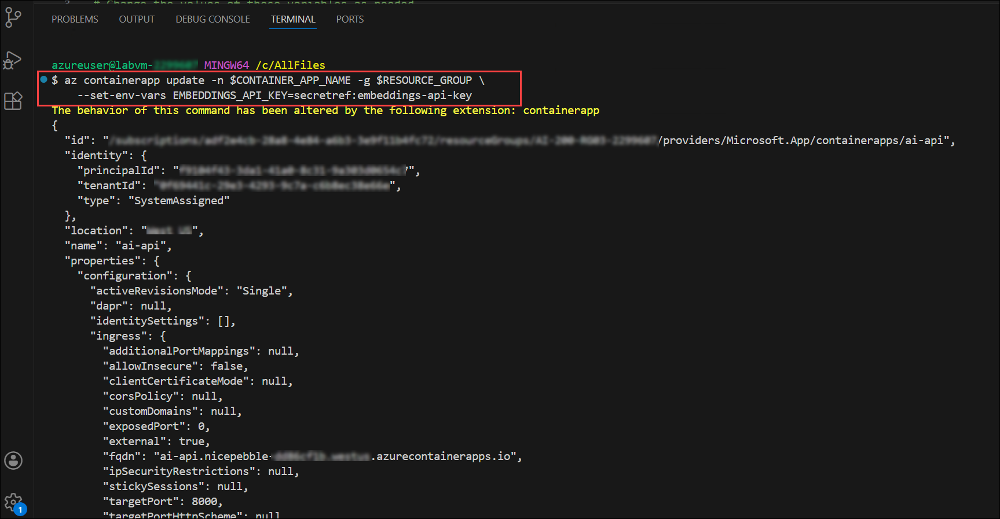

   </details>

   <details>
     <summary>PowerShell</summary>

   ```powershell
   az containerapp update -n $env:CONTAINER_APP_NAME -g $env:RESOURCE_GROUP `
      --set-env-vars EMBEDDINGS_API_KEY=secretref:embeddings-api-key
   ```

   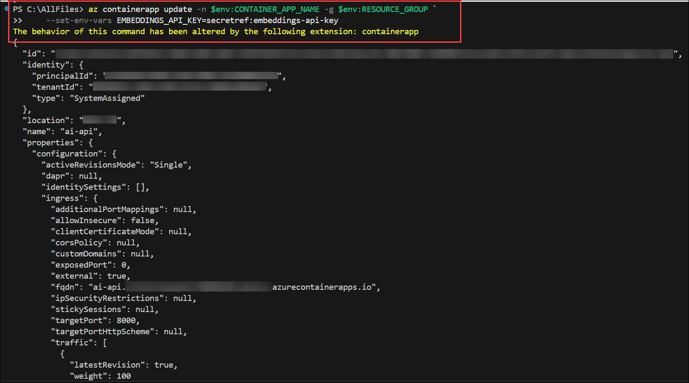

   </details>

1. Run the following command to list the revisions to confirm a new revision was created.

   <details>
     <summary>Bash</summary>

   ```azurecli
   az containerapp revision list -n $CONTAINER_APP_NAME -g $RESOURCE_GROUP -o table
   ```

   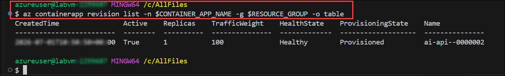

   </details>

   <details>
     <summary>PowerShell</summary>

   ```powershell
   az containerapp revision list `
   --name $env:CONTAINER_APP_NAME `
   --resource-group $env:RESOURCE_GROUP `
   --output table
   ```

   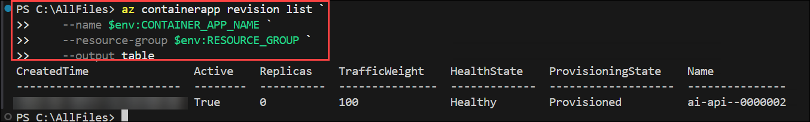

   </details>

   > **Note:** The revision name ends with a suffix like `--0000002`, indicating this is the second revision. Container Apps creates a new revision whenever you change environment variables or secrets, which restarts the app with the updated configuration. Old inactive revisions may be pruned over time.

> **Congratulations** on completing the task! Now, it's time to validate it. Here are the steps:
>
> - If you receive a success message, you can proceed to the next task.
> - If not, carefully read the error message and retry the step, following the instructions in the lab guide.
> - If you need any assistance, please contact us at cloudlabs-support@spektrasystems.com. We are available 24/7 to help you out.

<validation step="84970fee-3f58-48e8-af6f-00dae6452500" />

## Task 3: Verify the deployment

In this task, you will verify that the container app has started correctly and is responding to requests. You will retrieve the app's fully qualified domain name (FQDN), test the API endpoints including health, root, and document processing endpoints, and review the application logs to confirm everything is working as expected.

1. Run the following command to retrieve the app FQDN and store the result to a variable.

   <details>
     <summary>Bash</summary>

   ```bash
   FQDN=$(az containerapp show -n $CONTAINER_APP_NAME -g $RESOURCE_GROUP \
       --query properties.configuration.ingress.fqdn -o tsv)

   echo "$FQDN"
   ```

   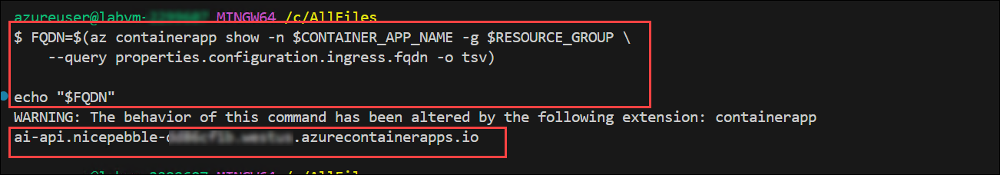

   </details>

   <details>
     <summary>PowerShell</summary>

   ```powershell
   $FQDN = az containerapp show -n $env:CONTAINER_APP_NAME -g $env:RESOURCE_GROUP `
       --query properties.configuration.ingress.fqdn -o tsv

   Write-Output $FQDN
   ```

   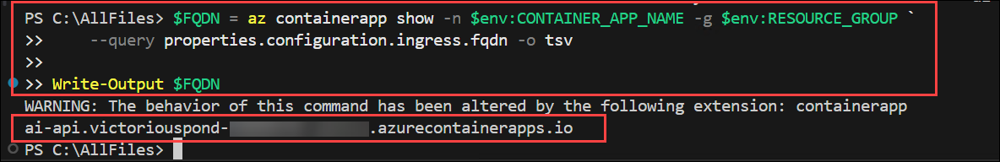

   </details>

1. Run the following command to call the health endpoint. The command should return **{"status": "healthy"}**.

   <details>
     <summary>Bash</summary>

   ```bash
   curl -s "https://$FQDN/health"
   ```

   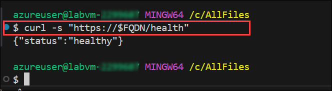

   </details>

   <details>
     <summary>PowerShell</summary>

   ```powershell
   Invoke-RestMethod -Uri "https://$FQDN/health"
   ```

   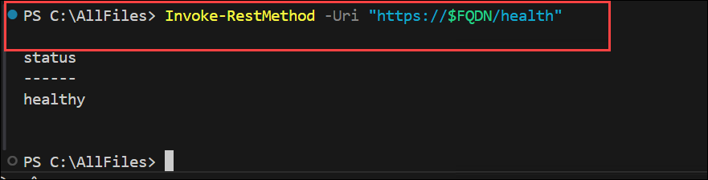

   </details>

1. Run the following command to verify the secret is configured by calling the root endpoint. The endpoint returns JSON containing app information including the configured model name and whether the API key secret is configured.

   <details>
     <summary>Bash</summary>

   ```bash
   curl -s "https://$FQDN/"
   ```

   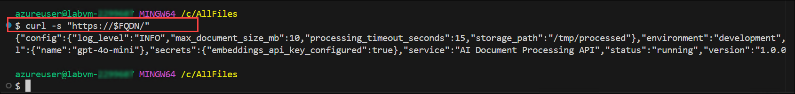

   </details>

   <details>
     <summary>PowerShell</summary>

   ```powershell
   Invoke-RestMethod -Uri "https://$FQDN/"
   ```

   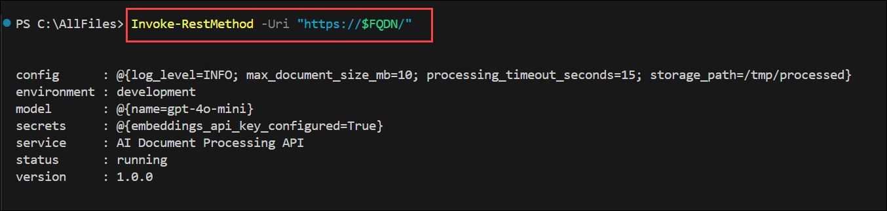

   </details>

1. Run the following command to test the document processing endpoint. The command sends the _document.txt_ file to the endpoint. The operation returns JSON with mock data analysis information.

   <details>
     <summary>Bash</summary>

   ```bash
   curl -s -X POST "https://$FQDN/process" \
      -H "Content-Type: text/plain" \
      -d @document.txt
   ```

   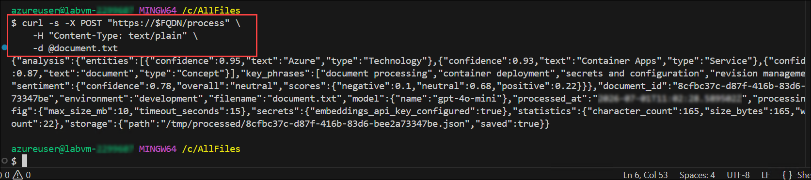

   </details>

   <details>
     <summary>PowerShell</summary>

   ```powershell
   Invoke-RestMethod -Uri "https://$FQDN/process" `
      -Method Post `
      -ContentType "text/plain" `
      -Body (Get-Content -Raw document.txt)
   ```

   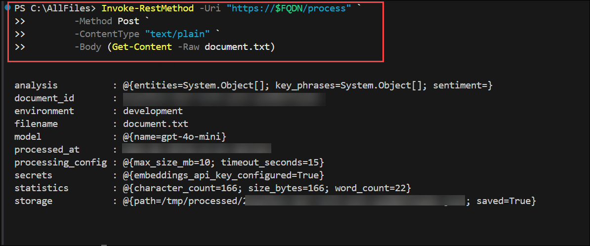

   </details>

1. Run the following command to review logs for startup and runtime signals. This command shows recent console output only. For historical logs and advanced troubleshooting, logs persist in the Log Analytics workspace associated with your Container Apps environment.

   <details>
     <summary>Bash</summary>

   ```azurecli
   az containerapp logs show -n $CONTAINER_APP_NAME -g $RESOURCE_GROUP
   ```

   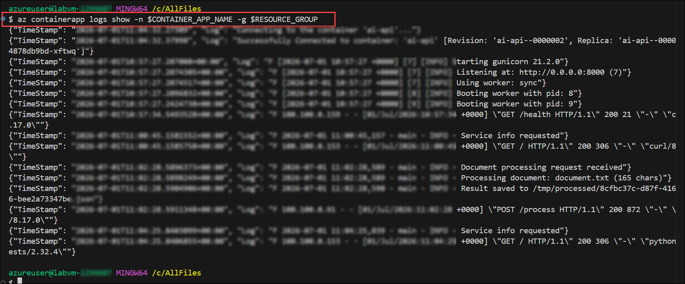

   </details>

   <details>
     <summary>PowerShell</summary>

   ```azurecli
   az containerapp logs show `
   --name $env:CONTAINER_APP_NAME `
   --resource-group $env:RESOURCE_GROUP
   ```

   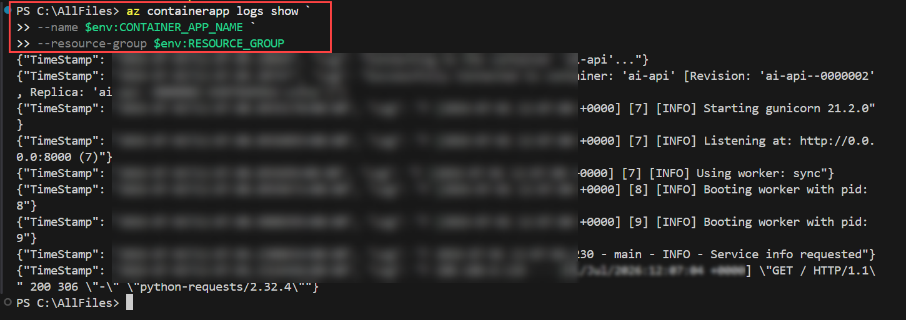

   </details>

## Summary

In this lab, you successfully deployed a containerized backend API to Azure Container Apps by completing the following tasks:

- Deployed Azure infrastructure including an Azure Container Registry and Container Apps environment.
- Created a system-assigned managed identity and configured registry authentication so the container app can securely pull images from the private ACR without storing credentials.
- Configured secrets to store sensitive API keys and referenced them as environment variables in the container app.
- Verified the deployment by testing the API health endpoint, root endpoint, and document processing endpoint.
- Reviewed container logs to confirm the application started successfully and is processing requests correctly.

## You have successfully completed the Hands-on Lab!
