# Lab 05: Configure autoscaling using KEDA triggers

### Estimated Duration : 60 Minutes

## Overview

In this hands-on lab, you will configure autoscaling for a containerized application in Azure Container Apps using KEDA-based HTTP concurrency rules. You will deploy a mock agent API, create the required Azure Container Registry and Container Apps resources, and apply scaling policies that allow the app to scale out during periods of high demand and scale down when traffic decreases. You will also generate concurrent requests to observe replica changes in real time and update scaling behavior using YAML so the configuration is easier to manage and repeat.

## Lab Objective

In this lab, you'll perform the following tasks:

- **Task 1:** Create Azure Container Registry and Container Apps resources
- **Task 2:** Configure an HTTP concurrency scale rule using KEDA
- **Task 3:** Generate load and observe scaling
- **Task 4:** Configure scale rules using YAML

### <span style="color:maroon">**Note:** This lab includes deployment scripts for both **Bash** and **PowerShell**. Click on the drop-down arrow ▶ to expand the commands for your preferred shell. Once you make your choice, use the corresponding commands throughout the entire lab.</span>

## Task 1: Create Azure Container Registry and Container Apps resources

In this task, you will create the Azure resources required for the lab by running the deployment script. You will provision an Azure Container Registry and a Container Apps environment, which provide the foundation for deploying and scaling the container app.

1. Launch **Visual Studio Code** (VS Code) from desktop.

   

1. Select **File Explorer (1)**, then **Open Folder (2)** from the menu.

   

1. Navigate to **C:\Allfiles (1)** and click **Select Folder (2)**.

   

1. If you see the prompt, **Do you trust the authors of the files in this folder?**, click **Yes, I trust the authors**.

   

1. Once the folder opens in VS Code, select **Explorer (1)** and then **azdeploy.ps1 (2)**.

   

1. Navigate to the Azure portal and search for **Resource groups (1)**. Then select **Resource groups (2)**.

   

1. Note the name of the **Resource group**.

   

1. The project contains deployment scripts for both Bash (_azdeploy.sh_) and PowerShell (_azdeploy.ps1_). Open the appropriate file for your environment and change the two values: **Resource group name** as **<inject key="ResourceGroupName" enableCopy="false"/>** and **Azure Region** as **<inject key="Region" enableCopy="false"/>** at the top of the script to meet your needs.

   ```
   "<your-resource-group-name>" # Resource Group name
   "<your-azure-region>" # Azure region for the resources
   ```

   

   

   > **Note:** Do not change anything else in the script.

1. Press **Ctrl+S** to save the changes in both the scripts.

1. In the menu bar, select **ellipsis (...) (1)**, then **Terminal (2)**, and then **New Terminal (3)** to open a terminal window in VS Code.

   

   > **Note:** If you are using Bash, after the terminal opens, expand the downward arrow icon **(1)** to open a new terminal and select **Git Bash (2)** from the drop-down list. If you are using PowerShell, skip this step.
   >
   > 

1. Run the following command in the terminal to allow PowerShell scripts to run. This step is required only if you are using PowerShell. If you are using Bash, skip this step.

    <details>
     <summary>PowerShell</summary>
   ```
   Set-ExecutionPolicy -ExecutionPolicy bypass -Force
   ```

   
   </details>

1. Run the command **az login (1)** to sign in to your Azure account. Then **minimize the VS Code window (2)** to view the login window that opens in the background.

   ```
   az login
   ```

   

1. A pop-up window will appear on the desktop. Select **Work and school account (1)** and then click **Continue (2)**.

   

1. In the login window, sign in by using the provided **Azure credentials (1)** and then click **Next (2)**.
   - **Email/Username:** <inject key="AzureAdUserEmail"></inject>

     

1. Enter the temporary access password and click **Sign in**.
   - **Password:** <inject key="AzureAdUserPassword"></inject>

     

1. When prompted with **Sign in to all apps and websites on this device?**, select **No, this app only**.

   

1. Return to the terminal.

1. Choose the subscription by entering **1**.

   

   > **NOTE:** To confirm you're logged in to the correct Azure subscription, run **az account show**.

1. Run the following command to ensure you have the **containerapp** extension for Azure CLI.

   ```azurecli
   az extension add --name containerapp
   ```

   

1. Make sure you are in the root directory of the project and run the appropriate command in the terminal to launch the deployment script. The deployment script will deploy ACR and create a file with environment variables needed.

   <details>
     <summary>Bash</summary>

   ```bash
   bash azdeploy.sh
   ```

   
   </details>

   <details>
     <summary>Powershell</summary>

   ```powershell
   ./azdeploy.ps1
   ```

   
   </details>

1. When the script is running, enter **1** to launch **Create Azure Container Registry and build container image**.

   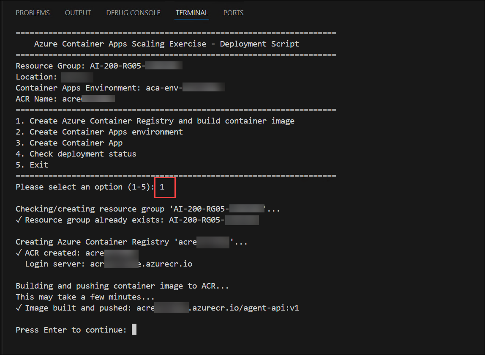

1. To verify that the deployment was successful, navigate to the Azure portal. In the search bar, type **Container registries (1)** and select **Container registries (2)** from the search results.

   

1. You should see one **Container registry** created.

   

1. When the previous operation is finished, enter **2** to launch **Create Container Apps environment**.

   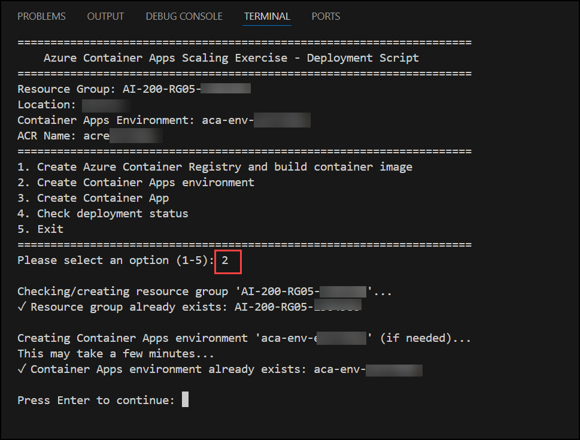

1. To verify that the deployment was successful, navigate to the Azure portal. In the search bar, type **Container Apps Environments (1)** and select **Container Apps Environments (2)** from the search results.

   

1. You should see the **Container App Environment** you created.

   

1. When the previous operation is finished, enter **3** to launch **Create Container App**.

   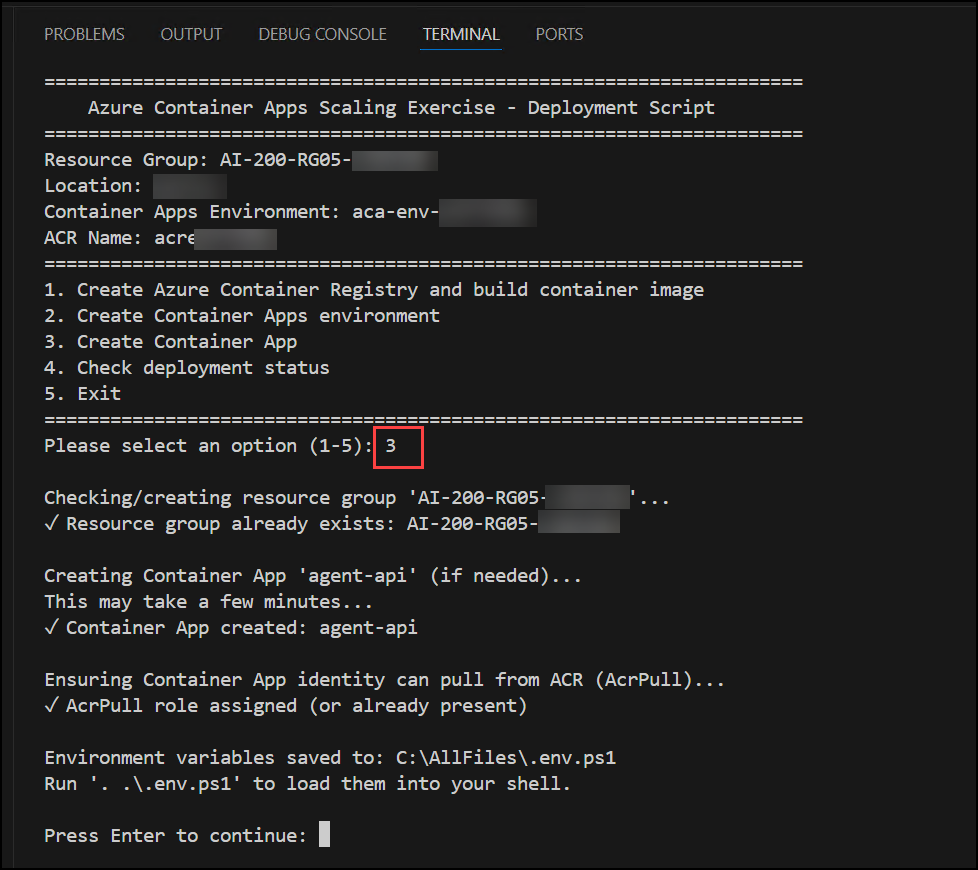

   > **Note:** A file containing environment variables is created after the container app is created. You use these variables throughout the exercise.

1. When the previous operation is finished, enter **5** to exit the deployment script.

   

1. Run the appropriate command to load the environment variables into your terminal session from the file created in a previous step.

   <details>
     <summary>Bash</summary>

   ```bash
   source .env
   ```

   
   </details>

   <details>
     <summary>Powershell</summary>

   ```powershell
   . .\.env.ps1
   ```

   
   </details>

   > **Note:** Keep the terminal open. If you close it and create a new terminal, you might need to run the command to create the environment variable again.

1. Verify the app endpoint is available.

   <details>
     <summary>Bash</summary>
    ```bash
    curl -sS "$CONTAINER_APP_URL/" | head
    ```
    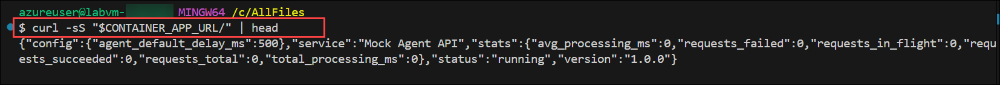
    </details>

    <details>
     <summary>PowerShell</summary>
    ```powershell
    Invoke-RestMethod "$env:CONTAINER_APP_URL/"
    ```
    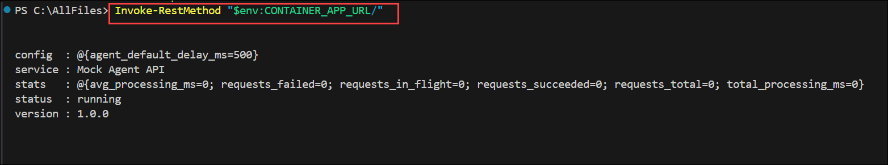
    </details>

   > **Note:** Keep the terminal open. If you close it and create a new terminal, you might need to run the command to create the environment variable again.

> **Congratulations** on completing the task! Now, it's time to validate it. Here are the steps:
>
> - If you receive a success message, you can proceed to the next task.
> - If not, carefully read the error message and retry the step, following the instructions in the lab guide.
> - If you need any assistance, please contact us at cloudlabs-support@spektrasystems.com. We are available 24/7 to help you out.

<validation step="273bf03b-16ca-4c8a-9a97-325131d8e196" />

## Task 2: Configure an HTTP concurrency scale rule

In this task, you will configure an HTTP scale rule that triggers autoscaling based on concurrent requests. This allows the container app to scale out when demand increases and scale in when the workload decreases.

> **Note:** Applying configuration updates (including scaling changes) creates a **new revision**.

1. Run the following command to update the container app with an HTTP scale rule. This rule monitors concurrent in-flight requests and scales the app when demand increases.

   <details>
    <summary>Bash</summary>
   ```bash
   az containerapp update \
       --name $CONTAINER_APP_NAME \
       --resource-group $RESOURCE_GROUP \
       --min-replicas 0 \
       --max-replicas 10 \
       --scale-rule-name http-scaling \
       --scale-rule-type http \
       --scale-rule-http-concurrency 10
   ```
   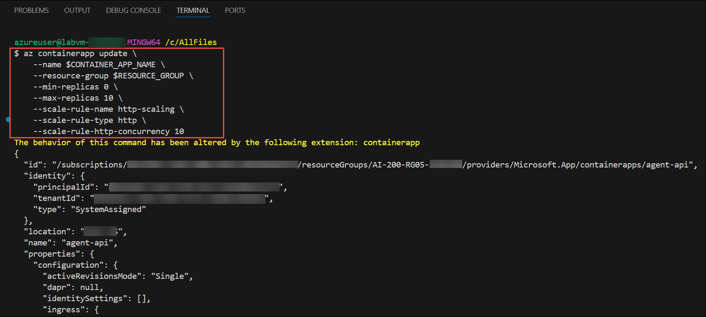
   </details>

   <details>
    <summary>PowerShell</summary>
   ```powershell
   az containerapp update `
       --name $env:CONTAINER_APP_NAME `
       --resource-group $env:RESOURCE_GROUP `
       --min-replicas 0 `
       --max-replicas 10 `
       --scale-rule-name http-scaling `
       --scale-rule-type http `
       --scale-rule-http-concurrency 10
   ```

   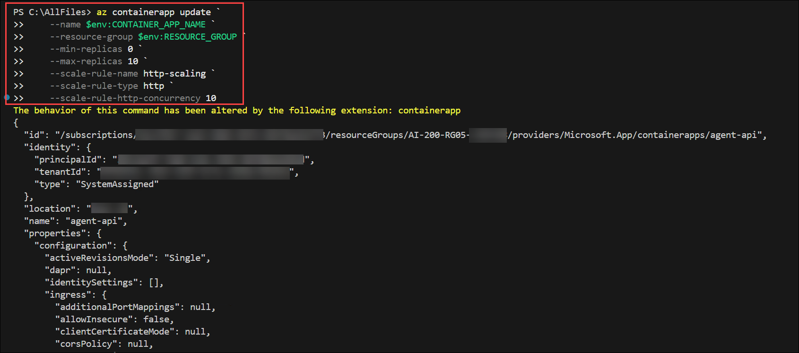
   </details>

1. Run the following command to verify the scale rule is configured. Look for the **http-scaling** rule in the output with **minReplicas** set to **0** and **maxReplicas** set to **10**.

   <details>
    <summary>Bash</summary>
   ```bash
   az containerapp show \
       --name $CONTAINER_APP_NAME \
       --resource-group $RESOURCE_GROUP \
       --query "properties.template.scale"
   ```
   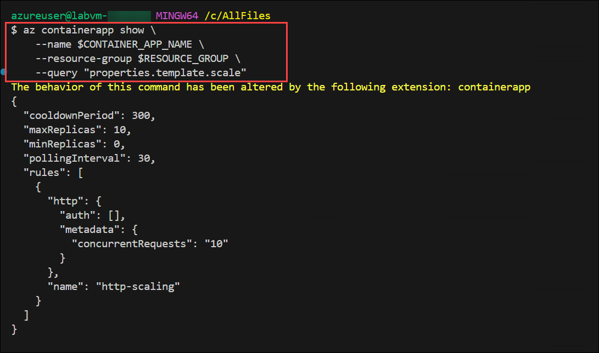
   </details>

   <details>
    <summary>PowerShell</summary>
   ```powershell
   az containerapp show `
       --name $env:CONTAINER_APP_NAME `
       --resource-group $env:RESOURCE_GROUP `
       --query "properties.template.scale"
   ```

   
   </details>

## Task 3: Generate load and observe scaling

In this task, you will run a local dashboard that generates concurrent requests and displays the container app's revisions and replica count. This lets you observe how the autoscaling rules respond to real traffic.

1. Run the following command to navigate to the _client_ directory.

   ```
   cd client
   ```

   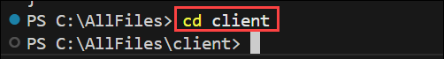

1. Run the following command to create a virtual environment for the client app. Depending on your environment the command might be **python** or **python3**.

   ```python
   python -m venv .venv
   ```

   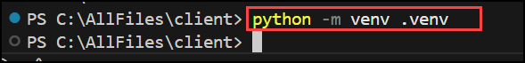

1. Run the following command to activate the Python environment.

   <details>
    <summary>Bash</summary>
   ```bash
   source .venv/Scripts/activate
   ```
   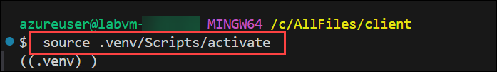
   </details>

   > **Note:** On Linux/macOS, use the Bash command **source .venv/bin/activate**.

   <details>
    <summary>PowerShell</summary>
   ```powershell
   .\.venv\Scripts\Activate.ps1
   ```

   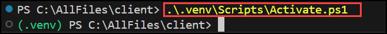
   </details>

1. Run the following command to install the dependencies for the client app.

   ```bash
   pip install -r requirements.txt
   ```

   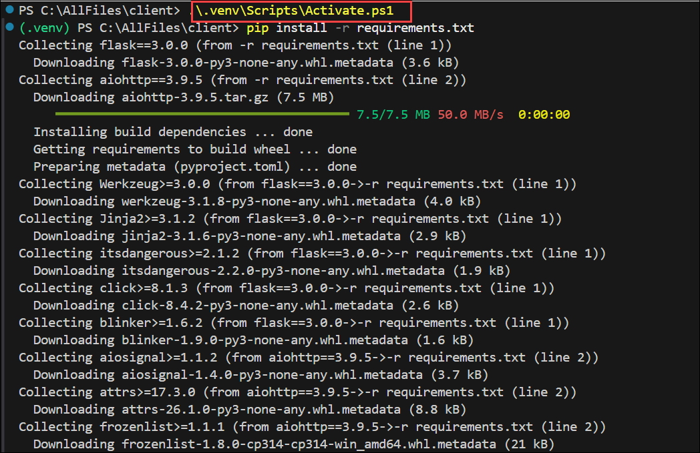

1. Run the following command to start the dashboard.

   ```
   python app.py
   ```

   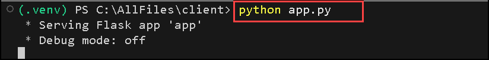

1. Open a browser and navigate to the following URL: `http://127.0.0.1:5000`.

   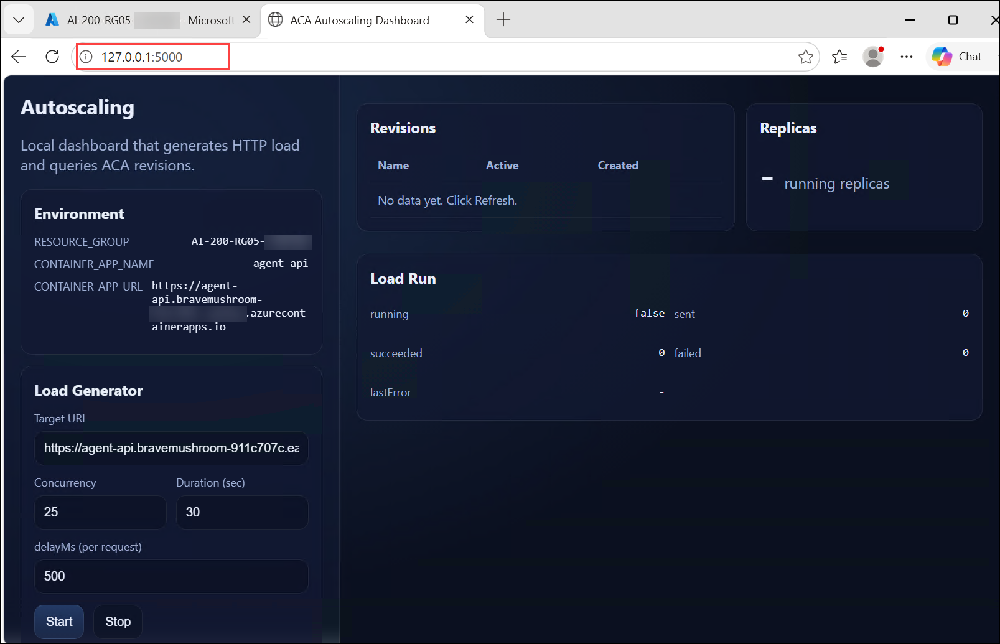

1. In the left pane of the app select **Refresh Revisions & Replicas**. In the top right of the app you should see **1**, or **0** replicas running.

   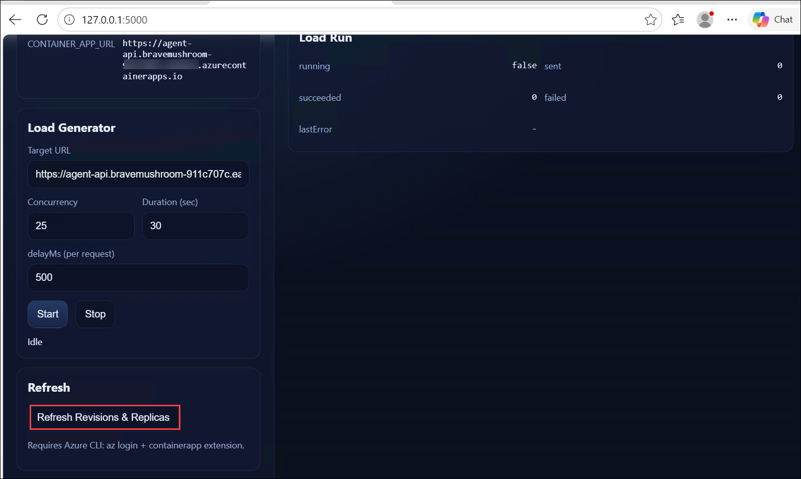

   > **Note:** When you deployed the app it defaulted to **1** running replica. You applied KEDA scale rule in a previous step and scaling down to zero may take an additional **~5 minutes** after the workload becomes idle because of the default **300-second (5-minute)** cool-down period.

1. In the **Load Generator** section, select **Start** to being sending data to the container app.

   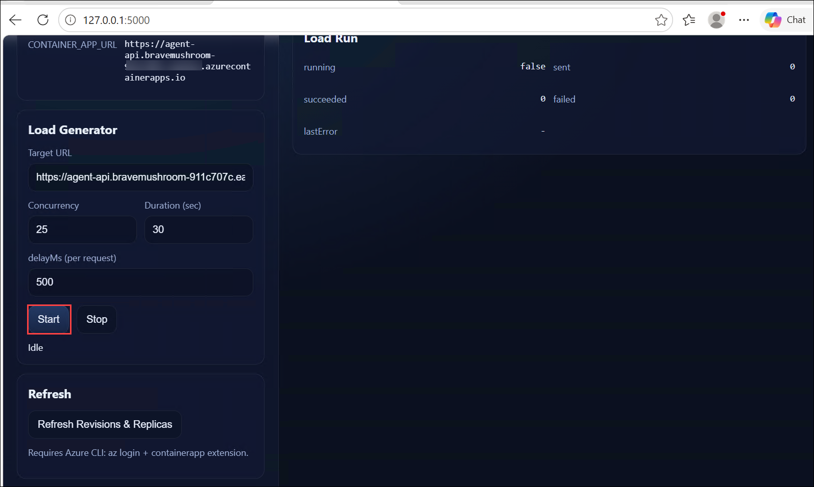

1. Select **Refresh Revisions & Replicas** every 5-10 seconds and you should see the number of replicas increase. You can run the **Load Generator** again after it stops to increase the traffic and increase replica count.

   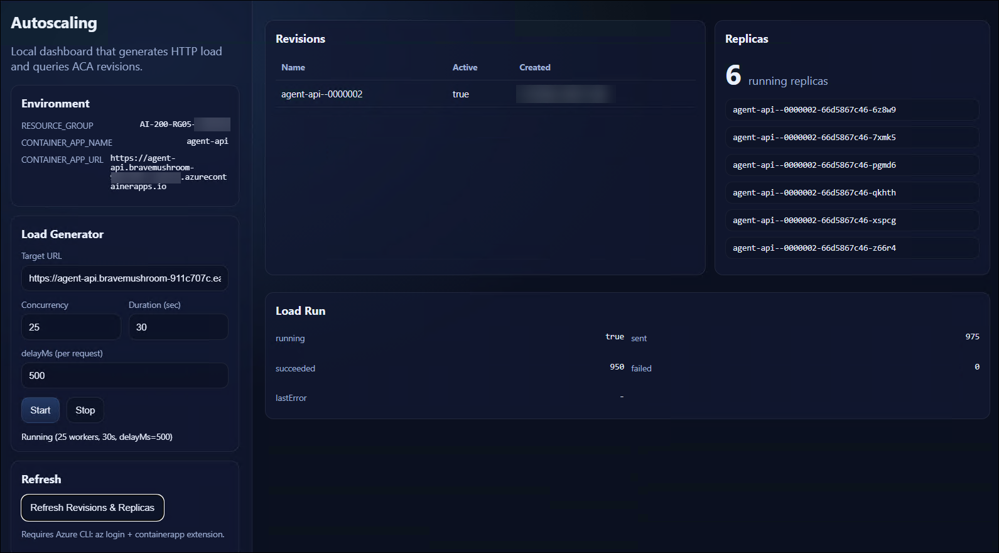

1. When you're finished close the browser window and enter **Ctrl+c** in the terminal to end the client app.

## Task 4: Configure scale rules using YAML

In this task, you will update the container app scaling configuration by editing the YAML definition. This provides a repeatable way to manage autoscaling settings and adjust them for different workloads.

1. Run the following command to export the app configuration to a YAML file.

   <details>
    <summary>Bash</summary>
   ```bash
   az containerapp show \
       --name $CONTAINER_APP_NAME \
       --resource-group $RESOURCE_GROUP \
       --output yaml > app-config.yaml
   ```
   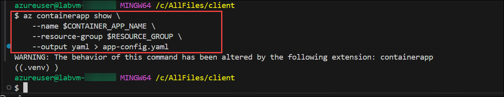
   </details>

   <details>
    <summary>PowerShell</summary>
   ```powershell
   az containerapp show `
       --name $env:CONTAINER_APP_NAME `
       --resource-group $env:RESOURCE_GROUP `
       --output yaml > app-config.yaml
   ```
   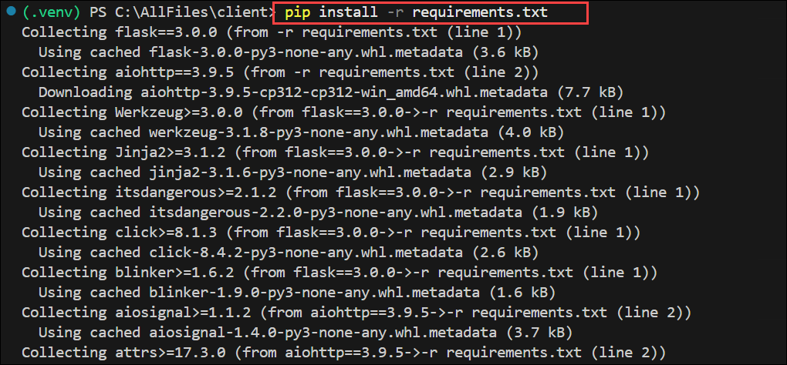
   </details>

1. Navigate to **Explorer**, select the **app-config.yaml (1)**, then open the **app-config.yaml (2)** file in VS Code.

   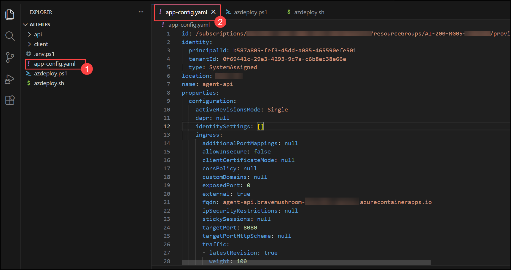

   > **Note:** While performing this lab with the Bash command that generates the **app-config.yaml** file, navigate to **Explorer** and, under the **client (1)** folder, select the **app-config.yaml (2)** file.
   > 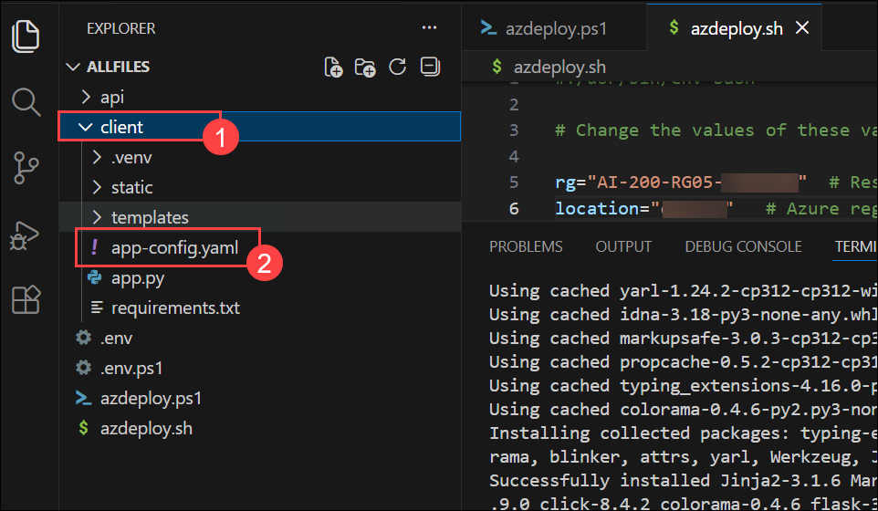

1. Find the **scale** section under **properties > template**. Modify the scaling configuration to reduce the **cooldownPeriod** to **200** seconds (faster scale-down), set **maxReplicas** to **5**, and set **minReplicas** to **1** so the app always has at least one replica running. The **scale** section should look similar to the following example.

   ```yaml
   scale:
     cooldownPeriod: 200
     maxReplicas: 5
     minReplicas: 1
     pollingInterval: 30
   ```

   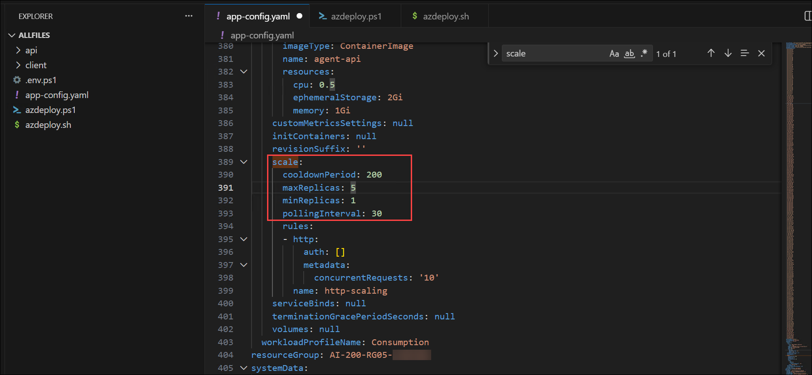

1. Press **Ctrl+S** to save the changes in the **app-config.yaml**.

1. Run the following command to apply the updated configuration.

   <details>
    <summary>Bash</summary>
   ```bash
   az containerapp update \
       --name $CONTAINER_APP_NAME \
       --resource-group $RESOURCE_GROUP \
       --yaml app-config.yaml
   ```
   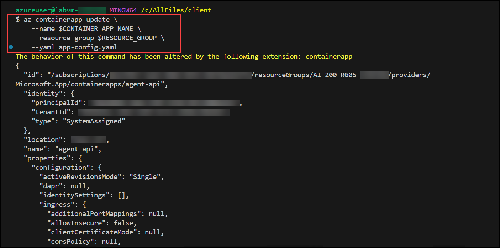
   </details>

   <details>
    <summary>PowerShell</summary>
   ```powershell
   az containerapp update `
       --name $env:CONTAINER_APP_NAME `
       --resource-group $env:RESOURCE_GROUP `
       --yaml app-config.yaml
   ```
   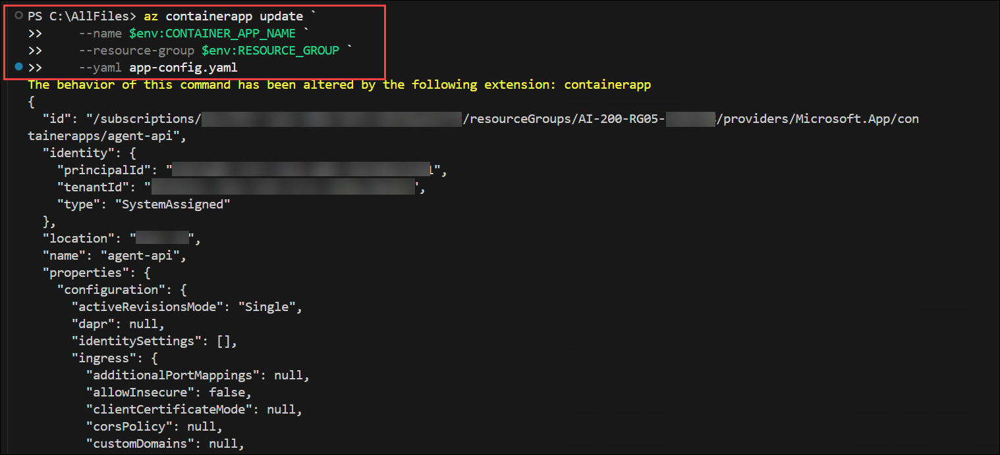
   </details>

1. Run the following command to verify the changes you just implemented.

   <details>
    <summary>Bash</summary>
   ```bash
   az containerapp show \
       --name $CONTAINER_APP_NAME \
       --resource-group $RESOURCE_GROUP \
       --query "properties.template.scale"
   ```
   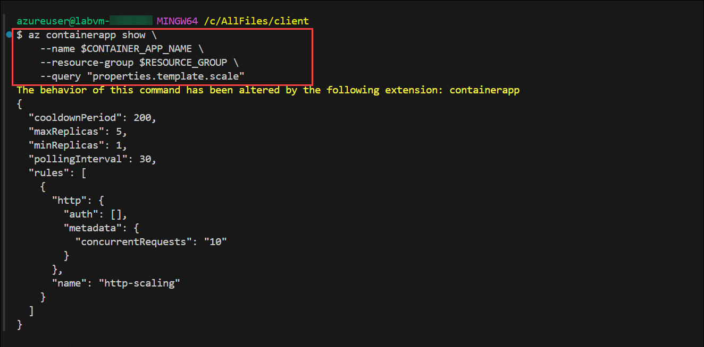
   </details>

   <details>
    <summary>Powershell</summary>
   ```powershell
   az containerapp show `
       --name $env:CONTAINER_APP_NAME `
       --resource-group $env:RESOURCE_GROUP `
       --query "properties.template.scale"
   ```
   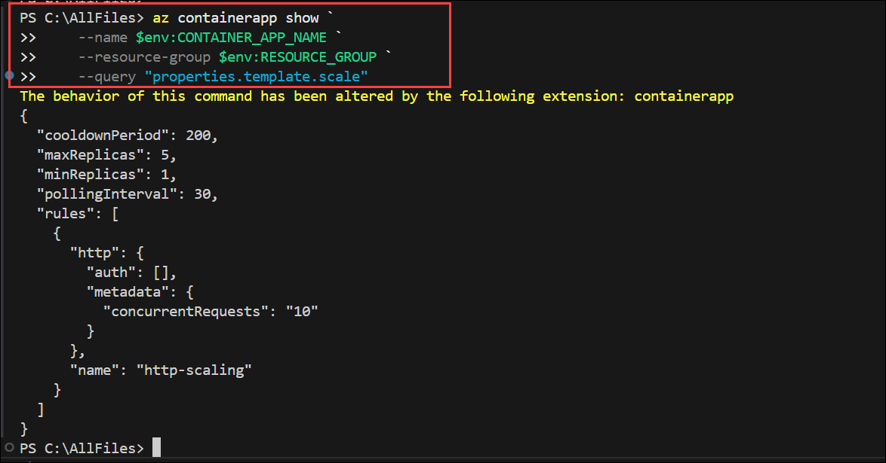
   </details>

## Summary

In this lab, you configured autoscaling for a containerized application in **Azure Container Apps** to help it respond efficiently to changing workloads. You started by creating the required Azure resources, deployed a mock agent API, and applied **KEDA**-based HTTP concurrency rules so the app could automatically scale out when traffic increased and scale in when demand decreased. You also generated concurrent requests to observe replica changes in real time and updated the scaling configuration using **YAML**, giving you a more reusable and maintainable way to manage autoscaling behavior.

## You have successfully completed the Hands-on Lab!
