# Lab 12: Build an agent tool backend on Azure Database for PostgreSQL

### Estimated Duration : 60 Minutes

## Overview 

In this hands-on lab, you create an Azure Database for PostgreSQL instance that serves as a tool backend for an AI agent. The database stores conversation context and task state that an agent can read and write during operation. You design a schema for agent memory, build Python functions that serve as agent tools, and test the complete workflow. This pattern provides a foundation for building AI agents that maintain persistent memory across sessions and can resume interrupted tasks.

## Lab Objective

- **Task 1:** Prepare the environment

- **Task 2:** Create resources in Azure

- **Task 3:** Complete the tool function app

- **Task 4:** Complete the Azure resource deployment

- **Task 5:** Create the agent memory schema with psql

- **Task 6:** Test the agent memory workflow

- **Task 7:** Query conversation context

> ### **Note:** This lab includes deployment scripts for both **PowerShell** and **Bash**. You may choose either scripting language based on your preference or environment. Once you make your choice, use the corresponding commands and script throughout the entire lab, as all subsequent steps provide instructions for both PowerShell and Bash.

## Task 1: Prepare the environment

In this task you download the project starter files and use a script to deploy the necessary services to your Azure subscription. The PostgreSQL server deployment takes a few minutes to complete.

1. Launch **Visual Studio Code** (VS Code) from desktop.

   

1. Select **File Explorer (1)**, then **Open Folder (2)** from the menu.

   

1. Navigate to **C:\AllFiles (1)** and click **Select Folder (2)**.

   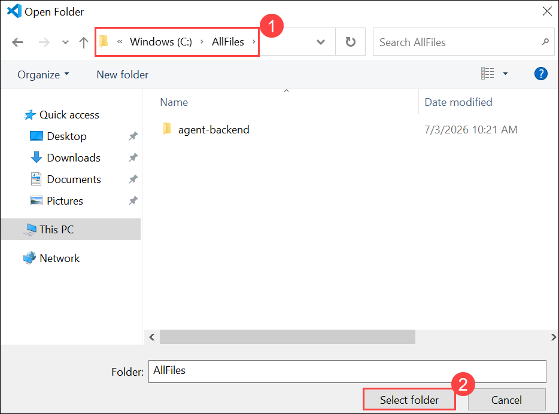

1. If you see the prompt, **Do you trust the authors of the files in this folder?**, click **Yes, I trust the authors**.

   

1. Once the folder opens in VS Code, select **Explorer (1)** and then **azdeploy.ps1 (2)**.

    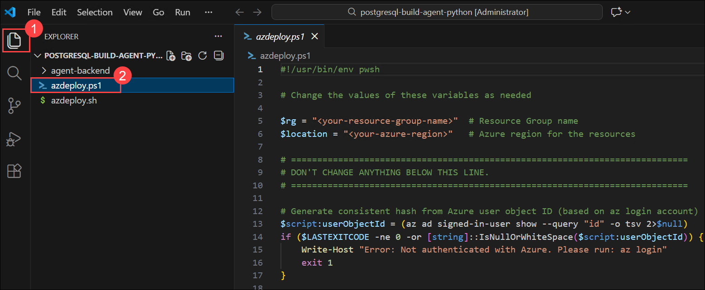

1. The project contains deployment scripts for both Bash (_azdeploy.sh_) and PowerShell (_azdeploy.ps1_). Open the appropriate file for your environment and change the two values: **Resource group name** as **<inject key="ResourceGroupName" enableCopy="false"/>** and **Azure Region** as **<inject key="Region" enableCopy="false"/>** at the top of the script to meet your needs.

   ```
   "<your-resource-group-name>" # Resource Group name
   "<your-azure-region>" # Azure region for the resources
   ```

   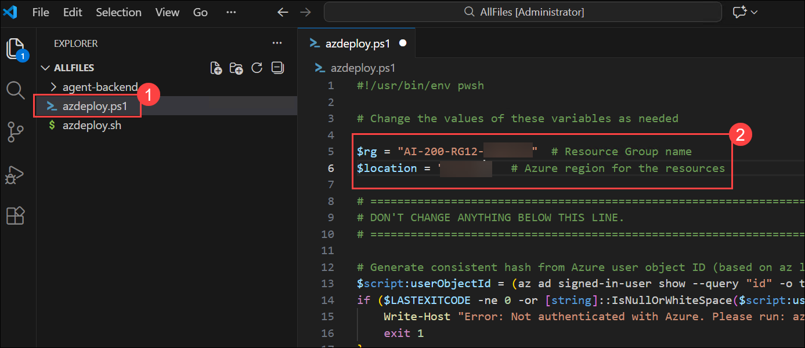

   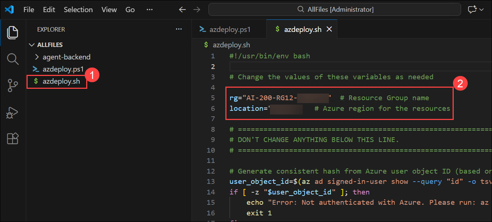

1. In the menu bar, select **File (1)** and select **Save All (2)** from drop-down.

   

1. In the menu bar, select **ellipsis (...) (1)**, then **Terminal (2)**, and then **New Terminal (3)** to open a terminal window in VS Code.

   

   > **NOTE:** If you are using Bash, after the terminal opens, click on the **+ (1)** icon to open a new terminal and select **Git Bash (2)** from the drop-down. If you are using PowerShell, skip this step.
   
   

1. Run the following command in the terminal to allow PowerShell scripts to run. This command is only required if you are using PowerShell. If you are using Bash, skip this step.

   ```
   Set-ExecutionPolicy -ExecutionPolicy bypass -Force
   ```

   

1. Run the **following command (1)** to login to your Azure account. Next, **minimize the VS Code window (2)** to view the login window opened in background.

   ```
   az login
   ```

   

1. In the login window, select **Work or school account (1)** and click **Continue (2)**.

   

1. In the login window, kindly sign in using the provided **Azure credentials (1)** and click **Next (2)**.
   - **Email/Username:** <inject key="AzureAdUserEmail"></inject>

     

1. Next, enter the provided **Password (1)** and click **Sign in (2)**.
   - **Password:** <inject key="AzureAdUserPassword"></inject>

     

1. Next, select **No, this app only** and navigate back to VS Code to continue.

   
1. Answer the prompts to select your Azure account and subscription for the exercise.

   

   > **NOTE:** To confirm you're logged in to the correct Azure subscription, run **az account show**.

## Task 2: Create resources in Azure

1. Make sure you are in the root directory of the project and run the appropriate command in the terminal to launch the deployment script.

   **Bash**

   ```bash
   MSYS_NO_PATHCONV=1 bash azdeploy.sh
   ```

   **PowerShell**

   ```powershell
   ./azdeploy.ps1
   ```

   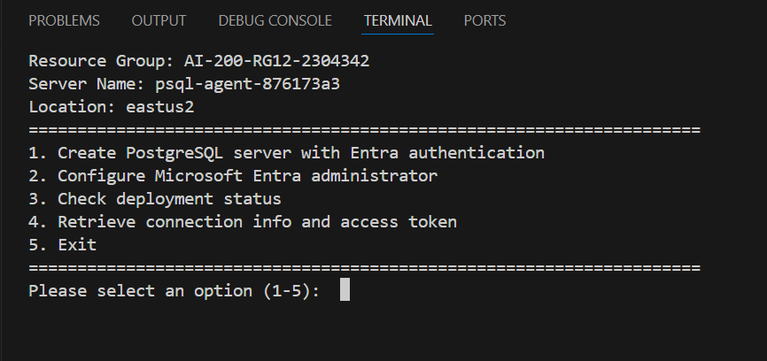

1. When the script menu appears, enter **1** to launch the **Create PostgreSQL server with Entra authentication** option. This creates the server with Entra-only authentication enabled. **Note:** Deployment can take 5-10 minutes to complete.

    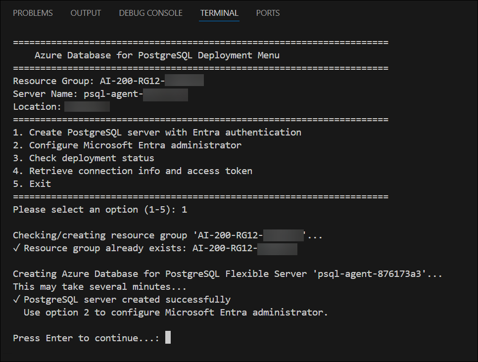

    >**IMPORTANT:** Leave the terminal running the deployment open for the duration of the exercise. You can move on to the next section of the exercise while the deployment continues in the terminal.

> **Congratulations** on completing the task! Now, it's time to validate it. Here are the steps:
>
> - If you receive a success message, you can proceed to the next task.
> - If not, carefully read the error message and retry the step, following the instructions in the lab guide.
> - If you need any assistance, please contact us at cloudlabs-support@spektrasystems.com. We are available 24/7 to help you out.

<validation step="951f3b8f-12bc-4447-b7b3-f6e9a2194652" />

## Task 3: Complete the tool function app

In this task you complete the *agent_tools.py* file by adding functions that an AI agent can call to persist and retrieve state. These functions serve as the agent's interface to the database. The *test_workflow.py* script, which you run later in this exercise, imports these functions to demonstrate how an agent would use them.

1. Open the **agent-backend/agent_tools.py** file in VS Code.

    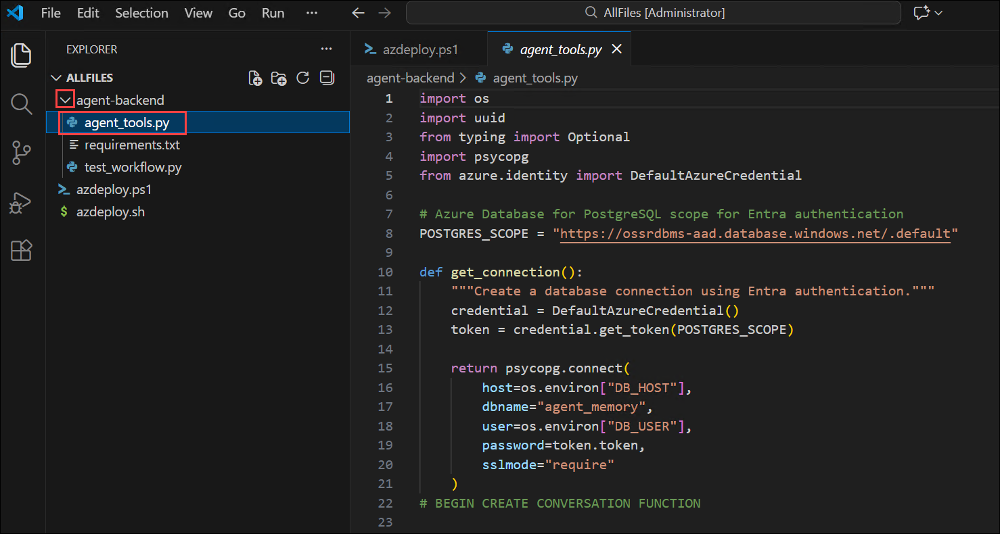

1. Search for the **BEGIN CREATE CONVERSATION FUNCTION** comment and add the following code directly after the comment. This function creates a new conversation record with a unique session ID and stores optional metadata as JSONB.

    ```python
    def create_conversation(user_id: str, metadata: dict = None) -> dict:
        """Create a new conversation and return its details."""
        session_id = uuid.uuid4()
        with get_connection() as conn:
            with conn.cursor() as cur:
                cur.execute(
                    """
                    INSERT INTO conversations (session_id, user_id, metadata)
                    VALUES (%s, %s, %s)
                    RETURNING id, session_id, started_at
                    """,
                    (str(session_id), user_id, psycopg.types.json.Json(metadata or {}))
                )
                row = cur.fetchone()
                conn.commit()
                return {
                    "conversation_id": row[0],
                    "session_id": str(row[1]),
                    "started_at": row[2].isoformat()
                }
    ```

     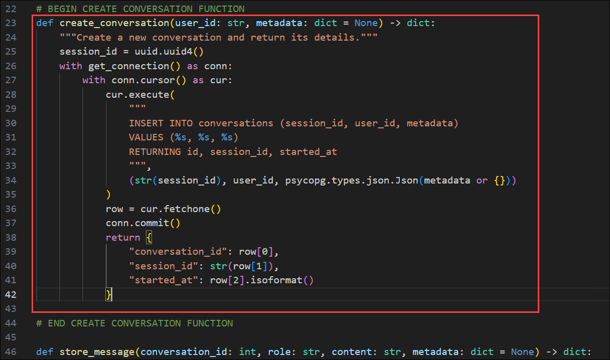

1. Search for the **BEGIN RETRIEVE CONVERSATION HISTORY FUNCTION** comment and add the following code directly after the comment. This function retrieves messages from a conversation, ordered chronologically.

    ```python
    def get_conversation_history(conversation_id: int, limit: int = 50) -> list:
        """Retrieve recent messages from a conversation."""
        with get_connection() as conn:
            with conn.cursor() as cur:
                cur.execute(
                    """
                    SELECT id, role, content, created_at, metadata
                    FROM messages
                    WHERE conversation_id = %s
                    ORDER BY created_at DESC
                    LIMIT %s
                    """,
                    (conversation_id, limit)
                )
                rows = cur.fetchall()
                return [
                    {
                        "id": row[0],
                        "role": row[1],
                        "content": row[2],
                        "created_at": row[3].isoformat(),
                        "metadata": row[4]
                    }
                    for row in reversed(rows)  # Return in chronological order
                ]
    ```

    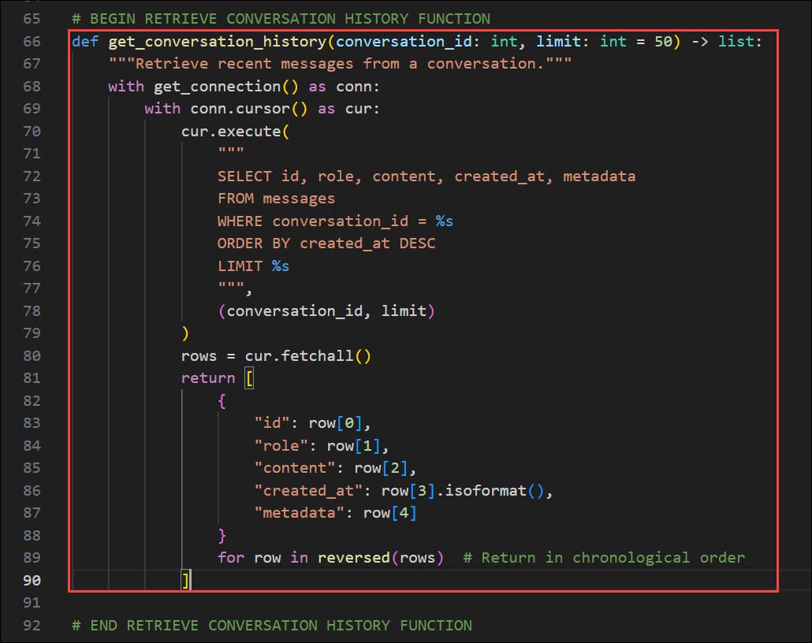

1. Search for the **BEGIN TASK CHECKPOINT FUNCTIONS** comment and add the following code directly after the comment. This function uses an upsert pattern to save or update task state, allowing the agent to resume interrupted tasks.

    ```python
    def save_task_state(conversation_id: int, task_name: str, status: str, checkpoint_data: dict) -> dict:
        """Save or update a task checkpoint."""
        with get_connection() as conn:
            with conn.cursor() as cur:
                cur.execute(
                    """
                    INSERT INTO task_checkpoints (conversation_id, task_name, status, checkpoint_data)
                    VALUES (%s, %s, %s, %s)
                    ON CONFLICT (conversation_id, task_name)
                    DO UPDATE SET
                        status = EXCLUDED.status,
                        checkpoint_data = EXCLUDED.checkpoint_data,
                        updated_at = CURRENT_TIMESTAMP
                    RETURNING id, updated_at
                    """,
                    (conversation_id, task_name, status, psycopg.types.json.Json(checkpoint_data))
                )
                row = cur.fetchone()
                conn.commit()
                return {
                    "checkpoint_id": row[0],
                    "updated_at": row[1].isoformat()
                }
    ```

    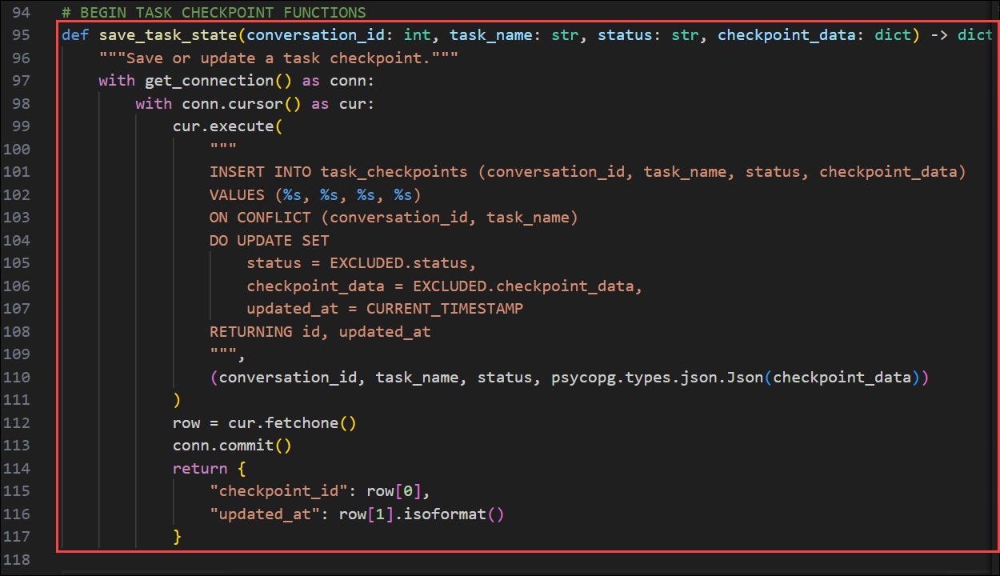

1. Save your changes to the **agent_tools.py** file by using **Ctrl + S**.

1. Take a few minutes to review all of the code in the app.

Next, you finalize the Azure resource deployment.

## Task 4: Complete the Azure resource deployment

In this task you return to the deployment script to configure the Microsoft Entra administrator and retrieve the connection information for the PostgreSQL server.

1. Go back to the terminal. When the **Create PostgreSQL server with Entra authentication** operation has completed, enter **2** to launch the **Configure Microsoft Entra administrator** option. This sets your Azure account as the database administrator.

    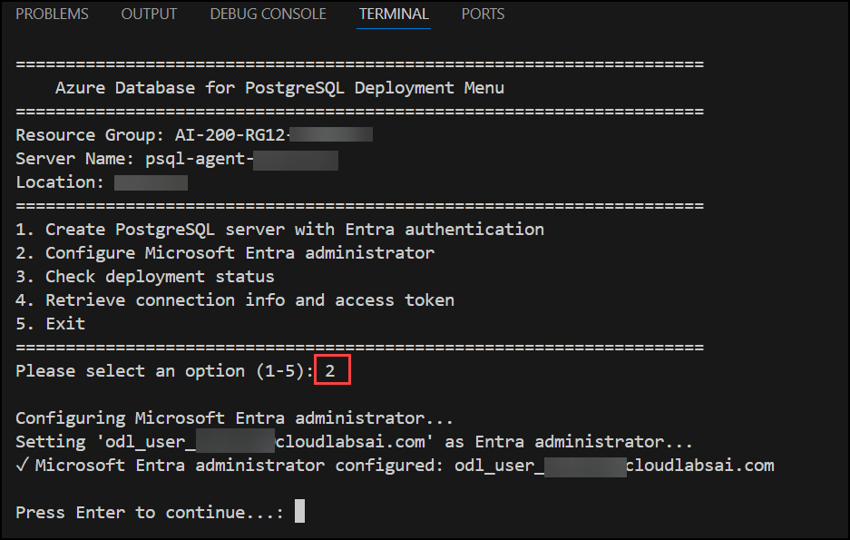

1. When the previous operation completes, enter **3** to launch the **Check deployment status** option. This verifies the server is ready.

    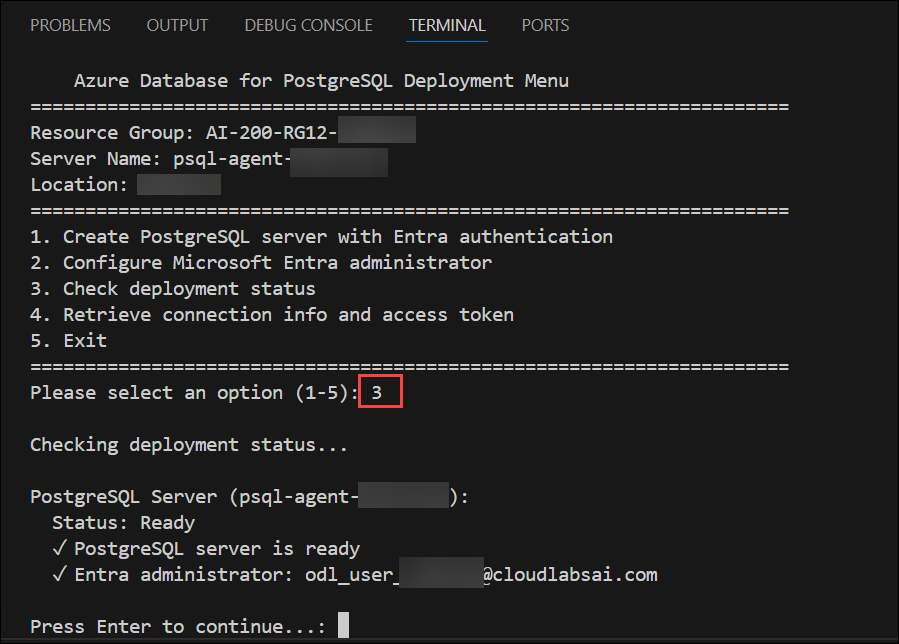

1. Enter **4** to launch the **Retrieve connection info and access token** option. This creates a file with the necessary environment variables.

    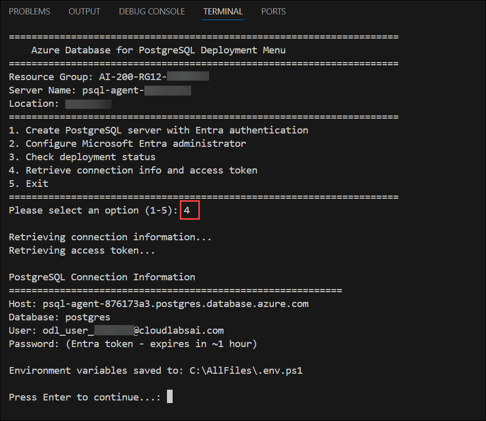
    
    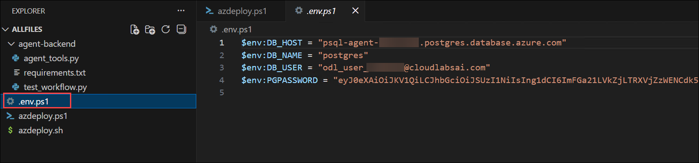

1. Enter **5** to exit the deployment script.

1. Run the following command to load the environment variables into your terminal session from the file created in a previous step.

    **Bash**
    ```bash
    source .env
    ```

    **PowerShell**
    ```powershell
    . .\.env.ps1
    ```

    >**Note:** Keep the terminal open. If you close it and create a new terminal, you might need to run the command to create the environment variable again.

    >**Note:** The access token expires after approximately one hour. If you need to reconnect later, run the script again and select option **4** to generate a new token, then export the variables again.

Next, you create the schema to support the agent.

## Task 5: Create the agent memory schema with **psql**

In this task you connect to the PostgreSQL server using the **psql** command-line tool and create the database schema for agent memory. The schema includes three tables: one for conversations (agent sessions), one for messages within those conversations, and one for task checkpoints that enable the agent to resume interrupted work.

1. Run the following command to connect to the server using the environment variables. The **PGPASSWORD** environment variable is automatically used for authentication.

    **Bash**
    ```bash
    psql "host=$DB_HOST port=5432 dbname=$DB_NAME user=$DB_USER sslmode=require"
    ```

    **PowerShell**
    ```powershell
    psql "host=$env:DB_HOST port=5432 dbname=$env:DB_NAME user=$env:DB_USER sslmode=require"
    ```

    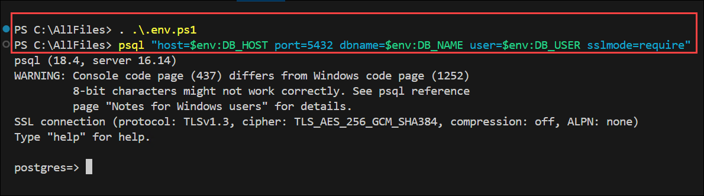

1. Run the following command to verify the connection by checking the PostgreSQL version.

    ```sql
    SELECT version();
    ```

    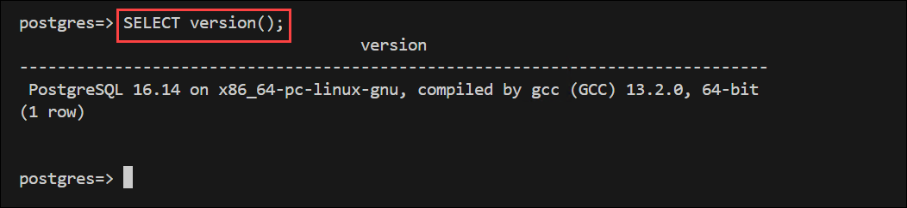

1. Run the following command to create a database for the agent backend. The **\c** command connects to the new database.

    ```sql
    CREATE DATABASE agent_memory;
    \c agent_memory
    ```

    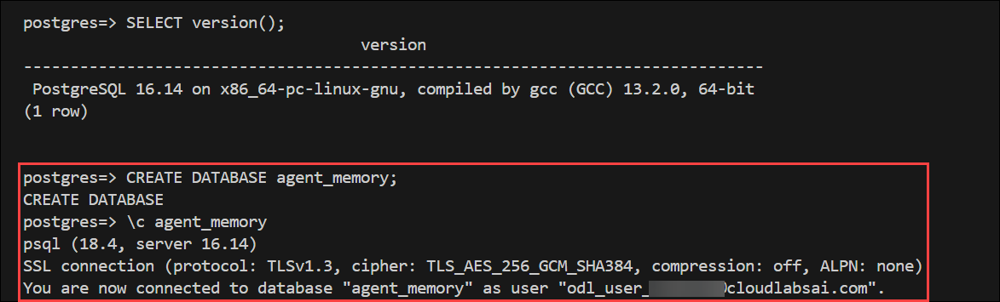

1. Run the following command to create a table for conversations (agent sessions). This table stores session metadata and links messages to a specific conversation.

    ```sql
    CREATE TABLE conversations (
        id BIGSERIAL PRIMARY KEY,
        session_id UUID NOT NULL UNIQUE,
        user_id VARCHAR(255) NOT NULL,
        started_at TIMESTAMP WITH TIME ZONE DEFAULT CURRENT_TIMESTAMP,
        ended_at TIMESTAMP WITH TIME ZONE,
        metadata JSONB DEFAULT '{}'::jsonb
    );
    ```

1. Run the following command to create a table for messages within conversations. This table stores the role (user, assistant, system, or tool) and content for each message.

    ```sql
    CREATE TABLE messages (
        id BIGSERIAL PRIMARY KEY,
        conversation_id BIGINT NOT NULL REFERENCES conversations(id) ON DELETE CASCADE,
        role VARCHAR(50) NOT NULL CHECK (role IN ('user', 'assistant', 'system', 'tool')),
        content TEXT NOT NULL,
        created_at TIMESTAMP WITH TIME ZONE DEFAULT CURRENT_TIMESTAMP,
        metadata JSONB DEFAULT '{}'::jsonb
    );
    ```

1. Run the following command to create a table for task checkpoints. This table enables agent state persistence so the agent can resume interrupted tasks.

    ```sql
    CREATE TABLE task_checkpoints (
        id BIGSERIAL PRIMARY KEY,
        conversation_id BIGINT REFERENCES conversations(id) ON DELETE CASCADE,
        task_name VARCHAR(255) NOT NULL,
        status VARCHAR(50) NOT NULL CHECK (status IN ('pending', 'in_progress', 'completed', 'failed')),
        checkpoint_data JSONB NOT NULL DEFAULT '{}'::jsonb,
        created_at TIMESTAMP WITH TIME ZONE DEFAULT CURRENT_TIMESTAMP,
        updated_at TIMESTAMP WITH TIME ZONE DEFAULT CURRENT_TIMESTAMP
    );
    ```

1. Run the following command to create indexes that optimize common queries. These indexes improve performance when retrieving messages by conversation or timestamp.

    ```sql
    CREATE INDEX idx_messages_conversation_id ON messages(conversation_id);
    CREATE INDEX idx_messages_created_at ON messages(created_at);
    CREATE INDEX idx_task_checkpoints_conversation_id ON task_checkpoints(conversation_id);
    CREATE INDEX idx_conversations_session_id ON conversations(session_id);
    ```

1. The app you completed earlier in the exercise uses **ON CONFLICT**, which requires a unique constraint. Run the following command in your **psql** session in the terminal to add it.

    ```sql
    ALTER TABLE task_checkpoints
    ADD CONSTRAINT unique_conversation_task
    UNIQUE (conversation_id, task_name);
    ```

1. Run the following command to verify the schema was created correctly. You should see the three tables listed.

    ```sql
    \dt
    ```

    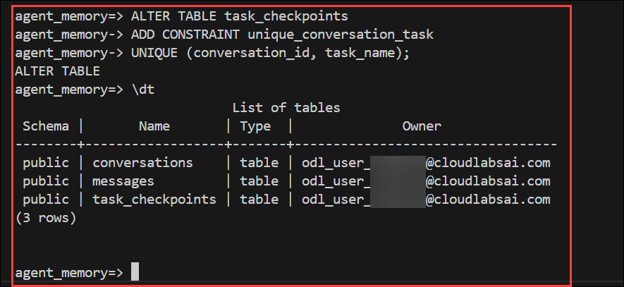

1. Enter `exit` to close the **psql** session and return to the terminal.

## Task 6: Test the agent memory workflow

In this task you run a test script to verify the tool functions work correctly. The *test_workflow.py* script is included in the project files and demonstrates creating conversations, storing messages, and managing task checkpoints.

1. Run the following command to navigate to the *agent-backend* directory.

    ```
    cd agent-backend
    ```

1. Run the following command to create a virtual environment for the *test_workflow.py*  app. Depending on your environment the command might be **python** or **python3**.

    ```
    python -m venv .venv
    ```

1. Run the following command to activate the Python environment. **Note:** On Linux/macOS, use the Bash command. On Windows, use the PowerShell command. If using Git Bash on Windows, use **source .venv/Scripts/activate**.

    **Bash**
    ```bash
    source .venv/Scripts/activate
    ```

    **PowerShell**
    ```powershell
    .\.venv\Scripts\Activate.ps1
    ```

    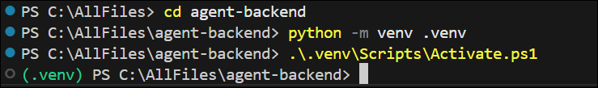

1. Run the following command to install the Python dependencies for the app. This installs the **psycopg** library for PostgreSQL connectivity and **azure-identity** for Microsoft Entra authentication.

    ```bash
    pip install -r requirements.txt
    ```

1. Run the following command to execute the test script. This script exercises all the agent tool functions you created.

    ```bash
    python test_workflow.py
    ```

1. You should see output showing each step completing successfully, demonstrating that the agent can create conversations, store messages, save task state, and retrieve history.

    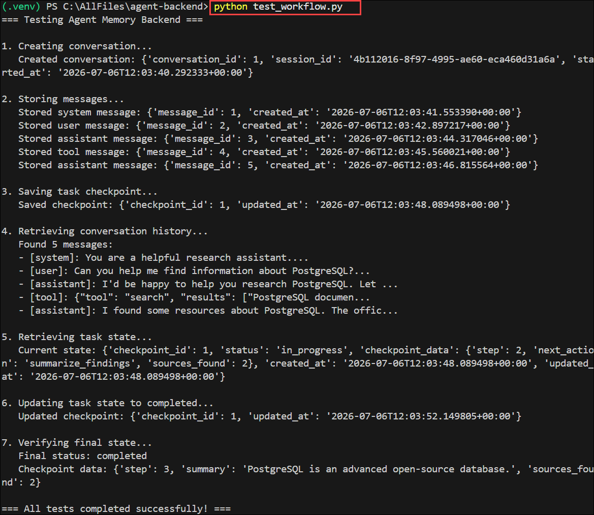

1. Optional: Open the **test_workflow.py** file and review the code.

## Task 7: Query conversation context

In this task you practice querying the data an agent would use to make decisions.

1. Run the following command to connect to the **agent_memory** database using the environment variables.

    **Bash**
    ```bash
    psql "host=$DB_HOST port=5432 dbname=agent_memory user=$DB_USER sslmode=require"
    ```

    **PowerShell**
    ```powershell
    psql "host=$env:DB_HOST port=5432 dbname=agent_memory user=$env:DB_USER sslmode=require"
    ```

    >**Tip:** When query results are displayed, psql uses a pager if it can't fit the results in the current terminal window. If it does, press **q** to exit the pager and return to the psql prompt. Maximizing the terminal window will reduce this from happening, and make it easier to review the results from the commands.

1. Run the following query to find all conversations for a specific user. The test script created a conversation with **user_id** set to **user_123**.

    ```sql
    SELECT id, session_id, started_at, metadata
    FROM conversations
    WHERE user_id = 'user_123'
    ORDER BY started_at DESC;
    ```

    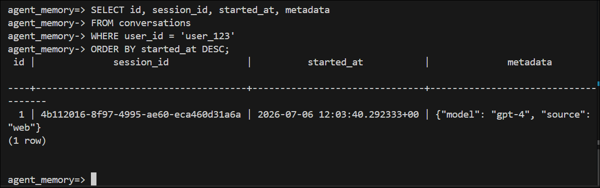

1. Run the following query to get recent messages across all conversations. This returns the messages stored by the test script.

    ```sql
    SELECT c.session_id, m.role, m.content, m.created_at
    FROM messages m
    JOIN conversations c ON m.conversation_id = c.id
    ORDER BY m.created_at DESC
    LIMIT 10;
    ```

1. Run the following query to find completed tasks. The test script updated the task status to **completed** at the end of the workflow.

    ```sql
    SELECT
        c.session_id,
        t.task_name,
        t.status,
        t.checkpoint_data,
        t.updated_at
    FROM task_checkpoints t
    JOIN conversations c ON t.conversation_id = c.id
    WHERE t.status = 'completed';
    ```

1. Run the following query to count messages by role in each conversation. This helps understand the distribution of user, assistant, system, and tool messages.

    ```sql
    SELECT
        c.id AS conversation_id,
        m.role,
        COUNT(*) AS message_count
    FROM conversations c
    JOIN messages m ON c.id = m.conversation_id
    GROUP BY c.id, m.role
    ORDER BY c.id, m.role;
    ```

1. Enter **quit** in the psql prompt to exit.

## Summary

In this lab, you built a PostgreSQL-based tool backend for AI agents. You deployed an Azure Database for PostgreSQL Flexible Server with Microsoft Entra authentication, created Python functions that agents can call to manage conversations and task state, and designed a database schema with tables for conversations, messages, and task checkpoints. You tested the workflow by running a script that simulated agent operations, then queried the stored data using SQL. This pattern enables AI agents to maintain persistent memory across sessions and resume interrupted tasks.

## You have successfully completed the Hands-on Lab!