# Lab 14: Optimize vector search performance in Azure Database for PostgreSQL

### Estimated Duration : 60 Minutes

## Overview

In this hands-on lab, you deploy an Azure Database for PostgreSQL instance and optimize it for vector search workloads. You create test data with vector embeddings, analyze baseline performance, build and compare IVFFlat and HNSW indexes, and tune search parameters. These techniques are essential for production AI applications that require fast similarity search across large datasets.

## Lab Objectives

In this lab, you'll perform the following tasks:

- **Task 1:** Prepare the environment

- **Task 2:** Create resources in Azure

- **Task 3:** Review vector index concepts

- **Task 4:** Complete the Azure resource deployment

- **Task 5:** Create the database schema and test data

- **Task 6:** Analyze baseline performance

- **Task 7:** Create and compare IVFFlat and HNSW indexes

- **Task 8:** Implement metadata filtering with indexes

### <span style="color:maroon">**Note:** This lab includes deployment scripts for both **Bash** and **PowerShell**. Click on the drop-down arrow ▶ to expand the commands for your preferred shell. Once you make your choice, use the corresponding commands throughout the entire lab.</span>

## Task 1: Prepare the environment

In this task, you'll prepare the development environment, configure the deployment script, and authenticate to Azure to begin deploying the required resources.

1. Launch **Visual Studio Code** (VS Code) from desktop.

   

1. Select **File Explorer (1)**, then **Open Folder (2)** from the menu.

   

1. Navigate to **C:\AllFiles (1)** and click **Select Folder (2)**.

   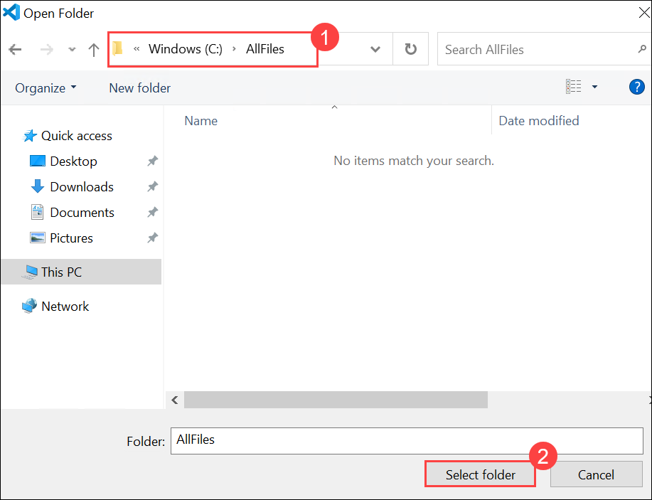

1. If you see the prompt, **Do you trust the authors of the files in this folder?**, click **Yes, I trust the authors**.

   

1. Once the folder opens in VS Code, select **Explorer (1)** and then **azdeploy.ps1 (2)**.

   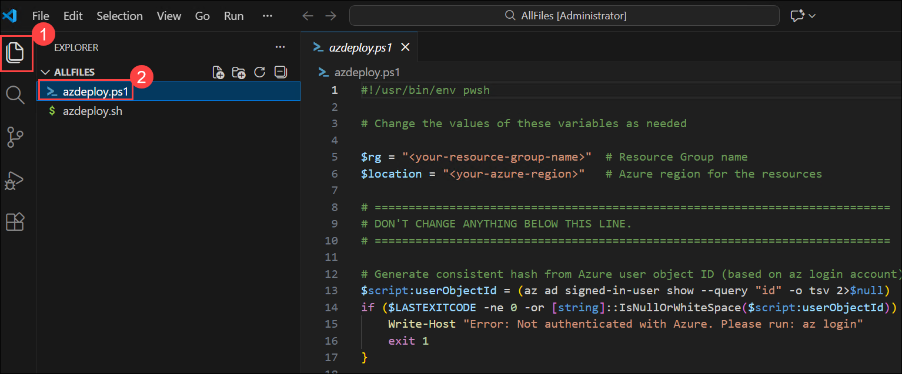

1. The project contains deployment scripts for both Bash (_azdeploy.sh_) and PowerShell (_azdeploy.ps1_). Open the appropriate file for your environment and change the two values: **Resource group name** as **<inject key="ResourceGroupName" enableCopy="false"/>** and **Azure Region** as **<inject key="Region" enableCopy="false"/>** at the top of the script to meet your needs.

   ```
   "<your-resource-group-name>" # Resource Group name
   "<your-azure-region>" # Azure region for the resources
   ```

   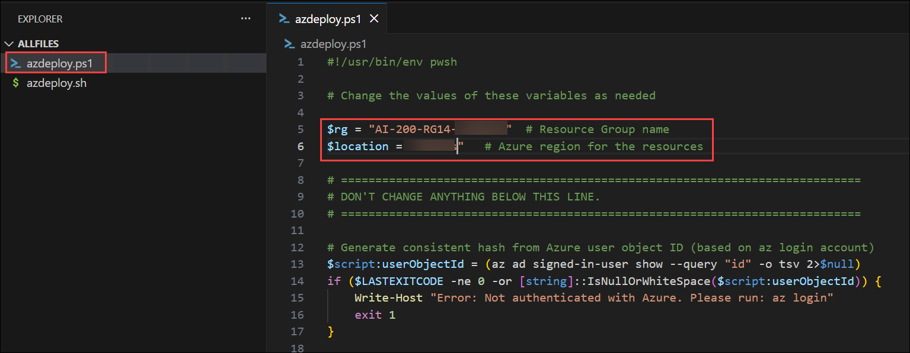

   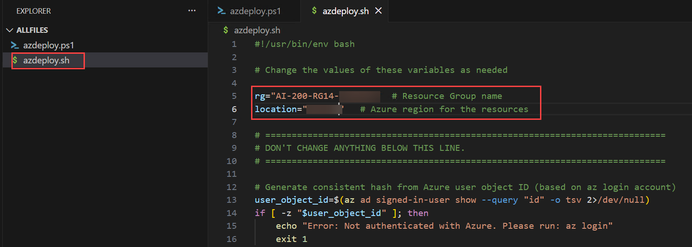

1. In the menu bar, select **File (1)** and select **Save All (2)** from drop-down.

   

1. In the menu bar, select **ellipsis (...) (1)**, then **Terminal (2)**, and then **New Terminal (3)** to open a terminal window in VS Code.

   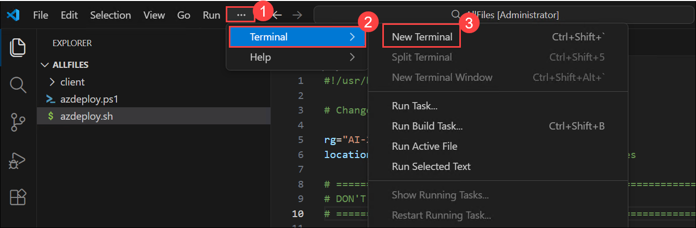

   > **NOTE:** If you are using Bash, after the terminal opens, click on the **+ (1)** icon to open a new terminal and select **Git Bash (2)** from the drop-down. If you are using PowerShell, skip this step.

   

1. Run the following command in the terminal to allow PowerShell scripts to run. This command is only required if you are using PowerShell. If you are using Bash, skip this step.

    <details>
     <summary>PowerShell</summary>

   ```
   Set-ExecutionPolicy -ExecutionPolicy bypass -Force
   ```

   

   </details>

1. Run the **following command (1)** to login to your Azure account. Next, **minimize the VS Code window (2)** to view the login window opened in background.

   ```
   az login
   ```

   

1. In the login window, select **Work or school account (1)** and click **Continue (2)**.

   

1. In the login window, kindly sign in using the provided **Azure credentials (1)** and click **Next (2)**.
   - **Email/Username:** <inject key="AzureAdUserEmail"></inject>

     

1. Next, enter the provided **Password (1)** and click **Sign in (2)**.
   - **Password:** <inject key="AzureAdUserPassword"></inject>

     

1. Next, select **No, this app only** and navigate back to VS Code to continue.

   

1. Answer the prompts to select your Azure account and subscription for the exercise.

   

   > **NOTE:** To confirm you're logged in to the correct Azure subscription, run **az account show**.

## Task 2: Create resources in Azure

In this task, you'll deploy an Azure Database for PostgreSQL Flexible Server with Microsoft Entra authentication and validate the resource deployment.

1. Make sure you are in the root directory of the project and run the appropriate command in the terminal to launch the deployment script.

   <details>
    <summary>Bash</summary>

   ```bash
   MSYS_NO_PATHCONV=1 bash azdeploy.sh
   ```

   </details>

   <details>
    <summary>PowerShell</summary>

   ```powershell
   ./azdeploy.ps1
   ```

   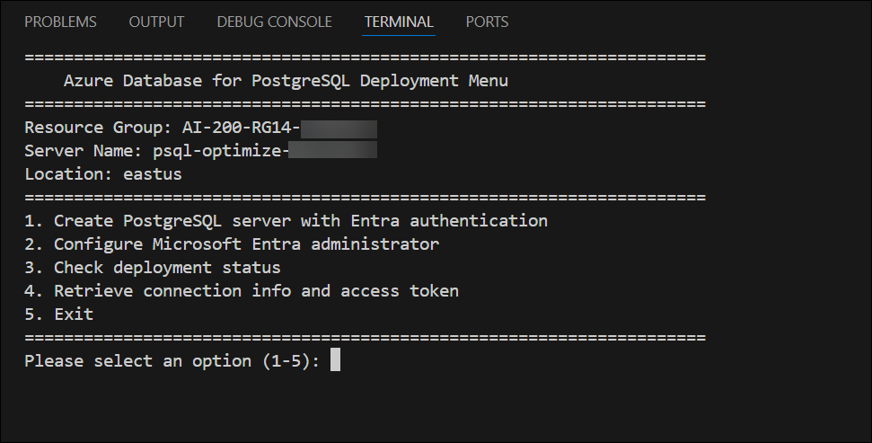

   </details>

1. When the script menu appears, enter **1** to launch the **Create PostgreSQL server with Entra authentication** option. This creates the server with Entra-only authentication enabled. **Note:** Deployment can take 5-10 minutes to complete.

   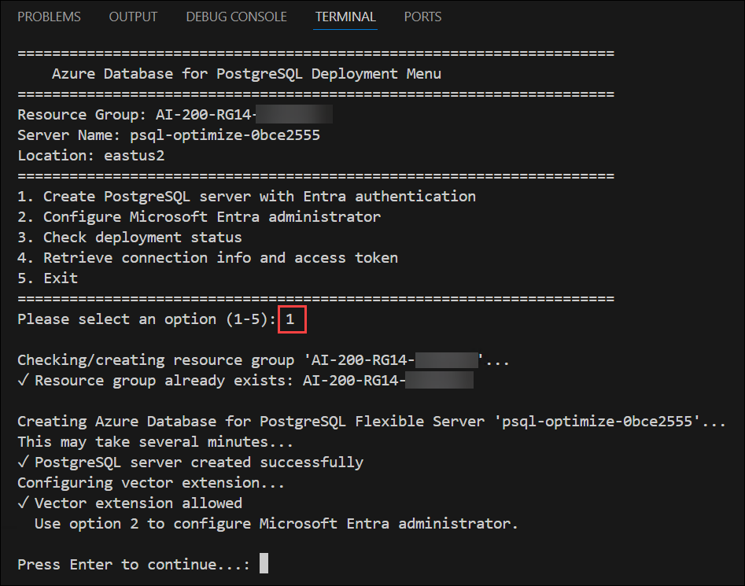

   > **IMPORTANT:** Leave the terminal running the deployment open for the duration of the exercise. You can move on to the next section of the exercise while the deployment continues in the terminal.

> **Congratulations** on completing the task! Now, it's time to validate it. Here are the steps:
>
> - If you receive a success message, you can proceed to the next task.
> - If not, carefully read the error message and retry the step, following the instructions in the lab guide.
> - If you need any assistance, please contact us at cloudlabs-support@spektrasystems.com. We are available 24/7 to help you out.

<validation step="8b6c2a97-574a-413e-b599-c4c497050079" />

## Task 3: Review vector index concepts

In this task, you'll review the concepts, trade-offs, and tuning parameters of IVFFlat and HNSW indexes for vector search workloads.

### 1. IVFFlat indexes

IVFFlat (Inverted File with Flat compression) divides vectors into clusters called **lists**. When searching, it only scans vectors in nearby clusters rather than the entire dataset.

Key parameters:

- **lists**: Number of clusters to create. A good starting point is `rows / 1000` for up to 1 million rows. More lists means faster searches but slower index builds.
- **probes**: Number of clusters to search at query time. Higher values improve recall (finding the true nearest neighbors) but increase latency.

### 2. HNSW indexes

HNSW (Hierarchical Navigable Small World) builds a multi-layer graph structure. Upper layers contain fewer nodes for fast navigation; lower layers contain more nodes for precise searching.

Key parameters:

- **m**: Maximum connections per node. Higher values improve recall but increase memory usage and build time. Default is 16.
- **ef_construction**: Size of the dynamic candidate list during index building. Higher values create better quality graphs but take longer to build. Default is 64.
- **ef_search**: Size of the dynamic candidate list during search. Higher values improve recall but increase latency. Default is 40.

  ### When to use each

  | Consideration      | IVFFlat             | HNSW                 |
  | ------------------ | ------------------- | -------------------- |
  | Build time         | Faster              | Slower               |
  | Query speed        | Fast                | Faster               |
  | Memory usage       | Lower               | Higher               |
  | Recall accuracy    | Good with tuning    | Better out of box    |
  | Update performance | Requires rebuilding | Supports incremental |

  For this exercise, you test both index types and measure the trade-offs firsthand.

## Task 4: Complete the Azure resource deployment

In this task, you'll complete the Azure resource deployment, configure Microsoft Entra authentication, and retrieve the database connection information.

1. When the **Create PostgreSQL server with Entra authentication** operation has completed, enter **2** to launch the **Configure Microsoft Entra administrator** option. This sets your Azure account as the database administrator.

   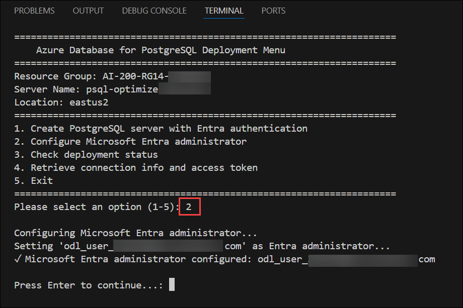

1. When the previous operation completes, enter **3** to launch the **Check deployment status** option. This verifies the server is ready.

   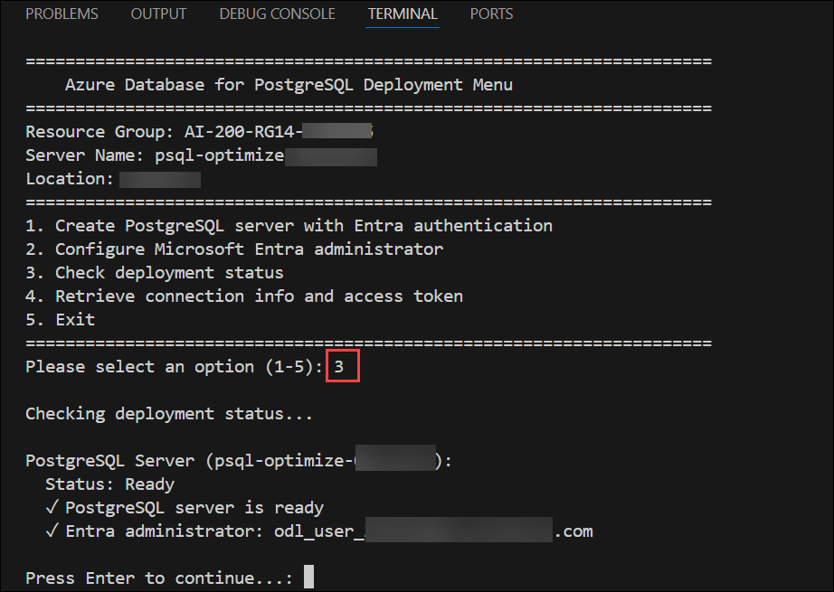

1. Enter **4** to launch the **Retrieve connection info and access token** option. This creates a file with the necessary environment variables.

   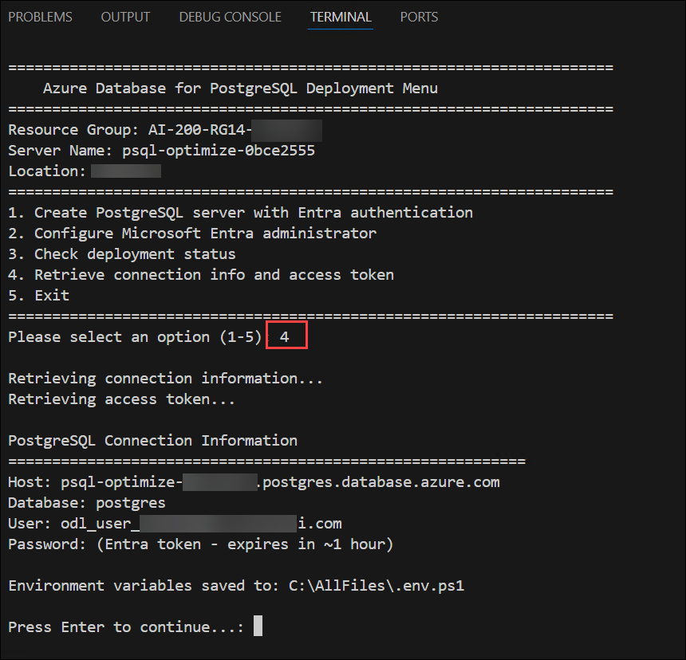

   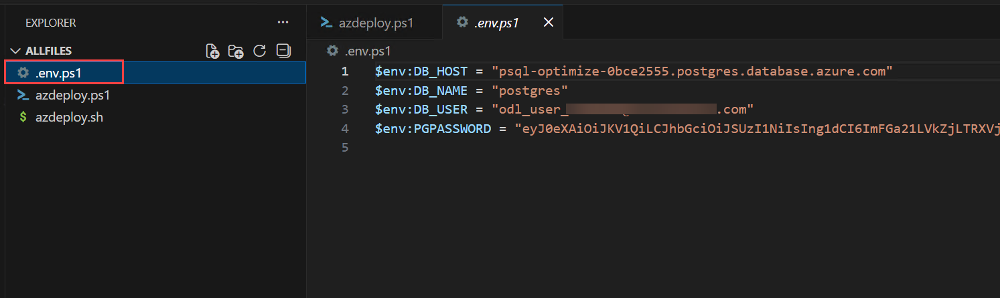

1. Enter **5** to exit the deployment script.

1. Run the following command to load the environment variables into your terminal session from the file created in a previous step.

   <details>
    <summary>Bash</summary>

   ```bash
   source .env
   ```

   </details>

   <details>
    <summary>PowerShell</summary>

   ```powershell
   . .\.env.ps1
   ```

   </details>

   > **Note:** Keep the terminal open. If you close it and create a new terminal, you might need to run the command to load the environment variables again.

   > **Note:** The access token expires after approximately one hour. If you need to reconnect later, run the script again and select option **4** to generate a new token, then export the variables again.

## Task 5: Create the database schema and test data

In this task, you'll enable the pgvector extension, create the database schema, and generate sample data with vector embeddings for performance testing.

1. Run the following command to connect to the server using the environment variables. The **PGPASSWORD** environment variable is automatically used for authentication.

   <details>
    <summary>Bash</summary>

   ```bash
   psql "host=$DB_HOST port=5432 dbname=$DB_NAME user=$DB_USER sslmode=require"
   ```

   </details>

   <details>
    <summary>PowerShell</summary>

   ```powershell
   psql "host=$env:DB_HOST port=5432 dbname=$env:DB_NAME user=$env:DB_USER sslmode=require"
   ```

   </details>

   > **Tip:** When query results are displayed, psql uses a pager if it can't fit the results in the current terminal window. If it does, press **q** to exit the pager and return to the psql prompt. Maximizing the terminal window will reduce this from happening, and make it easier to review the results from the commands.

1. Run the following command to enable the pgvector extension. PostgreSQL extensions must be explicitly enabled before use. The pgvector extension adds the **vector** data type and operators like **<=>** (cosine distance) that you use throughout this exercise. Azure Database for PostgreSQL includes pgvector but doesn't enable it by default.

   ```sql
   CREATE EXTENSION IF NOT EXISTS vector;
   ```

   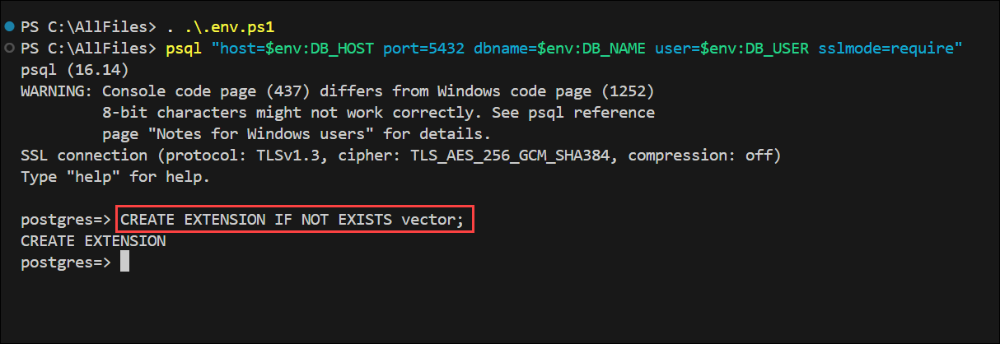

1. Run the following command to create the products table with a vector column. The **vector(384)** data type stores 384-dimensional embeddings, a common size for sentence embedding models.

   ```sql
   CREATE TABLE products (
       id BIGSERIAL PRIMARY KEY,
       name TEXT NOT NULL,
       category_id INTEGER NOT NULL,
       price NUMERIC(10,2) NOT NULL,
       in_stock BOOLEAN DEFAULT true,
       embedding vector(384)
   );
   ```

1. Run the following command to generate test data with random embeddings. This creates 100,000 products with random 384-dimensional vectors.

   ```sql
   INSERT INTO products (name, category_id, price, in_stock, embedding)
   SELECT
       'Product ' || i,
       (random() * 20)::int + 1,
       (random() * 1000)::numeric(10,2),
       random() > 0.1,
       ('[' || array_to_string(ARRAY(
           SELECT (random() * 2 - 1)::float4
           FROM generate_series(1, 384)
       ), ',') || ']')::vector
   FROM generate_series(1, 100000) AS i;
   ```

1. Run the following command to verify the data was created. You should see 100,000 rows.

   ```sql
   SELECT COUNT(*) FROM products;
   ```

   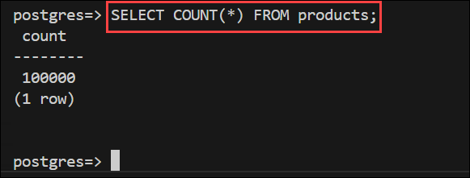

1. Run the following command to create a query vector for consistent testing. This temporary table stores a random embedding you use throughout the exercise.

   ```sql
   CREATE TEMP TABLE query_vectors AS
   SELECT ('[' || array_to_string(ARRAY(
       SELECT (random() * 2 - 1)::float4
       FROM generate_series(1, 384)
   ), ',') || ']')::vector AS embedding;
   ```

## Task 6: Analyze baseline performance

In this task, you'll measure the performance of vector similarity queries without indexes to establish a baseline for comparison.

1. Run the following command to execute a vector similarity query and capture the execution plan.

   ```sql
   EXPLAIN ANALYZE
   SELECT id, name, embedding <=> (SELECT embedding FROM query_vectors) AS distance
   FROM products
   ORDER BY embedding <=> (SELECT embedding FROM query_vectors)
   LIMIT 10;
   ```

1. Examine the output. You should see a **Seq Scan** in the plan, indicating PostgreSQL is scanning all 100,000 rows. Note the **Execution Time** value at the bottom.

   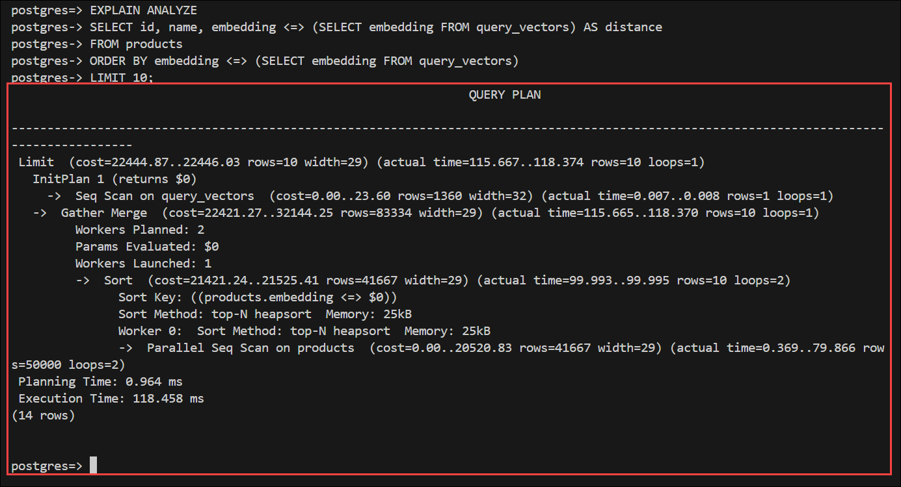

1. Run the query two more times to get consistent measurements. The first run might be slower due to cold caches. Record the last execution time as your baseline.

## Task 7: Create and compare IVFFlat and HNSW indexes

In this task, you'll create IVFFlat and HNSW indexes, tune their search parameters, and compare their performance and accuracy.

### Task 7.1: Create an IVFFlat index

1. Run the following command to create an IVFFlat index. For 100,000 rows, 100 lists is a reasonable starting point (using the `rows / 1000` guideline). Note the time taken to build the index.

   ```sql
   CREATE INDEX idx_products_embedding_ivfflat
   ON products USING ivfflat (embedding vector_cosine_ops)
   WITH (lists = 100);
   ```

1. Run the following command to execute the same query with the IVFFlat index. Verify the plan shows **Index Scan using idx_products_embedding_ivfflat**. Record the execution time.

   ```sql
   EXPLAIN ANALYZE
   SELECT id, name, embedding <=> (SELECT embedding FROM query_vectors) AS distance
   FROM products
   ORDER BY embedding <=> (SELECT embedding FROM query_vectors)
   LIMIT 10;
   ```

1. Run the following command to test with low probes. This is faster but might miss the true nearest neighbors than a full scan since it only searches one cluster. The recall impact isn't visible in timing output - you'd need to compare actual results to measure it.

   ```sql
   SET ivfflat.probes = 1;
   EXPLAIN ANALYZE
   SELECT id, name, embedding <=> (SELECT embedding FROM query_vectors) AS distance
   FROM products
   ORDER BY embedding <=> (SELECT embedding FROM query_vectors)
   LIMIT 10;
   ```

1. Run the following command to test with high probes (slower, higher recall). Record the execution time.

   ```sql
   SET ivfflat.probes = 50;
   EXPLAIN ANALYZE
   SELECT id, name, embedding <=> (SELECT embedding FROM query_vectors) AS distance
   FROM products
   ORDER BY embedding <=> (SELECT embedding FROM query_vectors)
   LIMIT 10;
   ```

### Task 7.2: Create an HNSW index

1. Run the following command to drop the IVFFlat index so you can test HNSW independently.

   ```sql
   DROP INDEX idx_products_embedding_ivfflat;
   ```

1. Run the following command to increase the memory available for index building. HNSW indexes require more memory during construction than IVFFlat.

   ```sql
   SET maintenance_work_mem = '256MB';
   ```

   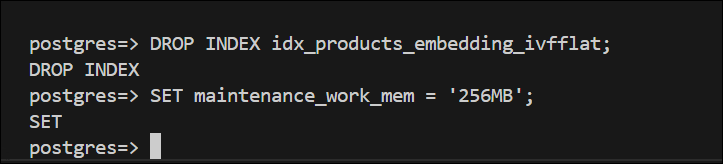

1. Run the following command to create an HNSW index. Note the build time, which is typically longer than IVFFlat.

   ```sql
   CREATE INDEX idx_products_embedding_hnsw
   ON products USING hnsw (embedding vector_cosine_ops)
   WITH (m = 16, ef_construction = 64);
   ```

1. Run the following command to execute the query with the HNSW index.

   ```sql
   EXPLAIN ANALYZE
   SELECT id, name, embedding <=> (SELECT embedding FROM query_vectors) AS distance
   FROM products
   ORDER BY embedding <=> (SELECT embedding FROM query_vectors)
   LIMIT 10;
   ```

1. Run the following command to test with low ef_search. This is faster but might miss some true nearest neighbors since the search explores fewer candidate paths. The recall impact isn't visible in timing output.

   ```sql
   SET hnsw.ef_search = 20;
   EXPLAIN ANALYZE
   SELECT id, name, embedding <=> (SELECT embedding FROM query_vectors) AS distance
   FROM products
   ORDER BY embedding <=> (SELECT embedding FROM query_vectors)
   LIMIT 10;
   ```

1. Run the following command to test with high ef_search (higher recall). Record the execution time.

   ```sql
   SET hnsw.ef_search = 100;
   EXPLAIN ANALYZE
   SELECT id, name, embedding <=> (SELECT embedding FROM query_vectors) AS distance
   FROM products
   ORDER BY embedding <=> (SELECT embedding FROM query_vectors)
   LIMIT 10;
   ```

   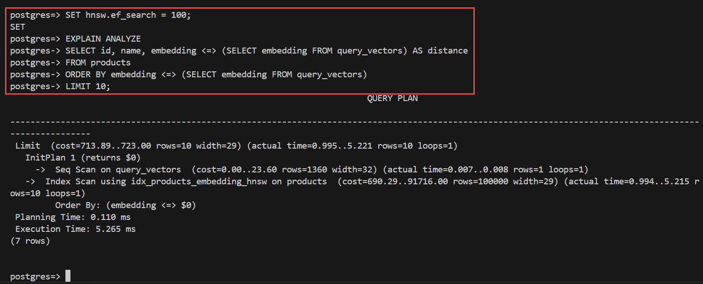

### Compare your results

Compare your execution times across the different configurations. You should observe:

- **Sequential scan** is the slowest since it examines all 100,000 rows
- **IVFFlat with probes=1** is the fastest indexed option but might miss some true nearest neighbors
- **HNSW** generally provides faster queries than IVFFlat at similar recall levels
- Increasing **probes** (IVFFlat) or **ef_search** (HNSW) improves accuracy but increases latency

## Task 8: Implement metadata filtering with indexes

In this task, you'll combine vector similarity searches with metadata filters and evaluate how additional indexes improve query performance.

1. Run the following command to create a B-tree index on the category column.

   ```sql
   CREATE INDEX idx_products_category ON products (category_id);
   ```

1. Run the following command to execute a filtered vector search. Examine the execution plan - you should see PostgreSQL using the HNSW index for vector similarity and then applying the category filter. Note the execution time.

   ```sql
   EXPLAIN ANALYZE
   SELECT id, name, embedding <=> (SELECT embedding FROM query_vectors) AS distance
   FROM products
   WHERE category_id = 5
   ORDER BY embedding <=> (SELECT embedding FROM query_vectors)
   LIMIT 10;
   ```

1. Run the following command to test with a more selective filter. With multiple filter conditions, you might see a **Bitmap Index Scan** on the B-tree index combined with post-filtering, or the planner might choose a different strategy. Compare the execution time to the previous query.

   ```sql
   EXPLAIN ANALYZE
   SELECT id, name, embedding <=> (SELECT embedding FROM query_vectors) AS distance
   FROM products
   WHERE category_id = 5 AND price BETWEEN 100 AND 200
   ORDER BY embedding <=> (SELECT embedding FROM query_vectors)
   LIMIT 10;
   ```

   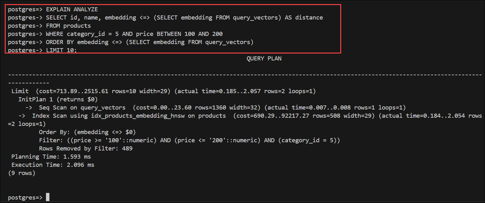

1. Run the following command to create a composite index for the filter combination.

   ```sql
   CREATE INDEX idx_products_category_price ON products (category_id, price);
   ```

1. Re-run the previous query and compare the execution plan. The composite index might allow PostgreSQL to filter more efficiently before or alongside the vector search, potentially reducing execution time.

   ```sql
   EXPLAIN ANALYZE
   SELECT id, name, embedding <=> (SELECT embedding FROM query_vectors) AS distance
   FROM products
   WHERE category_id = 5 AND price BETWEEN 100 AND 200
   ORDER BY embedding <=> (SELECT embedding FROM query_vectors)
   LIMIT 10;
   ```

   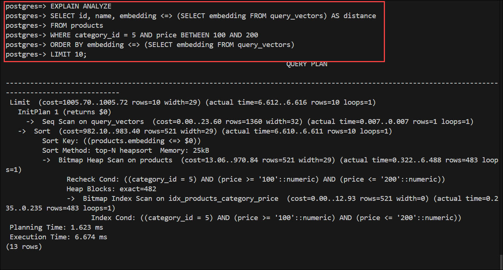

## Summary

In this lab, you:

- Deployed an **Azure Database** for **PostgreSQL** Flexible Server with Microsoft Entra authentication.
- Created a test dataset with 100,000 vector embeddings.
- Established baseline performance for vector queries without indexes.
- Created and compared **IVFFlat** and **HNSW** indexes.
- Tuned index parameters (**probes** and **ef_search**) to balance accuracy and speed.
- Implemented metadata filtering with B-tree indexes.

These techniques enable you to optimize Azure Database for PostgreSQL for production vector search workloads.

## You have successfully completed the Hands-on Lab!
