# Lab 06: Deploy an AI inference API to Azure Kubernetes Service

### Estimated Duration : 60 Minutes

## Lab overview

In this exercise, you deploy Azure resources including a Microsoft Foundry AI model, Azure Container Registry (ACR), and Azure Kubernetes Service (AKS) cluster. You then complete Kubernetes manifest files to define container specifications, health probes, resource limits, and load balancing. After deploying the containerized API to AKS, you use a Python client application to test the deployed API endpoints including health checks, readiness validation, and AI model inference requests.

## Lab objectives

In this lab, you'll perform the following tasks:

- **Task 1:** Prepare the environment
- **Task 2:** Deploy resources to Azure
- **Task 3:** Complete the YAML deployment files and deploy to AKS
- **Task 4:** Run the client app

> ### **Note:** This lab includes deployment scripts for both **PowerShell** and **Bash**. You may choose either scripting language based on your preference or environment. Once you make your choice, use the corresponding commands and script throughout the entire lab, as all subsequent steps provide instructions for both PowerShell and Bash.

## Task 1: Prepare the environment and deploy Azure resources

In this task, you'll prepare the deployment environment, configure the deployment script, authenticate to Azure, register the required resource providers, and provision the Azure resources needed for the lab, including a Microsoft Foundry model, Azure Container Registry (ACR), and an Azure Kubernetes Service (AKS) cluster.

1. Launch **Visual Studio Code** (VS Code) from desktop.

   

1. Select **File Explorer (1)** from left panel. Click **Open Folder** in the menu.

   

1. Navigate to **C:\AllFiles (1)** folder containing the project files and click on **Select folder (2)**.

   

1. If you get "Do you trust the authors of the files in this folder?" prompt, click **Yes, I trust the authors**.

   

1. The project contains deployment scripts for both Bash (_azdeploy.sh_) and PowerShell (_azdeploy.ps1_). Open the appropriate file for your environment and change the two values: **Resource group name** as **<inject key="ResourceGroupName" enableCopy="false"/>** and **Azure Region** as **<inject key="Region" enableCopy="false"/>** at the top of the script to meet your needs.

   ```
   "<your-resource-group-name>" # Resource Group name
   "<your-azure-region>" # Azure region for the resources
   ```

   

   

   > **Note:** It is recommended to use one of the following three Azure regions for deployment: **eastus2**, **swedencentral**, or **australiaeast**. These regions support the deployment of the AI inference model used in the exercise.

1. In the menu bar, select **File (1)** and select **Save All (2)** from drop-down.

   

1. In the menu bar, select **ellipsis (...) (1)**, then **Terminal (2)**, and then **New Terminal (3)** to open a terminal window in VS Code.

   

   > **NOTE:** If you are using Bash, after the terminal opens, click on the **+ (1)** icon to open a new terminal and select **Git Bash (2)** from the drop-down. If you are using PowerShell, skip this step.
   >
   > 

1. Run the following command in the terminal to allow PowerShell scripts to run. This command is only required if you are using PowerShell. If you are using Bash, skip this step.

   ```
   Set-ExecutionPolicy -ExecutionPolicy bypass -Force
   ```

   

1. Run the **following command (1)** to login to your Azure account. Next, **minimize the VS Code window (2)** to view the login window opened in background.

   ```
   az login
   ```

   

1. In the login window, select **Work or school account (1)** and click **Continue (2)**.

   

1. In the login window, kindly sign in using the provided **Azure credentials (1)** and click **Next (2)**.
   - **Email/Username:** <inject key="AzureAdUserEmail"></inject>

     

1. Next, enter the provided **Password (1)** and click **Sign in (2)**.
   - **Password:** <inject key="AzureAdUserPassword"></inject>

     

1. Next, select **No, this app only** and navigate back to VS Code to continue.

   

1. Answer the prompts to select your Azure account and subscription for the exercise.

   

   > **NOTE:** To confirm you're logged in to the correct Azure subscription, run **az account show**.

1. Make sure you are in the root directory of the project and run the appropriate command in the terminal to launch the deployment script.

   **Bash**

   ```bash
   MSYS_NO_PATHCONV=1 bash azdeploy.sh
   ```

   **PowerShell**

   ```powershell
   ./azdeploy.ps1
   ```

## Task 2: Deploy resources to Azure

In this task, you'll use the deployment script to provision the Microsoft Foundry model, Azure Container Registry (ACR), and Azure Kubernetes Service (AKS) cluster, and verify that all required Azure resources have been deployed successfully.

1. Enter **1** to launch the **1. Provision gpt-5-mini model in Microsoft Foundry** option. This option creates the resource group if it doesn't already exist, creates the resource in MIcrosoft Foundry, and deploys the **gpt-5-mini** model to the resource.

   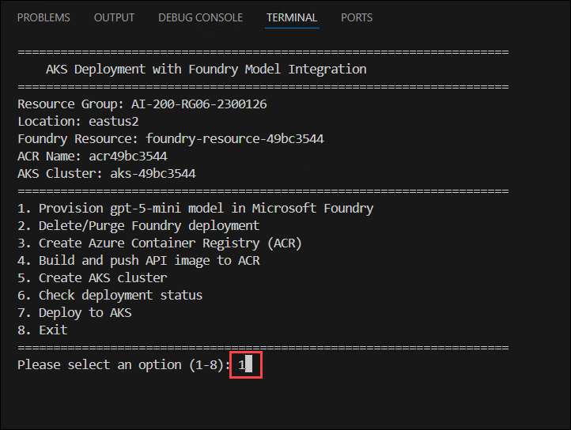

   > **Important:** If there are errors during the model deployment, enter **2** to launch the **2. Delete/Purge Foundry deployment** option. This will delete the deployment and purge the resource name. Exit the menu, and change the region in the deployment script to one of the other recommended regions. Then restart the deployment script and run the model provisioning option again.

1. Once the installation is complete, press **Enter** to continue.

   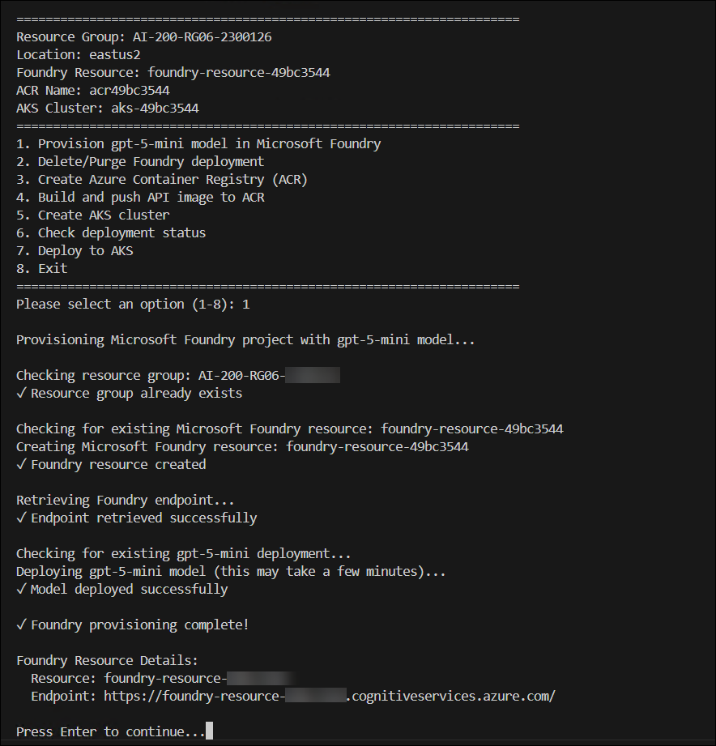

1. After the model is deployed, enter **3** to launch **3. Create Azure Container Registry (ACR)**. This creates the resource where the API container will be stored, and later pulled into the AKS resource.

   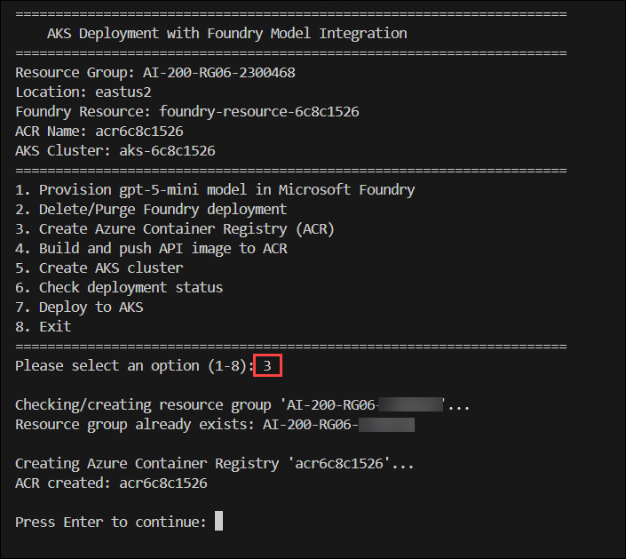

1. After the ACR resource has been created, enter **4** to launch **Build and push API image to ACR**. This option uses ACR tasks to build the image and add it to the ACR repository. This operation can take 3-5 minutes to complete.

   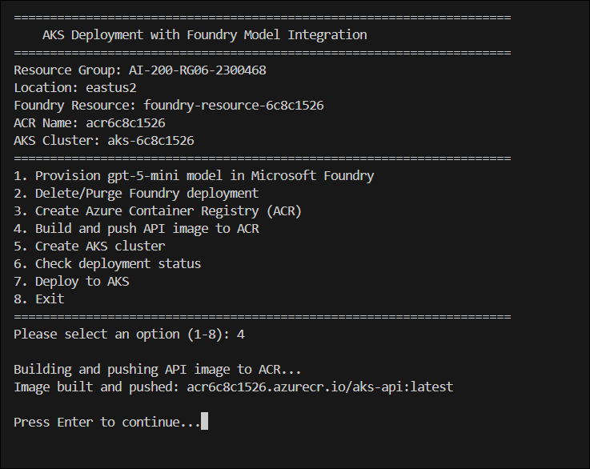

1. After the image has been built and pushed to ACR, enter **5** to launch the **5. Create AKS cluster** option. This creates the AKS resource configured with a managed identity and gives the service permission to pull images from the ACR resource. This operation can take 5-10 minutes to complete.

   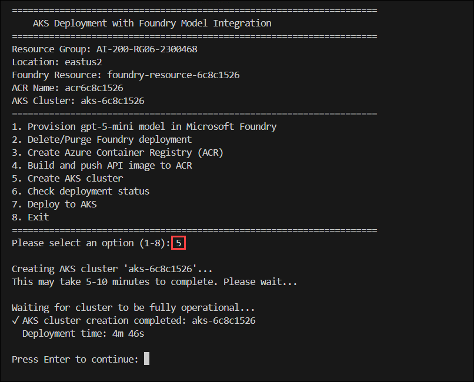

   > **Note:** If the deployment reports a failure after the AKS cluster has been created, you can safely ignore the message and proceed to the next step. In this lab environment, the deployment may complete successfully even if the script displays a failure message due to permission limitations.

1. After the AKS resources has been deployed, enter **6** to launch the **6. Check deployment status** option. This option reports if each of the three resources have been successfully deployed.

   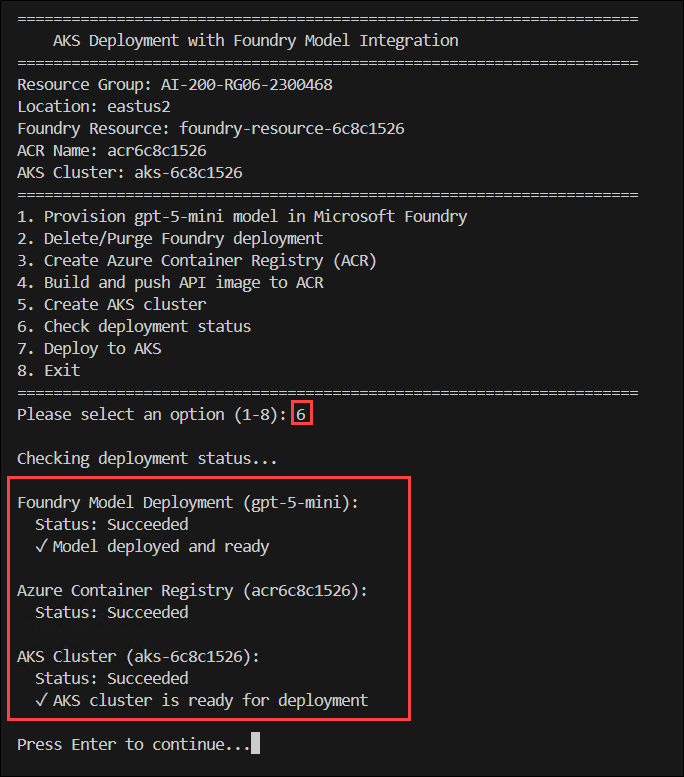

1. If all of the services return a **successful** message, enter **8** to exit the deployment script.

Next, you complete the YAML files necessary to deploy the API to AKS.

> **Congratulations** on completing the task! Now, it's time to validate it. Here are the steps:
>
> - If you receive a success message, you can proceed to the next task.
> - If not, carefully read the error message and retry the step, following the instructions in the lab guide.
> - If you need any assistance, please contact us at cloudlabs-support@spektrasystems.com. We are available 24/7 to help you out.

<validation step="863f232b-c9d4-43e5-9cd0-34977f36a254" />

## Task 3: Complete the YAML deployment files and deploy to AKS

In this task, you'll complete the Kubernetes deployment and service manifests, deploy the containerized AI inference API to Azure Kubernetes Service (AKS), and verify that the application is running successfully.

1. Open the **k8s/deployment.yaml** file to begin completing the file.

   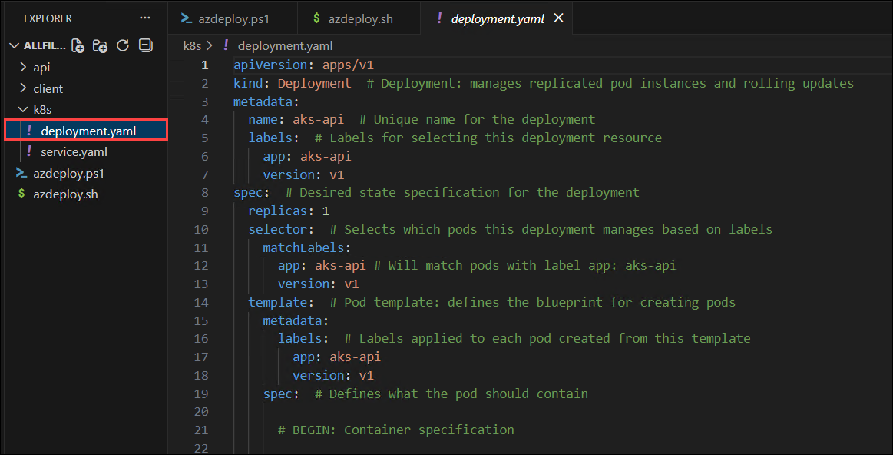

1. Locate the **# BEGIN: Container specification** comment and add the following YAML section to the manifest under the comment. Ensure YAML indentation is correct.

   ```yml
   containers: # List of containers to run in the pod
     - name: api
       image: ACR_ENDPOINT/aks-api:latest # Container image from ACR
       imagePullPolicy: Always # Always pull the latest image from registry
       ports: # Ports exposed by the container
         - name: http
           containerPort: 8000
           protocol: TCP
   ```

   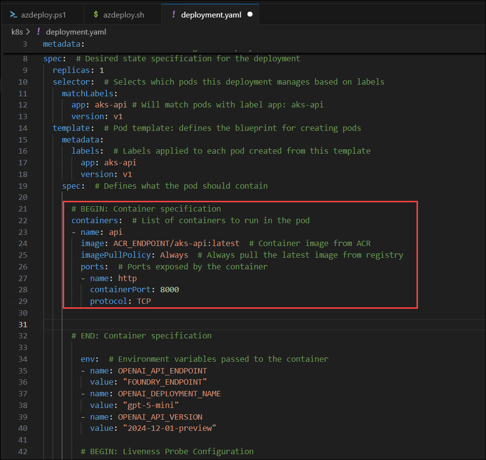

   This section defines the container specification, including which container image to use from ACR, the pull policy, and which port the container exposes for HTTP traffic.

1. Locate the **# BEGIN: Liveness Probe Configuration** comment and add the following YAML section to the manifest under the comment. Ensure YAML indentation is correct.

   ```yml
   livenessProbe: # Detects if container is alive or needs restart
     httpGet:
       path: /healthz # Health check endpoint path
       port: http
     initialDelaySeconds: 10 # Seconds to wait before first check
     periodSeconds: 30
     timeoutSeconds: 5
     failureThreshold: 3 # Consecutive failures before restarting container
   ```

   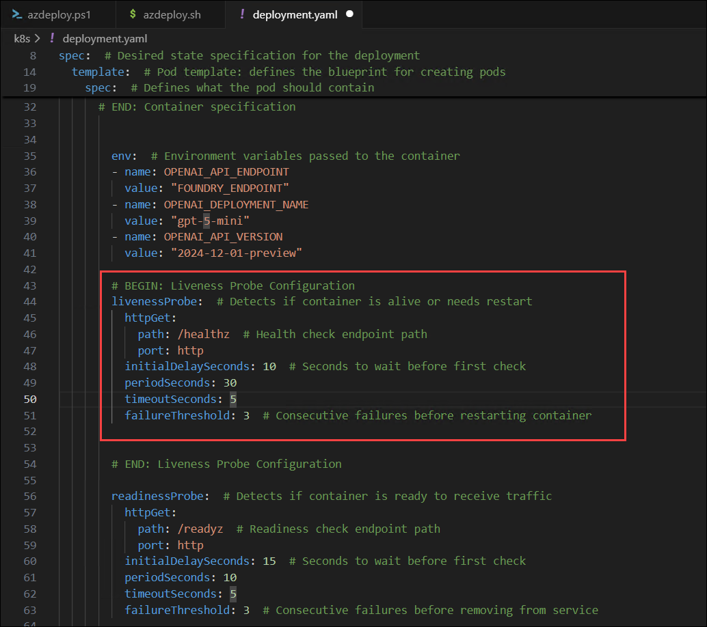

   This section configures the liveness probe, which periodically checks if the container is healthy by making HTTP requests to the **/healthz** endpoint. If the probe fails three consecutive times, Kubernetes automatically restarts the container.

1. Locate the **# BEGIN: Resource Limits Configuration** comment and add the following YAML section to the manifest under the comment. Ensure YAML indentation is correct.

   ```yml
   resources: # CPU and memory resource specifications
     requests: # Minimum resources guaranteed to the container
       memory: "256Mi"
       cpu: "250m"
     limits: # Maximum resources the container can use
       memory: "512Mi"
       cpu: "500m"
   ```

   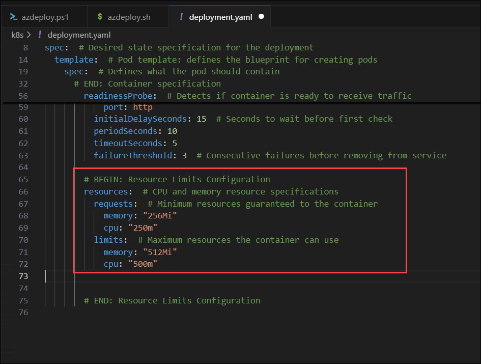

   This section defines the CPU and memory resources for the container. Requests specify the minimum resources guaranteed, while limits set the maximum resources the container can consume. This helps Kubernetes schedule pods efficiently and prevents resource starvation.

1. Save your changes using **Ctrl + S** and take a few minutes to review the completed **deployment.yaml** file.

### Next, you update the _service.yaml_ file.

1. Open the **k8s/service.yaml** to complete the file.

   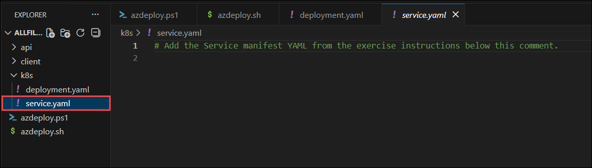

1. Add the following YAML to the manifest. Ensure YAML indentation is correct.

   ```yml
   apiVersion: v1
   kind: Service # Service: exposes pods on a network and provides load balancing
   metadata:
     name: aks-api-service # Unique name for the service
     labels:
       app: aks-api # Matches deployment and pod labels
     annotations:
       service.beta.kubernetes.io/azure-load-balancer-internal: "false" # Use public load balancer
   spec: # Service specification
     type: LoadBalancer # Exposes service externally
     selector: # Selects which pods to route traffic to based on labels
       app: aks-api
       version: v1
     ports: # Port mappings between service and pods
       - name: http
         port: 80 # Service port exposed externally
         targetPort: http # Pod container port to forward traffic to
         protocol: TCP
     sessionAffinity: None # Client requests not pinned to specific pods
   ```

   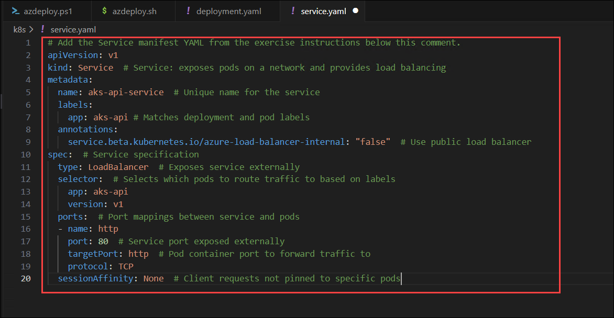

   This manifest creates a LoadBalancer Service that exposes your API pods externally through an Azure Load Balancer. It routes incoming traffic on port 80 to the container's port 8000, using label selectors to identify which pods should receive traffic.

1. Save your changes using **Ctrl + S** and take a few minutes to review the file.

### Task 3.2: Apply the manifests to AKS

In this section you use the deployment script to apply the manifests to AKS.

1. Install kubectl and add it to your current terminal session by running the following commands. Execute both commands in sequence.

   **Bash**

   ```bash
   az aks install-cli
   export PATH=$PATH:/c/Users/azureuser/.azure-kubectl
   ```

   **PowerShell**

   ```powershell
   az aks install-cli
   $env:PATH += ";$env:USERPROFILE\.azure-kubectl"
   ```

1. Close the existing bash/powershell terminal by clicking on the **Kill(Delete)** and open a new bash/powershell terminal.

   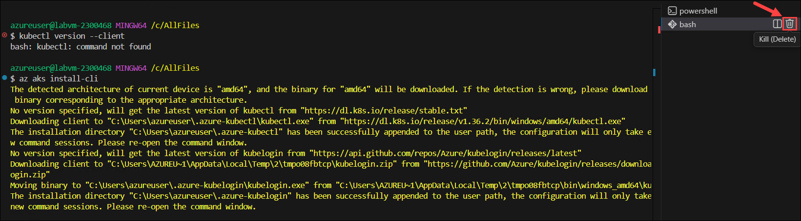

1. Make sure you are in the root directory of the project and run the appropriate command in the terminal to launch the deployment script.

   **Bash**

   ```bash
   MSYS_NO_PATHCONV=1 bash azdeploy.sh
   ```

   **PowerShell**

   ```powershell
   ./azdeploy.ps1
   ```

1. Enter **7** to launch the **7. Deploy to AKS** option. This option performs several operations: it retrieves your AKS credentials and configures kubectl, assigns the **Cognitive Services OpenAI User** role to the AKS kubelet managed identity so the API can authenticate to Foundry using Microsoft Entra ID, updates the deployment manifest with your ACR endpoint and Foundry endpoint, and then uses **kubectl apply** to deploy both manifests to your AKS cluster. When the operation is complete, enter **8** to exit the deployment script.

   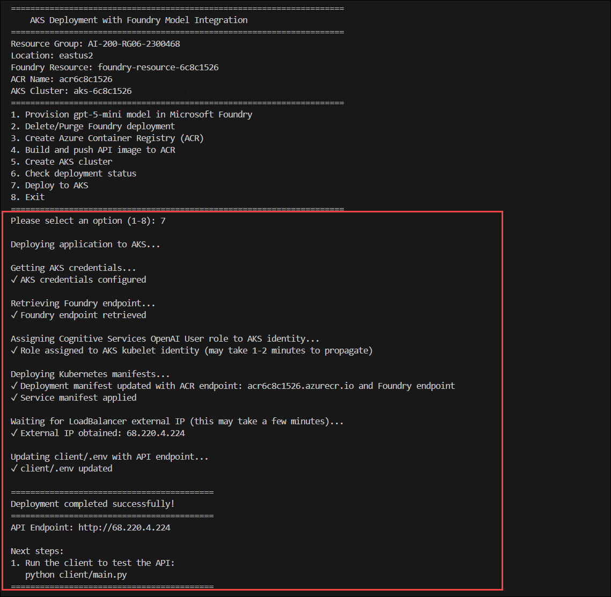

1. Run the following commands in the terminal to verify the deployment. Expect **kubectl get deploy,svc** to show the Deployment **READY** as **1/1** (or your replica count) and the Service **EXTERNAL-IP** to have a public IP (not **\<pending>**). The rollout command should print **deployment "aks-api" successfully rolled out** when the update is complete.

   ```
   kubectl get deploy,svc
   kubectl rollout status deploy/aks-api
   ```

   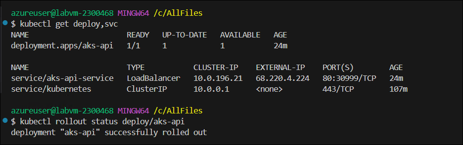

## Task 4: Run the client app

In this task, you'll configure the Python environment, run the client application, and validate the deployed AI inference API by performing health checks, readiness validation, and AI inference requests.

### Task 4.1: Configure the Python environment

In this section, you create the Python environment and install the dependencies.

1. In the terminal, navigate to the project's `client` folder by running the following command:

   ```bash
   cd client
   ```

   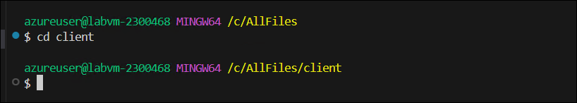

1. Run the following command in the VS Code terminal to create the Python environment.

   ```
   python -m venv .venv
   ```

1. Run the following command to activate the Python environment.

   **Bash**

   ```bash
   source .venv/Scripts/activate
   ```

   **PowerShell**

   ```powershell
   .\.venv\Scripts\Activate.ps1
   ```

1. Run the following command in the VS Code terminal to install the dependencies.

   ```
   pip install -r requirements.txt
   ```

### Task 4.2: Perform operations with the app

Now it's time to run the client application to perform various operations on the API. The app provides a menu-driven interface.

1. Run the following command in the terminal to start the console app. Refer to the commands from earlier in the exercise to activate the environment, if needed, before running the command.

   ```
   python main.py
   ```

1. Enter **1** to start the **1. Check API Health (Liveness)** option. This verifies that the API container is running and responds to health checks, which is the same endpoint used by the Kubernetes liveness probe.

   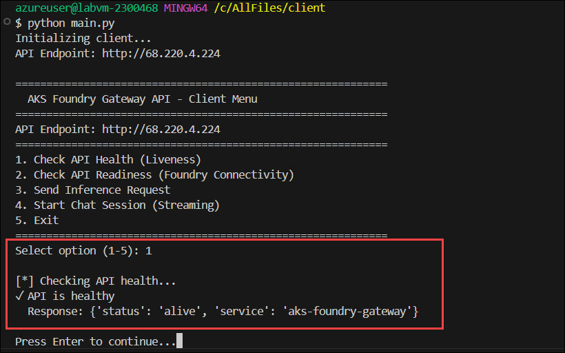

1. Enter **2** to start the **2. Check API Readiness (Foundry Connectivity)** option. This confirms the API can successfully connect to the Foundry model endpoint and is ready to process inference requests.

   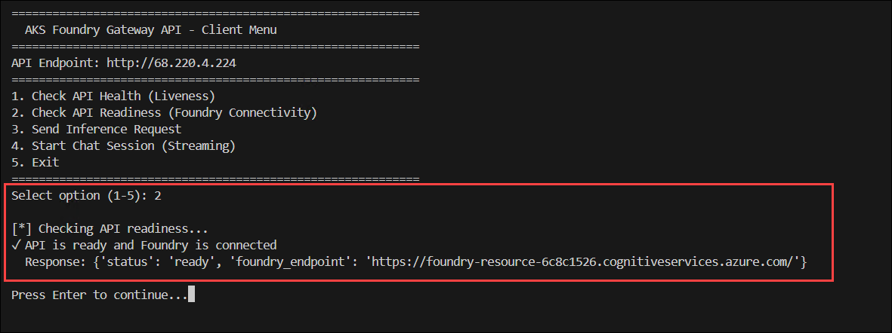

1. Enter **3** to start the **3. Send Inference Request** option. This sends a single prompt to the API and receives a complete response from the deployed model. Single inference requests are useful for batch processing, automated tasks, or when you need the entire response at once for further processing.

   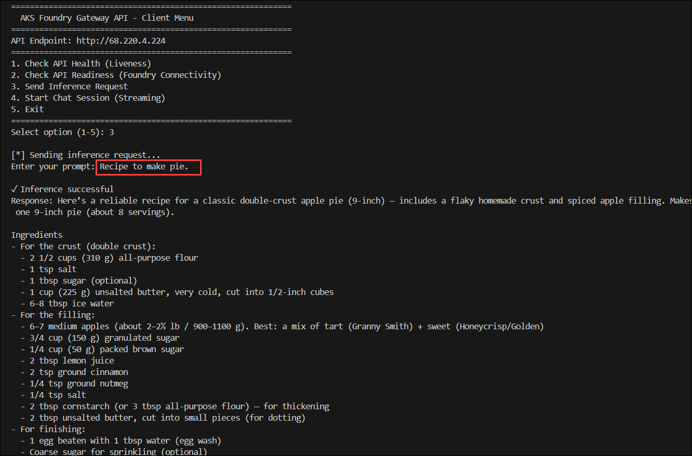

1. Enter **4** to start the **4. Start Chat Session (Streaming)** option. This starts an interactive chat session where responses from the model are streamed in real-time as they're generated.

   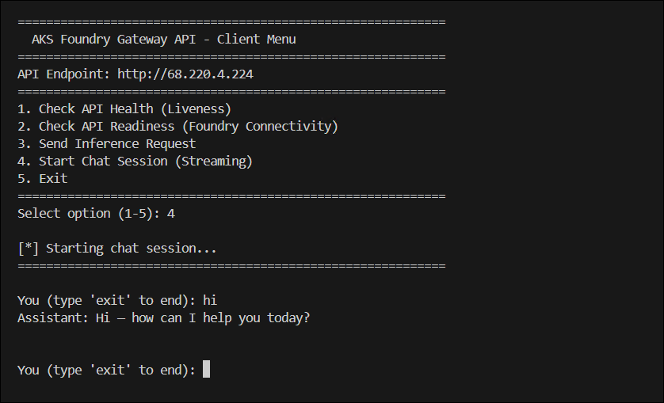

1. When you're finished enter **5** to exit the app.

### Summary

In this lab, you deployed a containerized AI inference API to Azure Kubernetes Service (AKS) by provisioning the required Azure resources, including a Microsoft Foundry model, Azure Container Registry (ACR), and an AKS cluster. You configured Kubernetes deployment and service manifests, deployed the API to AKS, and validated the deployment by using a Python client application to perform health checks, readiness validation, and AI inference requests.

## You have successfully completed the Hands-on Lab!
