# Lab 07: Configure apps on Azure Kubernetes Service

### Estimated Duration : 60 Minutes

## Lab overview

In this hands-on lab, you learn how to configure Kubernetes deployments with ConfigMaps for non-sensitive settings, Secrets for sensitive credentials, and PersistentVolumeClaims for persistent storage. You deploy a containerized API to Azure Kubernetes Service (AKS), configure it with various Kubernetes resources, and interact with it using a Python client application.

## Lab objectives

In this lab, you'll perform the following tasks:

- **Task 1:** Prepare the environment
- **Task 2:** Deploy resources to Azure
- **Task 3:** Configure Kubernetes resources and update deployment manifests
- **Task 4:** Apply the Kubernetes manifests to AKS
- **Task 5:** Run the client app

> ### **Note:** This lab includes deployment scripts for both **PowerShell** and **Bash**. You may choose either scripting language based on your preference or environment. Once you make your choice, use the corresponding commands and script throughout the entire lab, as all subsequent steps provide instructions for both PowerShell and Bash.

> **IMPORTANT:** The persistent storage implementation in this exercise is for demonstration purposes only. For logging, production applications should use a centralized logging solution like Azure Monitor or Application Insights instead of storing logs on persistent volumes. If persistent storage is required, implement log rotation policies to prevent storage from filling up, which can cause container failures and pod evictions.

## Task 1: Prepare the environment

In this task, you'll prepare the deployment environment, configure the deployment script, authenticate to Azure, register the required resource providers, install kubectl, and launch the deployment script.

1. Launch **Visual Studio Code** (VS Code) from desktop.

   

1. Select **File Explorer (1)** from left panel. Click **Open Folder** in the menu.

   

1. Navigate to **C:\AllFiles (1)** folder containing the project files and click on **Select folder (2)**.

   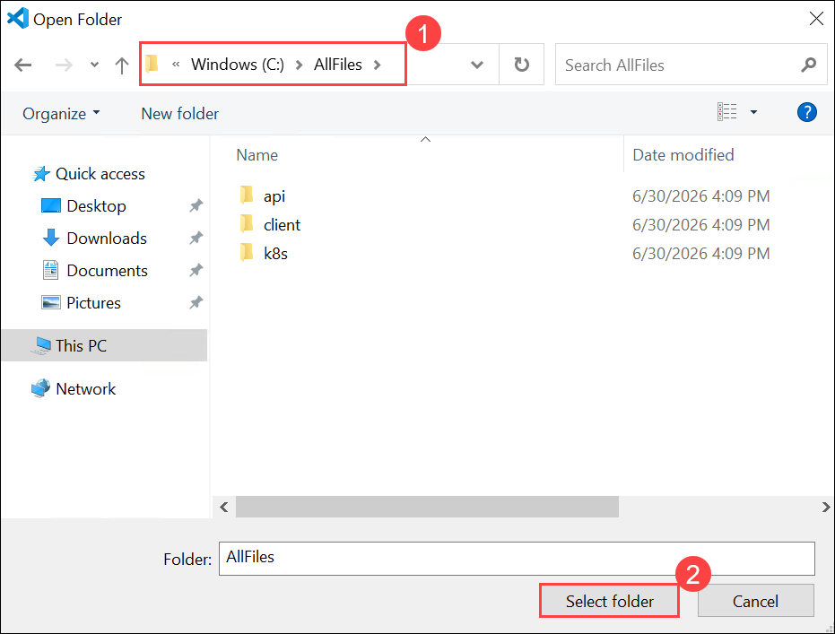

1. If you get "Do you trust the authors of the files in this folder?" prompt, click **Yes, I trust the authors**.

   

1. The project contains deployment scripts for both Bash (_azdeploy.sh_) and PowerShell (_azdeploy.ps1_). Open the appropriate file for your environment and change the two values: **Resource group name** as **<inject key="ResourceGroupName" enableCopy="false"/>** and **Azure Region** as **<inject key="Region" enableCopy="false"/>** at the top of the script to meet your needs.

   ```
   "<your-resource-group-name>" # Resource Group name
   "<your-azure-region>" # Azure region for the resources
   ```

   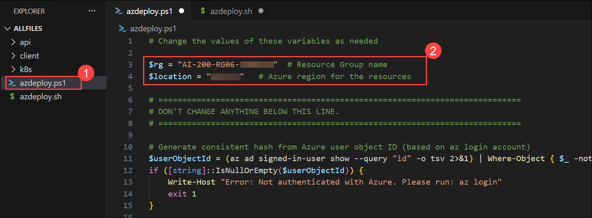

   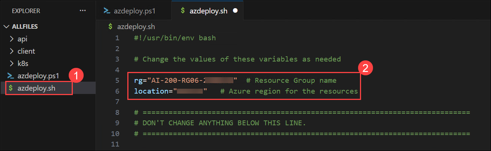

1. In the menu bar, select **File (1)** and select **Save All (2)** from drop-down.

   

1. In the menu bar, select **ellipsis (...) (1)**, then **Terminal (2)**, and then **New Terminal (3)** to open a terminal window in VS Code.

   

   > **NOTE:** If you are using Bash, after the terminal opens, click on the **+ (1)** icon to open a new terminal and select **Git Bash (2)** from the drop-down. If you are using PowerShell, skip this step.
   >
   > 

1. Run the following command in the terminal to allow PowerShell scripts to run. This command is only required if you are using PowerShell. If you are using Bash, skip this step.

   ```
   Set-ExecutionPolicy -ExecutionPolicy bypass -Force
   ```

   

1. Run the **following command (1)** to login to your Azure account. Next, **minimize the VS Code window (2)** to view the login window opened in background.

   ```
   az login
   ```

   

1. In the login window, select **Work or school account (1)** and click **Continue (2)**.

   

1. In the login window, kindly sign in using the provided **Azure credentials (1)** and click **Next (2)**.
   - **Email/Username:** <inject key="AzureAdUserEmail"></inject>

     

1. Next, enter the provided **Password (1)** and click **Sign in (2)**.
   - **Password:** <inject key="AzureAdUserPassword"></inject>

     

1. Next, select **No, this app only** and navigate back to VS Code to continue.

   

1. Answer the prompts to select your Azure account and subscription for the exercise.

   

   > **NOTE:** To confirm you're logged in to the correct Azure subscription, run **az account show**.

1. Install kubectl and add it to your current terminal session by running the following commands. Execute both commands in sequence.

   **Bash**

   ```bash
   az aks install-cli
   export PATH=$PATH:/c/Users/azureuser/.azure-kubectl
   ```

   **PowerShell**

   ```powershell
   az aks install-cli
   $env:PATH += ";$env:USERPROFILE\.azure-kubectl"
   ```

1. Make sure you are in the root directory of the project and run the appropriate command in the terminal to launch the deployment script.

   **Bash**

   ```bash
   MSYS_NO_PATHCONV=1 bash azdeploy.sh
   ```

   **PowerShell**

   ```powershell
   ./azdeploy.ps1
   ```

## Task 2: Deploy resources to Azure

In this task, you'll use the deployment script to provision Azure Container Registry (ACR) and Azure Kubernetes Service (AKS), build and push the container image to ACR, configure kubectl access to the AKS cluster, and verify that the required Azure resources have been deployed successfully.

1. After the model is deployed, enter **1** to launch **Create Azure Container Registry (ACR)**. This creates the resource where the API container will be stored, and later pulled into the AKS resource.

   When the operation is complete it will return the **ACR endpoint**. Copy the information, you need it later in the exercise.

   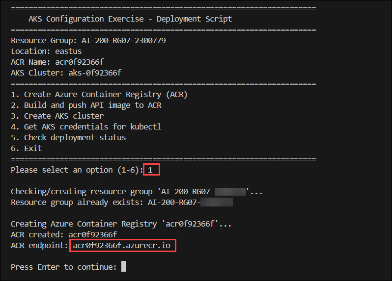

1. After the ACR resource has been created, enter **2** to launch **Build and push API image to ACR**. This option uses ACR tasks to build the image and add it to the ACR repository. This operation can take 3-5 minutes to complete.

   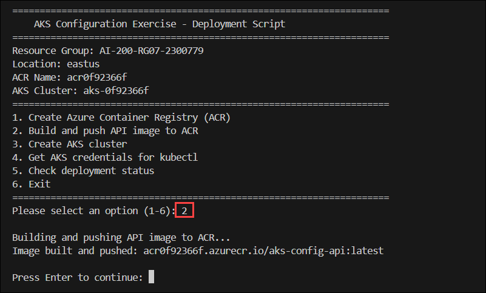

1. After the image has been built and pushed to ACR, enter **3** to launch the **Create AKS cluster** option. This creates the AKS resource configured with a managed identity, gives the service permission to pull images from the ACR resource, and assigns the needed RBAC role to write to the persistent storage. This operation can take 5-10 minutes to complete.

   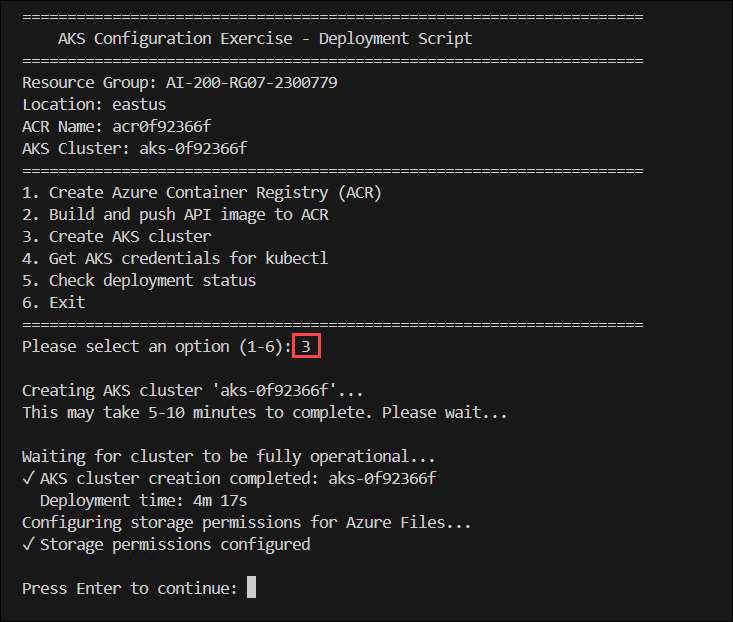

1. After the AKS cluster deployment has completed, enter **4** to launch the **Get AKS credentials for kubectl** option. This uses the **az aks get-credentials** command to retrieve credentials and configure **kubectl**.

   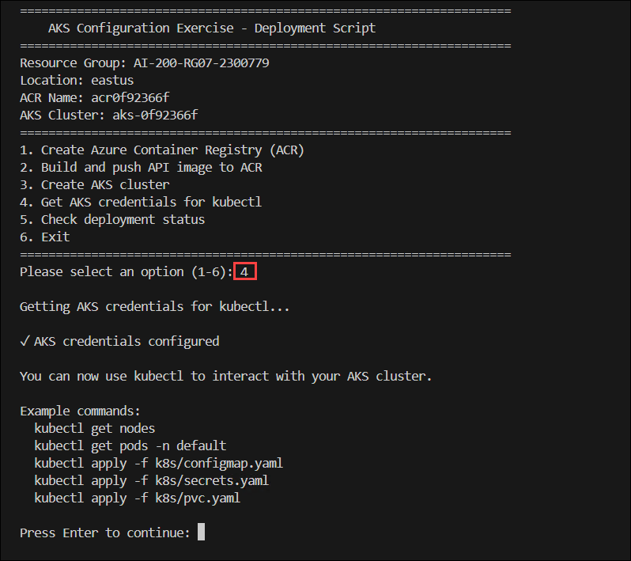

1. After the credentials have been configured, enter **5** to launch the **Check deployment stats** option. This option reports if each of the resources have been successfully deployed.

   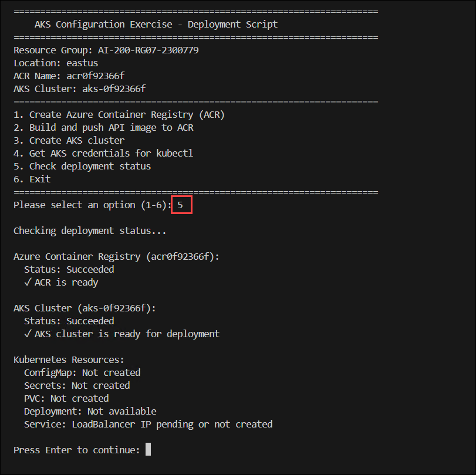

1. If all of the services return a **successful** message, enter **6** to exit the deployment script.

Next, you complete the YAML files necessary to deploy the API to AKS.

> **Congratulations** on completing the task! Now, it's time to validate it. Here are the steps:
>
> - If you receive a success message, you can proceed to the next task.
> - If not, carefully read the error message and retry the step, following the instructions in the lab guide.
> - If you need any assistance, please contact us at cloudlabs-support@spektrasystems.com. We are available 24/7 to help you out.

<validation step="09b2eabe-f01e-4341-853b-6d1250298d03" />

## Task 3: Complete the YAML deployment files and deploy to AKS

In this task, you'll configure Kubernetes resources by creating a ConfigMap, Secret, and PersistentVolumeClaim (PVC), and update the deployment manifest to use your Azure Container Registry (ACR) image.

### Task 3.1: Complete the ConfigMap YAML file

ConfigMaps store non-sensitive configuration data as key-value pairs that can be consumed by pods. In this section, you create a ConfigMap to store application settings like the student name, API version, and log path.

1. Open the **k8s/configmap.yaml** file and add the following code to the file. You can update the value for **STUDENT_NAME** with your name if you want to.

   ```yml
   apiVersion: v1
   kind: ConfigMap
   metadata:
     name: api-config
     labels:
       app: aks-config-api # Label for the AKS configuration API
   data:
     # Store non-sensitive configuration values
     STUDENT_NAME: "YourNameHere"
     API_VERSION: "1.0.0"
     LOG_PATH: "/var/log/api" # Path for API logs
   ```

   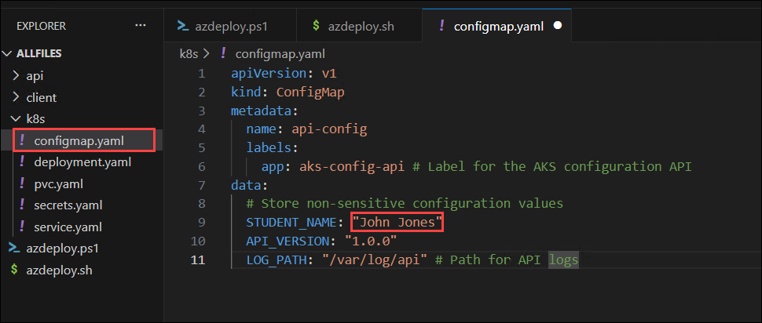

1. Review the comments in the code, then save your changes using **Ctrl + S**.

### Task 3.2: Complete the Secrets YAML file

Secrets store sensitive information like passwords, tokens, and keys in a base64-encoded format. In this section, you create a Secret to store sensitive credentials that the API will access at runtime.

1. Open the **k8s/secrets.yaml** file and add the following code to the file.

   ```yml
   apiVersion: v1
   kind: Secret
   metadata:
     name: api-secrets
     labels:
       app: aks-config-api
   type: Opaque
   stringData:
     # Store sensitive credentials as base64-encoded values
     secret-endpoint: "SecretEndpointValue"
     secret-access-key: "SecretAccessKey123456"
   ```

   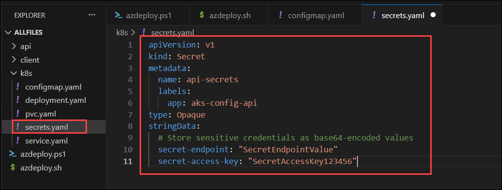

1. Take a few minutes to review the comments in the code, then save your changes.

### Task 3.3: Complete the PVC YAML file

A PersistentVolumeClaim (PVC) requests storage resources from Azure that can be mounted to pods. In this section, you create a PVC that uses Azure Disk storage to persist API log files across pod restarts.

1. Open the **k8s/pvc.yaml** file and add the following code to the file.

   ```yml
   apiVersion: v1
   kind: PersistentVolumeClaim
   metadata:
     name: api-logs-pvc
     labels:
       app: aks-config-api # Label for the AKS configuration API
   spec:
     accessModes:
       - ReadWriteOnce # Allow single pod to mount volume for read/write
     resources:
       requests:
         storage: 1Gi # Request minimum Azure Disk size
     storageClassName: managed-csi # Use Azure Disk CSI driver (default)
     volumeMode: Filesystem # Default mode
   ```

   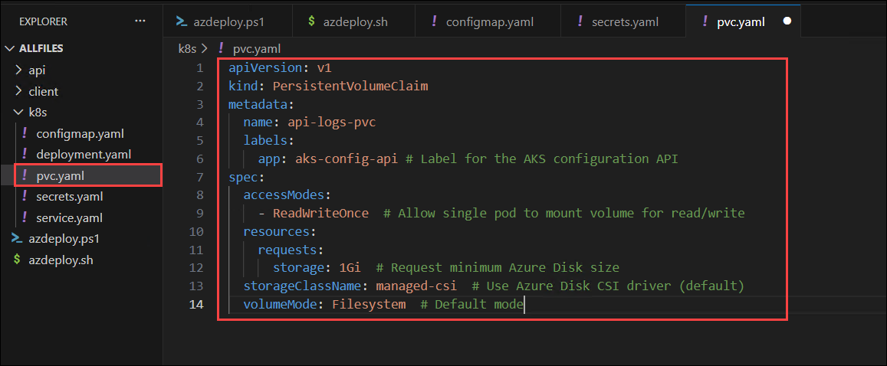

1. Take a few minutes to review the comments in the code, then save your changes.

### Task 3.4: Update the Deployment YAML file

The deployment manifest is already partially configured with environment variables, volume mounts, and probes. You just need to update the container image reference with your specific ACR endpoint.

1. Open the **k8s/deployment.yaml** file and locate the **image: \<YOUR_ACR_ENDPOINT>/aks-config-api:latest** line. Replace **\<YOUR_ACR_ENDPOINT>** with the value you recorded earlier in the exercise.

   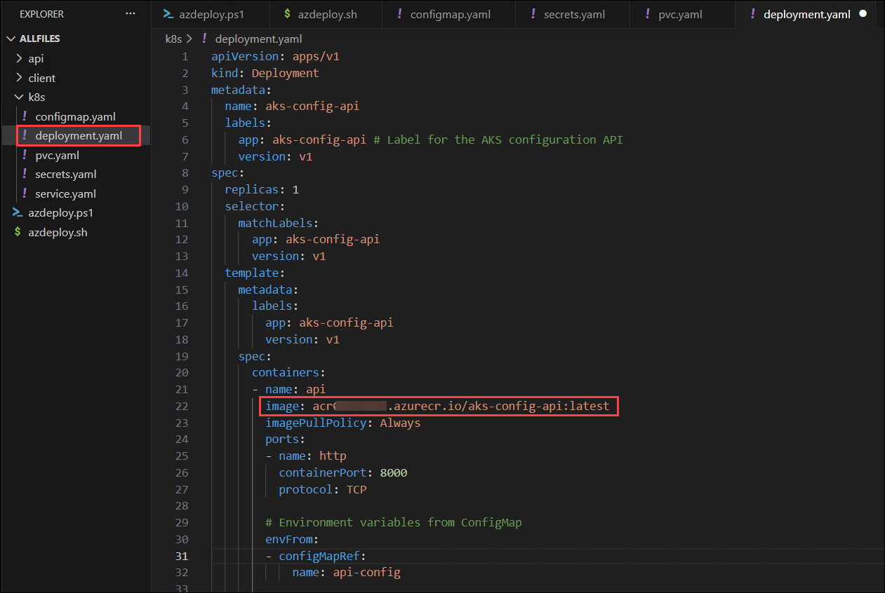

1. Take a few minutes to review the comments in the code, then save your changes.

## Task 4: Apply the manifests to AKS

In this task, you'll deploy the Kubernetes resources to Azure Kubernetes Service (AKS) by applying the ConfigMap, Secret, PersistentVolumeClaim (PVC), Deployment, and Service manifests, and verify that the application is successfully exposed through a LoadBalancer.

1. In the terminal run the following command to apply the ConfigMap.

   ```
   kubectl apply -f k8s/configmap.yaml
   ```

   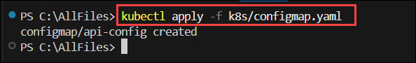

   > **Note:** If you close the terminal, you'll need to run the `kubectl` installation and PATH configuration commands again based on the terminal you're using (Bash or PowerShell).
   >
   > **Bash**
   >
   > ```bash
   > az aks install-cli
   > export PATH=$PATH:/c/Users/azureuser/.azure-kubectl
   > ```
   >
   > **PowerShell**
   >
   > ```powershell
   > az aks install-cli
   > $env:PATH += ";$env:USERPROFILE\.azure-kubectl"
   > ```

1. Run the following command to apply the Secrets.

   ```
   kubectl apply -f k8s/secrets.yaml
   ```

   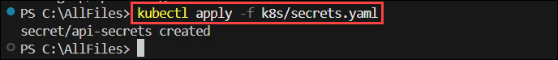

1. Run the following command to apply the PersistentVolumeClaim.

   ```
   kubectl apply -f k8s/pvc.yaml
   ```

   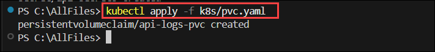

1. Run the following command to apply the Deployment.

   ```
   kubectl apply -f k8s/deployment.yaml
   ```

   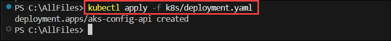

1. Run the following command to create the Service.

   ```
   kubectl apply -f k8s/service.yaml
   ```

   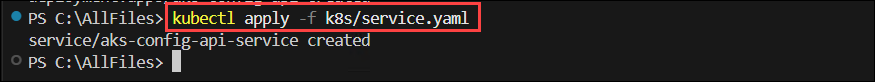

1. After you create the Service it can take a few minutes for the deployment to complete. The following command will monitor the service and update the external IP address of the pod when it's available. Note the **external IP address**, you need it later in the exercise. Enter **ctrl + c** to exit the command after the IP address appears.

   ```
   kubectl get svc aks-config-api-service -w
   ```

   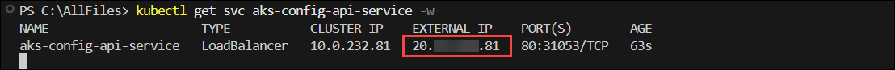

## Task 5: Run the client app

In this task, you'll configure the Python environment, connect the client application to the deployed API, and validate the Kubernetes configuration by testing the API endpoints, viewing secret information, and reviewing application logs stored on persistent storage.

### Task 5.1: Configure the Python environment

In this section, you create the Python environment and install the dependencies.

1. In the terminal, navigate to the project's `client` folder by running the following command:

   ```bash
   cd client
   ```

1. Run the following command in the VS Code terminal to create the Python environment.

   ```
   python -m venv .venv
   ```

1. Run the following command to activate the Python environment.

   **Bash**

   ```bash
   source .venv/Scripts/activate
   ```

   **PowerShell**

   ```powershell
   .\.venv\Scripts\Activate.ps1
   ```

1. Run the following command in the VS Code terminal to install the dependencies.

   ```
   pip install -r requirements.txt
   ```

1. In the File Explorer, select the **client folder (1)**, and then click the **New File** icon **(2)** to create a new file.

   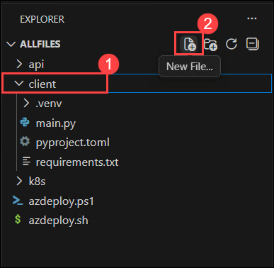

1. Create a `.env` file in the **client** directory and add the following code.

   ```
   # API endpoint - update this with the external IP from the LoadBalancer service
   # Get the IP with: kubectl get services
   API_ENDPOINT=http://<API_IP_address>
   ```

   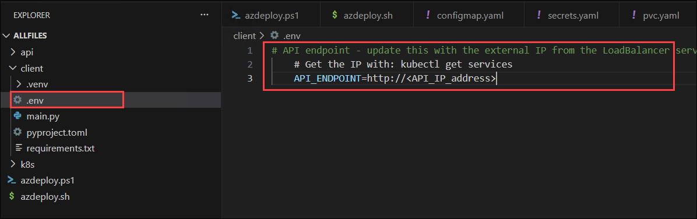

1. Replace **\<API_IP_address>** with the value you copied earlier in the exercise.

   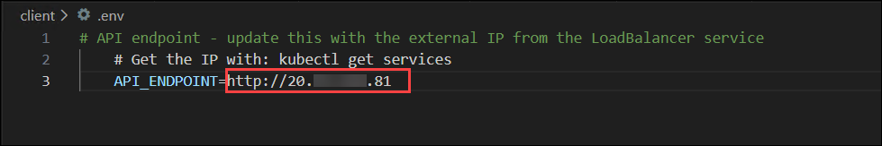

### Task 5.2: Perform operations with the app

With the Python environment configured and dependencies installed, you can now run the client application to test the deployed API. The API logs all operations to the persistent volume, and the client provides a menu-driven interface to interact with various endpoints.

1. Run the following command in the terminal to start the console app. Refer to the commands from earlier in the exercise to activate the environment, if needed, before running the command.

   ```
   python main.py
   ```

1. Enter **1** to start the **Check API Health (Liveness)** option. This verifies that the API container is running and responds to health checks, which is the same endpoint used by the Kubernetes liveness probe. Note the information it returns contains the non-sensitive student name set in ConfigMap.

   ```
   [*] Checking API health...
   ✓ API is healthy
     Service: aks-config-api
     Version: 1.0.0
     Student: YourNameHere
   ```

   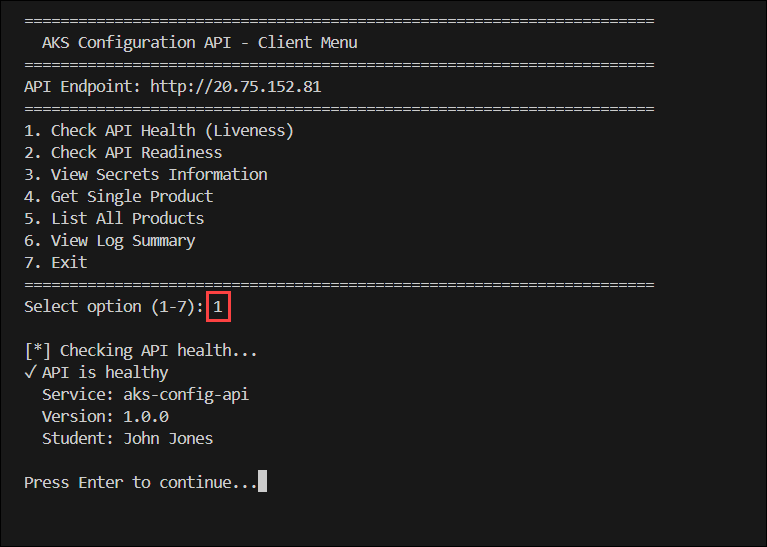

1. Enter **2** to start the **Check API Readiness (Foundry Connectivity)** option. This confirms the API can successfully connect to the Foundry model endpoint and is ready to process inference requests.

   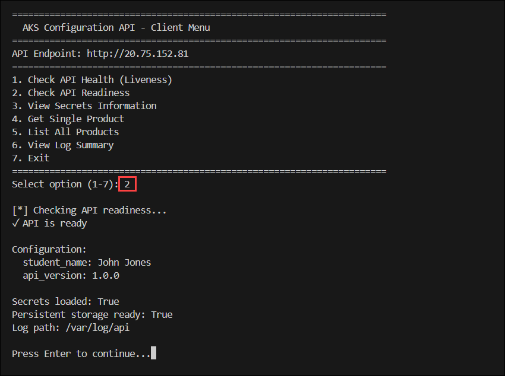

1. Enter **3** to start the **View Secrets Information** option. This functionality exists only so you can confirm your secrets were set in the pod and is for demonstration purposes only. In the output you can view information about the secrets, the output is masked.

   ```
   Secret Details:

     secret_endpoint:
       Loaded: True
       Value: SecretEndp...
       Length: 19 characters

     secret_access_key:
       Loaded: True
       Value: ***3456
       Length: 21 characters
   ```

   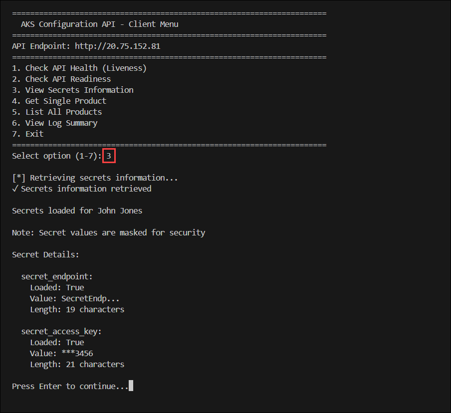

1. Enter **5** to start the **List All Products** option. This displays the mock data included in the API.

   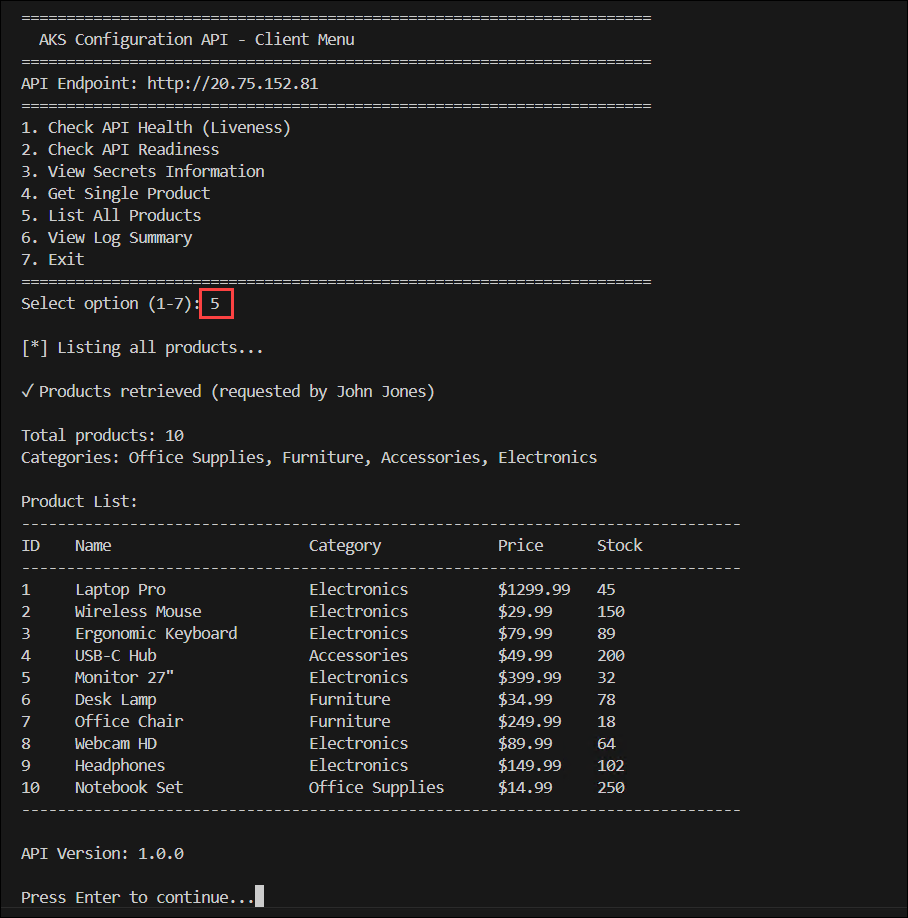

1. Now that the API has logged operations for several different endpoints, it's time to view the logs. Enter **6** to start the **View Log Summary** option and see a summary of the different operations. Note the total number of requests, and the requests to the **/readyz** and **/healthz** endpoints. Those two operations are executing automatically based on the schedule set in the _deployment.yaml_ file.

   ```
   ✓ Log summary retrieved

   Log file: /var/log/api/api-requests-2025-12-21.log
   Total requests: 220
   Student: YourNameHere

   First request: 2025-12-21T02:19:48.953308
   Last request: 2025-12-21T02:46:08.952772

   Requests by endpoint:
     /readyz: 160
     /healthz: 56
     /secrets: 1
     /products: 1
   ```

   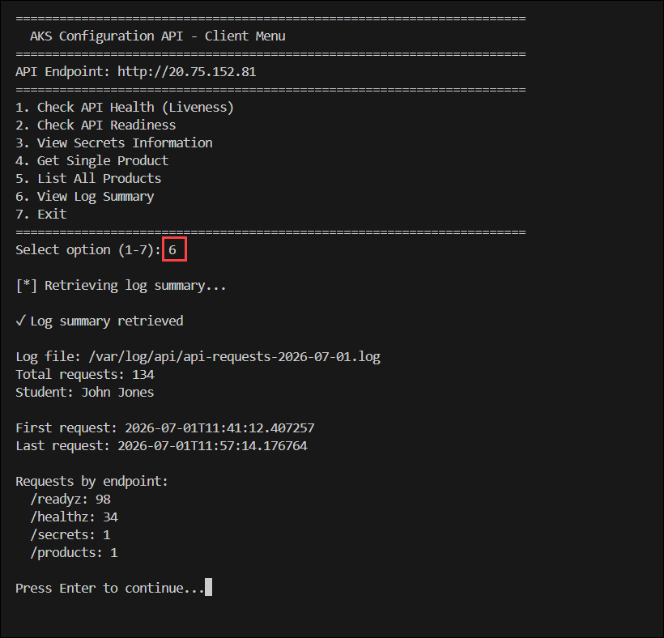

1. You can continue to generate log information and when you're finished enter **7** to exit the app.

## Summary

In this lab, you provisioned Azure Container Registry (ACR) and Azure Kubernetes Service (AKS), built and deployed a containerized API, and configured the application using Kubernetes ConfigMaps, Secrets, and PersistentVolumeClaims (PVCs). You applied the Kubernetes manifests to deploy the application, exposed it through a LoadBalancer, and used a Python client application to validate the deployment by testing API endpoints, verifying configuration and secret values, and reviewing application logs stored on persistent storage.

## You have successfully completed the Hands-on Lab!
