# Lab 08: Troubleshoot apps on Azure Kubernetes Service

### Estimated Duration : 45 Minutes

## Lab overview

In this exercise, you deploy a containerized API to Azure Kubernetes Service (AKS) and then diagnose and resolve common Kubernetes issues. You use **kubectl** commands to identify problems, inspect pod status, check logs, and view events. You then use **kubectl edit** to fix misconfigurations including Service selector mismatches, missing environment variables, and invalid readiness probe paths.

## Lab objectives

In this lab, you'll perform the following tasks:

- **Task 1:** Prepare the environment
- **Task 2:** Deploy resources to Azure
- **Task 3:** Troubleshoot the deployment

## Task 1: Prepare the environment

In this task, you'll prepare the deployment environment, configure the deployment script, authenticate to Azure, register the required resource providers, install kubectl, and launch the deployment script.

1. Launch **Visual Studio Code** (VS Code) from desktop.

   

1. Select **File Explorer (1)** from left panel. Click **Open Folder** in the menu.

   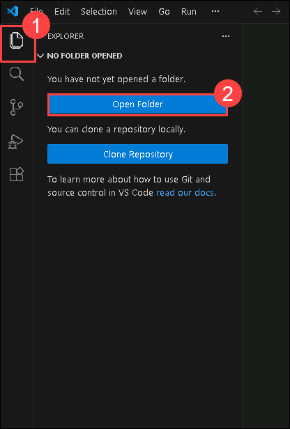

1. Navigate to **C:\AllFiles (1)** folder containing the project files and click on **Select folder (2)**.

   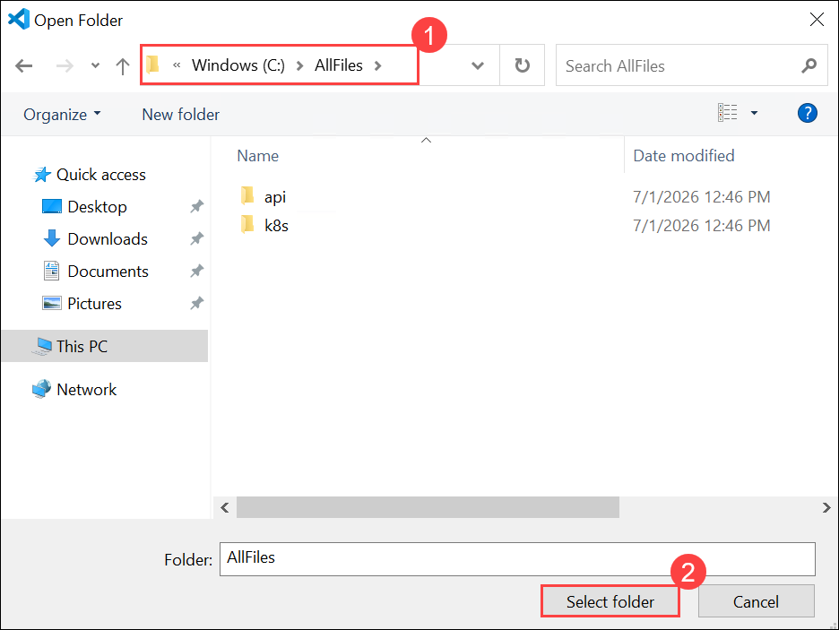

1. If you get "Do you trust the authors of the files in this folder?" prompt, click **Yes, I trust the authors**.

   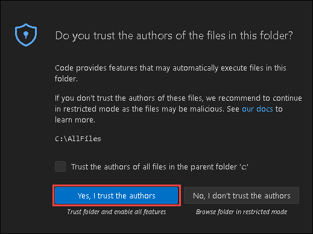

1. The project contains deployment scripts for both Bash (_azdeploy.sh_) and PowerShell (_azdeploy.ps1_). Open the appropriate file for your environment and change the two values: **Resource group name** as **<inject key="ResourceGroupName" enableCopy="false"/>** and **Azure Region** as **<inject key="Region" enableCopy="false"/>** at the top of the script to meet your needs.

   ```
   "<your-resource-group-name>" # Resource Group name
   "<your-azure-region>" # Azure region for the resources
   ```

   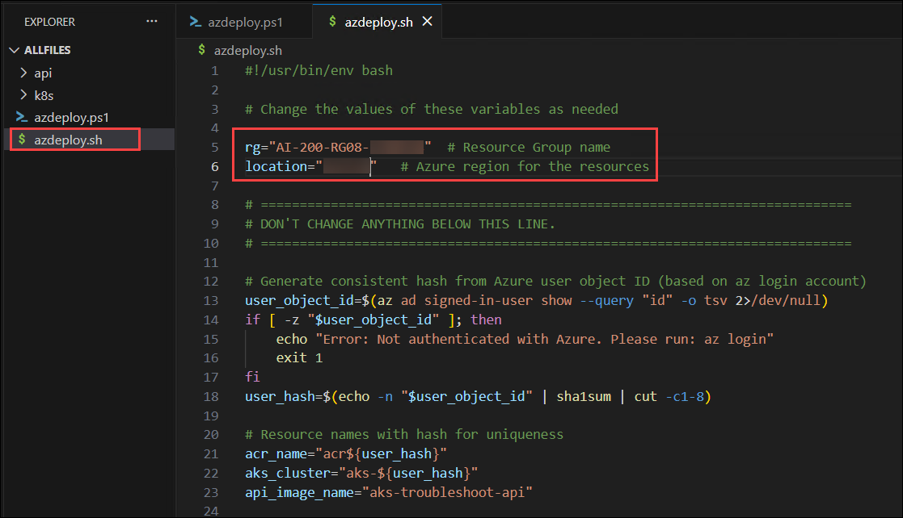

   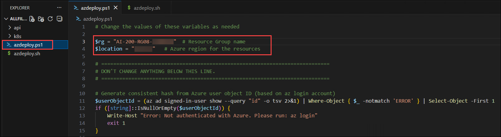

1. In the menu bar, select **File (1)** and select **Save All (2)** from drop-down.

   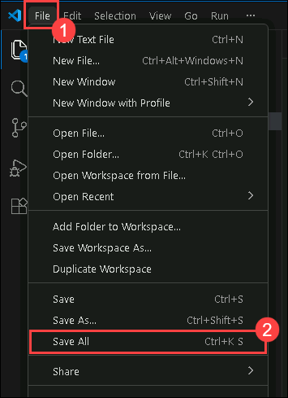

1. In the menu bar, select **ellipsis (...) (1)**, then **Terminal (2)**, and then **New Terminal (3)** to open a terminal window in VS Code.

   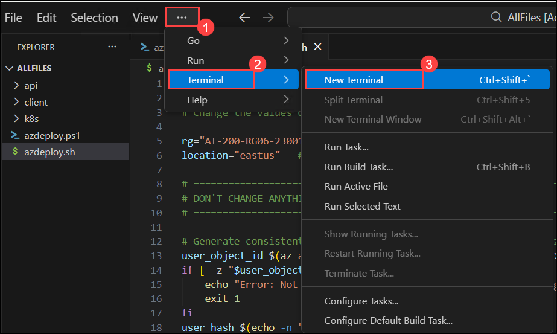

   > **NOTE:** If you are using Bash, after the terminal opens, click on the **+ (1)** icon to open a new terminal and select **Git Bash (2)** from the drop-down. If you are using PowerShell, skip this step.
   >
   > 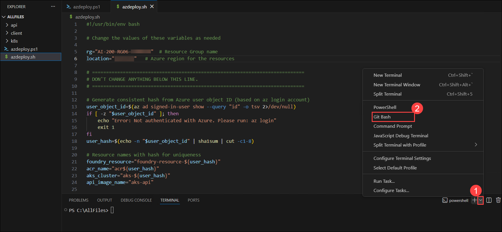

1. Run the following command in the terminal to allow PowerShell scripts to run. This command is only required if you are using PowerShell. If you are using Bash, skip this step.

   ```
   Set-ExecutionPolicy -ExecutionPolicy bypass -Force
   ```

   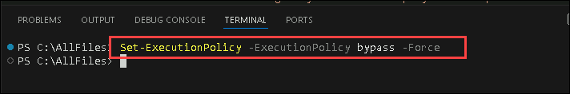

1. Run the **following command (1)** to login to your Azure account. Next, **minimize the VS Code window (2)** to view the login window opened in background.

   ```
   az login
   ```

   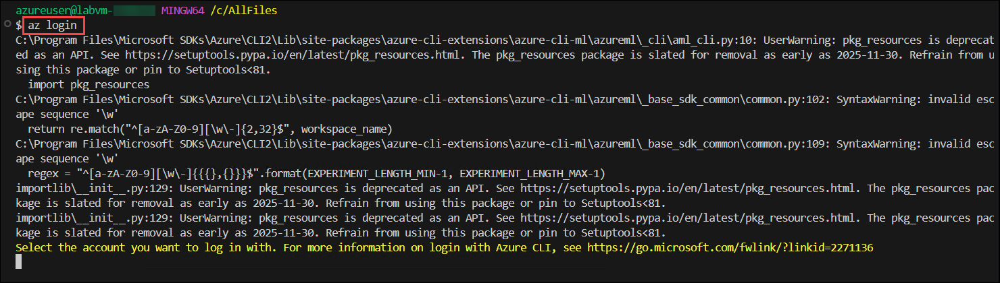

1. In the login window, select **Work or school account (1)** and click **Continue (2)**.

   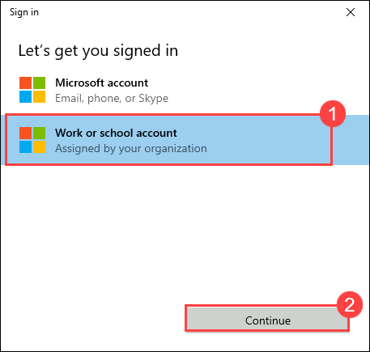

1. In the login window, kindly sign in using the provided **Azure credentials (1)** and click **Next (2)**.
   - **Email/Username:** <inject key="AzureAdUserEmail"></inject>

     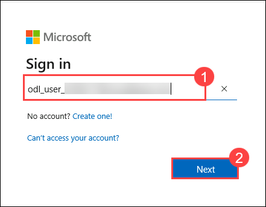

1. Next, enter the provided **Password (1)** and click **Sign in (2)**.
   - **Password:** <inject key="AzureAdUserPassword"></inject>

     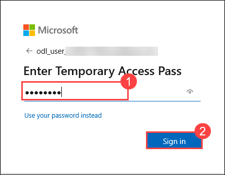

1. Next, select **No, this app only** and navigate back to VS Code to continue.

   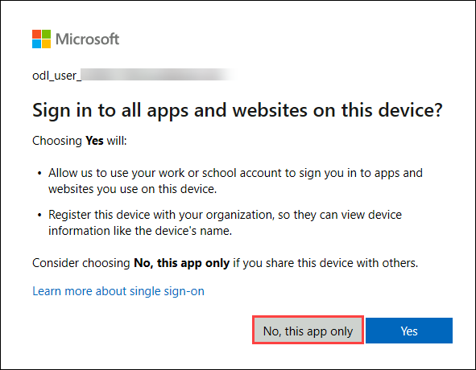

1. Answer the prompts to select your Azure account and subscription for the exercise.

   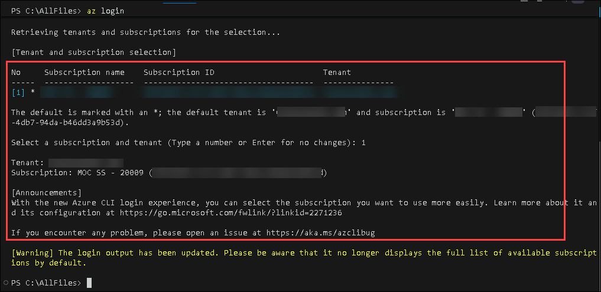

   > **NOTE:** To confirm you're logged in to the correct Azure subscription, run **az account show**.

1. Install kubectl and add it to your current terminal session by running the following commands. Execute both commands in sequence.

   **Bash**

   ```bash
   az aks install-cli
   export PATH=$PATH:/c/Users/azureuser/.azure-kubectl
   ```

   **PowerShell**

   ```powershell
   az aks install-cli
   $env:PATH += ";$env:USERPROFILE\.azure-kubectl"
   ```

1. Make sure you are in the root directory of the project and run the appropriate command in the terminal to launch the deployment script.

   **Bash**

   ```bash
   MSYS_NO_PATHCONV=1 bash azdeploy.sh
   ```

   **PowerShell**

   ```powershell
   ./azdeploy.ps1
   ```

## Task 2: Deploy resources to Azure

In this task, you'll use the deployment script to provision Azure Container Registry (ACR) and Azure Kubernetes Service (AKS), build and deploy the containerized API, configure kubectl access to the cluster, and verify that the required Azure resources have been deployed successfully.

1. After the model is deployed, enter **1** to launch **Create Azure Container Registry (ACR)**. This creates the resource where the API container will be stored, and later pulled into the AKS resource.

   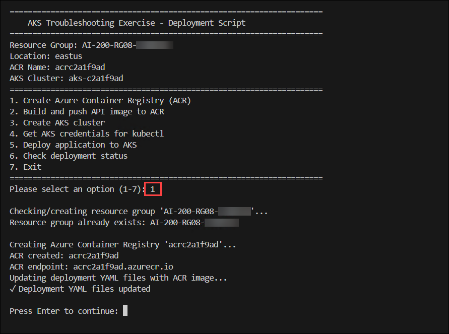

1. After the ACR resource has been created, enter **2** to launch **Build and push API image to ACR**. This option uses ACR tasks to build the image and add it to the ACR repository. This operation can take 3-5 minutes to complete.

   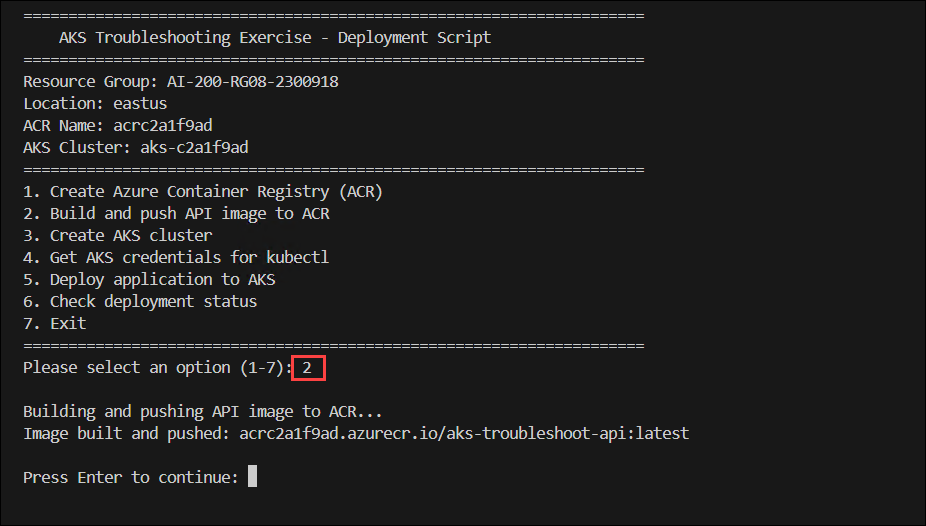

1. After the image has been built and pushed to ACR, enter **3** to launch the **Create AKS cluster** option. This creates the AKS resource configured with a managed identity, and gives the service permission to pull images from the ACR resource.

   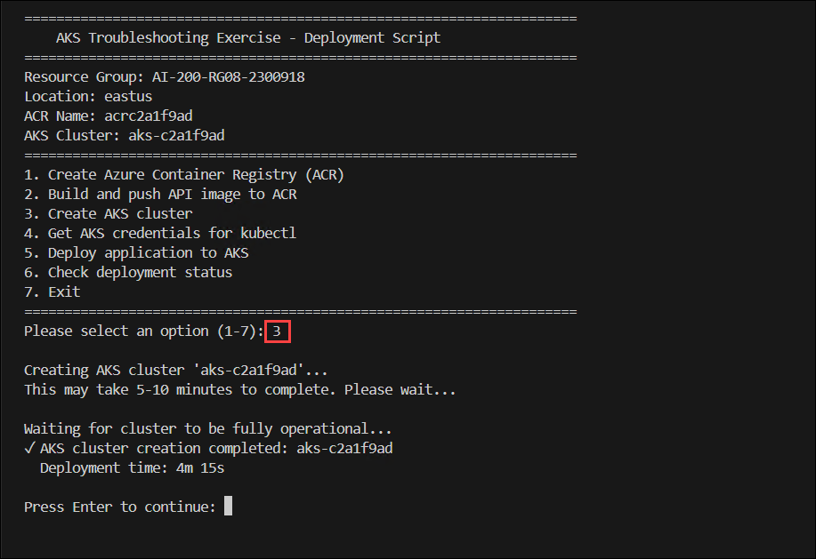

1. After the AKS cluster deployment has completed, enter **4** to launch the **Get AKS credentials for kubectl** option. This uses the **az aks get-credentials** command to retrieve credentials and configure **kubectl**.

   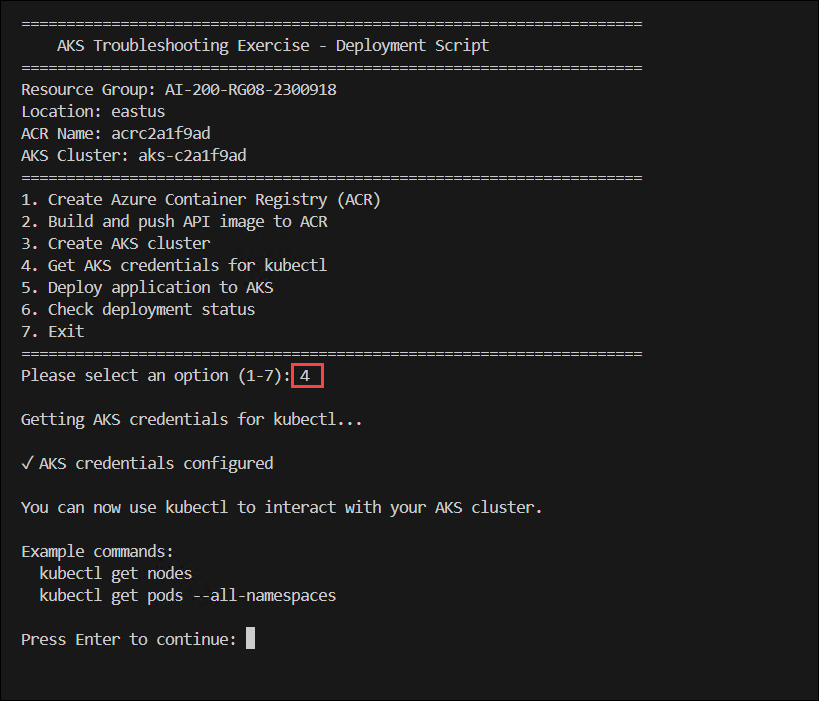

1. After the credentials have been set, enter **5** to launch the **Deploy applications to AKS** option. This deploys an API to the AKS cluster.

   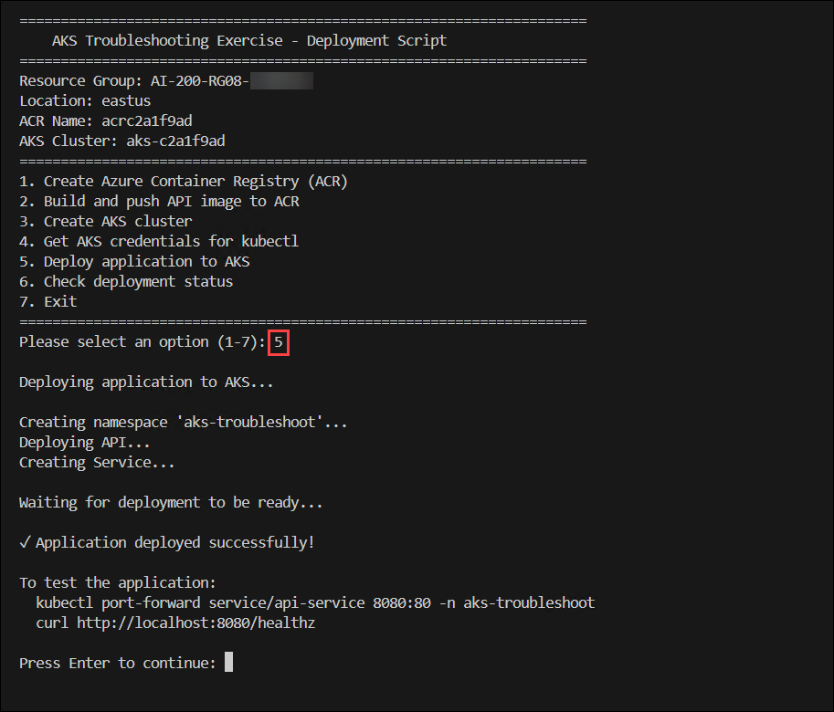

1. After the app has been deployed, enter **6** to launch the **Check deployment stats** option. This option reports if each of the resources have been successfully deployed.

   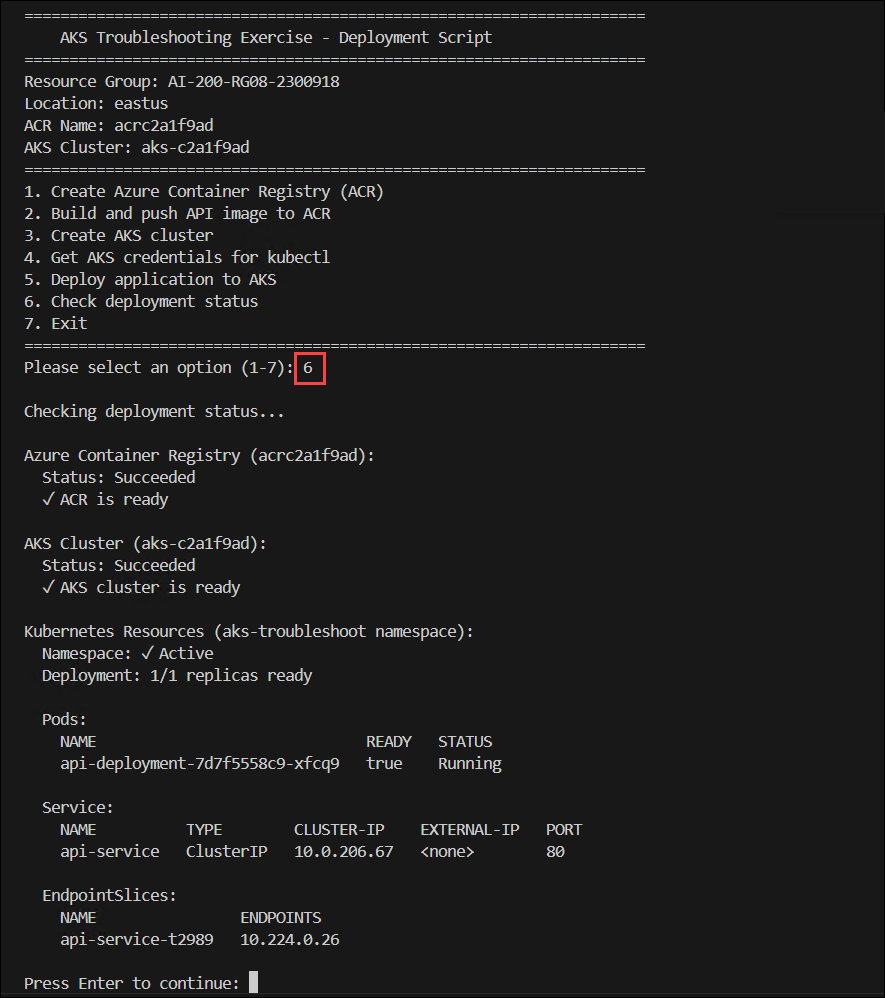

1. If all of the services return a **successful** message, enter **7** to exit the deployment script.

   > **Note:** Leave the terminal open, all of the steps in the exercise are performed in the terminal.

> **Congratulations** on completing the task! Now, it's time to validate it. Here are the steps:
>
> - If you receive a success message, you can proceed to the next task.
> - If not, carefully read the error message and retry the step, following the instructions in the lab guide.
> - If you need any assistance, please contact us at cloudlabs-support@spektrasystems.com. We are available 24/7 to help you out.

<validation step="00871f8a-8db0-4167-8c66-522f72256d94" />

## Task 3: Troubleshoot the deployment

In this task, you'll use Kubernetes troubleshooting commands to diagnose and resolve common deployment issues, including Service selector mismatches, `CrashLoopBackOff` errors, and readiness probe failures, and verify that the application is functioning correctly.

The deployment script created all Kubernetes resources in a **namespace** called **aks-troubleshoot**. Namespaces are a way to organize and isolate resources within a Kubernetes cluster. They allow you to group related resources together, apply resource quotas, and manage access control. When you don't specify a namespace, resources are created in the **default** namespace. For this exercise, all **kubectl** commands include **-n aks-troubleshoot** to target the correct namespace.

After you verify the deployment, you work through three troubleshooting scenarios. In each scenario, you apply a manifest file that introduces a specific error into the deployment. Then you use **kubectl** commands to diagnose the problem and edit the configuration to resolve it.

### Task 3.1: Verify the deployment

In this section you confirm the application deployed by the setup script is running correctly before introducing errors.

1. Run the following command to verify the pod is running in the namespace. The command should return one pod with **Running** status and **1/1** in the READY column.

   ```
   kubectl get pods -n aks-troubleshoot
   ```

   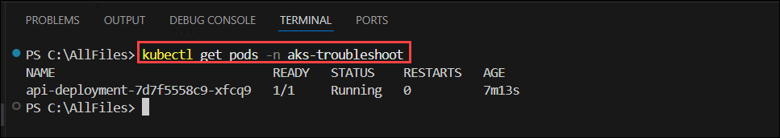

1. Run the following command to verify the Service has endpoints. The command should return one endpoint slice listed with an IP address.

   ```
   kubectl get endpointslices -l kubernetes.io/service-name=api-service -n aks-troubleshoot
   ```

   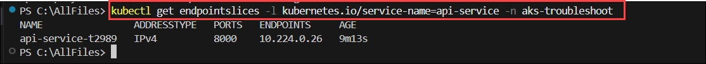

1. Run the following command to test connectivity using port-forward. This command creates a tunnel from your local machine to the Service running in the cluster, allowing you to access it at **http://localhost:8080**.

   ```
   kubectl port-forward service/api-service 8080:80 -n aks-troubleshoot
   ```

   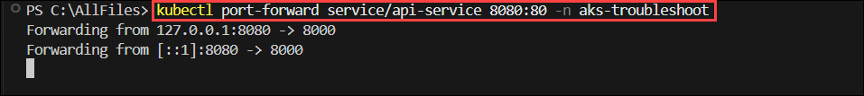

1. In the menu bar select **Launch Profile... (1) > New Terminal (2)** to open a second terminal window in VS Code.

   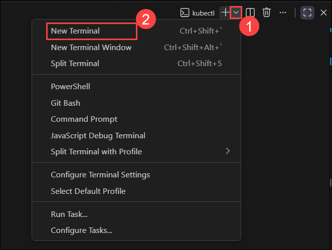

1. Run the following command to test the connection. You should receive a JSON response with **"status": "healthy"**.

   ```bash
   # Bash
   curl http://localhost:8080/healthz
   ```

   ```powershell
   # PowerShell
   Invoke-RestMethod http://localhost:8080/healthz
   ```

   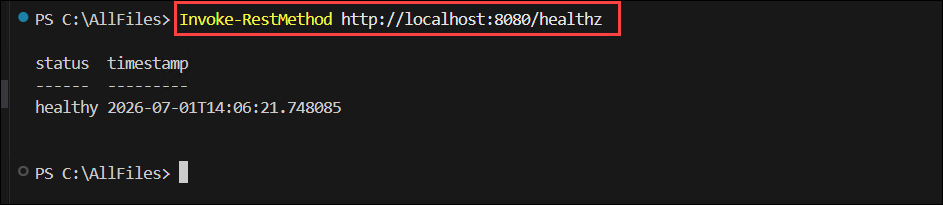

1. Switch back to the terminal where **port-forward** is running and enter **ctrl+c** to exit the command.

You verified the deployment is working correctly, next you diagnose a label mismatch issue.

### Task 3.2: Diagnose a label mismatch

A Service routes traffic to pods based on label selectors. When labels don't match, the Service has no endpoints and requests fail. The API was deployed with pods labeled **app: api** and a Service selector matching **app: api**. In this section you apply a Service configuration that changes the selector to **app: api-v2**, breaking the connection.

1. Run the following command to apply the Service configuration that creates a label mismatch error.

   ```
   kubectl apply -f k8s/label-mismatch-service.yaml -n aks-troubleshoot
   ```

1. Run the following command to verify the pod is still running. The pod shows **Running** status with **1/1** ready and labels showing **app=api**.

   ```
   kubectl get pods --show-labels -n aks-troubleshoot
   ```

   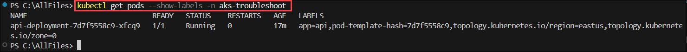

1. Run the following command to check the Service endpoint slices. The command should return an endpoint slice with **\<unset>** in the ENDPOINTS column, indicating no pods match the Service selector.

   ```
   kubectl get endpointslices -l kubernetes.io/service-name=api-service -n aks-troubleshoot
   ```

   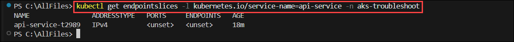

1. Run the following command to view the Service details. Look for the **Selector** field in the output, which now shows **app=api-v2**.

   ```
   kubectl describe service api-service -n aks-troubleshoot
   ```

   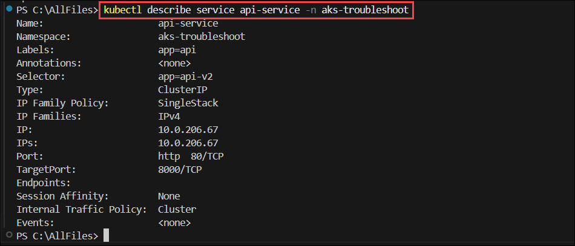

   This confirms the label mismatch. The Service selector is **app=api-v2** but the pod label is **app=api**.

1. Run the following command to open the Service configuration in an editor.

   ```
   kubectl edit service api-service -n aks-troubleshoot
   ```

   > **Note:** The **kubectl edit** command fetches the live resource configuration from the cluster and opens it in a local text editor. When you save and close the editor, kubectl automatically sends the changes back to the Kubernetes API server, which validates and applies them to the running cluster. The editor depends on your environment:
   - **Bash:** Opens **vi** by default. Press **i** to enter insert mode, make your changes, press **Esc**, then type **:wq** and press **Enter** to save and exit. Type **:q!** to exit without saving.
   - **PowerShell (Windows):** Opens **Notepad** by default. Make your changes, select **File > Save** (or **Ctrl+S**), then close the window. Closing without saving cancels the edit.

1. In the editor, find the **selector** section and change **app: api-v2** to **app: api**. Save the changes using **Ctrl + S** and close the editor.

   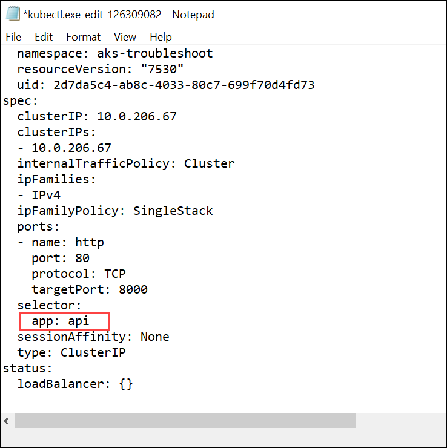

1. Run the following command to verify the endpoint slice addresses are restored. The command should return an endpoint slice with an IP address listed.

   ```
   kubectl get endpointslices -l kubernetes.io/service-name=api-service -n aks-troubleshoot
   ```

   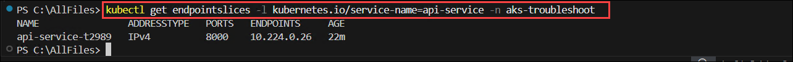

You fixed the label mismatch issue, next you diagnose a CrashLoopBackOff.

### Task 3.3: Diagnose a CrashLoopBackOff

When a container fails to start, Kubernetes repeatedly restarts it, resulting in **CrashLoopBackOff** status. Reading logs reveals why the application crashed.

1. Run the following command to apply the deployment configuration that removes the required **API_KEY** environment variable.

   ```
   kubectl apply -f k8s/crashloop-deployment.yaml -n aks-troubleshoot
   ```

1. Run the following command to watch the pod status. After a few moments, the pod enters **CrashLoopBackOff**. Enter **ctrl-c** to exit the command.

   ```
   kubectl get pods -n aks-troubleshoot -w
   ```

   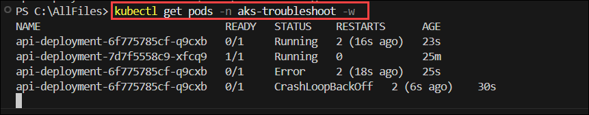

1. Run the following command to check the pod logs for the error message. You should see an error indicating the missing environment variable.

   ```
   kubectl logs -l app=api -n aks-troubleshoot
   ```

   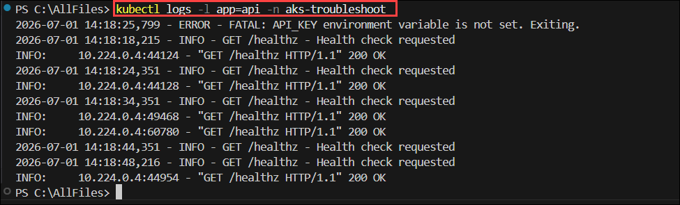

1. Fix the issue by editing the Deployment to add the **API_KEY** environment variable.

   ```
   kubectl edit deployment api-deployment -n aks-troubleshoot
   ```

   In the editor, find the **containers** section under **spec.template.spec**. Locate the **name: api** line and add the **env** block directly below it, matching the indentation of **name**:

   ```yaml
   name: api
   env:
     - name: API_KEY
       value: "demo-api-key-12345"
   ports:
   ```

   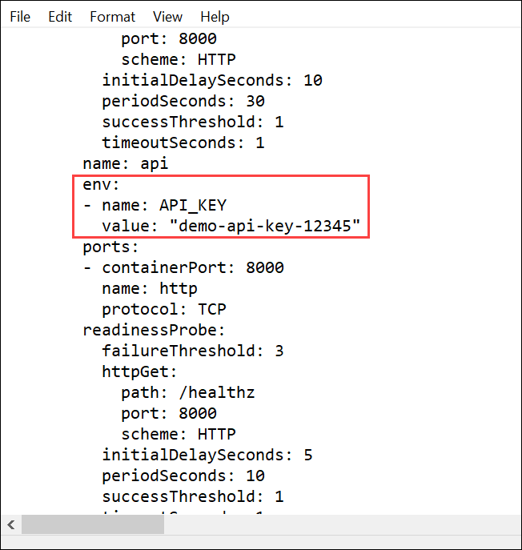

   Save the changes and close the editor.

1. Run the following command to watch the pod status. After a few moments, the pod enters **Running**. Enter **ctrl-c** to exit the command.

   ```
   kubectl get pods -n aks-troubleshoot -w
   ```

   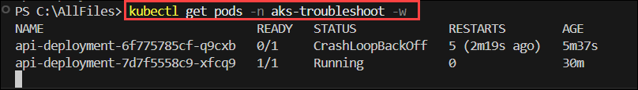

You solved the CrashLoopBackOff issue, next you diagnose a readiness probe failure.

### Task 3.4: Diagnose a readiness probe failure

When a readiness probe fails, the pod shows **Running** but **0/1** containers are ready. Kubernetes won't add the pod to Service endpoints until it passes the readiness check. With a rolling update strategy, the old working pod continues serving traffic while the new pod remains stuck in a not-ready state.

1. Run the following command to apply the deployment configuration that introduces a readiness probe failure. This applies an invalid path for the readiness check.

   ```
   kubectl apply -f k8s/probe-failure-deployment.yaml -n aks-troubleshoot
   ```

1. Run the following command to check the pod status. You should see two pods: the new pod shows **Running** but **0/1** in the READY column, while the old pod remains **1/1** ready. The rolling update is blocked because the new pod never becomes ready.

   ```
   kubectl get pods -n aks-troubleshoot
   ```

   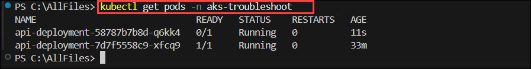

1. Run the following command to check for probe failure events. The command returns all **Unhealthy** events, which include both readiness and liveness probe failures. Look for a message indicating the readiness probe failed with a 404 status code.

   ```
   kubectl get events -n aks-troubleshoot --field-selector reason=Unhealthy
   ```

   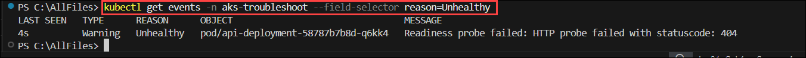

1. Run the following command to fix the readiness probe by editing the Deployment to correct the path.

   ```
   kubectl edit deployment api-deployment -n aks-troubleshoot
   ```

   In the editor, find the **readinessProbe** section and change **path: /invalid-path** to **path: /healthz**. Save the changes and close the editor.

   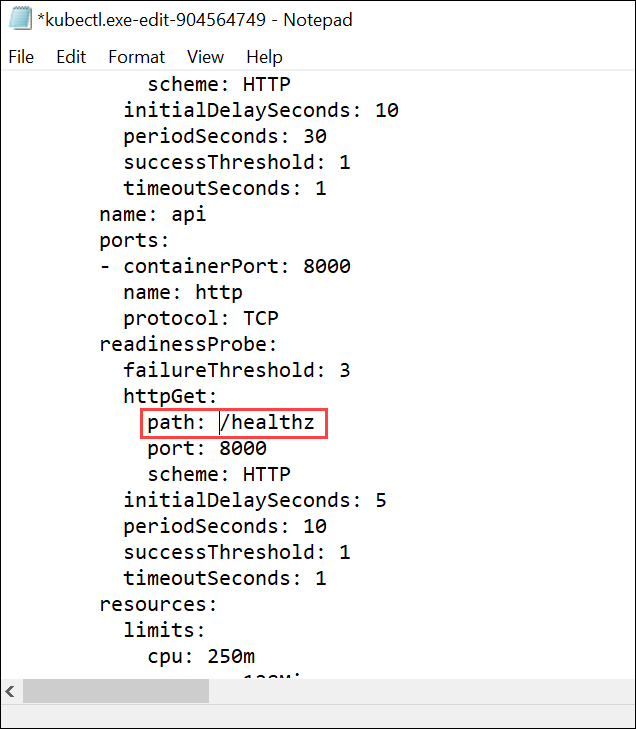

1. Run the following command to verify the new pod becomes ready and the old pod terminates. You should see only one pod with **Running** status and **1/1** in the READY column.

   ```
   kubectl get pods -n aks-troubleshoot
   ```

   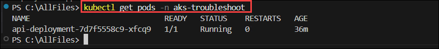

You diagnosed and solved a readiness probe error, next you verify end-to-end connectivity.

### Task 3.5: Verify end-to-end connectivity

After completing all troubleshooting scenarios, you confirm the application is fully functional.

1. Run the following command to use port-forward to access the Service.

   ```
   kubectl port-forward service/api-service 8080:80 -n aks-troubleshoot
   ```

1. In the menu bar select **Launch Profile... (1) > New Terminal (2)** to open a second terminal window in VS Code.

   

1. Run the following commands to test all endpoints.

   ```bash
   # Bash
   curl http://localhost:8080/healthz
   curl http://localhost:8080/readyz
   curl http://localhost:8080/api/info
   ```

   ```powershell
   # PowerShell
   Invoke-RestMethod http://localhost:8080/healthz
   Invoke-RestMethod http://localhost:8080/readyz
   Invoke-RestMethod http://localhost:8080/api/info
   ```

   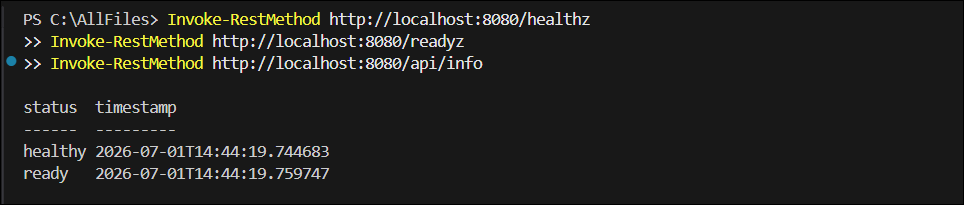

1. Run the following command to check the pod logs to see the requests.

   ```
   kubectl logs -l app=api -n aks-troubleshoot
   ```

   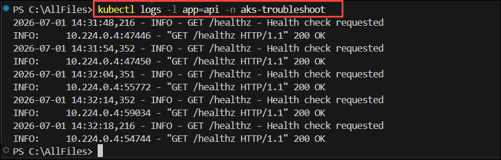

You verified the application is fully functional, next you clean up resources.

## Summary

In this lab, you deployed a containerized API to Azure Kubernetes Service (AKS) and used Kubernetes troubleshooting techniques to diagnose and resolve common application issues. You inspected pod status, logs, events, and Service configurations using kubectl, corrected deployment misconfigurations by editing live Kubernetes resources, and verified that the application was successfully restored and accessible after each issue was resolved.

## You have successfully completed the Hands-on Lab!
