# Lab 15: Perform data operations in Azure Managed Redis

### Estimated Duration : 60 Minutes

## Lab overview

In this hands-on lab, you create an Azure Managed Redis resource and build a Python console application that performs common data operations using the **redis-py** library. You work with Redis hash data structures to store and retrieve key-value pairs, manage key expiration with Time-To-Live (TTL) settings, and delete keys from the cache.

## Lab objectives

In this lab, you'll perform the following tasks:

- **Task 1:** Prepare the environment and deploy Azure Managed Redis
- **Task 2:** Configure the Python environment
- **Task 3:** Complete the Redis console application
- **Task 4:** Verify the Azure Managed Redis deployment
- **Task 5:** Run the console application and perform Redis data operations

> ### **Note:** This lab includes deployment scripts for both **PowerShell** and **Bash**. You may choose either scripting language based on your preference or environment. Once you make your choice, use the corresponding commands and script throughout the entire lab, as all subsequent steps provide instructions for both PowerShell and Bash.

## Task 1: Prepare the environment and deploy Azure Managed Redis

In this task, you'll prepare the development environment, configure the deployment script, authenticate to Azure, deploy an Azure Managed Redis resource, and verify that the deployment has completed successfully.

1. Launch **Visual Studio Code** (VS Code) from desktop.

   

1. Select **File Explorer (1)** from left panel. Click **Open Folder** in the menu.

   

1. Navigate to **C:\AllFiles (1)** folder containing the project files and click on **Select folder (2)**.

   

1. If you get "Do you trust the authors of the files in this folder?" prompt, click **Yes, I trust the authors**.

   

1. The project contains deployment scripts for both Bash (_azdeploy.sh_) and PowerShell (_azdeploy.ps1_). Open the appropriate file for your environment and change the two values: **Resource group name** as **<inject key="ResourceGroupName" enableCopy="false"/>** and **Azure Region** as **<inject key="Region" enableCopy="false"/>** at the top of the script to meet your needs.

   > **Note:** Do not change anything else in the script.

   ```
   "<your-resource-group-name>" # Resource Group name
   "<your-azure-region>" # Azure region for the resources
   ```

   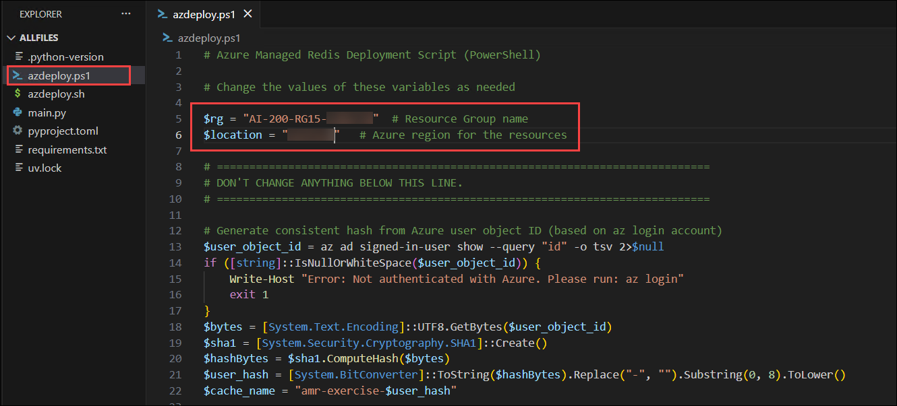

   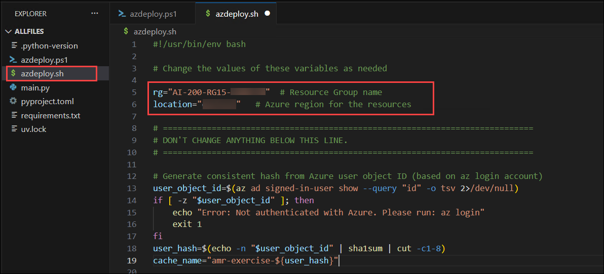

1. In the menu bar, select **File (1)** and select **Save All (2)** from drop-down.

   

1. In the menu bar, select **ellipsis (...) (1)**, then **Terminal (2)**, and then **New Terminal (3)** to open a terminal window in VS Code.

   

   > **NOTE:** If you are using Bash, after the terminal opens, click on the **+ (1)** icon to open a new terminal and select **Git Bash (2)** from the drop-down. If you are using PowerShell, skip this step.
   >
   > 

1. Run the following command in the terminal to allow PowerShell scripts to run. This command is only required if you are using PowerShell. If you are using Bash, skip this step.

   ```
   Set-ExecutionPolicy -ExecutionPolicy bypass -Force
   ```

   

1. Run the **following command (1)** to login to your Azure account. Next, **minimize the VS Code window (2)** to view the login window opened in background.

   ```
   az login
   ```

   

1. In the login window, select **Work or school account (1)** and click **Continue (2)**.

   

1. In the login window, kindly sign in using the provided **Azure credentials (1)** and click **Next (2)**.
   - **Email/Username:** <inject key="AzureAdUserEmail"></inject>

     

1. Next, enter the provided **Password (1)** and click **Sign in (2)**.
   - **Password:** <inject key="AzureAdUserPassword"></inject>

     

1. Next, select **No, this app only** and navigate back to VS Code to continue.

   

1. Answer the prompts to select your Azure account and subscription for the exercise.

   

   > **NOTE:** To confirm you're logged in to the correct Azure subscription, run **az account show**.

1. Run the following command to install the **redisenterprise** extension for Azure CLI.

   ```
   az extension add --name redisenterprise
   ```

   

1. Run the appropriate command in the terminal to launch the script.

   **Bash**

   ```bash
   bash azdeploy.sh
   ```

   **PowerShell**

   ```powershell
   ./azdeploy.ps1
   ```

   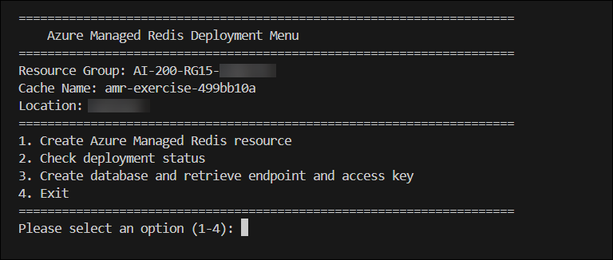

1. When the script is running, enter **1** to launch the **1. Create Azure Managed Redis resource** option.

   This option creates the resource group if it doesn't already exist, and starts a deployment of Azure Managed Redis. The process is completed as a background task in Azure.

   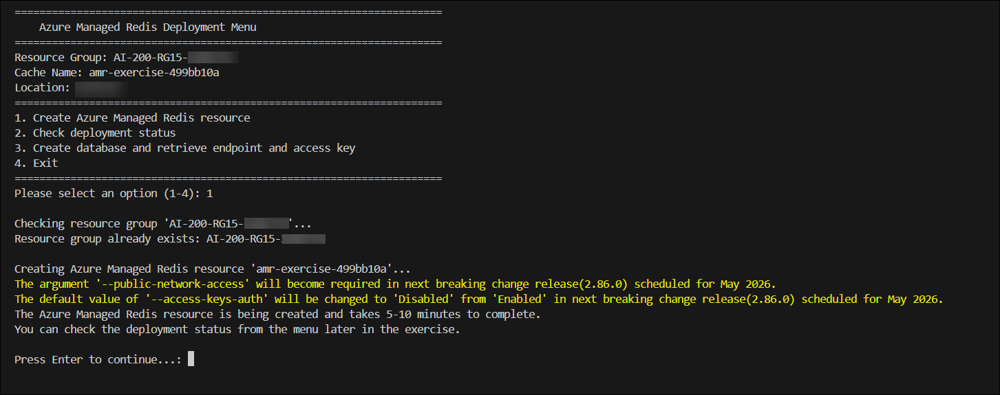

1. After the following messages appear in the console, select **Enter** to return to the menu and then select **4** to exit the script. You run the script again later to check on the deployment status and also to create the _.env_ file for the project.

   > **Note:** The Azure Managed Redis resource is being created and takes 5-10 minutes to complete.

   > **Note:** You can check the deployment status from the menu later in the exercise.

1. In the **Azure portal**, use the search bar to search for **Azure Managed Redis (1)**, and then select **Azure Managed Redis (2)** from the search results.

   

1. Verify that the **Azure Managed Redis** resource has been successfully deployed and is in the **Running** state.

   

## Task 2: Configure the Python environment

In this task, you'll create a Python virtual environment, activate it, and install the required dependencies for the Redis console application.

1. Run the following command in the VS Code terminal to create the Python environment.

   ```
   python -m venv .venv
   ```

1. Run the following command to activate the Python environment.

   **Bash**

   ```bash
   source .venv/Scripts/activate
   ```

   **PowerShell**

   ```powershell
   .\.venv\Scripts\Activate.ps1
   ```

   

1. Run the following command in the VS Code terminal to install the dependencies.

   ```
   pip install -r requirements.txt
   ```

## Task 3: Complete the Redis console application

In this task, you'll implement the missing code in the Python application to connect securely to Azure Managed Redis, store and retrieve hash data, manage key expiration using TTL, and delete cached data.

1. Open the **main.py** file to begin adding code.

   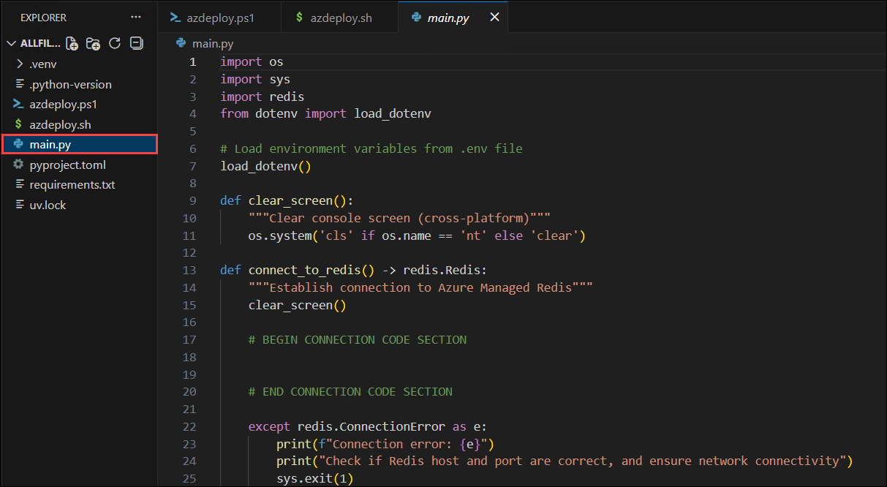

   > **Note:** The code blocks you add to the application should align with the comment for that section of the code.

### Task 3.1: Add the client connection

In this section, you add code to establish a connection to Azure Managed Redis using the redis-py library. The code retrieves connection credentials from environment variables and creates a Redis client instance configured for secure SSL communication.

1. Locate the **# BEGIN CONNECTION CODE SECTION** comment and add the following code under the comment. Be sure to check for proper code alignment.

   ```python
   try:
       # Azure Managed Redis with Non-Clustered policy uses standard Redis connection
       redis_host = os.getenv("REDIS_HOST")
       redis_key = os.getenv("REDIS_KEY")

       # Non-clustered policy uses standard Redis client connection
       r = redis.Redis(
           host=redis_host,
           port=10000,  # Azure Managed Redis uses port 10000
           ssl=True,
           decode_responses=True, # Decode responses to strings
           password=redis_key,
           socket_timeout=30,  # Add timeout for better reliability
           socket_connect_timeout=30,
       )

       print(f"Connected to Redis at {redis_host}")
       input("\nPress Enter to continue...")
       return r
   ```

   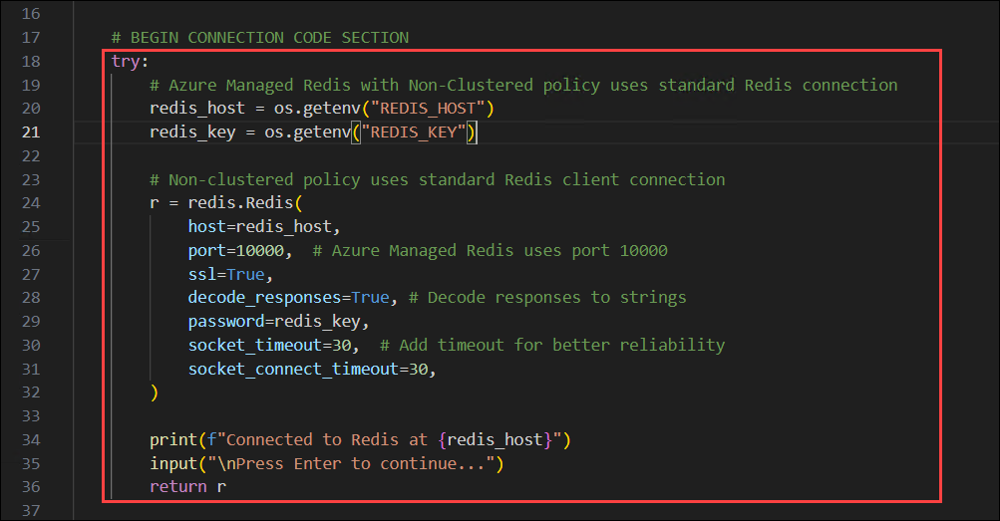

### Task 3.2: Add code to store and retrieve data

In this task, you add code to work with Redis hash data structures using the **hset** and **hgetall** commands. The **hset** method stores multiple field-value pairs under a single key, while **hgetall** retrieves all fields and values for a given key.

1. Locate the **# BEGIN STORE AND RETRIEVE CODE SECTION** comment and add the following code under the comment. Be sure to check for proper code alignment.

   ```python
   def store_hash_data(r, key, value) -> None:
       """Store hash data in Redis"""
       clear_screen()
       print(f"Storing hash data for key: {key}")
       result = r.hset(key, mapping=value) # Store hash data
       if result > 0: # New fields were added
           print(f"Data stored successfully under key '{key}' ({result} new fields added)")
       else:
           print(f"Data updated successfully under key '{key}' (all fields already existed)")
       input("\nPress Enter to continue...")

   def retrieve_hash_data(r, key) -> None:
       """Retrieve hash data from Redis"""
       clear_screen()
       print(f"Retrieving hash data for key: {key}")
       retrieved_value = r.hgetall(key) # Retrieve hash data
       if retrieved_value:
           print("\nRetrieved hash data:")
           for field, value in retrieved_value.items():
               print(f"  {field}: {value}")
       else:
           print(f"Key '{key}' does not exist.")

       input("\nPress Enter to continue...")
   ```

   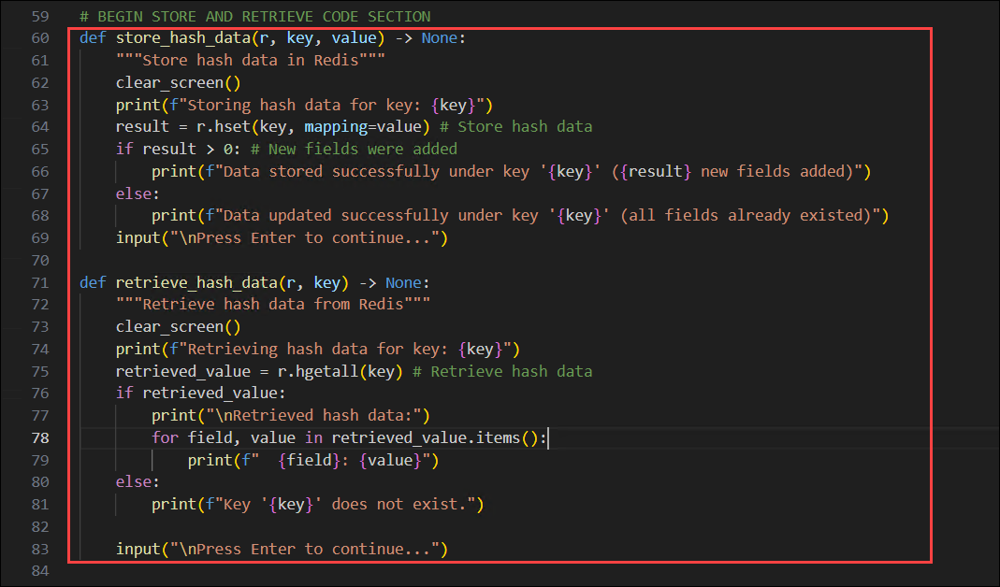

### Task 3.3: Add code to set and retrieve expiration

In this task, you add code to manage key expiration using the **expire** and **ttl** commands. The **expire** method sets a Time-To-Live (TTL) on a key, causing it to automatically expire after the specified number of seconds, while **ttl** retrieves the remaining time before a key expires.

1. Locate the **# BEGIN EXPIRATION CODE SECTION** comment and add the following code under the comment. Be sure to check for proper code alignment.

   ```python
   def set_expiration(r, key) -> None:
       """Set an expiration time for a key"""
       clear_screen()
       print("Set expiration time for a key")
       # Set expiration time, 1 hour equals 3600 seconds
       expiration = int(input("Enter expiration time in seconds (default 3600): ") or 3600)
       result = r.expire(key, expiration) # Set expiration time
       if result:
           print(f"Expiration time of {expiration} seconds set for key '{key}'")
       else:
           print(f"Key '{key}' does not exist. Expiration not set.")

       input("\nPress Enter to continue...")

   def retrieve_expiration(r, key) -> None:
       """Retrieve the TTL of a key"""
       clear_screen()
       print(f"Retrieving the current TTL of {key}...")
       ttl = r.ttl(key) # Get current TTL
       if ttl == -2: # Key does not exist
           print(f"\nKey '{key}' does not exist.")
       elif ttl == -1: # No expiration set
           print(f"\nKey '{key}' has no expiration set (persists indefinitely).")
       else:
           print(f"\nCurrent TTL for '{key}': {ttl} seconds")
       input("\nPress Enter to continue...")
   ```

   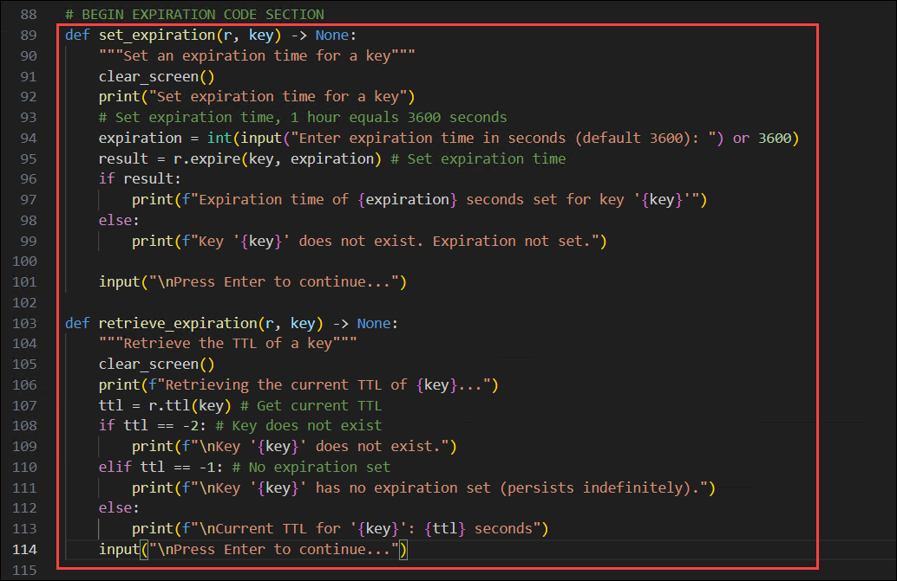

### Task 3.4: Add code to delete data

In this task, you add code to remove keys from Redis using the **delete** command. The **delete** method permanently removes a key and its associated value from the cache, freeing up memory and ensuring the data is no longer accessible.

1. Locate the **# BEGIN DELETE CODE SECTION** comment and add the following code under the comment. Be sure to check for proper code alignment.

   ```python
   def delete_key(r, key) -> None:
       """Delete a key"""
       clear_screen()
       print(f"Deleting key: {key}...")
       result = r.delete(key) # Delete the key
       if result == 1:
           print(f"Key '{key}' deleted successfully.")
       else:
           print(f"Key '{key}' does not exist.")
       input("\nPress Enter to continue...")
   ```

   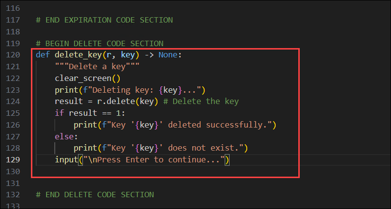

1. Save your changes to the **main.py** file using **Ctrl + S**.

   > **Note:** Verify that the code indentation is preserved exactly as shown. Improper indentation can lead to syntax or execution errors and prevent the code from running successfully.

## Task 4: Verify the Azure Managed Redis deployment

In this task, you'll verify that the Azure Managed Redis deployment has completed successfully, retrieve the Redis endpoint and access key, and generate the environment configuration required by the application.

1. Run the appropriate command in the terminal to start the deployment script. If you closed the previous terminal, select **Ctrl + `** in the menu to open a new one.

   **Bash**

   ```bash
   bash azdeploy.sh
   ```

   **PowerShell**

   ```powershell
   ./azdeploy.ps1
   ```

1. When the deployment menu appears, enter **2** to run the **2. Check deployment status** option. If the status shows **Succeeded**, proceed to the next step. If not, then wait a few minutes and try the option again.

   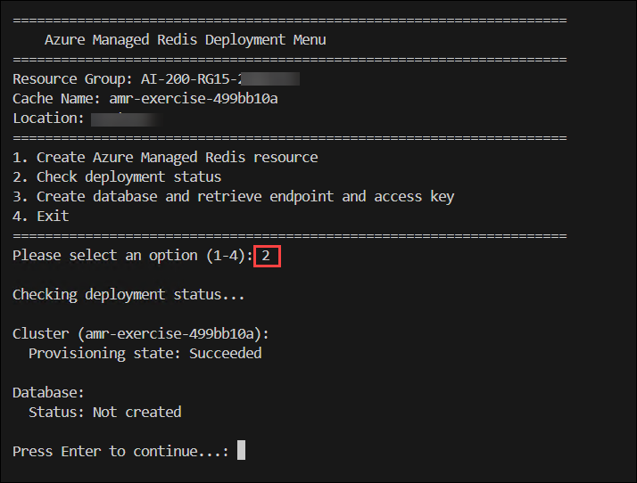

1. After the deployment is complete, enter **3** to run the **3. Create database and retrieve endpoint and access key** option. This creates the database, enables access key authentication, and retrieves the endpoint and access key. It then creates the **.env** file with those values.

   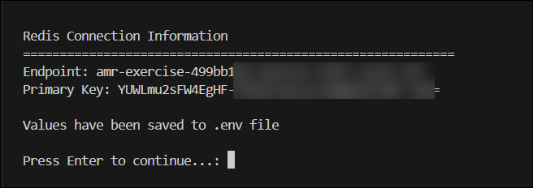

1. Review the **.env** file to verify the values are present,

   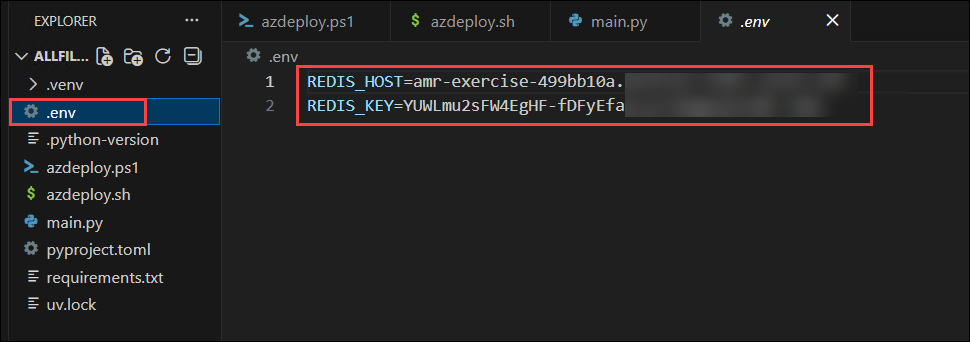

1. Enter **4** to exit the deployment script.

## Task 5: Run the console application and perform Redis data operations

In this task, you'll run the completed console application to validate the Redis operations by storing and retrieving hash data, managing key expiration, and deleting cached data through the application's interactive menu.

1. Run the following command in the terminal to start the console app. Refer to the commands from earlier in the exercise to activate the environment, if needed, before running the command.

   ```
   python main.py
   ```

   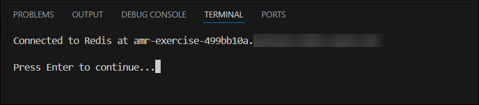

1. The app has the following options. Select the **1. Store hash data** to get started.

   ```
   1. Store hash data
   2. Retrieve hash data
   3. Set expiration
   4. Retrieve expiration (TTL)
   5. Delete key
   6. Exit
   ```

   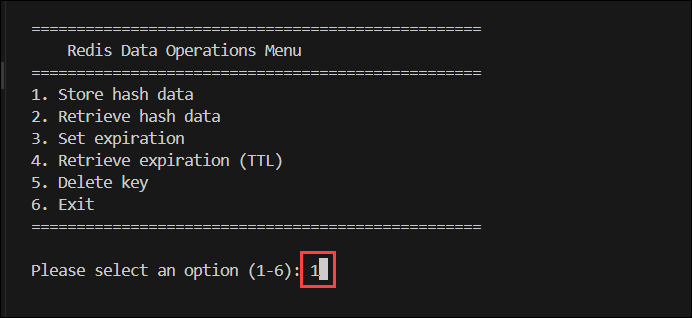

   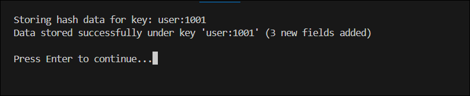

   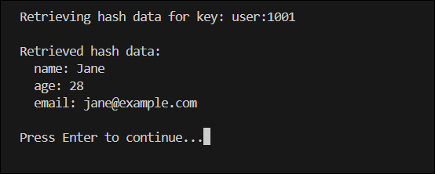

1. Select the remaining options in order to run the different operations.

   > **Note:** You can run the options in any order you choose. For example, after storing the hash data you can retrieve the expiration information to learn there is no expiration set on the key.

The mock hash data used in the app is defined in the beginning of the **main()** function. You can update the code to use a different key, or add more values to the hash data.

> **Congratulations** on completing the task! Now, it's time to validate it. Here are the steps:
>
> - If you receive a success message, you can proceed to the next task.
> - If not, carefully read the error message and retry the step, following the instructions in the lab guide.
> - If you need any assistance, please contact us at cloudlabs-support@spektrasystems.com. We are available 24/7 to help you out.

<validation step="ebfa3f28-b6b8-4061-9f75-0b0507be8e9e" />

## Summary

In this exercise, you deployed an **Azure Managed Redis** resource and built a Python console application that performs common Redis data operations. You configured a secure connection to Azure Managed Redis using the redis-py library, implemented operations to store and retrieve hash data, managed key expiration using **Time-To-Live (TTL)**, and deleted cached data. Finally, you verified the deployment, configured the application using environment variables, and validated the implementation by running the console application to perform Redis operations.

## You have successfully completed the Hands-on Lab!
