# Lab 16: Publish and subscribe to events in Azure Managed Redis

### Estimated Duration : 45 Minutes

## Lab overview

In this lab, you create an Azure Managed Redis resource and complete the code for a console-based publisher and a subscriber app. The publisher app sends event messages to Redis channels, while the subscriber app listens for those messages using a graphical interface built with **tkinter**. You implement core pub/sub patterns including direct channel subscriptions, wildcard pattern matching, message formatting, and background message listening.

## Lab objectives

In this lab, you'll perform the following tasks:

- **Task 1:** Prepare the environment and deploy Azure Managed Redis
- **Task 2:** Configure the Python environment
- **Task 3:** Complete the publisher app
- **Task 4:** Complete the subscriber app
- **Task 5:** Verify resource deployment
- **Task 6:** Run the apps

> ### **Note:** This lab includes deployment scripts for both **PowerShell** and **Bash**. You may choose either scripting language based on your preference or environment. Once you make your choice, use the corresponding commands and script throughout the entire lab, as all subsequent steps provide instructions for both PowerShell and Bash.

## Task 1: Prepare the environment and deploy Azure Managed Redis

In this task, you'll prepare the development environment, configure the deployment script, authenticate to Azure, deploy an Azure Managed Redis resource, and verify that the deployment has completed successfully.

1. Launch **Visual Studio Code** (VS Code) from desktop.

   

1. Select **File Explorer (1)** from left panel. Click **Open Folder** in the menu.

   

1. Navigate to **C:\AllFiles (1)** folder containing the project files and click on **Select folder (2)**.

   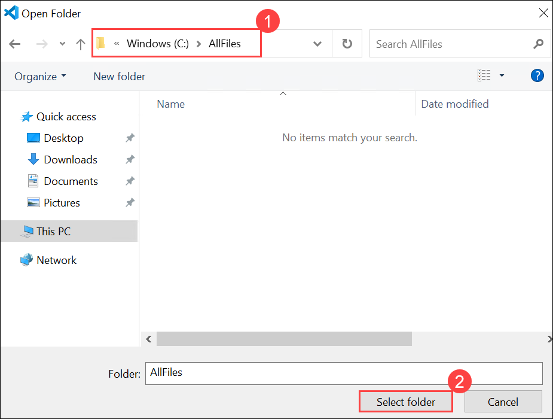

1. If you get "Do you trust the authors of the files in this folder?" prompt, click **Yes, I trust the authors**.

   

1. The project contains deployment scripts for both Bash (_azdeploy.sh_) and PowerShell (_azdeploy.ps1_). Open the appropriate file for your environment and change the two values: **Resource group name** as **<inject key="ResourceGroupName" enableCopy="false"/>** and **Azure Region** as **<inject key="Region" enableCopy="false"/>** at the top of the script to meet your needs.

   > **Note:** Do not change anything else in the script.

   ```
   "<your-resource-group-name>" # Resource Group name
   "<your-azure-region>" # Azure region for the resources
   ```

   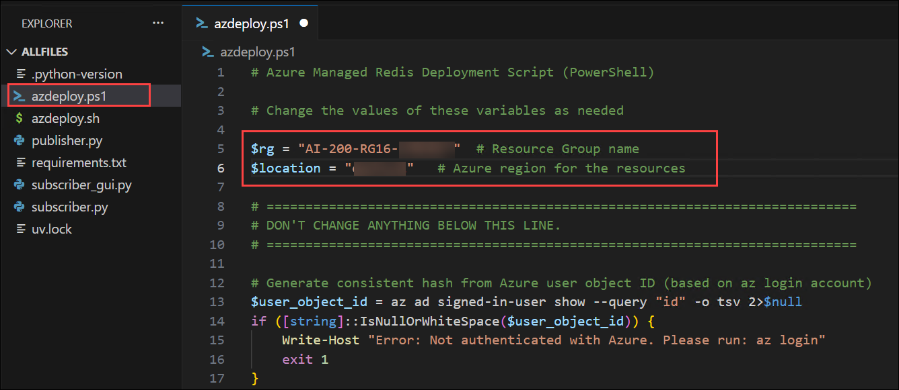

   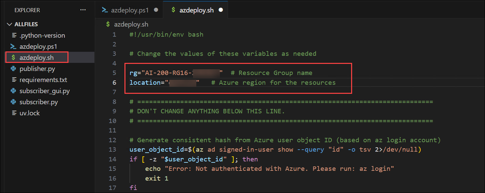

1. In the menu bar, select **File (1)** and select **Save All (2)** from drop-down.

   

1. In the menu bar, select **ellipsis (...) (1)**, then **Terminal (2)**, and then **New Terminal (3)** to open a terminal window in VS Code.

   

   > **NOTE:** If you are using Bash, after the terminal opens, click on the **+ (1)** icon to open a new terminal and select **Git Bash (2)** from the drop-down. If you are using PowerShell, skip this step.
   >
   > 

1. Run the following command in the terminal to allow PowerShell scripts to run. This command is only required if you are using PowerShell. If you are using Bash, skip this step.

   ```
   Set-ExecutionPolicy -ExecutionPolicy bypass -Force
   ```

   

1. Run the **following command (1)** to login to your Azure account. Next, **minimize the VS Code window (2)** to view the login window opened in background.

   ```
   az login
   ```

   

1. In the login window, select **Work or school account (1)** and click **Continue (2)**.

   

1. In the login window, kindly sign in using the provided **Azure credentials (1)** and click **Next (2)**.
   - **Email/Username:** <inject key="AzureAdUserEmail"></inject>

     

1. Next, enter the provided **Password (1)** and click **Sign in (2)**.
   - **Password:** <inject key="AzureAdUserPassword"></inject>

     

1. Next, select **No, this app only** and navigate back to VS Code to continue.

   

1. Answer the prompts to select your Azure account and subscription for the exercise.

   

   > **NOTE:** To confirm you're logged in to the correct Azure subscription, run **az account show**.

1. Run the following command to install the **redisenterprise** extension for Azure CLI.

   ```
   az extension add --name redisenterprise
   ```

   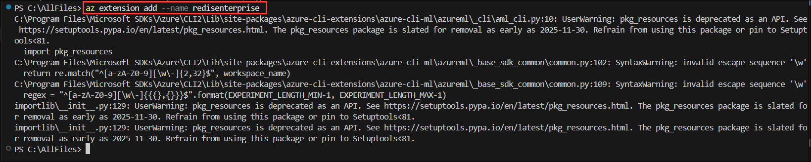

1. Run the appropriate command in the terminal to launch the script.

   **Bash**

   ```bash
   bash azdeploy.sh
   ```

   **PowerShell**

   ```powershell
   ./azdeploy.ps1
   ```

   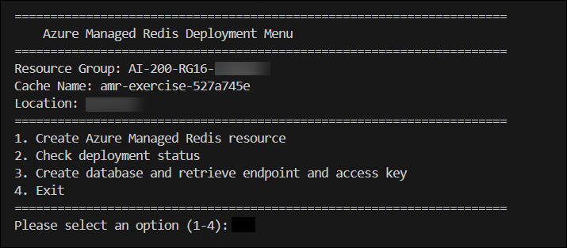

1. When the script is running, enter **1** to launch the **1. Create Azure Managed Redis resource** option.

   This option creates the resource group if it doesn't already exist, and starts a deployment of Azure Managed Redis. The process is completed as a background task in Azure.

   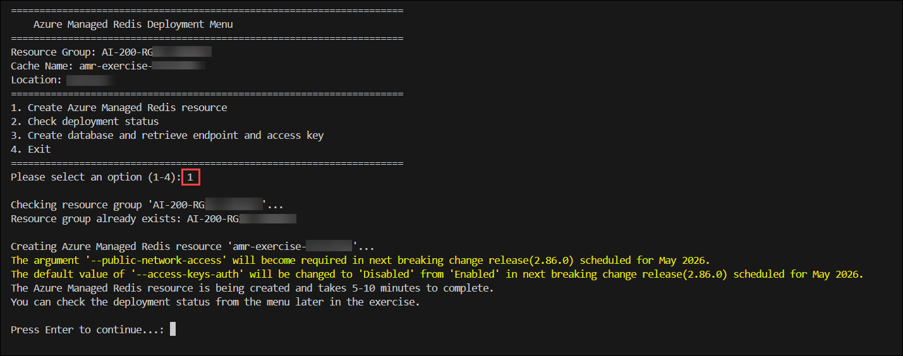

1. After the following messages appear in the console, select **Enter** to return to the menu and then select **4** to exit the script. You run the script again later to check on the deployment status and also to create the _.env_ file for the project.

   > **Note:** The Azure Managed Redis resource is being created and takes 5-10 minutes to complete.

   > **Note:** You can check the deployment status from the menu later in the exercise.

1. In the **Azure portal**, use the search bar to search for **Azure Managed Redis (1)**, and then select **Azure Managed Redis (2)** from the search results.

   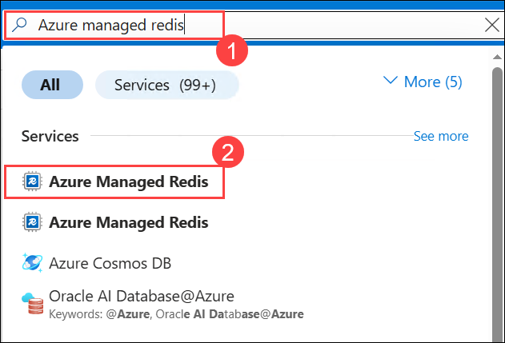

1. Verify that the **Azure Managed Redis** resource has been successfully deployed and is in the **Running** state.

   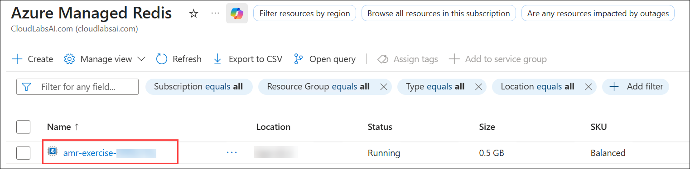

> **Congratulations** on completing the task! Now, it's time to validate it. Here are the steps:
>
> - If you receive a success message, you can proceed to the next task.
> - If not, carefully read the error message and retry the step, following the instructions in the lab guide.
> - If you need any assistance, please contact us at cloudlabs-support@spektrasystems.com. We are available 24/7 to help you out.

<validation step="051811e8-cf51-44fa-bb48-7c40f022ac16" />

## Task 2: Configure the Python environment

In this task, you'll create and activate a Python virtual environment, and install the required dependencies for the publisher and subscriber applications.

1. Run the following command in the VS Code terminal to create the Python environment.

   ```
   python -m venv .venv
   ```

1. Run the following command to activate the Python environment.

   **Bash**

   ```bash
   source .venv/Scripts/activate
   ```

   **PowerShell**

   ```powershell
   .\.venv\Scripts\Activate.ps1
   ```

   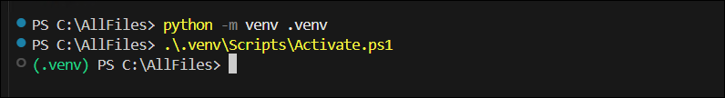

1. Run the following command in the VS Code terminal to install the dependencies.

   ```
   pip install -r requirements.txt
   ```

## Task 3: Complete the publisher app

In this task, you'll implement the publisher application by establishing a secure connection to Azure Managed Redis, publishing event messages to Redis channels, and broadcasting messages across multiple channels using the Redis Pub/Sub model.

1. Open the **publisher.py** file to begin adding code.

   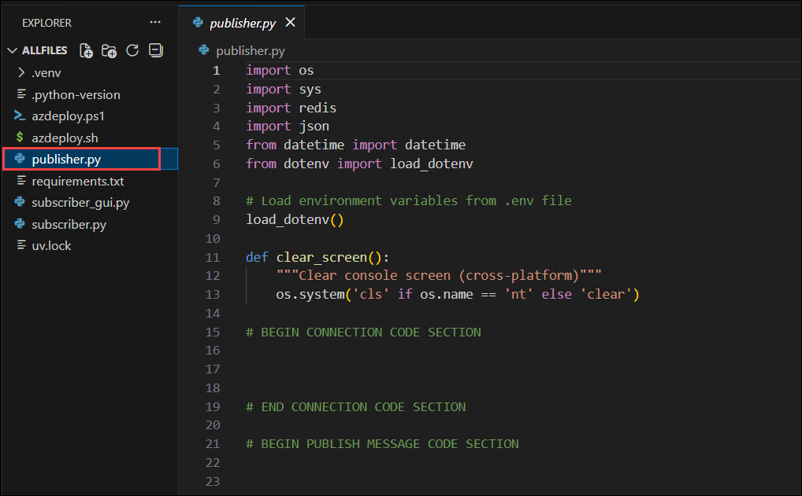

   > **Note:** The code blocks you add to the application should align with the comment for that section of the code.

### Task 3.1: Add the client connection

In this section, you add code to establish a connection to Azure Managed Redis using the redis-py library. The code retrieves connection credentials from environment variables and creates a Redis client instance configured for secure SSL communication.

1. Locate the **# BEGIN CONNECTION CODE SECTION** comment and add the following code under the comment. Be sure to check for proper code alignment.

   ```python
   def connect_to_redis() -> redis.Redis:
       """Establish connection to Azure Managed Redis using SSL encryption and authentication"""

       try:
           redis_host = os.getenv("REDIS_HOST")
           redis_key = os.getenv("REDIS_KEY")

           r = redis.Redis(
               host=redis_host,
               port=10000,
               ssl=True,
               decode_responses=True,
               password=redis_key,
               socket_timeout=30,
               socket_connect_timeout=30,
           )

           # Test connection
           r.ping()  # Verify Redis connectivity
           return r

       except redis.ConnectionError as e:
           print(f"[x] Connection error: {e}")
           print("Check if Redis host and port are correct, and ensure network connectivity")
           sys.exit(1)
       except redis.AuthenticationError as e:
           print(f"[x] Authentication error: {e}")
           print("Make sure the access key is correct")
           sys.exit(1)
       except Exception as e:
           print(f"[x] Unexpected error: {e}")
           sys.exit(1)
   ```

   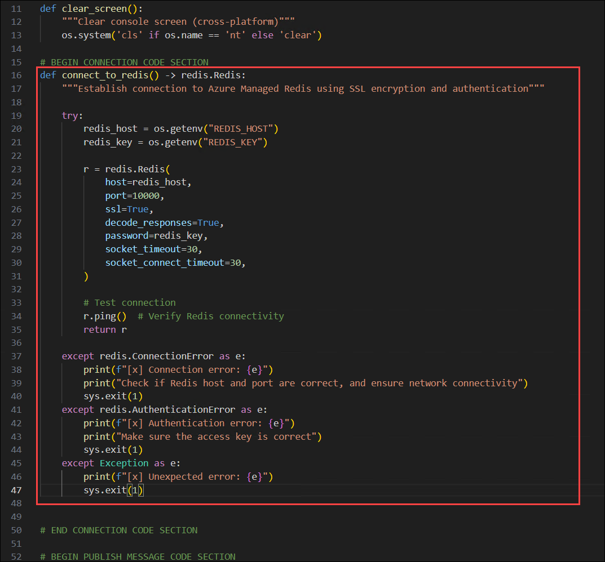

1. Save your changes using **Ctrl + S**.

### Task 3.2: Add the publish message code

In this section, you add code to publish event messages to specific Redis channels using the **publish()** method. The publisher sends JSON-formatted messages containing event data such as order information. Each call to **publish()** returns the number of active subscribers that received the message, allowing you to verify the message was delivered. This is the core of the pub/sub pattern where the publisher doesn't need to know about individual subscribers.

1. Locate the **# BEGIN PUBLISH MESSAGE CODE SECTION** comment and add the following code under the comment. Be sure to check for proper code alignment.

   ```python
   def publish_order_created(r: redis.Redis) -> None:
       """Publish an order created event using r.publish() to the 'orders:created' channel"""
       clear_screen()
       print("=" * 60)
       print("Publishing: Order Created Event")
       print("=" * 60)

       order_data = {
           "event": "order_created",
           "order_id": f"ORD-{datetime.now().strftime('%Y%m%d%H%M%S')}",
           "customer": "Jane Doe",
           "total": 129.99,
           "timestamp": datetime.now().isoformat()
       }

       message = json.dumps(order_data)
       channel = "orders:created"

       # Publish message and get subscriber count
       subscribers = r.publish(channel, message)  # Send message to channel, returns number of subscribers that received it

       print(f"\n[>] Published to channel: '{channel}'")
       print(f"[#] Active subscribers: {subscribers}")
       print(f"\n[i] Message content:")
       print(json.dumps(order_data, indent=2))

       input("\n[+] Press Enter to continue...")
   ```

   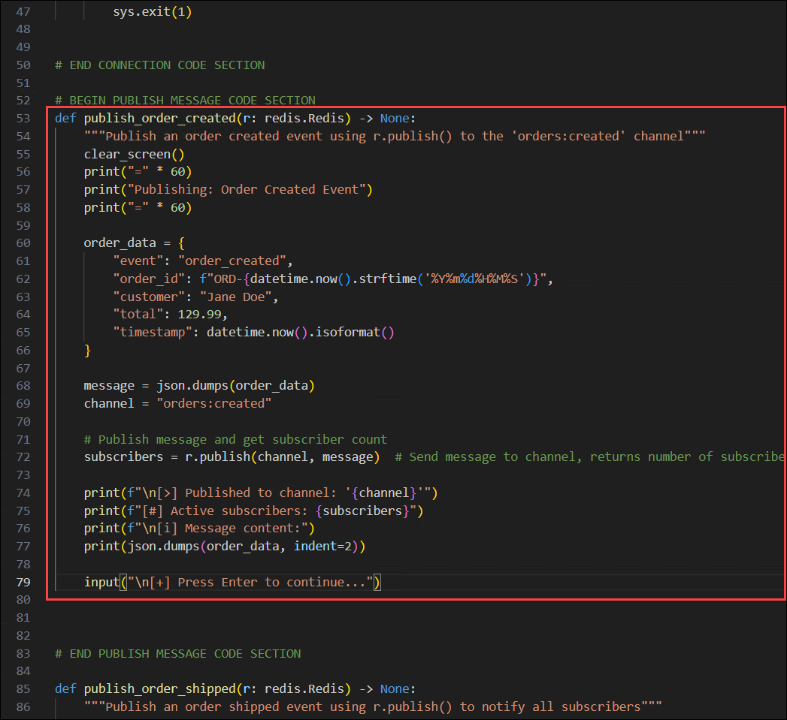

1. Save your changes using **Ctrl + S**.

### Task 3.3: Add the broadcast message code

In this section, you add code to broadcast the same message to multiple channels simultaneously using a loop with **publish()**. Broadcasting is useful for system-wide announcements or events that need to reach subscribers across different channels. This demonstrates the one-to-many messaging capability of pub/sub, where a single message can efficiently reach all interested subscribers across multiple channels in real-time.

1. Locate the **# BEGIN BROADCAST CODE SECTION** comment and add the following code under the comment. Be sure to check for proper code alignment.

   ```python
   def broadcast_to_all(r: redis.Redis) -> None:
       """Broadcast a message to all channels using r.publish() in a loop for multi-channel delivery"""
       clear_screen()
       print("=" * 60)
       print("Broadcasting: System Announcement")
       print("=" * 60)

       announcement = {
           "event": "system_announcement",
           "message": "System maintenance scheduled for 2 AM",
           "priority": "high",
           "timestamp": datetime.now().isoformat()
       }

       channels = ["orders:created", "orders:shipped", "inventory:alerts", "notifications"]
       message = json.dumps(announcement)

       print(f"\n[>] Broadcasting to {len(channels)} channels...")
       print(f"Channels: {', '.join(channels)}\n")

       total_subscribers = 0
       for channel in channels:
           count = r.publish(channel, message)  # Send same message to multiple channels
           total_subscribers += count
           print(f"  - {channel}: {count} subscriber(s)")

       print(f"\n[#] Total subscribers reached: {total_subscribers}")
       print(f"\n[i] Message content:")
       print(json.dumps(announcement, indent=2))

       input("\n[+] Press Enter to continue...")
   ```

   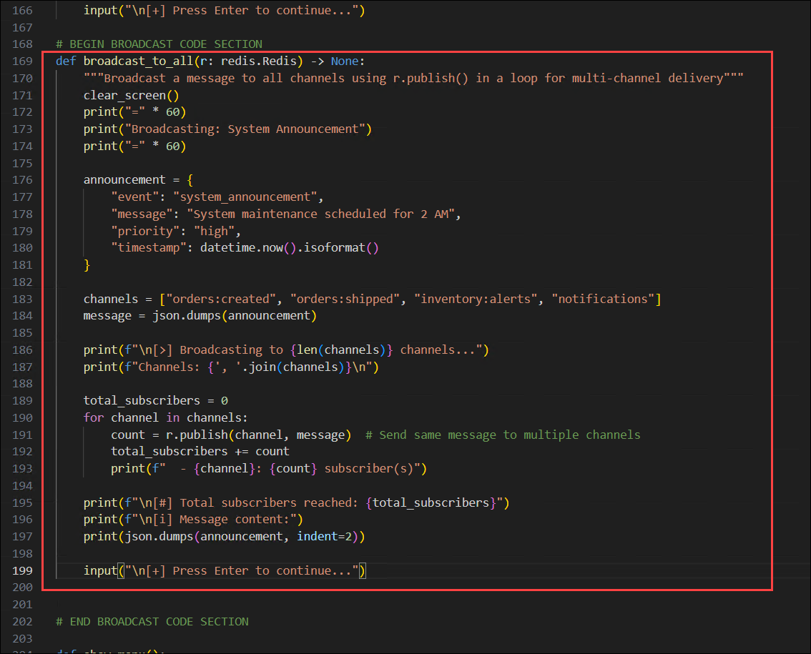

1. Save your changes using **Ctrl + S**.

1. Take a few minutes to review all of the code in the application.

## Task 4: Complete the subscriber app

In this task, you'll implement the subscriber application by formatting incoming messages, listening for published events in the background, and subscribing to channels and channel patterns to receive real-time notifications.

1. Open the **subscriber.py** file to begin adding code.

   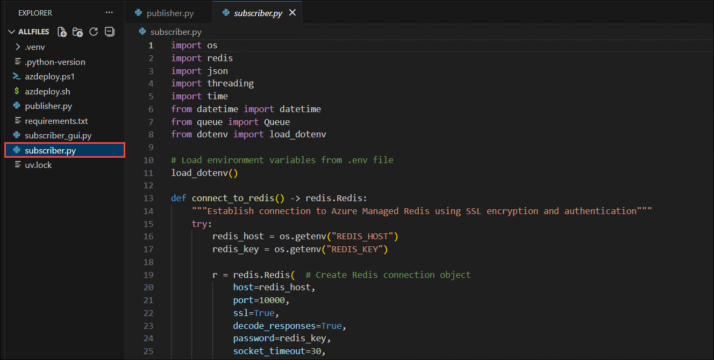

   > **Note:** The code blocks you add to the application should align with the comment for that section of the code.

### Task 4.1: Add message formatting code

In this section, you add code to format incoming pub/sub messages for display in the subscriber application. The **format_message_gui()** function parses JSON payloads from published messages and extracts relevant fields based on the event type. This function handles both standard channel messages and pattern-matched messages, providing a consistent and readable display format to understand what data is being transmitted through the pub/sub system.

1. Locate the **# BEGIN MESSAGE FORMATTING CODE SECTION** comment and add the following code under the comment. Be sure to check for proper code alignment.

   ```python
   def format_message_gui(message_data: dict) -> str:
       """Format message data for GUI display, parsing JSON payload and extracting relevant fields"""
       timestamp = datetime.now().strftime("%H:%M:%S")
       channel = message_data.get('channel', 'unknown')

       try:
           data = json.loads(message_data['data'])
           event_type = data.get('event', 'unknown')

           formatted = f"[{timestamp}] Message on '{channel}'\n"
           formatted += f"{'─' * 50}\n"
           formatted += f"Event: {event_type}\n"

           # Display relevant fields based on event type
           if 'order_id' in data:
               formatted += f"Order ID: {data['order_id']}\n"
           if 'customer' in data:
               formatted += f"Customer: {data['customer']}\n"
           if 'total' in data:
               formatted += f"Total: ${data['total']}\n"
           if 'tracking_number' in data:
               formatted += f"Tracking: {data['tracking_number']}\n"
           if 'product_name' in data:
               formatted += f"Product: {data['product_name']}\n"
           if 'current_stock' in data:
               formatted += f"Stock Level: {data['current_stock']}\n"
           if 'message' in data:
               formatted += f"Message: {data['message']}\n"

           formatted += f"{'─' * 50}\n"
           return formatted

       except json.JSONDecodeError:
           return f"[{timestamp}] {channel}: {message_data['data']}\n"
   ```

   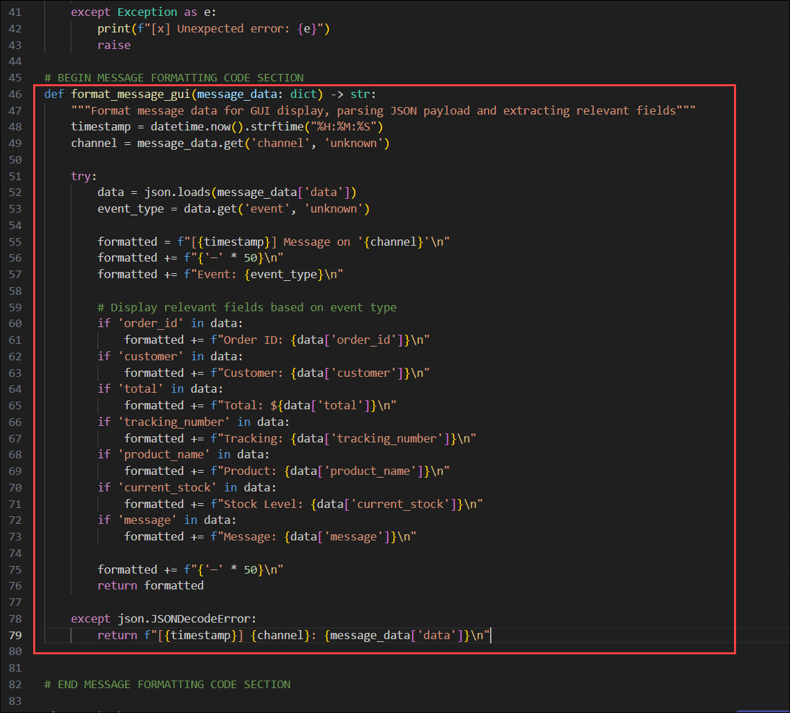

1. Save your changes using **Ctrl + S**.

### Task 4.2: Add the message listener code

In this section, you add code for the background listener thread that continuously monitors subscribed channels for incoming messages. The **listen_messages()** method uses the blocking **pubsub.listen()** iterator to receive messages as they are published. This demonstrates how subscribers passively wait for messages and handle different message types (direct channel messages vs. pattern-matched messages). The listener runs in a background thread to avoid blocking the main application while still receiving real-time message updates.

1. Locate the **# BEGIN MESSAGE LISTENER CODE SECTION** comment and add the following code under the comment. Be sure to check for proper code alignment.

   ```python
   def listen_messages(self):
       """Background thread to listen for messages using pubsub.listen() blocking iterator"""
       self.listener_active = True

       try:
           for message in self.pubsub.listen():  # Listen for published messages (blocking)
               if not self.listening:
                   break

               if message['type'] == 'message':
                   formatted = format_message_gui(message)
                   self.message_queue.put(formatted)

               elif message['type'] == 'pmessage':
                   # Pattern-based subscription
                   timestamp = datetime.now().strftime("%H:%M:%S")
                   pattern = message['pattern']
                   channel = message['channel']
                   try:
                       data = json.loads(message['data'])
                       event_type = data.get('event', 'unknown')
                       msg = f"[{timestamp}] Pattern '{pattern}' matched '{channel}'\n"
                       msg += f"{'-' * 50}\n"
                       msg += f"Event: {event_type}\n"
                       msg += f"Full message: {json.dumps(data, indent=2)}\n"
                       msg += f"{'-' * 50}\n"
                       self.message_queue.put(msg)
                   except json.JSONDecodeError:
                       self.message_queue.put(f"[{timestamp}] Pattern '{pattern}': {message['data']}\n")

       except Exception as e:
           if self.listening:
               self.message_queue.put(f"[x] Listener error: {e}\n")
       finally:
           self.listener_active = False
   ```

   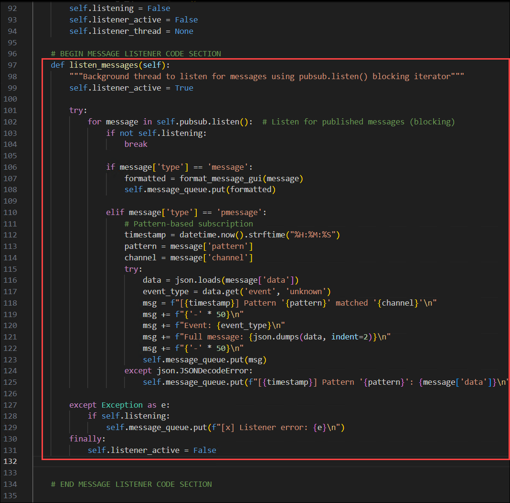

1. Save your changes using **Ctrl + S**.

### Task 4.3: Add code to subscribe to channels

In this section, you add code to handle channel and pattern subscriptions. The **subscribe_to_channel()** method registers interest in a specific channel using **pubsub.subscribe()**, while **subscribe_to_pattern()** uses **pubsub.psubscribe()** for wildcard pattern matching (e.g., "orders:\*"). These functions demonstrate the two main subscription strategies in Redis pub/sub: direct channel subscriptions for specific events and pattern-based subscriptions for flexibility. After subscribing, the listener is restarted to begin receiving messages on the new channels.

1. Locate the **# BEGIN SUBSCRIBE CHANNEL/PATTERN CODE SECTION** comment and add the following code under the comment. Be sure to check for proper code alignment.

   ```python
   def subscribe_to_channel(self, channel: str) -> str:
       """Subscribe to a specific channel using pubsub.subscribe() for direct messaging"""
       try:
           self.pubsub.subscribe(channel)  # Subscribe to channel
           self.restart_listener()
           return f"[+] Subscribed to channel: '{channel}'"
       except Exception as e:
           return f"[x] Error subscribing: {e}"

   def subscribe_to_pattern(self, pattern: str) -> str:
       """Subscribe using a pattern with pubsub.psubscribe() for wildcard channel matching (e.g., 'orders:*')"""
       try:
           self.pubsub.psubscribe(pattern)  # Subscribe to pattern (e.g., 'orders:*')
           self.restart_listener()
           return f"[+] Subscribed to pattern: '{pattern}'"
       except Exception as e:
           return f"[x] Error subscribing: {e}"
   ```

   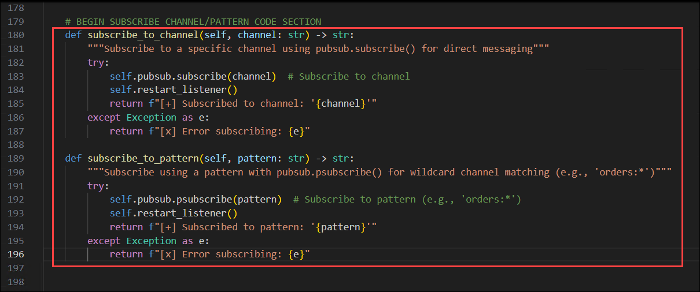

1. Save your changes.

1. Take a few minutes to review all of the code in the application.

## Task 5: Verify resource deployment

In this task, you'll verify that the Azure Managed Redis deployment has completed successfully, retrieve the Redis endpoint and access key, and generate the environment configuration required by the applications.

1. Run the appropriate command in the terminal to start the deployment script. If you closed the previous terminal, use **Ctrl + `** to open a new one.

   **Bash**

   ```bash
   bash azdeploy.sh
   ```

   **PowerShell**

   ```powershell
   ./azdeploy.ps1
   ```

1. When the deployment menu appears, enter **2** to run the **2. Check deployment status** option. If the status **Successful** returned proceed to the next step. If not, then wait a few minutes and try the option again.

   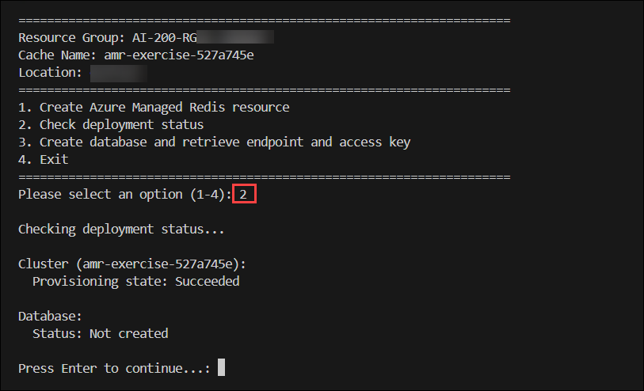

1. After the deployment is complete, enter **3** to run the **3. Create database and retrieve endpoint and access key** option. This creates the database, enables access key authentication, and retrieves the endpoint and access key. It then creates the **.env** file with those values.

   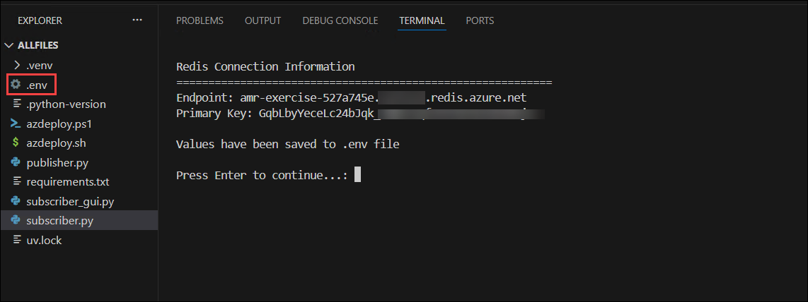

1. Review the **.env** file to verify the values are present.

   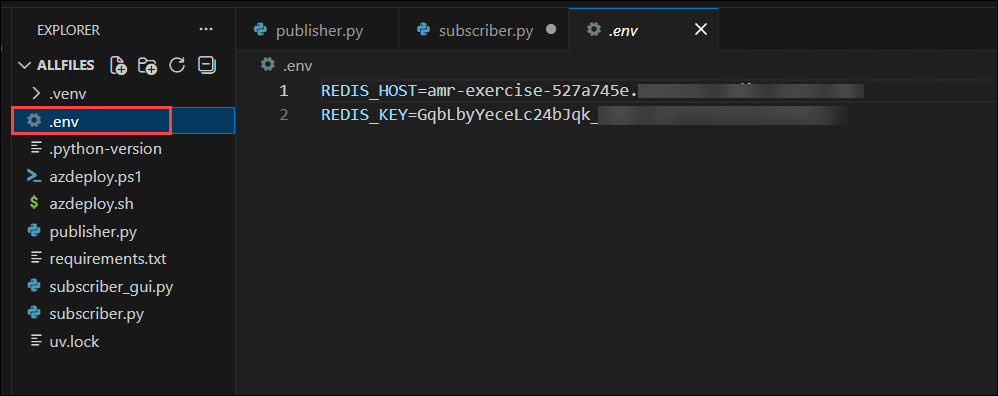

1. Now enter **4** to exit the deployment script.

## Task 6: Run the apps

In this task, you'll run both the publisher and subscriber applications, subscribe to Redis channels, publish event messages, and observe real-time communication between the applications using Redis Pub/Sub.

### Task 6.1: Open two terminals

You need to ensure the Python environment is running in both terminals. Refer to the commands from earlier in the exercise to activate the environment if needed.

1. If you don't have a terminal open, select **ellipsis (...) (1) > Terminal (2) > New Terminal (3)** in the VS Code menu bar.

   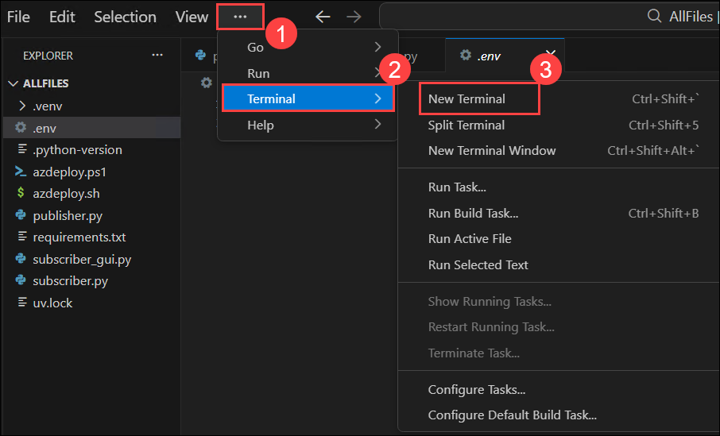

   > **NOTE:** If you are using Bash, after the terminal opens, click on the **+ (1)** icon to open a new terminal and select **Git Bash (2)** from the drop-down. If you are using PowerShell, skip this step.
   >
   > 

1. Verify you are in the root folder of the project, and activate the Python environment if needed. This terminal is named **Terminal 1** in the rest of the exercise.

1. If you don't have a terminal open, select **ellipsis (...) (1) > Terminal (2) > New Terminal (3)** in the VS Code menu bar. This will open a terminal in a new window that you can reposition. Activate the Python environment if needed. This terminal is named **Terminal 2** in the rest of the exercise.

   

   > **Note:** Run the following commands in the VS Code terminal to create and activate the Python environment.
   >
   > ```
   > python -m venv .venv
   > ```
   >
   > **Bash**
   >
   > ```bash
   > source .venv/Scripts/activate
   > ```
   >
   > **PowerShell**
   >
   > ```powershell
   > .\.venv\Scripts\Activate.ps1
   > ```

### Task 6.2: Launch the apps

1. Run the following command in **Terminal 2** to start the publisher app. After the app connects to Redis, press **Enter** to display the menu. Refer to the commands from earlier in the exercise to activate the environment, if needed, before running the command.

   ```
   python publisher.py
   ```

   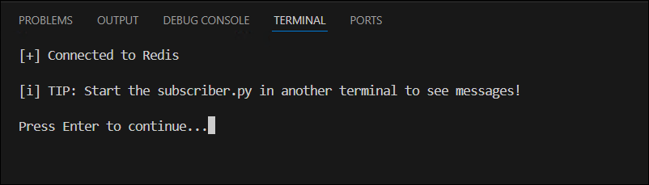

1. Run the following command in **Terminal 1** to start the subscriber app. The app will launch a new window with a GUI created with **tkinter**. Refer to the commands from earlier in the exercise to activate the environment, if needed, before running the command.

   ```
   python subscriber.py
   ```

   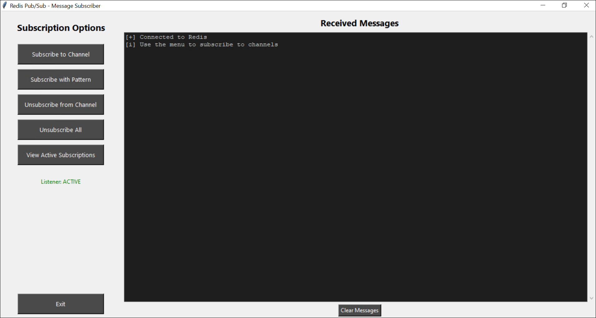

1. Position both of the applications so they run side-by-side.

   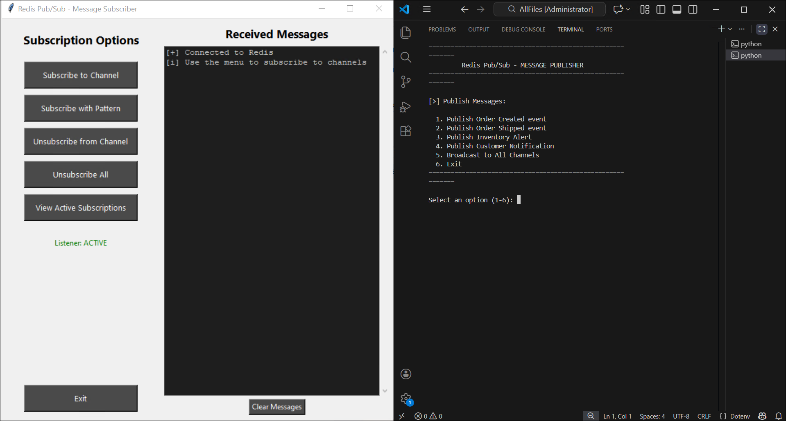

### Task 6.3: Send and receive messages

You need to first subscribe to a channel before you can receive messages.

1. In the subscriber app, select **Subscribe to Channel (1)**. Enter **orders:created (2)** in the channel name input box and select **Subscribe (3)**.

   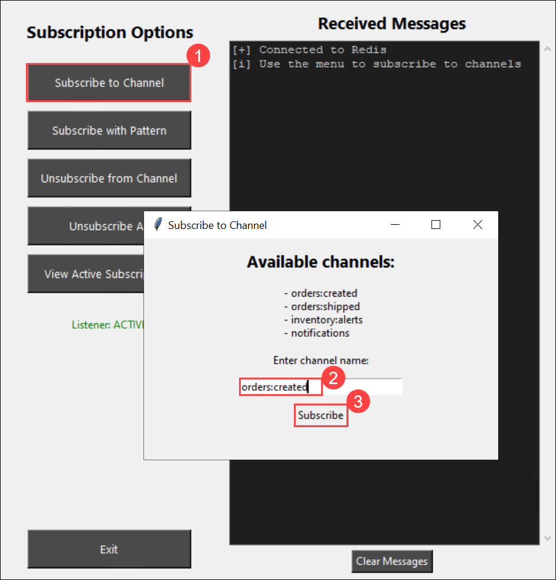

1. You should see a **Subscribed to channel: 'orders:created'** message in the **Received Messages** area. Next you publish a message.

   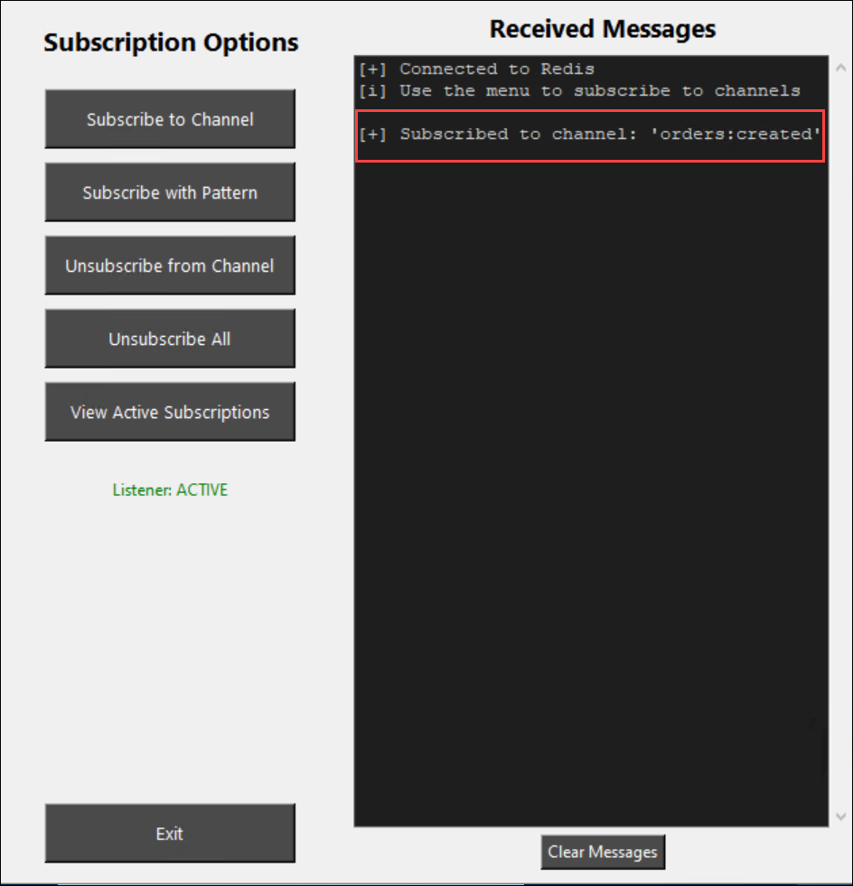

1. In the publisher app, enter **1** to publish an order created event. You should see an event was published successfully to the channel.

   ```
   [>] Published to channel: 'orders:created'
   [#] Active subscribers: 1

   [i] Message content:
   {
     "event": "order_created",
     "order_id": "ORD-20251120123114",
     "customer": "Jane Doe",
     "total": 129.99,
     "timestamp": "2025-11-20T12:31:14.906797"
   }
   ```

   The message should appear in the **Received Messages** section of the subscriber app.

   ```
   [12:31:14] Message on 'orders:created'
   ──────────────────────────────────────────────────
   Event: order_created
   Order ID: ORD-20251120123114
   Customer: Jane Doe
   Total: $129.99
   ──────────────────────────────────────────────────
   ```

   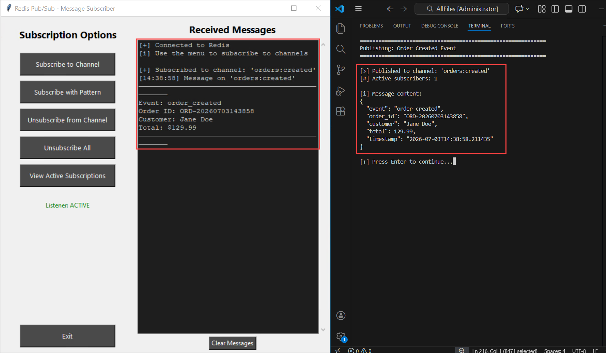

1. In the publisher app, enter **2** to publish an **Order Shipped** event. The event will be sent, but it will not appear in the subscriber app because you only subscribed to the **orders:created** channel.

   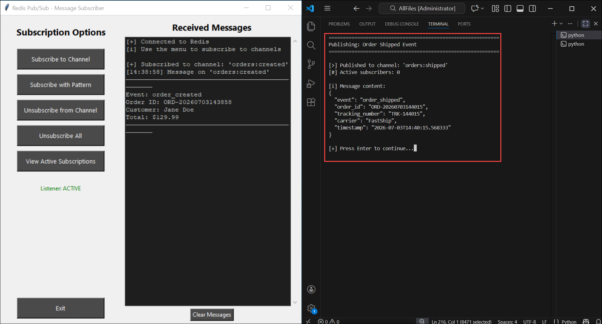

### Task 6.4: Experiment with other subscription/publishing options

Take some time to experiment subscribing and publishing messages to different channels. Following is a table with details on each of the subscriber options:

| Subscriber Option         | Description                                                                                                                    |
| ------------------------- | ------------------------------------------------------------------------------------------------------------------------------ |
| Subscribe to Channel      | Subscribes to a single channel. The channel options are listed in the dialog box.                                              |
| Subscribe with Pattern    | Subscribe to multiple channels. For example, subscribing with the **orders:\*** pattern subscribes to all **orders** channels. |
| Unsubscribe from Channel  | Unsubscribe from a single channel. Note: you can't unsubscribe using a pattern using this option.                              |
| Unsubscribe All           | Unsubscribe from all channels, including pattern subscriptions.                                                                |
| View Active Subscriptions | Lists all of the subscribed channels, including pattern subscriptions.                                                         |

## Summary

In this exercise, you deployed an Azure Managed Redis resource and completed both a publisher and a subscriber application using the redis-py library. You implemented a secure connection to Azure Managed Redis, published JSON-formatted messages to Redis channels, broadcast messages across multiple channels, and built a subscriber application that listens for events using direct channel subscriptions and wildcard pattern matching. Finally, you verified the deployment, configured the application environment, and validated real-time message delivery by running both applications and observing Redis Pub/Sub communication.

## You have successfully completed the Hands-on Lab!
