# Lab 17: Implement semantic search in Azure Managed Redis

### Estimated Duration : 60 Minutes

## Lab overview

In this hands-on lab, you create an Azure Managed Redis resource and complete the code for a vector storage application. The application loads sample product data with embeddings, stores new products with vector embeddings and metadata, performs semantic similarity searches using vector embeddings, and displays related products based on cosine similarity. You implement core vector operations including storing vectors as binary data with metadata, creating a RediSearch index with HNSW algorithm configuration, and executing KNN queries to find semantically similar products.

## Lab objectives

In this lab, you'll perform the following tasks:

- **Task 1:** Prepare the environment and deploy Azure Managed Redis
- **Task 2:** Configure the Python environment
- **Task 3:** Complete the manage vector app
- **Task 4:** Verify resource deployment
- **Task 5:** Run the app

### <span style="color:maroon">**Note:** This lab includes deployment scripts for both **Bash** and **PowerShell**. Click on the drop-down arrow ▶ to expand the commands for your preferred shell. Once you make your choice, use the corresponding commands throughout the entire lab.</span>

## Task 1: Prepare the environment and deploy Azure Managed Redis

In this task, you'll prepare the development environment, configure the deployment script, authenticate to Azure, and deploy an Azure Managed Redis resource that will be used throughout the lab.

1. Launch **Visual Studio Code** (VS Code) from desktop.

   

1. Select **File Explorer (1)** from left panel. Click **Open Folder** in the menu.

   

1. Navigate to **C:\AllFiles (1)** folder containing the project files and click on **Select folder (2)**.

   

1. If you get "Do you trust the authors of the files in this folder?" prompt, click **Yes, I trust the authors**.

   

1. The project contains deployment scripts for both Bash (_azdeploy.sh_) and PowerShell (_azdeploy.ps1_). Open the appropriate file for your environment and change the two values: **Resource group name** as **<inject key="ResourceGroupName" enableCopy="false"/>** and **Azure Region** as **<inject key="Region" enableCopy="false"/>** at the top of the script to meet your needs.

   > **Note:** Do not change anything else in the script.

   ```
   "<your-resource-group-name>" # Resource Group name
   "<your-azure-region>" # Azure region for the resources
   ```

   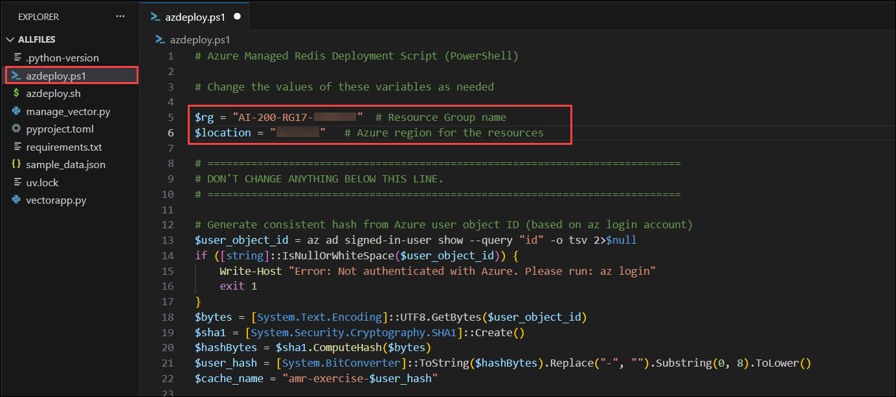

   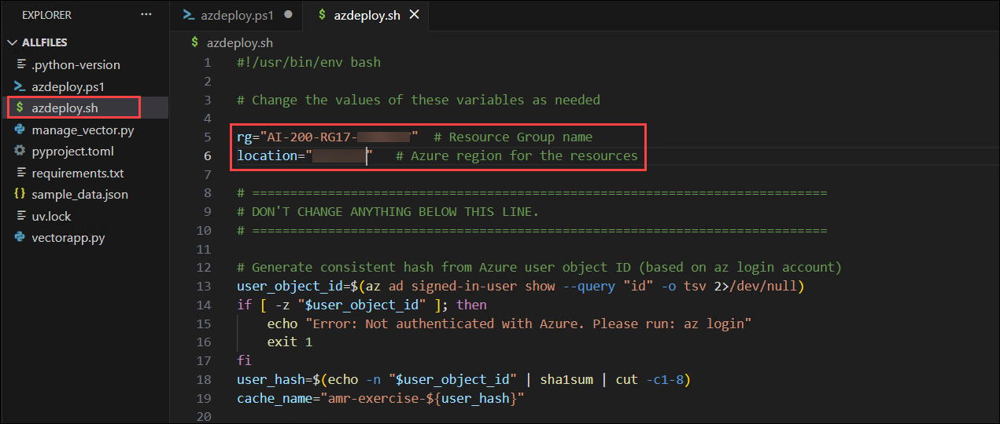

1. In the menu bar, select **File (1)** and select **Save All (2)** from drop-down.

   

1. In the menu bar, select **ellipsis (...) (1)**, then **Terminal (2)**, and then **New Terminal (3)** to open a terminal window in VS Code.

   

   > **NOTE:** If you are using Bash, after the terminal opens, click on the **+ (1)** icon to open a new terminal and select **Git Bash (2)** from the drop-down. If you are using PowerShell, skip this step.
   >
   > 

1. Run the following command in the terminal to allow PowerShell scripts to run. This command is only required if you are using PowerShell. If you are using Bash, skip this step.

   <details>
     <summary>PowerShell</summary>

   ```
   Set-ExecutionPolicy -ExecutionPolicy bypass -Force
   ```

   

   </details>

1. Run the **following command (1)** to login to your Azure account. Next, **minimize the VS Code window (2)** to view the login window opened in background.

   ```
   az login
   ```

   

1. In the login window, select **Work or school account (1)** and click **Continue (2)**.

   

1. In the login window, kindly sign in using the provided **Azure credentials (1)** and click **Next (2)**.
   - **Email/Username:** <inject key="AzureAdUserEmail"></inject>

     

1. Next, enter the provided **Password (1)** and click **Sign in (2)**.
   - **Password:** <inject key="AzureAdUserPassword"></inject>

     

1. Next, select **No, this app only** and navigate back to VS Code to continue.

   

1. Answer the prompts to select your Azure account and subscription for the exercise.

   

   > **NOTE:** To confirm you're logged in to the correct Azure subscription, run **az account show**.

1. Run the following command to install the **redisenterprise** extension for Azure CLI.

   ```
   az extension add --name redisenterprise
   ```

   

1. Run the appropriate command in the terminal to launch the script.

   <details>
     <summary>Bash</summary>

   ```bash
   bash azdeploy.sh
   ```

   </details>

   <details>
     <summary>PowerShell</summary>

   ```powershell
   ./azdeploy.ps1
   ```

   

   </details>

1. When the script is running, enter **1** to launch the **1. Create Azure Managed Redis resource** option.

   This option creates the resource group if it doesn't already exist, and starts a deployment of Azure Managed Redis. The process is completed as a background task in Azure.

   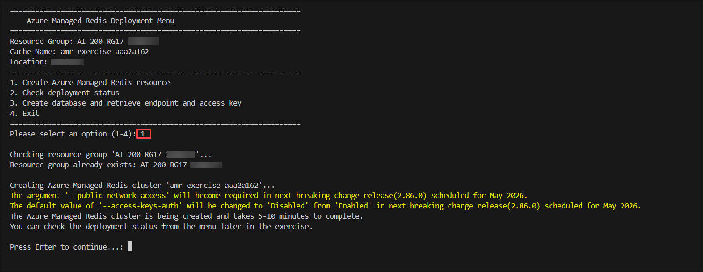

1. After the following messages appear in the console, select **Enter** to return to the menu and then select **4** to exit the script. You run the script again later to check on the deployment status and also to create the _.env_ file for the project.

   > **Note:** The Azure Managed Redis resource is being created and takes 5-10 minutes to complete.

   > **Note:** You can check the deployment status from the menu later in the exercise.

## Task 2: Configure the Python environment

In this task, you'll create a Python virtual environment, activate it, and install the required dependencies needed to run the vector search application.

1. Run the following command in the VS Code terminal to create the Python environment.

   ```
   python -m venv .venv
   py -3.12 -m venv .venv
   ```

1. Run the following command to activate the Python environment.

   <details>
     <summary>Bash</summary>

   ```bash
   source .venv/Scripts/activate
   ```

   </details>

   <details>
     <summary>PowerShell</summary>

   ```powershell
   .\.venv\Scripts\Activate.ps1
   ```

   </details>

1. Run the following command in the VS Code terminal to install the dependencies.

   ```
   pip install -r requirements.txt
   ```

   > **Note:** Do not close the terminal after completing this task, as you will be using the terminal in the following tasks.

## Task 3: Complete the manage vector app

In this task, you'll complete the application's core business logic by adding code to connect to Azure Managed Redis, create a RediSearch vector index, store vector embeddings with metadata, and perform semantic similarity searches using vector embeddings.

1. Open the **manage_vector.py** file to begin adding code.

   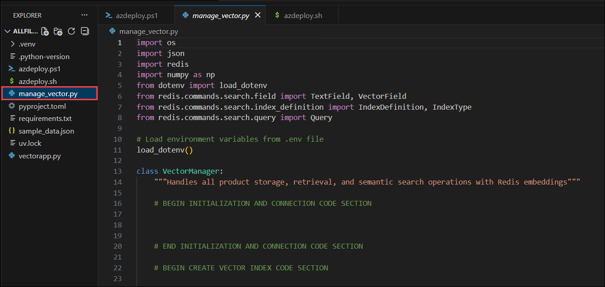

   > **Note:** The code blocks you add to the application should align with the comment for that section of the code.

### Task 3.1: Add the initialization and connection code

In this section, you add code to establish a connection to Azure Managed Redis using redis-py. The **\_connect_to_redis()** function uses the redis-py **Redis** class to create a secure SSL connection with authentication. The \***\*init**()\*\* method initializes the vector index for semantic search operations.

1. Locate the **# BEGIN INITIALIZATION AND CONNECTION CODE SECTION** comment and add the following code under the comment. Be sure to check for proper code alignment.

   ```python
   def __init__(self):
       """Initialize the product manager and establish Redis connection"""
       self.r = self._connect_to_redis()
       self._create_vector_index()  # Create RediSearch index for product embeddings
       self.VECTOR_DIM = 8  # Product embedding dimensionality (matches sample_data.json)

   def _connect_to_redis(self) -> redis.Redis:
       """Establish connection to Azure Managed Redis using SSL encryption and authentication"""
       try:
           # Get connection parameters from environment variables
           redis_host = os.getenv("REDIS_HOST")
           redis_key = os.getenv("REDIS_KEY")

           # Create Redis connection with SSL and authentication
           r = redis.Redis(
               host=redis_host,
               port=10000,  # Azure Managed Redis uses port 10000
               ssl=True,  # Use SSL encryption
               decode_responses=False,  # Keep binary for embeddings - only decode text when needed
               password=redis_key,  # Authentication key
               db=0,  # Connect to database 0 (the default database with RediSearch module)
               socket_timeout=30,  # Connection timeout
               socket_connect_timeout=30,  # Socket timeout
           )

           # Test connection
           r.ping()  # Verify Redis connectivity
           return r

       except redis.ConnectionError as e:
           raise Exception(f"Connection error: {e}")
       except redis.AuthenticationError as e:
           raise Exception(f"Authentication error: {e}")
       except Exception as e:
           raise Exception(f"Unexpected error: {e}")
   ```

   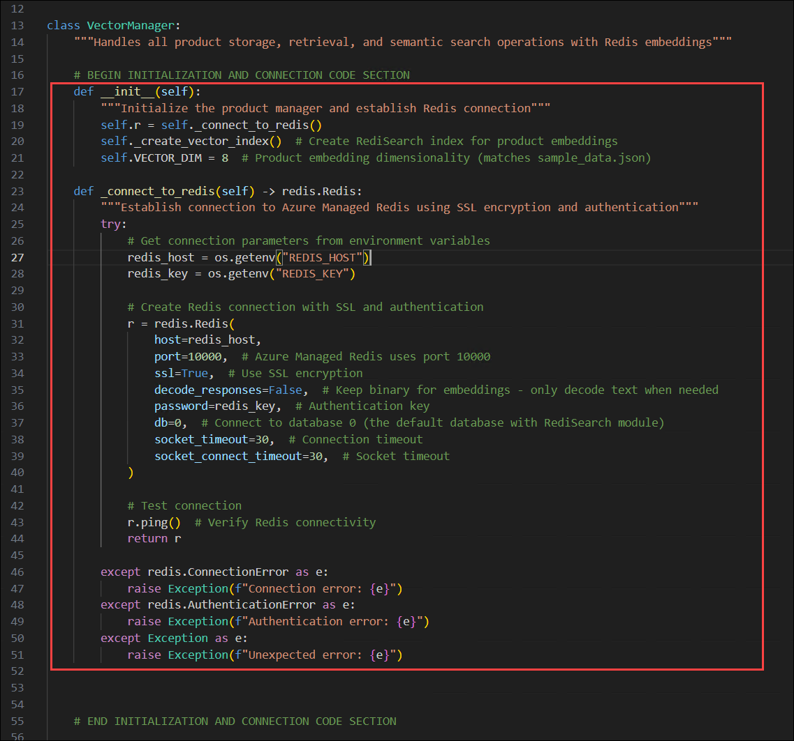

1. Save your changes using **Ctrl + S**.

### Task 3.2: Add the create vector index code

In this section, you add code to create a RediSearch index for vector similarity search using the redis-py search module. The **\_create_vector_index()** function defines the schema with text fields and a VectorField configured for HNSW (Hierarchical Navigable Small World) indexing with cosine similarity, enabling efficient semantic search operations.

1. Locate the **# BEGIN CREATE VECTOR INDEX CODE SECTION** comment and add the following code under the comment. Be sure to check for proper code alignment.

   ```python
   def _create_vector_index(self):
       """Create a RediSearch index for product semantic search using HNSW algorithm"""
       try:
           # Define schema with embedding field for HNSW-based product similarity search
           # DIM=8 matches our sample data dimensions (in production, this would match your embedding model's output)
           schema = (
               TextField("name"),
               TextField("category"),
               TextField("product_id"),
               VectorField(
                   "embedding",
                   "HNSW",  # Hierarchical Navigable Small World - fast approximate search
                   {
                       "TYPE": "FLOAT32",           # Standard for embeddings
                       "DIM": 8,                    # Must match embedding dimensions in sample_data.json
                       "DISTANCE_METRIC": "COSINE"  # Cosine similarity for semantic search
                   }
               )
           )

           # Create index on hash keys starting with "product:"
           definition = IndexDefinition(
               prefix=["product:"],
               index_type=IndexType.HASH
           )
           self.r.ft("idx:products").create_index(
               fields=schema,
               definition=definition
           )
       except redis.ResponseError as e:
           if "already exists" in str(e):
               pass  # Index already exists, which is fine
           else:
               raise Exception(f"Error creating vector index: {str(e)}")
       except Exception as e:
           raise Exception(f"Error creating vector index: {str(e)}")
   ```

   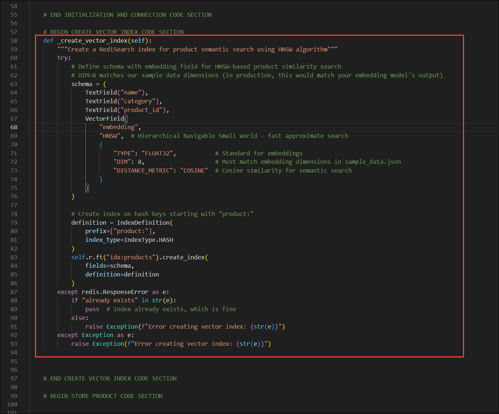

1. Save your changes.

### Task 3.3: Add the store product code

In this section, you add code to store products with vector embeddings and metadata using Redis. The **store_product()** function uses numpy to convert embedding arrays to binary float32 bytes, then uses the redis-py **hset()** method to store the binary embedding and metadata fields in a Redis hash structure. This approach provides efficient storage and retrieval of vector data.

1. Locate the **# BEGIN STORE PRODUCT CODE SECTION** comment and add the following code under the comment. Be sure to check for proper code alignment.

   ```python
   def store_product(self, vector_key: str, vector: list, metadata: dict = None) -> tuple[bool, str]:
       """Store a product with embedding in Redis using hash data structure with binary embedding storage"""
       try:
           # Convert embedding to binary bytes using numpy for efficient storage
           # This follows redis-py best practices for storing embeddings
           embedding = np.array(vector, dtype=np.float32)
           data = {"embedding": embedding.tobytes()}  # Store embedding as binary bytes

           # Add metadata fields to the hash
           if metadata:
               for key, value in metadata.items():
                   data[key] = str(value)

           # Store the hash in Redis using hset() method
           result = self.r.hset(vector_key, mapping=data)

           if result > 0:
               return True, f"Product stored successfully under key '{vector_key}'"
           else:
               return True, f"Product updated successfully under key '{vector_key}'"

       except Exception as e:
           return False, f"Error storing product: {e}"
   ```

   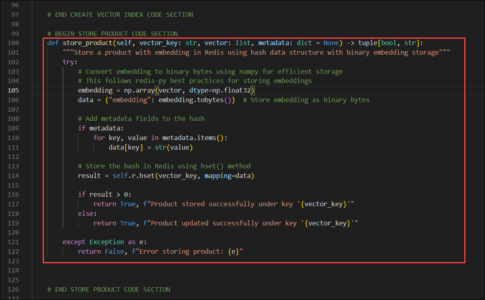

1. Save your changes.

### Task 3.4: Add the search similar products vector code

In this section, you add code to perform vector similarity search using RediSearch with the redis-py client. The **search_similar_products()** function uses numpy to convert the query vector to binary float32 bytes, then executes a KNN (k-nearest neighbors) query against the RediSearch index to find the most similar products based on cosine similarity of their embeddings.

1. Locate the **# BEGIN SEARCH SIMILAR PRODUCTS CODE SECTION** comment and add the following code under the comment. Be sure to check for proper code alignment.

   ```python
   def search_similar_products(self, query_vector: list, top_k: int = 3) -> tuple[bool, list | str]:
       """Search for products similar to the query vector using RediSearch KNN queries"""
       try:
           # Convert query vector to binary bytes for KNN search
           query_bytes = np.array(query_vector, dtype=np.float32).tobytes()

           # Build KNN query using RediSearch vector search syntax for semantic similarity
           # *=>[KNN k @field_name $query_vec] finds k most similar products based on embedding distance
           knn_query = (
               Query(f"*=>[KNN {top_k} @embedding $query_vec AS score]")
               .return_fields("name", "category", "product_id", "score")
               .sort_by("score")
               .dialect(2)  # Dialect 2 enables vector search syntax
           )

           # Execute KNN search with query vector as parameter
           results = self.r.ft("idx:products").search(
               knn_query,
               query_params={"query_vec": query_bytes}
           )

           if results.total == 0:
               return False, "No products found in Redis. Ensure products are loaded and RediSearch module is enabled."

           # Format results
           similarities = []
           for doc in results.docs:
               similarities.append({
                   "key": doc.id,
                   "similarity": float(doc.score),
                   "product_id": doc.product_id.decode() if isinstance(doc.product_id, bytes) else doc.product_id,
                   "name": doc.name.decode() if isinstance(doc.name, bytes) else doc.name,
                   "category": doc.category.decode() if isinstance(doc.category, bytes) else doc.category
               })

           return True, similarities

       except Exception as e:
           return False, f"Error searching products: {e}"
   ```

   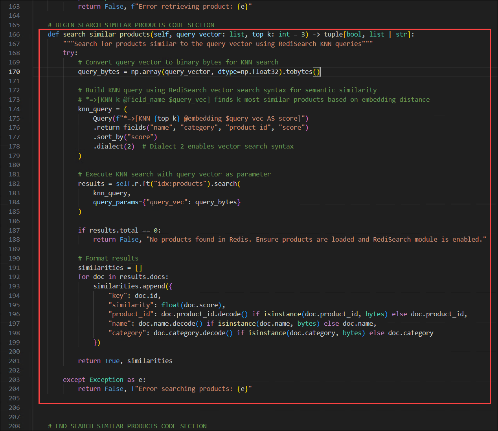

1. Save your changes.

1. Take a few minutes to review all of the code in the **manage_vector.py** file.

   > **Note:** Verify that the code indentation is preserved exactly as shown. Improper indentation can lead to syntax or execution errors and prevent the code from running successfully.

## Task 4: Verify resource deployment

In this task, you'll verify that the Azure Managed Redis deployment has completed successfully, create the database with vector search capabilities enabled, and generate the application's .env configuration file.

1. Run the appropriate command in the terminal to start the deployment script. If you closed the previous terminal, select **Ctrl + ` (backtick)** in the menu to open a new one.

   <details>
     <summary>Bash</summary>

   ```bash
   bash azdeploy.sh
   ```

   </details>

   <details>
     <summary>PowerShell</summary>

   ```powershell
   ./azdeploy.ps1
   ```

   </details>

1. When the deployment menu appears, enter **2** to run the **2. Check deployment status** option. If the status shows **Successful**, proceed to the next step. If not, then wait a few minutes and try the option again.

   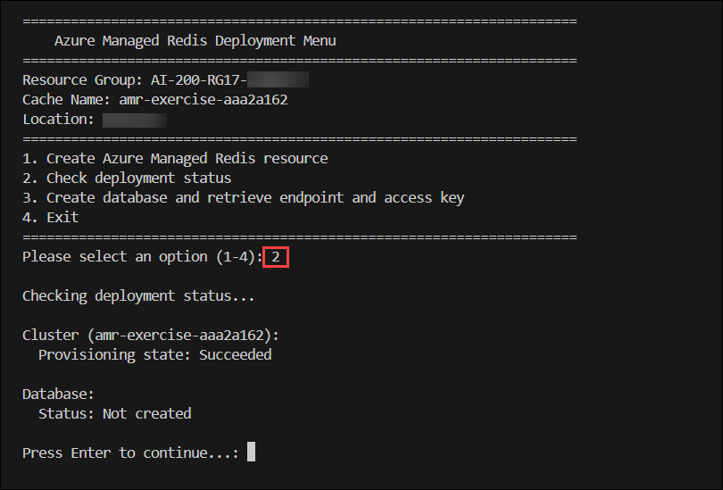

1. After the deployment is complete, enter **3** to run the **3. Create database and retrieve endpoint and access key** option. This creates the database with the RediSearch module, enables access key authentication, and retrieves the endpoint and access key. It then creates the **.env** file with those values.

   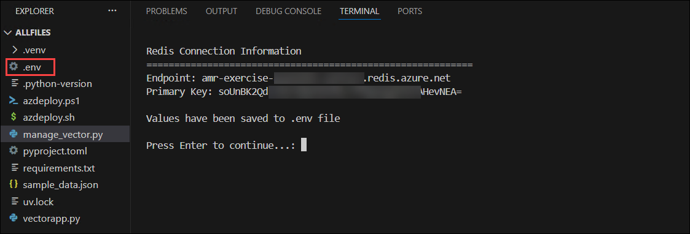

1. Review the **.env** file to verify the values are present.

   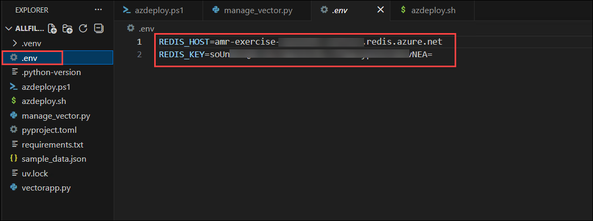

1. Then enter **4** to exit the deployment script.

## Task 5: Run the app

In this task, you'll run the completed application to load sample vector data, store new products with vector embeddings, and perform semantic similarity searches to validate the implementation.

1. Run the following command in the terminal to start the app. Refer to the commands from earlier in the exercise to activate the environment, if needed, before running the command.

   ```
   python vectorapp.py
   ```

   The app should look similar to the following image:

   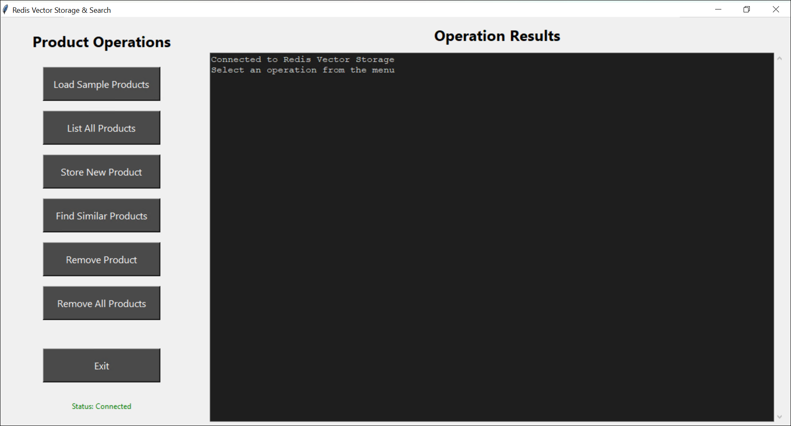

   > **Note:** All of the steps in this section are performed in the app.

### Task 5.1: Load sample data and perform a similarity search

In this section, you practice loading sample vector data into Redis and then performing a similarity search. You practice retrieving a known vector and using it as a query to find semantically related products in your database.

1. Select **Load Sample Products (1)**. The status of the load operation will appear in **Operation Results (2)**.

   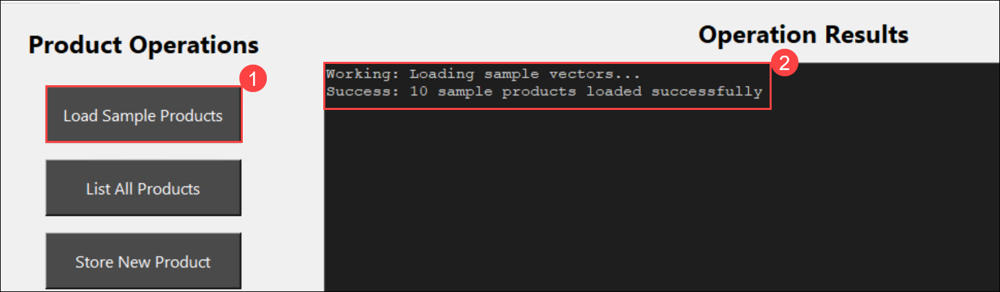

1. Select **List All Products (1)** to display the sample data. The sample data is listed **(2)** showing the: Key, Name, Category, and Embedding for the products in the sample data.

   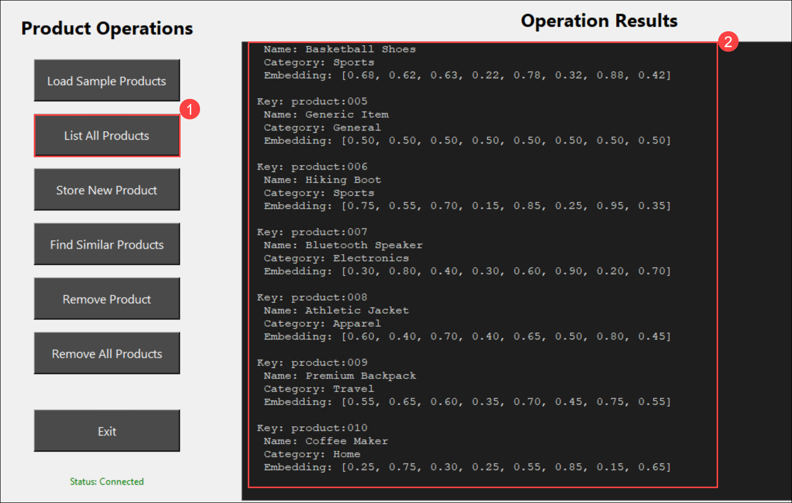

1. Select **Find Similar Products (1)** and enter `product:001` **(2)** in the **Product Key:** input field, then select **Search (3)**.

   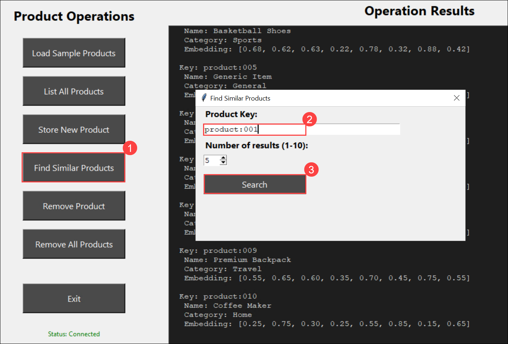

   A list of similar products is returned with the product information and the similarity score.

   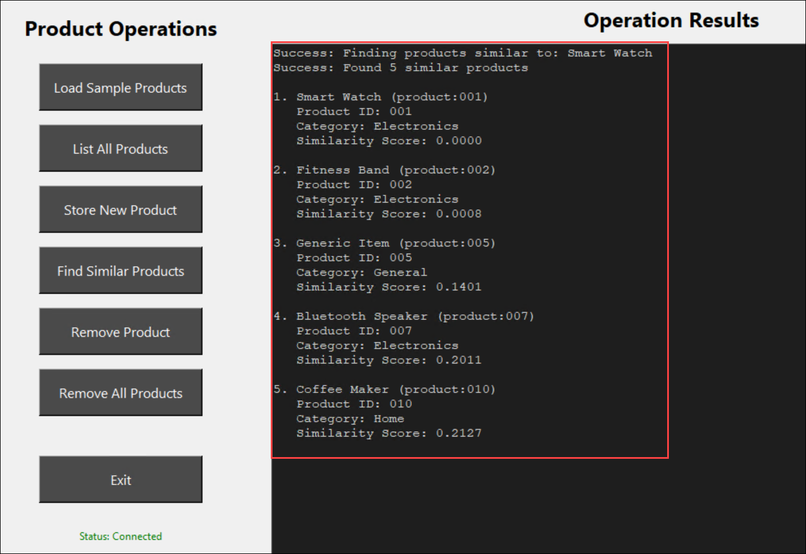

### Task 5.2: Store a new product and perform a similarity search

1. Select **Store New Product (1)** and enter the following information in the form, then select **Store Product (5)**. Review the operation results.
   - **Product Key:** `product:011` **(2)**

   - **Embedding:** `[0.53, 0.63, 0.58, 0.37, 0.68, 0.47, 0.73, 0.57]` **(3)**
   - **Metadata (4) :**

     ```
     product_id=011
     name=Gym Bag
     category=Sports
     ```

     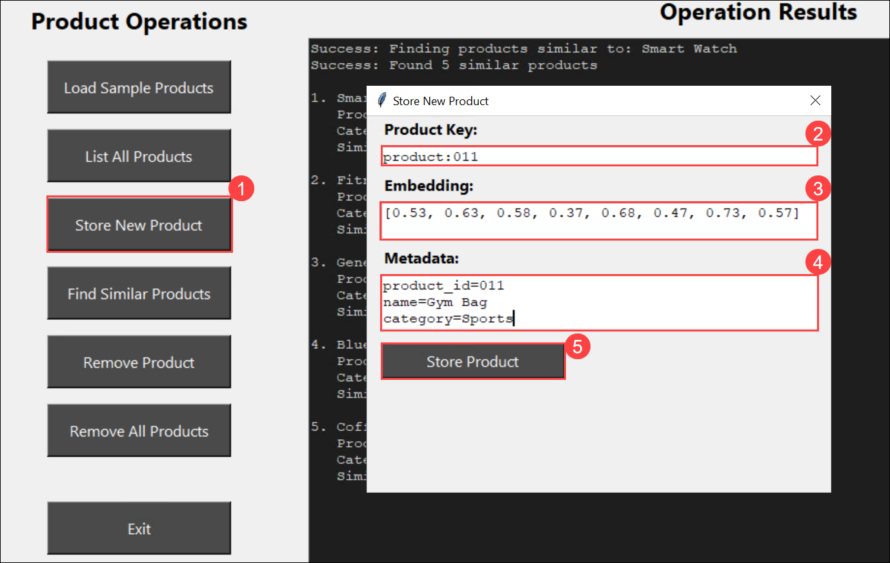

     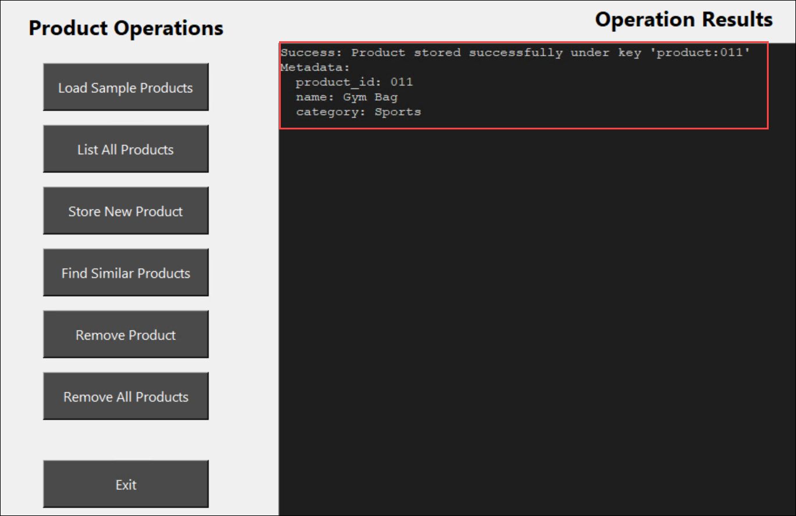

     > **Note:** You can also edit any data record by entering that record's product key in the **Store New Product** form and changing the other fields.

1. Select **Find Similar Products (1)** and enter `product:009` **(2)** in the **Product Key:** input field, then select **Search (3)**.

   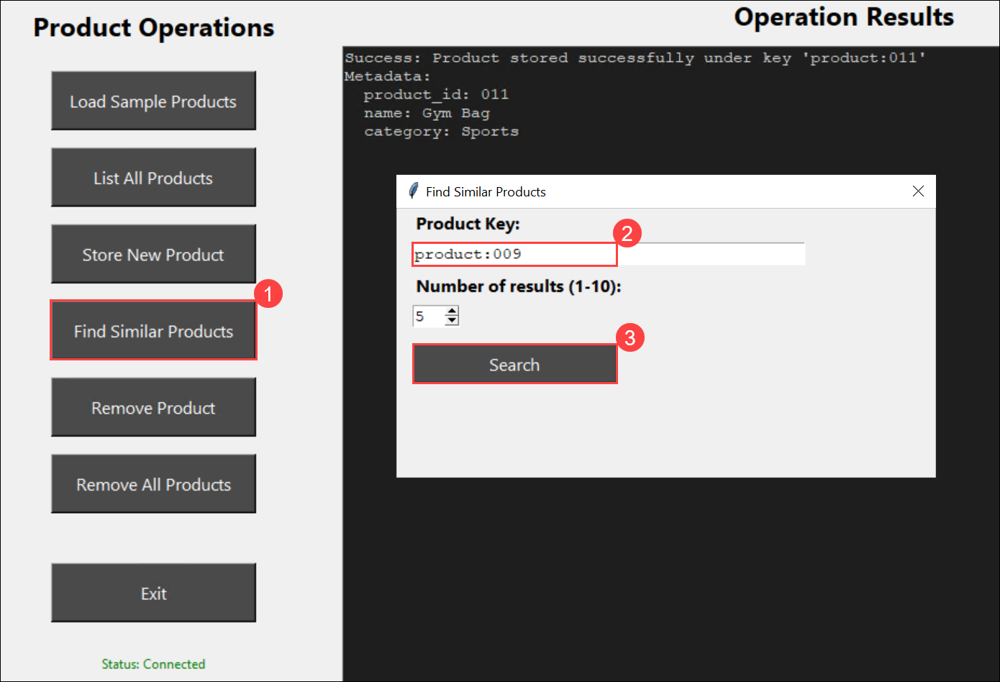

1. Review the output and notice the Gym Bag is now the product most similar to the Premium Backpack.

   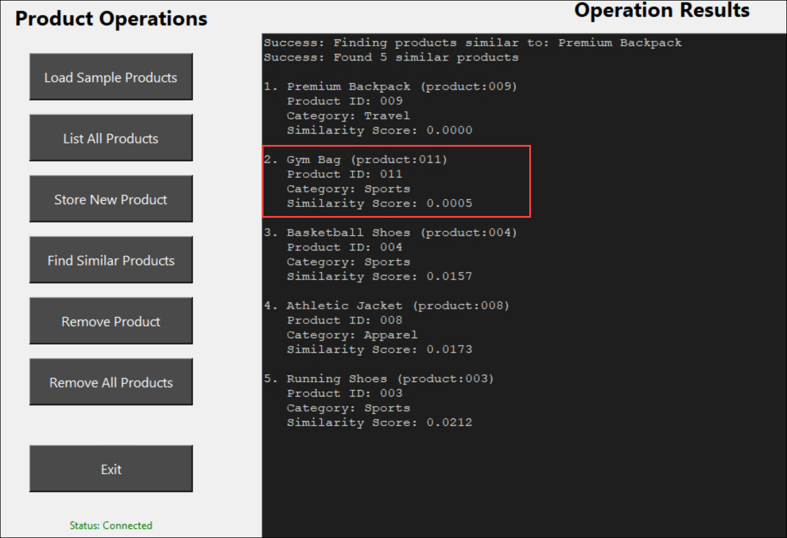

> **Congratulations** on completing the task! Now, it's time to validate it. Here are the steps:
>
> - If you receive a success message, you can proceed to the next task.
> - If not, carefully read the error message and retry the step, following the instructions in the lab guide.
> - If you need any assistance, please contact us at cloudlabs-support@spektrasystems.com. We are available 24/7 to help you out.

<validation step="50fc6a7a-a0e0-4aa0-823e-ee07ab17e5cc" />

## Summary

In this lab, you implement semantic search using **Azure Managed Redis** by creating a vector-enabled Redis instance, completing the application's vector storage and search logic, and running a sample application. You learn how to store vector embeddings with metadata, configure a **RediSearch HNSW** vector index, perform semantic similarity searches using **KNN** queries, and validate how vector search can identify semantically related products based on embedding similarity.

## You have successfully completed the Hands-on Lab!
