# Lab 01: Build and run a container image with ACR Tasks

### Estimated Duration : 60 Minutes

## Lab Overview

In this hands-on lab, you use Azure Container Registry (ACR) Tasks to build and manage container images entirely in the cloud, without requiring a local Docker installation.

## Lab Objective

In this lab, you'll perform the following tasks

- **Task 1:** Deploy Azure Container Registry
- **Task 2:** Build the image with ACR Tasks
- **Task 3:** Verify the image in the registry
- **Task 4:** Run the image with ACR Tasks
- **Task 5:** Build with a different tag
- **Task 6:** View build history and lock a production image

### <span style="color:maroon">**Note:** This lab includes deployment scripts for both **Bash** and **PowerShell**. Click on the drop-down arrow ▶ to expand the commands for your preferred shell. Once you make your choice, use the corresponding commands throughout the entire lab.</span>

## Task 1: Deploy Azure Container Registry

In this task, you use a script to deploy the necessary services to your Azure subscription. The Azure Container Registry deployment takes a few minutes to complete.

1. Launch **Visual Studio Code** (VS Code) from desktop.

   

1. Select **File Explorer (1)** from left panel. Click **Open Folder (2)** in the menu.

   

1. Navigate to **C:\AllFiles (1)** folder containing the project files and click on **Select folder (2)**.

   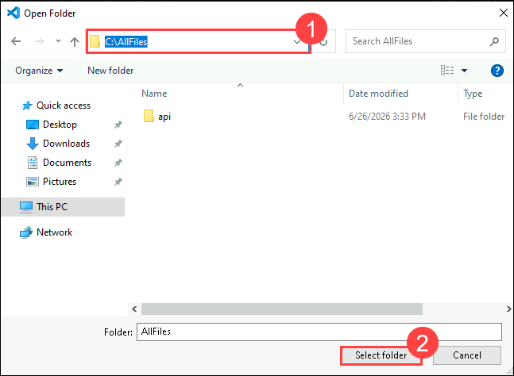

1. If you get "Do you trust the authors of the files in this folder?" prompt, click **Yes, I trust the authors**.

   

1. The project contains deployment scripts for both Bash (_azdeploy.sh_) and PowerShell (_azdeploy.ps1_). Open the appropriate file for your environment and change the two values: **Resource group name** as **<inject key="ResourceGroupName" enableCopy="false"/>** and **Azure Region** as **<inject key="Region" enableCopy="false"/>** at the top of the script to meet your needs.

   > **Note:** Do not change anything else in the script.

   ```
   "<your-resource-group-name>" # Resource Group name
   "<your-azure-region>" # Azure region for the resources
   ```

   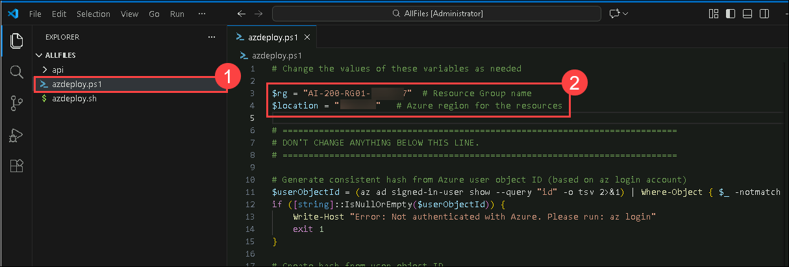

   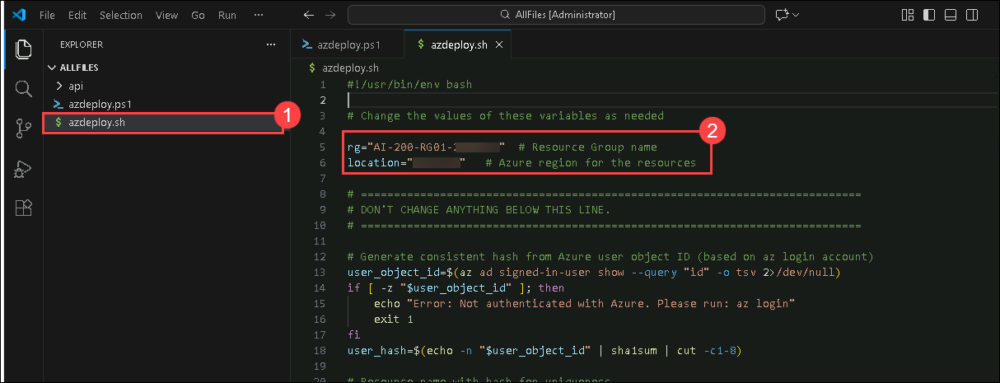

1. In the menu bar, select **File (1)** and select **Save All (2)** from drop-down.

   

1. In the menu bar, select **ellipsis (...) (1)**, then **Terminal (2)**, and then **New Terminal (3)** to open a terminal window in VS Code.

   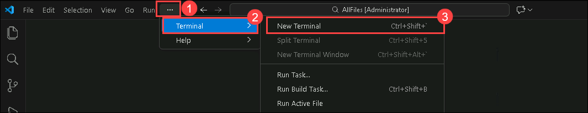

   > **NOTE:** If you are using Bash, after the terminal opens, click on the **+ (1)** icon to open a new terminal and select **Git Bash (2)** from the drop-down. If you are using PowerShell, skip this step.
   >
   > 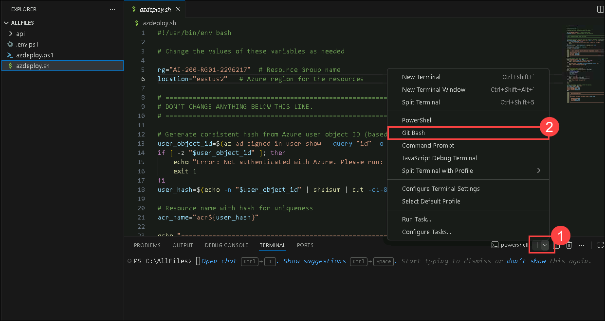

1. Run the following command in the terminal to allow PowerShell scripts to run. This command is only required if you are using PowerShell. If you are using Bash, skip this step.

   <details>
    <summary>PowerShell</summary>
   ```
   Set-ExecutionPolicy -ExecutionPolicy bypass -Force
   ```

   
   </details>

1. Run the **following command (1)** to login to your Azure account. Next, **minimize the VS Code window (2)** to view the login window opened in background.

   ```
   az login
   ```

   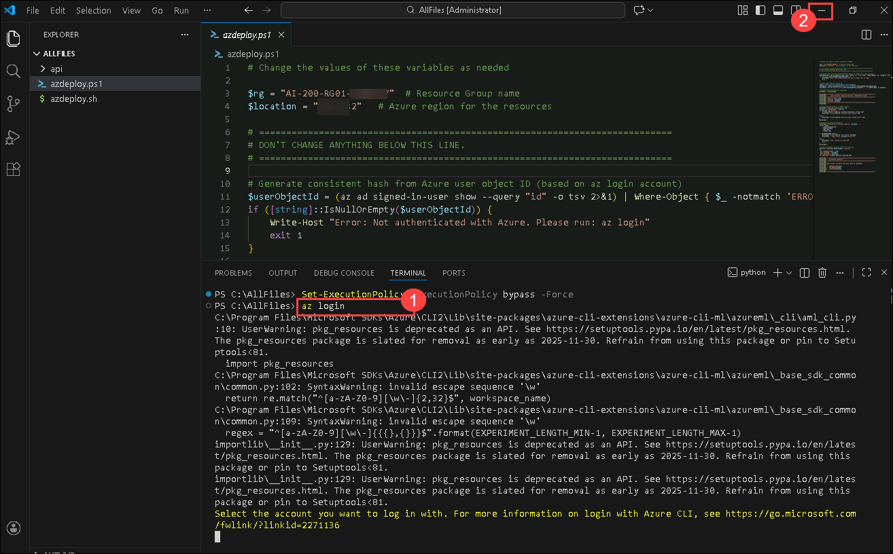

1. In the login window, select **Work or school account (1)** and click **Continue (2)**.

   

1. In the login window, kindly sign in using the provided **Azure credentials (1)** and click **Next (2)**.
   - **Email/Username:** <inject key="AzureAdUserEmail"></inject>

     

1. Next, enter the provided **Password (1)** and click **Sign in (2)**.
   - **Password:** <inject key="AzureAdUserPassword"></inject>

     

1. Next, select **No, this app only** and navigate back to VS Code to continue.

   

1. Answer the prompts to select your Azure account and subscription for the exercise.

   

   > **NOTE:** To confirm you're logged in to the correct Azure subscription, run **az account show**.

1. Make sure you are in the root directory of the project and run the appropriate command in the terminal to launch the deployment script. The deployment script will deploy Azure Container Registry(ACR) and create a file with environment variables needed for exercise.

   <details>
    <summary>Bash</summary>
   ```bash
   bash azdeploy.sh
   ```

   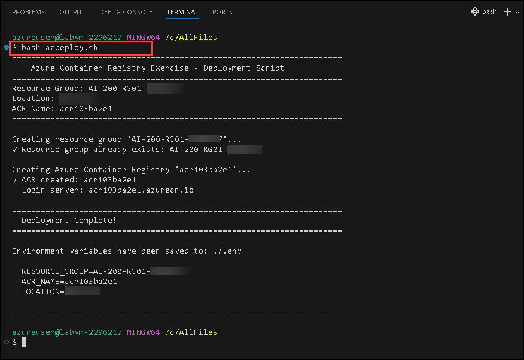
   </details>

   <details>
    <summary>PowerShell</summary>
   ```powershell
   ./azdeploy.ps1
   ```

   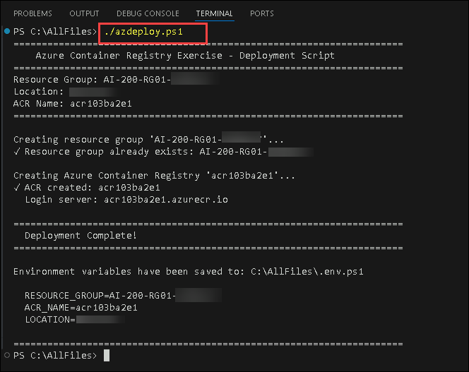
   </details>

1. To verify the deployment is successful, navigate to the Azure portal, in the search bar, type **Container registries (1)** and select **Container registries (2)** from the search results.

   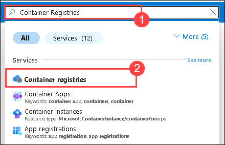

1. You should see one container registry created. Click on the container registry created.

   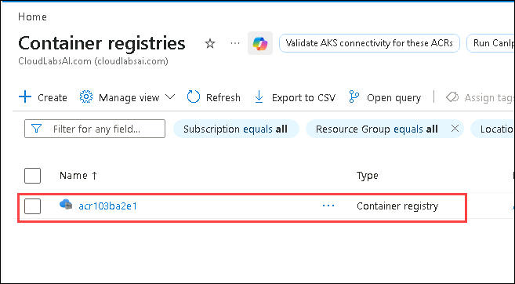

1. In the container registry page, click on **Access keys (1)** under **Settings** in the left menu. Make sure **Admin user (2)** is set to **Enabled**.

   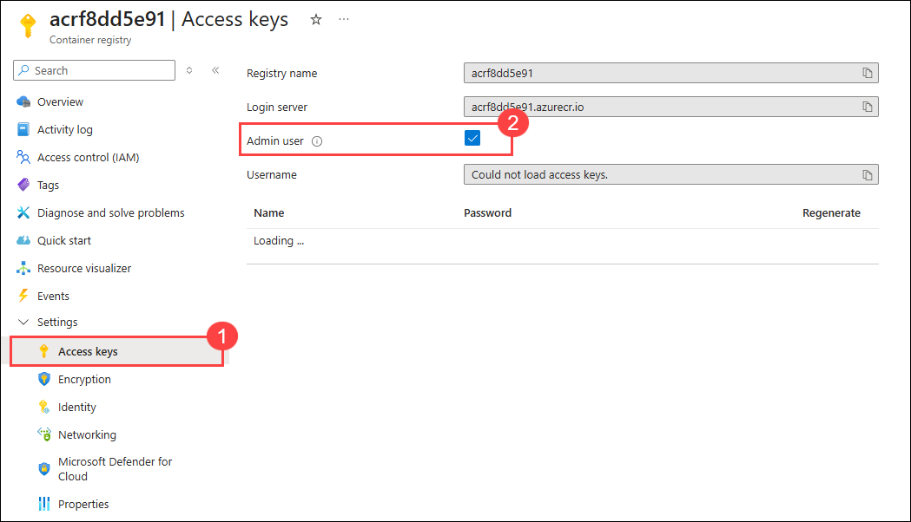

1. Run the appropriate command to load the environment variables into your terminal session.

   <details>
    <summary>Bash</summary>
   ```bash
   source .env
   ```

   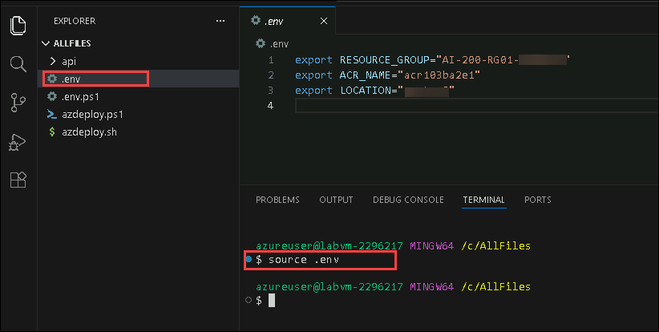
   </details>

   <details>
    <summary>PowerShell</summary>
   ```powershell
   . .\.env.ps1
   ```

   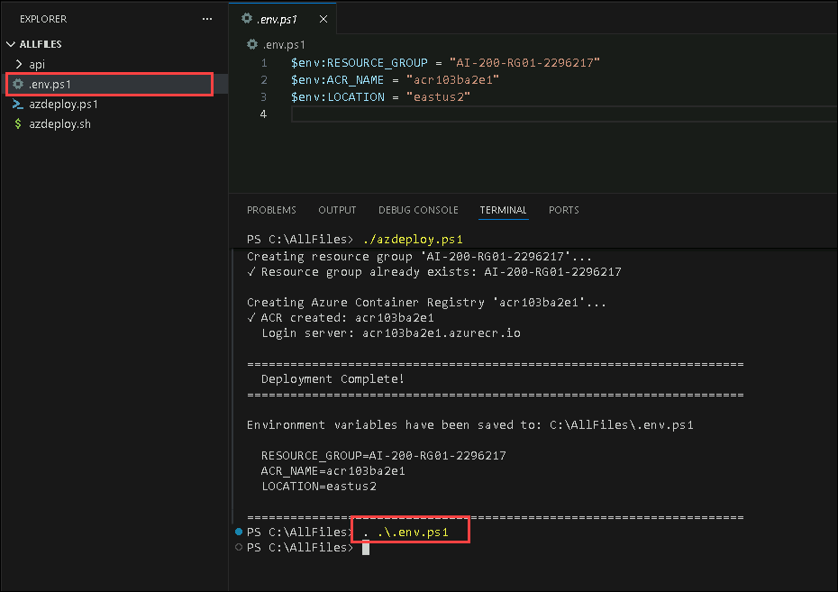
   </details>

   > **Note:** Keep the terminal open. If you close it and create a new terminal, you might need to run the command to create the environment variable again.

   > **NOTE:** Verify your environment variables are set by running **echo ACR_NAME** (Bash) or **$env:ACR_NAME** (PowerShell).

## Task 2: Build the image with ACR Tasks

In this task, you Use a quick task to build the image in Azure without requiring Docker on your local machine. The **az acr build** command uploads your source files, builds the image in the cloud, and pushes it to your registry.

1. Run the following command to build, and push it to your registry. The build completes entirely in Azure. No local Docker installation is required.

    <details>
     <summary>Bash</summary>
    ```bash
    az acr build \
        --registry $ACR_NAME \
        --image inference-api:v1.0.0 \
        ./api
    ```

   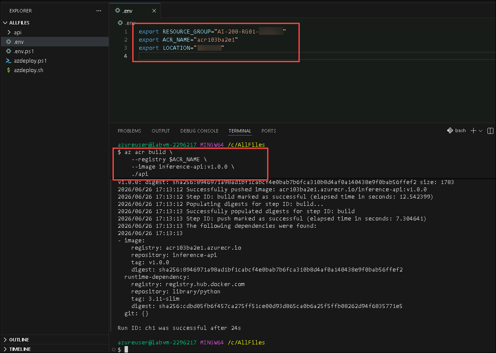
    </details>

   <details>
     <summary>PowerShell</summary>
    ```powershell
    az acr build `
        --registry $env:ACR_NAME `
        --image inference-api:v1.0.0 `
        ./api
    ```

   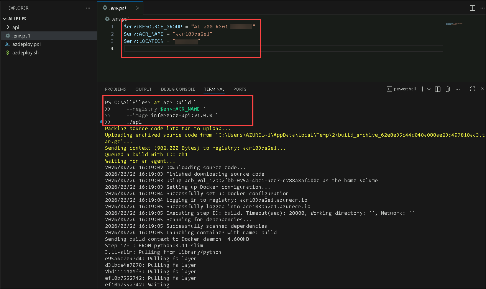
    </details>

1. Watch the output as ACR Tasks:
   - Packs and uploads your source context to Azure
   - Queues and starts the build task
   - Streams the Docker build output showing each layer
   - Pushes the completed image to your registry
   - Reports the image digest and task status

## Task 3: Verify the image in the registry

In this task, you confirm the image exists in your registry by listing repositories and tags.

1. Run the following command to list all repositories in the registry.

   <details>
    <summary>Bash</summary>
   ```bash
   az acr repository list --name $ACR_NAME --output table
   ```
   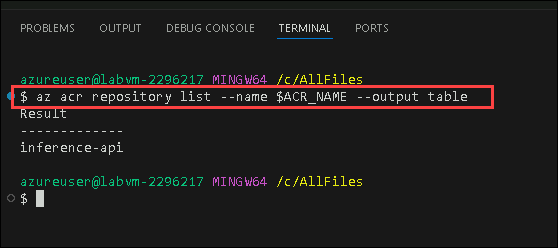
   </details>

   The output shows the **inference-api** repository you created.

   <details>
    <summary>PowerShell</summary>
   ```powershell
   az acr repository list --name $env:ACR_NAME --output table
   ```
   </details>

   The output shows the **inference-api** repository you created.

   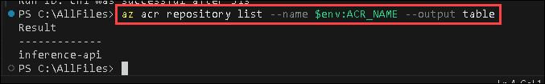

1. Run the following command to list tags for the **inference-api** repository.

   <details>
    <summary>Bash</summary>
   ```bash
   az acr repository show-tags \
       --name $ACR_NAME \
       --repository inference-api \
       --output table
   ```

   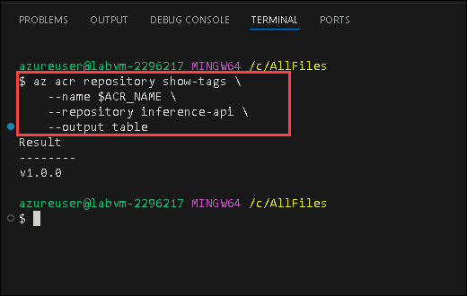
   </details>

   The output shows the **v1.0.0** tag you assigned during the build.

   <details>
    <summary>PowerShell</summary>
   ```powershell
   az acr repository show-tags `
       --name $env:ACR_NAME `
       --repository inference-api `
       --output table
   ```

   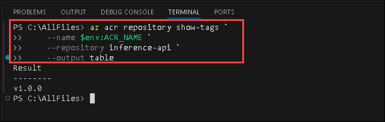
   </details>

   The output shows the **v1.0.0** tag you assigned during the build.

1. Run the following command to view detailed manifest information, including the digest.

   <details>
    <summary>Bash</summary>
   ```bash
   az acr manifest list-metadata \
       --registry $ACR_NAME \
       --name inference-api \
       --output table
   ```

   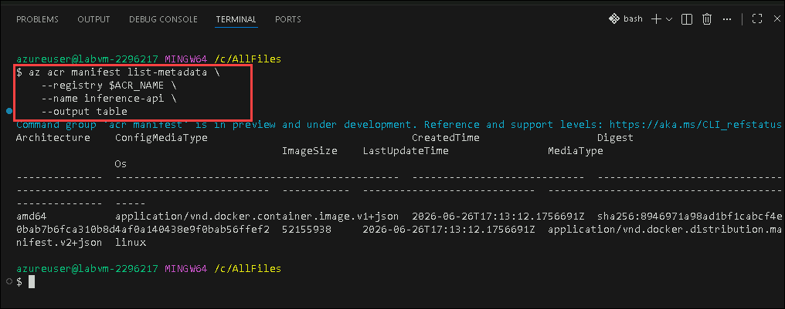
   </details>

   <details>
    <summary>PowerShell</summary>
   ```powershell
   az acr manifest list-metadata `
       --registry $env:ACR_NAME `
       --name inference-api `
       --output table
   ```
   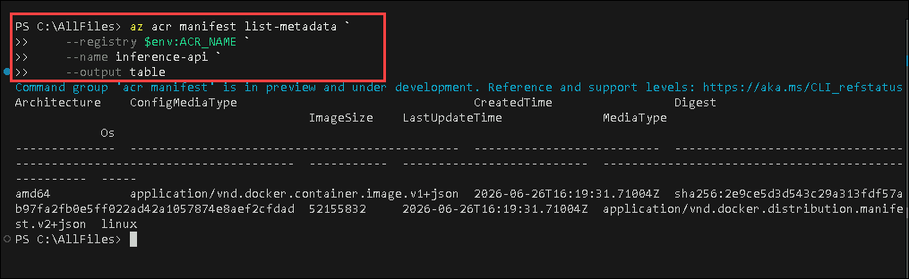
   </details>

   Note the digest value. This SHA-256 hash uniquely identifies your image regardless of tags.

1. Let's verify the repository and tag in the Azure portal. Navigate back to azure portal, in the Container registries page, click on the **registry (1)** you created. When the registry page opens, click on **Repositories (2)** under **Services** in the left menu. You should see the **inference-api (3)** repository listed.

   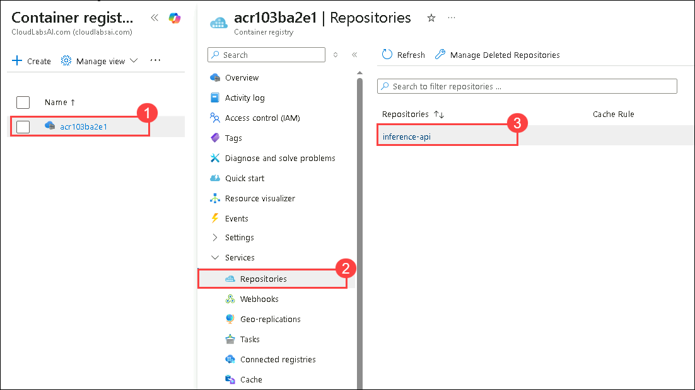

1. Click on the **inference-api (1)** repository to view its details. You should see the **v1.0.0 (2)** tag listed.

   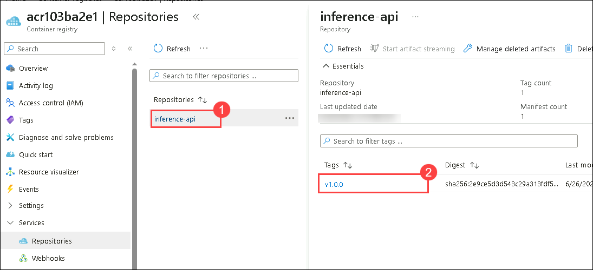

## Task 4: Run the image with ACR Tasks

In this task, you use the **az acr run** command to execute a command inside your built image and verify it works correctly.

1. Run the **following command (1)** to verify the Flask application loads correctly in the container.

   <details>
    <summary>Bash</summary>
   ```bash
   MSYS_NO_PATHCONV=1 \
   az acr run \
       --registry "$ACR_NAME" \
       --cmd "$ACR_NAME.azurecr.io/inference-api:v1.0.0 python -c 'from app import app'" \
       /dev/null
   ```

   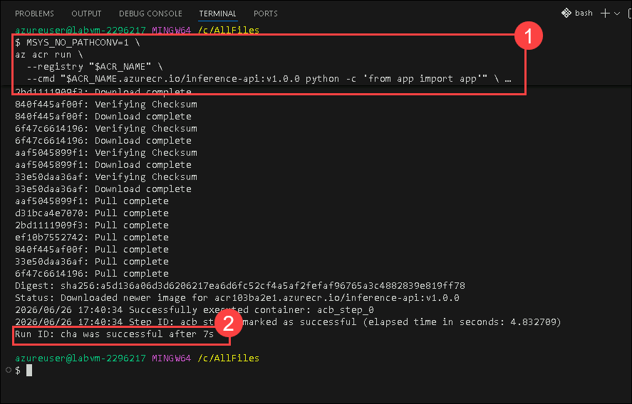
   </details>

   <details>
    <summary>PowerShell</summary>
   ```powershell
   az acr run `
       --registry $env:ACR_NAME `
       --cmd "$env:ACR_NAME.azurecr.io/inference-api:v1.0.0 python -c 'from app import app'" `
       /dev/null
   ```
   </details>

   The output includes Docker pull progress as it downloads the image. A successful run ends with **Run ID: xxx was successful after n sec (2)**. This confirms the container runs correctly and the Flask application imports without errors.

   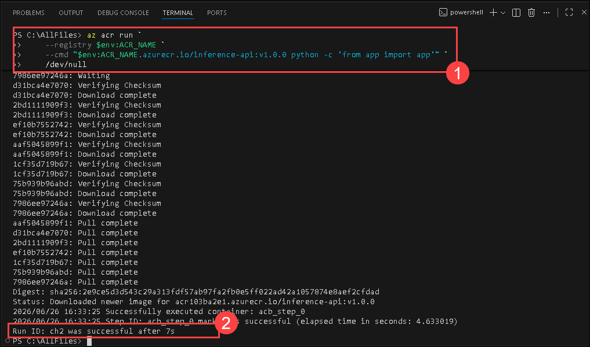

   > **NOTE:** If the command fails, re-run the same command after 2-3 minutes. It may take a few minutes for the image to be available in the registry after the build completes.

## Task 5: Build with a different tag

In this task, you build a new version of the image with a different tag to see how the registry maintains multiple versions.

1. Run the **following command (1)** to build the image again with a new version tag.

   <details>
    <summary>Bash</summary>
   ```bash
   az acr build \
       --registry $ACR_NAME \
       --image inference-api:v1.1.0 \
       ./api
   ```

   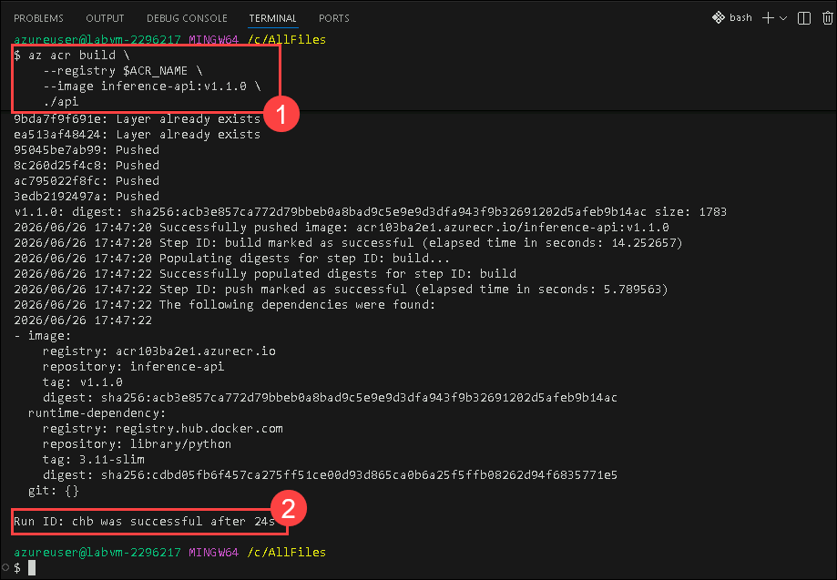
   </details>

   <details>
    <summary>PowerShell</summary>
   ```powershell
   az acr build `
       --registry $env:ACR_NAME `
       --image inference-api:v1.1.0 `
       ./api
   ```
   </details>

   The output includes Docker build progress and ends with **Run ID: xxx was successful after n sec (2)**, confirming the new image is built and pushed to the registry.

   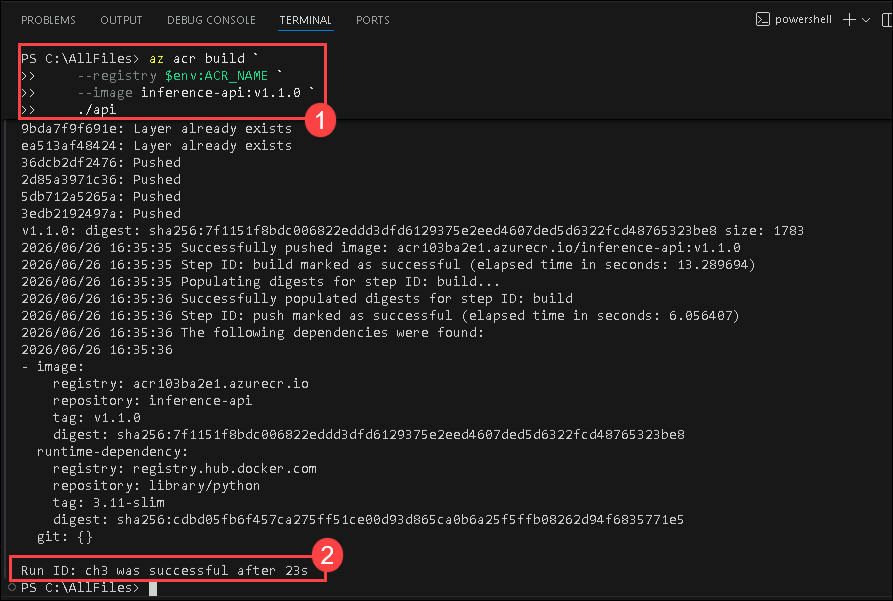

1. Run the following command to list all tags and see both versions.

   <details>
    <summary>Bash</summary>
   ```bash
   az acr repository show-tags \
       --name $ACR_NAME \
       --repository inference-api \
       --output table
   ```

   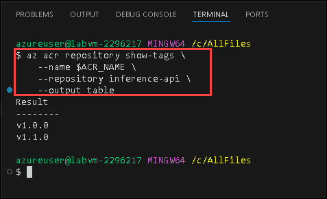
   </details>

   <details>
    <summary>PowerShell</summary>
   ```powershell
   az acr repository show-tags `
       --name $env:ACR_NAME `
       --repository inference-api `
       --output table
   ```

   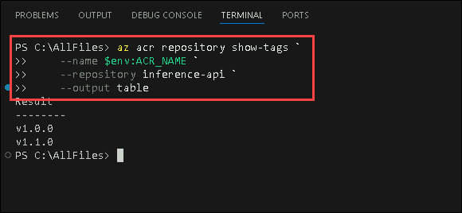
   </details>

   Both **v1.0.0** and **v1.1.0** appear in the output, demonstrating how the registry maintains multiple versions.

## Task 6: View build history and lock a production image

In this task you review the **ACR** task run history and lock an image to protect it from accidental changes.

1. Run the following command to review the ACR task run history to see all builds you've performed.

   <details>
    <summary>Bash</summary>
   ```bash
   az acr task list-runs \
       --registry $ACR_NAME \
       --output table
   ```

   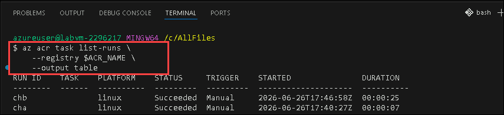
   </details>

   <details>
    <summary>PowerShell</summary>
   ```powershell
   az acr task list-runs `
       --registry $env:ACR_NAME `
       --output table
   ```
   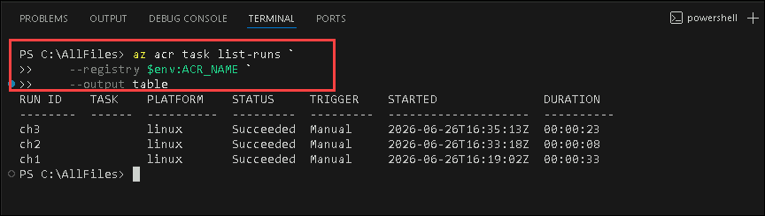

   </details>

   The output shows each build task with its run ID, status, trigger type, and duration. This history helps you track builds and diagnose issues.

1. Run the following command to lock your v1.0.0 image to prevent accidental deletion or modification.

   <details>
    <summary>Bash</summary>
   ```bash
   az acr repository update \
       --name $ACR_NAME \
       --image inference-api:v1.0.0 \
       --write-enabled false
   ```

   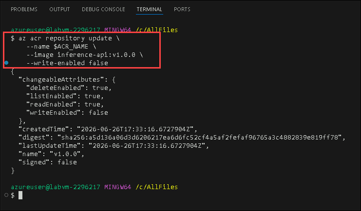
   </details>

   <details>
    <summary>PowerShell</summary>
   ```powershell
   az acr repository update `
       --name $env:ACR_NAME `
       --image inference-api:v1.0.0 `
       --write-enabled false
   ```

   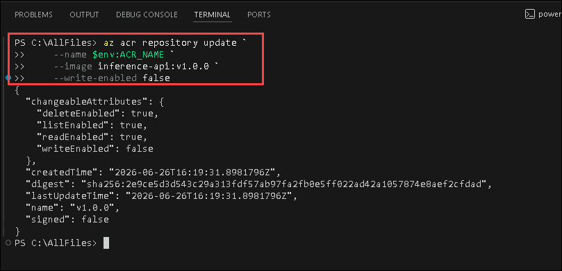
   </details>

1. Run the following command to verify the lock is in place.

   <details>
    <summary>Bash</summary>
   ```bash
   az acr repository show \
       --name $ACR_NAME \
       --image inference-api:v1.0.0
   ```

   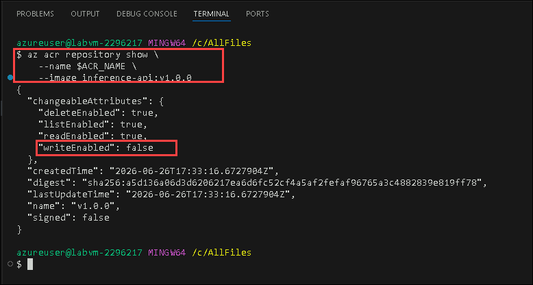
   </details>

   <details>
    <summary>PowerShell</summary>
   ```powershell
   az acr repository show `
       --name $env:ACR_NAME `
       --image inference-api:v1.0.0
   ```
   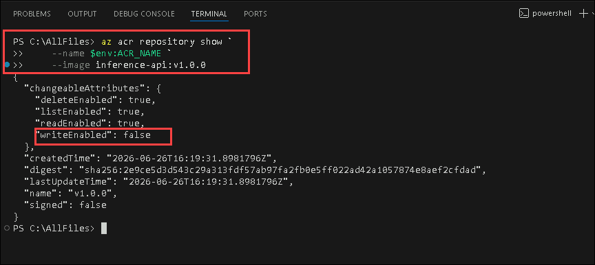
   </details>

   The **writeEnabled** field shows **False**, indicating the image is protected.

## Summary

In this lab, you deployed **Azure Container Registry**, built and pushed a container image using ACR Tasks, verified the repository and tag metadata, and ran the container image to confirm the application loaded correctly. You also created a second version of the image, reviewed build history, and locked the production image tag to protect it from accidental changes.

## You have successfully completed the Hands-on Lab!
