# Lab 02: Deploy a container to Azure App Service

### Estimated Duration: 30 Minutes

## Overview

In this lab, you will deploy a containerized application to Azure App Service by using a private Azure Container Registry (ACR). You will create an ACR, build and store a container image, and deploy it to a Linux Web App. You will also configure a system-assigned managed identity with the **AcrPull** role to securely access the private registry. Finally, you will configure the application, enable logging, and verify the deployment by testing the application and reviewing its logs.

## Lab Overview

- **Task 1:** Deploy Azure Container Registry
- **Task 2:** Create and configure a web app
- **Task 3:** Assign the AcrPull role to the web app
- **Task 4:** Configure runtime settings and enable container logging
- **Task 5:** Verify the deployment
- **Task 6:** Test document processing
- **Task 7:** Stream container logs
- **Task 8:** Inspect the diagnostic console
- **Task 9:** View application settings


## Task 1: Deploy Azure Container Registry

1. Launch **Visual Studio Code** (VS Code) from desktop.

    

1. Select **File Explorer (1)**, then **Open Folder (2)** from the menu.

    

1. Navigate to **C:\Allfiles (1)** and click **Select Folder (2)**.

    

1. If you see the prompt, **Do you trust the authors of the files in this folder?**, click **Yes, I trust the authors**.

    

1. Once the folder opens in VS Code, select **Explorer (1)** and then **azdeploy.ps1 (2)**.

    

1. Navigate to the Azure portal and search for **Resource groups (1)**. Then select **Resource groups (2)**.

    

1. Note the name of the **Resource group**.

    

1. The project contains deployment scripts for both Bash (*azdeploy.sh*) and PowerShell (*azdeploy.ps1*). Open the appropriate file for your environment and change the two values: **Resource group name** as **<inject key="ResourceGroupName" enableCopy="false"/>** and **Azure Region** as **<inject key="Region" enableCopy="false"/>** at the top of the script to meet your needs.

    ```
    "<your-resource-group-name>" # Resource Group name
    "<your-azure-region>" # Azure region for the resources
    ```

    

    

    > **Note:** Do not change anything else in the script.

1. Press **Ctrl+S** to save the changes.

1. In the menu bar, select **ellipsis (...) (1)**, then **Terminal (2)**, and then **New Terminal (3)** to open a terminal window in VS Code.

    

    > **Note:** If you are using Bash, after the terminal opens, expand the downward arrow icon **(1)** to open a new terminal and select **Git Bash (2)** from the drop-down list. If you are using PowerShell, skip this step.
    >
    > 

1. Run the following command in the terminal to allow PowerShell scripts to run. This step is required only if you are using PowerShell. If you are using Bash, skip this step.

    ```
    Set-ExecutionPolicy -ExecutionPolicy bypass -Force
    ```

    

1. Run the command **az login (1)** to sign in to your Azure account. Then minimize the VS Code window **(2)** to view the login window that opens in the background.

    ```
    az login
    ```

    

1. A pop-up window will appear on the desktop. Select **Work and school account (1)** and then click **Continue (2)**.

    

1. In the login window, sign in by using the provided **Azure credentials (1)** and then click **Next (2)**.

    - **Email/Username:** <inject key="AzureAdUserEmail"></inject>

    

1. Enter the temporary access password and click **Sign in**.

    - **Password:** <inject key="AzureAdUserPassword"></inject>

    

1. When prompted with **Sign in to all apps and websites on this device?**, select **No, this app only**.

    

1. Return to the terminal.

1. Choose the subscription by entering **1**.

    

     > **NOTE:** To confirm you're logged in to the correct Azure subscription, run **az account show**.

1. Make sure you are in the root directory of the project, and run the appropriate command in the terminal to launch the deployment script. The deployment script will deploy the ACR and create a file with the environment variables required for this exercise.

    **Bash**
    ```bash
    bash azdeploy.sh
    ```
    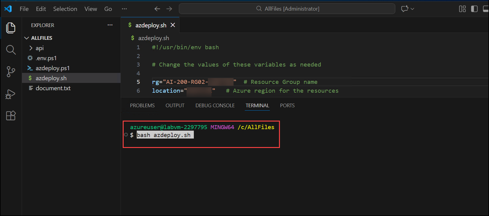

    **PowerShell**
    ```powershell
    ./azdeploy.ps1
    ```

    

1. When the script is running, enter **1** to launch the **Create Azure Container Registry and build container image** option. This option creates the ACR service and uses ACR Tasks to build and push the image to the registry.

    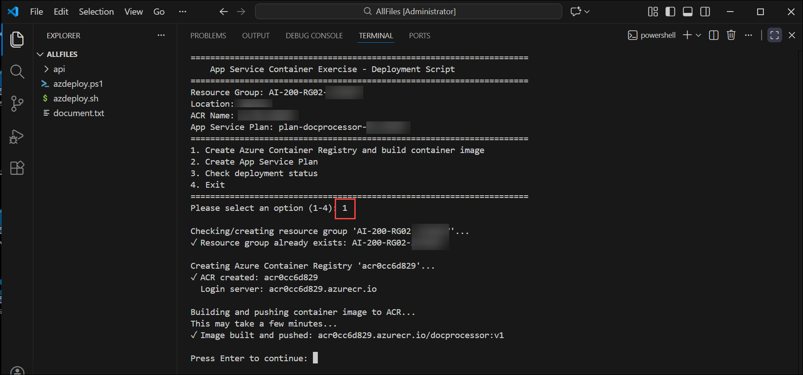

1. To verify that the deployment was successful, navigate to the Azure portal. In the search bar, type **Container registries (1)** and select **Container registries (2)** from the search results.

    

1. You should see one container registry created.

    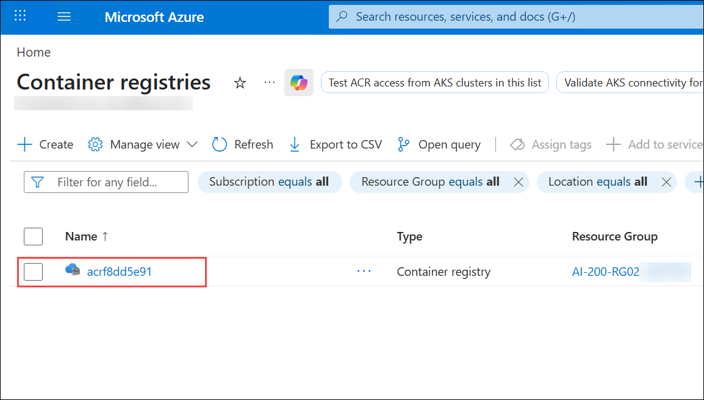

1. When the previous operation is complete, enter **2** to launch the **Create App Service Plan** option. This option creates the App Service plan required for the web app.

    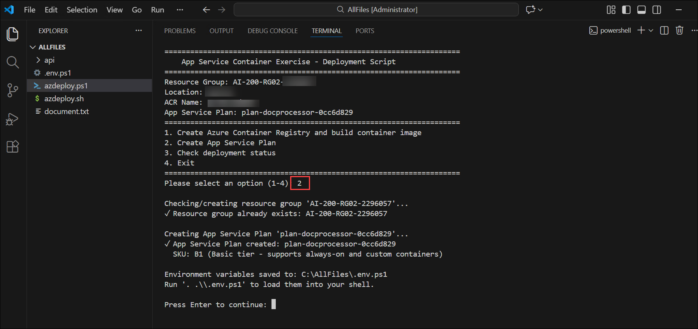

    > **Note:** A file containing environment variables is created after the App Service plan is created. You will use these variables throughout the exercise.

1. When the previous operation is complete, enter **4** to exit the deployment script.

    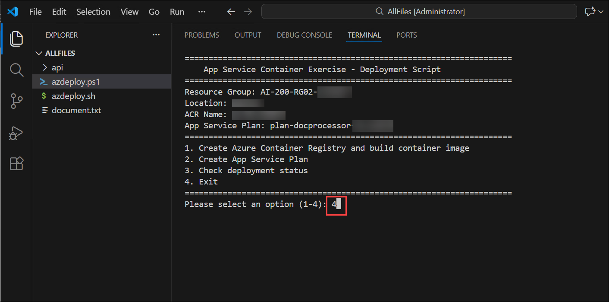

1. Run the appropriate command to load the environment variables into your terminal session from the file created in the previous step.

    **Bash**
    ```bash
    source .env
    ```
     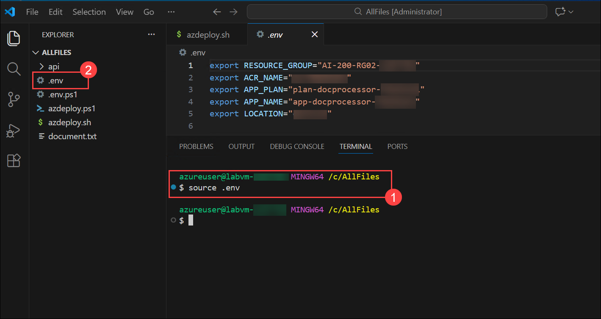

    **PowerShell**
    ```powershell
    . .\.env.ps1
    ```

    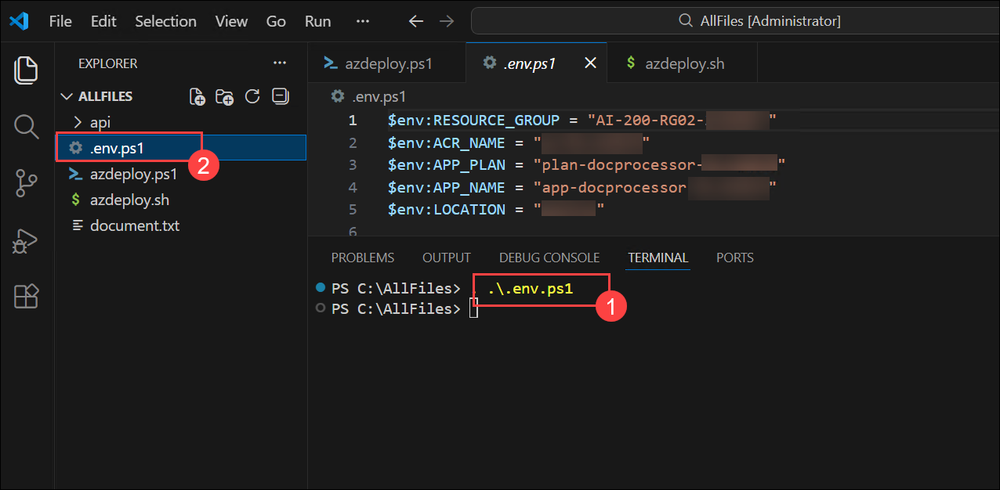

    > **Note:** Keep the terminal open. If you close it and open a new terminal, you may need to run the command again to recreate the environment variables.

## Task 2: Create and configure a web app

In this section, you create the web app by using CLI commands. You then configure the web app with a system-assigned managed identity so that the app can access the image in the ACR.

1. Run the following command to create a Web App for Containers that is configured to pull from your container registry.

    **Bash**
    ```bash
    az webapp create \
        --resource-group $RESOURCE_GROUP \
        --plan $APP_PLAN \
        --name $APP_NAME \
        --container-image-name $ACR_NAME.azurecr.io/docprocessor:v1
    ```
    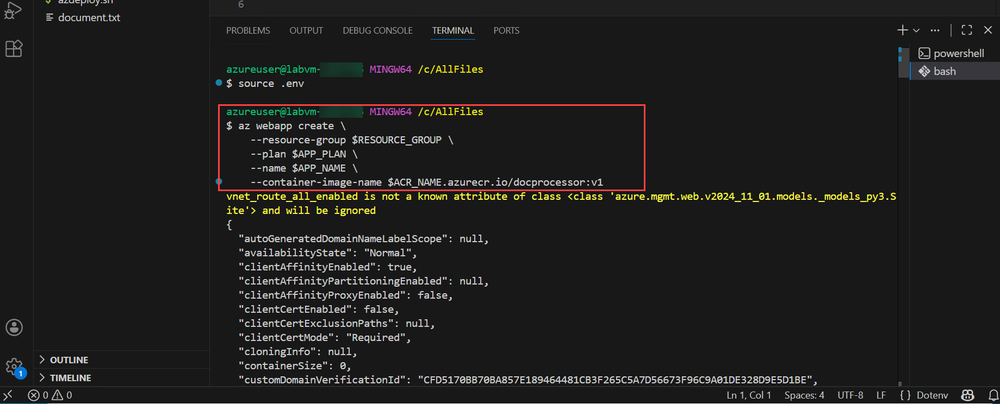

    **PowerShell**
    ```powershell
    az webapp create `
        --resource-group $env:RESOURCE_GROUP `
        --plan $env:APP_PLAN `
        --name $env:APP_NAME `
        --container-image-name "$($env:ACR_NAME).azurecr.io/docprocessor:v1"
    ```

    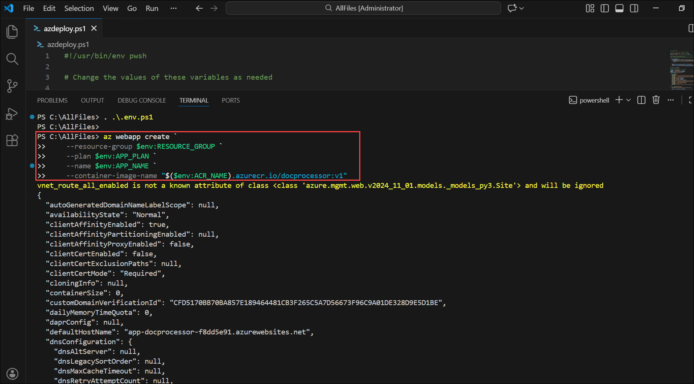

    > **Note:** By default, your Azure Container Registry is private. App Service needs a way to authenticate to the ACR before it can pull the image. You configure this authentication by using a system-assigned managed identity, which is recommended, instead of storing registry credentials in your app settings.

1. To verify that the deployment was successful, navigate to the Azure portal. In the search bar, type **App Services (1)** and select **App Services (2)** from the search results.

    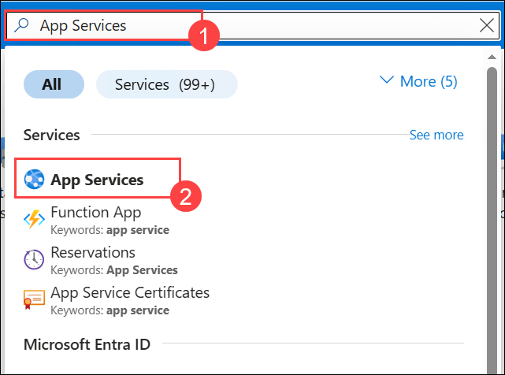

1. You should see one web app created.

    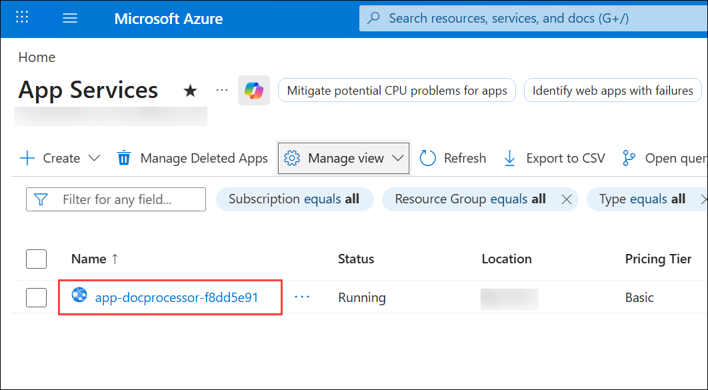

1. Run the following command to enable a system-assigned managed identity on the web app.

    **Bash**
    ```bash
    az webapp identity assign \
        --resource-group $RESOURCE_GROUP \
        --name $APP_NAME
    ```
    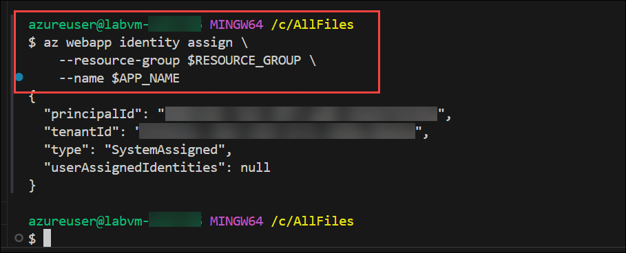

    **PowerShell**
    ```powershell
    az webapp identity assign `
        --resource-group $env:RESOURCE_GROUP `
        --name $env:APP_NAME
    ```

    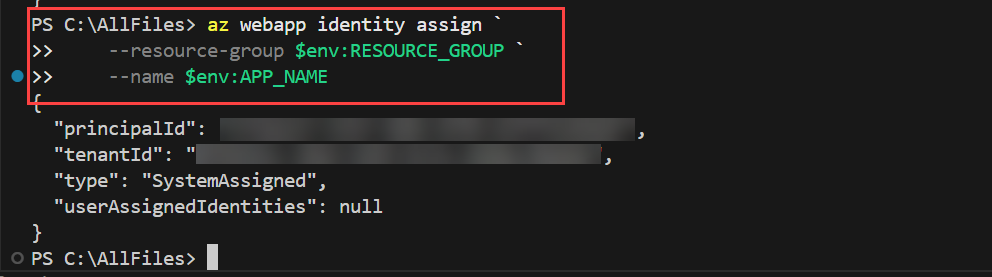

## Task 3: Assign the AcrPull role to the web app

In this section, you grant the web app permission to pull images from your private registry. Managed identities are Microsoft Entra-backed identities that Azure creates and manages for you. When you enable a system-assigned identity on the web app, App Service can request tokens as that identity.

To enable the web app to use that identity to pull images, you assign the built-in **AcrPull** role scoped to your registry. This follows the principle of least privilege: the web app can download images, but it cannot push or administer the registry.

1. Run the following command to retrieve the principal ID of the web app.

    **Bash**
    ```bash
    PRINCIPAL_ID=$(az webapp identity show \
        --resource-group $RESOURCE_GROUP \
        --name $APP_NAME \
        --query principalId \
        --output tsv)
    ```
     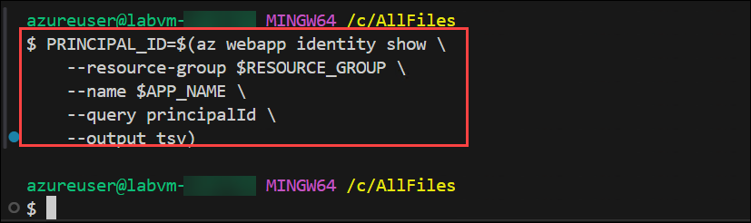

    **PowerShell**
    ```powershell
    $PRINCIPAL_ID = az webapp identity show `
        --resource-group $env:RESOURCE_GROUP `
        --name $env:APP_NAME `
        --query principalId `
        --output tsv
    ```
    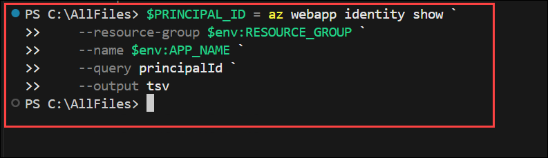

    > **Note:** The above command stores the principal ID in the variable. To display it, run **echo $PRINCIPAL_ID** in Bash or **Write-Host $PRINCIPAL_ID** in PowerShell.

1. Run the following command to retrieve the ID of the ACR.

    **Bash**
    ```bash
    ACR_ID=$(az acr show \
        --resource-group $RESOURCE_GROUP \
        --name $ACR_NAME \
        --query id \
        --output tsv)
    ```
    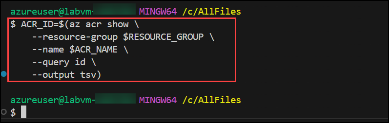

    **PowerShell**
    ```powershell
    $ACR_ID = az acr show `
        --resource-group $env:RESOURCE_GROUP `
        --name $env:ACR_NAME `
        --query id `
        --output tsv
    ```
    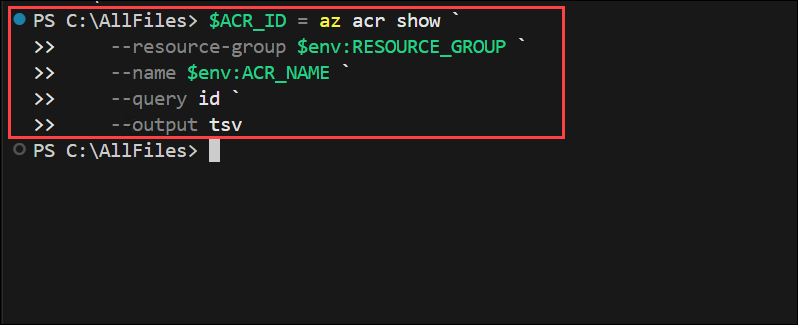

    > **Note:** The above command stores the ACR ID in the variable. To display it, run **echo $ACR_ID** in Bash or **Write-Host $ACR_ID** in PowerShell.

1. Run the following command to assign the **AcrPull** role to the web app.

    **Bash**
    ```bash
        MSYS_NO_PATHCONV=1 \
        az role assignment create \
        --assignee "$PRINCIPAL_ID" \
        --scope "$ACR_ID" \
        --role AcrPull
    ```
    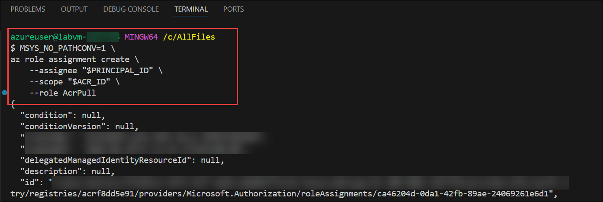

    **PowerShell**
    ```powershell
    az role assignment create `
        --assignee $PRINCIPAL_ID `
        --scope $ACR_ID `
        --role AcrPull
    ```
    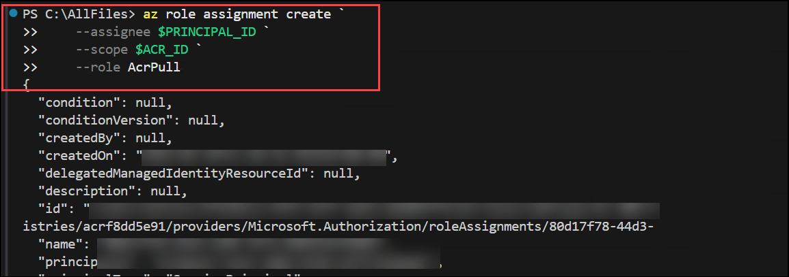

    > **Note:** Role assignments can take a minute or two to propagate. If the app still cannot pull the image immediately after this step, wait a moment and try again.

1. Run the following command to configure the web app to use managed identity for registry authentication. This setting tells App Service to use the web app's managed identity, rather than registry admin credentials, when accessing the container registry.

    **Bash**
    ```bash
    az webapp config set \
        --resource-group $RESOURCE_GROUP \
        --name $APP_NAME \
        --acr-use-identity true \
        --acr-identity [system]
    ```
    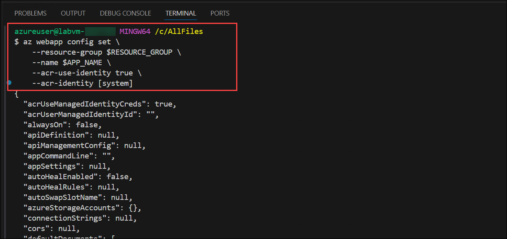

    **PowerShell**
    ```powershell
    az webapp config set `
        --resource-group $env:RESOURCE_GROUP `
        --name $env:APP_NAME `
        --acr-use-identity true `
        --acr-identity [system]
    ```
    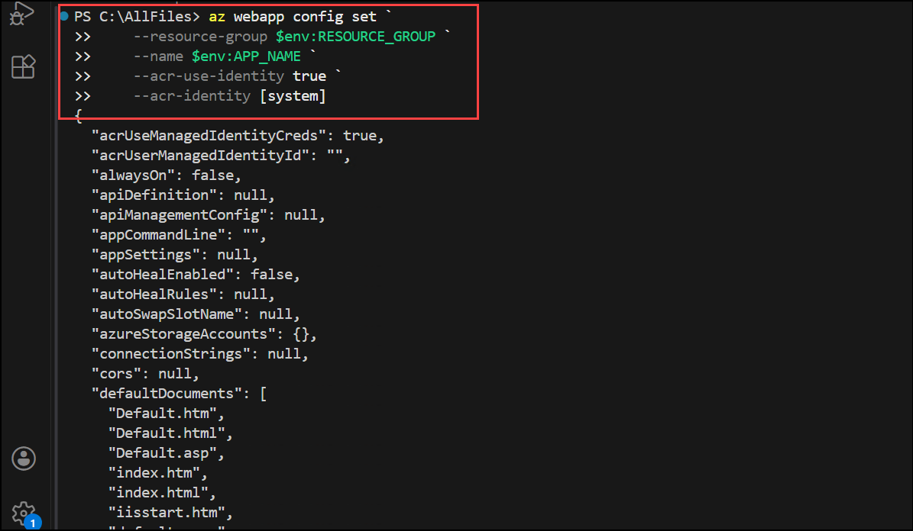

1. Run the following command to update the container settings to use the registry with managed identity. This step explicitly sets the image and registry URL that the web app should use. If you later update the image tag, this is where you point the web app to the new version.

    **Bash**
    ```bash
    az webapp config container set \
        --resource-group $RESOURCE_GROUP \
        --name $APP_NAME \
        --container-image-name $ACR_NAME.azurecr.io/docprocessor:v1 \
        --container-registry-url https://$ACR_NAME.azurecr.io
    ```
    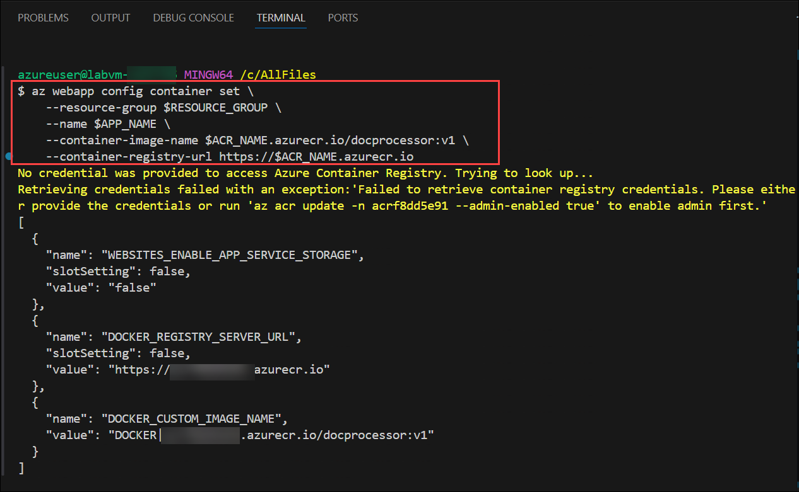

    **PowerShell**
    ```powershell
    az webapp config container set `
        --resource-group $env:RESOURCE_GROUP `
        --name $env:APP_NAME `
        --container-image-name "$($env:ACR_NAME).azurecr.io/docprocessor:v1" `
        --container-registry-url "https://$($env:ACR_NAME).azurecr.io"
    ```
    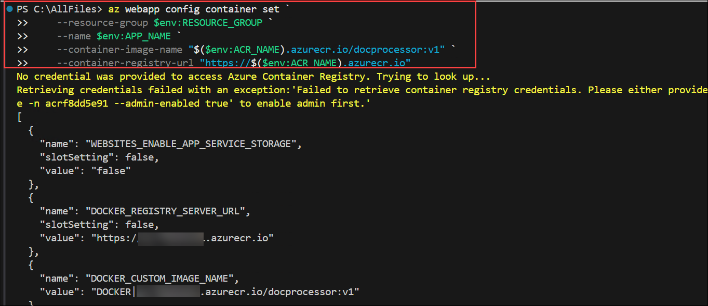

## Task 4: Configure runtime settings and enable container logging

In this section, you configure runtime settings and enable logging to help the container run more reliably and to make troubleshooting easier.

1. Run the following command to configure the container port. The sample image listens on port 80 by default, so this step demonstrates the setting without changing the behavior.

    **Bash**
    ```bash
    az webapp config appsettings set \
        --resource-group $RESOURCE_GROUP \
        --name $APP_NAME \
        --settings WEBSITES_PORT=80
    ```
    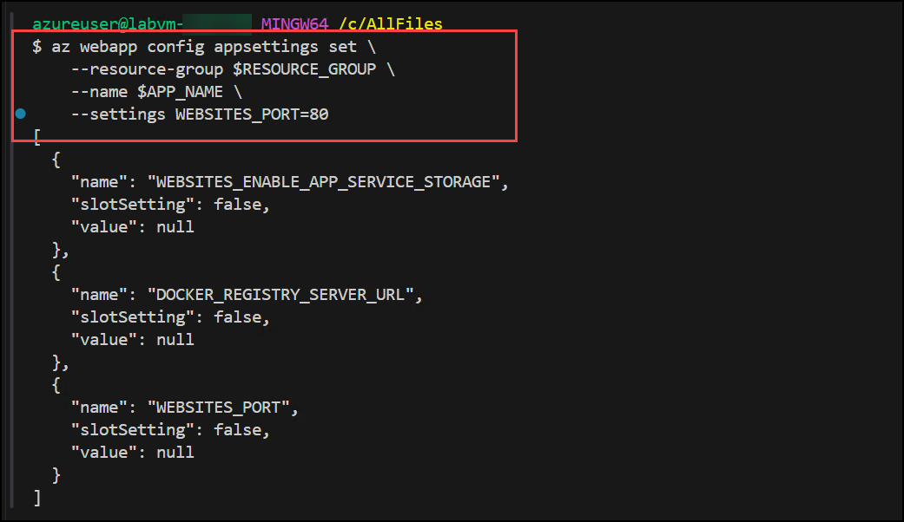

    **PowerShell**
    ```powershell
    az webapp config appsettings set `
        --resource-group $env:RESOURCE_GROUP `
        --name $env:APP_NAME `
        --settings WEBSITES_PORT=80
    ```
    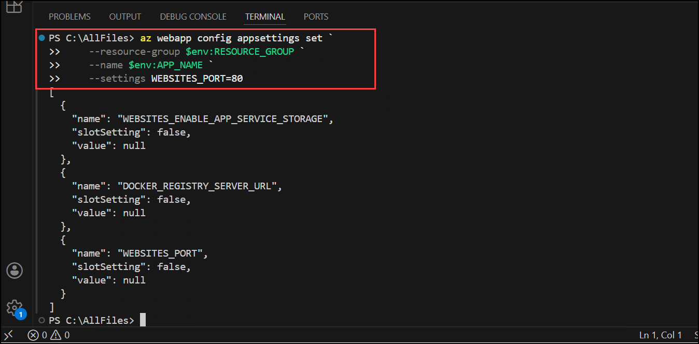

1. Run the following command to enable persistent storage for processed documents. This setting enables the App Service storage mount, for example, the **/home** path in Linux containers.

    **Bash**
    ```bash
    az webapp config appsettings set \
        --resource-group $RESOURCE_GROUP \
        --name $APP_NAME \
        --settings WEBSITES_ENABLE_APP_SERVICE_STORAGE=true
    ```
    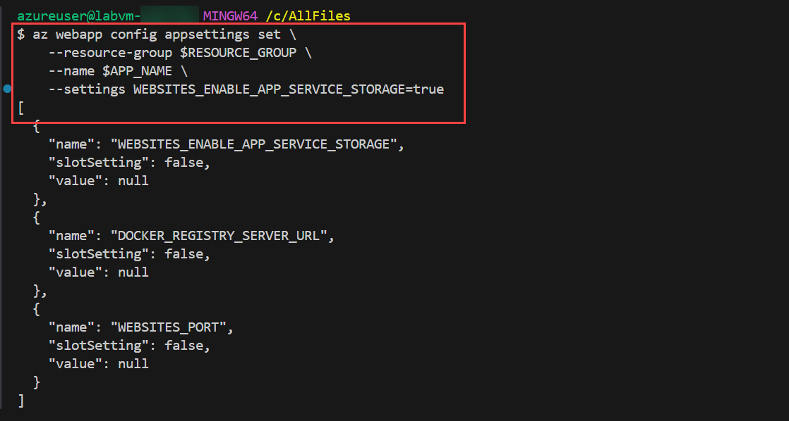

    **PowerShell**
    ```powershell
    az webapp config appsettings set `
        --resource-group $env:RESOURCE_GROUP `
        --name $env:APP_NAME `
        --settings WEBSITES_ENABLE_APP_SERVICE_STORAGE=true
    ```
    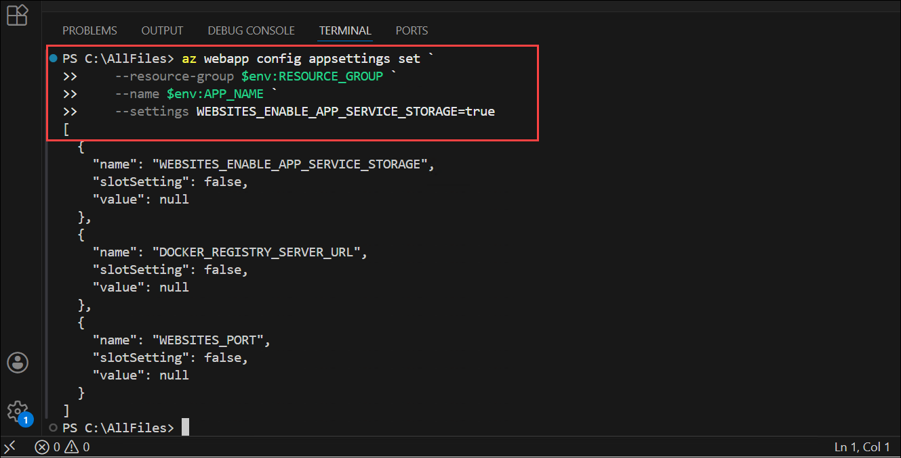

1. Run the following command to enable always-on. This helps reduce cold start latency by keeping the app warm.

    **Bash**
    ```bash
    az webapp config set \
        --resource-group $RESOURCE_GROUP \
        --name $APP_NAME \
        --always-on true
    ```
    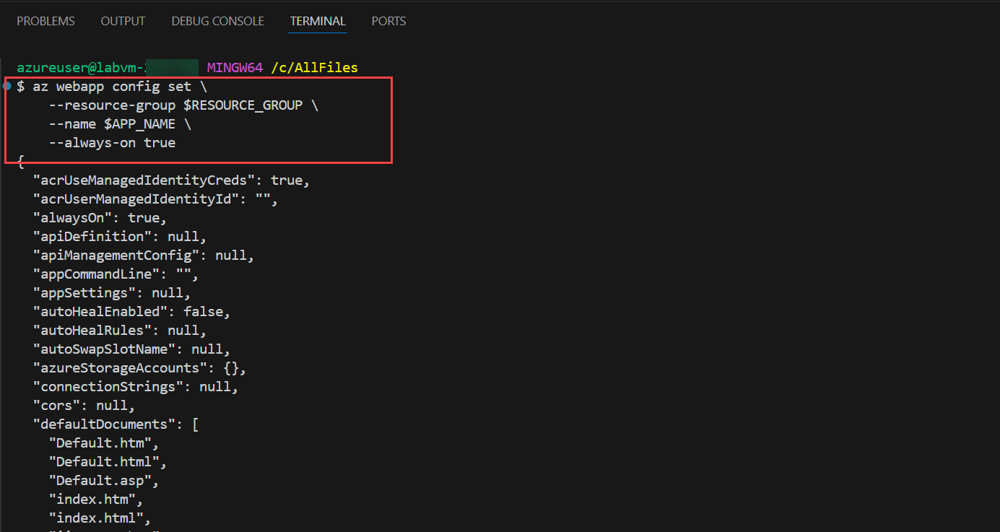

    **PowerShell**
    ```powershell
    az webapp config set `
        --resource-group $env:RESOURCE_GROUP `
        --name $env:APP_NAME `
        --always-on true
    ```
    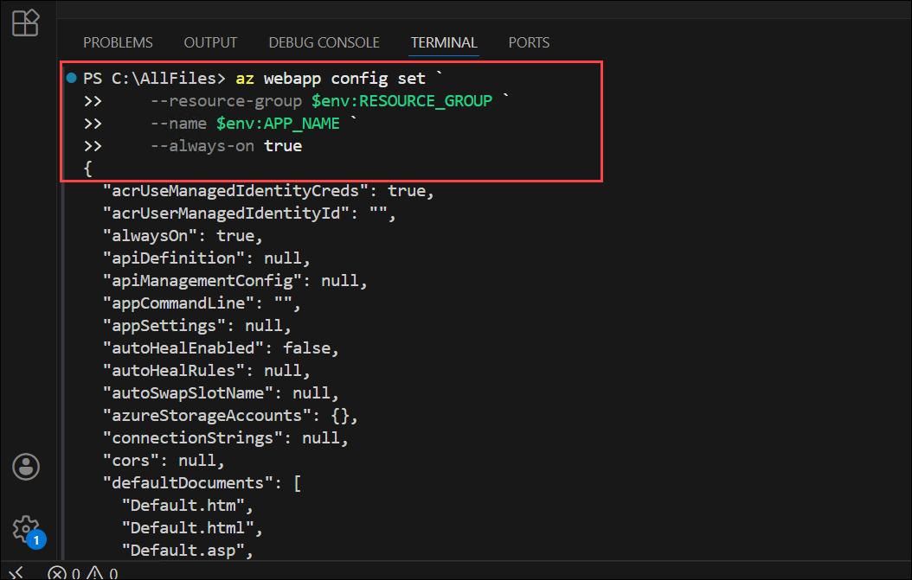

1. Run the following command to enable container logging. This captures stdout and stderr from your container so that you can view logs from the CLI.

    **Bash**
    ```bash
    az webapp log config \
        --resource-group $RESOURCE_GROUP \
        --name $APP_NAME \
        --docker-container-logging filesystem
    ```
    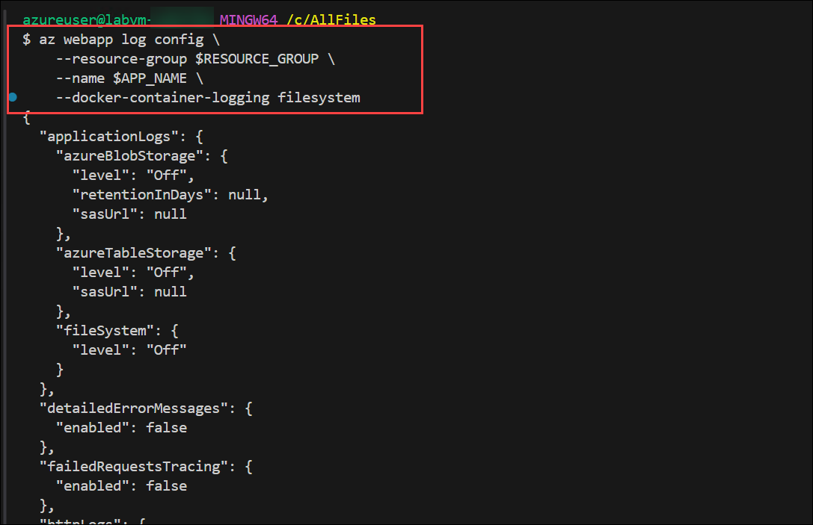

    **PowerShell**
    ```powershell
    az webapp log config `
        --resource-group $env:RESOURCE_GROUP `
        --name $env:APP_NAME `
        --docker-container-logging filesystem
    ```
    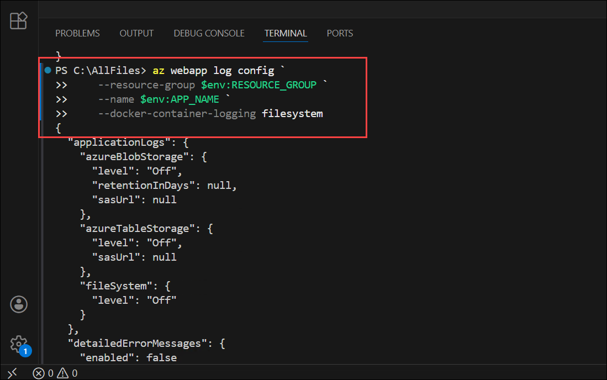

## Task 5: Verify the deployment and test the document processing endpoint

In this section, you verify that the web app is running and responding.

1. Run the following command to retrieve the web app host name.

    **Bash**
    ```bash
    APP_URL=$(az webapp show \
        --resource-group $RESOURCE_GROUP \
        --name $APP_NAME \
        --query defaultHostName \
        --output tsv)

    echo "Application URL: https://$APP_URL"
    ```
    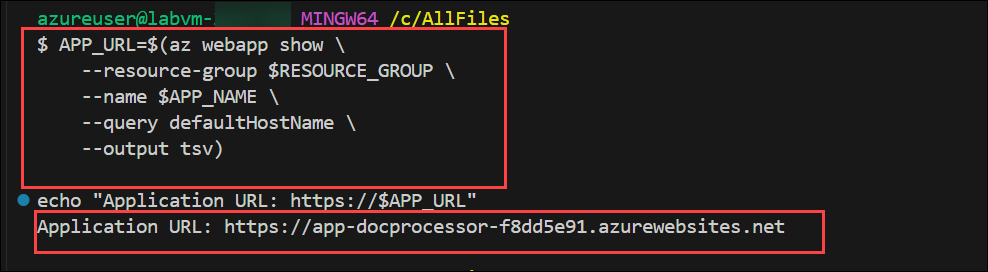

    **PowerShell**
    ```powershell
    $APP_URL = az webapp show `
        --resource-group $env:RESOURCE_GROUP `
        --name $env:APP_NAME `
        --query defaultHostName `
        --output tsv

    Write-Host "Application URL: https://$APP_URL"
    ```
    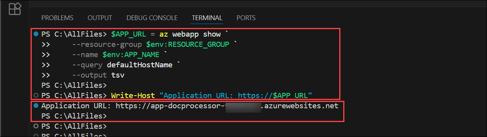

1. Open the URL in a browser to verify that the application responds. Leave the browser open, because you will use it later in the exercise. The application should return a response indicating that it is running. The first request may take longer because App Service pulls the container image and starts the application.

    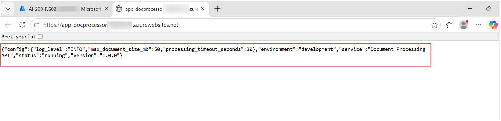

## Task 6: Test document processing

In this section, you send a request to the API to confirm that the app is working and that results are being written to persistent storage.

1. Run the following command to submit the *document.txt* file included in the project to the processing endpoint.

    **Bash**
    ```bash
    curl -X POST "https://$APP_URL/process" \
        -H "Content-Type: text/plain" \
        --data-binary @document.txt
    ```
    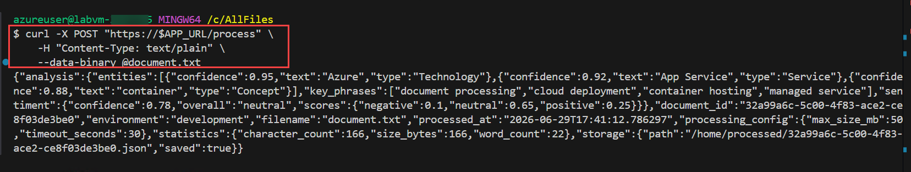

    **PowerShell**
    ```powershell
    $body = Get-Content -Raw -Path "document.txt"
    Invoke-RestMethod -Method Post -Uri "https://$APP_URL/process" -ContentType "text/plain" -Body $body | ConvertTo-Json -Depth 10
    ```
    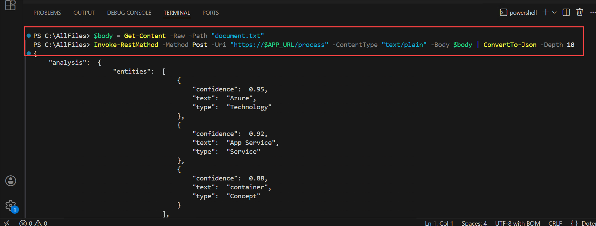

    The API returns mock analysis results, including extracted entities, key phrases, and sentiment analysis. Notice that the response indicates whether the result was saved to persistent storage.

1. Run the following command to list all processed documents.

    **Bash**
    ```bash
    curl https://$APP_URL/documents
    ```
    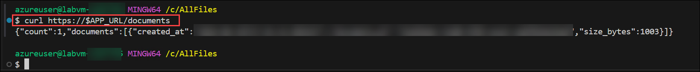

    **PowerShell**
    ```powershell
    Invoke-RestMethod -Uri "https://$APP_URL/documents" | ConvertTo-Json -Depth 10
    ```
    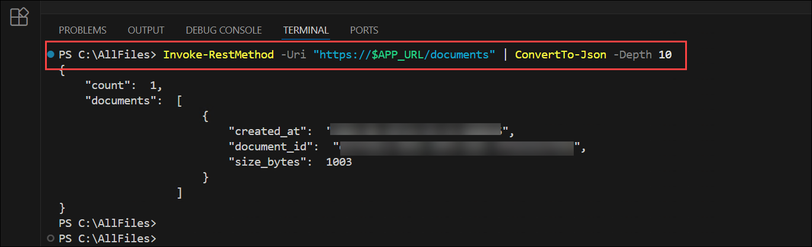

    > **Note:** If persistent storage is enabled correctly, you should see the document you just processed in the list.

## Task 7: Stream container logs

In this section, you stream container logs to help troubleshoot startup and request processing issues.

1. Run the following command to view real-time logs from the container.

    **Bash**
    ```bash
    az webapp log tail \
        --resource-group $RESOURCE_GROUP \
        --name $APP_NAME
    ```
    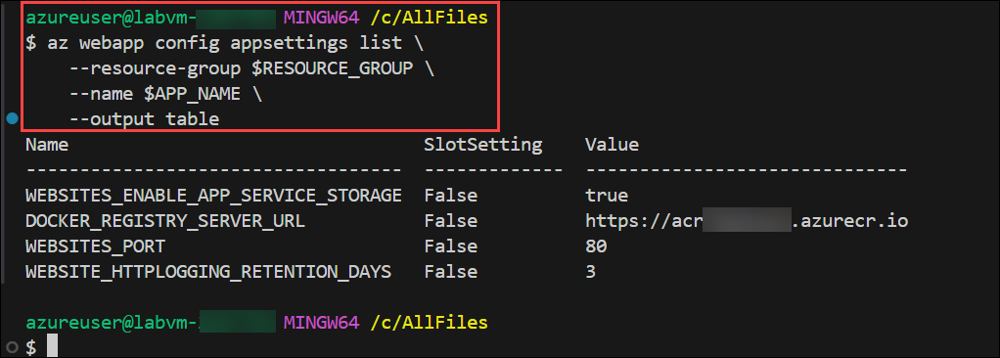

    **PowerShell**
    ```powershell
    az webapp log tail `
        --resource-group $env:RESOURCE_GROUP `
        --name $env:APP_NAME
    ```
    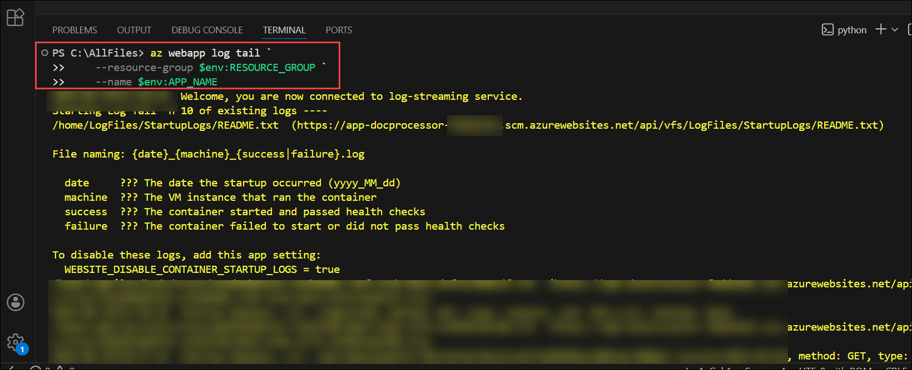

1. Generate more requests to the application by refreshing the browser. You should see log entries appear in the stream. Press **Ctrl+C** to stop streaming.

## Task 8: Inspect the diagnostic console

In this section, you open the SCM (Kudu) site to inspect configuration views and common log locations.

1. Run the following command to print the SCM (Kudu) URL.

    **Bash**
    ```bash
    echo "Kudu URL: https://$APP_NAME.scm.azurewebsites.net"
    ```
    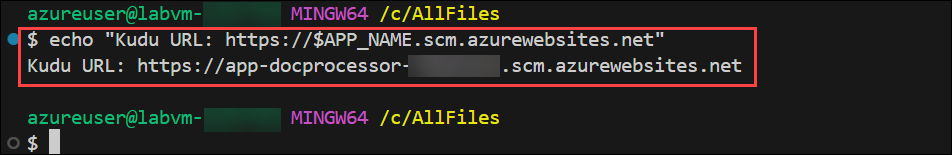

    **PowerShell**
    ```powershell
    Write-Host "Kudu URL: https://$($env:APP_NAME).scm.azurewebsites.net"
    ```
    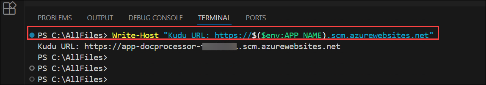

1. Open this URL in a browser. In the menu at the top of the page, navigate to:

    1. **Environment** to view environment variables and verify that your app settings are present.
    1. **Bash** to open a browser-based shell and file explorer.
    1. In the file explorer, navigate to **/home/LogFiles/** to view log files. Enter **ls** to list the files in the folder.

        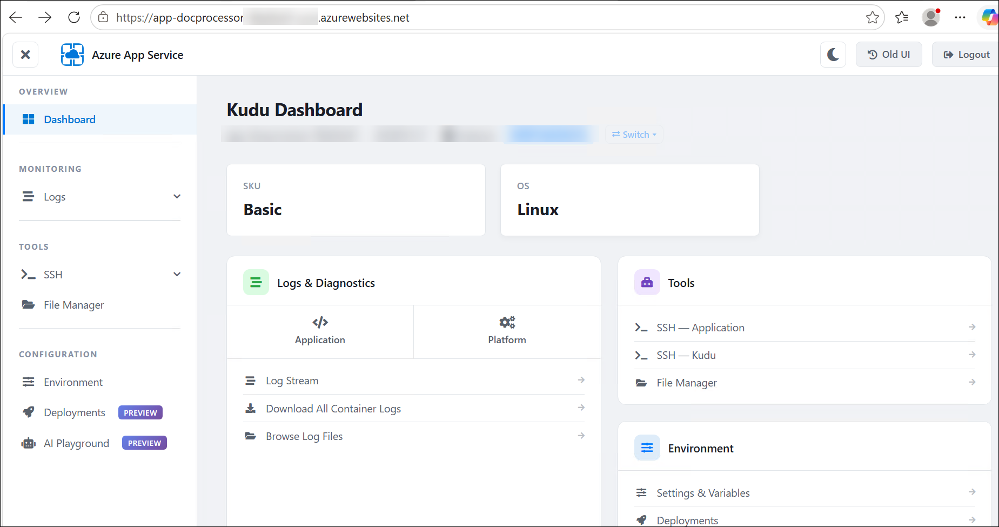

    > **Tip:** You can also use **Log stream** in the top menu to view logs in the browser, or use the **SSH** option to connect to the app container.

    The SCM site is separate from your app container, so it does not provide a complete view of the container's file system or running processes.

## Task 9: View application settings

In this section, you confirm that the app settings you configured are present.

1. Run the following command to list the application settings.

    **Bash**
    ```bash
    az webapp config appsettings list \
        --resource-group $RESOURCE_GROUP \
        --name $APP_NAME \
        --output table
    ```
    

    **PowerShell**
    ```powershell
    az webapp config appsettings list `
        --resource-group $env:RESOURCE_GROUP `
        --name $env:APP_NAME `
        --output table
    ```

    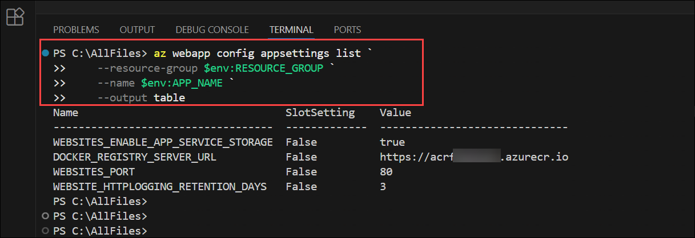

    > **Note:** Confirm that your settings appear in the list along with the system-provided settings.


### Summary

In this lab, you deployed a containerized application to Azure App Service by completing the following tasks:

- Created an Azure Container Registry and built a container image.
- Created and configured a Linux Web App for container deployment.
- Enabled a system-assigned managed identity and assigned the **AcrPull** role for secure access to the private registry.
- Configured runtime settings, enabled container logging, and verified the application by testing the document processing endpoint.

## You have successfully completed the hands-on lab!
