# Lab 09: Build a RAG document store on Azure Cosmos DB for NoSQL

### Estimated Duration : 60 Minutes

## Lab overview

In this exercise, you create an Azure Cosmos DB for NoSQL database that serves as a document store for retrieval-augmented generation (RAG) applications. The database stores chunked documents with metadata that an AI application can retrieve to provide context to language models. You design a schema optimized for document retrieval, build Python functions that store and query document chunks, and test the complete workflow using a Flask web application. This pattern provides a foundation for building AI applications that ground language model responses in your organization's documents.

## Lab objectives

In this lab, you'll perform the following tasks:

- **Task 1:** Prepare the environment
- **Task 2:** Create resources in Azure
- **Task 3:** Complete the RAG document functions
- **Task 4:** Complete the Azure resource deployment
- **Task 5:** Understand the RAG document schema
- **Task 6:** Test the RAG functions with the Flask app
- **Task 7:** Query document context

> ### **Note:** This lab includes deployment scripts for both **PowerShell** and **Bash**. You may choose either scripting language based on your preference or environment. Once you make your choice, use the corresponding commands and script throughout the entire lab, as all subsequent steps provide instructions for both PowerShell and Bash.

## Task 1: Prepare the environment

In this task, you'll prepare the deployment environment, configure the deployment script, authenticate to Azure, register the required resource providers, install kubectl, and launch the deployment script.

1. Launch **Visual Studio Code** (VS Code) from desktop.

   

1. Select **File Explorer (1)** from left panel. Click **Open Folder (2)** in the menu.

   

1. Navigate to **C:\AllFiles (1)** folder containing the project files and click on **Select folder (2)**.

   

1. If you get "Do you trust the authors of the files in this folder?" prompt, click **Yes, I trust the authors**.

   

1. The project contains deployment scripts for both Bash (_azdeploy.sh_) and PowerShell (_azdeploy.ps1_). Open the appropriate file for your environment and change the two values: **Resource group name** as **<inject key="ResourceGroupName" enableCopy="false"/>** and **Azure Region** as **<inject key="Region" enableCopy="false"/>** at the top of the script to meet your needs.

   > **Note:** Do not change anything else in the script.

   ```
   "<your-resource-group-name>" # Resource Group name
   "<your-azure-region>" # Azure region for the resources
   ```

   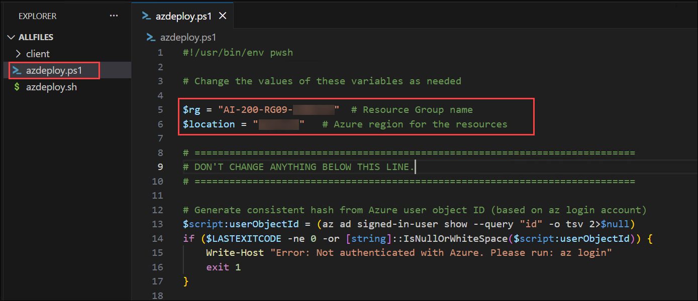

   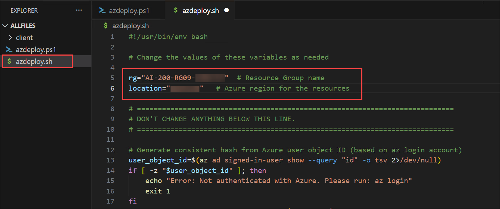

1. In the menu bar, select **File (1)** and select **Save All (2)** from drop-down.

   

1. In the menu bar, select **ellipsis (...) (1)**, then **Terminal (2)**, and then **New Terminal (3)** to open a terminal window in VS Code.

   

   > **NOTE:** If you are using Bash, after the terminal opens, click on the **+ (1)** icon to open a new terminal and select **Git Bash (2)** from the drop-down. If you are using PowerShell, skip this step.
   >
   > 

1. Run the following command in the terminal to allow PowerShell scripts to run. This command is only required if you are using PowerShell. If you are using Bash, skip this step.

   ```
   Set-ExecutionPolicy -ExecutionPolicy bypass -Force
   ```

   

1. Run the **following command (1)** to login to your Azure account. Next, **minimize the VS Code window (2)** to view the login window opened in background.

   ```
   az login
   ```

   

1. In the login window, select **Work or school account (1)** and click **Continue (2)**.

   

1. In the login window, kindly sign in using the provided **Azure credentials (1)** and click **Next (2)**.
   - **Email/Username:** <inject key="AzureAdUserEmail"></inject>

     

1. Next, enter the provided **Password (1)** and click **Sign in (2)**.
   - **Password:** <inject key="AzureAdUserPassword"></inject>

     

1. Next, select **No, this app only** and navigate back to VS Code to continue.

   

1. Answer the prompts to select your Azure account and subscription for the exercise.

   

   > **NOTE:** To confirm you're logged in to the correct Azure subscription, run **az account show**.

## Task 2: Create resources in Azure

In this task, you'll deploy an Azure Cosmos DB for NoSQL account, database, and container using the deployment script to create the document store required for the RAG application.

1. Make sure you are in the root directory of the project and run the appropriate command in the terminal to launch the deployment script.

   **Bash**

   ```bash
   MSYS_NO_PATHCONV=1 bash azdeploy.sh
   ```

   **PowerShell**

   ```powershell
   ./azdeploy.ps1
   ```

   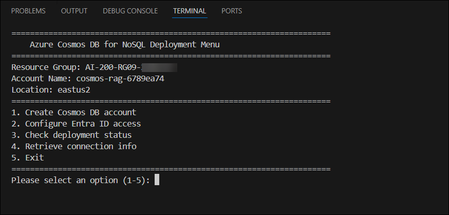

1. When the script menu appears, enter **1** to launch the **Create Cosmos DB account** option. This creates the Cosmos DB for NoSQL account with a database and container. **Note:** Deployment can take 5-10 minutes to complete.

   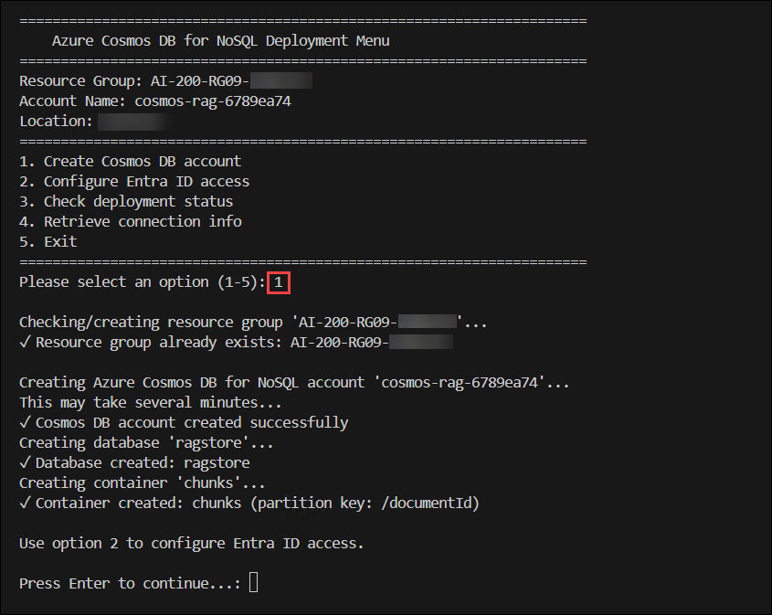

   > **Note:** Leave the terminal running the deployment open for the duration of the exercise. You can move on to the next section of the exercise while the deployment continues in the terminal.

> **Congratulations** on completing the task! Now, it's time to validate it. Here are the steps:
>
> - If you receive a success message, you can proceed to the next task.
> - If not, carefully read the error message and retry the step, following the instructions in the lab guide.
> - If you need any assistance, please contact us at cloudlabs-support@spektrasystems.com. We are available 24/7 to help you out.

<validation step="072be012-6093-4115-b0af-b798d2e1c77c" />

## Task 3: Complete the RAG document functions

In this task, you'll implement the Python functions that store, retrieve, and search document chunks in Azure Cosmos DB, enabling the core data operations required for retrieval-augmented generation (RAG).

1. Open the **client/rag_functions.py** file in VS Code.

   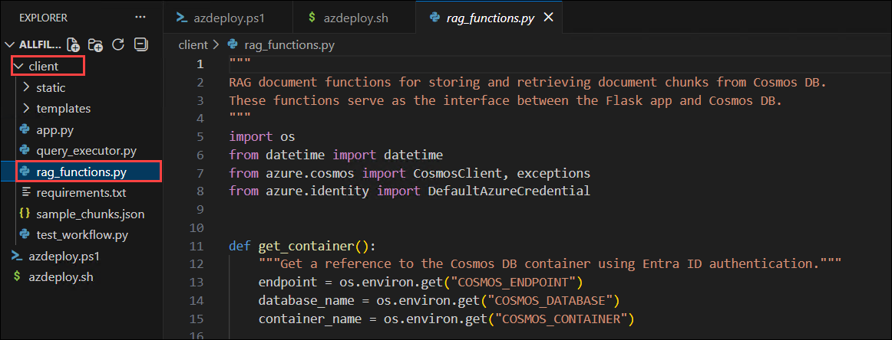

1. Search for the **BEGIN STORE DOCUMENT CHUNK FUNCTION** comment and add the following code directly after the comment. This function stores a document chunk with its metadata, using upsert to handle both inserts and updates.

   ```python
   def store_document_chunk(
       document_id: str,
       chunk_id: str,
       content: str,
       metadata: dict = None,
       embedding: list = None
   ) -> dict:
       """Store a document chunk with metadata and optional embedding placeholder."""
       container = get_container()

       # Build the document structure following our RAG schema
       # The 'id' field is required by Cosmos DB and must be unique within the partition
       # The 'documentId' field is our partition key - chunks from the same source document
       # are stored together for efficient retrieval
       chunk = {
           "id": chunk_id,
           "documentId": document_id,
           "content": content,
           "metadata": metadata or {},
           "embedding": embedding or [],  # Placeholder for vector embeddings
           "createdAt": datetime.utcnow().isoformat(),
           "chunkIndex": metadata.get("chunkIndex", 0) if metadata else 0
       }

       # upsert_item inserts if new, updates if exists (based on id + partition key)
       # This is idempotent - safe to call multiple times with the same data
       response = container.upsert_item(body=chunk)

       # Request Units (RUs) measure the cost of database operations in Cosmos DB
       # Tracking RU consumption helps optimize queries and estimate costs
       ru_charge = response.get_response_headers()['x-ms-request-charge']

       return {
           "chunk_id": chunk_id,
           "document_id": document_id,
           "ru_charge": float(ru_charge)
       }
   ```

   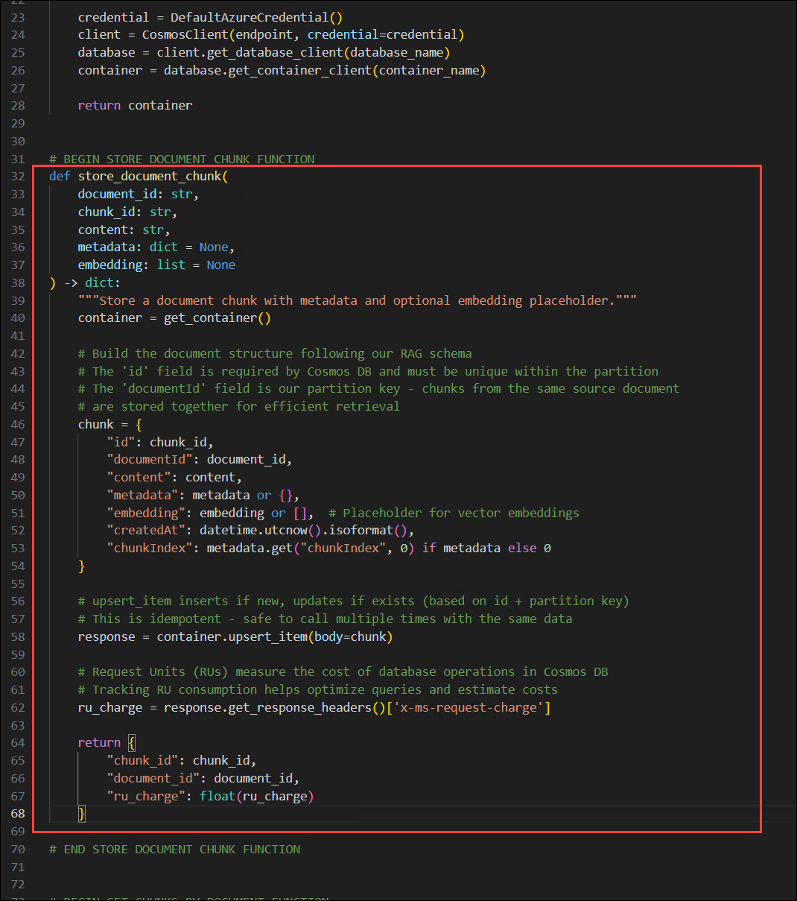

1. Search for the **BEGIN GET CHUNKS BY DOCUMENT FUNCTION** comment and add the following code directly after the comment. This function retrieves all chunks for a specific document, ordered by chunk index for sequential reading.

   ```python
   def get_chunks_by_document(document_id: str, limit: int = 100) -> list:
       """Retrieve all chunks for a specific document, ordered by chunk index."""
       container = get_container()

       # SQL query using parameterized values (@documentId, @limit) to prevent injection
       # The 'c' alias represents each document in the container
       query = """
           SELECT c.id, c.content, c.metadata, c.chunkIndex, c.createdAt
           FROM c
           WHERE c.documentId = @documentId
           ORDER BY c.chunkIndex
           OFFSET 0 LIMIT @limit
       """

       # Single-partition query: providing partition_key limits the query to one partition
       # This is more efficient than cross-partition queries because Cosmos DB only
       # needs to read from one physical partition instead of fanning out to all partitions
       items = container.query_items(
           query=query,
           parameters=[
               {"name": "@documentId", "value": document_id},
               {"name": "@limit", "value": limit}
           ],
           partition_key=document_id  # Scopes query to a single partition
       )

       # Transform Cosmos DB items into a consistent response format
       return [
           {
               "chunk_id": item["id"],
               "content": item["content"],
               "metadata": item["metadata"],
               "chunk_index": item["chunkIndex"],
               "created_at": item["createdAt"]
           }
           for item in items
       ]
   ```

   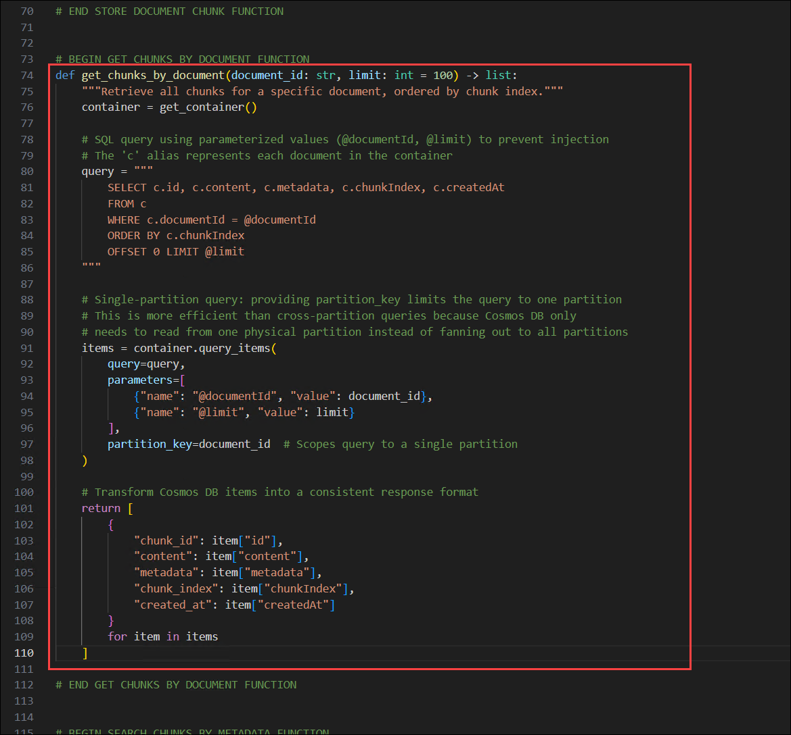

1. Search for the **BEGIN SEARCH CHUNKS BY METADATA FUNCTION** comment and add the following code directly after the comment. This function searches for chunks across documents using metadata filters, which is useful for finding relevant context based on tags, categories, or other attributes.

   ```python
   def search_chunks_by_metadata(
       filters: dict,
       limit: int = 10
   ) -> list:
       """Search for chunks across documents using metadata filters."""
       container = get_container()

       # Build WHERE clauses dynamically based on provided filters
       # This allows flexible querying by any combination of metadata fields
       where_clauses = []
       parameters = []

       if "source" in filters and filters["source"]:
           where_clauses.append("c.metadata.source = @source")
           parameters.append({"name": "@source", "value": filters["source"]})

       if "category" in filters and filters["category"]:
           where_clauses.append("c.metadata.category = @category")
           parameters.append({"name": "@category", "value": filters["category"]})

       if "tags" in filters and filters["tags"]:
           # ARRAY_CONTAINS checks if a value exists within an array field
           # This is useful for searching tags, keywords, or other list-based metadata
           where_clauses.append("ARRAY_CONTAINS(c.metadata.tags, @tag)")
           parameters.append({"name": "@tag", "value": filters["tags"][0]})

       # Default to "1=1" (always true) if no filters provided
       where_clause = " AND ".join(where_clauses) if where_clauses else "1=1"
       parameters.append({"name": "@limit", "value": limit})

       query = f"""
           SELECT c.id, c.documentId, c.content, c.metadata, c.chunkIndex
           FROM c
           WHERE {where_clause}
           OFFSET 0 LIMIT @limit
       """

       # Cross-partition query: searches across ALL partitions in the container
       # Required when you don't know which partition contains the data you need
       # More expensive than single-partition queries but necessary for metadata searches
       items = container.query_items(
           query=query,
           parameters=parameters,
           enable_cross_partition_query=True  # Fan out to all partitions
       )

       return [
           {
               "chunk_id": item["id"],
               "document_id": item["documentId"],
               "content": item["content"],
               "metadata": item["metadata"],
               "chunk_index": item["chunkIndex"]
           }
           for item in items
       ]
   ```

   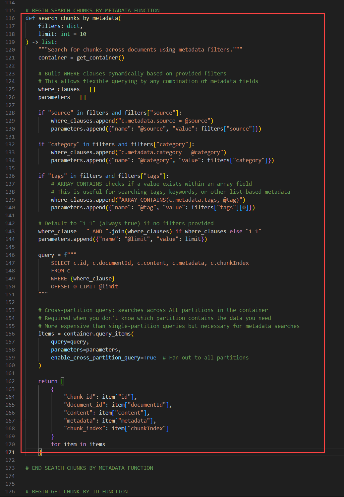

1. Search for the **BEGIN GET CHUNK BY ID FUNCTION** comment and add the following code directly after the comment. This function performs an efficient point read to retrieve a specific chunk by its ID and document ID.

   ```python
   def get_chunk_by_id(document_id: str, chunk_id: str) -> dict:
       """Retrieve a specific chunk using a point read (most efficient)."""
       container = get_container()

       try:
           # Point read: the most efficient Cosmos DB operation
           # By providing both the item ID and partition key, Cosmos DB can go
           # directly to the exact location of the document without any query execution
           # This results in the lowest latency and RU cost (typically 1 RU for small docs)
           item = container.read_item(
               item=chunk_id,         # The unique ID within the partition
               partition_key=document_id  # The partition where this item lives
           )
           return {
               "chunk_id": item["id"],
               "document_id": item["documentId"],
               "content": item["content"],
               "metadata": item["metadata"],
               "chunk_index": item["chunkIndex"],
               "created_at": item["createdAt"],
               "embedding": item.get("embedding", [])
           }
       except exceptions.CosmosResourceNotFoundError:
           # Return None if the item doesn't exist rather than raising an exception
           # This allows the caller to handle missing items gracefully
           return None
   ```

   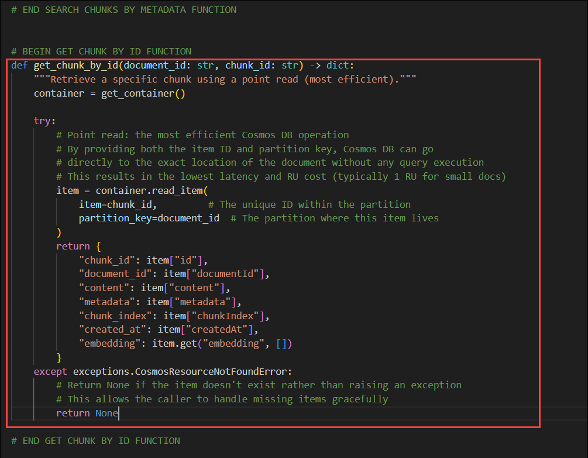

1. Save your changes to the _rag_functions.py_ file by using **Ctrl + S**.

1. Take a few minutes to review all of the code in the app.

Next, you finalize the Azure resource deployment.

## Task 4: Complete the Azure resource deployment

In this task, you'll finalize the Azure resource deployment by configuring Microsoft Entra ID access, verifying the deployment status, retrieving the Cosmos DB connection information, and loading the required environment variables.

1. Go back to the terminal. When the **Create Cosmos DB account** operation has completed, enter **2** to launch the **Configure Entra ID access** option. This assigns your user account the necessary role to access the Cosmos DB data plane.

   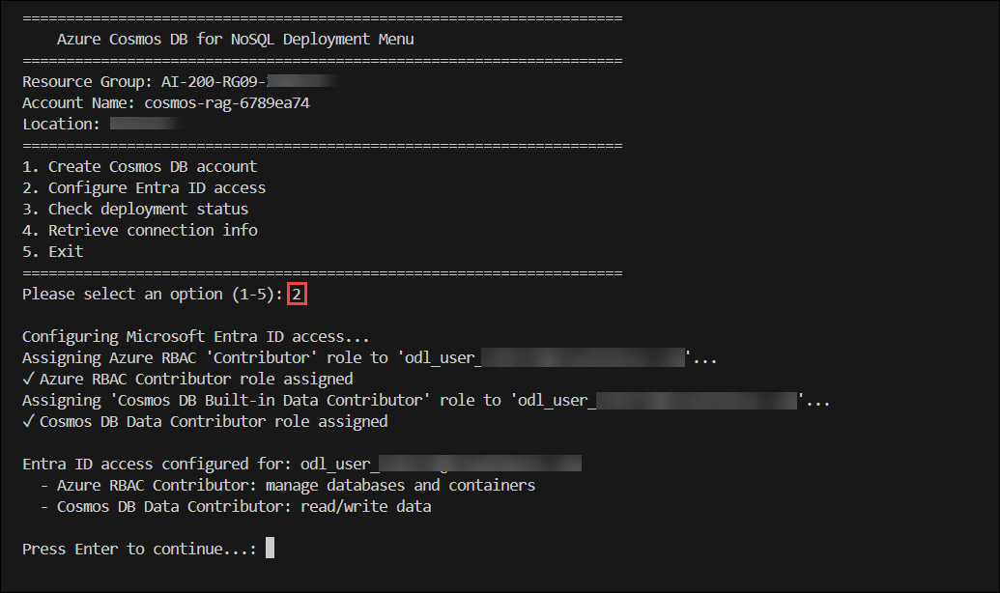

1. Enter **3** to launch the **Check deployment status** option. This verifies all resources are ready.

   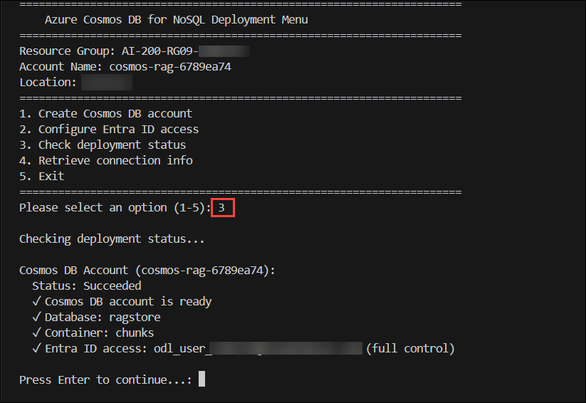

1. Enter **4** to launch the **Retrieve connection info** option. This creates a file with the necessary environment variables.

   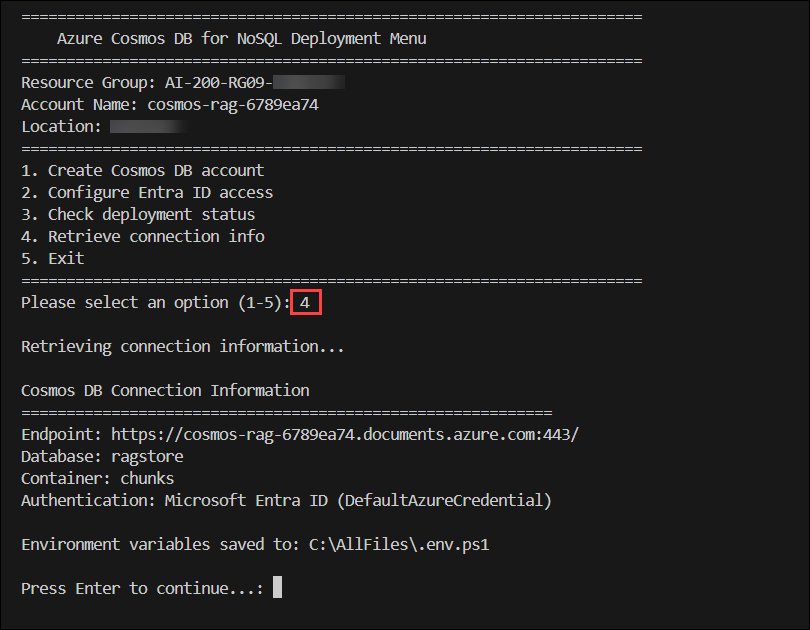

   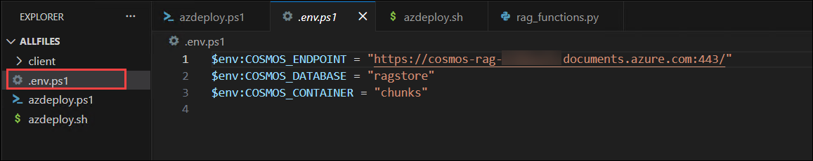

1. Enter **5** to exit the deployment script.

1. Run the following command to load the environment variables into your terminal session from the file created in a previous step.

   **Bash**

   ```bash
   source .env
   ```

   **PowerShell**

   ```powershell
   . .\.env.ps1
   ```

   > **Note:** Keep the terminal open. If you close it and create a new terminal, you might need to run the command to create the environment variable again.

Next, you explore the document schema used for the RAG document store.

## Task 5: Understand the RAG document schema

In this task, you'll explore the document schema used for the RAG document store and understand how document chunks, metadata, partitioning, and retrieval patterns are optimized for Azure Cosmos DB.

The document schema for each chunk includes:

| Field          | Description                                                               |
| -------------- | ------------------------------------------------------------------------- |
| **id**         | Unique identifier for the chunk (required by Cosmos DB)                   |
| **documentId** | Source document identifier (partition key)                                |
| **content**    | The actual text content of the chunk                                      |
| **metadata**   | Flexible object for source, category, tags, and custom attributes         |
| **embedding**  | Array placeholder for vector embeddings (used in vector search scenarios) |
| **chunkIndex** | Position of the chunk within the source document                          |
| **createdAt**  | Timestamp for when the chunk was stored                                   |

This schema supports common RAG patterns:

- **Point reads**: Retrieve a specific chunk by ID and document ID (lowest latency)
- **Single-partition queries**: Get all chunks for a document efficiently
- **Cross-partition queries**: Search across documents by metadata
- **Vector search**: When combined with vector indexing

## Task 6: Test the RAG functions with the Flask app

In this task, you'll configure the Python environment, run the Flask application, and validate the RAG document functions by loading sample data, executing automated tests, retrieving document chunks, and searching documents using metadata filters.

1. Run the following command to navigate to the **client** directory.

   ```
   cd client
   ```

1. Run the following command to create a virtual environment for the Flask app. Depending on your environment the command might be **python** or **python3**.

   ```
   python -m venv .venv
   ```

1. Run the following command to activate the Python environment.

   **Bash**

   ```bash
   source .venv/Scripts/activate
   ```

   **PowerShell**

   ```powershell
   .\.venv\Scripts\Activate.ps1
   ```

   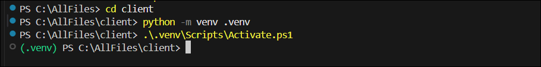

1. Run the following command to install the Python dependencies for the app. This installs the **flask** and **azure-cosmos** libraries.

   ```bash
   pip install -r requirements.txt
   ```

1. Run the following command to start the Flask application.

   ```bash
   python app.py
   ```

   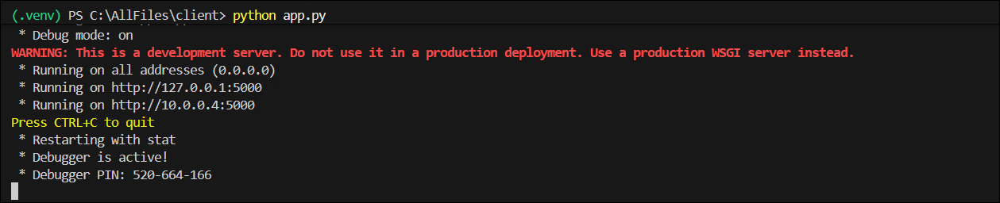

1. Open a browser and navigate to `http://127.0.0.1:5000` to view the application.

   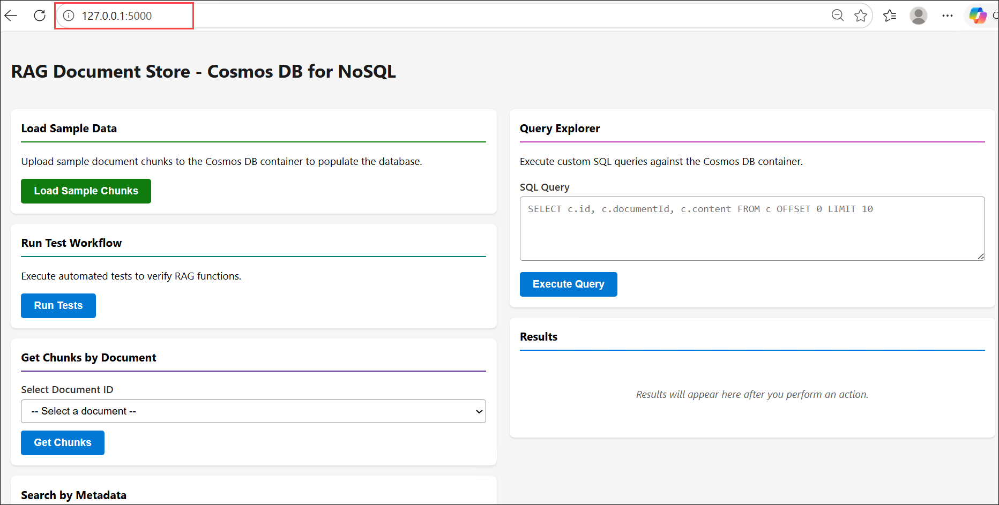

### Task 6.1: Load sample data

In this section you use the app to load sample document chunks into the Cosmos DB container. The app calls the **store_document_chunk()** function you created in **rag_functions.py** to insert each chunk.

1. In the **Load Sample Data** section, select **Load Sample Chunks**. This inserts 12 sample chunks across four documents, representing content from fictional Azure documentation articles.

   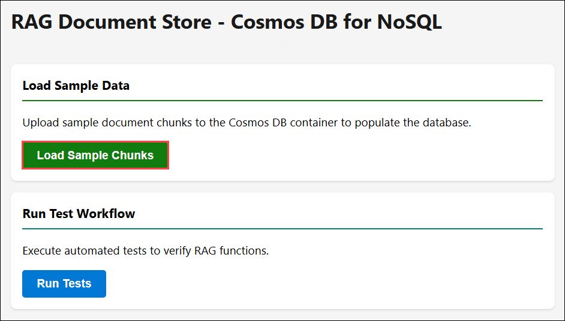

1. Verify that the success message appears in the **Results** section showing the number of chunks loaded and the total RU (Request Unit) charge.

   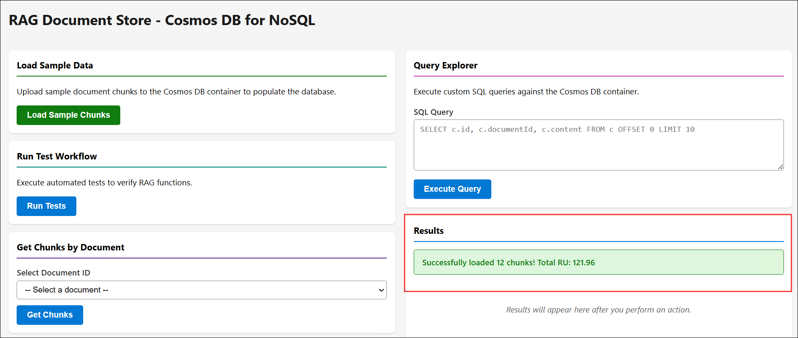

### Task 6.2: Run test workflow

In this section you run automated tests that verify the RAG functions you created in **rag_functions.py** work correctly.

1. In the **Run Test Workflow** section, select **Run Tests**. This executes five tests that exercise each function.

   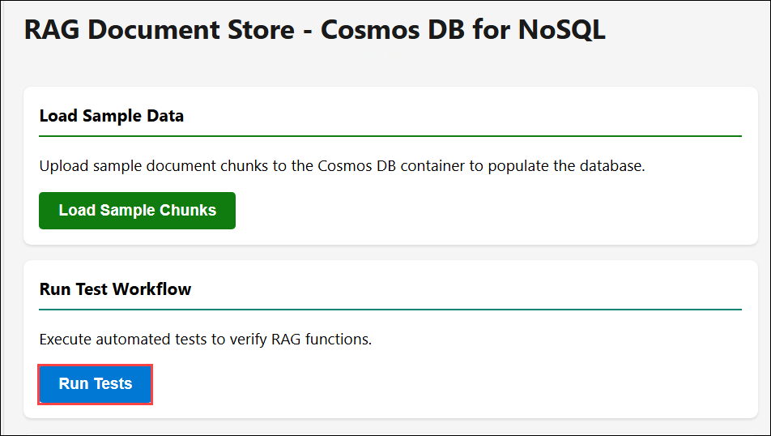

1. Review the test results in the **Results** panel. Each test should show a **passed** status:
   - Store document chunks
   - Get chunks by document ID
   - Search by category
   - Search by tag
   - Point read by ID

     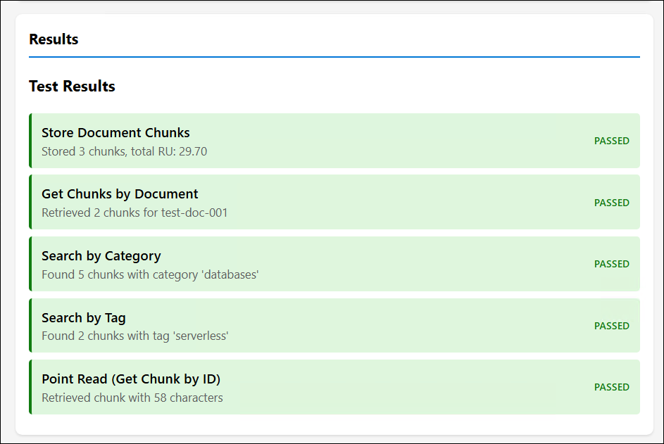

### Task 6.3: Get chunks by document

In this section you retrieve all chunks for a specific document. The app calls the **get_chunks_by_document()** function you created in **rag_functions.py**.

1. In the **Get Chunks by Document** section, select a document from the dropdown (for example, **doc-azure-overview**).

   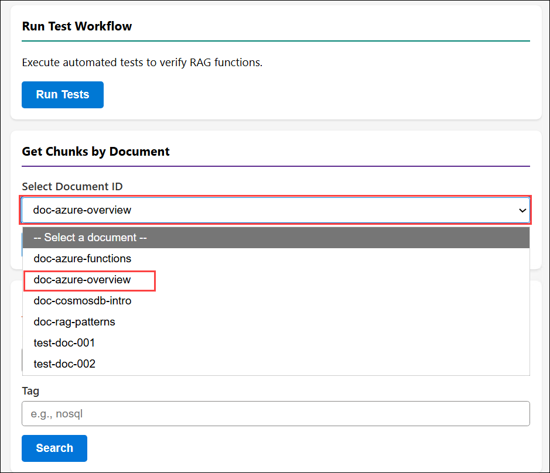

1. Select **Get Chunks** to retrieve all chunks for that document.

   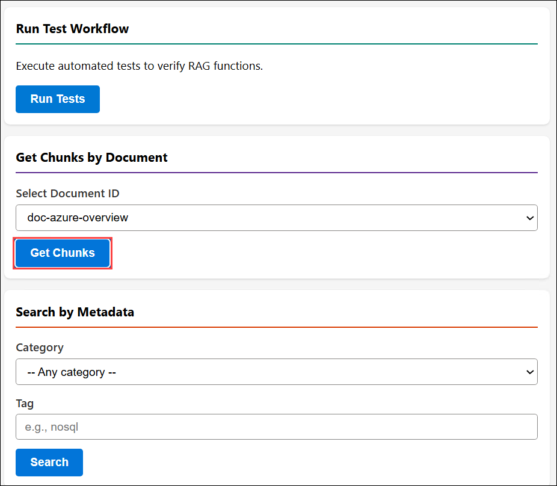

1. Review the results showing the chunks ordered by their index, along with their content and metadata tags.

   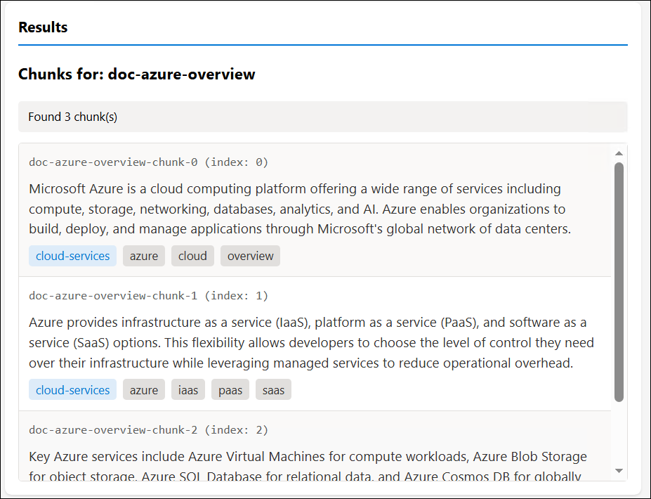

### Task 6.4: Search by metadata

In this section you search for chunks across all documents using metadata filters. The app calls the **search_chunks_by_metadata()** function you created in **rag_functions.py**. You observe how combining filters narrows the results.

1. In the **Search by Metadata** section, select **ai-applications (1)** from the **Category** dropdown. Leave the **Tag** field empty.

1. Select **Search (2)** to find all chunks with that category.

   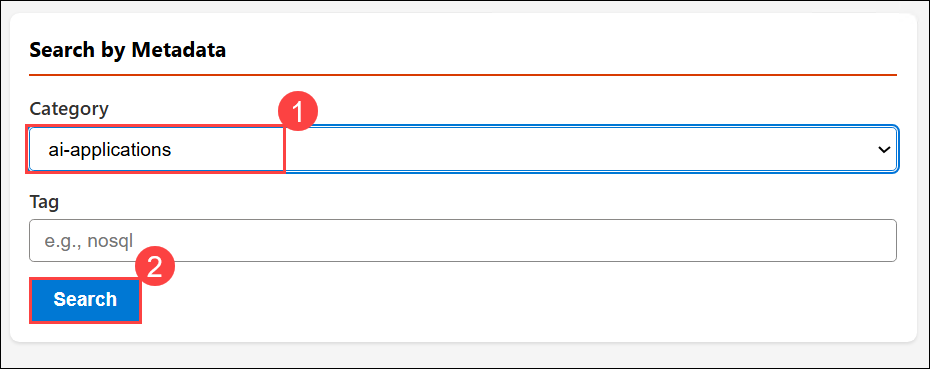

1. Review the results in the **Results** panel. You should see 4 chunks returned, each with different tags such as **rag**, **embeddings**, **chunking**, and **metadata**.

   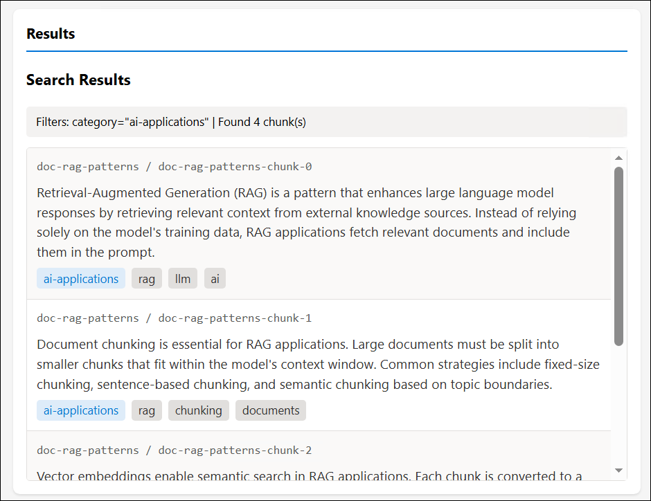

1. Now add a tag filter to narrow the results. Enter **embeddings (1)** in the **Tag** field and select **Search (2)** again.

   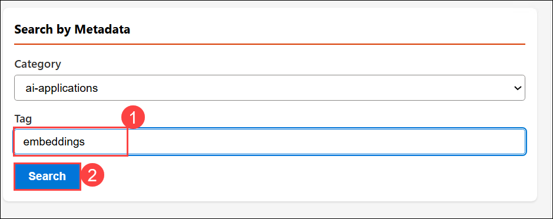

1. Notice that fewer results are returned - only chunks that match both the **ai-applications** category and contain the **embeddings** tag. This demonstrates how combining metadata filters helps RAG applications retrieve more targeted context.

   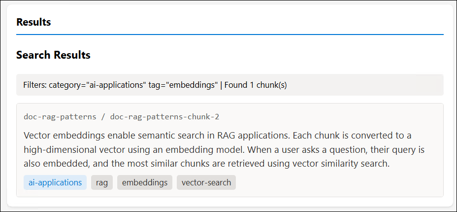

## Task 7: Query document context

In this task, you'll use the Cosmos DB SQL API to query the document store and retrieve relevant document context using common RAG query patterns, including document-based, metadata-based, and tag-based searches.

1. In the **Query Explorer** section, enter the following query in the **SQL Query** field to find all chunks for a specific document. This query retrieves chunks ordered by their index for sequential reading.

   ```sql
   SELECT c.id, c.chunkIndex, c.content, c.metadata
   FROM c
   WHERE c.documentId = 'doc-azure-overview'
   ORDER BY c.chunkIndex
   ```

1. Select **Execute Query** and review the results.

   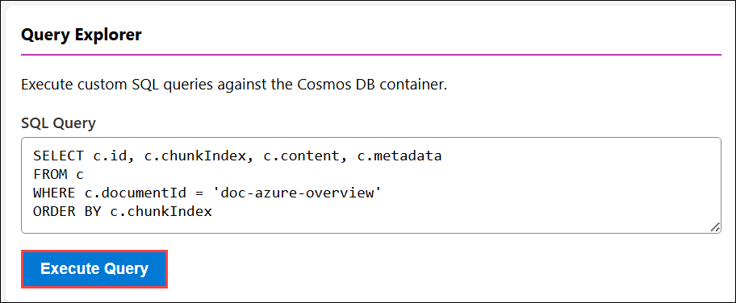

   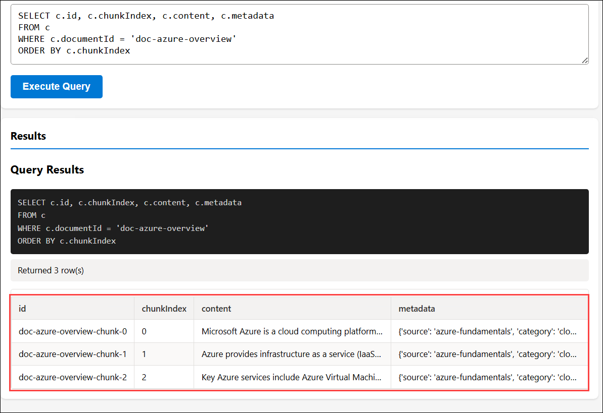

1. Enter the following query in the **SQL Query** field to search for chunks with a specific category across all documents. This demonstrates a cross-partition query that searches metadata.

   ```sql
   SELECT c.documentId, c.id, c.content, c.metadata.category
   FROM c
   WHERE c.metadata.category = 'cloud-services'
   ```

1. Select **Execute Query** and review the results.

   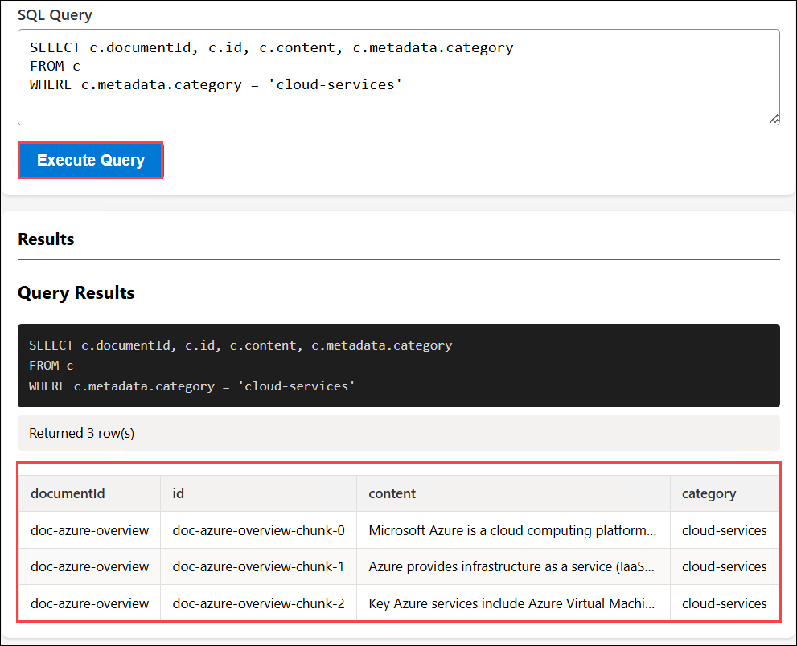

1. Enter the following query in the **SQL Query** field to view the documents stored in the container along with their category and source metadata. This helps understand what content is available for RAG retrieval.

   ```sql
   SELECT DISTINCT c.documentId, c.metadata.category, c.metadata.source
   FROM c
   ```

1. Select **Execute Query** and review the results.

   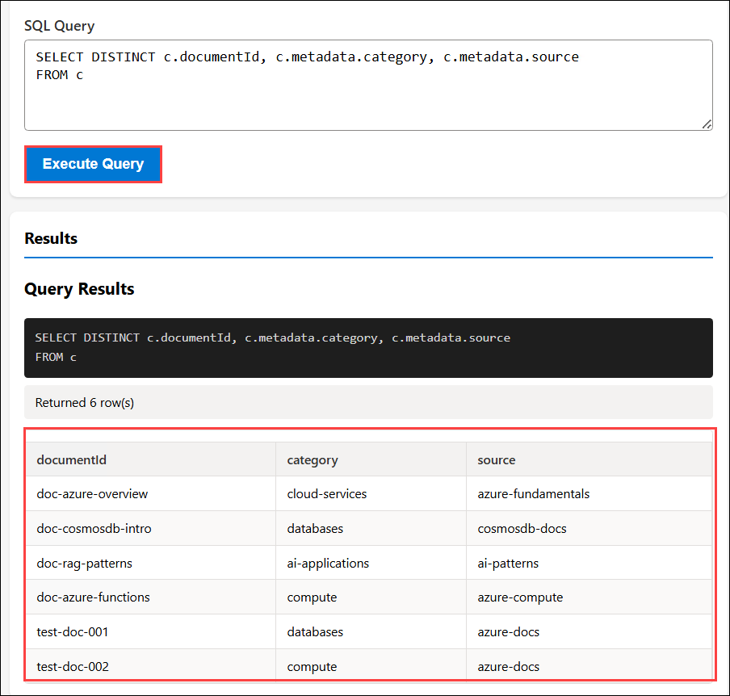

1. Enter the following query in the **SQL Query** field to find chunks that contain a specific tag in their metadata. This demonstrates searching within arrays using **ARRAY_CONTAINS**.

   ```sql
   SELECT c.documentId, c.id, c.content, c.metadata.tags
   FROM c
   WHERE ARRAY_CONTAINS(c.metadata.tags, 'compute')
   ```

1. Select **Execute Query** and review the results.

   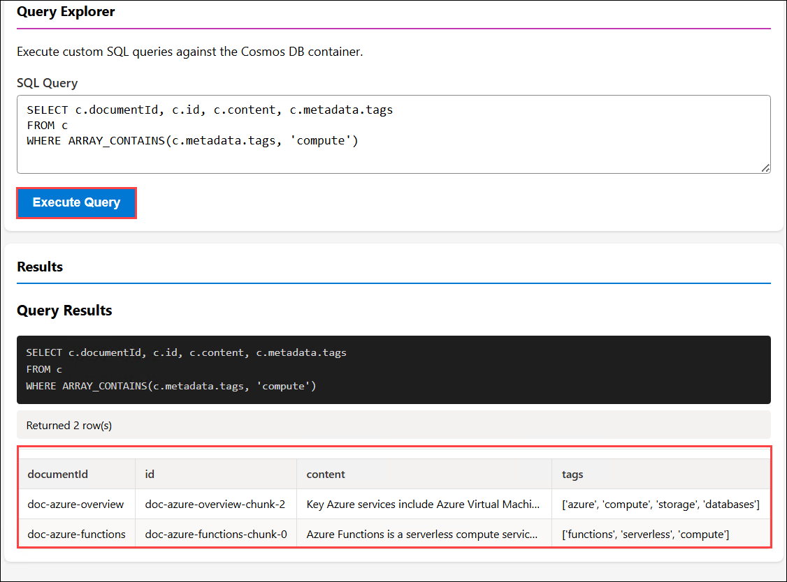

1. Return to the terminal and press **Ctrl+C** to stop the Flask application.

   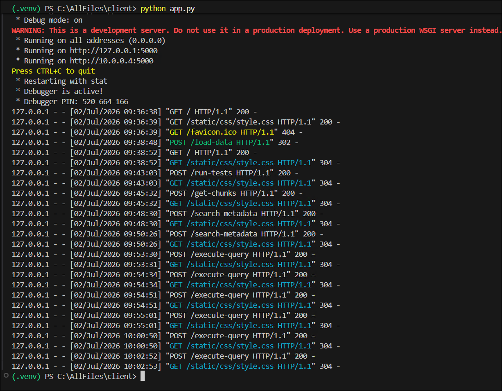

## Summary

In this exercise, you built a Cosmos DB-based document store for RAG applications. You deployed an Azure Cosmos DB for NoSQL account with a database and container optimized for document retrieval patterns. You created Python functions that store document chunks with metadata, retrieve chunks by document ID, search across documents using metadata filters, and perform efficient point reads. You tested the workflow using a Flask web application that exercised each function, then queried the stored data using the Cosmos DB SQL API. This pattern enables AI applications to store chunked documents and retrieve relevant context to ground language model responses.

## You have successfully completed the Hands-on Lab!
