# Lab 10: Build a semantic search application with Azure Cosmos DB for NoSQL

### Estimated Duration : 45 Minutes

## Lab overview

In this lab, you implement vector similarity search using Azure Cosmos DB for NoSQL. Vector search enables semantic matching by comparing high-dimensional vector representations of text, finding relevant results even when exact terms don't match. You configure a container with vector embedding and indexing policies, load support tickets with pre-computed embeddings, and execute similarity queries using the **VectorDistance** function. This pattern provides a foundation for building AI applications that perform semantic search, such as finding similar support cases to help resolve customer issues faster.

## Lab objectives

In this lab, you'll perform the following tasks:

- **Task 1:** Prepare the environment
- **Task 2:** Create resources in Azure
- **Task 3:** Build Python functions for vector similarity search
- **Task 4:** Complete the Azure resource deployment
- **Task 5:** Set up the Python environment
- **Task 6:** Test the vector search functions with the Flask app

## Task 1: Prepare the environment

In this task, you'll prepare the deployment environment, configure the deployment script, authenticate to Azure, register the required resource providers, install kubectl, and launch the deployment script.

1. Launch **Visual Studio Code** (VS Code) from desktop.

   

1. Select **File Explorer (1)** from left panel. Click **Open Folder** in the menu.

   

1. Navigate to **C:\AllFiles (1)** folder containing the project files and click on **Select folder (2)**.

   

1. If you get "Do you trust the authors of the files in this folder?" prompt, click **Yes, I trust the authors**.

   

1. The project contains deployment scripts for both Bash (_azdeploy.sh_) and PowerShell (_azdeploy.ps1_). Open the appropriate file for your environment and change the two values: **Resource group name** as **<inject key="ResourceGroupName" enableCopy="false"/>** and **Azure Region** as **<inject key="Region" enableCopy="false"/>** at the top of the script to meet your needs.

   > **Note:** Do not change anything else in the script.

   ```
   "<your-resource-group-name>" # Resource Group name
   "<your-azure-region>" # Azure region for the resources
   ```

   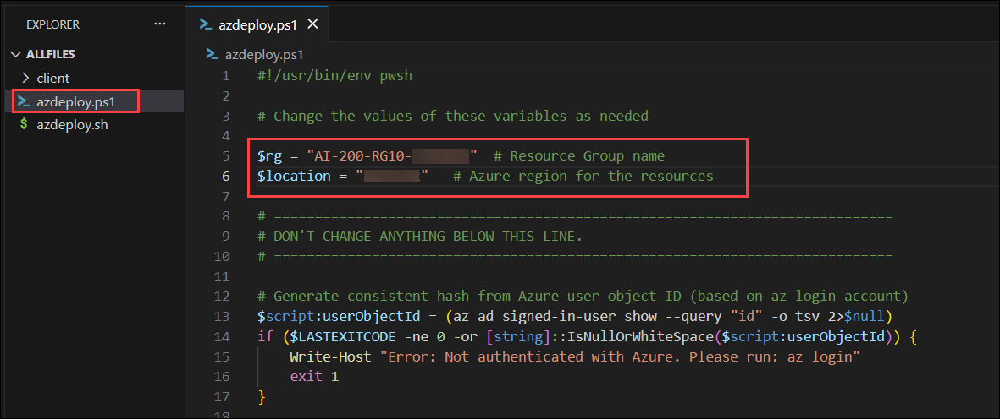

   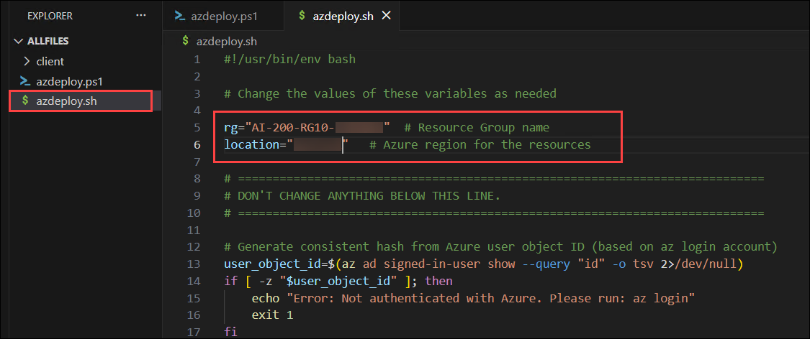

1. In the menu bar, select **File (1)** and select **Save All (2)** from drop-down.

   

1. In the menu bar, select **ellipsis (...) (1)**, then **Terminal (2)**, and then **New Terminal (3)** to open a terminal window in VS Code.

   

   > **NOTE:** If you are using Bash, after the terminal opens, click on the **+ (1)** icon to open a new terminal and select **Git Bash (2)** from the drop-down. If you are using PowerShell, skip this step.
   >
   > 

1. Run the following command in the terminal to allow PowerShell scripts to run. This command is only required if you are using PowerShell. If you are using Bash, skip this step.

   ```
   Set-ExecutionPolicy -ExecutionPolicy bypass -Force
   ```

   

1. Run the **following command (1)** to login to your Azure account. Next, **minimize the VS Code window (2)** to view the login window opened in background.

   ```
   az login
   ```

   

1. In the login window, select **Work or school account (1)** and click **Continue (2)**.

   

1. In the login window, kindly sign in using the provided **Azure credentials (1)** and click **Next (2)**.
   - **Email/Username:** <inject key="AzureAdUserEmail"></inject>

     

1. Next, enter the provided **Password (1)** and click **Sign in (2)**.
   - **Password:** <inject key="AzureAdUserPassword"></inject>

     

1. Next, select **No, this app only** and navigate back to VS Code to continue.

   

1. Answer the prompts to select your Azure account and subscription for the exercise.

   

   > **NOTE:** To confirm you're logged in to the correct Azure subscription, run **az account show**.

## Task 2: Create resources in Azure

In this task, you'll deploy an Azure Cosmos DB for NoSQL account with vector search capability by using the deployment script to create the resources required for semantic search.

1. Make sure you are in the root directory of the project and run the appropriate command in the terminal to launch the deployment script.

   **Bash**

   ```bash
   MSYS_NO_PATHCONV=1 bash azdeploy.sh
   ```

   **PowerShell**

   ```powershell
   ./azdeploy.ps1
   ```

1. When the script menu appears, enter **1** to launch the **Create Cosmos DB account** option. This creates the Cosmos DB for NoSQL account with the **EnableNoSQLVectorSearch** capability and a database.

   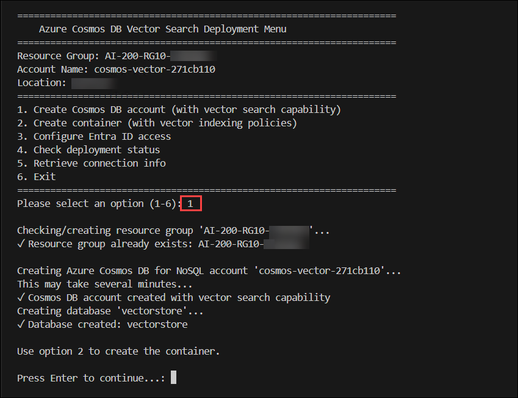

   > **Note:** Deployment can take 5-10 minutes to complete.

   > **IMPORTANT:** Leave the terminal running the deployment open for the duration of the exercise. You can move on to the next section of the exercise while the deployment continues in the terminal.

## Task 3: Build Python functions for vector similarity search

In this task, you'll implement Python functions that store vector embeddings, perform vector similarity searches, and execute filtered semantic searches. You'll also review the container configuration required to enable vector search in Azure Cosmos DB

### Task 3.1: Complete the vector search functions

In this section you complete the _vector_functions.py_ file by adding functions that perform vector similarity search. These functions use the **VectorDistance** function to calculate similarity between query vectors and ticket embeddings. A support application could use these functions to find similar tickets when a new issue is reported.

1. Open the **client/vector_functions.py** file in VS Code.

   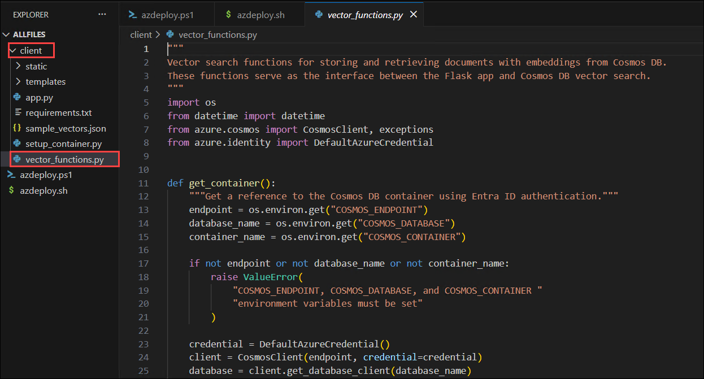

1. Search for the **BEGIN STORE VECTOR DOCUMENT FUNCTION** comment and add the following code directly after the comment. This function stores a support ticket with its vector embedding for similarity search.

   ```python
   def store_vector_document(
       document_id: str,
       chunk_id: str,
       content: str,
       embedding: list,
       metadata: dict = None
   ) -> dict:
       """Store a document with its vector embedding for similarity search."""
       container = get_container()

       # Build the document structure with embedding for vector search
       # The 'id' field is required by Cosmos DB and must be unique within the partition
       # The 'documentId' field is our partition key - chunks from the same source document
       # are stored together for efficient retrieval
       # The 'embedding' field contains the vector that will be used for similarity search
       document = {
           "id": chunk_id,
           "documentId": document_id,
           "content": content,
           "embedding": embedding,  # 256-dimensional vector for similarity search
           "metadata": metadata or {},
           "createdAt": datetime.utcnow().isoformat(),
           "chunkIndex": metadata.get("chunkIndex", 0) if metadata else 0
       }

       # upsert_item inserts if new, updates if exists (based on id + partition key)
       # This is idempotent - safe to call multiple times with the same data
       response = container.upsert_item(body=document)

       # Request Units (RUs) measure the cost of database operations in Cosmos DB
       # Tracking RU consumption helps optimize queries and estimate costs
       ru_charge = response.get_response_headers()['x-ms-request-charge']

       return {
           "chunk_id": chunk_id,
           "document_id": document_id,
           "ru_charge": float(ru_charge)
       }
   ```

   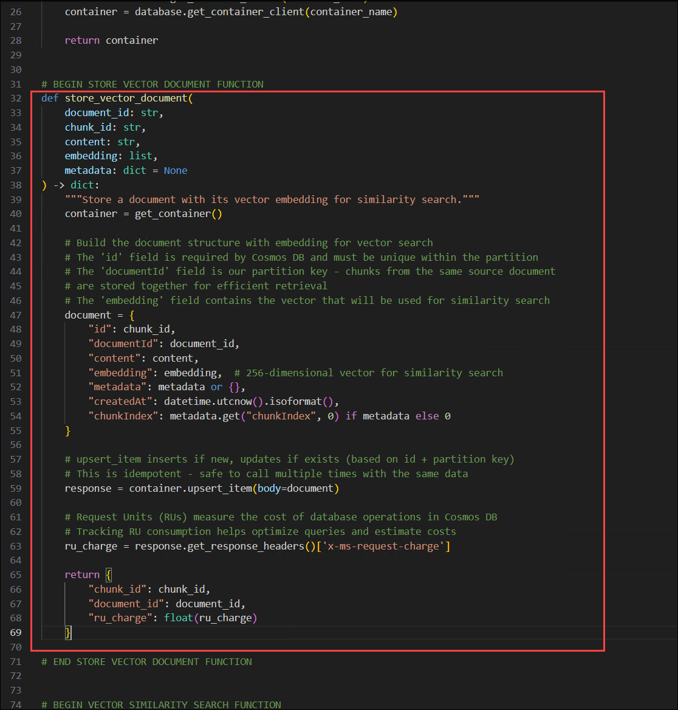

1. Search for the **BEGIN VECTOR SIMILARITY SEARCH FUNCTION** comment and add the following code directly after the comment. This function finds tickets most similar to a query using vector distance.

   ```python
   def vector_similarity_search(
       query_embedding: list,
       top_n: int = 5
   ) -> list:
       """
       Find documents most similar to the query using vector distance.

       Uses the VectorDistance function to calculate cosine similarity between
       the query embedding and document embeddings stored in Cosmos DB.
       Results are ordered by similarity (lowest distance = most similar).
       """
       container = get_container()

       # The VectorDistance function calculates the distance between two vectors
       # Using cosine distance: 0 = identical, 2 = opposite
       # We order by distance ascending so most similar results come first
       # The @queryVector parameter contains our 256-dimensional query embedding
       query = """
           SELECT TOP @topN
               c.id,
               c.documentId,
               c.content,
               c.metadata,
               VectorDistance(c.embedding, @queryVector) AS similarityScore
           FROM c
           ORDER BY VectorDistance(c.embedding, @queryVector)
       """

       items = container.query_items(
           query=query,
           parameters=[
               {"name": "@topN", "value": top_n},
               {"name": "@queryVector", "value": query_embedding}
           ],
           enable_cross_partition_query=True
       )

       return [
           {
               "chunk_id": item["id"],
               "document_id": item["documentId"],
               "content": item["content"],
               "metadata": item["metadata"],
               "similarity_score": item["similarityScore"]
           }
           for item in items
       ]
   ```

   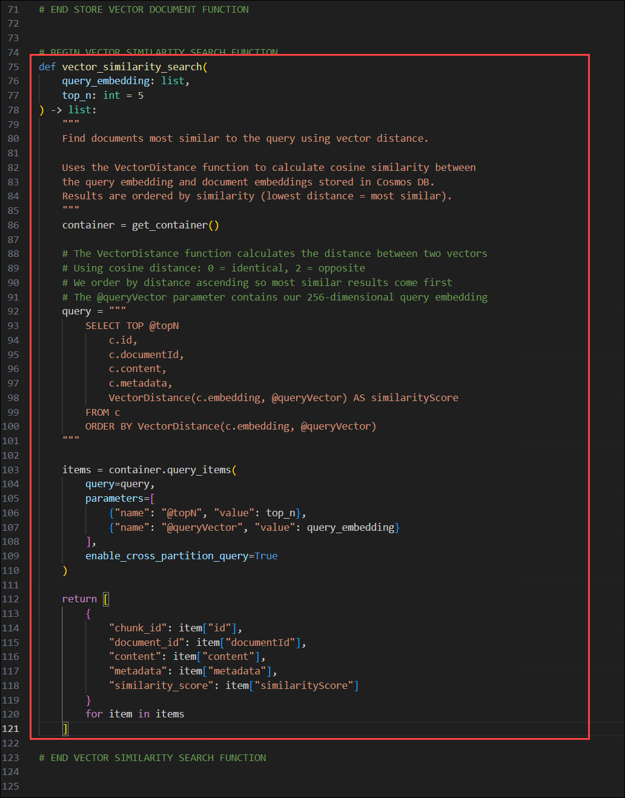

1. Search for the **BEGIN FILTERED VECTOR SEARCH FUNCTION** comment and add the following code directly after the comment. This function combines vector similarity search with metadata filtering for hybrid queries.

   ```python
   def filtered_vector_search(
       query_embedding: list,
       category: str = None,
       top_n: int = 5
   ) -> list:
       """
       Combine vector similarity search with metadata filtering.

       This hybrid approach first filters documents by category (or other metadata),
       then ranks the filtered results by vector similarity. This is useful for
       narrowing results to a specific domain before applying semantic search.
       """
       container = get_container()

       # Build WHERE clause for metadata filtering
       # The filter is applied BEFORE vector ranking, reducing the search space
       where_clause = ""
       parameters = [
           {"name": "@topN", "value": top_n},
           {"name": "@queryVector", "value": query_embedding}
       ]

       if category:
           where_clause = "WHERE c.metadata.category = @category"
           parameters.append({"name": "@category", "value": category})

       # Filtered vector search: apply metadata filter, then rank by similarity
       query = f"""
           SELECT TOP @topN
               c.id,
               c.documentId,
               c.content,
               c.metadata,
               VectorDistance(c.embedding, @queryVector) AS similarityScore
           FROM c
           {where_clause}
           ORDER BY VectorDistance(c.embedding, @queryVector)
       """

       items = container.query_items(
           query=query,
           parameters=parameters,
           enable_cross_partition_query=True
       )

       return [
           {
               "chunk_id": item["id"],
               "document_id": item["documentId"],
               "content": item["content"],
               "metadata": item["metadata"],
               "similarity_score": item["similarityScore"]
           }
           for item in items
       ]
   ```

   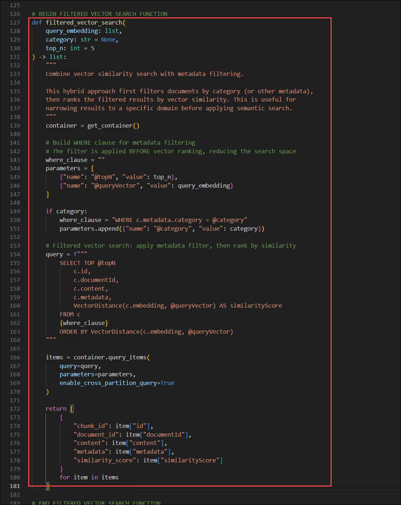

1. Save your changes to the **vector_functions.py** file using **Ctrl + S**.

1. Take a few minutes to review all of the code in the file.

### Task 3.2: Review the setup container code

In this section you review the _setup_container.py_ script used to create a Cosmos DB container with vector embedding and indexing policies. The deployment script already created the container with these policies, but reviewing the code helps you understand the configuration.

1. Open the **client/setup_container.py** file in VS Code.

   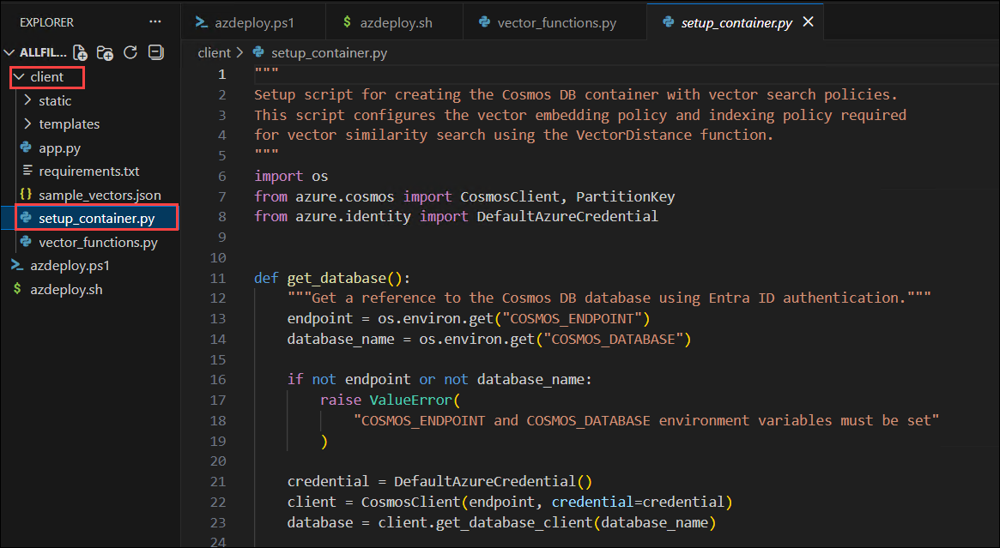

1. Search for the **BEGIN CREATE VECTOR CONTAINER FUNCTION** comment, add the following code and review it. Notice the two key policy configurations:

   ```python
   # Define the vector embedding policy
   # This tells Cosmos DB how to handle vector data at the /embedding path
   vector_embedding_policy = {
       "vectorEmbeddings": [
           {
               "path": "/embedding",
               "dataType": "float32",
               "distanceFunction": "cosine",
               "dimensions": 256
           }
       ]
   }

   # Define the indexing policy with vector index
   # - DiskANN provides efficient approximate nearest neighbor search
   # - Exclude /embedding/* from standard indexing (vectors use their own index)
   indexing_policy = {
       "indexingMode": "consistent",
       "automatic": True,
       "includedPaths": [{"path": "/*"}],
       "excludedPaths": [{"path": "/embedding/*"}],
       "vectorIndexes": [
           {"path": "/embedding", "type": "diskANN"}
       ]
   }

   # Create the container with vector policies
   # partition_key determines how data is distributed across physical partitions
   container = database.create_container_if_not_exists(
       id=container_name,
       partition_key=PartitionKey(path="/documentId"),
       indexing_policy=indexing_policy,
       vector_embedding_policy=vector_embedding_policy
   )
   ```

   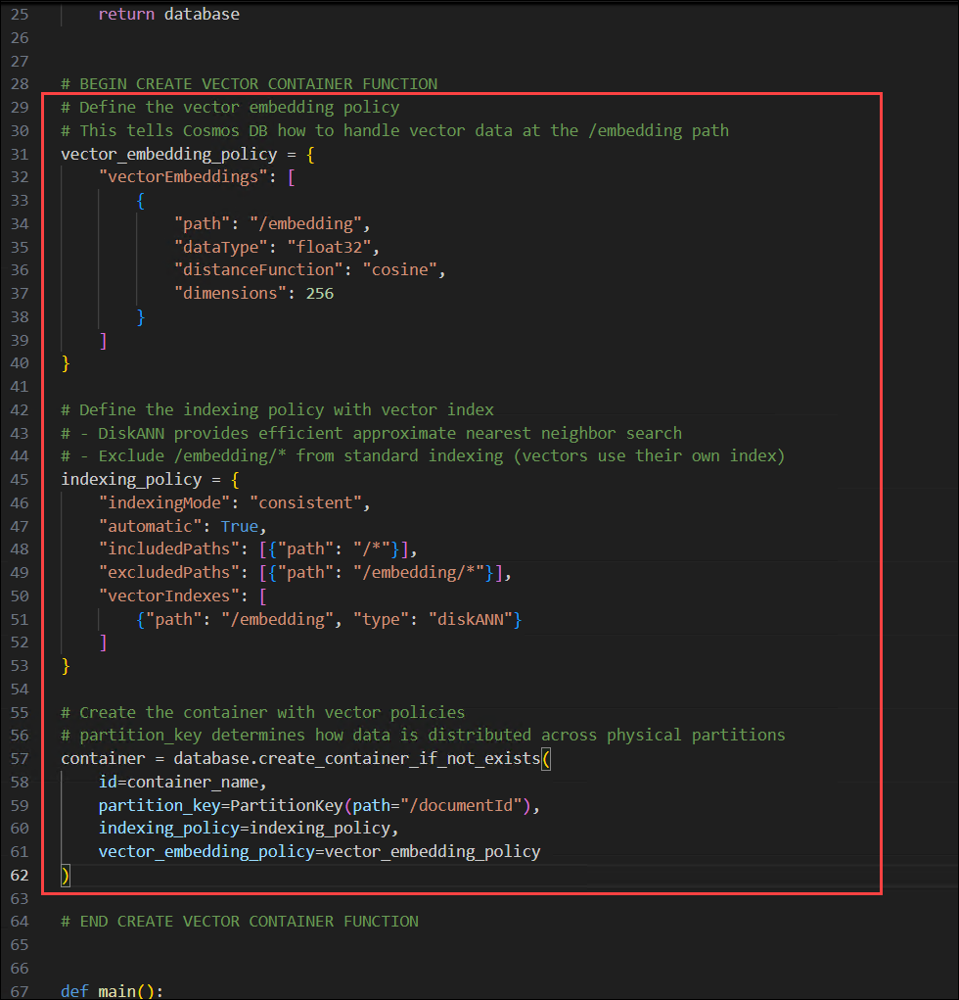

1. Take a moment to understand the key configuration elements:

   | Policy               | Setting                  | Purpose                                          |
   | -------------------- | ------------------------ | ------------------------------------------------ |
   | **vectorEmbeddings** | path: /embedding         | Location where vector data is stored             |
   | **vectorEmbeddings** | dimensions: 256          | Must match your embedding model output           |
   | **vectorEmbeddings** | distanceFunction: cosine | Similarity metric for VectorDistance             |
   | **vectorIndexes**    | type: diskANN            | Efficient approximate nearest neighbor algorithm |
   | **excludedPaths**    | /embedding/\*            | Vectors use specialized index, not standard      |

Next, you finalize the Azure resource deployment.

## Task 4: Complete the Azure resource deployment

In this task, you'll finalize the Azure resource deployment by creating the vector-enabled container, configuring Microsoft Entra ID access, verifying the deployment status, retrieving the connection information, and loading the required environment variables.

1. When the **Create Cosmos DB account** operation has completed, enter **2** to launch the **Create container** option. This creates the vector container with the embedding and indexing policies needed for similarity search.

   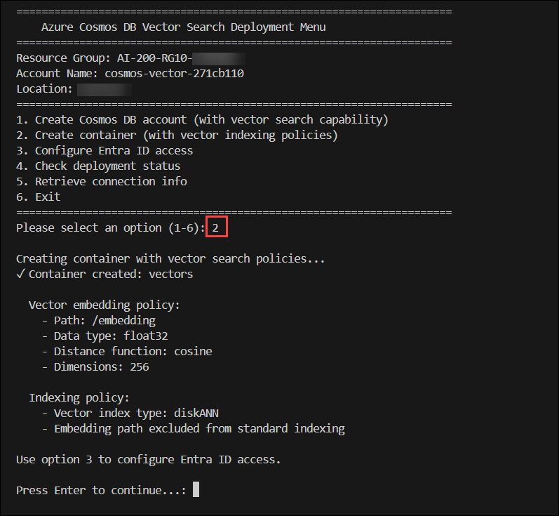

1. Enter **3** to launch the **Configure Entra ID access** option. This assigns your user account the necessary role to access the Cosmos DB data plane.

   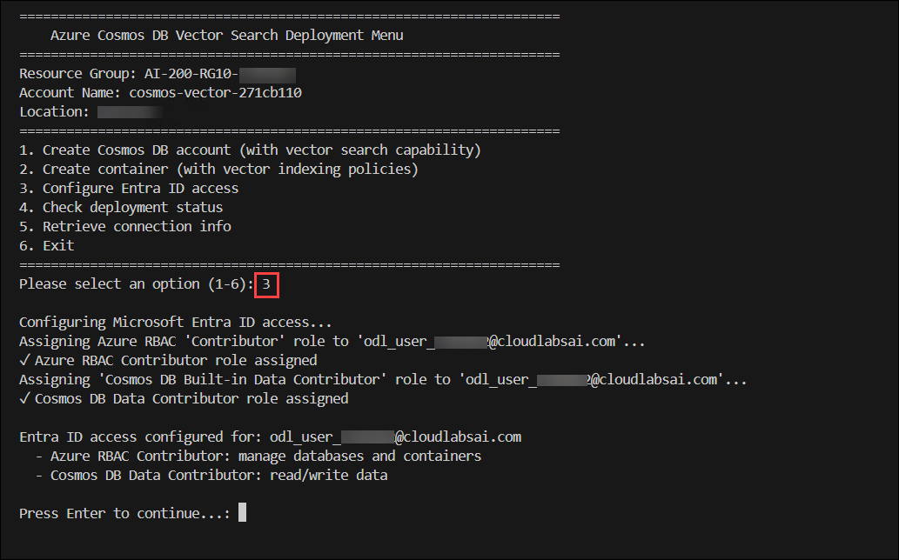

1. Enter **4** to launch the **Check deployment status** option. Verify the Cosmos DB account shows as ready with the vector search capability enabled.

   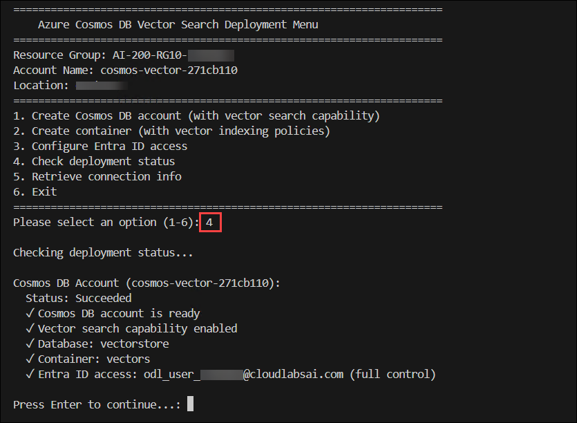

1. Enter **5** to launch the **Retrieve connection info** option. This creates a file with the necessary environment variables.

   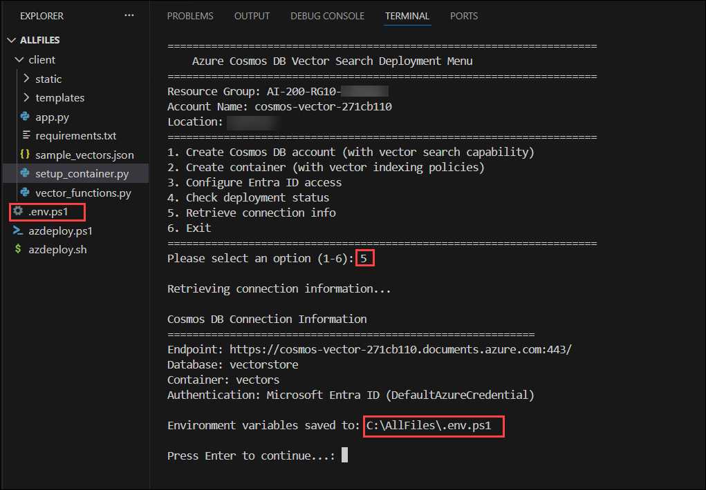

1. Enter **6** to exit the deployment script.

1. Run the following command to load the environment variables into your terminal session from the file created in a previous step.

   **Bash**

   ```bash
   source .env
   ```

   **PowerShell**

   ```powershell
   . .\.env.ps1
   ```

   > **Note:** Keep the terminal open. If you close it and create a new terminal, you might need to run the command to create the environment variable again.

Next, you set up the Python environment and run the application.

## Task 5: Set up the Python environment

In this task, you'll create a Python virtual environment, activate it, and install the dependencies required to run the vector search application.

1. Run the following command to navigate to the _client_ directory.

   ```
   cd client
   ```

1. Run the following command to create a virtual environment for the Python scripts. Depending on your environment the command might be **python** or **python3**.

   ```
   python -m venv .venv
   ```

1. Run the following command to activate the Python environment.

   **Bash**

   ```bash
   source .venv/Scripts/activate
   ```

   **PowerShell**

   ```powershell
   .\.venv\Scripts\Activate.ps1
   ```

1. Run the following command to install the Python dependencies. This installs the **flask**, **azure-cosmos**, and **azure-identity** libraries.

   ```bash
   pip install -r requirements.txt
   ```

Next, you test the vector search functions using the Flask application.

## Task 6: Test the vector search functions with the Flask app

In this task, you'll run the Flask application to validate the vector search implementation by loading sample data, performing semantic similarity searches, and combining vector search with metadata filtering to retrieve relevant results.

1. Ensure you are still in the _client_ directory with the virtual environment activated. You should see **(.venv)** in your terminal prompt.

1. Run the following command to start the Flask application.

   ```bash
   python app.py
   ```

1. Open a browser and navigate to `http://127.0.0.1:5000` to view the application.

   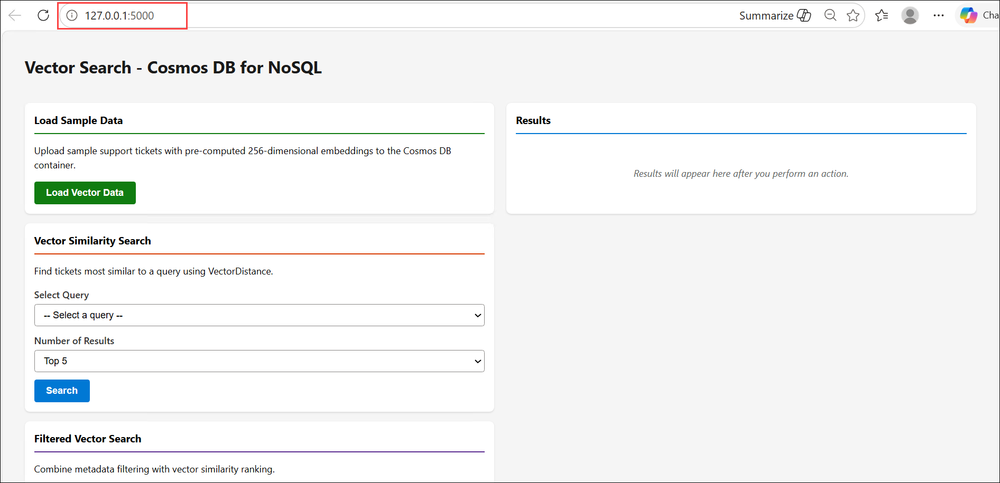

### Task 6.1: Load sample data

In this section you use the app to load sample support tickets with pre-computed embeddings into the Cosmos DB container. The sample data includes 12 support tickets across different categories (billing, technical, account, shipping), each with a 256-dimensional embedding vector. The app calls the **store_vector_document()** function you created in _vector_functions.py_.

1. In the **Load Sample Data** section, select **Load Vector Data**. This inserts tickets with their pre-computed embeddings from the _sample_vectors.json_ file.

   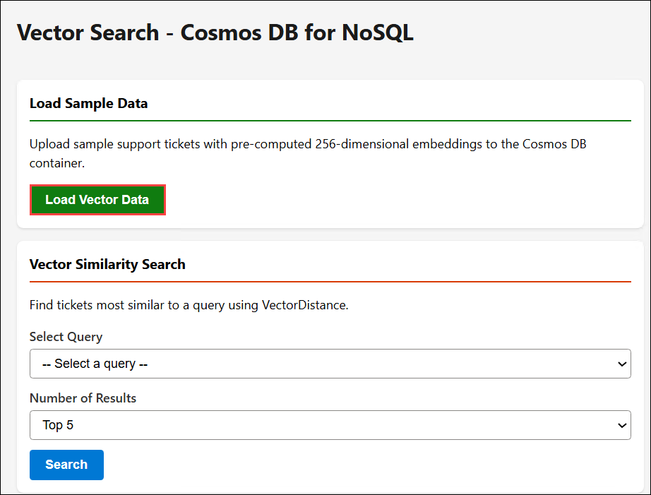

1. Verify that the success message appears in the **Results** section showing the number of tickets loaded and the total RU (Request Unit) charge.

   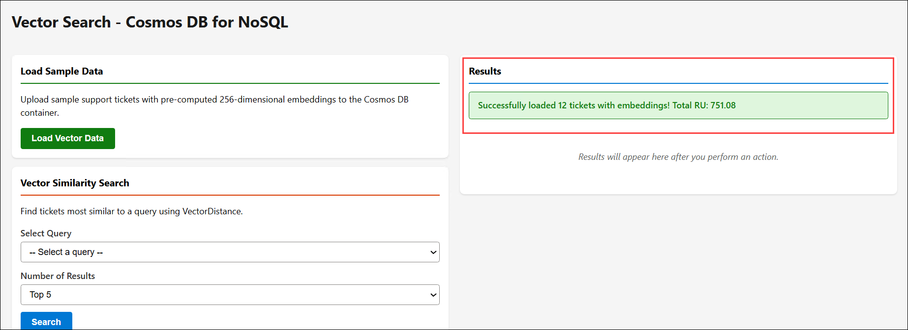

### Task 6.2: Vector similarity search

In this section you perform semantic searches using pre-computed query vectors. The app calls the **vector_similarity_search()** function you created in _vector_functions.py_.

1. In the **Vector Similarity Search** section, select **I can't login to my account (1)** from the **Select Query** dropdown.

1. Keep the default **Top 5** results and select **Search (2)**.

   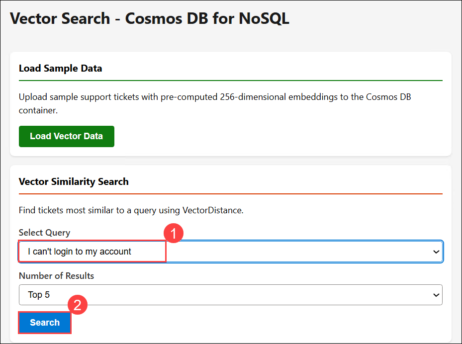

1. Review the results showing tickets ranked by similarity score. Notice that tickets about authentication and account access appear first, even though they may use different terminology than the query.

   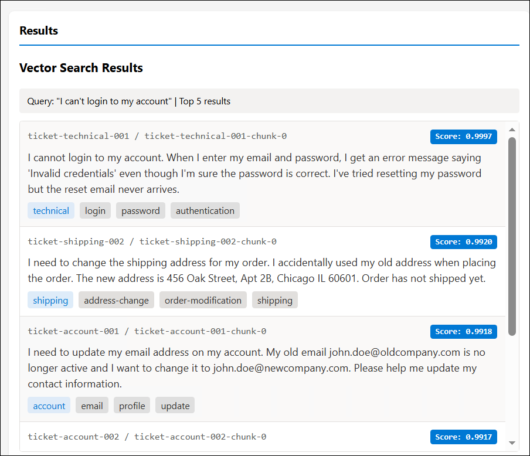

1. Try selecting different queries such as **My payment was charged twice** or **Package hasn't arrived yet** to see how the semantic search finds relevant support cases.

### Task 6.3: Filtered vector search

In this section you combine metadata filtering with vector similarity ranking. The app calls the **filtered_vector_search()** function you created in _vector_functions.py_. You observe how filtering narrows results to a specific category.

1. In the **Filtered Vector Search** section, select **I can't login to my account (1)** from the **Select Query** dropdown.

1. Select **technical (2)** from the **Filter by Category** dropdown.

1. Select **Search with Filter (3)** to execute the filtered search.

   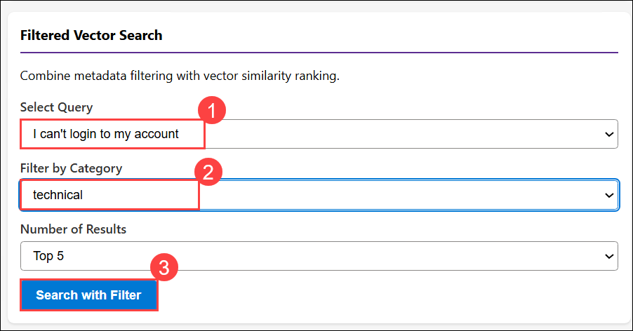

1. Review the results. Notice that only tickets with the **technical** category are returned, ranked by similarity to the query.

   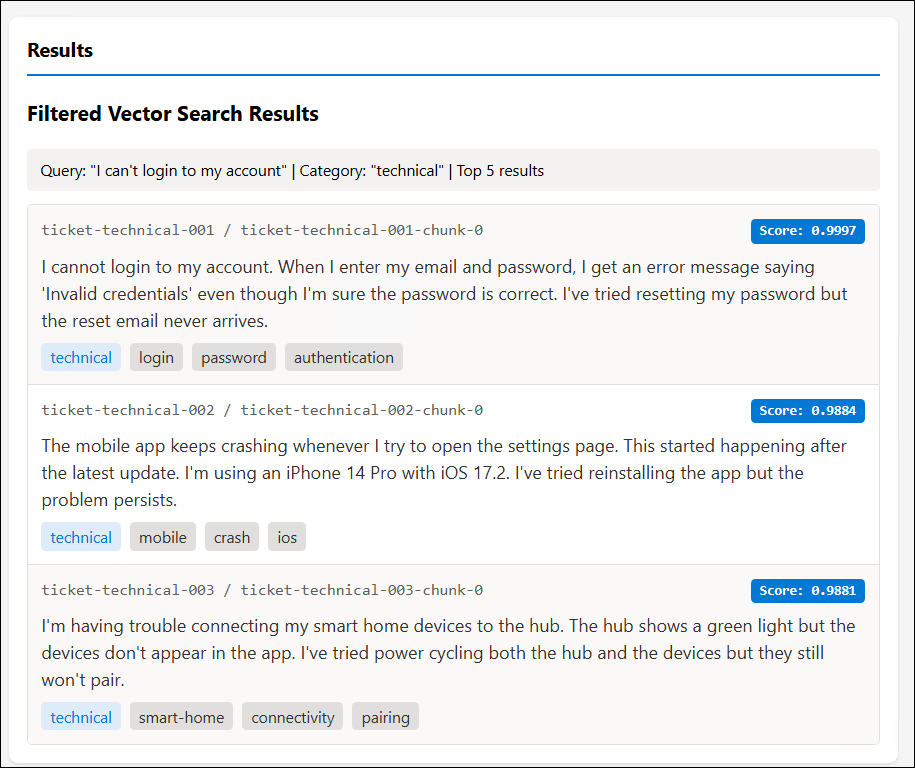

1. Try the same query with the **account** category to see different results that are still semantically relevant but limited to account-related issues.

1. Return to the terminal and press **Ctrl+C** to stop the Flask application.

   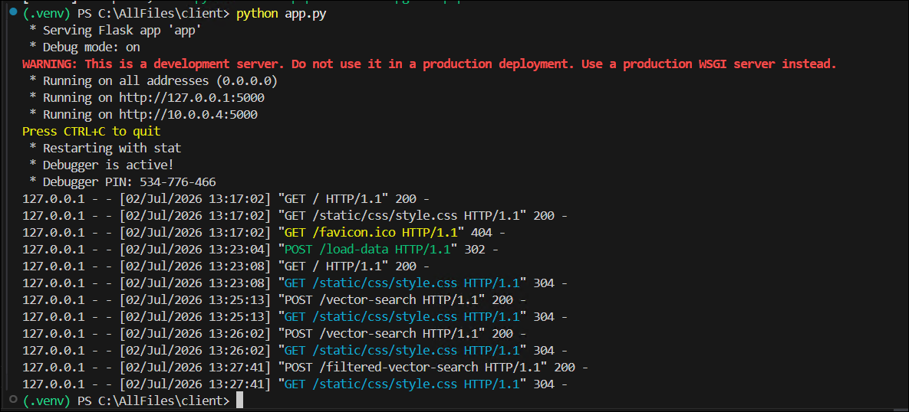

## Summary

In this lab, you implemented vector similarity search using Azure Cosmos DB for NoSQL. You deployed an Azure Cosmos DB account with the **EnableNoSQLVectorSearch** capability and configured Entra ID authentication. You created a container using the Python SDK with vector embedding and indexing policies that enable the **VectorDistance** function. You built Python functions that store support tickets with embeddings, perform vector similarity search, and combine vector search with metadata filters. You tested the workflow using a Flask web application. This pattern enables applications to perform semantic search over support data, finding similar tickets based on meaning rather than exact keyword matches.

## You have successfully completed the Hands-on Lab!
