# Lab 11: Optimize query performance with vector indexes on Azure Cosmos DB for NoSQL

### Estimated Duration : 45 Minutes

## Lab overview

In this lab, you compare and tune vector indexing strategies to optimize query performance in Azure Cosmos DB for NoSQL. Vector indexes significantly impact both search quality and Request Unit (RU) consumption. You create containers with three different index types—flat, quantizedFlat, and diskANN—load identical sample data, and run comparative searches to measure performance differences. This hands-on practice helps you select the right indexing strategy for your AI application's requirements.

## Lab objectives

In this lab, you'll perform the following tasks:

- **Task 1:** Prepare the environment
- **Task 2:** Create resources in Azure
- **Task 3:** Complete the index comparison functions
- **Task 4:** Complete the Azure resource deployment
- **Task 5:** Set up the Python environment
- **Task 6:** Test vector index performance with the Flask app

## Task 1: Prepare the environment

In this task, you'll prepare the deployment environment, configure the deployment script, authenticate to Azure, register the required resource providers, install kubectl, and launch the deployment script.

1. Launch **Visual Studio Code** (VS Code) from desktop.

   

1. Select **File Explorer (1)** from left panel. Click **Open Folder** in the menu.

   

1. Navigate to **C:\AllFiles (1)** folder containing the project files and click on **Select folder (2)**.

   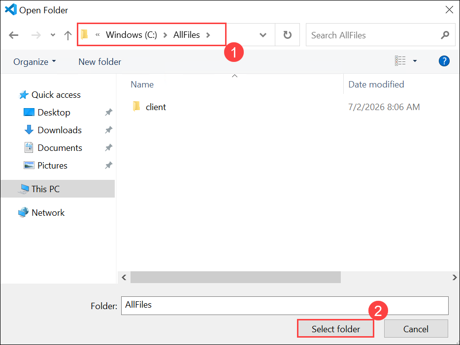

1. If you get "Do you trust the authors of the files in this folder?" prompt, click **Yes, I trust the authors**.

   

1. The project contains deployment scripts for both Bash (_azdeploy.sh_) and PowerShell (_azdeploy.ps1_). Open the appropriate file for your environment and change the two values: **Resource group name** as **<inject key="ResourceGroupName" enableCopy="false"/>** and **Azure Region** as **<inject key="Region" enableCopy="false"/>** at the top of the script to meet your needs.

   > **Note:** Do not change anything else in the script.

   ```
   "<your-resource-group-name>" # Resource Group name
   "<your-azure-region>" # Azure region for the resources
   ```

   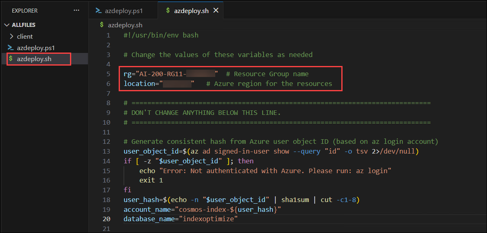

   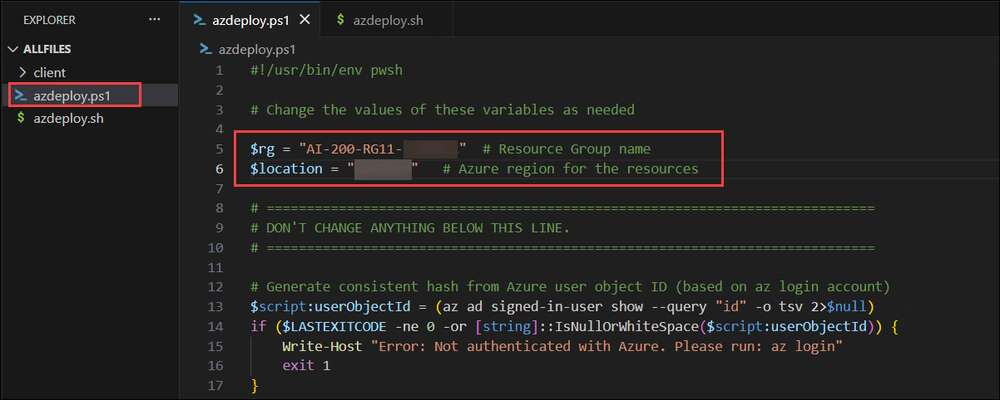

1. In the menu bar, select **File (1)** and select **Save All (2)** from drop-down.

   

1. In the menu bar, select **ellipsis (...) (1)**, then **Terminal (2)**, and then **New Terminal (3)** to open a terminal window in VS Code.

   

   > **NOTE:** If you are using Bash, after the terminal opens, click on the **+ (1)** icon to open a new terminal and select **Git Bash (2)** from the drop-down. If you are using PowerShell, skip this step.
   >
   > 

1. Run the following command in the terminal to allow PowerShell scripts to run. This command is only required if you are using PowerShell. If you are using Bash, skip this step.

   ```
   Set-ExecutionPolicy -ExecutionPolicy bypass -Force
   ```

   

1. Run the **following command (1)** to login to your Azure account. Next, **minimize the VS Code window (2)** to view the login window opened in background.

   ```
   az login
   ```

   

1. In the login window, select **Work or school account (1)** and click **Continue (2)**.

   

1. In the login window, kindly sign in using the provided **Azure credentials (1)** and click **Next (2)**.
   - **Email/Username:** <inject key="AzureAdUserEmail"></inject>

     

1. Next, enter the provided **Password (1)** and click **Sign in (2)**.
   - **Password:** <inject key="AzureAdUserPassword"></inject>

     

1. Next, select **No, this app only** and navigate back to VS Code to continue.

   

1. Answer the prompts to select your Azure account and subscription for the exercise.

   

   > **NOTE:** To confirm you're logged in to the correct Azure subscription, run **az account show**.

## Task 2: Create resources in Azure

In this task, you'll deploy an Azure Cosmos DB for NoSQL account with vector search capability by using the deployment script to provision the resources required for comparing vector indexing strategies.

1. Make sure you are in the root directory of the project and run the appropriate command in the terminal to launch the deployment script.

   **Bash**

   ```bash
   MSYS_NO_PATHCONV=1 bash azdeploy.sh
   ```

   **PowerShell**

   ```powershell
   ./azdeploy.ps1
   ```

1. When the script menu appears, enter **1** to launch the **Create Cosmos DB account** option. This creates the Cosmos DB for NoSQL account with the **EnableNoSQLVectorSearch** capability and a database.

   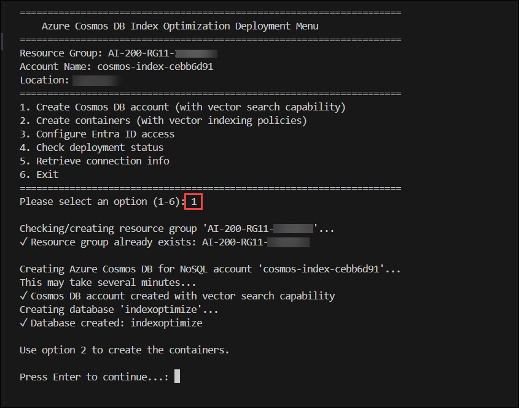

   > **Note:** Deployment can take 5-10 minutes to complete.

   > **IMPORTANT:** Leave the terminal running the deployment open for the duration of the exercise. You can move on to the next section of the exercise while the deployment continues in the terminal.

## Task 3: Complete the index comparison functions

In this task, you'll implement Python functions to perform vector similarity searches, compare the performance of different vector index types, and review how various indexing strategies are configured in Azure Cosmos DB

### Task 3.1: Complete the vector similarity search script

In this section you complete the _index_functions.py_ file by adding the function that performs vector similarity search with performance tracking. This function is called for each container to compare how different index types handle the same query.

1. Open the **client/index_functions.py** file in VS Code.

   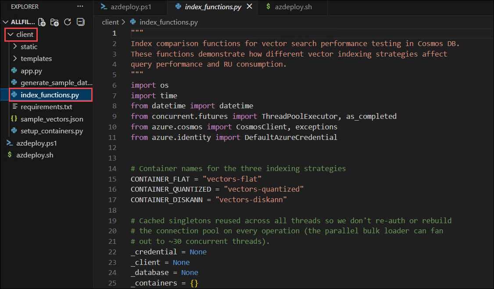

1. Search for the **BEGIN VECTOR SIMILARITY SEARCH FUNCTION** comment and add the following code directly after the comment. This function finds documents similar to the query and tracks performance metrics.

   ```python
   def vector_similarity_search(
       container_name: str,
       query_embedding: list,
       top_n: int = 5
   ) -> dict:
       """
       Find documents most similar to the query using vector distance.

       This function performs a vector similarity search using the VectorDistance
       function and tracks the RU consumption and execution time. Results are
       ordered by distance (lowest = most similar).

       Args:
           container_name: Name of the container to search
           query_embedding: 256-dimensional query vector
           top_n: Number of results to return

       Returns:
           Dictionary containing results, ru_charge, and execution_time_ms
       """
       container = get_container(container_name)

       # Track execution time for performance comparison
       start_time = time.time()

       # The VectorDistance function calculates distance between vectors
       # Using cosine distance: 0 = identical, 2 = opposite
       # Results ordered by distance ascending (most similar first)
       query = """
           SELECT TOP @topN
               c.id,
               c.documentId,
               c.content,
               c.metadata,
               VectorDistance(c.embedding, @queryVector) AS similarityScore
           FROM c
           ORDER BY VectorDistance(c.embedding, @queryVector)
       """

       items = list(container.query_items(
           query=query,
           parameters=[
               {"name": "@topN", "value": top_n},
               {"name": "@queryVector", "value": query_embedding}
           ],
           enable_cross_partition_query=True
       ))

       end_time = time.time()
       execution_time_ms = (end_time - start_time) * 1000

       # Get RU charge from the query - note: this is approximate for multi-page results
       # For accurate RU tracking in production, use Azure Monitor
       ru_charge = 0.0
       try:
           # The last_response_headers contains the RU charge
           ru_charge = float(container.client_connection.last_response_headers.get(
               'x-ms-request-charge', 0
           ))
       except Exception:
           pass  # RU tracking may not be available in all scenarios

       results = [
           {
               "chunk_id": item["id"],
               "document_id": item["documentId"],
               "content": item["content"],
               "metadata": item["metadata"],
               "similarity_score": item["similarityScore"]
           }
           for item in items
       ]

       return {
           "results": results,
           "ru_charge": ru_charge,
           "execution_time_ms": round(execution_time_ms, 2)
       }
   ```

   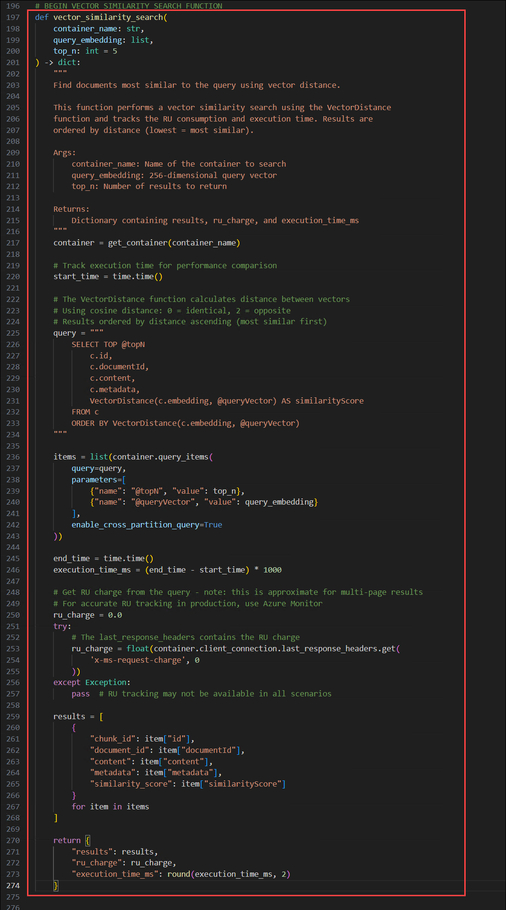

1. Search for the **BEGIN COMPARE INDEX PERFORMANCE FUNCTION** comment and add the following code directly after the comment. This function runs the same query against all three containers and returns comparative results.

   ```python
   def compare_index_performance(
       query_embedding: list,
       top_n: int = 5
   ) -> dict:
       """
       Run the same vector search query against all three containers and compare performance.

       This function executes identical vector similarity searches against containers
       with different indexing strategies (flat, quantizedFlat, diskANN) to demonstrate
       the performance characteristics of each approach.

       Args:
           query_embedding: 256-dimensional query vector
           top_n: Number of results to return from each container

       Returns:
           Dictionary with results from each container including RU costs and timing
       """
       comparison = {}

       # Test each container with the same query
       for index_type, container_name in [
           ("flat", CONTAINER_FLAT),
           ("quantizedFlat", CONTAINER_QUANTIZED),
           ("diskANN", CONTAINER_DISKANN)
       ]:
           try:
               result = vector_similarity_search(container_name, query_embedding, top_n)
               comparison[index_type] = {
                   "container": container_name,
                   "results": result["results"],
                   "ru_charge": result["ru_charge"],
                   "execution_time_ms": result["execution_time_ms"],
                   "result_count": len(result["results"]),
                   "status": "success"
               }
           except Exception as e:
               comparison[index_type] = {
                   "container": container_name,
                   "results": [],
                   "ru_charge": 0,
                   "execution_time_ms": 0,
                   "result_count": 0,
                   "status": "error",
                   "error": str(e)
               }

       return comparison
   ```

   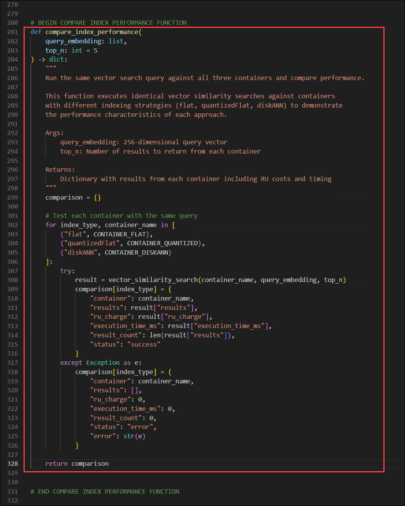

1. Save your changes to the **index_functions.py** file using **Ctrl + S**.

1. Take a few minutes to review all of the code in the script.

### Task 3.2: Review the container setup code

In this section you review the _setup_containers.py_ script that creates containers with different vector indexing strategies. The vector embedding policy (path, dimensions, data type, and distance function) is set at container creation time and cannot be changed afterward. The vector index type, however, is part of the indexing policy and can be updated on an existing container. When you change the index type, Cosmos DB performs an index transformation in the background. Despite this flexibility, testing different index types upfront is still a best practice: a common approach is to create test containers with each index type, load representative sample data, and run benchmark queries to measure RU costs and latency before committing to a production configuration.

1. Open the **client/setup_containers.py** file in VS Code.

   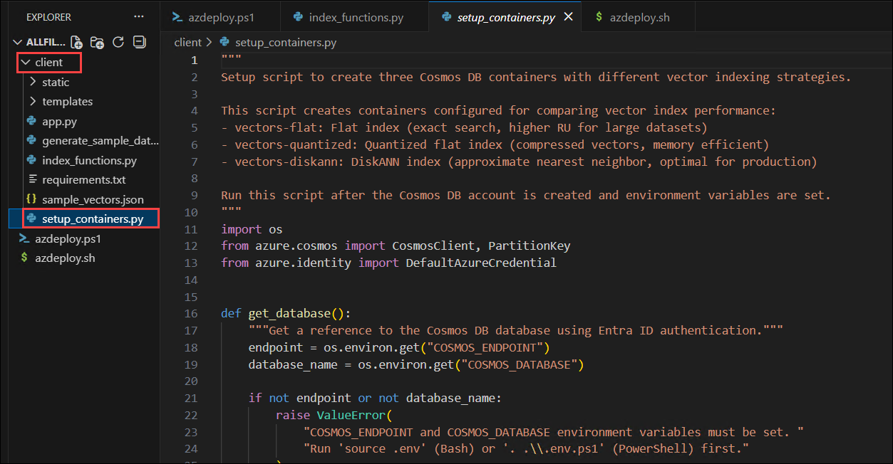

1. Search for the **BEGIN CREATE FLAT CONTAINER FUNCTION** comment and review the code. Notice how the flat index is configured:

   ```python
   # Flat index: exact search, compares query against all vectors
   # Higher RU cost for large datasets but guaranteed best results
   indexing_policy = {
       "indexingMode": "consistent",
       "automatic": True,
       "includedPaths": [
           {"path": "/*"}
       ],
       "excludedPaths": [
           {"path": "/embedding/*"}
       ],
       "vectorIndexes": [
           {
               "path": "/embedding",
               "type": "flat"
           }
       ]
   }
   ```

1. Search for the **BEGIN CREATE QUANTIZED CONTAINER FUNCTION** comment and review the quantizedFlat configuration:

   ```python
   # QuantizedFlat index: compressed vectors for memory efficiency
   # Lower memory footprint with slight accuracy trade-off
   indexing_policy = {
       ...
       "vectorIndexes": [
           {
               "path": "/embedding",
               "type": "quantizedFlat"
           }
       ]
   }
   ```

1. Search for the **BEGIN CREATE DISKANN CONTAINER FUNCTION** comment and review the diskANN configuration:

   ```python
   # DiskANN index: approximate nearest neighbor with graph-based search
   # Best performance for large datasets, slight accuracy trade-off
   indexing_policy = {
       ...
       "vectorIndexes": [
           {
               "path": "/embedding",
               "type": "diskANN"
           }
       ]
   }
   ```

1. Take a moment to understand the key differences between index types:

   | Index Type        | Search Method            | Best For                           | Trade-offs                    |
   | ----------------- | ------------------------ | ---------------------------------- | ----------------------------- |
   | **flat**          | Exact nearest neighbor   | Small datasets, highest accuracy   | Higher RU for large datasets  |
   | **quantizedFlat** | Compressed exact search  | Medium datasets, memory efficiency | Slight accuracy loss          |
   | **diskANN**       | Approximate graph search | Large datasets, production         | ~95% recall, best performance |

Next, you finalize the Azure resource deployment.

## Task 4: Complete the Azure resource deployment

In this task, you'll finalize the Azure resource deployment by creating vector-enabled containers with different indexing strategies, configuring Microsoft Entra ID access, verifying the deployment status, retrieving the connection information, and loading the required environment variables.

1. When the **Create Cosmos DB account** operation has completed, enter **2** to launch the **Create containers** option. This creates three containers with different vector indexing strategies: flat, quantizedFlat, and diskANN.

   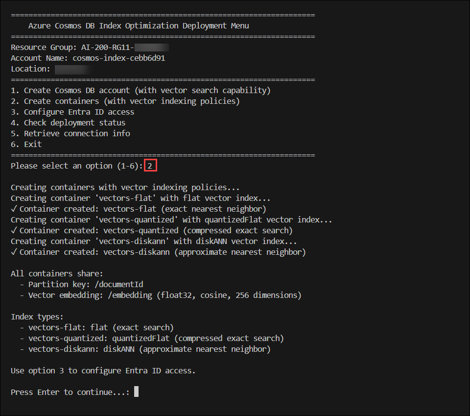

1. Enter **3** to launch the **Configure Entra ID access** option. This assigns your user account the necessary role to access the Cosmos DB data plane.

   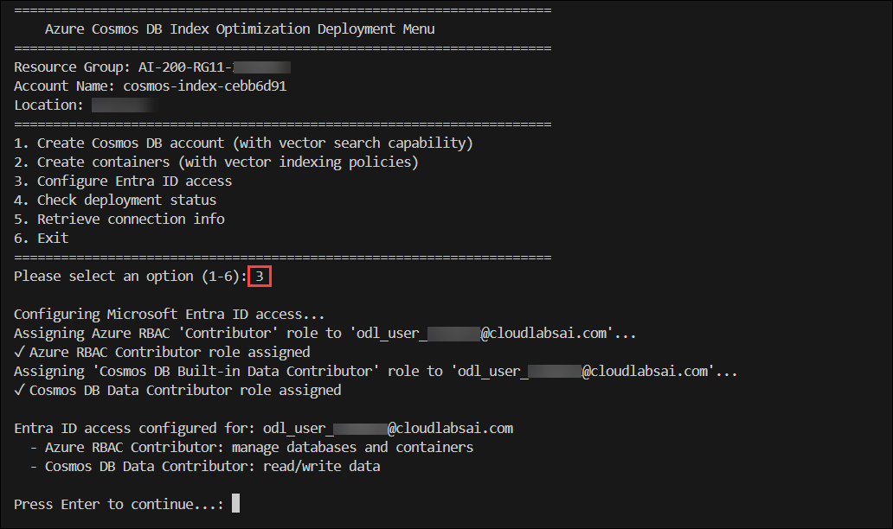

1. Enter **4** to launch the **Check deployment status** option. Verify the Cosmos DB account shows as ready with the vector search capability enabled.

   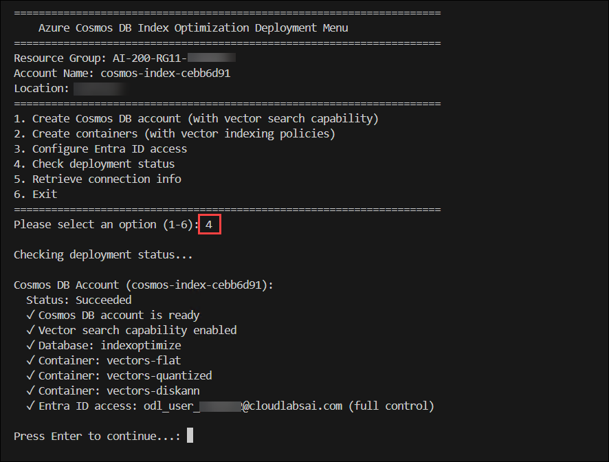

1. Enter **5** to launch the **Retrieve connection info** option. This creates a file with the necessary environment variables.

   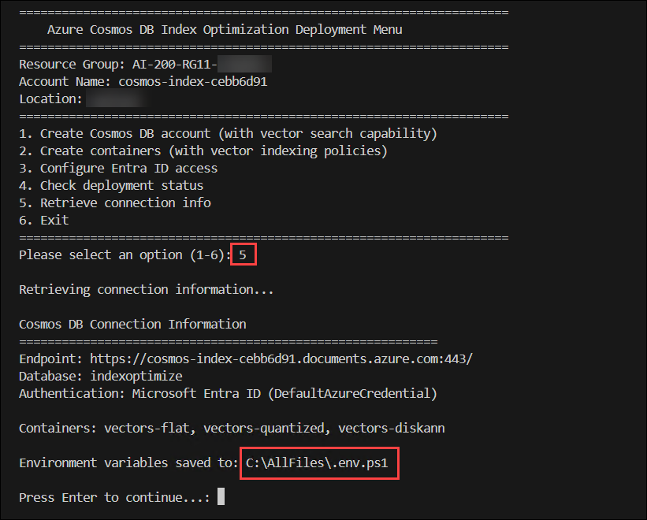

1. Enter **6** to exit the deployment script.

1. Run the following command to load the environment variables into your terminal session from the file created in a previous step.

   **Bash**

   ```bash
   source .env
   ```

   **PowerShell**

   ```powershell
   . .\.env.ps1
   ```

   > **Note:** Keep the terminal open. If you close it and create a new terminal, you might need to run the command to create the environment variable again.

Next, you set up the Python environment and run the application.

## Task 5: Set up the Python environment

In this task, you'll create a Python virtual environment, activate it, and install the dependencies required to run the vector index comparison application

1. Run the following command to navigate to the _client_ directory.

   ```
   cd client
   ```

1. Run the following command to create a virtual environment for the Python scripts. Depending on your environment the command might be **python** or **python3**.

   ```
   python -m venv .venv
   ```

1. Run the following command to activate the Python environment.

   **Bash**

   ```bash
   source .venv/Scripts/activate
   ```

   **PowerShell**

   ```powershell
   .\.venv\Scripts\Activate.ps1
   ```

1. Run the following command to install the Python dependencies. This installs the **flask**, **azure-cosmos**, and **azure-identity** libraries.

   ```bash
   pip install -r requirements.txt
   ```

Next, you test the vector index performance using the Flask application.

## Task 6: Test vector index performance with the Flask app

In this task, you'll run the Flask application to compare the performance of different vector indexing strategies by loading sample data, executing vector similarity searches, measuring Request Unit (RU) consumption and query execution time, and analyzing the trade-offs between flat, quantizedFlat, and diskANN indexes.

1. Ensure you are still in the **client** directory with the virtual environment activated. You should see **(.venv)** in your terminal prompt.

1. Run the following command to start the Flask application.

   ```bash
   python app.py
   ```

1. Open a browser and navigate to `http://127.0.0.1:5000` to view the application.

   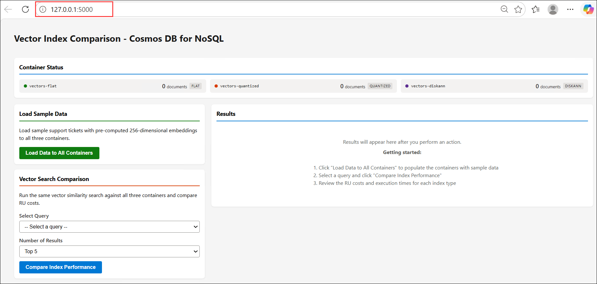

### Task 6.1: Load sample data

In this section you use the app to load sample support tickets with pre-computed embeddings into all three containers. Loading identical data enables fair comparison of index performance.

1. Review the **Container Status** section at the top of the page. All three containers should show 0 documents initially.

   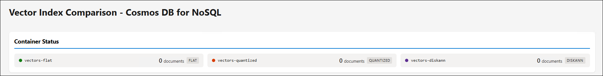

1. In the **Load Sample Data** section, select **Load Data to All Containers**. This inserts 500 support tickets with their pre-computed embeddings from the **sample_vectors.json** file into each container. The upload uses parallel processing to load data efficiently and typically completes in 30-45 seconds.

   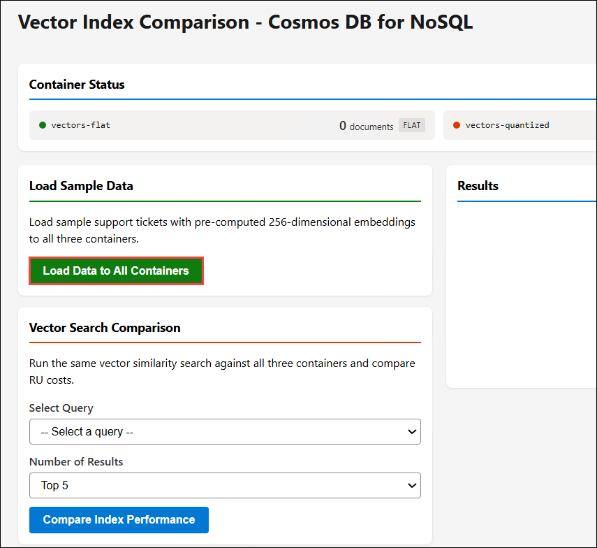

1. Verify the success message appears showing the number of documents loaded and the RU costs for each container. Notice how write RU costs may vary slightly between index types.

   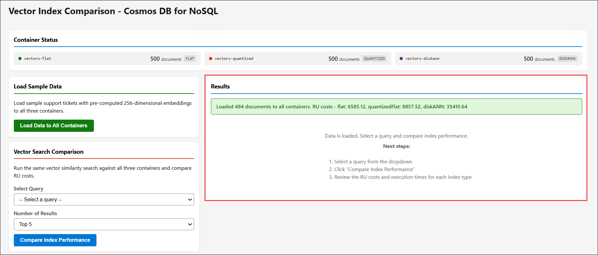

### Task 6.2: Compare vector search performance

In this section you perform vector similarity searches and compare how each index type handles the same query. The app displays RU costs and execution times side-by-side.

1. In the **Vector Search Comparison** section, select **I can't login to my account (1)** from the **Select Query** dropdown.

1. Keep the default **Top 5** results and select **Compare Index Performance (2)**.

   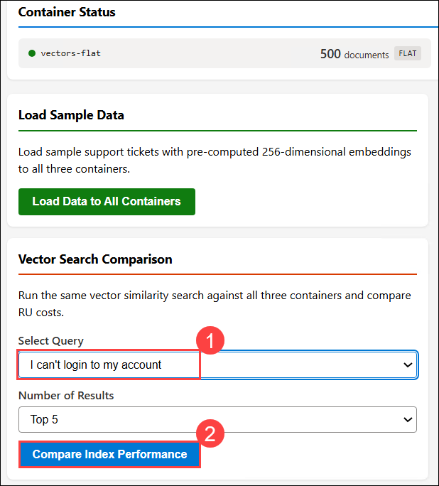

1. Review the **Index Performance Comparison** table showing:
   - **Results** count for each container
   - **RU Cost** for each query
   - **Time (ms)** execution duration

     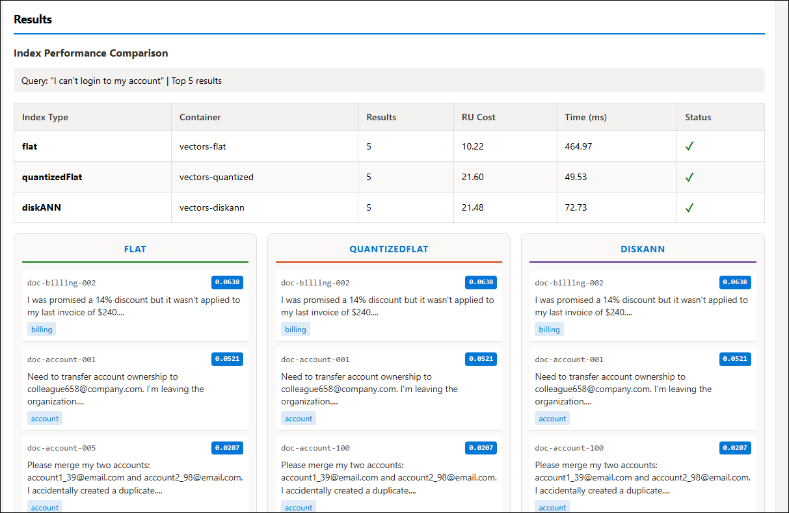

1. Scroll down to see the side-by-side results of the data returned from each container. Notice:
   - All three indexes should return similar results for this small dataset
   - RU costs may vary based on index type
   - The diskANN index typically shows lower RU consumption at scale

1. Try different queries like **My payment was charged twice** or **Package hasn't arrived yet** to see consistent patterns across searches.

### Task 6.3: Compare filtered search performance

In this section you combine metadata filtering with vector similarity search. Filtering narrows the search space before applying vector ranking, which can affect performance differently for each index type.

1. In the **Filtered Vector Search Comparison** section, select **Protect my account from hackers (1)** from the **Select Query** dropdown.

1. Select **account (2)** from the **Filter by Category** dropdown.

1. Select **Compare Filtered Search (3)** to execute the filtered search across all containers.

   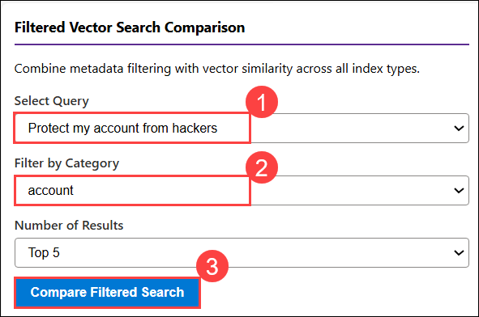

1. Review the results. Notice:
   - Only documents with the **account** category are returned
   - The combination of filtering and vector search may show different RU patterns
   - All index types apply the filter before vector ranking

     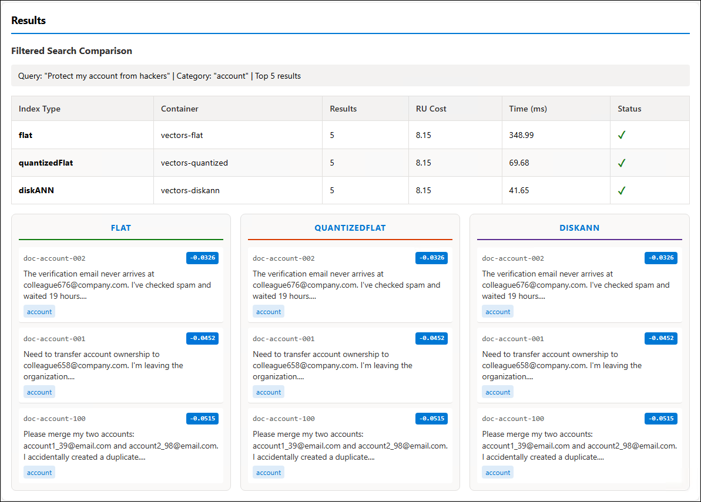

1. Try the same query with **technical** category to see different filtered results.

### Task 6.4: Analyze the results

Based on your testing, consider these guidelines for selecting an index type:

| Scenario                           | Recommended Index | Reason                            |
| ---------------------------------- | ----------------- | --------------------------------- |
| Small dataset (< 10K vectors)      | flat              | Exact results, acceptable RU cost |
| Medium dataset, memory constrained | quantizedFlat     | Reduced memory with good accuracy |
| Large dataset, production workload | diskANN           | Best RU efficiency, ~95% recall   |

1. Return to the terminal and press **Ctrl+C** to stop the Flask application.

## Summary

In this lab, you compared vector indexing strategies in Azure Cosmos DB for NoSQL. You deployed an Azure Cosmos DB account with the **EnableNoSQLVectorSearch** capability and configured Entra ID authentication. You created three containers using the Python SDK with different vector index types: flat for exact search, quantizedFlat for memory efficiency, and diskANN for production-scale approximate search. You built Python functions that perform vector similarity searches while tracking RU consumption and execution time. You used a Flask web application to run comparative searches and analyze performance differences. This pattern helps you select the optimal indexing strategy for your AI application based on dataset size, accuracy requirements, and cost constraints.

## You have successfully completed the Hands-on Lab!
