# Instrument an app with OpenTelemetry

OpenTelemetry is an open-source observability framework that provides a standardized way to collect traces, metrics, and logs from applications. The Azure Monitor OpenTelemetry Distro packages the OpenTelemetry SDK with the Azure Monitor exporter so Python applications can send telemetry to Application Insights with minimal configuration. Custom spans let you trace application-specific operations and add attributes that enrich trace data with business context.

In this exercise, you deploy an Application Insights resource and build a Python Flask web application that demonstrates OpenTelemetry instrumentation for a document processing pipeline. You configure the Azure Monitor OpenTelemetry Distro, create custom parent and child spans for each pipeline stage, add span attributes to capture document metadata, and use Transaction search and log queries in the Azure portal to verify your telemetry and diagnose a simulated latency bottleneck.

Tasks performed in this exercise:

- Download the project starter files
- Create an Application Insights resource
- Add code to the starter files to complete the app
- Run the app and diagnose a performance issue in Application Insights

This exercise takes approximately **25** minutes to complete.

## Before you start

To complete the exercise, you need:

- An Azure subscription. If you don't already have one, you can [sign up for one](https://azure.microsoft.com/).
- [Visual Studio Code](https://code.visualstudio.com/) on one of the [supported platforms](https://code.visualstudio.com/docs/supporting/requirements#_platforms).
- [Python 3.12](https://www.python.org/downloads/) or greater.
- The latest version of the [Azure CLI](https://learn.microsoft.com/cli/azure/install-azure-cli).

## Download project starter files and deploy Application Insights

1. Launch **Visual Studio Code** (VS Code) from desktop.

   

1. Select **File Explorer (1)** from left panel. Click **Open Folder** in the menu.

   

1. Navigate to **C:\AllFiles (1)** folder containing the project files and click on **Select folder (2)**.

   

1. If you get "Do you trust the authors of the files in this folder?" prompt, click **Yes, I trust the authors**.

   

1. The project contains deployment scripts for both Bash (_azdeploy.sh_) and PowerShell (_azdeploy.ps1_). Open the appropriate file for your environment and change the two values: **Resource group name** as **<inject key="ResourceGroupName" enableCopy="false"/>** and **Azure Region** as **<inject key="Region" enableCopy="false"/>** at the top of the script to meet your needs.

   > **Note:** Do not change anything else in the script.

   ```
   "<your-resource-group-name>" # Resource Group name
   "<your-azure-region>" # Azure region for the resources
   ```

   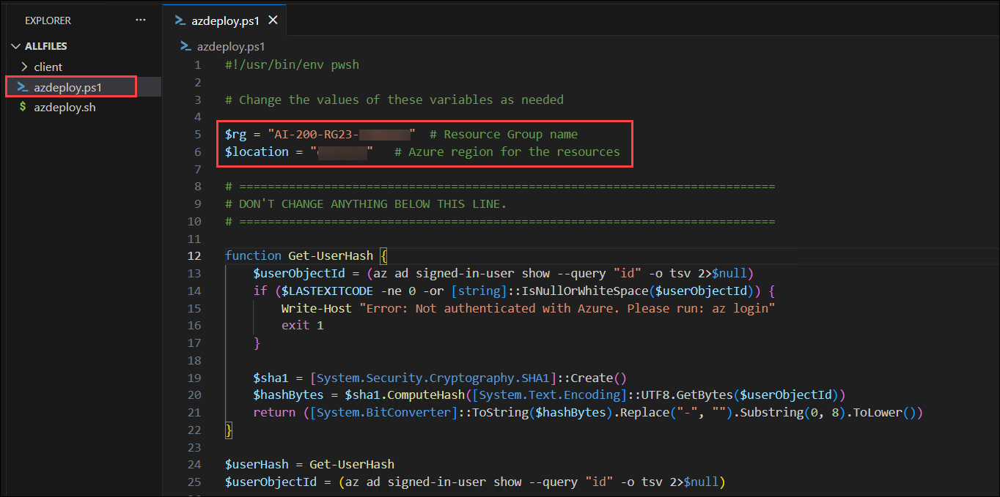

   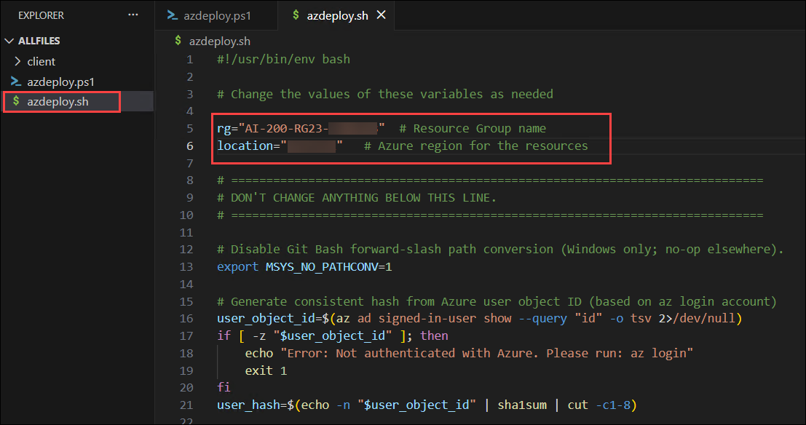

1. In the menu bar, select **File (1)** and select **Save All (2)** from drop-down.

   

1. In the menu bar, select **ellipsis (...) (1)**, then **Terminal (2)**, and then **New Terminal (3)** to open a terminal window in VS Code.

   

   > **NOTE:** If you are using Bash, after the terminal opens, click on the **+ (1)** icon to open a new terminal and select **Git Bash (2)** from the drop-down. If you are using PowerShell, skip this step.
   >
   > 

1. Run the following command in the terminal to allow PowerShell scripts to run. This command is only required if you are using PowerShell. If you are using Bash, skip this step.

   ```
   Set-ExecutionPolicy -ExecutionPolicy bypass -Force
   ```

   

1. Run the **following command (1)** to login to your Azure account. Next, **minimize the VS Code window (2)** to view the login window opened in background.

   ```
   az login
   ```

   

1. In the login window, select **Work or school account (1)** and click **Continue (2)**.

   

1. In the login window, kindly sign in using the provided **Azure credentials (1)** and click **Next (2)**.
   - **Email/Username:** <inject key="AzureAdUserEmail"></inject>

     

1. Next, enter the provided **Password (1)** and click **Sign in (2)**.
   - **Password:** <inject key="AzureAdUserPassword"></inject>

     

1. Next, select **No, this app only** and navigate back to VS Code to continue.

   

1. Answer the prompts to select your Azure account and subscription for the exercise.

   

   > **NOTE:** To confirm you're logged in to the correct Azure subscription, run **az account show**.

1. Run the following command to add the Application Insights CLI extension. This extension provides the commands the deployment script uses to create and manage the Application Insights resource.

   ```
   az extension add --name application-insights
   ```

   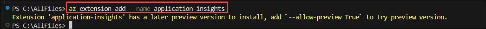

1. Run the appropriate command in the terminal to launch the script.

   **Bash**

   ```bash
   MSYS_NO_PATHCONV=1 bash azdeploy.sh
   ```

   **PowerShell**

   ```powershell
   ./azdeploy.ps1
   ```

   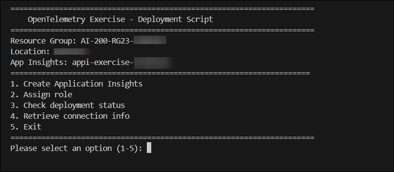

1. When the script is running, enter **1** to launch the **1. Create Application Insights** option.

   This option creates the resource group if it doesn't already exist and creates an Application Insights resource.

   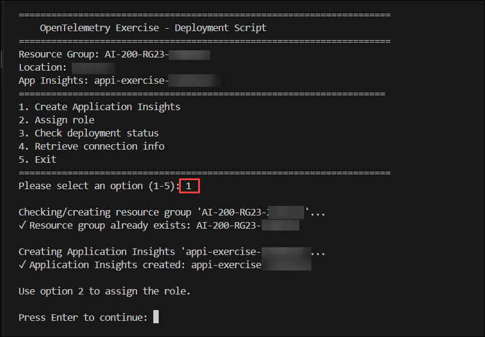

1. Enter **2** to run the **2. Assign role** option. This assigns the Monitoring Metrics Publisher role to your account so the app can publish telemetry to Application Insights using Microsoft Entra authentication.

   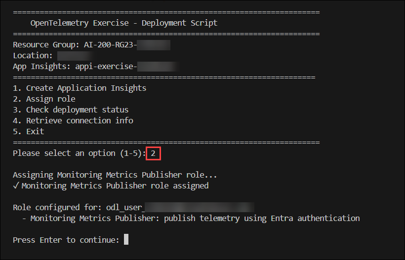

1. Enter **3** to run the **3. Check deployment status** option. Verify the Application Insights resource shows **Succeeded** and the role is assigned before continuing. If the resource is still provisioning, wait a moment and try again.

   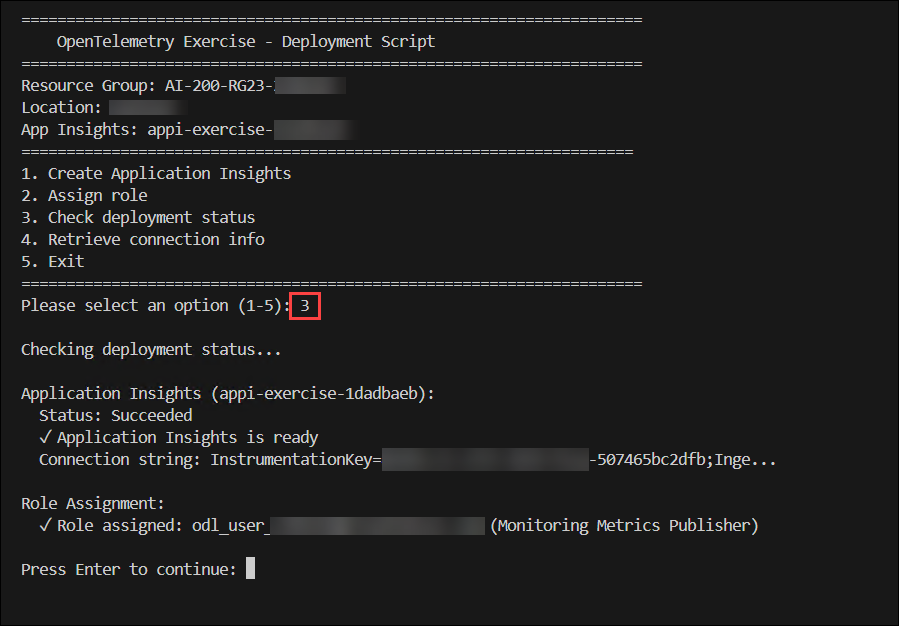

1. Enter **4** to run the **4. Retrieve connection info** option. This creates the environment variable file with the Application Insights connection string and the **OTEL_SERVICE_NAME** variable needed by the app.

   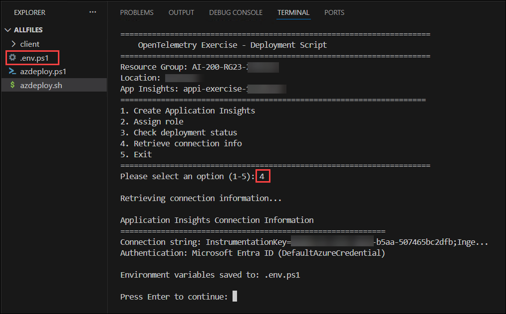

   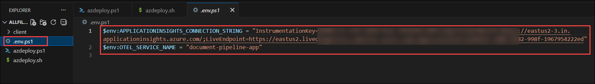

1. Enter **5** to exit the deployment script.

1. Run the appropriate command to load the environment variables into your terminal session from the file created in a previous step.

   **Bash**

   ```bash
   source .env
   ```

   **PowerShell**

   ```powershell
   . .\.env.ps1
   ```

   > **Note:** Keep the terminal open. If you close it and create a new terminal, you need to run this command again to reload the environment variables.

## Task 2: Complete the app

In this section you add code to the _telemetry_functions.py_ file to complete the OpenTelemetry instrumentation functions. The Flask app in _app.py_ calls these functions and displays the results in the browser. You run the app later in the exercise.

1. Open the **client/telemetry_functions.py** file to begin adding code.

   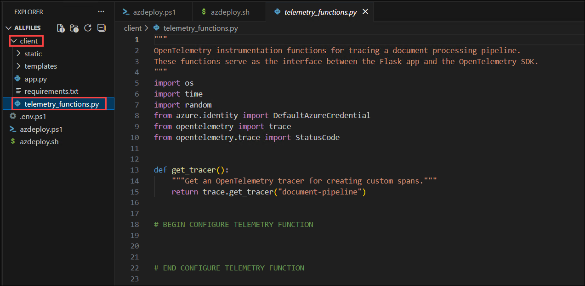

   > **Note:** The code blocks you add to the application should align with the comment for that section of the code.

### Task 2.1: Add code to configure telemetry

In this section you add code to configure the Azure Monitor OpenTelemetry Distro so the application exports traces to Application Insights. The function reads the connection string from an environment variable, creates a **DefaultAzureCredential** for Microsoft Entra authentication, and configures the Azure Monitor exporter. The credential excludes the managed identity provider because the app runs locally — without this setting, the credential chain would attempt to reach the Azure Instance Metadata Service on every telemetry export, and those failed HTTP calls would appear as noise in the Application Map.

The function calls **configure_azure_monitor()** from the Azure Monitor OpenTelemetry Distro package. This single call configures the OpenTelemetry SDK with the Azure Monitor trace exporter and sets up automatic instrumentation for Flask requests. The **credential** parameter enables Entra-based authentication so the app publishes telemetry using the Monitoring Metrics Publisher role instead of the instrumentation key. The **OTEL_SERVICE_NAME** environment variable, set in the _.env_ file by the deployment script, controls the **cloud.role.name** that appears on the Application Map.

1. Locate the **# BEGIN CONFIGURE TELEMETRY FUNCTION** comment and add the following code under the comment. Be sure to check for proper code alignment.

   ```python
   def configure_telemetry():
       """Configure the Azure Monitor OpenTelemetry Distro."""
       connection_string = os.environ.get("APPLICATIONINSIGHTS_CONNECTION_STRING")

       if not connection_string:
           raise ValueError(
               "APPLICATIONINSIGHTS_CONNECTION_STRING environment variable must be set"
           )

       from azure.monitor.opentelemetry import configure_azure_monitor

       credential = DefaultAzureCredential(
           exclude_managed_identity_credential=True
       )

       configure_azure_monitor(
           connection_string=connection_string,
           credential=credential,
       )
   ```

   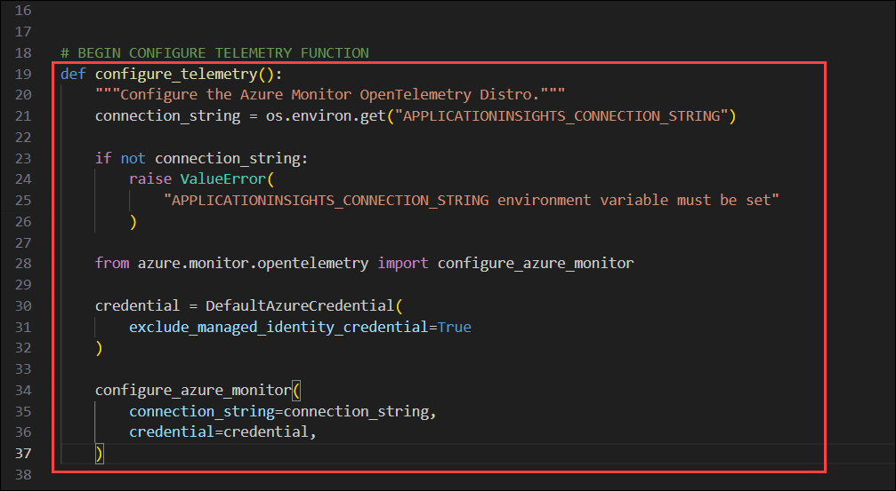

1. Take a few minutes to review the code.

### Task 2.2: Add code to process documents

In this section you add code that creates a parent span for a batch document processing operation. The function loops through a configurable number of documents and calls three child span functions for each one: validate, enrich, and store.

The function uses **start_as_current_span()** to create a parent span named "process-documents" that wraps the entire batch. Each child function creates its own span that automatically becomes a child of the current span, building a hierarchical trace tree. The span attributes record the batch size and the number of successfully processed documents.

1. Locate the **# BEGIN PROCESS DOCUMENTS FUNCTION** comment and add the following code under the comment. Be sure to check for proper code alignment.

   ```python
   def process_documents(doc_count):
       """Process a batch of documents through the pipeline with tracing."""
       tracer = get_tracer()
       results = []

       with tracer.start_as_current_span("process-documents") as parent_span:
           parent_span.set_attribute("document.count", doc_count)
           parent_span.set_attribute("pipeline.name", "document-processing")

           for i in range(1, doc_count + 1):
               doc_id = f"DOC-{i:04d}"

               validate_result = validate_document(doc_id)
               enrich_result = enrich_document(doc_id)
               store_result = store_document(doc_id)

               results.append({
                   "doc_id": doc_id,
                   "validate": validate_result,
                   "enrich": enrich_result,
                   "store": store_result
               })

           parent_span.set_attribute("document.processed", len(results))

       return results
   ```

   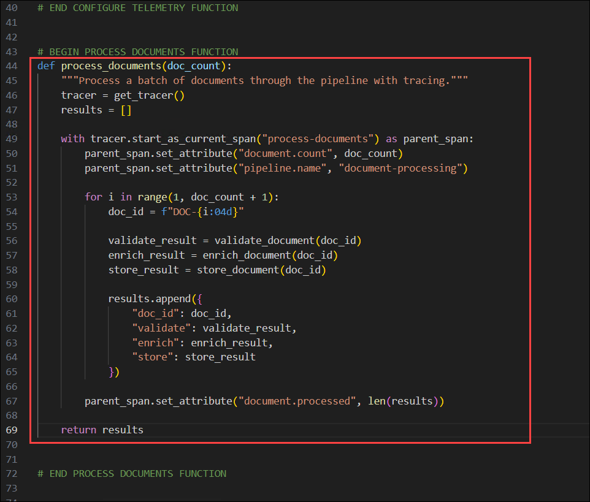

1. Save your changes and take a few minutes to review the code.

### Task 2.3: Add code to trace pipeline stages

In this section you add three functions that each create a child span for one stage of the document pipeline: validate, enrich, and store. All three follow the same pattern — call **start_as_current_span()** to create a span that automatically becomes a child of the active parent, then call **set_attribute()** to attach searchable metadata and **set_status()** to mark the result.

The **enrich_document** function also includes a deliberate latency issue. Documents **DOC-0003** and **DOC-0005** experience a delay of 1.5 to 3 seconds, simulating an external service bottleneck. The **enrichment.slow** attribute flags affected spans so you can filter for them in Application Insights. When you examine the end-to-end transaction view later, these spans will stand out as the source of pipeline latency.

1. Locate the **# BEGIN PIPELINE STAGE FUNCTIONS** comment and add the following code under the comment. Be sure to check for proper code alignment.

   ```python
   def validate_document(doc_id):
       """Validate a document and record a traced span."""
       tracer = get_tracer()

       with tracer.start_as_current_span("validate-document") as span:
           span.set_attribute("document.id", doc_id)
           span.set_attribute("document.stage", "validate")

           # Simulate validation work
           time.sleep(random.uniform(0.05, 0.15))
           is_valid = True

           span.set_attribute("document.valid", is_valid)
           span.set_status(StatusCode.OK)

       return {"status": "valid", "duration_ms": round(random.uniform(50, 150))}


   def enrich_document(doc_id):
       """Enrich a document with metadata and record a traced span."""
       tracer = get_tracer()

       with tracer.start_as_current_span("enrich-document") as span:
           span.set_attribute("document.id", doc_id)
           span.set_attribute("document.stage", "enrich")

           # Simulated latency issue: documents DOC-0003 and DOC-0005
           # experience high latency during enrichment, representing
           # a bottleneck for the student to diagnose in Application Insights
           if doc_id in ("DOC-0003", "DOC-0005"):
               delay = random.uniform(1.5, 3.0)
               span.set_attribute("enrichment.slow", True)
           else:
               delay = random.uniform(0.05, 0.2)
               span.set_attribute("enrichment.slow", False)

           time.sleep(delay)
           span.set_attribute("enrichment.duration_s", round(delay, 3))
           span.set_status(StatusCode.OK)

       return {
           "status": "enriched",
           "duration_ms": round(delay * 1000),
           "slow": doc_id in ("DOC-0003", "DOC-0005")
       }


   def store_document(doc_id):
       """Store a document and record a traced span."""
       tracer = get_tracer()

       with tracer.start_as_current_span("store-document") as span:
           span.set_attribute("document.id", doc_id)
           span.set_attribute("document.stage", "store")
           span.set_attribute("storage.type", "blob")

           # Simulate storage write
           time.sleep(random.uniform(0.05, 0.2))

           span.set_status(StatusCode.OK)

       return {"status": "stored", "duration_ms": round(random.uniform(50, 200))}
   ```

   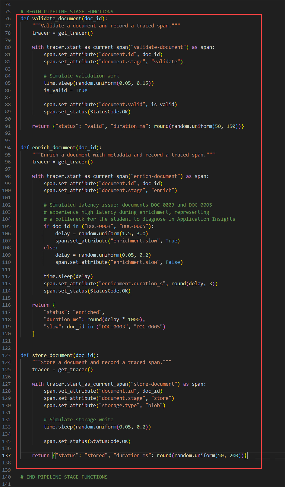

1. Save your changes and take a few minutes to review the code.

## Task 3: Configure the Python environment

In this section you navigate to the client app directory, create the Python environment, and install the dependencies.

1. Run the following command in the VS Code terminal to navigate to the _client_ directory.

   ```
   cd client
   ```

1. Run the following command to create the Python environment.

   ```
   python -m venv .venv
   ```

1. Run the following command to activate the Python environment.

   **Bash**

   ```bash
   source .venv/Scripts/activate*
   ```

   **PowerShell**

   ```powershell
   .\.venv\Scripts\Activate.ps1
   ```

1. Run the following command in the VS Code terminal to install the dependencies.

   ```
   pip install -r requirements.txt
   ```

## Task 4: Run the app

In this section you run the completed Flask application to generate telemetry, then use Transaction search and log queries in the Azure portal to verify the spans and diagnose a simulated performance bottleneck.

1. Run the following command in the terminal to start the app. Refer to the commands from earlier in the exercise to activate the environment, if needed, before running the command. If you navigated away from the **client** directory, run **cd client** first.

   ```
   python app.py
   ```

   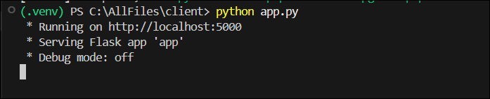

1. Open a browser and navigate to `http://localhost:5000` to access the app.

   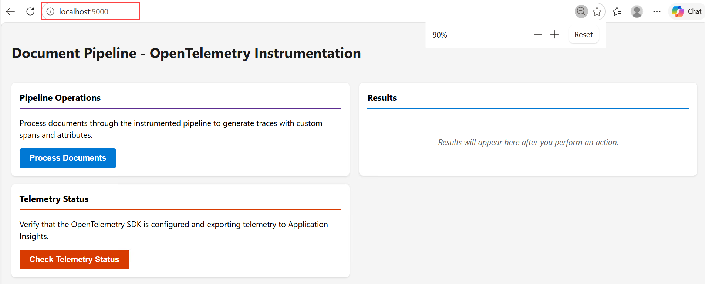

1. Select **Check Telemetry Status** in the left panel. Verify that the telemetry status shows **active** and the resource attributes include **service.name** with the value **document-pipeline-app**. This confirms the Azure Monitor OpenTelemetry Distro is configured and exporting telemetry.

   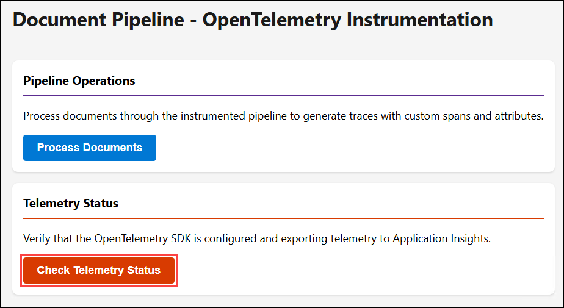

   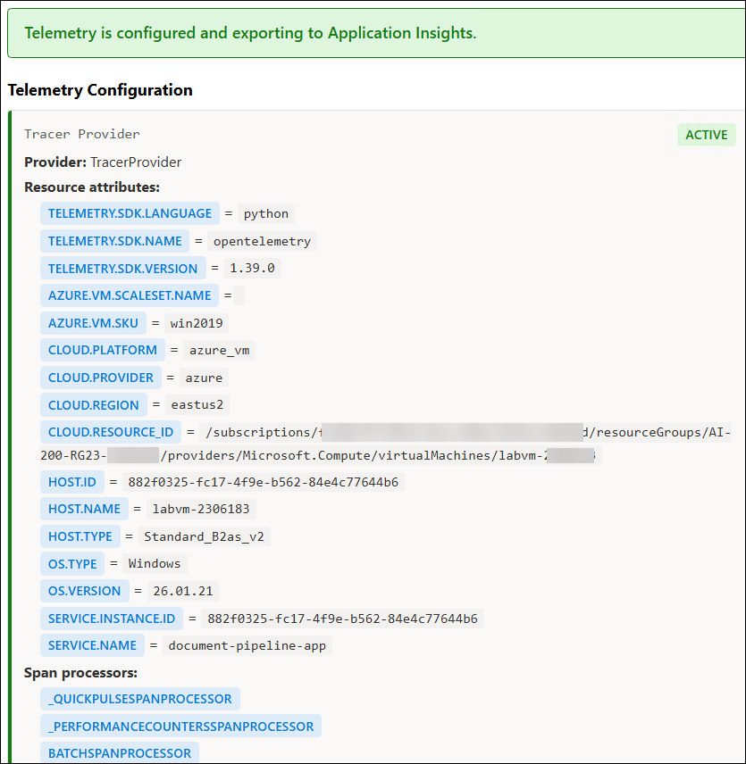

1. Select **Process Documents** in the left panel. This processes five documents through the pipeline and displays the results in a table. Notice that documents **DOC-0003** and **DOC-0005** show significantly higher enrichment durations and a **SLOW** tag, while the other documents complete quickly.

   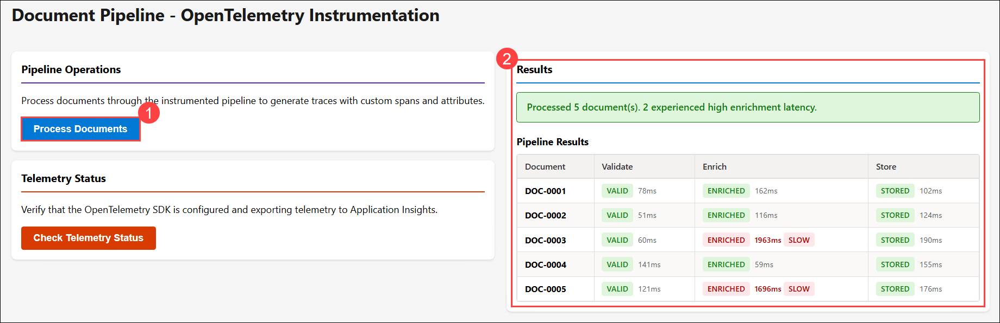

1. Select **Process Documents** two more times to generate additional telemetry data. Each run creates new traces with parent and child spans.

1. Wait two to three minutes for the telemetry to arrive in Application Insights. Telemetry is batched and sent periodically, so there is a short delay before data appears in the portal.

1. Navigate to the [Azure portal](https://portal.azure.com) and search **Application Insights (1)** resource and select **Application Insights (2)** from the results.

   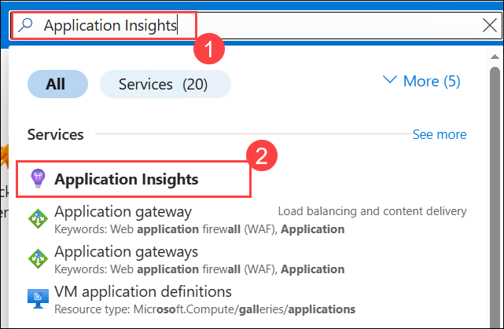

1. Select the **Application Insights** resource you created earlier.

   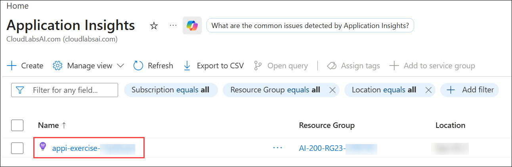

### Task 4.1: View the end-to-end transaction

1. In the Application Insights resource, select **Search** in the left navigation under **Investigate**. This view lists all incoming requests and their related telemetry.

   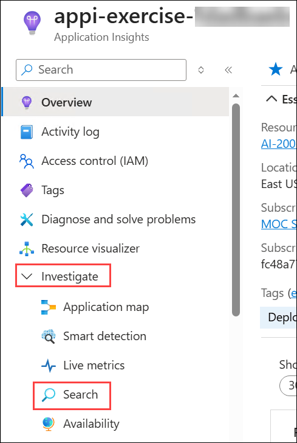

1. In the results list, locate one of the **POST /process-documents** entries and select it. The end-to-end transaction view opens, displaying the full span hierarchy: the root HTTP request span, the "process-documents" parent span, and the child spans for each pipeline stage (validate, enrich, store).

   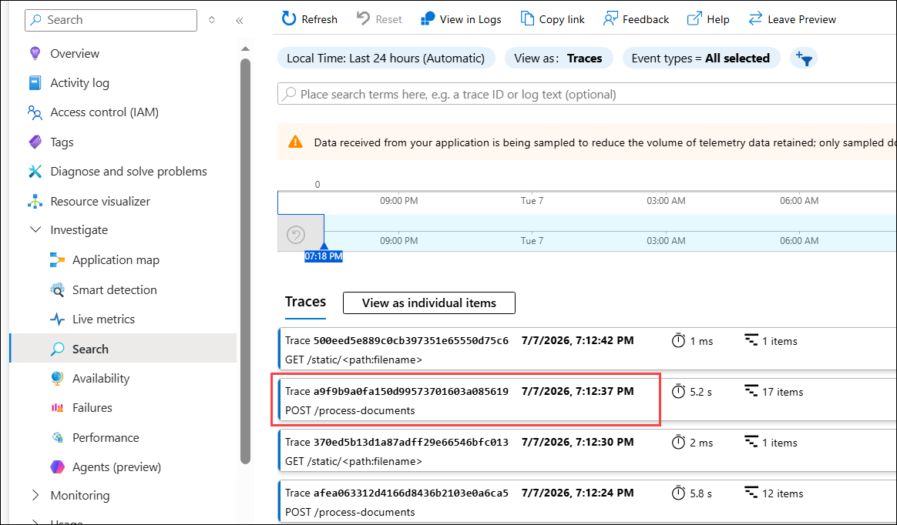

   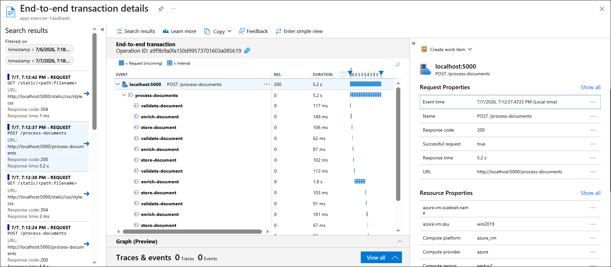

1. In the transaction timeline, identify the "enrich-document" spans with durations of 1.5 seconds or more. These are the spans for documents **DOC-0003** and **DOC-0005** that exhibit the simulated latency. Select one of these spans to view its attributes, including **document.id**, **document.stage**, and **enrichment.slow = True**.

   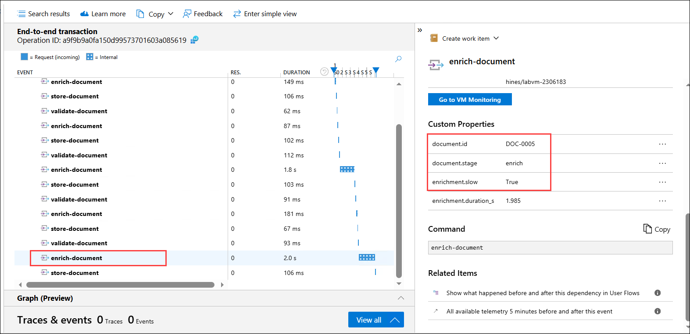

### Task 4.2: Query the telemetry with KQL

1. Close **End-to-end transaction details** windows by selecting **X**.

   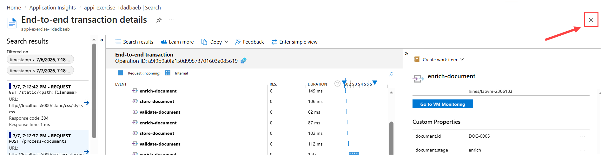

1. In the Application Insights resource, select **Logs** in the left navigation under **Monitoring**. Close any query template/query hub dialog that appears.

   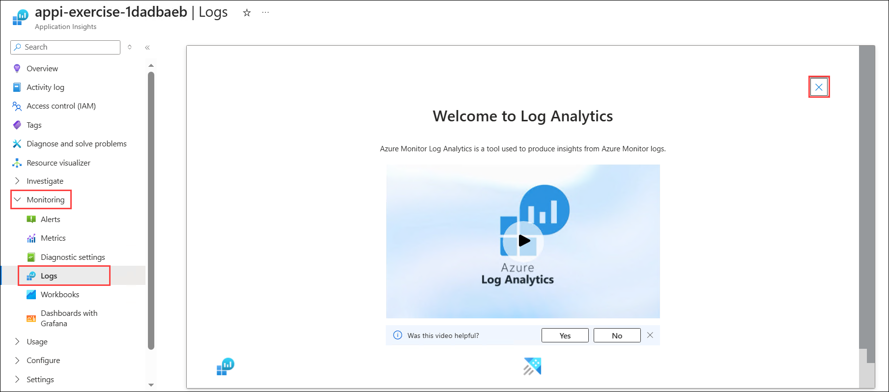

   > **Note:** Be sure to select **KQL mode** in the drop-down selector in the query bar.

   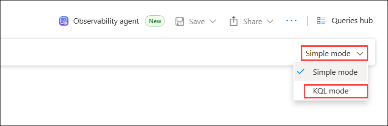

1. Copy and paste the following query **(1)** into the query editor and select **Run (2)**. This query retrieves the custom spans your code created, along with the span attributes you set.

   ```kusto
   dependencies
   | where timestamp > ago(1h)
   | project timestamp, name, duration,
       documentId = customDimensions["document.id"],
       stage = customDimensions["document.stage"],
       slow = customDimensions["enrichment.slow"]
   | order by timestamp desc
   ```

   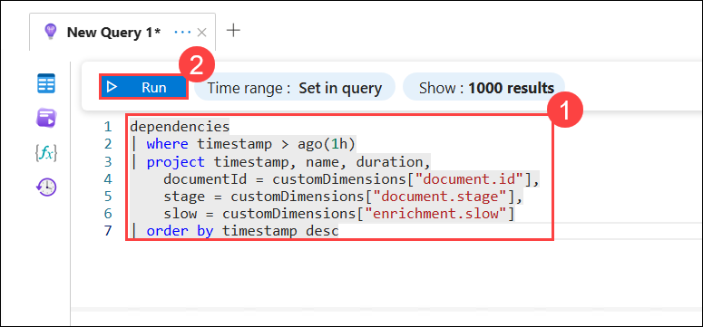

1. Review the results. You should see rows for each pipeline stage — validate-document, enrich-document, and store-document — with the **documentId** and **stage** attributes you added in the code. The **slow** column shows **True** for DOC-0003 and DOC-0005 rows.

   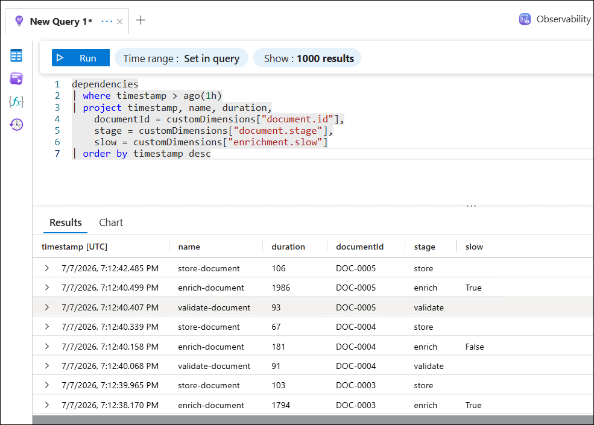

1. Copy and paste the following query **(1)** and **Run (2)** to compare the average duration of slow versus fast enrichment spans.

   ```kusto
   dependencies
   | where timestamp > ago(1h) and name == "enrich-document"
   | extend slow = tostring(customDimensions["enrichment.slow"])
   | summarize avgDuration = round(avg(duration), 0) by slow
   ```

   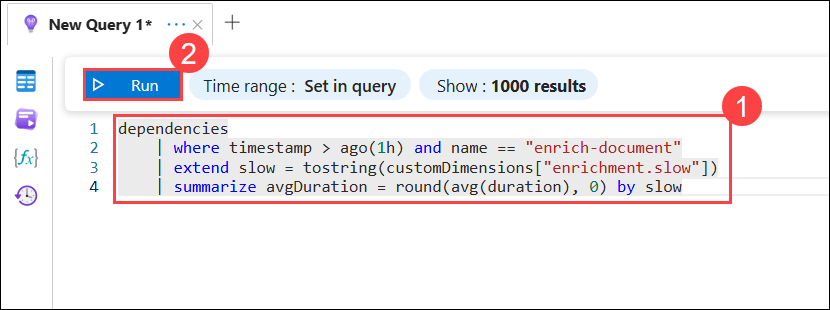

1. Review the results. The **True** row shows an average duration of 1,500 milliseconds or more, while the **False** row shows an average of under 200 milliseconds. This confirms that the enrichment stage is the bottleneck and that the span attributes clearly identify which documents are affected.

   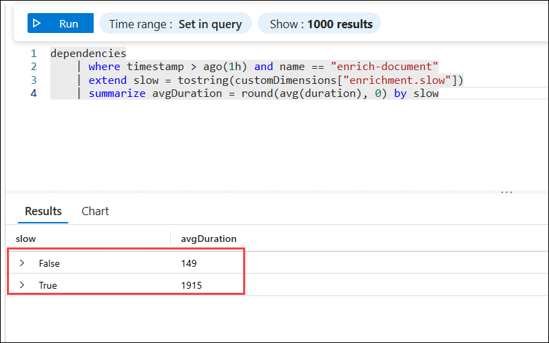

## Summary

## You have successfully completed the Hands-on Lab!
