# Query logs with KQL

Kusto Query Language (KQL) is the query language used to analyze log data in Application Insights. KQL queries let you filter, aggregate, and join telemetry tables such as requests, dependencies, and exceptions to diagnose application health and performance. The Logs blade in Application Insights provides an interactive query editor with autocomplete, visual results, and time range controls that make it the primary tool for investigating telemetry. Combined with scheduled query alert rules created through the Azure CLI, KQL enables proactive monitoring that notifies your team when failure rates or latency exceed acceptable thresholds.

In this exercise, you deploy an Application Insights resource, run a Python script that generates sample request, dependency, and exception telemetry using OpenTelemetry, then write KQL queries in the Azure portal Logs blade to investigate application health. You query the requests table to identify failures, join exceptions with requests to correlate errors, analyze dependency latency with percentile calculations, and create an action group and log search alert rule using the Azure CLI.

Tasks performed in this exercise:

- Download the project starter files
- Create an Application Insights resource
- Run the telemetry generator to create sample data
- Query telemetry with KQL in the Azure portal
- Create an action group and alert rule with the Azure CLI

This exercise takes approximately **20** minutes to complete.

## Before you start

To complete the exercise, you need:

- An Azure subscription. If you don't already have one, you can [sign up for one](https://azure.microsoft.com/).
- [Visual Studio Code](https://code.visualstudio.com/) on one of the [supported platforms](https://code.visualstudio.com/docs/supporting/requirements#_platforms).
- [Python 3.12](https://www.python.org/downloads/) or greater.
- The latest version of the [Azure CLI](https://learn.microsoft.com/cli/azure/install-azure-cli).

## Download project starter files and deploy Application Insights

In this section you download the starter files for the app and use a script to deploy an Application Insights resource to your subscription.

1. Launch **Visual Studio Code** (VS Code) from desktop.

   

1. Select **File Explorer (1)** from left panel. Click **Open Folder** in the menu.

   

1. Navigate to **C:\AllFiles (1)** folder containing the project files and click on **Select folder (2)**.

   

1. If you get "Do you trust the authors of the files in this folder?" prompt, click **Yes, I trust the authors**.

   

1. The project contains deployment scripts for both Bash (_azdeploy.sh_) and PowerShell (_azdeploy.ps1_). Open the appropriate file for your environment and change the two values: **Resource group name** as **<inject key="ResourceGroupName" enableCopy="false"/>** and **Azure Region** as **<inject key="Region" enableCopy="false"/>** at the top of the script to meet your needs.

   > **Note:** Do not change anything else in the script.

   ```
   "<your-resource-group-name>" # Resource Group name
   "<your-azure-region>" # Azure region for the resources
   ```

   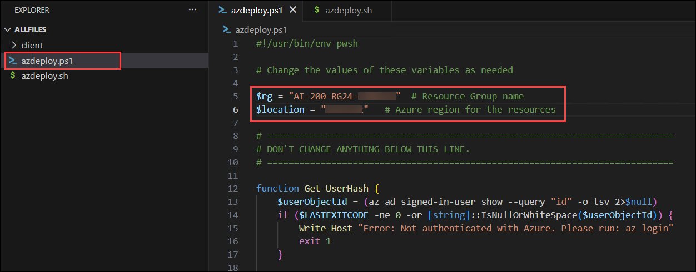

   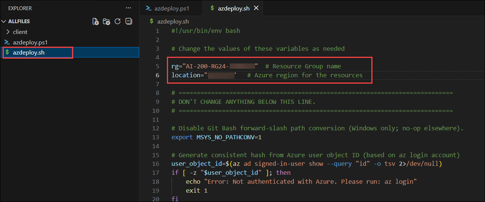

1. In the menu bar, select **File (1)** and select **Save All (2)** from drop-down.

   

1. In the menu bar, select **ellipsis (...) (1)**, then **Terminal (2)**, and then **New Terminal (3)** to open a terminal window in VS Code.

   

   > **NOTE:** If you are using Bash, after the terminal opens, click on the **+ (1)** icon to open a new terminal and select **Git Bash (2)** from the drop-down. If you are using PowerShell, skip this step.
   >
   > 

1. Run the following command in the terminal to allow PowerShell scripts to run. This command is only required if you are using PowerShell. If you are using Bash, skip this step.

   ```
   Set-ExecutionPolicy -ExecutionPolicy bypass -Force
   ```

   

1. Run the **following command (1)** to login to your Azure account. Next, **minimize the VS Code window (2)** to view the login window opened in background.

   ```
   az login
   ```

   

1. In the login window, select **Work or school account (1)** and click **Continue (2)**.

   

1. In the login window, kindly sign in using the provided **Azure credentials (1)** and click **Next (2)**.
   - **Email/Username:** <inject key="AzureAdUserEmail"></inject>

     

1. Next, enter the provided **Password (1)** and click **Sign in (2)**.
   - **Password:** <inject key="AzureAdUserPassword"></inject>

     

1. Next, select **No, this app only** and navigate back to VS Code to continue.

   

1. Answer the prompts to select your Azure account and subscription for the exercise.

   

   > **NOTE:** To confirm you're logged in to the correct Azure subscription, run **az account show**.

1. Run the following command to add the Application Insights CLI extension. This extension provides the commands the deployment script uses to create and manage the Application Insights resource.

   ```
   az extension add --name application-insights
   ```

   

1. Run the appropriate command in the terminal to launch the script.

   **Bash**

   ```bash
   MSYS_NO_PATHCONV=1 bash azdeploy.sh
   ```

   **PowerShell**

   ```powershell
   ./azdeploy.ps1
   ```

   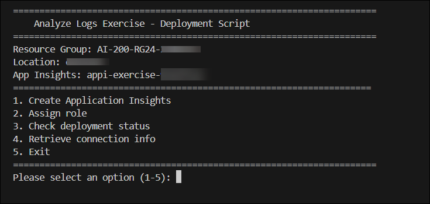

1. When the script is running, enter **1** to launch the **1. Create Application Insights** option.

   This option creates the resource group if it doesn't already exist and creates an Application Insights resource.

   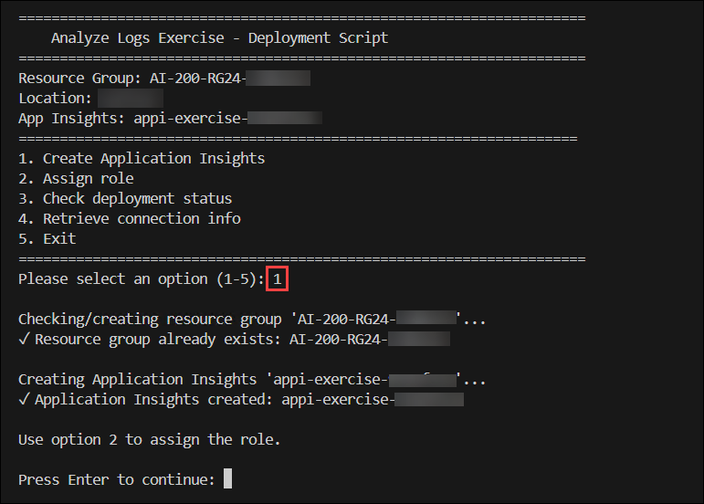

1. Enter **2** to run the **2. Assign role** option. This assigns the Monitoring Metrics Publisher role to your account so the app can publish telemetry to Application Insights using Microsoft Entra authentication.

   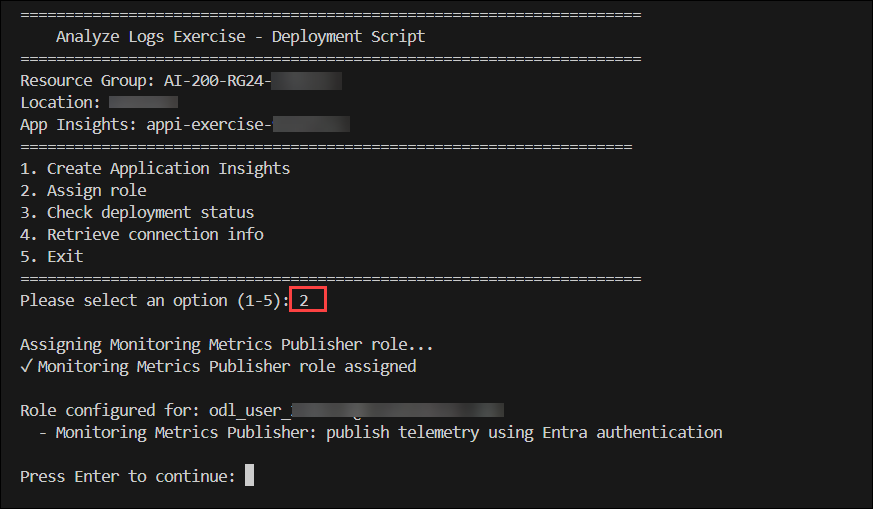

1. Enter **3** to run the **3. Check deployment status** option. Verify the Application Insights resource shows **Succeeded** and the role is assigned before continuing. If the resource is still provisioning, wait a moment and try again.

   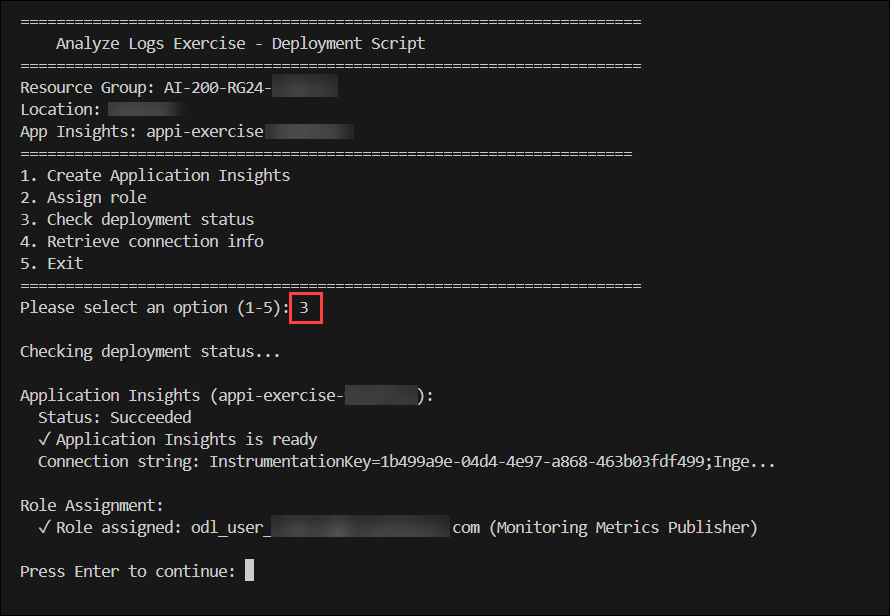

1. Enter **4** to run the **4. Retrieve connection info** option. This creates the environment variable file with the Application Insights connection string, resource group name, Application Insights name, and resource ID needed by the app and CLI commands.

   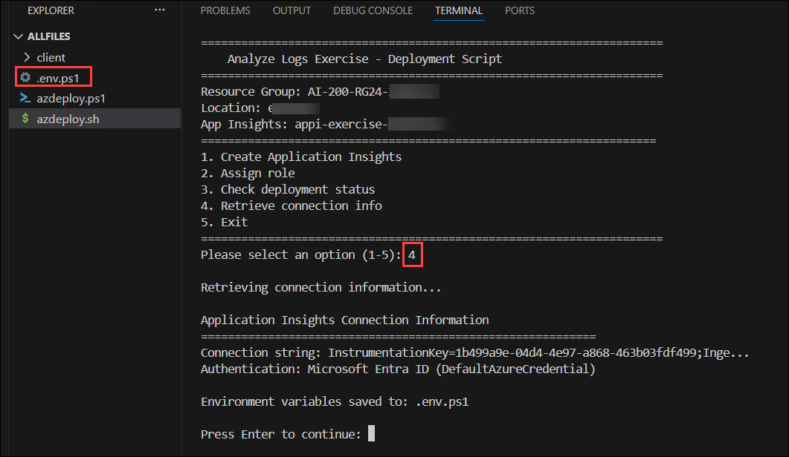

   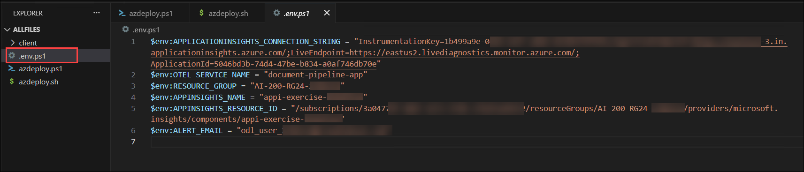

1. Enter **5** to exit the deployment script.

1. Run the appropriate command to load the environment variables into your terminal session from the file created in a previous step.

   **Bash**

   ```bash
   source .env
   ```

   **PowerShell**

   ```powershell
   . .\.env.ps1
   ```

   > **Note:** Keep the terminal open. If you close it and create a new terminal, you need to run this command again to reload the environment variables.

## Task 2: Generate telemetry data

In this section you set up the Python environment, run the pre-written telemetry generator to create sample request, dependency, and exception data in Application Insights, then wait for the data to arrive before querying it. The generator script uses OpenTelemetry to create spans that map to the **requests**, **dependencies**, and **exceptions** tables in Application Insights.

1. Run the following command in the VS Code terminal to navigate to the **_client_** directory.

   ```
   cd client
   ```

1. Run the following command to create the Python environment.

   ```
   python -m venv .venv
   ```

1. Run the following command to activate the Python environment.

   **Bash**

   ```bash
   source .venv/Scripts/activate
   ```

   **PowerShell**

   ```powershell
   .\.venv\Scripts\Activate.ps1
   ```

1. Run the following command to install the dependencies.

   ```
   pip install -r requirements.txt
   ```

1. Run the following command to start the telemetry generator.

   ```
   python app.py
   ```

1. The script generates 15 request spans, 12 dependency spans, and 5 exception spans, then prints a summary. Wait for the script to complete.

   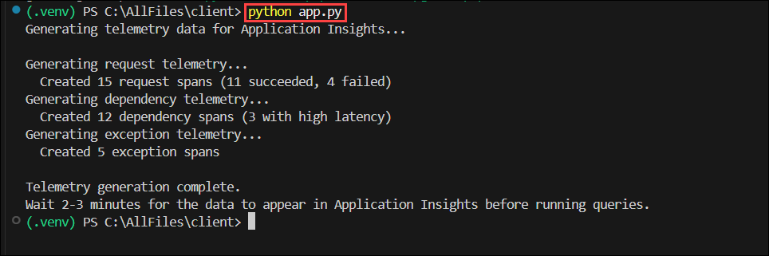

1. Run the script two more times to generate additional telemetry data.

   ```
   python app.py
   ```

1. Wait two to three minutes for the telemetry to arrive in Application Insights. Telemetry is batched and sent periodically, so there is a short delay before data appears.

## Task 3: Query telemetry in the Azure portal

In this section you use the Logs blade in Application Insights to run KQL queries against the telemetry you generated. The Logs blade provides an interactive editor with autocomplete, tabular results, and chart rendering.

1. Navigate to the [Azure portal](https://portal.azure.com) and search **Application Insights (1)** resource and select **Application Insights (2)** from the results.

   

1. Select the **Application Insights** resource you created earlier.

   

1. In the Application Insights resource, select **Logs** in the left navigation under **Monitoring**. Close any query template/query hub dialog that appears.

   

   > **Note:** Be sure to select **KQL mode** in the drop-down selector in the query bar.

   

### Task 3.1: Query failed requests

1. Copy and paste the following query **(1)** into the query editor and select **Run (2)**. This query filters the **requests** table to only failed requests using the **where** operator, then groups them by service name and HTTP status code with **summarize**. The **count()** aggregation tallies failures for each combination, and **order by** sorts the results so the most frequent failures appear first.

   ```kusto
   requests
   | where success == false
   | summarize failedCount = count() by cloud_RoleName, resultCode
   | order by failedCount desc
   ```

   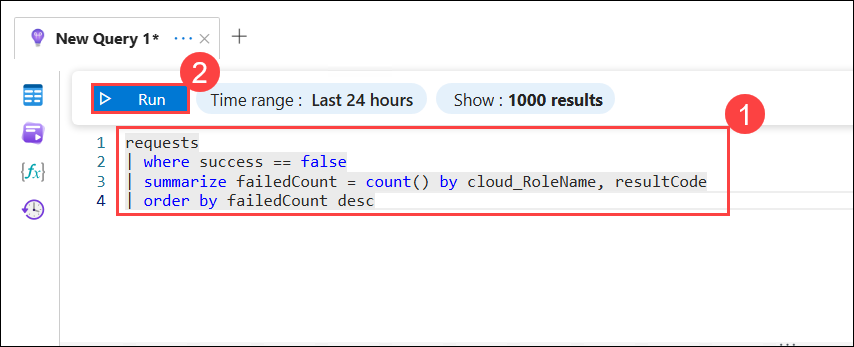

1. Review the results. You should see rows for the api-gateway, doc-processor, and auth-service services with status codes 500 and 429. The **failedCount** column shows how many failures occurred for each combination.

   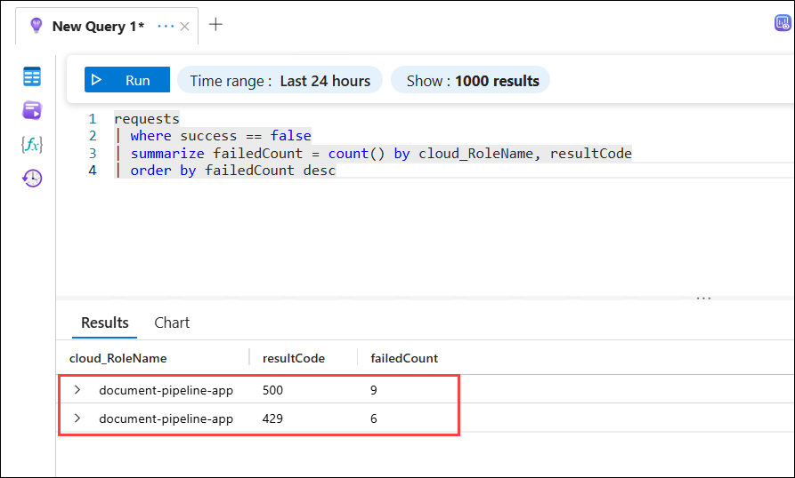

### Task 3.2: Query request volume and performance

1. Copy and paste the following query **(1)** into the query editor and select **Run (2)**. This query uses **bin(timestamp, 1h)** to bucket requests into one-hour intervals and groups by service name. For each bucket it calculates the total request count, the average duration with **avg()**, and the 95th-percentile duration with **percentile()**. The 95th percentile shows the response time that 95% of requests completed within, making it useful for detecting tail latency.

   ```kusto
   requests
   | summarize requestCount = count(),
       avgDuration = avg(duration),
       p95Duration = percentile(duration, 95)
       by bin(timestamp, 1h), cloud_RoleName
   | order by timestamp desc
   ```

   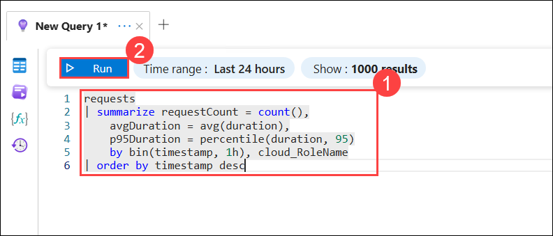

1. Review the results. The **p95Duration** column reveals the response time experienced by the slowest five percent of requests. Compare the average duration to the 95th percentile — a large gap highlights services where most requests are fast but a subset experiences significant delays.

   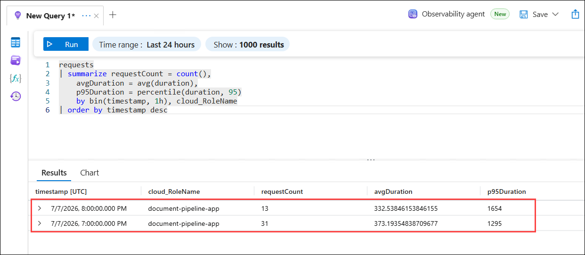

### Task 3.3: Join exceptions with requests

1. Copy and paste the following query **(1)** into the query editor and select **Run (2)**. This query starts from the **exceptions** table and uses **join kind=inner** to match each exception to the request that triggered it via the shared **operation_Id** field. A **project** inside the subquery renames **name** to **requestName** before the join to avoid a column name collision, since both tables have a **name** column. After the join, **summarize** groups the results by request name, exception type, and service, counting how many exceptions each combination produced. The **take 15** operator limits the output to the top 15 rows.

   ```kusto
   exceptions
   | join kind=inner (requests | project requestName = name, operation_Id, cloud_RoleName) on operation_Id
   | summarize exceptionCount = count()
       by requestName, exceptionType = type, cloud_RoleName
   | order by exceptionCount desc
   | take 15
   ```

   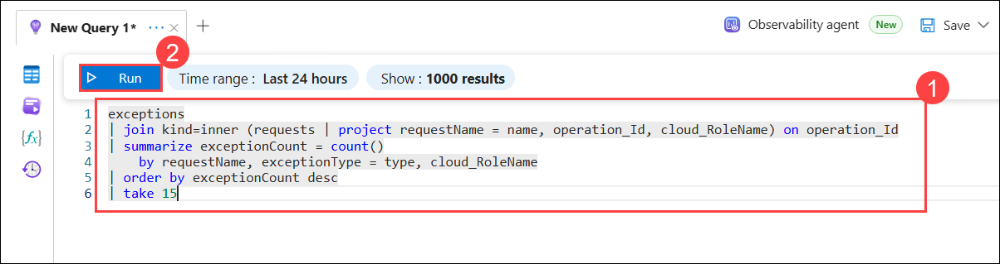

1. Review the results. Each row shows a combination of request name, exception type, and service. This view helps you identify which operations produce the most errors and the exception types involved.

   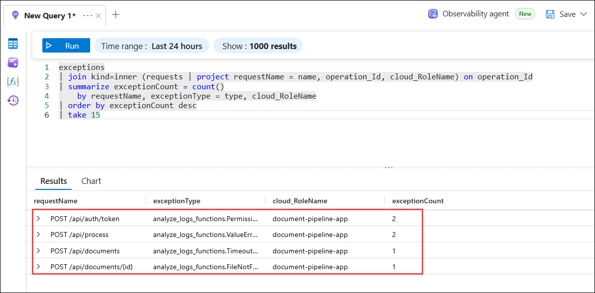

### Task 3.4: Analyze dependency latency

1. Copy and paste the following query **(1)** into the query editor and select **Run (2)**. This query reads the **dependencies** table, which records outbound calls your application makes to databases, APIs, and other services. It groups by **target** (the dependency endpoint) and **type** (such as HTTP or SQL), then calculates the call count, average duration, and the 50th, 95th, and 99th percentile latencies. Comparing multiple percentiles reveals whether slow responses are isolated outliers or a broader pattern.

   ```kusto
   dependencies
   | summarize callCount = count(),
       avgDuration = avg(duration),
       p50 = percentile(duration, 50),
       p95 = percentile(duration, 95),
       p99 = percentile(duration, 99)
       by target, type
   | order by p95 desc
   ```

   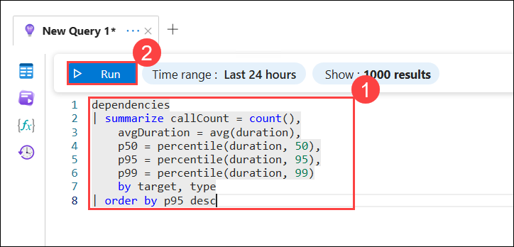

1. Review the results. A large gap between the p50 and p95 values indicates inconsistent performance where most calls are fast but a notable percentage takes much longer.

   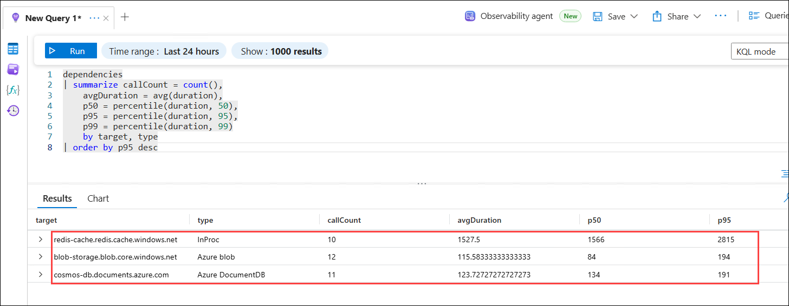

## Task 5: Create an action group and alert rule

In this section you use the Azure CLI to create an action group and a log search alert rule that detects when the failure rate exceeds a threshold.

1. Run the following command in the VS Code terminal to create an action group with an email notification. The **ALERT_EMAIL** variable was populated from your Azure account when you ran the **Retrieve connection info** option in the deployment script.

   **Bash**

   ```bash
   az monitor action-group create \
       --resource-group $RESOURCE_GROUP \
       --name pipeline-alerts-ag \
       --short-name PipeAlert \
       --action email oncall-email $ALERT_EMAIL
   ```

   **PowerShell**

   ```powershell
   az monitor action-group create `
       --resource-group $env:RESOURCE_GROUP `
       --name pipeline-alerts-ag `
       --short-name PipeAlert `
       --action email oncall-email $env:ALERT_EMAIL
   ```

   This command creates an action group named **pipeline-alerts-ag** that sends email notifications when triggered.

   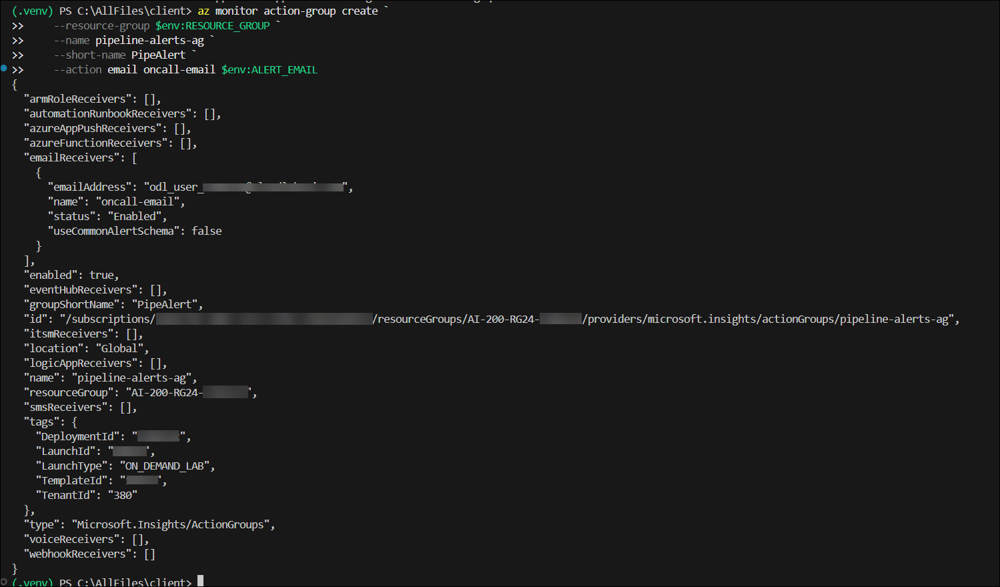

1. Run the following command to create a log search alert rule that monitors the Application Insights resource for failed requests. The rule evaluates the query over a five-minute window and fires if more than ten requests fail.

   **Bash**

   ```bash
   az monitor scheduled-query create \
       --resource-group $RESOURCE_GROUP \
       --name high-failure-rate-alert \
       --scopes $APPINSIGHTS_RESOURCE_ID \
       --condition "count 'FailedRequests' > 10" \
       --condition-query FailedRequests="requests | where success == false" \
       --evaluation-frequency 5m \
       --window-size 5m \
       --severity 1 \
       --description "Alert when more than 10 requests fail in a 5-minute window"
   ```

   **PowerShell**

   ```powershell
   az monitor scheduled-query create `
       --resource-group $env:RESOURCE_GROUP `
       --name high-failure-rate-alert `
       --scopes $env:APPINSIGHTS_RESOURCE_ID `
       --condition "count 'FailedRequests' > 10" `
       --condition-query FailedRequests="requests | where success == false" `
       --evaluation-frequency 5m `
       --window-size 5m `
       --severity 1 `
       --description "Alert when more than 10 requests fail in a 5-minute window"
   ```

   The severity is set to one (Error) to indicate a significant but not outage-level problem. When the alert fires, it triggers the action group which sends an email.

1. Run the following command to verify the alert rule was created and is enabled.

   **Bash**

   ```bash
   az monitor scheduled-query show \
       --resource-group $RESOURCE_GROUP \
       --name high-failure-rate-alert \
       --query "{Name:name, Severity:severity, Enabled:enabled, Window:windowSize, Frequency:evaluationFrequency, Threshold:condition.failingPeriods}" \
       --output table
   ```

   **PowerShell**

   ```powershell
   az monitor scheduled-query show `
       --resource-group $env:RESOURCE_GROUP `
       --name high-failure-rate-alert `
       --query "{Name:name, Severity:severity, Enabled:enabled, Window:windowSize, Frequency:evaluationFrequency, Threshold:condition.failingPeriods}" `
       --output table
   ```

   Confirm the **Enabled** column shows **True** and the severity, window, and frequency values match what you specified in the previous step.

   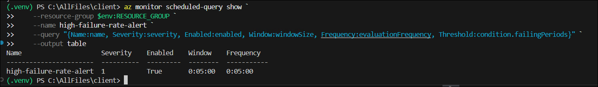

1. Run the following command to list all scheduled query alert rules in the resource group.

   **Bash**

   ```bash
   az monitor scheduled-query list \
       --resource-group $RESOURCE_GROUP \
       --output table
   ```

   **PowerShell**

   ```powershell
   az monitor scheduled-query list `
       --resource-group $env:RESOURCE_GROUP `
       --output table
   ```

   You should see one rule named **high-failure-rate-alert**. Because you already generated telemetry with failed requests, the rule begins evaluating immediately on its five-minute cycle. If the number of failed requests in the window exceeds the threshold, Azure Monitor fires the alert and the action group sends an email notification to the email address you specified.

   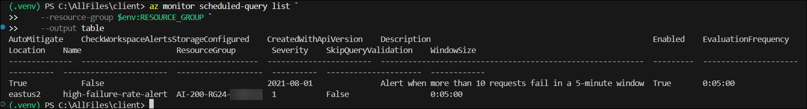

## Summary

## You have successfully completed the Hands-on Lab!
