# Lab 18: Process messages with Azure Service Bus

### Estimated Duration : 60 Minutes

## Lab overview

In this hands-on lab, you deploy Azure Service Bus and complete the messaging logic for a Python application. The application demonstrates core messaging patterns by sending and processing queue messages, handling invalid messages with a dead-letter queue, and publishing messages to topics with filtered subscriptions. You implement Azure Service Bus operations using the Azure SDK for Python and Microsoft Entra authentication, then verify queue processing, dead-letter handling, and topic-based message routing through a web application.

## Lab Objective

In this lab, you'll perform the following tasks:

- **Task 1:** Prepare the environment and deploy Azure Service Bus
- **Task 2:** Complete the app
- **Task 3:** Configure the Python environment
- **Task 4:** Run the app

### <span style="color:maroon">**Note:** This lab includes deployment scripts for both **Bash** and **PowerShell**. Click on the drop-down arrow ▶ to expand the commands for your preferred shell. Once you make your choice, use the corresponding commands throughout the entire lab.</span>

## Task 1: Prepare the environment and deploy Azure Service Bus

In this task, you'll prepare the development environment, configure the deployment script, authenticate to Azure, and deploy an Azure Service Bus namespace with the messaging entities and permissions required for the lab.

1. Launch **Visual Studio Code** (VS Code) from desktop.

   

1. Select **File Explorer (1)** from left panel. Click **Open Folder** in the menu.

   

1. Navigate to **C:\AllFiles (1)** folder containing the project files and click on **Select folder (2)**.

   

1. If you get "Do you trust the authors of the files in this folder?" prompt, click **Yes, I trust the authors**.

   

1. The project contains deployment scripts for both Bash (_azdeploy.sh_) and PowerShell (_azdeploy.ps1_). Open the appropriate file for your environment and change the two values: **Resource group name** as **<inject key="ResourceGroupName" enableCopy="false"/>** and **Azure Region** as **<inject key="Region" enableCopy="false"/>** at the top of the script to meet your needs.

   > **Note:** Do not change anything else in the script.

   ```
   "<your-resource-group-name>" # Resource Group name
   "<your-azure-region>" # Azure region for the resources
   ```

   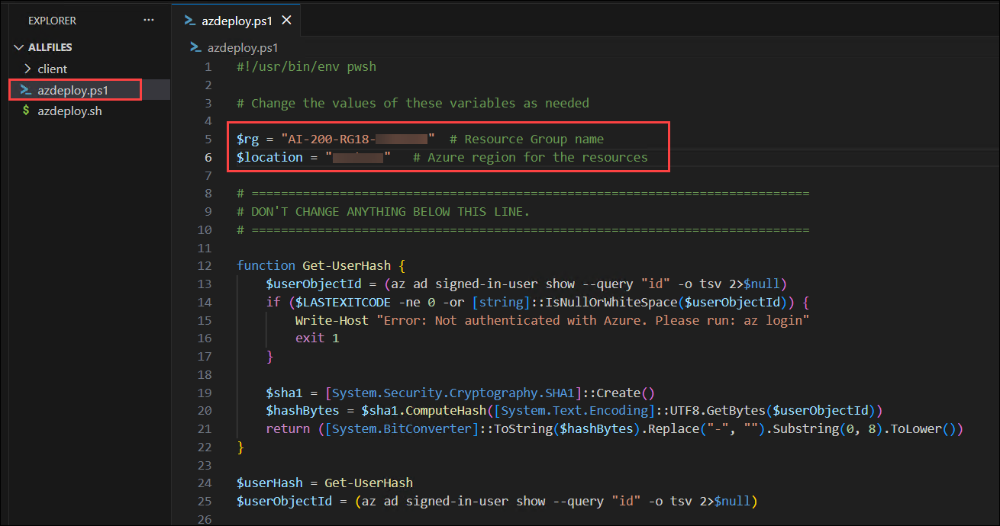

   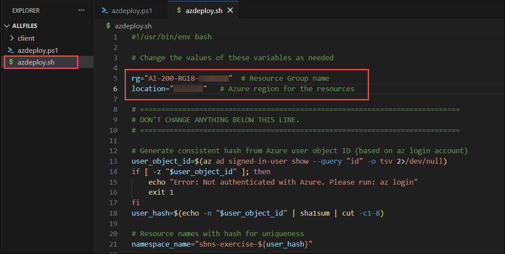

1. In the menu bar, select **File (1)** and select **Save All (2)** from drop-down.

   

1. In the menu bar, select **ellipsis (...) (1)**, then **Terminal (2)**, and then **New Terminal (3)** to open a terminal window in VS Code.

   

   > **NOTE:** If you are using Bash, after the terminal opens, click on the **+ (1)** icon to open a new terminal and select **Git Bash (2)** from the drop-down. If you are using PowerShell, skip this step.
   >
   > 

1. Run the following command in the terminal to allow PowerShell scripts to run. This command is only required if you are using PowerShell. If you are using Bash, skip this step.

    <details>
     <summary>PowerShell</summary>
     
   ```
   Set-ExecutionPolicy -ExecutionPolicy bypass -Force
   ```

   

   </details>

1. Run the **following command (1)** to login to your Azure account. Next, **minimize the VS Code window (2)** to view the login window opened in background.

   ```
   az login
   ```

   

1. In the login window, select **Work or school account (1)** and click **Continue (2)**.

   

1. In the login window, kindly sign in using the provided **Azure credentials (1)** and click **Next (2)**.
   - **Email/Username:** <inject key="AzureAdUserEmail"></inject>

     

1. Next, enter the provided **Password (1)** and click **Sign in (2)**.
   - **Password:** <inject key="AzureAdUserPassword"></inject>

     

1. Next, select **No, this app only** and navigate back to VS Code to continue.

   

1. Answer the prompts to select your Azure account and subscription for the exercise.

   

   > **NOTE:** To confirm you're logged in to the correct Azure subscription, run **az account show**.

1. Run the appropriate command in the terminal to launch the script.

   <details>
     <summary>Bash</summary>

   ```bash
   MSYS_NO_PATHCONV=1 bash azdeploy.sh
   ```

   </details>

   <details>
     <summary>PowerShell</summary>

   ```powershell
   ./azdeploy.ps1
   ```

   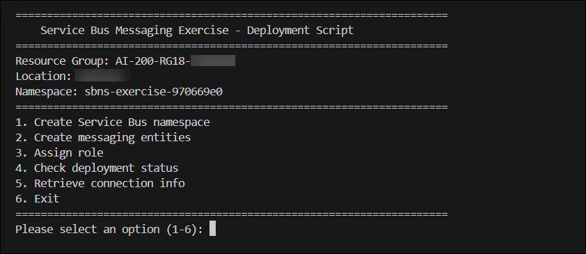
   </details>

1. When the script is running, enter **1** to launch the **1. Create Service Bus namespace** option.

   This option creates the resource group if it doesn't already exist, and deploys an Azure Service Bus namespace with the Standard tier. The namespace is the container for all messaging entities you create during the exercise.

   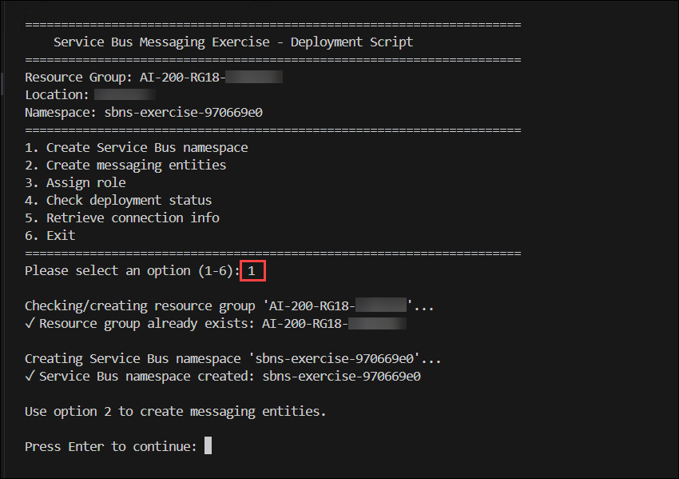

1. Enter **2** to run the **2. Create messaging entities** option. This creates the queue, topic, subscriptions, and SQL filter that the app uses. The **inference-requests** queue is configured with a max delivery count of 5 and dead-lettering on message expiration. The **inference-results** topic has two subscriptions: **notifications** (receives all messages) and **high-priority** (filtered to only receive messages where the **priority** property equals **high**).

   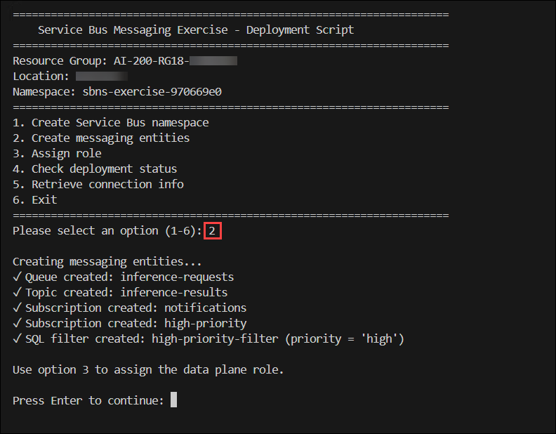

1. Enter **3** to run the **3. Assign role** option. This assigns the Azure Service Bus Data Owner role to your account so you can send and receive messages using Microsoft Entra authentication.

   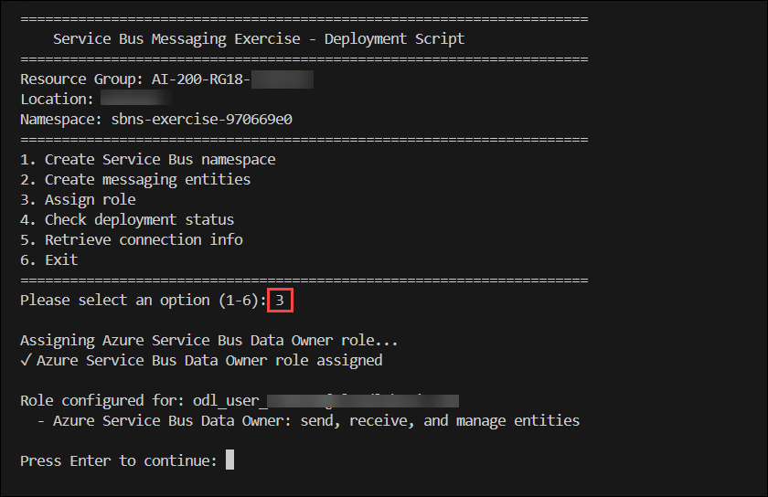

1. Enter **4** to run the **4. Check deployment status** option. Verify the namespace status shows **Succeeded**, the messaging entities are created, and the role is assigned before continuing. If the namespace is still provisioning, wait a moment and try again.

   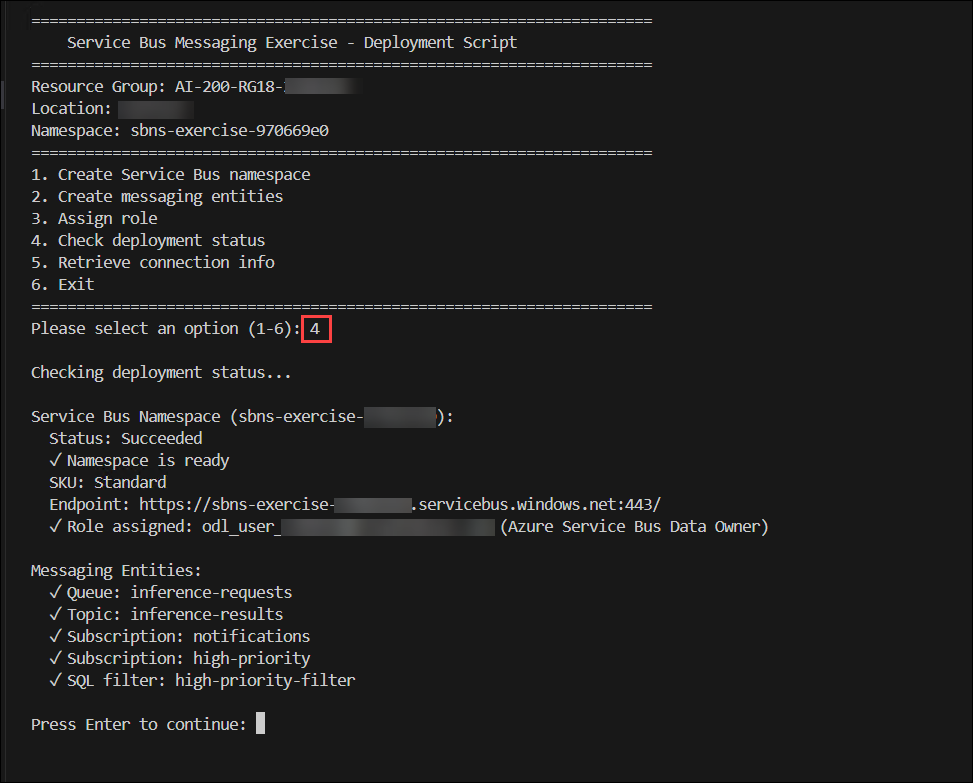

1. Enter **5** to run the **5. Retrieve connection info** option. This creates the environment variable file with the fully qualified domain name (FQDN) needed by the app.

   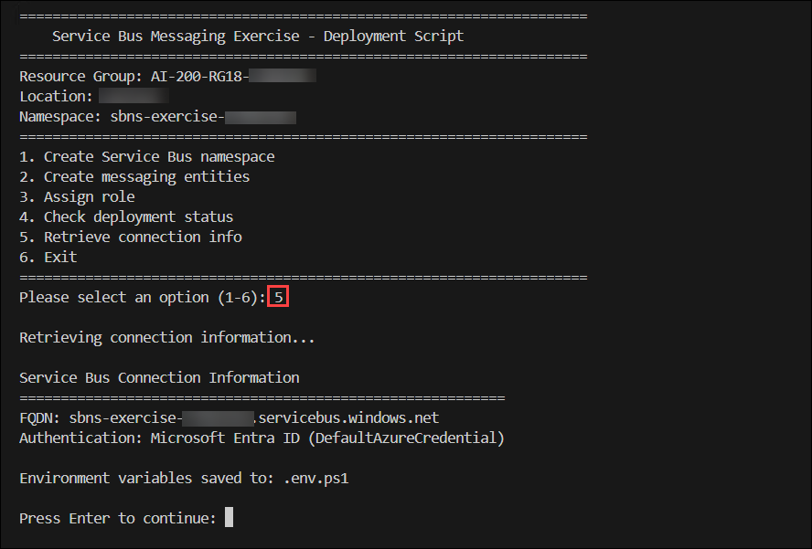

1. Enter **6** to exit the deployment script.

1. Run the appropriate command to load the environment variables into your terminal session from the file created in a previous step.

   <details>
     <summary>Bash</summary>

   ```bash
   source .env
   ```

   </details>

   <details>
     <summary>PowerShell</summary>

   ```powershell
   . .\.env.ps1
   ```

   </details>

   > **Note:** Keep the terminal open. If you close it and create a new terminal, you need to run this command again to reload the environment variables.

> **Congratulations** on completing the task! Now, it's time to validate it. Here are the steps:
>
> - If you receive a success message, you can proceed to the next task.
> - If not, carefully read the error message and retry the step, following the instructions in the lab guide.
> - If you need any assistance, please contact us at cloudlabs-support@spektrasystems.com. We are available 24/7 to help you out.

<validation step="9273bd12-ef48-4c0c-b041-44e48485088a" />

## Task 2: Complete the app

In this task, you'll complete the application's messaging functionality by adding code to send and process queue messages, inspect the dead-letter queue, and implement topic messaging with filtered subscriptions using the Azure Service Bus SDK.

1. Open the **client/service_bus_functions.py** file to begin adding code.

   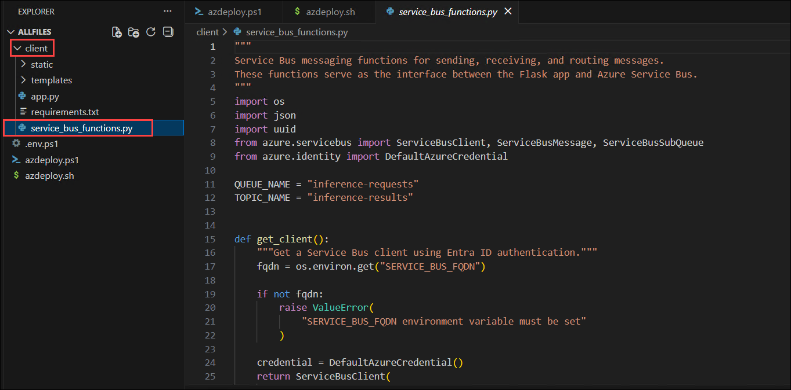

   > **Note:** The code blocks you add to the application should align with the comment for that section of the code.

### Task 2.1: Add code to send messages to the queue

In this section, you add code to send three messages to the queue. Two messages have valid JSON payloads representing inference requests, and one has intentionally malformed JSON to simulate a processing failure that demonstrates the dead-letter queue.

The function opens a **ServiceBusClient** using **DefaultAzureCredential** and creates a queue sender with **get_queue_sender()**. It constructs three **ServiceBusMessage** objects, each with a **message_id** for deduplication, a **correlation_id** for tracking, and **application_properties** for custom metadata. Two messages contain valid JSON payloads and one contains intentionally malformed JSON. The **send_messages()** method sends each message individually to the queue.

1. Locate the **# BEGIN SEND MESSAGES FUNCTION** comment and add the following code under the comment. Be sure to check for proper code alignment.

   ```python
   def send_messages():
       """Send messages to the queue including one malformed message."""
       # Create a ServiceBusClient using DefaultAzureCredential
       client = get_client()
       results = []

       with client:
           # Open a sender bound to the queue
           with client.get_queue_sender(QUEUE_NAME) as sender:
               # Valid message 1 — message_id enables deduplication,
               # correlation_id links related messages for tracking,
               # and application_properties carry custom metadata for routing
               msg1 = ServiceBusMessage(
                   body=json.dumps({
                       "prompt": "Extract parties and effective date.",
                       "model": "gpt-4o",
                       "document_id": "doc-001"
                   }),
                   content_type="application/json",
                   message_id=str(uuid.uuid4()),
                   correlation_id="req-doc-001",
                   application_properties={"priority": "standard", "document_type": "contract"}
               )
               sender.send_messages(msg1)
               results.append({
                   "correlation_id": msg1.correlation_id,
                   "type": "valid",
                   "status": "sent"
               })

               # Valid message 2 — priority is set to "high" so it matches
               # the SQL filter on the high-priority topic subscription
               msg2 = ServiceBusMessage(
                   body=json.dumps({
                       "prompt": "Summarize the key terms.",
                       "model": "gpt-4o",
                       "document_id": "doc-002"
                   }),
                   content_type="application/json",
                   message_id=str(uuid.uuid4()),
                   correlation_id="req-doc-002",
                   application_properties={"priority": "high", "document_type": "contract"}
               )
               sender.send_messages(msg2)
               results.append({
                   "correlation_id": msg2.correlation_id,
                   "type": "valid",
                   "status": "sent"
               })

               # Invalid message — intentionally malformed JSON body to
               # demonstrate dead-lettering during processing
               msg3 = ServiceBusMessage(
                   body="not valid json: [broken",
                   content_type="application/json",
                   message_id=str(uuid.uuid4()),
                   correlation_id="req-doc-003",
                   application_properties={"priority": "standard"}
               )
               sender.send_messages(msg3)
               results.append({
                   "correlation_id": msg3.correlation_id,
                   "type": "malformed",
                   "status": "sent"
               })

       return results
   ```

   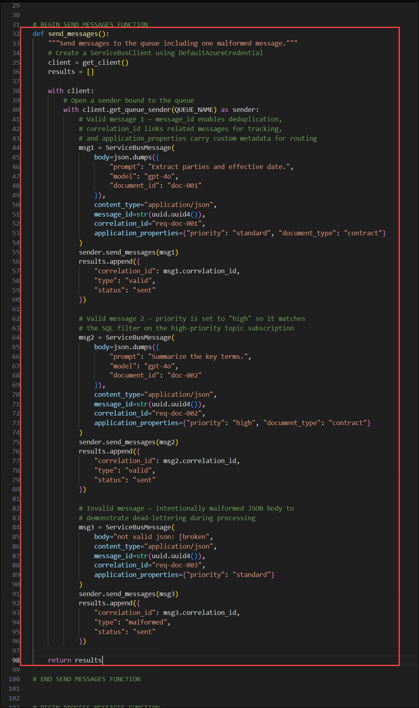

1. Take a few minutes to review the code.

### Task 2.2: Add code to process messages with peek-lock

In this task, you add code to receive messages from the queue using peek-lock mode. The processor validates the JSON payload, completes valid messages, and dead-letters messages with invalid JSON by providing a reason and error description.

The function creates a queue receiver with **get_queue_receiver()** using peek-lock mode (the default), which locks each message while it's being processed but keeps it in the queue until settlement. For each message, it attempts to parse the JSON body. Valid messages are removed from the queue with **complete_message()**. Invalid messages are moved to the dead-letter sub-queue with **dead_letter_message()**, which accepts a **reason** and **error_description** for diagnostics.

1. Locate the **# BEGIN PROCESS MESSAGES FUNCTION** comment and add the following code under the comment. Be sure to check for proper code alignment.

   ```python
   def process_messages():
       """Receive and process messages from the queue using peek-lock."""
       client = get_client()
       results = []

       with client:
           # Peek-lock is the default receive mode — the message is locked
           # but stays in the queue until explicitly completed or dead-lettered.
           # max_wait_time sets how long the receiver waits for new messages.
           with client.get_queue_receiver(
               queue_name=QUEUE_NAME,
               max_wait_time=5
           ) as receiver:
               for msg in receiver:
                   try:
                       payload = json.loads(str(msg))
                       # Complete removes the message from the queue
                       receiver.complete_message(msg)
                       results.append({
                           "correlation_id": msg.correlation_id,
                           "document_id": payload.get("document_id"),
                           "model": payload.get("model"),
                           "prompt": payload.get("prompt", "")[:50],
                           "status": "completed"
                       })
                   except json.JSONDecodeError:
                       # Dead-letter moves the message to the dead-letter
                       # sub-queue with a reason and description for diagnostics
                       receiver.dead_letter_message(
                           msg,
                           reason="MalformedPayload",
                           error_description="Message body is not valid JSON"
                       )
                       results.append({
                           "correlation_id": msg.correlation_id,
                           "document_id": None,
                           "model": None,
                           "prompt": str(msg)[:50],
                           "status": "dead-lettered"
                       })

       return results
   ```

   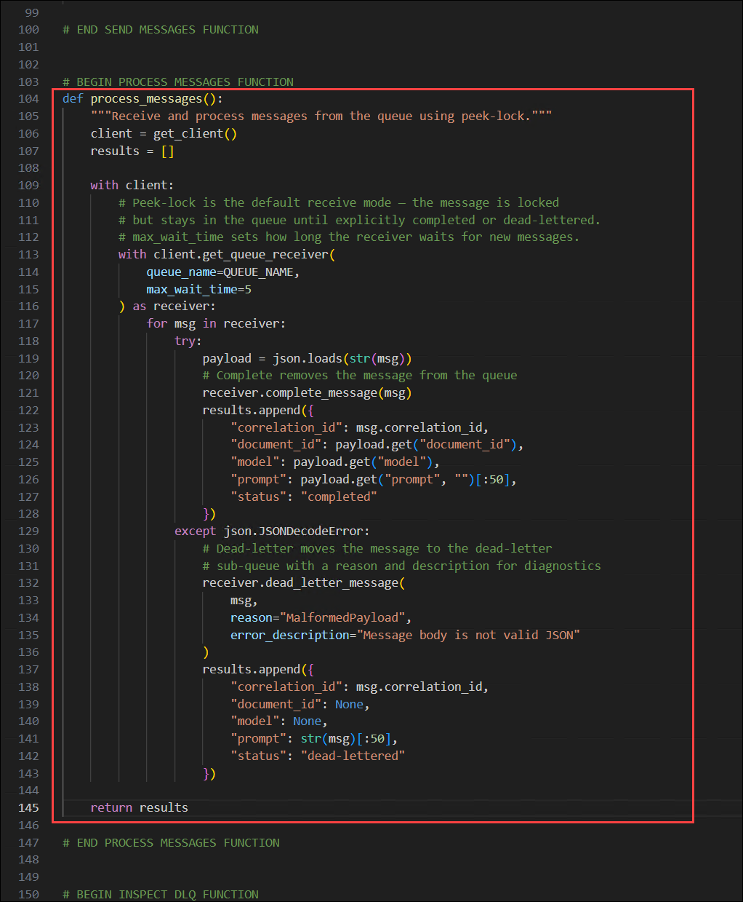

1. Save your changes using **Ctrl + S** and take a few minutes to review the code.

### Task 2.3: Add code to inspect the dead-letter queue

In this task, you add code to read messages from the dead-letter queue and display diagnostic information. The dead-letter queue captures messages that couldn't be processed, along with the reason and error description for troubleshooting.

The function creates a receiver that targets the dead-letter sub-queue by passing **sub_queue=ServiceBusSubQueue.DEAD_LETTER** to **get_queue_receiver()**. For each dead-lettered message, it reads the diagnostic properties: **dead_letter_reason**, **dead_letter_error_description**, and **delivery_count**. After reading, it calls **complete_message()** to remove the message from the dead-letter queue.

1. Locate the **# BEGIN INSPECT DLQ FUNCTION** comment and add the following code under the comment. Be sure to check for proper code alignment.

   ```python
   def inspect_dead_letter_queue():
       """Inspect and remove messages from the dead-letter queue."""
       client = get_client()
       results = []

       with client:
           # ServiceBusSubQueue.DEAD_LETTER targets the dead-letter sub-queue,
           # which holds messages that failed processing
           with client.get_queue_receiver(
               queue_name=QUEUE_NAME,
               sub_queue=ServiceBusSubQueue.DEAD_LETTER,
               max_wait_time=5
           ) as dlq_receiver:
               for msg in dlq_receiver:
                   # Dead-lettered messages include diagnostic properties:
                   # dead_letter_reason, dead_letter_error_description,
                   # and delivery_count (number of delivery attempts)
                   results.append({
                       "message_id": msg.message_id,
                       "correlation_id": msg.correlation_id,
                       "dead_letter_reason": msg.dead_letter_reason,
                       "error_description": msg.dead_letter_error_description,
                       "delivery_count": msg.delivery_count,
                       "body": str(msg)[:100]
                   })
                   # Complete removes the message from the dead-letter queue
                   dlq_receiver.complete_message(msg)

       return results
   ```

   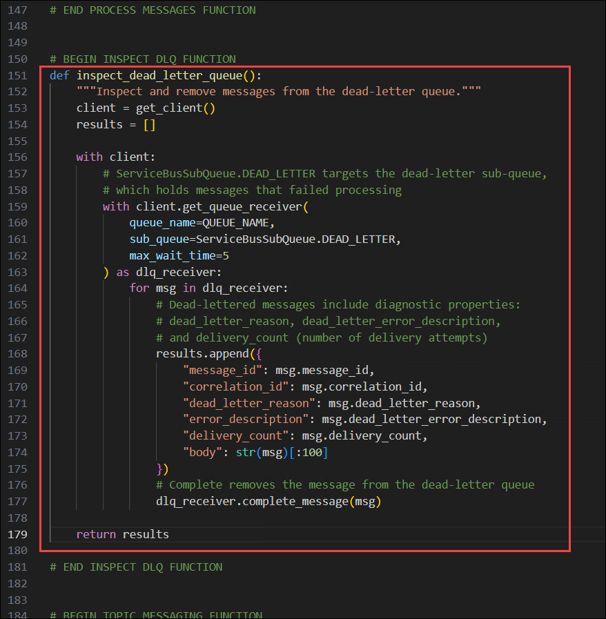

1. Save your changes and take a few minutes to review the code.

### Task 2.4: Add code for topic messaging with filtered subscriptions

In this task, you add code to send messages to a topic with different priority levels, then receive from each subscription to verify that filtering works. The **notifications** subscription receives all messages, while the **high-priority** subscription receives only messages where the **priority** application property equals **high**.

The function uses **get_topic_sender()** to open a sender bound to the topic, then sends five messages with varying **priority** values in their **application_properties**. It then opens two subscription receivers with **get_subscription_receiver()**. The **notifications** subscription has no filter and receives all five messages. The **high-priority** subscription only delivers messages that match its SQL filter. Note that application properties may arrive as bytes due to AMQP encoding, so the code handles both string and bytes keys.

1. Locate the **# BEGIN TOPIC MESSAGING FUNCTION** comment and add the following code under the comment. Be sure to check for proper code alignment.

   ```python
   def topic_messaging():
       """Send messages to a topic and receive from filtered subscriptions."""
       client = get_client()
       sent = []
       notifications = []
       high_priority = []

       with client:
           # get_topic_sender opens a sender bound to a topic instead of a queue.
           # Each message is broadcast to all matching subscriptions.
           with client.get_topic_sender(TOPIC_NAME) as sender:
               for i, priority in enumerate(["standard", "high", "standard", "high", "low"]):
                   result = {
                       "document_id": f"doc-{i+1:03d}",
                       "status": "completed",
                       "confidence": 0.95
                   }
                   # The "priority" application property is what the SQL
                   # filter on the high-priority subscription evaluates
                   msg = ServiceBusMessage(
                       body=json.dumps(result),
                       content_type="application/json",
                       message_id=str(uuid.uuid4()),
                       application_properties={"priority": priority}
                   )
                   sender.send_messages(msg)
                   sent.append({
                       "document_id": f"doc-{i+1:03d}",
                       "priority": priority
                   })

           # Receive from the notifications subscription, which has no filter
           # and therefore receives all messages sent to the topic
           with client.get_subscription_receiver(
               topic_name=TOPIC_NAME,
               subscription_name="notifications",
               max_wait_time=5
           ) as receiver:
               for msg in receiver:
                   body = json.loads(str(msg))
                   # Application properties may arrive as bytes depending
                   # on the AMQP encoding, so handle both str and bytes keys
                   props = msg.application_properties or {}
                   priority_val = props.get("priority") or props.get(b"priority", b"unknown")
                   if isinstance(priority_val, bytes):
                       priority_val = priority_val.decode("utf-8")
                   notifications.append({
                       "document_id": body["document_id"],
                       "priority": priority_val
                   })
                   receiver.complete_message(msg)

           # Receive from the high-priority subscription, which only delivers
           # messages where the SQL filter "priority = 'high'" matches
           with client.get_subscription_receiver(
               topic_name=TOPIC_NAME,
               subscription_name="high-priority",
               max_wait_time=5
           ) as receiver:
               for msg in receiver:
                   body = json.loads(str(msg))
                   props = msg.application_properties or {}
                   priority_val = props.get("priority") or props.get(b"priority", b"unknown")
                   if isinstance(priority_val, bytes):
                       priority_val = priority_val.decode("utf-8")
                   high_priority.append({
                       "document_id": body["document_id"],
                       "priority": priority_val
                   })
                   receiver.complete_message(msg)

       return {
           "sent": sent,
           "notifications": notifications,
           "high_priority": high_priority
       }
   ```

   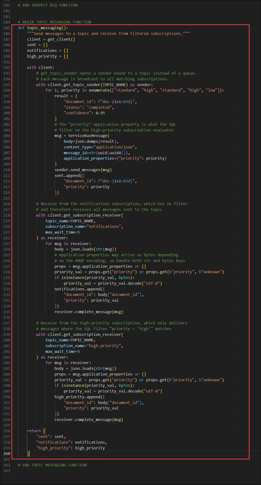

1. Save your changes and take a few minutes to review the code.

   > **Note:** Verify that the code indentation is preserved exactly as shown. Improper indentation can lead to syntax or execution errors and prevent the code from running successfully.

## Task 3: Configure the Python environment

In this task, you'll create a Python virtual environment, install the required dependencies, and prepare the client application for execution.

1. Run the following command in the VS Code terminal to navigate to the **client** directory.

   ```
   cd client
   ```

   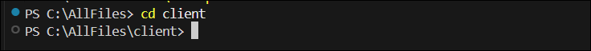

1. Run the following command to create the Python environment.

   ```
   python -m venv .venv
   ```

1. Run the following command to activate the Python environment.

   <details>
     <summary>Bash</summary>

   ```bash
   source .venv/Scripts/activate
   ```

   </details>

   <details>
     <summary>PowerShell</summary>

   ```powershell
   .\.venv\Scripts\Activate.ps1
   ```

   </details>

1. Run the following command in the VS Code terminal to install the dependencies.

   ```
   pip install -r requirements.txt
   ```

## Task 4: Run the app

In this task, you'll run the completed application to send and process queue messages, inspect dead-lettered messages, and verify topic-based message routing through filtered subscriptions.

1. Run the following command in the terminal to start the app. Refer to the commands from earlier in the exercise to activate the environment, if needed, before running the command. If you navigated away from the **client** directory, run **cd client** first.

   ```
   python app.py
   ```

   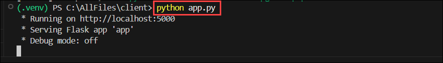

1. Open a browser and navigate to `http://localhost:5000` to access the app.

   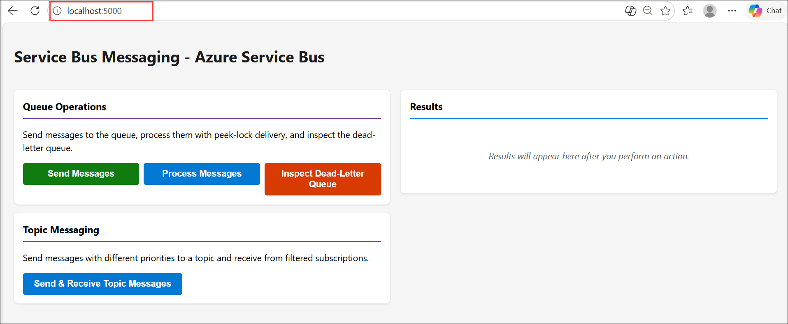

1. Select **Send Messages (1)** in the left panel. This sends three messages to the queue: two with valid JSON payloads representing inference requests, and one with intentionally malformed JSON. The results **(2)** in the right panel confirm each message was sent along with its correlation ID and type.

   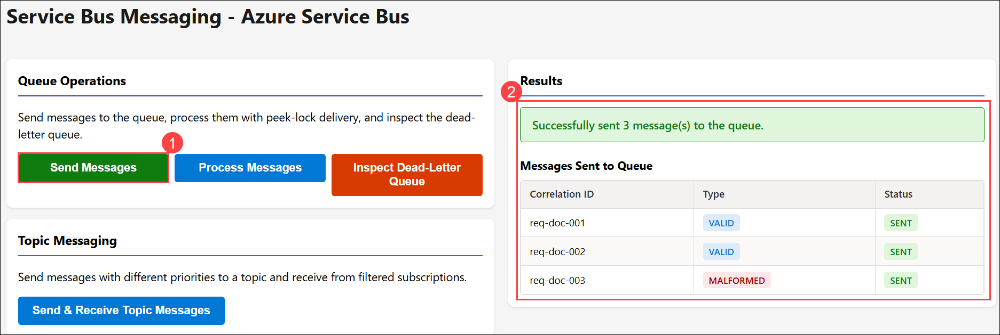

1. Select **Process Messages (1)**. This receives the three messages from the queue using peek-lock delivery. The processor validates each message's JSON payload, completes the two valid messages, and dead-letters the malformed message with a reason of **MalformedPayload**. The results **(2)** show the status of each message after processing.

   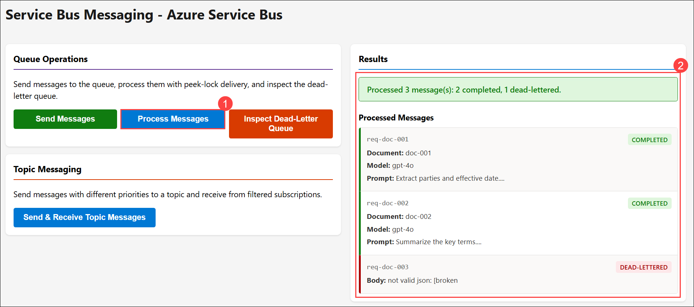

1. Select **Inspect Dead-Letter Queue (1)**. This reads the dead-lettered message and displays its diagnostic information, including the dead-letter reason, error description, and delivery count. The dead-letter queue captures messages **(2)** that couldn't be processed so you can investigate failures.

   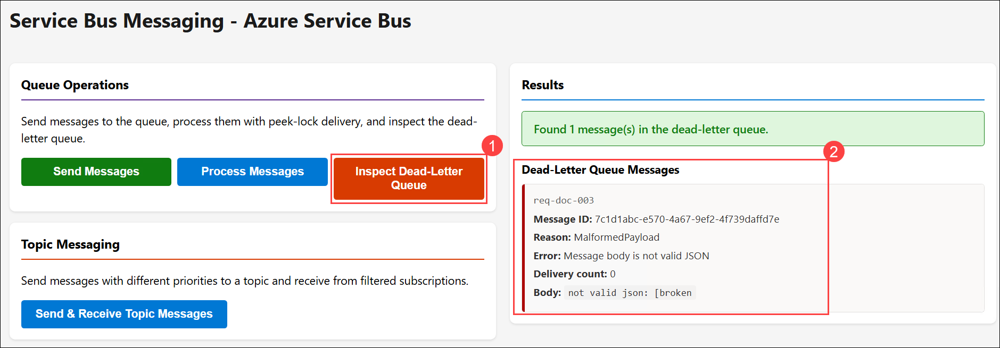

1. Select **Send & Receive Topic Messages (1)**. This sends five messages to the **inference-results** topic, each with a different priority level. It then reads from both subscriptions to demonstrate filtered delivery. The **notifications** subscription receives all five messages, while the **high-priority** subscription receives only the messages where the **priority** property equals **high**.

   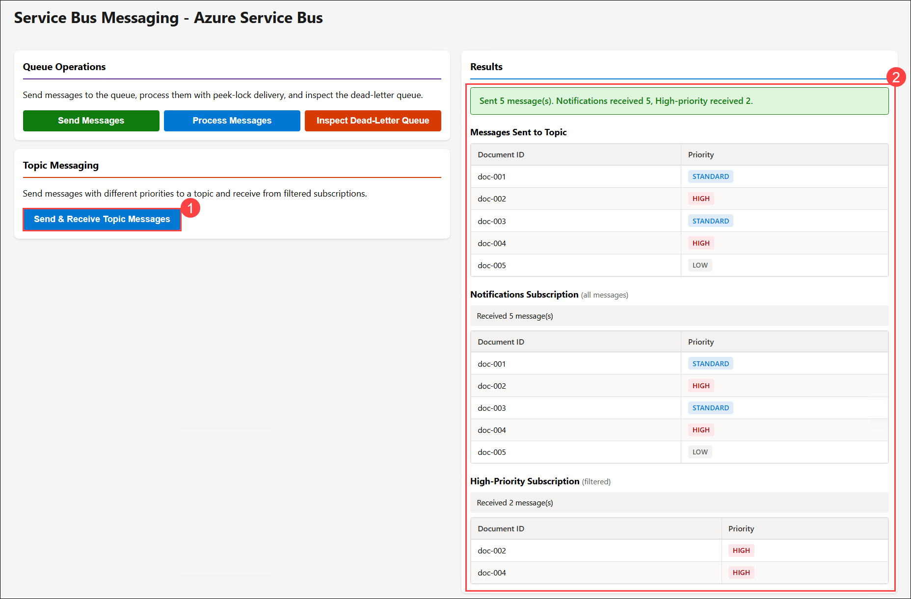

## Summary

In this lab, you implemented messaging solutions using **Azure Service Bus** by deploying a Service Bus namespace, completing the application's messaging logic, and running a web application to validate message processing workflows. You learned how to send and receive queue messages using peek-lock delivery, process invalid messages with the dead-letter queue, publish messages to topics, and route messages to subscriptions using SQL filters. These capabilities demonstrate common messaging patterns used to build reliable, asynchronous, and event-driven applications with Azure Service Bus.

## You have successfully completed the Hands-on Lab!
