# Lab 19: Publish and receive events with Azure Event Grid

### Estimated Duration : 60 Minutes

## Lab overview

In this hands-on lab, you deploy Azure Event Grid Namespace resources and complete the event publishing and pull delivery logic for a Python application. The application publishes CloudEvents representing AI content moderation results, receives events from filtered subscriptions using pull delivery, acknowledges successfully processed events, and rejects events that cannot be processed. You implement Azure Event Grid operations using the Azure SDK for Python and Microsoft Entra authentication, then verify event routing, subscription filtering, and event lifecycle management through a web application.

## Lab objectives

In this lab, you'll perform the following tasks:

- **Task 1:** Prepare the environment and deploy Azure Event Grid
- **Task 2:** Complete the app
- **Task 3:** Configure the Python environment
- **Task 4:** Run the app

> ### **Note:** This lab includes deployment scripts for both **PowerShell** and **Bash**. You may choose either scripting language based on your preference or environment. Once you make your choice, use the corresponding commands and script throughout the entire lab, as all subsequent steps provide instructions for both PowerShell and Bash.

## Task 1: Prepare the environment and deploy Azure Service Bus

In this task, you'll prepare the development environment, configure the deployment script, authenticate to Azure, and deploy an Azure Event Grid Namespace with the topics, event subscriptions, and permissions required for the lab.

1. Launch **Visual Studio Code** (VS Code) from desktop.

   

1. Select **File Explorer (1)** from left panel. Click **Open Folder** in the menu.

   

1. Navigate to **C:\AllFiles (1)** folder containing the project files and click on **Select folder (2)**.

   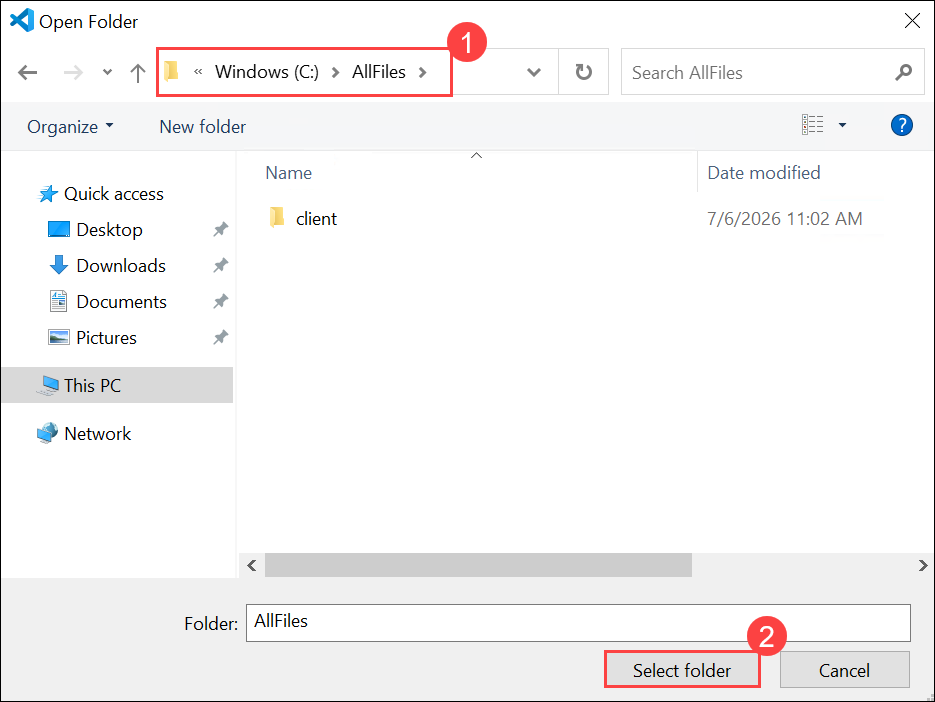

1. If you get "Do you trust the authors of the files in this folder?" prompt, click **Yes, I trust the authors**.

   

1. The project contains deployment scripts for both Bash (_azdeploy.sh_) and PowerShell (_azdeploy.ps1_). Open the appropriate file for your environment and change the two values: **Resource group name** as **<inject key="ResourceGroupName" enableCopy="false"/>** and **Azure Region** as **<inject key="Region" enableCopy="false"/>** at the top of the script to meet your needs.

   > **Note:** Do not change anything else in the script.

   ```
   "<your-resource-group-name>" # Resource Group name
   "<your-azure-region>" # Azure region for the resources
   ```

   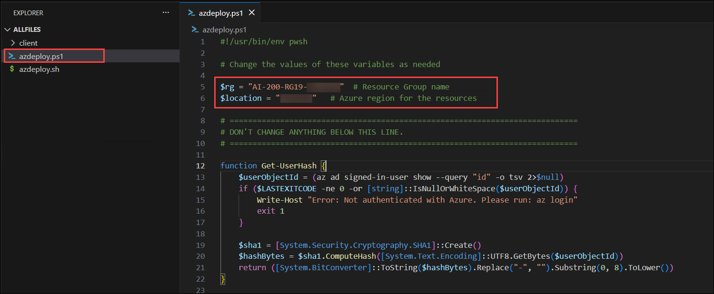

   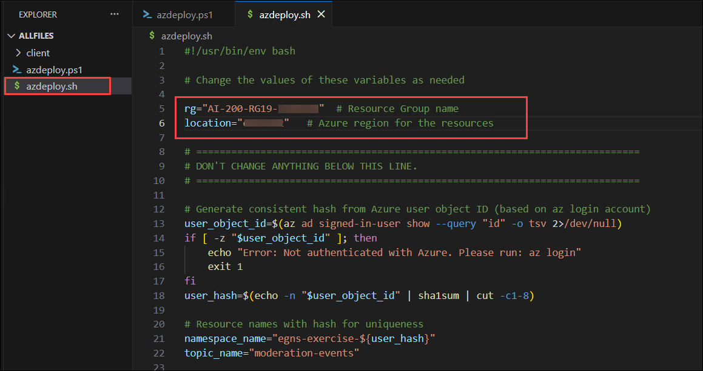

1. In the menu bar, select **File (1)** and select **Save All (2)** from drop-down.

   

1. In the menu bar, select **ellipsis (...) (1)**, then **Terminal (2)**, and then **New Terminal (3)** to open a terminal window in VS Code.

   

   > **NOTE:** If you are using Bash, after the terminal opens, click on the **+ (1)** icon to open a new terminal and select **Git Bash (2)** from the drop-down. If you are using PowerShell, skip this step.
   >
   > 

1. Run the following command in the terminal to allow PowerShell scripts to run. This command is only required if you are using PowerShell. If you are using Bash, skip this step.

   ```
   Set-ExecutionPolicy -ExecutionPolicy bypass -Force
   ```

   

1. Run the **following command (1)** to login to your Azure account. Next, **minimize the VS Code window (2)** to view the login window opened in background.

   ```
   az login
   ```

   

1. In the login window, select **Work or school account (1)** and click **Continue (2)**.

   

1. In the login window, kindly sign in using the provided **Azure credentials (1)** and click **Next (2)**.
   - **Email/Username:** <inject key="AzureAdUserEmail"></inject>

     

1. Next, enter the provided **Password (1)** and click **Sign in (2)**.
   - **Password:** <inject key="AzureAdUserPassword"></inject>

     

1. Next, select **No, this app only** and navigate back to VS Code to continue.

   

1. Answer the prompts to select your Azure account and subscription for the exercise.

   

   > **NOTE:** To confirm you're logged in to the correct Azure subscription, run **az account show**.

1. Run the following command to install the Event Grid CLI extension. The namespace commands used by the deployment script require this extension.

   ```
   az extension add --name eventgrid --yes
   ```

   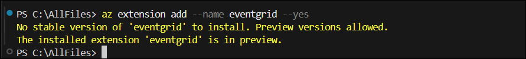

1. Run the appropriate command in the terminal to launch the script.

   **Bash**

   ```bash
   MSYS_NO_PATHCONV=1 bash azdeploy.sh
   ```

   **PowerShell**

   ```powershell
   ./azdeploy.ps1
   ```

   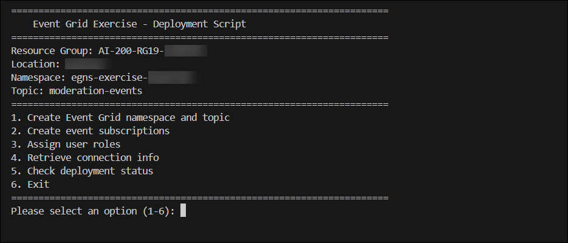

1. When the script is running, enter **1** to launch the **1. Create Event Grid namespace and topic** option.

   This option creates the resource group if it doesn't already exist, deploys an Event Grid Namespace with the Standard SKU, and creates a namespace topic named **moderation-events** configured for CloudEvents v1.0 input. The namespace is the container for your topic and event subscriptions, and pull delivery lets your application connect directly to Event Grid to receive events without needing a separate messaging service.

   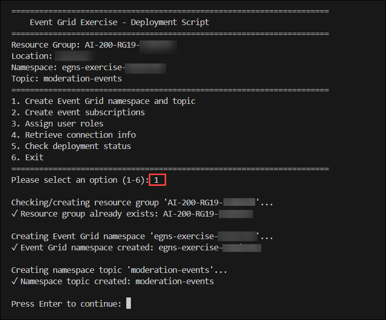

1. Enter **2** to run the **2. Create event subscriptions** option.

   This option creates three event subscriptions on the namespace topic. The **sub-flagged** subscription uses an event type filter that delivers only **com.contoso.ai.ContentFlagged** events. The **sub-approved** subscription delivers only **com.contoso.ai.ContentApproved** events. The **sub-all-events** subscription has no filter and delivers every event published to the topic, serving as an audit log. Each subscription is configured with pull delivery mode, a 60-second receive lock duration, a maximum delivery count of 10, and a one-day event time-to-live.

   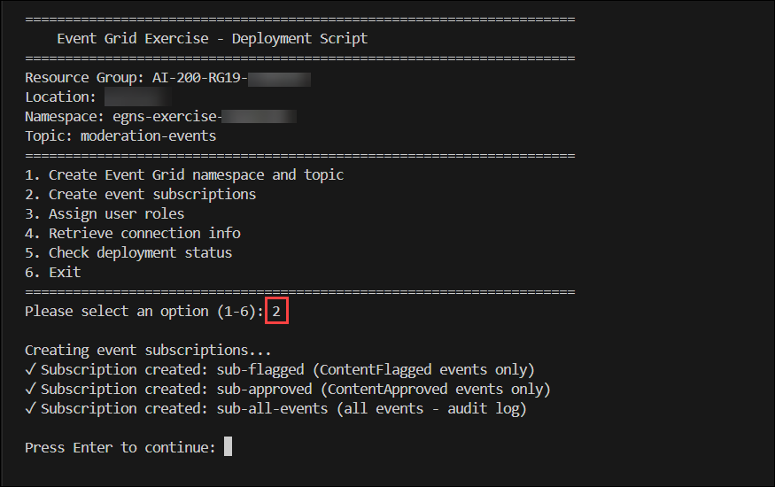

1. Enter **3** to run the **3. Assign user roles** option. This assigns the EventGrid Data Sender role and the EventGrid Data Receiver role on the namespace so your account can publish events and receive events using Microsoft Entra authentication.

   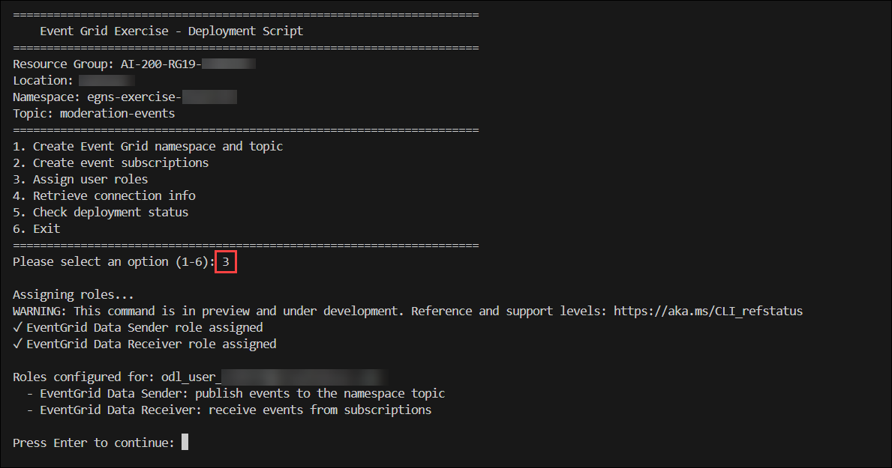

1. Enter **4** to run the **4. Retrieve connection info** option. This creates the environment variable files with the resource group name, namespace name, topic name, and namespace endpoint.

   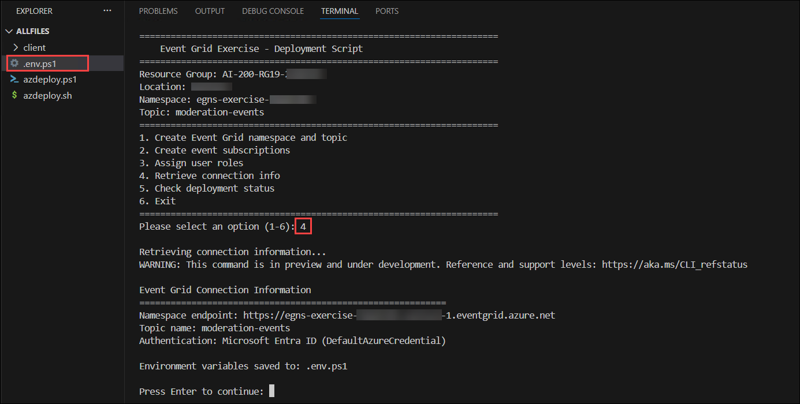

   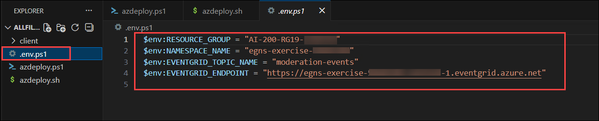

1. Enter **6** to exit the deployment script.

   > **Note:** If you encounter issues later in the exercise, you can rerun the script and enter **5** to run **5. Check deployment status**. This troubleshooting option verifies that the namespace shows **Succeeded**, the topic is created, roles are assigned, and all event subscriptions are provisioned.

   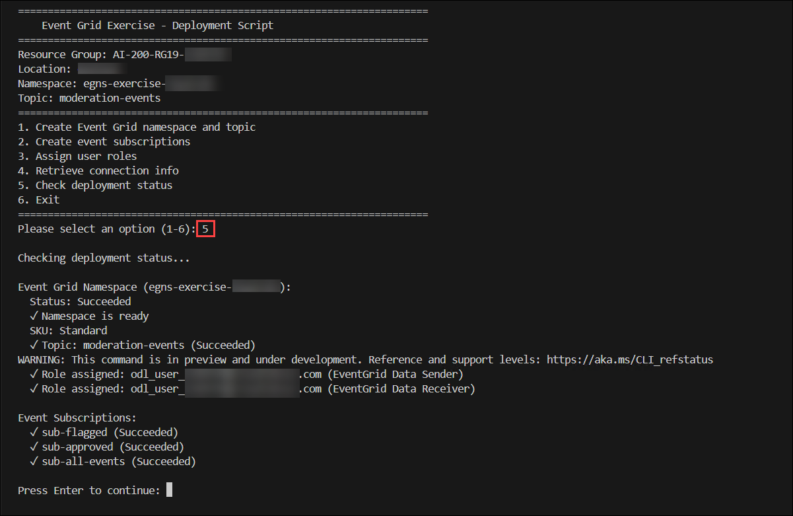

1. Run the appropriate command to load the environment variables into your terminal session from the file created in a previous step.

   **Bash**

   ```bash
   source .env
   ```

   **PowerShell**

   ```powershell
   . .\.env.ps1
   ```

   > **Note:** Keep the terminal open. If you close it and create a new terminal, you need to run this command again to reload the environment variables.

> **Congratulations** on completing the task! Now, it's time to validate it. Here are the steps:
>
> - If you receive a success message, you can proceed to the next task.
> - If not, carefully read the error message and retry the step, following the instructions in the lab guide.
> - If you need any assistance, please contact us at cloudlabs-support@spektrasystems.com. We are available 24/7 to help you out.

<validation step="690b871f-87d9-48b1-83bc-004117278b4e" />

## Task 2: Complete the app

In this task, you'll complete the application's event publishing and pull delivery functionality by adding code to publish CloudEvents, receive and acknowledge events from filtered subscriptions, and inspect and reject events using the Azure Event Grid SDK.

1. Open the **client/event_grid_functions.py** file to begin adding code.

   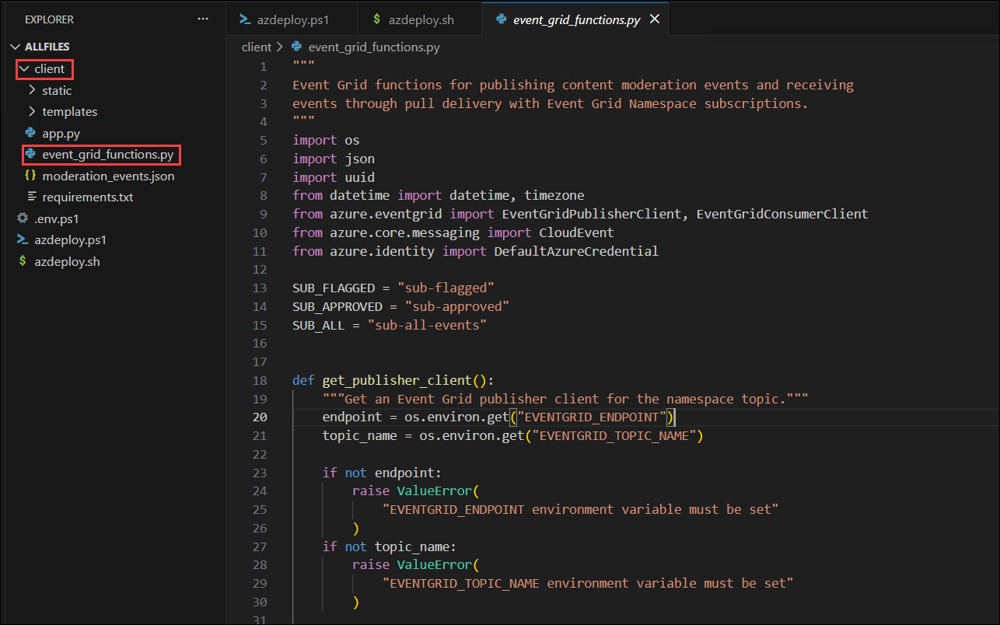

   > **Note:** The code blocks you add to the application should align with the comment for that section of the code.

### Task 2.1: Add code to publish moderation events

In this section, you add code to publish five content moderation events to the Event Grid namespace topic. The events use the CloudEvents v1.0 schema and represent different moderation outcomes — flagged content, approved content, and an escalated review — so you can observe how each subscription's event type filter determines which events it delivers.

The function loads event definitions from the _moderation_events.json_ file, which contains the CloudEvent envelope fields (**type**, **source**, **subject**) and **data** payload for each event. At publish time, the function adds a unique **id** and a current UTC **timestamp** to each event, then creates **CloudEvent** objects and publishes them with the **send()** method in a single request. The **EventGridPublisherClient** is constructed with a **namespace_topic** parameter that targets the namespace topic endpoint, and uses **DefaultAzureCredential** for Microsoft Entra authentication.

1. Locate the **# BEGIN PUBLISH EVENTS FUNCTION** comment and add the following code under the comment. Be sure to check for proper code alignment.

   ```python
   def publish_moderation_events():
       """Publish content moderation events to the Event Grid namespace topic."""
       client = get_publisher_client()
       results = []

       # Load event definitions from the JSON file. Each entry contains the
       # CloudEvent envelope fields (type, source, subject) and the data
       # payload that mirrors a realistic AI content moderation pipeline.
       json_path = os.path.join(os.path.dirname(__file__), "moderation_events.json")
       with open(json_path, "r") as f:
           event_definitions = json.load(f)

       # Build CloudEvent objects from the definitions, adding a unique id
       # and a current UTC timestamp to each event at publish time.
       events = []
       for defn in event_definitions:
           defn["data"]["timestamp"] = datetime.now(timezone.utc).isoformat()
           events.append(
               CloudEvent(
                   type=defn["type"],
                   source=defn["source"],
                   subject=defn["subject"],
                   data=defn["data"],
                   id=str(uuid.uuid4())
               )
           )

       # send() publishes all events to the Event Grid namespace topic in a
       # single request. Event Grid then evaluates each subscription's
       # filters and routes matching events to the configured subscriptions.
       client.send(events)

       for event in events:
           results.append({
               "content_id": event.data["contentId"],
               "event_type": event.type.split(".")[-1],
               "category": event.data["category"],
               "confidence": event.data["confidence"],
               "status": "published"
           })

       return results
   ```

   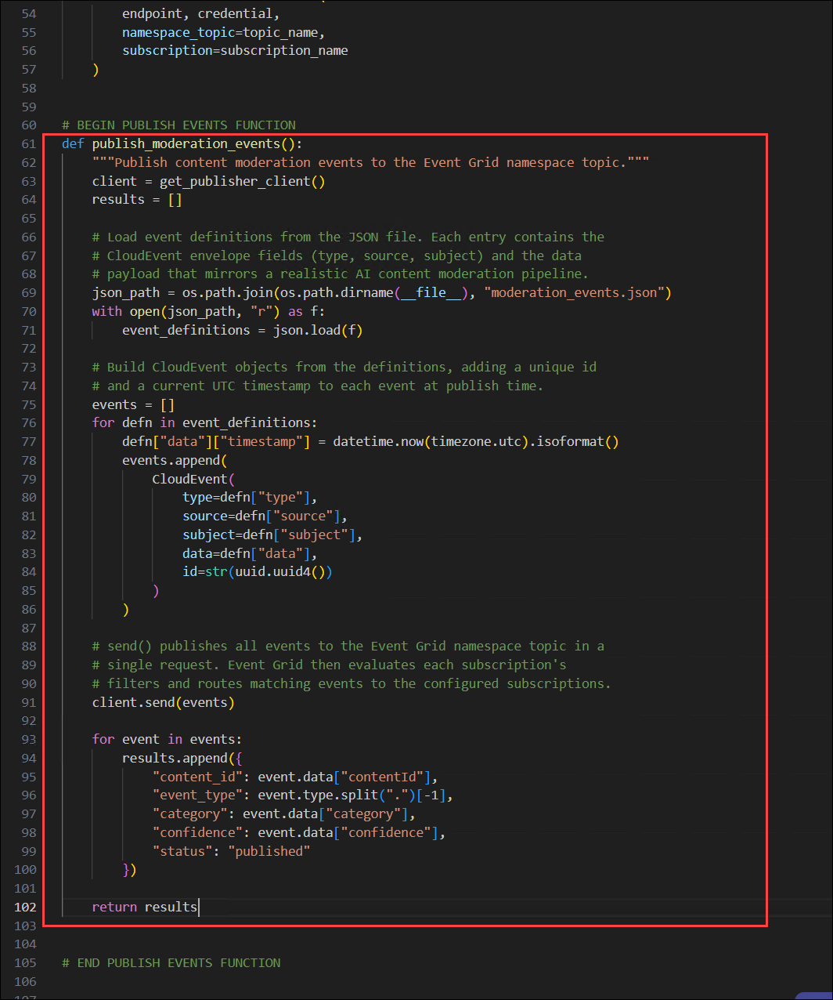

1. Save your changes using **Ctrl + S** and take a few minutes to review the code.

### Task 2.2: Add code to receive and acknowledge events

In this section, you add code to receive events from each subscription and acknowledge them to verify that filtering works. Pull delivery means your application connects to Event Grid and requests events rather than Event Grid pushing them to an endpoint. Each received event includes a lock token that you must acknowledge to permanently remove the event from the subscription, or the event is redelivered after the lock duration expires.

The function creates an **EventGridConsumerClient** for each of the three subscriptions. The **receive()** method returns a list of **ReceiveDetails** objects, each containing the **CloudEvent** (**.event**) and broker properties with a **lock_token**. After processing, the function calls **acknowledge()** with the collected lock tokens to confirm that the events were successfully handled.

1. Locate the **# BEGIN CHECK DELIVERY FUNCTION** comment and add the following code under the comment. Be sure to check for proper code alignment.

   ```python
   def check_filtered_delivery():
       """Receive and acknowledge events from each subscription to verify filtering."""
       flagged = []
       approved = []
       all_events = []

       # Receive from the sub-flagged subscription, which only delivers
       # events where the event type is com.contoso.ai.ContentFlagged.
       # receive() returns a list of ReceiveDetails, each containing
       # the CloudEvent and a lock token for acknowledgment.
       consumer = get_consumer_client(SUB_FLAGGED)
       details = consumer.receive(max_events=10, max_wait_time=10)
       tokens = []
       for detail in details:
           event = detail.event
           flagged.append({
               "content_id": event.data.get("contentId"),
               "category": event.data.get("category"),
               "severity": event.data.get("severity"),
               "confidence": event.data.get("confidence")
           })
           tokens.append(detail.broker_properties.lock_token)
       # acknowledge() removes the events from the subscription so they
       # are not delivered again on the next receive call.
       if tokens:
           consumer.acknowledge(lock_tokens=tokens)

       # Receive from the sub-approved subscription, which only delivers
       # events where the event type is com.contoso.ai.ContentApproved.
       consumer = get_consumer_client(SUB_APPROVED)
       details = consumer.receive(max_events=10, max_wait_time=10)
       tokens = []
       for detail in details:
           event = detail.event
           approved.append({
               "content_id": event.data.get("contentId"),
               "category": event.data.get("category"),
               "severity": event.data.get("severity"),
               "confidence": event.data.get("confidence")
           })
           tokens.append(detail.broker_properties.lock_token)
       if tokens:
           consumer.acknowledge(lock_tokens=tokens)

       # Receive from the sub-all-events subscription, which has no filter
       # and delivers every event published to the topic (audit log).
       consumer = get_consumer_client(SUB_ALL)
       details = consumer.receive(max_events=10, max_wait_time=10)
       tokens = []
       for detail in details:
           event = detail.event
           all_events.append({
               "content_id": event.data.get("contentId"),
               "event_type": event.data.get("modelName", "unknown"),
               "category": event.data.get("category"),
               "confidence": event.data.get("confidence")
           })
           tokens.append(detail.broker_properties.lock_token)
       if tokens:
           consumer.acknowledge(lock_tokens=tokens)

       return {
           "flagged": flagged,
           "approved": approved,
           "all_events": all_events
       }
   ```

   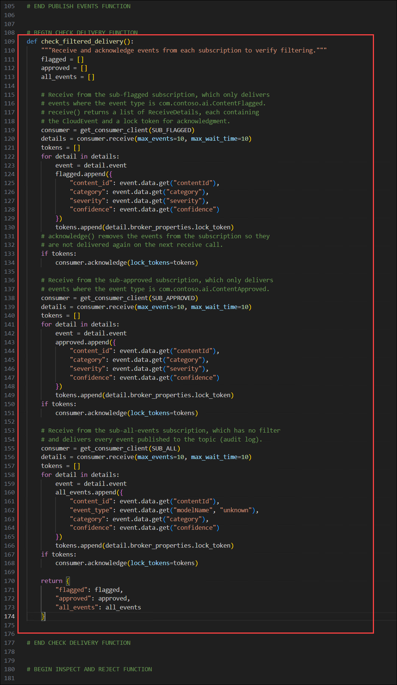

1. Save your changes and take a few minutes to review the code.

### Task 2.3: Add code to inspect and reject an event

In this section, you add code that publishes a single test event, receives it, inspects the full CloudEvent envelope, and then rejects it. Rejecting an event tells Event Grid that the event cannot be processed. This is different from acknowledging, which confirms successful processing. Rejected events are discarded or moved to a dead-letter destination if one is configured.

The function first publishes a test event using the **EventGridPublisherClient** so there is always an event available regardless of whether earlier events were already acknowledged. It then receives the event from the **sub-flagged** subscription, extracts the CloudEvent attributes and broker properties (including **delivery_count**), and calls **reject()** with the lock token.

1. Locate the **# BEGIN INSPECT AND REJECT FUNCTION** comment and add the following code under the comment. Be sure to check for proper code alignment.

   ```python
   def inspect_and_reject():
       """Publish one event, receive it, inspect the CloudEvent envelope, then reject it."""
       publisher = get_publisher_client()

       # Publish a single test event so there is always something to inspect,
       # regardless of whether the student already acknowledged earlier events.
       test_event = CloudEvent(
           type="com.contoso.ai.ContentFlagged",
           source="/services/content-moderation",
           subject="/content/text/test-inspect",
           data={
               "contentId": "test-inspect",
               "contentType": "text",
               "modelName": "text-moderator-v2",
               "modelVersion": "2.4.0",
               "confidence": 0.76,
               "category": "misinformation",
               "severity": "medium",
               "reviewRequired": True,
               "timestamp": datetime.now(timezone.utc).isoformat()
           },
           id=str(uuid.uuid4())
       )
       publisher.send([test_event])

       # Receive from the sub-flagged subscription to pick up the test event.
       consumer = get_consumer_client(SUB_FLAGGED)
       details = consumer.receive(max_events=1, max_wait_time=10)

       if not details:
           return None

       detail = details[0]
       event = detail.event
       lock_token = detail.broker_properties.lock_token
       delivery_count = detail.broker_properties.delivery_count

       # Capture the full CloudEvent envelope before rejecting.
       result = {
           "specversion": "1.0",
           "type": event.type,
           "source": event.source,
           "subject": event.subject,
           "id": event.id,
           "time": str(event.time) if event.time else "",
           "data": event.data,
           "delivery_count": delivery_count,
           "action": "rejected"
       }

       # reject() tells Event Grid this event cannot be processed. The event
       # is moved to the dead-letter location if configured, or discarded
       # if max delivery count has been reached.
       consumer.reject(lock_tokens=[lock_token])

       return result
   ```

   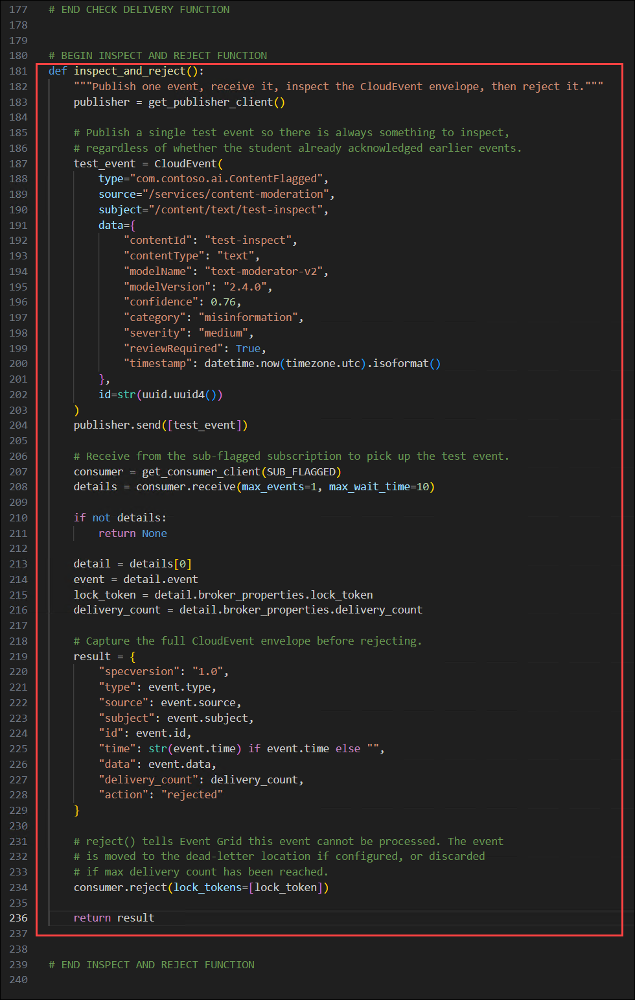

1. Save your changes and take a few minutes to review the code.

## Task 3: Configure the Python environment

In this task, you'll create a Python virtual environment, install the required dependencies, and prepare the client application for execution.

1. Run the following command in the VS Code terminal to navigate to the _client_ directory.

   ```
   cd client
   ```

1. Run the following command to create the Python environment.

   ```
   python -m venv .venv
   ```

1. Run the following command to activate the Python environment.

   **Bash**

   ```bash
   source .venv/Scripts/activate
   ```

   **PowerShell**

   ```powershell
   .\.venv\Scripts\Activate.ps1
   ```

1. Run the following command in the VS Code terminal to install the dependencies.

   ```
   pip install -r requirements.txt
   ```

## Task 4: Run the app

In this task, you'll run the completed application to publish CloudEvents, verify event delivery across filtered subscriptions, acknowledge successfully processed events, and inspect and reject events to validate pull delivery operations.

1. Run the following command in the terminal to start the app. Refer to the commands from earlier in the exercise to activate the environment, if needed, before running the command. If you navigated away from the _client_ directory, run **cd client** first.

   ```
   python app.py
   ```

   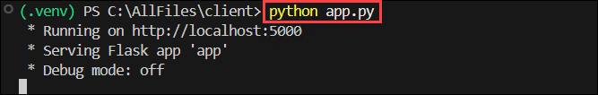

1. Open a browser and navigate to `http://localhost:5000` to access the app.

   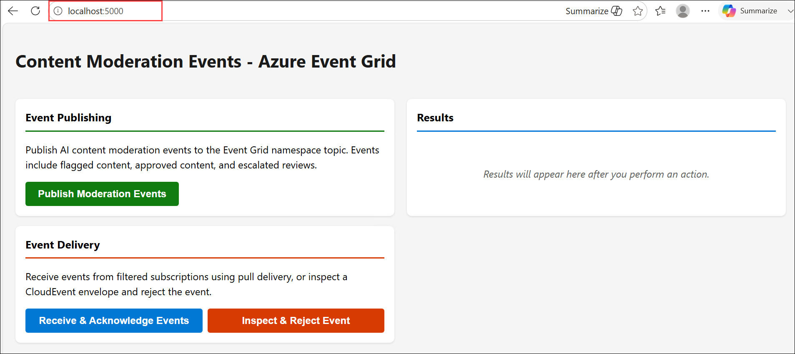

1. Select **Publish Moderation Events (1)** in the left panel. This publishes five content moderation events to the Event Grid namespace topic: two flagged content events, two approved content events, and one escalated review. The results **(2)** in the right panel confirm each event was published along with its content ID, event type, and category.

   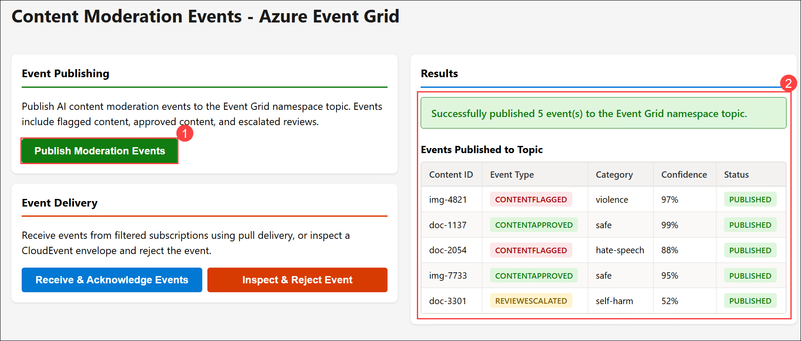

1. Select **Receive & Acknowledge Events (1)** in the left panel. This uses pull delivery to receive events from all three subscriptions and acknowledges them after processing. Verify the following delivery behavior based on the filters configured on each subscription:
   - **Flagged Subscription:** Should contain two events, both with category values indicating policy violations (violence and hate-speech). These are the **ContentFlagged** events.
   - **Approved Subscription:** Should contain two events, both with the category **safe**. These are the **ContentApproved** events.
   - **All Events Subscription:** Should contain all five events regardless of type, serving as the audit log.

   The escalated review event (**ReviewEscalated**) appears only in the all-events subscription because neither the flagged nor approved subscriptions include that event type in their filter. Because the events were acknowledged, selecting this button again will show zero events until you publish more.

   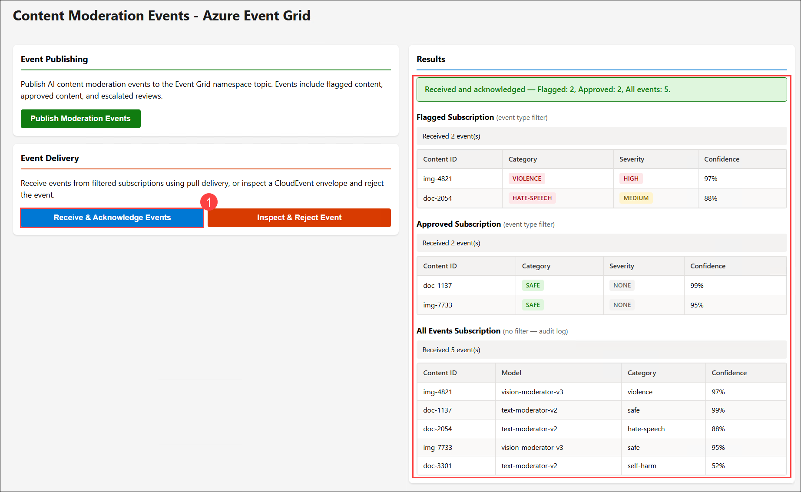

1. Select **Inspect & Reject Event (1)** in the left panel. This publishes a new test event, receives it from the flagged subscription, displays the full CloudEvent envelope including the **delivery_count** from the broker properties, and then rejects the event. The rejection tells Event Grid this event cannot be processed, so Event Grid either discards it or moves it to a dead-letter destination if one is configured.

   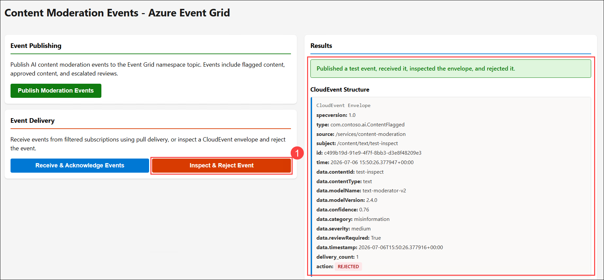

## Summary

In this lab, you implemented event-driven messaging using Azure Event Grid by deploying an Event Grid Namespace, completing the application's event publishing and consumption logic, and running a web application to validate event processing workflows. You learned how to publish CloudEvents to an Event Grid namespace topic, receive events through pull delivery, verify event routing using filtered subscriptions, acknowledge successfully processed events, and reject events that cannot be processed. These capabilities demonstrate how Azure Event Grid enables scalable, event-driven applications with flexible event routing and reliable event processing.

## You have successfully completed the Hands-on Lab!
