# Lab 20: Create an MCP server with Azure Functions

### Estimated Duration : 60 Minutes

## Lab overview

In this exercise, you create an Azure Functions project that exposes tools through the Model Context Protocol (MCP). You configure the Azure Functions MCP extension, define MCP tool trigger functions for document summarization and classification, verify the Python development environment, and test the MCP server locally by connecting to it from GitHub Copilot in Agent mode. This demonstrates how Azure Functions can be used to build MCP-compatible tool servers that AI agents can discover and invoke.

## Lab objectives

In this lab, you'll perform the following tasks:

- **Task 1:** Create an Azure Functions project and configure the MCP server
- **Task 2:** Implement MCP tool trigger functions
- **Task 3:** Verify the Python development environment
- **Task 4:** Test the MCP server locally using GitHub Copilot

> ### **Note:** This lab uses the Azure Functions MCP extension, which is currently in preview and continues to evolve. Features, configuration options, and APIs may change over time. Refer to the latest Azure Functions MCP extension documentation for the most up-to-date guidance.

> ### **Note:** To complete this lab, you must sign in to **GitHub Copilot** using your **personal GitHub account**. GitHub Copilot is used to connect to the local MCP server, discover the MCP tools exposed by the Azure Functions app, and invoke those tools during the testing exercises.

## Task 1: Create a new Functions project with the MCP extension

In this task, you'll create a new Azure Functions project using the Python programming model, configure the Azure Functions MCP extension, and register a local MCP server for development and testing.

You can use the following instruction in your lab guide:

1. In the Windows search box, type **File Explorer (1)**. From the search results, select **File Explorer (2)** to open it.

   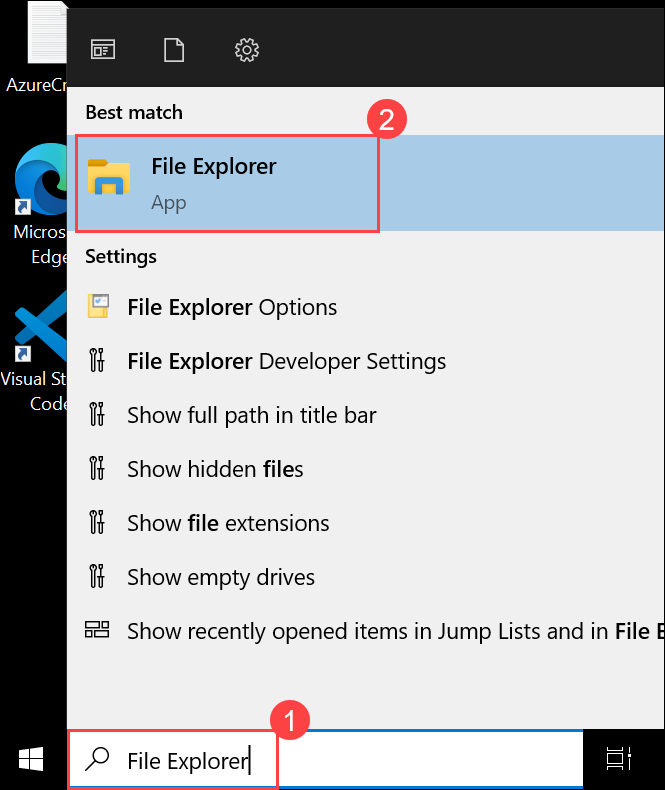

   > **Note:** You can also press **Windows + E** to open File Explorer directly.

1. Navigate to the **C: drive (1)**, right-click in an empty area, select **New (2)**, and then choose **Folder (3)**.

   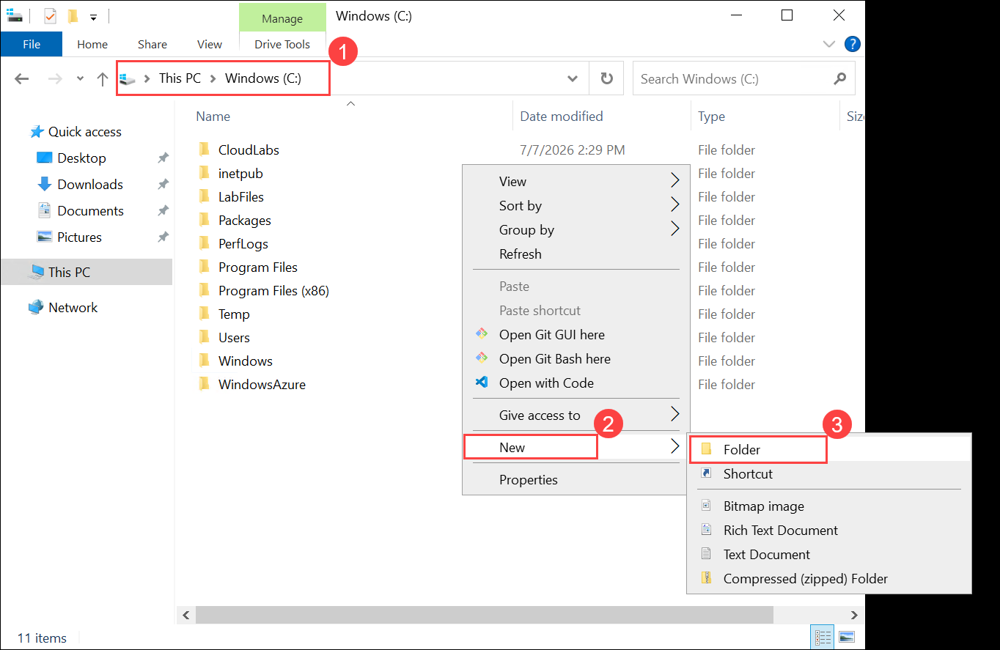

1. Provide the name of the folder as **mcp-server-functions**.

1. Launch **Visual Studio Code** (VS Code) from desktop.

   

1. Select **File Explorer (1)** from left panel. Click **Open Folder** in the menu.

   

1. Navigate to the **C:\ drive (1)**, select the **mcp-server-functions (2)** folder, and then click **Select Folder (3)**.

   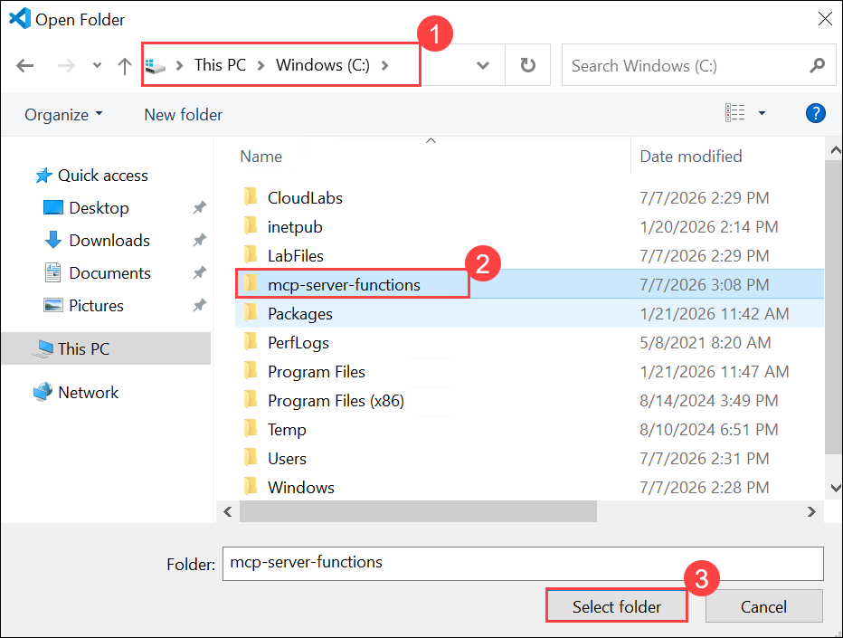

1. If you get "Do you trust the authors of the files in this folder?" prompt, click **Yes, I trust the authors**.

   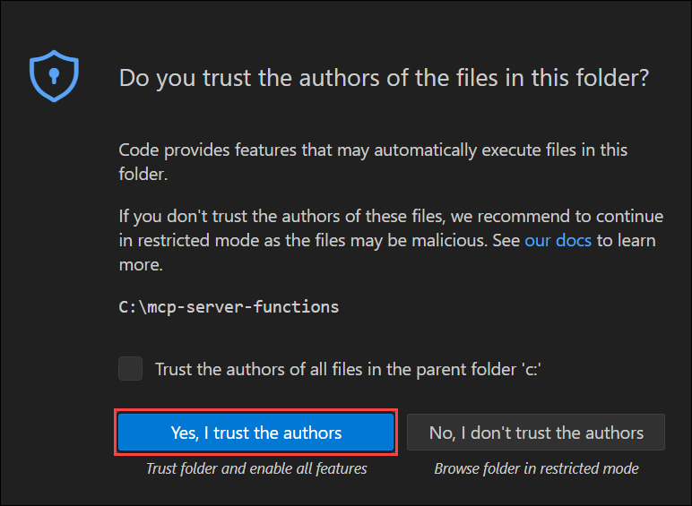

1. In the menu bar, select **ellipsis (...) (1)**, then **Terminal (2)**, and then **New Terminal (3)** to open a terminal window in VS Code.

   

1. Run the following command to install the **Python** extension for Visual Studio Code.

   ```powershell
   code --install-extension ms-python.python
   ```

1. Run the following command to install the **Azure Functions** extension for Visual Studio Code.

   ```powershell
   code --install-extension ms-azuretools.vscode-azurefunctions
   ```

   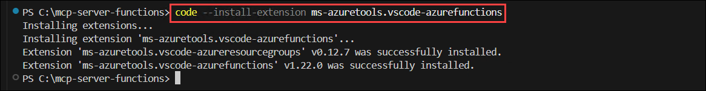

   > **Note:** If the extension is already installed, the command reports that it is up to date.

1. Press **Ctrl + Shift + P** to open the **Command Palette (1)**. Search for **Azure Functions: Create Function...** and select **Azure Functions: Create Function... (2)** from the list of available commands.

   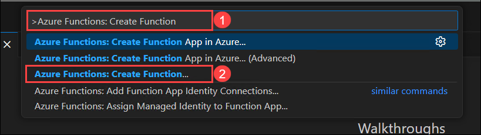

1. Select the **mcp-server-functions** folder that you opened in the previous step.

   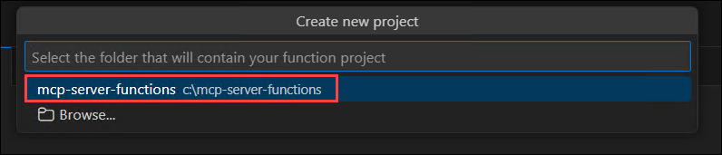

1. When prompted to select the project language, choose **Python**.

   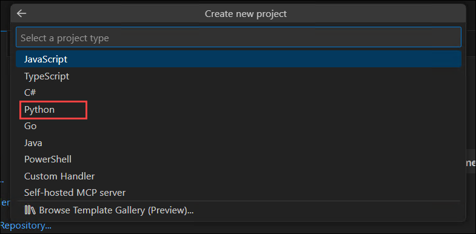

1. When prompted to select a Python interpreter, choose **python 3.12.10**.

   .png>)

1. When prompted to select the first function template, choose **HTTP trigger**.

   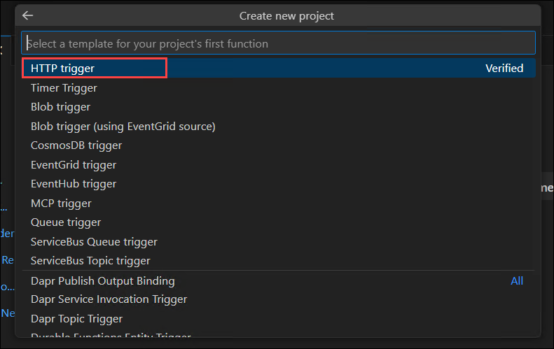

1. For the **Function name**, accept the default value **http_trigger** and press **Enter**.

   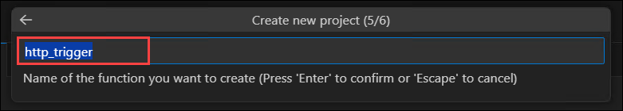

1. For the **Authorization level**, select **ANONYMOUS**.

   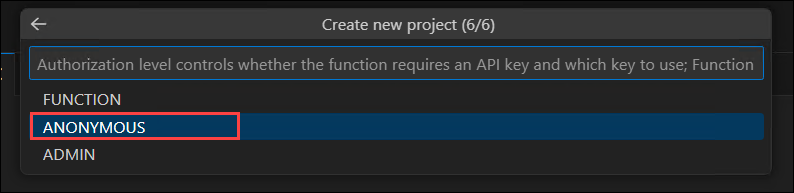

1. The Azure Functions extension creates the project structure, including **function_app.py**, **host.json**, **local.settings.json**, **requirements.txt**, and the **.vscode** folder containing **launch.json**, **tasks.json**, and **extensions.json**. The scaffolded HTTP trigger function in **function_app.py** will be replaced in the next section.

   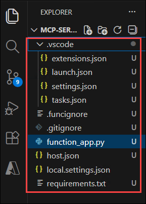

1. Open **host.json** and replace its contents with the following code, then save your changes. The **extensionBundle** must use the **Preview** bundle because the **mcpToolTrigger** binding type is a preview feature not included in the stable extension bundle. The **mcpToolTrigger** section defines the MCP server name, version, and instructions that MCP clients display when connecting.

   ```json
   {
     "version": "2.0",
     "extensionBundle": {
       "id": "Microsoft.Azure.Functions.ExtensionBundle.Preview",
       "version": "[4.*, 5.0.0)"
     },
     "extensions": {
       "mcpToolTrigger": {
         "serverName": "document-tools",
         "serverVersion": "1.0.0",
         "serverInstructions": "Tools for document processing and classification"
       }
     }
   }
   ```

   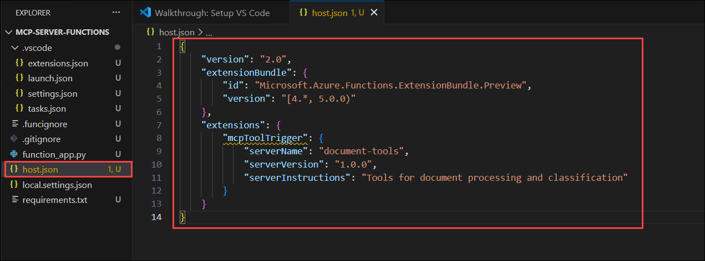

1. Open **local.settings.json** and replace its contents with the following code.

   ```json
   {
     "IsEncrypted": false,
     "Values": {
       "AzureWebJobsStorage": "",
       "FUNCTIONS_WORKER_RUNTIME": "python",
       "AzureWebJobsSecretStorageType": "Files"
     }
   }
   ```

   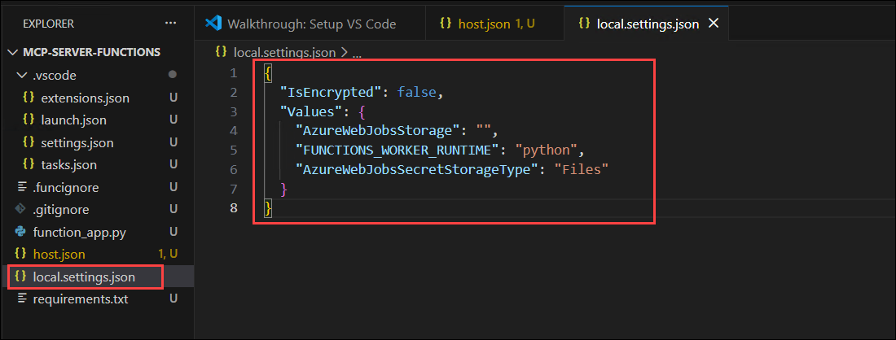

1. In the **Explorer**, expand the **.vscode (1)** folder. Click the **New File (2)** icon, type **mcp.json (3)**, and press **Enter** to create the file.

   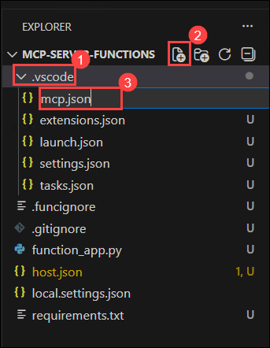

   > **Note:** The **mcp.json** file is used to register the local MCP endpoint with Visual Studio Code. It specifies where Visual Studio Code can discover MCP servers and how to connect to them.

1. Add the following code to the file, then save your changes.

   ```json
   {
     "servers": {
       "document-tools-local": {
         "type": "sse",
         "url": "http://localhost:7071/runtime/webhooks/mcp/sse"
       }
     }
   }
   ```

   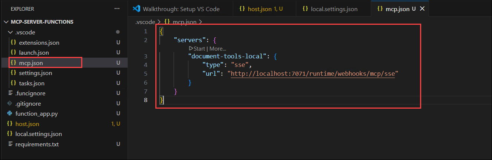

## Task 2: Define MCP tool trigger functions

In this task you define two MCP tool trigger functions that become discoverable tools for MCP clients. Each function uses the **@app.generic_trigger()** decorator with the **mcpToolTrigger** type. You define the tool name, description, and input properties through the trigger configuration, and the function receives tool invocation requests from connected MCP clients.

1. Open **function_app.py** in the Visual Studio Code Explorer sidebar and replace its contents with the following code that defines two MCP tool trigger functions:

   ```python
   import azure.functions as func
   import json
   import logging

   # Initialize the FunctionApp instance that registers all trigger functions
   app = func.FunctionApp()

   # Define an MCP tool trigger that exposes "summarize_text" to MCP clients.
   # toolProperties defines the input schema: a single "text" string parameter.
   @app.generic_trigger(
       arg_name="context",
       type="mcpToolTrigger",
       toolName="summarize_text",
       description="Summarize a block of text into key points",
       toolProperties='[{"propertyName": "text", "propertyType": "string", "description": "The text to summarize"}]'
   )
   def summarize_text(context: str) -> str:
       # Log the raw payload for debugging
       logging.info(f"summarize_text raw context: {context}")
       # Parse the outer request envelope sent by the MCP client
       request = json.loads(context)
       logging.info(f"summarize_text parsed request: {request}")
       # Extract the tool arguments from the request
       arguments = request.get("arguments", {})
       # Retrieve the "text" property defined in toolProperties
       text = arguments.get("text", "")

       # In a real implementation, call an Azure AI service here
       summary = f"Summary of {len(text.split())} words: {text[:100]}..."

       # Return a JSON response; the "content" field is displayed to the MCP client
       return json.dumps({"content": summary})

   # Define a second MCP tool trigger that exposes "classify_document" to MCP clients.
   # toolProperties defines two input parameters: "text" and "categories".
   @app.generic_trigger(
       arg_name="context",
       type="mcpToolTrigger",
       toolName="classify_document",
       description="Classify a document into a category",
       toolProperties='[{"propertyName": "text", "propertyType": "string", "description": "The document text to classify"}, {"propertyName": "categories", "propertyType": "string", "description": "Comma-separated list of possible categories"}]'
   )
   def classify_document(context: str) -> str:
       # Log the raw payload for debugging
       logging.info(f"classify_document raw context: {context}")
       # Parse the outer request envelope sent by the MCP client
       request = json.loads(context)
       logging.info(f"classify_document parsed request: {request}")
       # Extract the tool arguments from the request
       arguments = request.get("arguments", {})
       # Retrieve the "text" and "categories" properties defined in toolProperties
       text = arguments.get("text", "")
       categories = arguments.get("categories", "general")

       # In a real implementation, call an Azure AI service here
       # Split the comma-separated categories string into a list
       category_list = [c.strip() for c in categories.split(",")]
       # Select the first category as the classification result
       selected_category = category_list[0] if category_list else "unknown"

       # Return a JSON response with the classification result
       return json.dumps({
           "content": f"Classification: {selected_category}",
           "category": selected_category
       })
   ```

   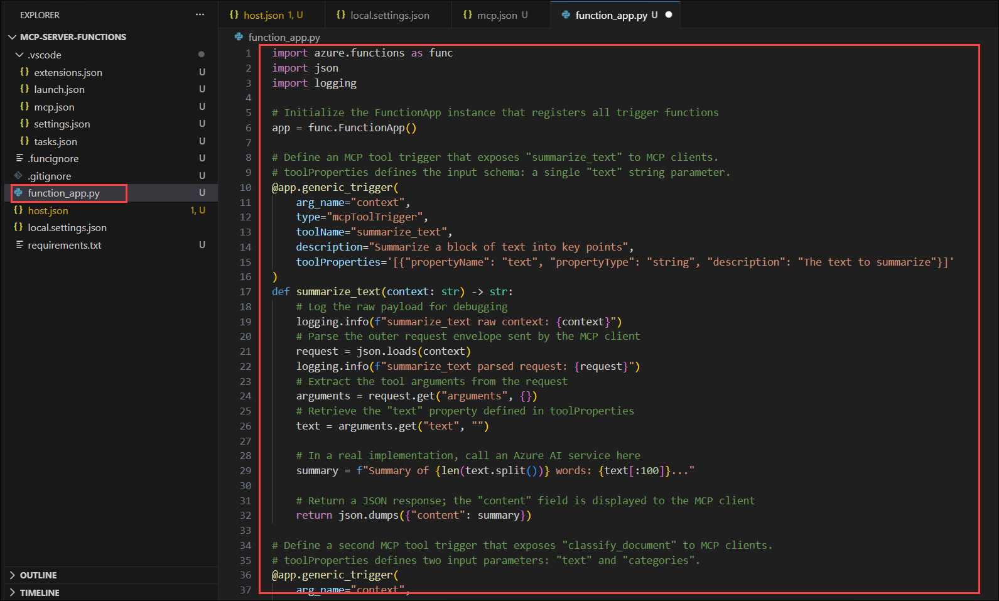

1. Save the file using **Ctrl + S** and take a few minutes to review the code. Each function uses the **@app.generic_trigger()** decorator with the **mcpToolTrigger** type. The **toolName** appears in the MCP client's tool list, and **description** helps language models understand when to use each tool. The **toolProperties** parameter defines the input schema as a JSON array of property definitions.

## Task 3: Verify the Python environment

In this task you verify that Visual Studio Code is using the Python interpreter from the virtual environment that the Azure Functions extension created during project setup.

1. Press **Ctrl+Shift+P** to open the Command Palette and run the **Python: Select Interpreter** command.

   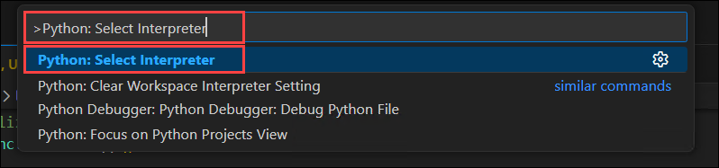

1. In the **Select Interpreter** window, click on **.venv (3.12.10)**.

   .png>)

1. Select the interpreter from the **.venv** folder in the project directory (for example, **./.venv/bin/python**). This ensures the debugger and terminal use the correct environment when you start the Functions runtime with **F5**.

   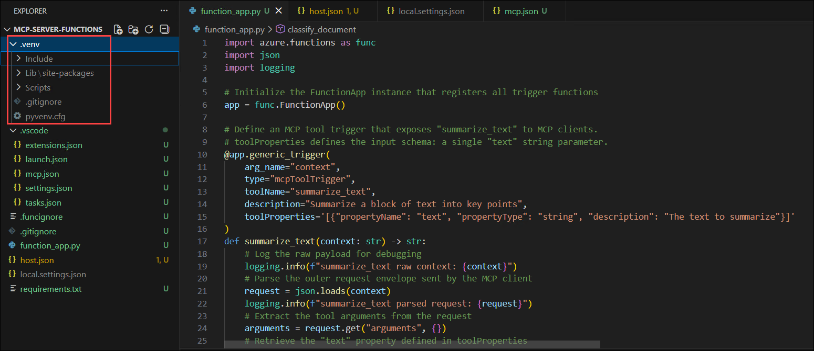

## Task 4: Test the MCP server locally

> ### **Note:** In this task, you will sign in to **GitHub Copilot** using your **personal GitHub account**. You will then connect GitHub Copilot (Agent mode) to the locally running MCP server, verify that the exposed tools are discovered successfully, and test tool invocation using both explicit and natural language prompts.

In this task, you'll start the Azure Functions runtime, connect GitHub Copilot in Agent mode to the local MCP server, verify that the MCP tools are discovered successfully, and test tool invocation using both explicit and natural language prompts.

1. Press **F5** to start the Functions runtime with the debugger attached. If you receive a warning about a required storage account, select **Skip for now** . Visual Studio Code launches Core Tools, attaches the debugger, and opens the terminal panel showing the function endpoints.

   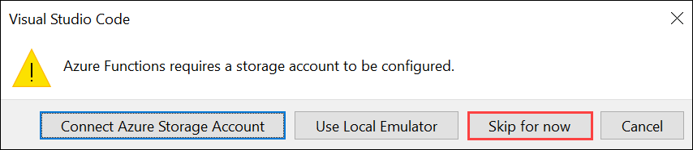

   > **Note:** You can also start the runtime without the debugger by running `func start` in the integrated terminal.

1. The terminal output shows the registered MCP tool trigger functions. Verify you see output similar to:

   ```
   Functions:
       classify_document: mcpToolTrigger
       summarize_text: mcpToolTrigger
   ```

   If both functions appear, the MCP server is running and ready for connections.

   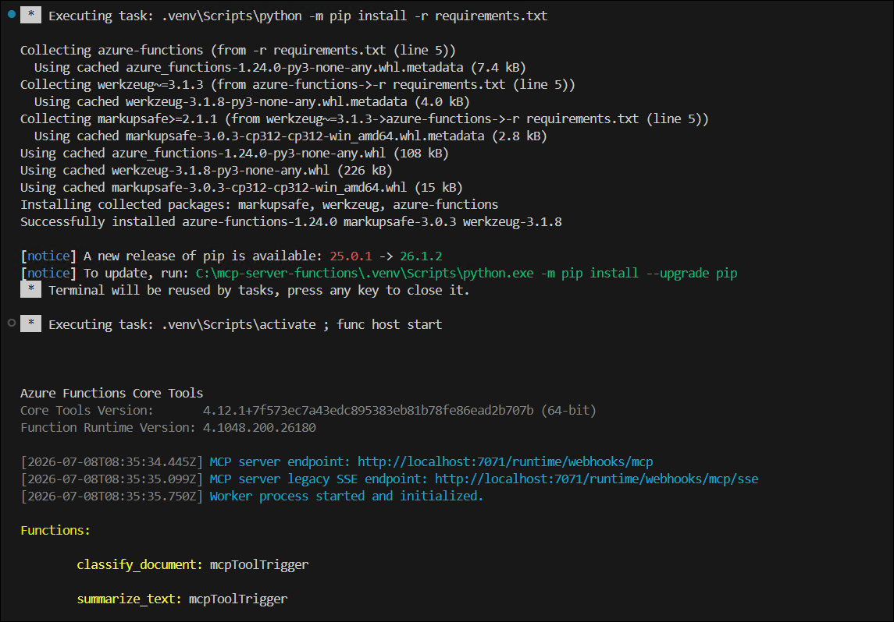

1. Visual Studio Code detects the _.vscode/mcp.json_ file you created earlier and connects to the MCP server.

1. Open GitHub Copilot chat by selecting from top **Toggle chat**.

   .png>)

1. In the GitHub Copilot Chat pane, switch to **Agent (1)** mode. Select the **Tools icon (wrench) (2)**, expand the **document-tools-local (3)** tool group (which corresponds to the server configured in .vscode/mcp.json), and click Update **(4)**. Verify that the **summarize_text** and **classify_document** tools **(5)** are displayed with their descriptions, then select **OK (6)**.

   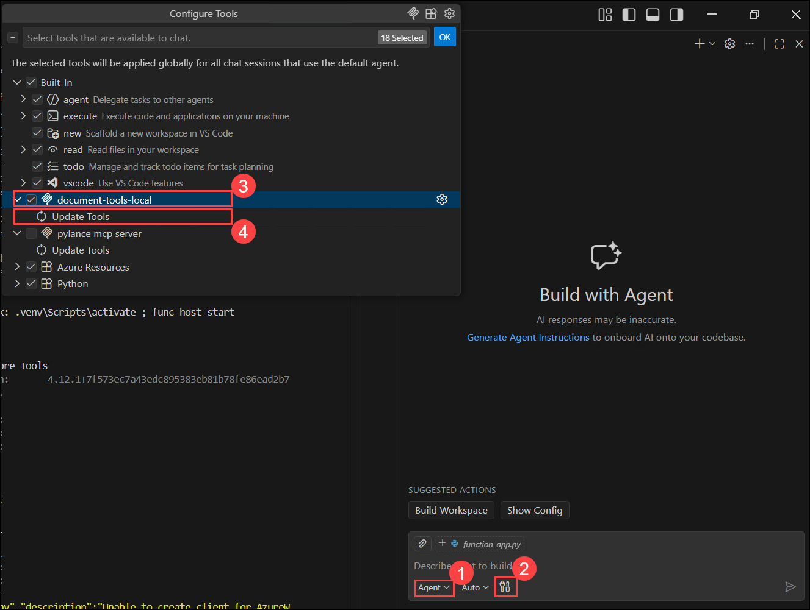

   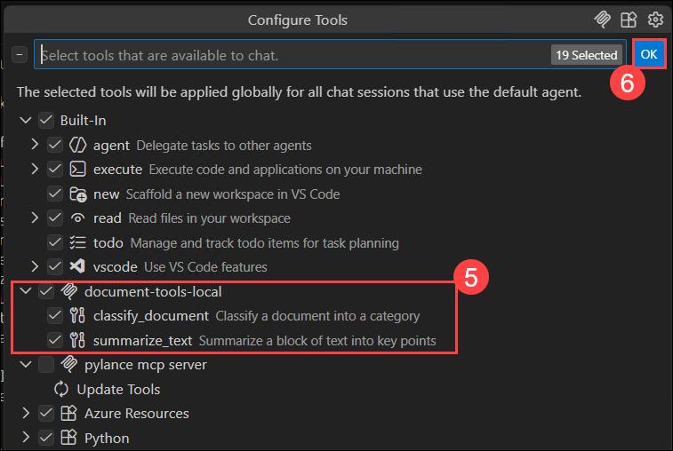

1. Sign in to **GitHub Copilot** using your personal GitHub account by selecting **Continue with GitHub**.

   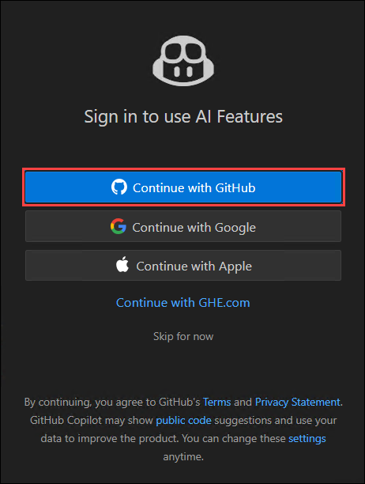

1. After entering your personal GitHub account credentials, the **Authorize Visual Studio Code** window opens. Select **Continue** to authorize Visual Studio Code.

   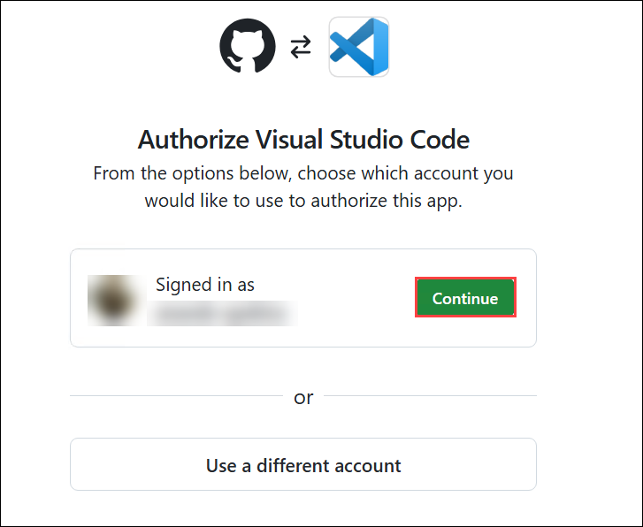

1. When the **This site is trying to open Visual Studio Code.** dialog appears, select **Continue** to launch Visual Studio Code and complete the sign-in process.

   .png>)

### Task 4.1: Test with explicit prompts

Explicit prompts that name a tool directly are the most reliable way to trigger an MCP tool. The model will usually invoke the tool, but it may still rephrase or summarize the tool's raw output in its response. If a tool is not invoked, check the terminal output to confirm, then try submitting the prompt again.

1. Test the **classify_document** tool by entering the following prompt in the Copilot chat. **Note:** When Copilot invokes an MCP tool for the first time, you may see a permission prompt. Select **Allow** to let Copilot call the tool.

   ```
   Use the classify_document tool to classify this text: 'This agreement is entered into by Party A and Party B'  with categories: contract, invoice, memo
   ```

   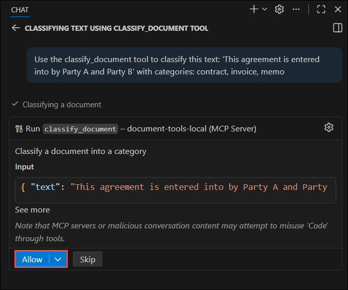

   Copilot invokes the tool and returns a response. Verify the result contains a classification of **contract**. The stub implementation selects the first category from the comma-separated list, so the result matches the first category you provided in the prompt. Check the terminal output for the function invocation log entry.

   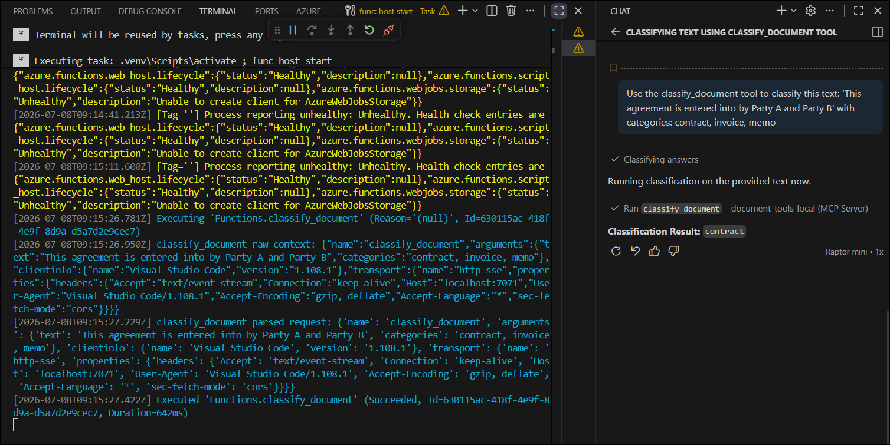

1. Test the **summarize_text** tool by entering the following prompt in the Copilot chat.

   ```
   Use the summarize_text tool to summarize this text: 'Azure Functions is a serverless compute service that lets you run event-triggered code without having to explicitly provision or manage infrastructure.'
   ```

   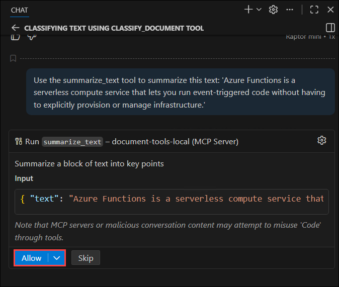

   Verify the result contains a summary string starting with **Summary of** followed by the word count and a truncated preview of the input text.

   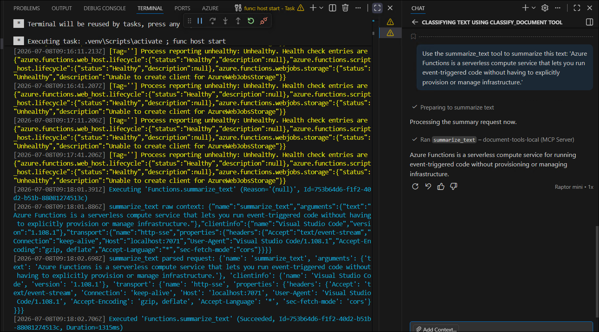

### Task 4.2: Test with natural language prompts

Natural language prompts are more likely to answer a prompt directly without invoking a tool, since the model must decide on its own whether a tool is relevant. Check the terminal output for logging entries to confirm whether a tool was actually invoked. If it was not, try rephrasing the prompt or explicitly naming the tool.

1. Enter the following prompt in the Copilot chat:

   ```
   Is the following text an invoice, contract, or memo?
   'Invoice B1234 for services rendered in January 2026. Total amount due: $5,000.'
   ```

   **Alternate prompt:**

   ```
   Use one of your available tools to classify this text: Is the following text an invoice, contract, or memo?
   'Invoice B1234 for services rendered in January 2026. Total amount due: $5,000.'
   ```

   Copilot should recognize that the **classify_document** tool matches this request and invoke it automatically. Verify the result returns a classification. Check the terminal output to confirm the function was invoked.

   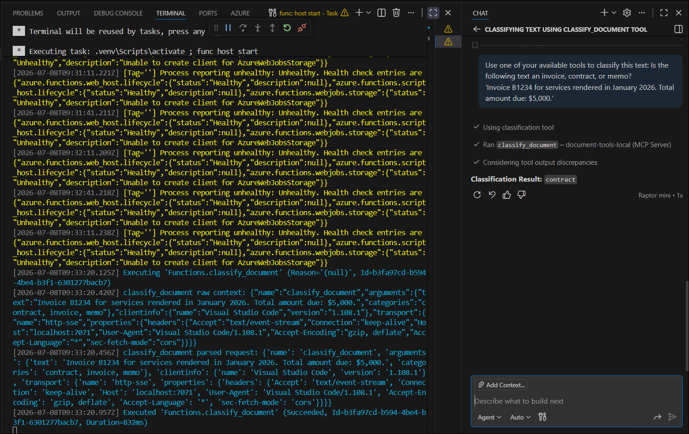

1. Enter the following prompt to test natural tool discovery for the **summarize_text** tool:

   ```
   Give me a brief summary of this text: 'Machine learning models require large datasets for training. The quality of the training data directly impacts model accuracy. Data preprocessing steps include cleaning, normalization, and feature extraction.'
   ```

   **Alternate Prompt:**

   ```
   Use one of your available tools to summarize this text: 'Machine learning models require large datasets for training. The quality of the training data directly impacts model accuracy. Data preprocessing steps include cleaning, normalization, and feature extraction.'
   ```

   Copilot should invoke the **summarize_text** tool and return a summary. Verify the terminal output shows the function invocation.

   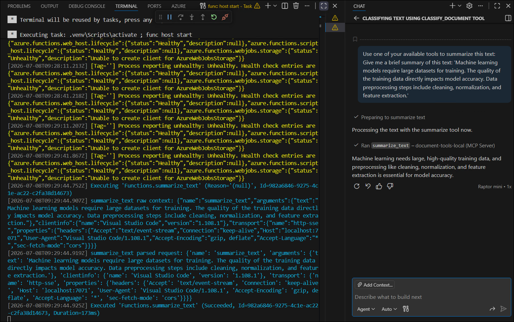

1. Press **Shift+F5** to stop the debugger and shut down the Functions runtime.

### Next steps

In a production scenario, you would deploy the function app to Azure using the Flex Consumption plan, authenticate MCP client connections with the **mcp_extension** system key, and replace the placeholder logic in each tool function with calls to Azure AI services using **DefaultAzureCredential** and the function app's managed identity. For more details, see the [Azure Functions MCP extension documentation](/azure/azure-functions/functions-bindings-mcp-trigger).

## Summary

In this lab, you created an Azure Functions project that acts as an MCP server by using the Azure Functions MCP extension. You configured the MCP server, implemented custom MCP tool trigger functions, verified the Python development environment, and tested the server locally through GitHub Copilot in Agent mode. By the end of the exercise, you successfully exposed Azure Functions as discoverable MCP tools and validated that AI clients could invoke them to perform document processing tasks.

## You have successfully completed the Hands-on Lab!
